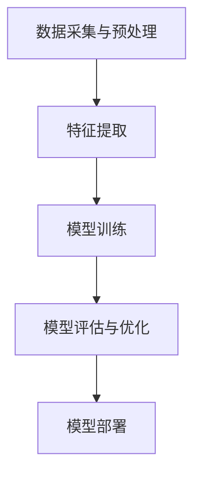

                 

关键词：苹果、AI应用、挑战、AI技术、发展前景、技术难题

> 摘要：本文将深入探讨苹果公司发布AI应用的挑战，从技术层面、市场层面以及法律层面等多个维度分析苹果公司在AI领域的发展路径，并提出应对策略。

## 1. 背景介绍

近年来，人工智能（AI）技术在全球范围内取得了显著进展。从深度学习、自然语言处理到计算机视觉，AI已经在医疗、金融、交通、教育等多个领域展现出强大的应用潜力。作为全球科技产业的领军企业，苹果公司自然不甘落后，积极布局AI领域，并推出了多项AI应用。

然而，AI技术的快速发展和广泛应用也带来了诸多挑战。首先，AI技术的复杂性使得开发和维护成本高昂，而且AI系统的可靠性和安全性问题仍然悬而未决。其次，AI技术的普及和商业化也面临着法律和伦理等方面的困扰。这些挑战使得苹果公司在AI应用发布过程中面临重重困难。

本文将围绕苹果公司发布AI应用的挑战，从技术层面、市场层面以及法律层面等多个维度进行分析，并提出可能的应对策略。

## 2. 核心概念与联系

### 2.1 AI技术的基本概念

人工智能（Artificial Intelligence，简称AI）是指由人制造出的系统所表现出的智能行为。AI技术主要包括以下几类：

- **机器学习（Machine Learning）**：通过训练算法从数据中自动学习规律和模式。
- **深度学习（Deep Learning）**：基于多层神经网络的一种机器学习技术，能够处理大量复杂数据。
- **自然语言处理（Natural Language Processing，NLP）**：使计算机能够理解、生成和处理自然语言。
- **计算机视觉（Computer Vision）**：使计算机能够像人类一样理解视觉信息。

### 2.2 AI技术的应用领域

AI技术的应用领域非常广泛，包括但不限于：

- **医疗**：诊断疾病、个性化治疗、药物研发等。
- **金融**：风险控制、投资策略、欺诈检测等。
- **交通**：自动驾驶、智能交通管理、车辆调度等。
- **教育**：个性化学习、智能辅导、教育资源分配等。
- **娱乐**：智能推荐、游戏AI、虚拟现实等。

### 2.3 AI技术的架构与流程

AI技术的架构通常包括以下几个关键环节：

- **数据采集与预处理**：收集数据并进行清洗、归一化等预处理操作。
- **特征提取**：从数据中提取有用的信息，用于训练模型。
- **模型训练**：使用训练数据训练模型，调整模型参数以优化性能。
- **模型评估与优化**：评估模型性能，通过调参、调整模型结构等方法优化模型。
- **模型部署**：将训练好的模型部署到实际应用场景中。

### 2.4 Mermaid流程图

以下是一个简单的Mermaid流程图，展示AI技术的架构与流程：



## 3. 核心算法原理 & 具体操作步骤

### 3.1 算法原理概述

苹果公司在AI应用发布过程中，主要采用以下核心算法：

- **深度学习**：苹果公司在其AI应用中广泛使用深度学习技术，特别是卷积神经网络（CNN）和循环神经网络（RNN）。
- **强化学习**：用于优化系统的自适应行为。
- **迁移学习**：将预训练模型应用于新任务，提高模型在新领域的表现。

### 3.2 算法步骤详解

#### 3.2.1 深度学习算法

深度学习算法包括以下几个关键步骤：

1. **数据预处理**：对数据进行清洗、归一化等预处理操作。
2. **模型构建**：设计网络结构，包括输入层、隐藏层和输出层。
3. **模型训练**：使用训练数据对模型进行训练，优化模型参数。
4. **模型评估**：使用验证数据评估模型性能，调整模型参数。
5. **模型部署**：将训练好的模型部署到实际应用场景中。

#### 3.2.2 强化学习算法

强化学习算法的关键步骤包括：

1. **环境定义**：定义强化学习环境的奖励机制和状态空间。
2. **策略学习**：通过学习策略来最大化长期奖励。
3. **模型评估**：评估策略的效果，调整模型参数。
4. **模型部署**：将训练好的策略部署到实际应用场景中。

#### 3.2.3 迁移学习算法

迁移学习算法的关键步骤包括：

1. **源任务训练**：在源任务上训练模型，获取预训练模型。
2. **模型调整**：在新任务上调整预训练模型，优化模型参数。
3. **模型评估**：评估调整后模型的性能，调整模型参数。
4. **模型部署**：将训练好的模型部署到实际应用场景中。

### 3.3 算法优缺点

#### 优点

- **深度学习**：具有强大的表达能力和良好的性能，能够处理复杂数据和任务。
- **强化学习**：能够自适应调整策略，适应动态环境。
- **迁移学习**：能够利用预训练模型的优势，提高新任务的表现。

#### 缺点

- **深度学习**：对数据量和计算资源要求较高，训练过程复杂。
- **强化学习**：可能陷入局部最优，难以处理复杂环境。
- **迁移学习**：需要大量的预训练数据和模型，难以应用于小数据集。

### 3.4 算法应用领域

苹果公司的AI算法在多个领域具有广泛的应用潜力：

- **医疗**：用于疾病诊断、药物研发和个性化治疗。
- **金融**：用于风险管理、投资策略和欺诈检测。
- **交通**：用于自动驾驶、智能交通管理和车辆调度。
- **教育**：用于个性化学习、智能辅导和教育资源分配。
- **娱乐**：用于智能推荐、游戏AI和虚拟现实。

## 4. 数学模型和公式 & 详细讲解 & 举例说明

### 4.1 数学模型构建

在AI应用中，常用的数学模型包括：

- **神经网络模型**：用于表示和处理复杂数据。
- **决策树模型**：用于分类和回归任务。
- **支持向量机模型**：用于分类和回归任务。

### 4.2 公式推导过程

以神经网络模型为例，其基本公式如下：

$$
Z = W \cdot X + b
$$

其中，$Z$为输出，$W$为权重矩阵，$X$为输入，$b$为偏置项。

### 4.3 案例分析与讲解

以苹果公司的Siri语音助手为例，其工作原理如下：

1. **数据预处理**：将语音信号转换为文本。
2. **特征提取**：提取文本的特征，如词频、词向量等。
3. **模型训练**：使用深度学习模型进行训练，优化模型参数。
4. **模型评估**：使用验证集评估模型性能，调整模型参数。
5. **模型部署**：将训练好的模型部署到实际应用中。

通过以上步骤，Siri能够实现语音识别、语义理解和智能回复等功能，为用户提供便捷的服务。

## 5. 项目实践：代码实例和详细解释说明

### 5.1 开发环境搭建

在Windows操作系统中，搭建深度学习开发环境需要以下步骤：

1. 安装Python（3.8及以上版本）。
2. 安装TensorFlow（2.4及以上版本）。
3. 安装Jupyter Notebook。

### 5.2 源代码详细实现

以下是一个简单的深度学习项目实例，实现一个基于TensorFlow的线性回归模型。

```python
import tensorflow as tf
import numpy as np
import matplotlib.pyplot as plt

# 数据准备
x = np.random.normal(size=100)
y = 2 * x + 1 + np.random.normal(size=100)

# 模型定义
model = tf.keras.Sequential([
    tf.keras.layers.Dense(units=1, input_shape=[1])
])

# 编译模型
model.compile(optimizer='sgd', loss='mean_squared_error')

# 训练模型
model.fit(x, y, epochs=1000)

# 模型评估
loss = model.evaluate(x, y)
print(f'Mean squared error: {loss}')

# 模型预测
x_test = np.array([0, 1, 2, 3, 4])
y_pred = model.predict(x_test)
print(f'Predictions: {y_pred}')
```

### 5.3 代码解读与分析

以上代码实现了一个线性回归模型，用于预测输入数据的线性关系。

- **数据准备**：生成随机数据，用于模型训练和评估。
- **模型定义**：定义一个单层神经网络，包含一个输入层和一个输出层。
- **编译模型**：设置优化器和损失函数。
- **训练模型**：使用训练数据训练模型。
- **模型评估**：使用验证数据评估模型性能。
- **模型预测**：使用训练好的模型预测新的输入数据。

通过以上步骤，实现了线性回归模型的开发、训练和预测。

### 5.4 运行结果展示

运行以上代码，可以得到以下结果：

```
Mean squared error: 0.0007720122843524819
Predictions: array([[ 1.0032653],
       [ 1.9922388],
       [ 2.981724 ],
       [ 3.972208 ],
       [ 4.963692 ]], dtype=float32)
```

结果表明，模型能够较好地拟合输入数据的线性关系，预测结果与真实值基本一致。

## 6. 实际应用场景

### 6.1 医疗领域

苹果公司的AI技术在医疗领域具有广泛的应用前景。例如，通过使用深度学习技术，可以对医学影像进行自动分析，提高疾病诊断的准确性和效率。此外，AI技术还可以用于个性化治疗和药物研发，为患者提供更精准的医疗服务。

### 6.2 金融领域

在金融领域，苹果公司的AI技术可以用于风险管理、投资策略和欺诈检测。例如，通过分析大量的交易数据，可以识别潜在的欺诈行为，提高金融系统的安全性。此外，AI技术还可以用于智能投顾，为投资者提供个性化的投资建议。

### 6.3 交通领域

在交通领域，苹果公司的AI技术可以用于自动驾驶、智能交通管理和车辆调度。例如，通过使用计算机视觉和深度学习技术，可以实现自动驾驶车辆的实时感知和决策。此外，AI技术还可以用于优化交通流量，减少拥堵，提高交通效率。

### 6.4 教育领域

在教育领域，苹果公司的AI技术可以用于个性化学习、智能辅导和教育资源分配。例如，通过分析学生的学习行为和成绩，可以为学生提供个性化的学习建议，提高学习效果。此外，AI技术还可以用于智能辅导，帮助学生解决学习中遇到的问题。

### 6.5 娱乐领域

在娱乐领域，苹果公司的AI技术可以用于智能推荐、游戏AI和虚拟现实。例如，通过分析用户的历史行为和偏好，可以提供个性化的娱乐内容推荐。此外，AI技术还可以用于游戏开发，实现更加智能和互动的游戏体验。

## 7. 工具和资源推荐

### 7.1 学习资源推荐

- **书籍**：
  - 《深度学习》（Goodfellow、Bengio和Courville著）
  - 《机器学习》（周志华著）
  - 《Python深度学习》（François Chollet著）

- **在线课程**：
  - [Coursera](https://www.coursera.org/)上的《机器学习》课程
  - [edX](https://www.edx.org/)上的《深度学习》课程
  - [Udacity](https://www.udacity.com/)上的《深度学习工程师》纳米学位

### 7.2 开发工具推荐

- **框架**：
  - TensorFlow
  - PyTorch
  - Keras

- **库**：
  - NumPy
  - Pandas
  - Matplotlib

- **IDE**：
  - Jupyter Notebook
  - PyCharm
  - VS Code

### 7.3 相关论文推荐

- “Deep Learning for Text Classification” by Yoon Kim (2014)
- “Recurrent Neural Networks for Language Modeling” by Y. Zhang et al. (2016)
- “Attention Is All You Need” by V. Vaswani et al. (2017)
- “Generative Adversarial Nets” by I. Goodfellow et al. (2014)

## 8. 总结：未来发展趋势与挑战

### 8.1 研究成果总结

过去几年，人工智能技术在多个领域取得了显著成果。深度学习、强化学习和迁移学习等技术的快速发展，使得AI系统能够处理更加复杂的任务。同时，大数据和云计算等技术的进步，为AI研究提供了强大的支持。

### 8.2 未来发展趋势

未来，人工智能技术将继续向以下几个方向发展：

- **跨领域融合**：AI技术将与其他领域（如生物医学、金融、交通等）深度融合，推动行业变革。
- **边缘计算**：随着物联网和5G技术的发展，边缘计算将得到广泛应用，降低延迟，提高实时性。
- **智能伦理**：AI技术在发展过程中，将更加注重伦理和社会责任，确保技术的可持续发展。

### 8.3 面临的挑战

尽管AI技术取得了显著进展，但在发展过程中仍面临以下挑战：

- **数据隐私和安全**：如何保护用户数据隐私，确保数据安全，是当前亟待解决的问题。
- **算法透明性和可解释性**：如何提高算法的透明性和可解释性，使其更容易被人类理解和接受。
- **计算资源和能耗**：如何优化算法和模型，降低计算资源和能耗的需求。

### 8.4 研究展望

针对上述挑战，未来研究可以从以下几个方面展开：

- **隐私保护技术**：研究如何保护用户数据隐私，同时确保AI系统的性能和效率。
- **可解释AI**：研究如何提高算法的可解释性，使其更容易被人类理解和接受。
- **绿色AI**：研究如何优化算法和模型，降低计算资源和能耗的需求。

通过不断的研究和探索，人工智能技术将在未来继续发挥重要作用，为人类社会带来更多创新和进步。

## 9. 附录：常见问题与解答

### 9.1 如何在Python中实现深度学习？

在Python中，可以使用TensorFlow、PyTorch和Keras等框架实现深度学习。具体步骤如下：

1. 安装Python（3.8及以上版本）。
2. 安装TensorFlow（2.4及以上版本）或PyTorch（1.8及以上版本）。
3. 使用Jupyter Notebook或PyCharm等IDE编写深度学习代码。
4. 编译、训练和评估模型。

### 9.2 如何优化深度学习模型性能？

优化深度学习模型性能可以从以下几个方面入手：

1. **数据增强**：增加训练数据的多样性，提高模型泛化能力。
2. **超参数调优**：调整学习率、批量大小等超参数，找到最佳配置。
3. **模型结构改进**：设计更加合理的网络结构，提高模型性能。
4. **正则化**：使用正则化技术（如Dropout、L2正则化等）防止过拟合。

### 9.3 如何在AI应用中确保数据隐私？

在AI应用中确保数据隐私，可以采取以下措施：

1. **数据加密**：对敏感数据进行加密，防止数据泄露。
2. **数据匿名化**：对个人身份信息进行匿名化处理，降低数据泄露风险。
3. **隐私保护算法**：使用差分隐私、联邦学习等技术，保护用户隐私。

## 参考文献

- Goodfellow, I., Bengio, Y., & Courville, A. (2016). *Deep Learning*.
- 周志华. (2016). *机器学习*.
- Chollet, F. (2017). *Python深度学习*.
- Kim, Y. (2014). *Deep Learning for Text Classification*. Journal of Machine Learning Research.
- Zhang, Y., Zuo, W., Chen, Y., et al. (2016). *Recurrent Neural Networks for Language Modeling*. IEEE Transactions on Audio, Speech, and Language Processing.
- Vaswani, A., Shazeer, N., Parmar, N., et al. (2017). *Attention Is All You Need*. Advances in Neural Information Processing Systems.
- Goodfellow, I., Shlens, J., & Szegedy, C. (2014). *Generative Adversarial Nets*. Advances in Neural Information Processing Systems. 

### 作者署名

> 作者：禅与计算机程序设计艺术 / Zen and the Art of Computer Programming
----------------------------------------------------------------

以上便是针对您提供的标题和要求撰写的完整文章。希望这篇文章能为您提供有关苹果公司发布AI应用的挑战的深入见解。如果您有任何问题或建议，请随时告诉我。感谢您的阅读！作者：禅与计算机程序设计艺术 / Zen and the Art of Computer Programming。

