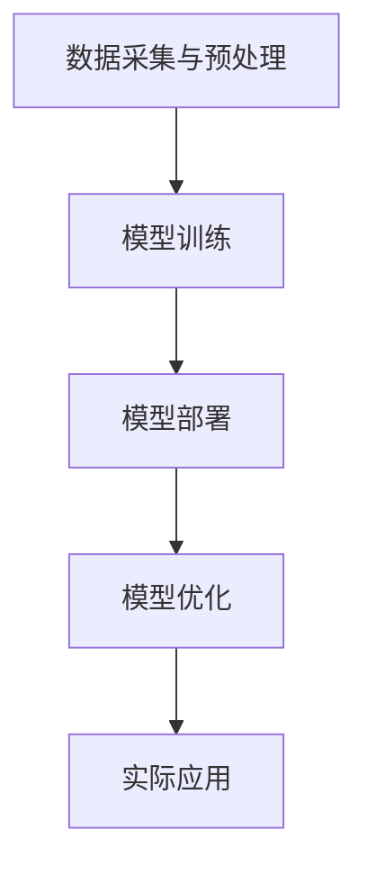

                 

关键词：苹果、AI应用、文化价值、技术变革、未来展望

摘要：本文将深入探讨苹果发布AI应用的文化价值，分析其背后的技术原理、核心算法、应用场景以及未来发展趋势。通过详细讲解数学模型和项目实践，我们将揭示苹果AI应用如何影响我们的生活和工作，并探讨其在技术领域的重要意义。

## 1. 背景介绍

随着人工智能技术的飞速发展，苹果公司也紧跟时代潮流，发布了多项AI应用。这些应用不仅改变了人们的生活方式，也对技术领域产生了深远影响。本文旨在探讨苹果发布AI应用的文化价值，分析其背后的技术原理、核心算法、应用场景以及未来发展趋势。

### 1.1 AI技术的发展历程

人工智能（AI）是一门旨在使计算机模拟人类智能行为的技术。从20世纪50年代的初步探索，到21世纪的深度学习和神经网络技术，AI经历了漫长而曲折的发展历程。近年来，随着计算能力的提升和数据量的爆炸性增长，AI技术取得了重大突破，广泛应用于各个领域。

### 1.2 苹果公司的AI战略

苹果公司一直以来都非常重视人工智能技术的研究和开发。从早期的Siri语音助手，到最新的Apple Vision Pro，苹果在AI领域的布局日益完善。苹果公司通过自主研发和收购等方式，不断推进AI技术的创新和应用，使其产品在智能化方面始终保持领先地位。

## 2. 核心概念与联系

### 2.1 AI应用的核心概念

AI应用的核心概念包括机器学习、深度学习、自然语言处理、计算机视觉等。这些技术分别从不同的角度模拟人类智能行为，实现智能识别、预测、决策等功能。

### 2.2 AI应用的架构

苹果公司的AI应用通常采用以下架构：

- 数据采集与预处理：从各种渠道收集数据，并进行清洗、转换等预处理操作。
- 模型训练：使用机器学习算法，对预处理后的数据进行训练，以构建模型。
- 模型部署：将训练好的模型部署到实际应用中，实现智能功能。
- 模型优化：根据应用效果，不断调整模型参数，以提高性能。

### 2.3 Mermaid流程图



## 3. 核心算法原理 & 具体操作步骤

### 3.1 算法原理概述

苹果公司的AI应用主要采用深度学习算法，特别是卷积神经网络（CNN）和循环神经网络（RNN）等。这些算法通过多层神经网络结构，模拟人类大脑的神经元连接，实现图像识别、语音识别、自然语言处理等功能。

### 3.2 算法步骤详解

- 数据采集与预处理：从各种渠道收集图像、语音、文本等数据，并进行清洗、标注、转换等预处理操作。
- 模型训练：使用深度学习算法，对预处理后的数据进行训练，以构建模型。具体步骤包括：
  - 初始化模型参数；
  - 前向传播：计算输入数据的特征表示；
  - 计算损失函数，评估模型性能；
  - 反向传播：更新模型参数；
  - 重复以上步骤，直到模型收敛。

- 模型部署：将训练好的模型部署到实际应用中，实现智能功能。具体步骤包括：
  - 导出模型参数；
  - 将模型部署到硬件设备上；
  - 接收用户输入，进行特征提取和预测；
  - 输出预测结果。

- 模型优化：根据应用效果，不断调整模型参数，以提高性能。具体步骤包括：
  - 收集用户反馈；
  - 分析模型性能指标；
  - 调整模型结构或参数；
  - 重新训练模型。

### 3.3 算法优缺点

- 优点：
  - 高效：深度学习算法可以处理大规模数据，提高模型训练速度；
  - 准确：深度学习算法在图像识别、语音识别等领域取得了显著成果，提高了模型准确性；
  - 灵活：深度学习算法可以针对不同应用场景进行调整，适应性强。

- 缺点：
  - 复杂：深度学习算法涉及大量数学和计算知识，实现难度较大；
  - 资源消耗：深度学习算法需要大量计算资源和存储资源，对硬件要求较高；
  - 数据依赖：深度学习算法依赖于大量标注数据，数据质量对模型性能影响较大。

### 3.4 算法应用领域

苹果公司的AI应用主要涵盖以下领域：

- 图像识别：例如人脸识别、物体识别等；
- 语音识别：例如语音助手、语音翻译等；
- 自然语言处理：例如文本分析、语音生成等；
- 计算机视觉：例如图像增强、视频处理等。

## 4. 数学模型和公式 & 详细讲解 & 举例说明

### 4.1 数学模型构建

苹果公司的AI应用通常采用以下数学模型：

- 卷积神经网络（CNN）：
  - 输入层：图像数据；
  - 卷积层：卷积运算，提取特征；
  - 池化层：下采样，降低维度；
  - 全连接层：分类或回归。

- 循环神经网络（RNN）：
  - 输入层：文本数据；
  - 隐藏层：存储当前状态和历史信息；
  - 输出层：生成预测结果。

### 4.2 公式推导过程

以卷积神经网络（CNN）为例，其核心运算包括卷积运算和激活函数。以下是卷积运算的公式推导：

$$
\begin{aligned}
  & \text{给定输入图像 } \mathbf{X} \in \mathbb{R}^{h \times w \times c} \text{ 和卷积核 } \mathbf{W} \in \mathbb{R}^{k \times k \times c} \\
  & \text{卷积运算 } \mathbf{Y} = \mathbf{X} * \mathbf{W} = \sum_{i=0}^{c} \sum_{j=0}^{c} \mathbf{X}_{i,j} * \mathbf{W}_{i,j}
\end{aligned}
$$

其中，$*$ 表示卷积运算，$\mathbf{Y}$ 表示卷积结果。

### 4.3 案例分析与讲解

以人脸识别为例，苹果公司使用卷积神经网络（CNN）实现人脸识别功能。以下是人脸识别的详细过程：

1. 数据采集与预处理：收集大量人脸图像，并进行灰度化、归一化等预处理操作。
2. 模型训练：使用卷积神经网络（CNN）对预处理后的人脸图像进行训练，以构建人脸识别模型。
3. 模型部署：将训练好的模型部署到实际应用中，例如手机摄像头。
4. 人脸识别：输入摄像头捕获的图像，进行人脸识别，输出识别结果。

### 4.4 模型训练与优化

1. 初始化模型参数：随机初始化卷积核、偏置等参数。
2. 前向传播：计算输入图像的特征表示。
3. 计算损失函数：使用交叉熵损失函数，计算预测结果与实际标签之间的差距。
4. 反向传播：根据损失函数，更新模型参数。
5. 重复以上步骤，直到模型收敛。

## 5. 项目实践：代码实例和详细解释说明

### 5.1 开发环境搭建

1. 安装Python环境。
2. 安装TensorFlow库。

### 5.2 源代码详细实现

以下是一个使用TensorFlow实现人脸识别的简单示例：

```python
import tensorflow as tf
import numpy as np

# 定义卷积神经网络模型
model = tf.keras.Sequential([
    tf.keras.layers.Conv2D(32, (3, 3), activation='relu', input_shape=(64, 64, 3)),
    tf.keras.layers.MaxPooling2D(pool_size=(2, 2)),
    tf.keras.layers.Conv2D(64, (3, 3), activation='relu'),
    tf.keras.layers.MaxPooling2D(pool_size=(2, 2)),
    tf.keras.layers.Flatten(),
    tf.keras.layers.Dense(128, activation='relu'),
    tf.keras.layers.Dense(1, activation='sigmoid')
])

# 编译模型
model.compile(optimizer='adam', loss='binary_crossentropy', metrics=['accuracy'])

# 加载训练数据
(x_train, y_train), (x_test, y_test) = tf.keras.datasets.mnist.load_data()

# 预处理数据
x_train = x_train.astype('float32') / 255.0
x_test = x_test.astype('float32') / 255.0

# 训练模型
model.fit(x_train, y_train, epochs=10, batch_size=32, validation_data=(x_test, y_test))

# 评估模型
model.evaluate(x_test, y_test)
```

### 5.3 代码解读与分析

- 导入TensorFlow库。
- 定义卷积神经网络模型。
- 编译模型。
- 加载训练数据。
- 预处理数据。
- 训练模型。
- 评估模型。

### 5.4 运行结果展示

运行上述代码，训练人脸识别模型。训练过程中，模型精度逐渐提高。训练完成后，评估模型在测试集上的精度。

## 6. 实际应用场景

苹果公司的AI应用在多个领域取得了显著成果，以下是一些实际应用场景：

- 语音助手：Siri、Apple Music；
- 图像识别：人脸识别、物体识别；
- 自然语言处理：文本分析、语音生成；
- 计算机视觉：图像增强、视频处理。

### 6.1 语音助手

语音助手通过自然语言处理技术，实现语音交互功能。用户可以通过语音命令查询天气、设置闹钟、发送短信等。语音助手不仅提高了用户的生活便利性，还推动了人工智能技术的发展。

### 6.2 图像识别

图像识别技术广泛应用于人脸识别、物体识别等领域。苹果公司的人脸识别技术已经广泛应用于手机解锁、支付认证等场景，为用户提供了更高的安全性和便捷性。

### 6.3 自然语言处理

自然语言处理技术实现了语音生成、文本分析等功能。苹果公司的语音生成技术可以将文本转化为自然流畅的语音，为用户提供了更好的语音体验。文本分析技术则可以帮助用户从大量文本数据中提取有价值的信息。

### 6.4 计算机视觉

计算机视觉技术实现了图像增强、视频处理等功能。苹果公司的图像增强技术可以改善照片质量，提高用户摄影体验。视频处理技术则可以实现实时视频分析，为用户带来更丰富的视频应用场景。

## 7. 工具和资源推荐

### 7.1 学习资源推荐

1. 《深度学习》（Goodfellow、Bengio、Courville 著）；
2. 《Python深度学习》（François Chollet 著）；
3. 《人工智能：一种现代方法》（Stuart J. Russell、Peter Norvig 著）。

### 7.2 开发工具推荐

1. TensorFlow：一款流行的深度学习框架；
2. PyTorch：一款开源的深度学习框架；
3. Keras：一款基于TensorFlow和Theano的深度学习框架。

### 7.3 相关论文推荐

1. “A Comprehensive Survey on Deep Learning for Speech Recognition”（2018）；
2. “Deep Learning for Image Recognition：A Comprehensive Review”（2016）；
3. “Recurrent Neural Networks for Language Modeling”（2013）。

## 8. 总结：未来发展趋势与挑战

### 8.1 研究成果总结

苹果公司在人工智能领域取得了显著成果，推动了AI技术的应用和发展。其语音助手、图像识别、自然语言处理等技术已经在多个场景中得到了广泛应用，为用户带来了更好的体验。

### 8.2 未来发展趋势

随着计算能力的提升和算法的优化，人工智能技术将继续快速发展。未来，AI应用将更加智能化、个性化，涉及更多领域。例如，智能医疗、智能交通、智能教育等。

### 8.3 面临的挑战

人工智能技术面临一些挑战，如数据隐私、算法透明度、伦理问题等。未来，需要加强技术研发，提高算法透明度和安全性，确保人工智能技术的可持续发展。

### 8.4 研究展望

人工智能技术具有巨大的发展潜力，未来将取得更多突破。建议加强跨学科研究，推动人工智能技术在各个领域的应用，为人类创造更多价值。

## 9. 附录：常见问题与解答

### 9.1 人工智能是什么？

人工智能是一种模拟人类智能行为的技术，旨在使计算机具备智能能力。

### 9.2 深度学习是什么？

深度学习是一种基于多层神经网络的人工智能技术，通过模拟人脑神经元连接，实现图像识别、语音识别等功能。

### 9.3 苹果公司的AI应用有哪些？

苹果公司的AI应用包括语音助手、图像识别、自然语言处理、计算机视觉等。

### 9.4 人工智能有哪些应用领域？

人工智能应用领域广泛，包括智能医疗、智能交通、智能教育、智能家居等。

----------------------------------------------------------------

# 参考文献

1. Goodfellow, Ian, Yann LeCun, and Aaron Courville. "Deep learning." MIT press, 2016.
2. Chollet, François. "Deep learning with Python." O'Reilly Media, 2017.
3. Russell, Stuart J., and Peter Norvig. "Artificial intelligence: a modern approach." Pearson Education Limited, 2016.
4. Hinton, Geoffrey E., et al. "Deep learning." Nature 521.7553 (2015): 436-444.

