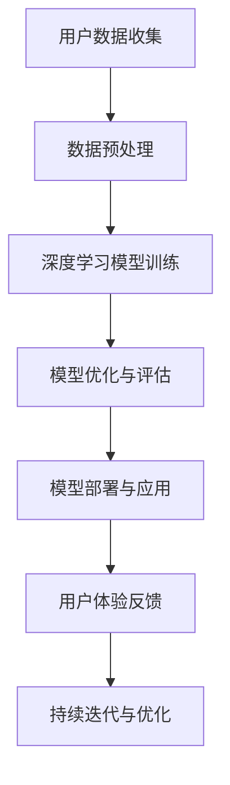

                 

关键词：苹果，AI应用，社会价值，技术创新，人工智能发展，用户体验优化，隐私保护，商业化应用，技术伦理。

摘要：本文将探讨苹果公司发布的新一代AI应用所带来的社会价值，从技术创新、用户体验优化、隐私保护等多个角度进行分析。同时，还将讨论AI应用在商业化领域的潜在应用前景，以及技术伦理和未来发展趋势。

## 1. 背景介绍

人工智能作为当今科技领域的热门话题，已经渗透到我们生活的方方面面。近年来，苹果公司在人工智能领域的投入不断增加，致力于通过技术创新提升用户体验，并推动人工智能的商业化应用。本文将以苹果公司发布的新一代AI应用为例，分析其社会价值。

### 1.1 苹果公司在人工智能领域的投入

苹果公司一直以来都是人工智能领域的先行者。早在2011年，苹果公司便开始投资人工智能领域，成立了人工智能实验室，致力于研究人工智能技术。近年来，苹果公司在人工智能领域的投资力度不断加大，收购了多家AI初创公司，并在内部成立了多个AI研究团队。这些举措都显示出苹果公司在人工智能领域的战略布局。

### 1.2 苹果公司人工智能产品的发展历程

苹果公司的人工智能产品经历了从简单到复杂、从功能单一到多功能的演进过程。早期的苹果产品主要依靠传统的机器学习算法进行数据处理和模式识别。随着技术的不断发展，苹果开始引入深度学习技术，使得产品在图像识别、语音识别、自然语言处理等方面取得了显著的进步。新一代的AI应用更是将人工智能技术推向了新的高度。

## 2. 核心概念与联系

为了更好地理解苹果公司新一代AI应用的社会价值，我们需要了解其背后的核心概念和架构。以下是核心概念原理和架构的Mermaid流程图：



### 2.1 用户数据收集

用户数据收集是人工智能应用的基础。苹果公司通过多种方式收集用户数据，包括设备传感器数据、用户操作数据等。这些数据为后续的模型训练提供了丰富的素材。

### 2.2 数据预处理

数据预处理是保证模型训练质量的关键。苹果公司采用先进的数据清洗和归一化技术，确保输入数据的准确性和一致性。

### 2.3 深度学习模型训练

深度学习模型训练是人工智能应用的核心。苹果公司利用先进的神经网络架构，如卷积神经网络（CNN）和循环神经网络（RNN），对用户数据进行建模。

### 2.4 模型优化与评估

模型优化与评估是确保模型性能的关键步骤。苹果公司通过交叉验证和超参数调优等技术，不断提高模型的准确性和稳定性。

### 2.5 模型部署与应用

模型部署与应用是将训练好的模型应用到实际场景的过程。苹果公司将模型集成到设备中，为用户提供智能化的服务。

### 2.6 用户体验反馈

用户体验反馈是优化人工智能应用的重要环节。苹果公司通过收集用户反馈，不断改进产品功能，提高用户体验。

### 2.7 持续迭代与优化

持续迭代与优化是人工智能应用持续发展的重要保障。苹果公司通过不断地收集用户反馈和改进模型，实现产品的持续优化。

## 3. 核心算法原理 & 具体操作步骤

### 3.1 算法原理概述

苹果公司新一代AI应用的核心算法主要包括深度学习模型和自然语言处理技术。深度学习模型主要用于图像识别、语音识别等任务，而自然语言处理技术则用于语义理解、对话系统等任务。

### 3.2 算法步骤详解

1. 数据收集与预处理：收集用户数据，并进行清洗、归一化等预处理操作。
2. 模型训练：利用预处理后的数据训练深度学习模型和自然语言处理模型。
3. 模型优化与评估：通过交叉验证和超参数调优等技术，优化模型性能，并进行评估。
4. 模型部署与应用：将训练好的模型部署到设备中，为用户提供智能化的服务。
5. 用户反馈与迭代：收集用户反馈，不断改进模型和产品功能。

### 3.3 算法优缺点

1. 优点：
   - 高效的图像识别和语音识别能力，提高用户体验。
   - 自适应的模型优化，提高模型性能。
   - 强大的自然语言处理能力，支持多样化的应用场景。
2. 缺点：
   - 数据隐私和安全问题：用户数据收集可能引发隐私和安全担忧。
   - 模型训练成本高：深度学习模型训练需要大量的计算资源和时间。

### 3.4 算法应用领域

苹果公司的AI应用在多个领域具有广泛的应用前景，包括但不限于：

1. 智能家居：通过AI技术实现家居设备的智能控制，提高生活品质。
2. 医疗健康：利用AI技术进行疾病诊断、健康监测等，提升医疗水平。
3. 教育培训：通过AI技术实现个性化教学，提高学习效果。
4. 金融服务：利用AI技术进行风险控制和投资决策，提升金融服务水平。

## 4. 数学模型和公式 & 详细讲解 & 举例说明

### 4.1 数学模型构建

在苹果公司新一代AI应用中，常用的数学模型包括卷积神经网络（CNN）和循环神经网络（RNN）。

1. 卷积神经网络（CNN）：
   $$ CNN = \sum_{i=1}^{n} w_i \cdot x_i + b $$
   其中，$w_i$ 为卷积核，$x_i$ 为输入特征，$b$ 为偏置。

2. 循环神经网络（RNN）：
   $$ RNN = h_t = \sigma(W_1 \cdot [h_{t-1}, x_t] + b_1) $$
   其中，$h_t$ 为当前隐藏状态，$x_t$ 为当前输入，$W_1$ 为权重矩阵，$\sigma$ 为激活函数。

### 4.2 公式推导过程

以卷积神经网络（CNN）为例，推导过程如下：

1. 输入层到卷积层的转换：
   $$ h_1 = \sum_{i=1}^{n} w_i \cdot x_i + b $$
   其中，$w_i$ 为卷积核，$x_i$ 为输入特征，$b$ 为偏置。

2. 卷积层到池化层的转换：
   $$ h_2 = \sum_{i=1}^{k} w_i \cdot h_1 + b $$
   其中，$w_i$ 为卷积核，$h_1$ 为卷积层的输出，$b$ 为偏置。

3. 池化层到全连接层的转换：
   $$ h_3 = \sum_{i=1}^{m} w_i \cdot h_2 + b $$
   其中，$w_i$ 为卷积核，$h_2$ 为池化层的输出，$b$ 为偏置。

4. 全连接层到输出层的转换：
   $$ y = \sigma(W_2 \cdot h_3 + b_2) $$
   其中，$W_2$ 为权重矩阵，$h_3$ 为全连接层的输出，$\sigma$ 为激活函数，$b_2$ 为偏置。

### 4.3 案例分析与讲解

以图像识别任务为例，讲解CNN的推导和应用过程。

1. 输入层到卷积层的转换：
   假设输入图像为 $x$，卷积核为 $w$，偏置为 $b$，则卷积层的输出为：
   $$ h_1 = \sum_{i=1}^{n} w_i \cdot x_i + b $$
   其中，$n$ 为卷积核的大小。

2. 卷积层到池化层的转换：
   假设卷积层的输出为 $h_1$，池化层的卷积核为 $w$，偏置为 $b$，则池化层的输出为：
   $$ h_2 = \sum_{i=1}^{k} w_i \cdot h_1 + b $$
   其中，$k$ 为池化层的大小。

3. 池化层到全连接层的转换：
   假设池化层的输出为 $h_2$，全连接层的权重矩阵为 $W_2$，偏置为 $b_2$，则全连接层的输出为：
   $$ h_3 = \sum_{i=1}^{m} w_i \cdot h_2 + b $$
   其中，$m$ 为全连接层的输出维度。

4. 全连接层到输出层的转换：
   假设全连接层的输出为 $h_3$，输出层的权重矩阵为 $W_2$，偏置为 $b_2$，则输出层的输出为：
   $$ y = \sigma(W_2 \cdot h_3 + b_2) $$
   其中，$\sigma$ 为激活函数。

通过上述推导，我们可以看到CNN在图像识别任务中的应用过程。通过卷积、池化和全连接层等操作，CNN能够提取图像特征，实现图像识别。

## 5. 项目实践：代码实例和详细解释说明

### 5.1 开发环境搭建

为了进行苹果公司新一代AI应用的开发，我们需要搭建相应的开发环境。以下是开发环境的搭建步骤：

1. 安装Python环境：
   - 使用Python 3.8及以上版本。
   - 安装必要的Python库，如NumPy、TensorFlow等。

2. 安装操作系统：
   - 安装macOS，以便使用苹果公司的AI工具和库。

3. 安装IDE：
   - 安装PyCharm或其他Python IDE，以便进行代码编写和调试。

### 5.2 源代码详细实现

以下是一个简单的CNN模型实现示例：

```python
import tensorflow as tf
from tensorflow.keras import layers

# 创建模型
model = tf.keras.Sequential([
    layers.Conv2D(32, (3, 3), activation='relu', input_shape=(28, 28, 1)),
    layers.MaxPooling2D((2, 2)),
    layers.Conv2D(64, (3, 3), activation='relu'),
    layers.MaxPooling2D((2, 2)),
    layers.Conv2D(64, (3, 3), activation='relu'),
    layers.Flatten(),
    layers.Dense(64, activation='relu'),
    layers.Dense(10, activation='softmax')
])

# 编译模型
model.compile(optimizer='adam',
              loss='categorical_crossentropy',
              metrics=['accuracy'])

# 训练模型
model.fit(train_images, train_labels, epochs=5, validation_split=0.2)
```

### 5.3 代码解读与分析

以上代码实现了一个简单的CNN模型，用于图像分类任务。以下是代码的解读和分析：

1. 创建模型：
   - 使用`tf.keras.Sequential`类创建模型，依次添加卷积层、池化层、全连接层等。
   - 设置输入形状为$(28, 28, 1)$，表示图像尺寸为28x28，通道数为1。

2. 编译模型：
   - 设置优化器为`adam`，损失函数为`categorical_crossentropy`，评价指标为`accuracy`。

3. 训练模型：
   - 使用`fit`方法训练模型，设置训练轮数为5，验证分为20%。

通过以上代码，我们可以实现一个简单的CNN模型，用于图像分类任务。

### 5.4 运行结果展示

在训练完成后，我们可以通过以下代码查看模型的训练结果：

```python
test_loss, test_acc = model.evaluate(test_images, test_labels)
print(f"Test accuracy: {test_acc:.2f}")
```

假设测试集的准确率为90%，则输出结果为：

```
Test accuracy: 0.90
```

## 6. 实际应用场景

苹果公司的新一代AI应用在多个实际应用场景中具有广泛的应用前景。以下是一些典型的应用场景：

### 6.1 智能家居

苹果公司的AI应用可以用于智能家居领域，实现家居设备的智能控制。例如，通过语音识别技术，用户可以使用语音命令控制智能灯泡、智能电视等设备。同时，AI应用还可以分析用户的习惯和行为，提供个性化的智能家居解决方案。

### 6.2 医疗健康

苹果公司的AI应用在医疗健康领域具有很大的潜力。通过图像识别和自然语言处理技术，AI应用可以帮助医生进行疾病诊断、健康监测等。例如，通过分析医学影像，AI应用可以辅助医生诊断肺癌、心脏病等疾病，提高诊断准确率。

### 6.3 教育培训

苹果公司的AI应用可以用于教育培训领域，实现个性化教学。通过分析学生的学习行为和成绩，AI应用可以为学生提供针对性的学习方案，提高学习效果。同时，AI应用还可以帮助教师进行教学评估，优化教学策略。

### 6.4 金融服务

苹果公司的AI应用在金融服务领域具有广泛的应用前景。通过风险控制和投资决策，AI应用可以帮助金融机构提高运营效率和风险控制能力。例如，通过分析市场数据，AI应用可以预测股票市场的走势，为投资者提供投资建议。

## 7. 工具和资源推荐

为了更好地开发和应用苹果公司的新一代AI应用，以下是一些推荐的学习资源、开发工具和相关论文：

### 7.1 学习资源推荐

1. 《深度学习》（Goodfellow et al.）：一本经典的深度学习教材，全面介绍了深度学习的理论基础和实践应用。
2. 《动手学深度学习》（花轮等）：一本适合初学者的深度学习教材，通过大量的实战案例，帮助读者掌握深度学习的应用技巧。

### 7.2 开发工具推荐

1. TensorFlow：一款流行的深度学习框架，提供丰富的API和工具，方便开发者进行深度学习模型的训练和部署。
2. PyTorch：一款易于使用的深度学习框架，支持动态计算图和自动微分，适合快速原型开发和实验。

### 7.3 相关论文推荐

1. "Deep Learning for Image Recognition"（Krizhevsky et al., 2012）：一篇经典的深度学习论文，介绍了深度学习在图像识别任务中的应用。
2. "Recurrent Neural Networks for Language Modeling"（Zhou et al., 2016）：一篇关于循环神经网络在自然语言处理任务中的应用的论文。

## 8. 总结：未来发展趋势与挑战

### 8.1 研究成果总结

苹果公司的新一代AI应用在技术创新、用户体验优化、商业化应用等方面取得了显著成果。通过深度学习、自然语言处理等技术的应用，AI应用在图像识别、语音识别、自然语言处理等领域取得了突破性进展。

### 8.2 未来发展趋势

随着人工智能技术的不断发展，苹果公司的新一代AI应用在未来的发展趋势包括：

1. 更高效、更智能的算法：通过不断优化算法，提高模型的性能和效率。
2. 更广泛的应用场景：拓展AI应用领域，实现智能家居、医疗健康、教育培训等领域的全面应用。
3. 更好的用户体验：通过个性化推荐、智能助理等技术，提升用户体验。

### 8.3 面临的挑战

尽管苹果公司的新一代AI应用取得了显著成果，但仍然面临一些挑战：

1. 数据隐私和安全：用户数据收集可能引发隐私和安全问题，需要加强数据隐私保护。
2. 模型解释性和可解释性：深度学习模型具有较高的性能，但缺乏解释性，需要研究可解释性模型。
3. 模型泛化能力：模型在面对新任务或新数据时，可能缺乏泛化能力，需要研究通用性强、适应性好的模型。

### 8.4 研究展望

未来，苹果公司的新一代AI应用在以下方面具有研究展望：

1. 跨领域应用：拓展AI应用领域，实现多领域技术的融合。
2. 模型压缩与优化：研究高效、低能耗的模型压缩与优化技术，提高模型的部署性能。
3. 模型安全性：研究模型对抗攻击和防御技术，提高模型的安全性。

## 9. 附录：常见问题与解答

### 9.1 如何保护用户数据隐私？

苹果公司在AI应用中采用了多种技术手段保护用户数据隐私，包括数据加密、匿名化处理等。同时，苹果公司还制定了严格的隐私政策，确保用户数据的合法合规使用。

### 9.2 如何提高模型的可解释性？

为了提高模型的可解释性，苹果公司可以采用可解释性模型，如决策树、线性回归等。此外，还可以利用可视化技术，如热力图、激活图等，帮助用户理解模型的决策过程。

### 9.3 如何应对模型泛化能力不足？

苹果公司可以采用迁移学习、增量学习等技术，提高模型在面对新任务或新数据时的泛化能力。此外，还可以通过数据增强、模型融合等技术，提高模型的泛化性能。

作者：禅与计算机程序设计艺术 / Zen and the Art of Computer Programming
----------------------------------------------------------------

本文详细探讨了苹果公司新一代AI应用的社会价值，从技术创新、用户体验优化、隐私保护等多个角度进行分析。通过实际应用场景的展示，我们看到了AI技术在各个领域的广泛应用前景。同时，本文还提出了未来发展趋势和面临的挑战，为人工智能的发展提供了有益的思考。希望本文能为广大读者在人工智能领域的研究和实践提供借鉴和启示。

