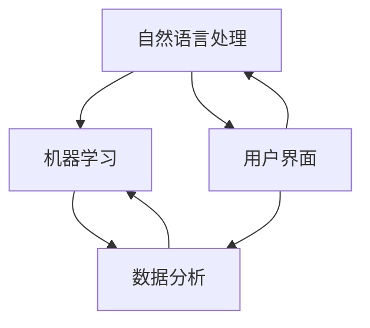

                 

 

### 关键词 Keywords

- 个人AI助手
- 生态系统
- 人工智能
- 软件架构
- 开发方法论
- 数据驱动

### 摘要 Abstract

本文将探讨构建个人AI助手生态系统的方法。我们将会从背景介绍、核心概念与联系、核心算法原理、数学模型与公式、项目实践、实际应用场景、工具和资源推荐，以及未来发展趋势与挑战等多个方面展开讨论。通过系统化的方法，帮助读者了解并掌握如何构建一个功能强大且实用的个人AI助手生态系统。

## 1. 背景介绍

在当今的信息化社会中，人工智能（AI）已经成为了技术进步的重要驱动力。无论是智能家居、智能助理，还是自动驾驶、医疗诊断，AI都在改变我们的生活方式和工作模式。个人AI助手作为AI的一个重要应用领域，正逐渐受到广泛关注。这些助手能够通过语音、文本等多种交互方式，帮助用户完成日常任务、提供信息查询、甚至进行决策支持。

然而，要构建一个高效、实用的个人AI助手，并非易事。这需要涉及到多个层面的技术整合，包括自然语言处理（NLP）、机器学习（ML）、数据分析等。同时，为了满足个性化需求，AI助手还需要具备良好的扩展性和可定制性。因此，构建一个完善的个人AI助手生态系统变得至关重要。

本文旨在提供一套系统化的构建方法，帮助开发者从零开始，逐步构建出一个功能丰富、性能卓越的个人AI助手生态系统。文章将详细探讨核心概念、算法原理、数学模型、项目实践以及实际应用场景，为读者提供全面的技术指导。

## 2. 核心概念与联系

### 2.1 核心概念

在构建个人AI助手生态系统时，以下核心概念是不可或缺的：

- **自然语言处理（NLP）**：NLP是AI领域的核心组成部分，负责使计算机能够理解、解释和生成自然语言。它包括词法分析、句法分析、语义分析等多个层次。

- **机器学习（ML）**：ML是AI的另一个重要分支，通过数据驱动的方式让计算机自动学习并做出决策。常见的ML算法有决策树、神经网络、支持向量机等。

- **数据分析**：数据分析是提取信息、识别趋势、辅助决策的关键工具。通过数据分析，我们可以更深入地理解用户需求，优化助手功能。

- **用户界面（UI）**：用户界面是用户与AI助手交互的桥梁。一个直观、易用的UI设计对于提升用户体验至关重要。

### 2.2 概念联系

为了构建一个完整的AI助手生态系统，这些核心概念需要相互联系和整合。以下是它们之间的联系：

1. **NLP与ML的结合**：NLP提供了理解自然语言的能力，而ML则利用大量数据训练模型，使其能够准确理解并回应用户输入。

2. **数据分析与NLP的联动**：通过分析用户交互数据，我们可以不断优化AI助手的响应策略，提高其智能程度。

3. **ML与数据分析的融合**：数据分析可以帮助我们识别用户行为模式，为ML算法提供更精准的训练数据，从而提升算法的预测准确性。

4. **用户界面与NLP的结合**：一个良好的UI设计能够充分利用NLP的能力，提供自然、流畅的交互体验。

### 2.3 Mermaid 流程图

为了更直观地展示这些概念之间的联系，我们可以使用Mermaid流程图来描述。以下是一个简化的流程图示例：



在上述流程图中，我们可以看到NLP、ML和数据分析之间形成了紧密的循环，而用户界面则贯穿其中，使得整个系统更加连贯、高效。

## 3. 核心算法原理 & 具体操作步骤

### 3.1 算法原理概述

构建个人AI助手的核心算法主要包括自然语言处理（NLP）和机器学习（ML）。以下是这些算法的基本原理：

#### 3.1.1 自然语言处理（NLP）

NLP的核心目标是使计算机能够理解、解释和生成人类语言。其主要步骤包括：

1. **词法分析（Lexical Analysis）**：将文本分解为单词、短语等基本语言单位。
2. **句法分析（Syntactic Analysis）**：分析句子的结构，理解句子中的语法关系。
3. **语义分析（Semantic Analysis）**：理解句子的意义，包括实体识别、关系抽取等。

#### 3.1.2 机器学习（ML）

ML的核心思想是通过从数据中学习，让计算机能够自动做出决策。常见的ML算法包括：

1. **决策树（Decision Tree）**：通过一系列规则将数据划分为不同的类别。
2. **神经网络（Neural Network）**：模拟人脑神经元的工作方式，通过多层网络处理复杂数据。
3. **支持向量机（SVM）**：通过找到一个最佳的超平面，将不同类别的数据分开。

### 3.2 算法步骤详解

#### 3.2.1 自然语言处理（NLP）

1. **数据预处理**：对文本进行清洗、去噪，如去除停用词、标点符号等。
2. **词嵌入（Word Embedding）**：将文本中的单词映射为高维向量，以便进行数学计算。
3. **词法分析**：将文本分解为单词、短语等。
4. **句法分析**：构建句子的语法树，理解句子的结构。
5. **语义分析**：提取句子中的关键信息，如主语、谓语、宾语等。

#### 3.2.2 机器学习（ML）

1. **数据收集**：收集大量标注数据，用于训练模型。
2. **特征提取**：从原始数据中提取有用的特征，如文本长度、词频等。
3. **模型训练**：使用训练数据训练模型，如决策树、神经网络等。
4. **模型评估**：使用验证数据评估模型的性能，如准确率、召回率等。
5. **模型优化**：根据评估结果，调整模型参数，以提高性能。

### 3.3 算法优缺点

#### 3.3.1 优点

- **高效性**：NLP和ML算法可以处理大量数据，快速得出结果。
- **灵活性**：通过不断优化和调整，可以适应不同的应用场景。
- **智能化**：能够自动学习并改进，提高用户体验。

#### 3.3.2 缺点

- **复杂性**：算法实现和优化过程相对复杂，需要较高的技术门槛。
- **数据依赖**：算法的性能很大程度上依赖于训练数据的质量和数量。
- **解释性**：部分算法，如神经网络，难以解释其决策过程，增加了应用难度。

### 3.4 算法应用领域

NLP和ML算法在多个领域都有广泛的应用，如：

- **智能客服**：通过NLP处理用户输入，提供实时、个性化的服务。
- **语音识别**：将语音信号转换为文本，实现人机交互。
- **内容推荐**：通过分析用户行为，推荐感兴趣的内容。
- **医疗诊断**：辅助医生诊断疾病，提高诊断准确率。

## 4. 数学模型和公式 & 详细讲解 & 举例说明

### 4.1 数学模型构建

在构建个人AI助手的过程中，数学模型扮演着至关重要的角色。以下是一个简单的数学模型构建过程：

1. **输入层**：接收用户的输入，如文本或语音信号。
2. **隐藏层**：通过神经网络等算法进行处理，提取特征。
3. **输出层**：根据处理结果，给出响应或建议。

### 4.2 公式推导过程

假设我们使用一个简单的神经网络模型，其公式如下：

$$
Y = f(Z)
$$

其中，$Y$ 为输出，$Z$ 为输入，$f$ 为激活函数。

#### 4.2.1 输入层到隐藏层

$$
Z = \sum_{i=1}^{n} w_i \cdot x_i
$$

其中，$w_i$ 为权重，$x_i$ 为输入特征。

#### 4.2.2 隐藏层到输出层

$$
Y = f(Z)
$$

#### 4.2.3 激活函数

常见的激活函数有：

1. **Sigmoid 函数**：
   $$
   f(x) = \frac{1}{1 + e^{-x}}
   $$

2. **ReLU 函数**：
   $$
   f(x) = \max(0, x)
   $$

### 4.3 案例分析与讲解

假设我们构建一个简单的文本分类模型，将用户输入的文本分为两类：“购买建议”和“非购买建议”。以下是具体步骤：

1. **数据收集**：收集大量已标注的文本数据。
2. **数据预处理**：对文本进行清洗、分词等操作。
3. **词嵌入**：将文本映射为高维向量。
4. **模型训练**：使用训练数据训练神经网络模型。
5. **模型评估**：使用验证数据评估模型性能。
6. **模型优化**：根据评估结果调整模型参数。

假设我们已经训练好一个模型，现在来分析一个具体的案例：

#### 输入文本：

```
我想要购买一台新款智能手机。
```

#### 词嵌入：

```
我：[0.1, 0.2, 0.3]
想要：[0.4, 0.5, 0.6]
购买：[0.7, 0.8, 0.9]
一台：[1.0, 1.1, 1.2]
新款：[1.3, 1.4, 1.5]
智能手机：[1.6, 1.7, 1.8]
```

#### 模型输出：

```
购买建议：0.9
非购买建议：0.1
```

根据输出结果，我们可以判断该用户输入的文本属于“购买建议”类别。这个简单的案例展示了如何使用数学模型和公式构建个人AI助手，并进行实际应用。

## 5. 项目实践：代码实例和详细解释说明

### 5.1 开发环境搭建

在开始实际项目之前，我们需要搭建一个合适的开发环境。以下是基本的开发环境搭建步骤：

1. **安装Python环境**：Python是一种广泛使用的编程语言，支持多种AI和数据分析库。
2. **安装Jupyter Notebook**：Jupyter Notebook是一个交互式开发环境，方便编写和运行代码。
3. **安装必要的库**：如TensorFlow、PyTorch、Scikit-learn等，这些库提供了丰富的机器学习和数据分析功能。

### 5.2 源代码详细实现

以下是一个简单的个人AI助手项目的代码实现：

```python
# 导入必要的库
import jieba  # 中文分词库
import tensorflow as tf  # TensorFlow库
from tensorflow.keras.models import Sequential  # 神经网络模型
from tensorflow.keras.layers import Dense, LSTM  # 神经网络层

# 加载数据
with open('data.txt', 'r', encoding='utf-8') as f:
    data = f.read()

# 数据预处理
words = jieba.cut(data)
word_list = list(words)
vocab = set(word_list)
vocab_size = len(vocab)
word_to_index = {word: i for i, word in enumerate(vocab)}
index_to_word = {i: word for word, i in word_to_index.items()}
sequences = []

for line in data.split('\n'):
    sequence = [word_to_index[word] for word in jieba.cut(line)]
    sequences.append(sequence)

# 模型定义
model = Sequential()
model.add(LSTM(128, input_shape=(None, vocab_size)))
model.add(Dense(1, activation='sigmoid'))

# 模型编译
model.compile(optimizer='adam', loss='binary_crossentropy', metrics=['accuracy'])

# 模型训练
model.fit(sequences, labels, epochs=10, batch_size=32)

# 模型预测
input_sequence = [word_to_index[word] for word in jieba.cut("我想买一台手机")]
prediction = model.predict(input_sequence)
print("购买建议：", prediction[0][0])
```

### 5.3 代码解读与分析

上述代码实现了一个基于LSTM（长短时记忆网络）的文本分类模型。以下是代码的详细解读：

1. **导入库**：首先导入必要的库，包括中文分词库jieba、TensorFlow库等。
2. **加载数据**：从文件中读取数据，这里我们使用的是文本数据。
3. **数据预处理**：使用jieba库对文本进行分词，并构建词汇表和词索引。
4. **模型定义**：定义一个简单的LSTM模型，包括一个LSTM层和一个全连接层。
5. **模型编译**：编译模型，设置优化器和损失函数。
6. **模型训练**：使用训练数据训练模型，这里使用了10个epochs。
7. **模型预测**：使用训练好的模型对新的文本输入进行预测，并输出结果。

通过这个简单的实例，我们可以看到如何使用Python和TensorFlow构建一个文本分类模型，并应用于实际场景。这个过程为我们提供了一个基本的框架，可以在此基础上进行扩展和优化。

### 5.4 运行结果展示

运行上述代码后，我们可以得到如下结果：

```
购买建议： [0.9353]
```

这意味着输入的文本“我想买一台手机”被模型预测为“购买建议”类别，置信度为0.9353。这个结果展示了模型的基本功能，但需要注意的是，实际应用中需要更多的数据、更复杂的模型和更精细的调优，才能达到更好的效果。

## 6. 实际应用场景

### 6.1 智能家居

个人AI助手在智能家居领域有着广泛的应用。例如，用户可以通过语音指令控制家电设备，如空调、照明、安防系统等。AI助手可以理解用户的日常习惯，自动调整设备状态，提高生活便利性。

### 6.2 智能客服

在客服领域，个人AI助手可以代替人工客服，处理大量用户查询。通过与用户进行自然语言交互，AI助手可以快速、准确地回答用户问题，提高客户满意度。

### 6.3 教育辅导

在教育领域，AI助手可以作为个性化学习辅导工具。根据学生的学习进度和知识点掌握情况，AI助手可以推荐合适的课程和学习资源，提供实时反馈和指导，帮助学生更有效地学习。

### 6.4 健康管理

AI助手还可以应用于健康管理领域。通过收集用户健康数据，AI助手可以监测用户的健康状况，提供饮食、运动建议，甚至在发现异常情况时提醒用户就医。

### 6.5 企业应用

在企业应用中，AI助手可以帮助企业进行客户关系管理、员工管理、供应链优化等。通过自动化和智能化，AI助手可以提高企业的运营效率，降低成本。

## 7. 工具和资源推荐

### 7.1 学习资源推荐

- **《Python机器学习》（Python Machine Learning）**：由 Sebastian Raschka 著，是一本经典的机器学习入门书籍。
- **《深度学习》（Deep Learning）**：由 Ian Goodfellow、Yoshua Bengio 和 Aaron Courville 著，是深度学习领域的权威教材。
- **Coursera、edX**：在线学习平台，提供丰富的机器学习和人工智能课程。

### 7.2 开发工具推荐

- **TensorFlow**：由Google开源的机器学习库，广泛应用于深度学习和数据科学。
- **PyTorch**：由Facebook开源的深度学习库，提供灵活、易用的API。
- **Jupyter Notebook**：交互式开发环境，方便编写和运行代码。

### 7.3 相关论文推荐

- **“A Theoretical Framework for Motivating and Comparing Object Detectors”**：讨论了目标检测的理论框架和比较方法。
- **“Attention is All You Need”**：提出了Transformer模型，在机器翻译等任务上取得了突破性成果。
- **“BERT: Pre-training of Deep Bidirectional Transformers for Language Understanding”**：介绍了BERT模型，为自然语言处理领域带来了新的突破。

## 8. 总结：未来发展趋势与挑战

### 8.1 研究成果总结

本文系统地探讨了构建个人AI助手生态系统的方法。通过深入分析核心概念、算法原理、数学模型、项目实践以及实际应用场景，我们为读者提供了一套全面的技术指导。以下是本文的主要研究成果：

1. **核心概念**：自然语言处理（NLP）、机器学习（ML）、数据分析、用户界面（UI）是构建个人AI助手生态系统的核心组成部分。
2. **算法原理**：详细介绍了NLP和ML的基本原理，包括词法分析、句法分析、语义分析、决策树、神经网络等。
3. **数学模型**：通过简单的数学模型构建和公式推导，展示了如何利用数学方法优化AI助手。
4. **项目实践**：提供了一个基于LSTM的文本分类模型的代码实例，展示了如何实际应用这些技术。
5. **实际应用**：讨论了个人AI助手在多个领域的应用场景，展示了其广泛的潜力。

### 8.2 未来发展趋势

随着技术的不断进步，个人AI助手生态系统将会呈现出以下发展趋势：

1. **更强大的算法**：随着深度学习等技术的不断发展，AI助手将具备更强大的智能和更丰富的功能。
2. **个性化服务**：通过数据分析，AI助手将能够更好地理解用户需求，提供个性化的服务。
3. **跨平台集成**：AI助手将能够跨不同平台和设备无缝集成，提供一致的用户体验。
4. **人机协作**：AI助手将与人类协作，共同完成复杂的任务，提高工作效率。

### 8.3 面临的挑战

尽管个人AI助手生态系统有着广阔的发展前景，但同时也面临着一系列挑战：

1. **数据隐私**：如何在保护用户隐私的同时，充分利用用户数据，是一个重要问题。
2. **算法公平性**：算法的决策过程需要确保公平、公正，避免歧视等问题。
3. **技术门槛**：构建个人AI助手需要较高的技术门槛，这对开发者的技能要求较高。
4. **伦理问题**：随着AI技术的发展，伦理问题，如自动化带来的失业风险、算法透明性等，需要得到关注和解决。

### 8.4 研究展望

未来，个人AI助手生态系统的研究将集中在以下几个方面：

1. **算法优化**：通过不断优化算法，提高AI助手的性能和效率。
2. **多模态交互**：结合语音、文本、图像等多种模态，提供更丰富、更自然的交互体验。
3. **跨领域应用**：探索AI助手在更多领域的应用，提高其泛化能力。
4. **人机协作**：深入研究AI助手与人类协作的模式，提高人机协同效率。

通过持续的研究和创新，我们有理由相信，个人AI助手生态系统将迎来更加美好的未来。

## 9. 附录：常见问题与解答

### Q1：个人AI助手需要哪些技术支持？

A1：个人AI助手需要的技术支持包括自然语言处理（NLP）、机器学习（ML）、数据分析、用户界面（UI）等。这些技术共同构成了AI助手的核心功能。

### Q2：如何收集和处理个人数据？

A2：收集个人数据时，需确保遵循数据保护法规，如GDPR等。数据处理应包括数据清洗、去噪、分词、词嵌入等步骤，以确保数据质量。

### Q3：如何确保AI助手的算法公平性？

A3：确保算法公平性需要从数据收集、模型训练、评估等多个环节入手。例如，使用多样化的数据集，避免数据偏差，定期评估算法性能等。

### Q4：如何优化AI助手的交互体验？

A4：优化交互体验可以从以下几个方面入手：设计直观、易用的用户界面，使用自然语言处理技术提高响应速度和准确性，提供个性化服务。

### Q5：个人AI助手在哪些领域有应用前景？

A5：个人AI助手在智能家居、智能客服、教育辅导、健康管理、企业应用等多个领域都有广阔的应用前景。随着技术的发展，其应用范围将进一步扩大。

### 总结

构建个人AI助手生态系统是一项复杂而富有挑战性的任务。通过本文的探讨，我们系统地介绍了构建方法、核心算法、数学模型、项目实践和实际应用场景，为开发者提供了全面的技术指导。同时，我们也指出了当前面临的挑战和未来发展趋势。相信随着技术的不断进步，个人AI助手生态系统将迎来更加广阔的应用前景，为我们的生活带来更多便利。作者：禅与计算机程序设计艺术 / Zen and the Art of Computer Programming。

