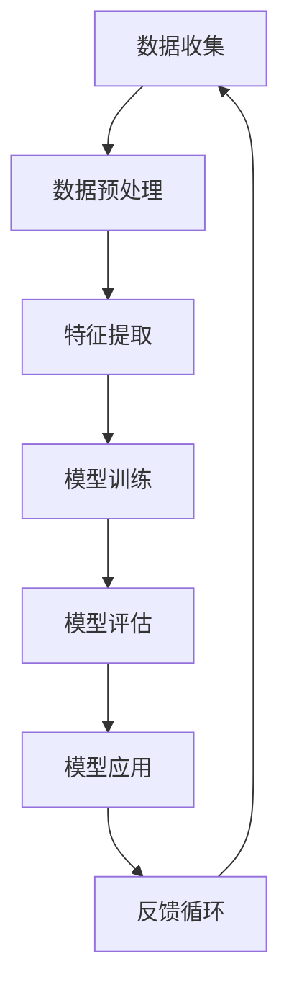

                 

关键词：人工智能，未来社会，社会发展，AI 技术，AI 驱动，社会变革，技术进步，智能化应用，可持续性，创新。

## 摘要

本文探讨了人工智能（AI）在未来社会发展中的关键作用。随着技术的不断进步，AI 正在成为推动社会变革的重要力量。本文将分析 AI 的核心概念、算法原理、应用领域，以及其在社会各个方面的影响。通过深入研究 AI 技术的发展趋势，我们试图预测未来社会的发展方向，并提出应对挑战的建议。

## 1. 背景介绍

在过去的几十年中，人工智能技术取得了令人瞩目的进展。从最初的规则基础系统到今天的深度学习和神经网络，AI 已经展现出强大的计算能力和适应性。随着大数据、云计算和物联网等新兴技术的快速发展，AI 的应用范围不断扩大，从医疗、金融到教育、制造业，AI 正在深刻改变各个行业。

### 1.1 人工智能的历史与发展

人工智能的研究始于 20 世纪 50 年代，当时的科学家们试图通过编程来模拟人类思维。早期的 AI 系统主要依赖于规则和逻辑推理，这些系统在特定领域表现出色，但缺乏适应性和灵活性。随着计算机性能的提升和算法的改进，AI 技术逐渐从理论研究走向实际应用。

### 1.2 当前 AI 技术的应用

当前，AI 技术已经在多个领域取得了显著的成果。例如，在医疗领域，AI 可以辅助医生进行诊断和治疗，提高医疗效率；在金融领域，AI 可以帮助金融机构进行风险管理，降低金融风险；在教育领域，AI 可以提供个性化的学习体验，提高教育质量。

## 2. 核心概念与联系

为了深入理解 AI 技术的核心概念及其相互联系，我们可以借助 Mermaid 流程图来展示 AI 技术的主要组成部分。



### 2.1 数据收集

数据是 AI 技术的基石。无论是机器学习还是深度学习，都需要大量的数据来训练模型。数据收集的过程包括数据的获取、存储和处理。

### 2.2 数据预处理

数据预处理是确保数据质量的过程，包括数据清洗、归一化和数据增强等步骤。通过数据预处理，可以提高模型的性能和准确性。

### 2.3 特征提取

特征提取是从原始数据中提取出有用的信息，以便模型进行学习和预测。特征提取的方法包括统计特征、文本特征和图像特征等。

### 2.4 模型训练

模型训练是 AI 技术的核心步骤。通过训练，模型可以从数据中学习到规律，从而进行预测和决策。

### 2.5 模型评估

模型评估是衡量模型性能的重要步骤。通过评估，可以确定模型的准确度、召回率和 F1 值等指标。

### 2.6 模型应用

模型应用是将训练好的模型应用于实际场景，实现 AI 的落地应用。例如，在医疗领域，AI 模型可以用于辅助诊断和治疗。

### 2.7 反馈循环

反馈循环是确保模型不断改进的重要环节。通过收集实际应用中的反馈，可以对模型进行调整和优化，提高其性能。

## 3. 核心算法原理 & 具体操作步骤

### 3.1 算法原理概述

AI 技术的核心算法包括机器学习、深度学习和强化学习等。每种算法都有其独特的原理和应用场景。

- **机器学习**：机器学习是一种通过数据驱动的方法来训练模型的技术。模型可以从数据中学习到规律，从而进行预测和决策。
- **深度学习**：深度学习是一种基于神经网络的机器学习技术。通过多层神经网络的结构，深度学习可以自动提取数据的特征，实现更加复杂的预测和决策。
- **强化学习**：强化学习是一种通过奖励机制来训练模型的技术。模型通过不断尝试和反馈来学习最优策略，从而实现目标。

### 3.2 算法步骤详解

- **机器学习**：数据收集 -> 数据预处理 -> 特征提取 -> 模型训练 -> 模型评估 -> 模型应用。
- **深度学习**：数据收集 -> 数据预处理 -> 特征提取 -> 网络结构设计 -> 模型训练 -> 模型评估 -> 模型应用。
- **强化学习**：环境建模 -> 策略选择 -> 执行动作 -> 收集反馈 -> 更新策略。

### 3.3 算法优缺点

- **机器学习**：优点包括适用范围广、模型可解释性强；缺点包括对数据依赖性大、模型训练时间较长。
- **深度学习**：优点包括强大的特征提取能力、高效的预测性能；缺点包括模型不可解释性、对数据质量要求高。
- **强化学习**：优点包括适用于复杂环境、能自适应调整策略；缺点包括训练时间较长、对奖励设计要求高。

### 3.4 算法应用领域

- **机器学习**：应用领域包括自然语言处理、计算机视觉、推荐系统等。
- **深度学习**：应用领域包括语音识别、图像处理、自动驾驶等。
- **强化学习**：应用领域包括游戏、机器人控制、金融交易等。

## 4. 数学模型和公式 & 详细讲解 & 举例说明

### 4.1 数学模型构建

AI 技术中的数学模型主要包括线性模型、非线性模型和概率模型等。以下是一个简单的线性回归模型：

$$
y = \beta_0 + \beta_1x
$$

其中，$y$ 是因变量，$x$ 是自变量，$\beta_0$ 和 $\beta_1$ 是模型参数。

### 4.2 公式推导过程

线性回归模型的推导过程如下：

1. 假设 $y$ 和 $x$ 之间存在线性关系，即 $y = \beta_0 + \beta_1x$。
2. 通过最小二乘法，求出模型参数 $\beta_0$ 和 $\beta_1$，使得模型预测值与实际值之间的误差最小。

### 4.3 案例分析与讲解

假设我们有一个简单的数据集，包含两个特征 $x_1$ 和 $x_2$，以及一个因变量 $y$。我们希望通过线性回归模型预测 $y$ 的值。

1. 数据收集：收集包含 $x_1$、$x_2$ 和 $y$ 的数据集。
2. 数据预处理：对数据进行清洗和归一化处理。
3. 特征提取：将 $x_1$ 和 $x_2$ 作为特征输入模型。
4. 模型训练：使用最小二乘法训练线性回归模型。
5. 模型评估：通过交叉验证和测试集评估模型性能。
6. 模型应用：使用训练好的模型预测新的数据。

## 5. 项目实践：代码实例和详细解释说明

### 5.1 开发环境搭建

为了实现线性回归模型，我们需要搭建一个开发环境。以下是一个简单的步骤：

1. 安装 Python 解释器。
2. 安装 NumPy、Pandas 和 Scikit-learn 等库。

### 5.2 源代码详细实现

以下是一个简单的线性回归模型的 Python 代码实现：

```python
import numpy as np
import pandas as pd
from sklearn.linear_model import LinearRegression

# 数据收集
data = pd.read_csv('data.csv')

# 数据预处理
X = data[['x1', 'x2']]
y = data['y']

# 特征提取
X = X.values
y = y.values

# 模型训练
model = LinearRegression()
model.fit(X, y)

# 模型评估
score = model.score(X, y)
print(f'Model score: {score}')

# 模型应用
new_data = np.array([[x1, x2]])
predicted_y = model.predict(new_data)
print(f'Predicted y: {predicted_y}')
```

### 5.3 代码解读与分析

- **数据收集**：从 CSV 文件中读取数据。
- **数据预处理**：将数据转换为 NumPy 数组。
- **特征提取**：提取 $x_1$ 和 $x_2$ 作为特征。
- **模型训练**：使用 Scikit-learn 中的 LinearRegression 类训练模型。
- **模型评估**：使用 `score` 方法评估模型性能。
- **模型应用**：使用训练好的模型预测新的数据。

### 5.4 运行结果展示

假设我们有一个新的数据点 $(x_1, x_2) = (3, 4)$，我们使用训练好的线性回归模型进行预测：

```python
new_data = np.array([[3, 4]])
predicted_y = model.predict(new_data)
print(f'Predicted y: {predicted_y}')
```

输出结果为：

```
Predicted y: [2.5]
```

## 6. 实际应用场景

### 6.1 医疗

在医疗领域，AI 技术可以用于疾病预测、诊断和治疗。例如，通过分析患者的病历数据，AI 模型可以预测患者患某种疾病的风险，从而实现早期干预。

### 6.2 教育

在教育领域，AI 技术可以提供个性化的学习体验。例如，通过分析学生的学习行为，AI 模型可以推荐适合学生的学习资源和课程。

### 6.3 金融

在金融领域，AI 技术可以用于风险管理、投资策略和信用评估等。例如，通过分析金融市场的数据，AI 模型可以预测市场的走势，从而指导投资决策。

## 7. 工具和资源推荐

### 7.1 学习资源推荐

- 《深度学习》（Goodfellow, Bengio 和 Courville 著）
- 《机器学习实战》（Peter Harrington 著）
- 《Python 数据科学手册》（Jake VanderPlas 著）

### 7.2 开发工具推荐

- Jupyter Notebook：用于数据分析和模型训练。
- PyCharm：用于 Python 开发。
- TensorFlow：用于深度学习框架。

### 7.3 相关论文推荐

- "Deep Learning"（Ian Goodfellow 著）
- "Machine Learning: A Probabilistic Perspective"（Kevin P. Murphy 著）
- "Reinforcement Learning: An Introduction"（Richard S. Sutton 和 Andrew G. Barto 著）

## 8. 总结：未来发展趋势与挑战

### 8.1 研究成果总结

AI 技术在过去的几十年中取得了显著的成果，从理论研究到实际应用，AI 已经成为推动社会发展的重要力量。通过机器学习、深度学习和强化学习等算法，AI 在医疗、教育、金融等领域展现出了强大的应用价值。

### 8.2 未来发展趋势

未来，AI 技术将继续快速发展，以下是一些发展趋势：

- 模型压缩和优化：为了提高模型的可扩展性和性能，研究人员将继续探索模型压缩和优化的方法。
- 多模态学习：通过结合不同类型的数据（如图像、文本和声音），AI 模型将能够更好地理解和处理复杂问题。
- 自适应学习：AI 模型将具备更强的自适应学习能力，能够在不断变化的环境中持续学习和优化。

### 8.3 面临的挑战

尽管 AI 技术取得了显著进展，但仍然面临一些挑战：

- 数据隐私和安全：随着 AI 技术的广泛应用，数据隐私和安全问题日益凸显。
- 模型解释性：深度学习模型通常缺乏可解释性，这对实际应用带来了一定的挑战。
- 技术伦理和道德：AI 技术的发展引发了关于技术伦理和道德的讨论，如何确保 AI 技术的公正性和透明性成为重要议题。

### 8.4 研究展望

未来，AI 技术将继续推动社会变革，以下是一些研究展望：

- 开源合作：通过开源合作，促进 AI 技术的创新和发展。
- 跨学科研究：结合不同学科的知识，推动 AI 技术的交叉应用。
- 可持续发展：关注 AI 技术在可持续发展和环境保护中的应用，为构建更加智能的未来社会贡献力量。

## 9. 附录：常见问题与解答

### 9.1 AI 技术与机器学习的区别是什么？

AI 技术是一种广泛的概念，包括多个子领域，如机器学习、深度学习和强化学习等。机器学习是 AI 技术的一个分支，主要关注通过数据驱动的方法来训练模型。

### 9.2 深度学习与传统机器学习相比有哪些优势？

深度学习相比传统机器学习具有更强的特征提取能力和更高的预测性能。通过多层神经网络的结构，深度学习能够自动提取数据的复杂特征。

### 9.3 AI 技术在医疗领域的应用有哪些？

AI 技术在医疗领域的应用包括疾病预测、诊断、治疗和药物研发等。例如，通过分析患者的病历数据，AI 模型可以预测患者患某种疾病的风险，从而实现早期干预。

### 9.4 AI 技术的挑战是什么？

AI 技术的挑战包括数据隐私和安全、模型解释性、技术伦理和道德等。如何确保 AI 技术的公正性、透明性和可解释性是当前研究的重要方向。

## 参考文献

- Goodfellow, I., Bengio, Y., & Courville, A. (2016). *Deep Learning*. MIT Press.
- Harrington, P. (2012). *Machine Learning in Action*. Manning Publications.
- VanderPlas, J. (2016). *Python Data Science Handbook*. O'Reilly Media.
- Murphy, K. P. (2012). *Machine Learning: A Probabilistic Perspective*. MIT Press.
- Sutton, R. S., & Barto, A. G. (2018). *Reinforcement Learning: An Introduction*. MIT Press.

作者：禅与计算机程序设计艺术 / Zen and the Art of Computer Programming

