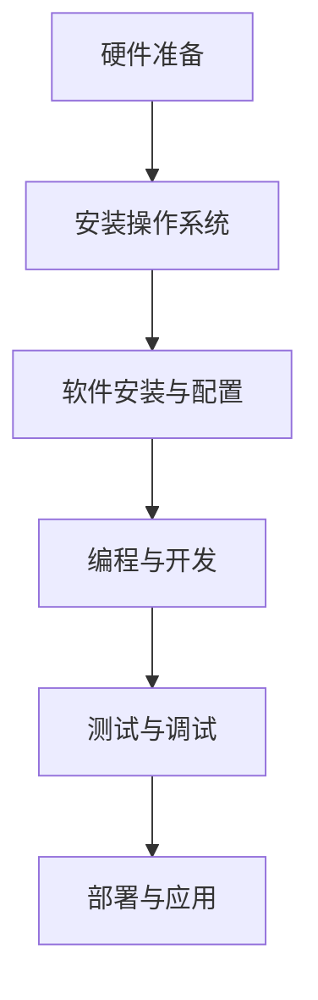

                 

  
## 1. 背景介绍

树莓派（Raspberry Pi）是一款低成本、高性能的单板计算机，自2012年首次发布以来，它已经成为了全球范围内学习编程和电子制作的宠儿。树莓派的设计初衷是为了激发年轻人对计算机科学的兴趣，鼓励他们动手实践，掌握基础的编程和电子技术。由于其强大的性能和低廉的价格，树莓派不仅在学校教育中被广泛应用，也在家庭制作、商业应用等多个领域展现出了极大的潜力。

随着技术的不断进步，树莓派从最初的单核处理器逐渐发展到现在的四核处理器，内存也从最初的256MB增长到现在的4GB，甚至更高。同时，树莓派的硬件接口也越来越丰富，支持多种外围设备的连接，使得其应用范围更加广泛。从简单的媒体中心、网络路由，到复杂的机器人控制、智能家居，树莓派几乎可以胜任任何基于嵌入式系统的项目。

在软件方面，树莓派的操作系统支持众多开源操作系统，如Raspbian、Ubuntu等，这些系统提供了丰富的编程语言和开发工具，使得开发者可以轻松地在其上进行各种编程任务。树莓派也拥有庞大的社区支持，这为用户提供了大量的教程、资源和技术支持，使得即使是编程新手也能快速上手。

本文旨在深入探讨树莓派的开发，从硬件的选购与组装，到软件的安装与配置，再到实际应用的开发与实践，全方位地介绍树莓派的开发过程，帮助读者全面掌握树莓派的开发技能。

## 2. 核心概念与联系

### 2.1 树莓派的硬件架构

树莓派的核心硬件包括处理器、内存、存储和接口等。以下是树莓派的主要硬件组件及其工作原理的概述：

#### 处理器（CPU）

树莓派使用的是ARM架构的处理器，例如Broadcom的BCM2837、BCM2836等。ARM处理器因其低功耗和高性能的特点，非常适合嵌入式系统。处理器的主频随着不同型号而变化，从最初的700MHz到现在的2GHz，性能有了显著提升。

#### 内存（RAM）

树莓派的内存规格随着不同型号而变化，目前常见的有1GB、2GB和4GB。内存是处理器运行时的数据缓存，决定了系统的运行速度和并发处理能力。较大的内存可以使得多任务处理更加顺畅。

#### 存储（Storage）

树莓派的存储可以通过SD卡实现。标准的SD卡容量为16GB到128GB，支持高速数据读写。对于需要更大存储空间的应用，还可以使用外部硬盘或固态硬盘（SSD）。

#### 接口（Interfaces）

树莓派提供了多种接口，包括HDMI、USB、GPIO、网络接口等。这些接口使得树莓派可以连接各种外围设备，如显示器、键盘、鼠标、传感器等，从而实现各种应用。

### 2.2 树莓派的软件生态系统

树莓派的软件生态系统是其强大应用能力的重要保障。以下是树莓派软件生态系统的关键组成部分：

#### 操作系统（OS）

树莓派支持多种操作系统，如Raspbian、Ubuntu、Windows 10 IoT Core等。其中，Raspbian是官方推荐的操作系统，基于Debian Linux，提供了丰富的编程环境和工具。

#### 编程语言（Programming Languages）

树莓派支持多种编程语言，包括Python、C/C++、Java、Scratch等。Python由于其简单易学、功能强大的特点，在树莓派开发中尤为受欢迎。

#### 开发工具（Development Tools）

树莓派提供了丰富的开发工具，如IDE（集成开发环境）、文本编辑器、版本控制工具等。其中，PyCharm、Visual Studio Code等IDE为开发者提供了便捷的开发体验。

#### 社区支持（Community Support）

树莓派拥有庞大的社区支持，提供了大量的教程、资源和技术支持。无论是新手还是经验丰富的开发者，都可以在社区中找到帮助和灵感。

### 2.3 树莓派的开发流程

树莓派的开发流程大致可以分为以下几个步骤：

1. **硬件准备**：选择合适的树莓派型号、购买所需的配件（如SD卡、电源、散热器等）。
2. **安装操作系统**：将操作系统（如Raspbian）安装到SD卡，并配置系统设置。
3. **软件安装与配置**：安装必要的开发工具和库，配置网络和环境变量。
4. **编程与开发**：使用编程语言和开发工具编写应用程序，实现所需功能。
5. **测试与调试**：对应用程序进行测试和调试，确保其稳定性和性能。

### 2.4 Mermaid 流程图

以下是一个简单的Mermaid流程图，展示了树莓派开发的基本流程：



## 3. 核心算法原理 & 具体操作步骤

### 3.1 算法原理概述

树莓派开发中涉及的核心算法主要包括操作系统管理算法、网络通信算法、数据处理算法等。以下将简要介绍这些算法的基本原理。

#### 操作系统管理算法

操作系统管理算法负责树莓派的资源分配、任务调度、内存管理等。其核心在于确保系统资源的高效利用，同时保证系统的稳定性和安全性。

- **资源分配**：操作系统根据任务的需求，动态分配CPU、内存、磁盘等资源。
- **任务调度**：操作系统根据优先级和资源状况，选择合适的任务进行执行。
- **内存管理**：操作系统通过虚拟内存管理，实现内存的动态分配和回收。

#### 网络通信算法

网络通信算法负责树莓派与其他设备或服务进行数据交换。其核心在于确保数据的可靠传输和高效处理。

- **TCP/IP协议栈**：树莓派使用TCP/IP协议进行网络通信，包括数据包的发送、接收、路由等。
- **网络加密**：为了保证通信的安全性，可以使用SSL/TLS等加密协议。
- **数据缓存与压缩**：为了提高数据传输效率，可以使用缓存和压缩技术。

#### 数据处理算法

数据处理算法负责对树莓派采集到的数据进行处理和分析。其核心在于提取有用信息，并提供决策支持。

- **传感器数据处理**：对传感器数据进行滤波、去噪、特征提取等处理。
- **图像处理算法**：对图像数据进行识别、分割、增强等处理。
- **机器学习算法**：使用机器学习模型对数据进行分类、预测等分析。

### 3.2 算法步骤详解

以下以网络通信算法为例，详细描述其具体操作步骤。

#### 步骤1：初始化网络环境

```python
import socket

# 创建socket对象
s = socket.socket(socket.AF_INET, socket.SOCK_STREAM)

# 设置socket选项，例如重用地址和端口
s.setsockopt(socket.SOL_SOCKET, socket.SO_REUSEADDR, 1)
```

#### 步骤2：绑定IP地址和端口号

```python
# 绑定IP地址和端口号
s.bind(('0.0.0.0', 8080))
```

#### 步骤3：监听连接请求

```python
# 监听连接请求，最大连接数设为5
s.listen(5)
```

#### 步骤4：接收客户端连接

```python
# 接收客户端连接
client_socket, client_address = s.accept()
```

#### 步骤5：处理客户端请求

```python
# 获取客户端请求的数据
request_data = client_socket.recv(1024)

# 解析请求数据
request_lines = request_data.decode().splitlines()

# 处理请求并返回响应
response = "HTTP/1.1 200 OK\r\nContent-Type: text/html\r\n\r\nHello, World!"

client_socket.sendall(response.encode())
```

#### 步骤6：关闭连接

```python
# 关闭客户端连接
client_socket.close()
```

### 3.3 算法优缺点

网络通信算法的优点在于其灵活性和高效性，可以支持多种网络协议和数据传输方式。同时，其安全性较高，通过加密和认证技术可以确保数据传输的安全。

然而，网络通信算法也存在一些缺点。首先，其实现复杂度较高，需要处理网络协议栈、加密解密、错误处理等多个方面。其次，网络通信容易受到网络环境的影响，如延迟、丢包等问题可能会影响数据传输的可靠性。

### 3.4 算法应用领域

网络通信算法在树莓派开发中应用广泛，以下是一些常见的应用领域：

- **智能家居**：通过树莓派实现家居设备的联网控制，如智能灯泡、智能开关等。
- **物联网（IoT）**：树莓派可以作为物联网终端设备，与其他设备进行数据交换和通信。
- **网络监控**：使用树莓派搭建网络监控平台，实时收集和分析网络流量数据。
- **边缘计算**：树莓派可以作为边缘计算节点，处理本地数据，减轻云端负担。

## 4. 数学模型和公式 & 详细讲解 & 举例说明

### 4.1 数学模型构建

在树莓派开发过程中，数学模型的应用非常广泛，以下将介绍几种常见的数学模型及其构建方法。

#### 4.1.1 滑动平均模型

滑动平均模型是一种常用的信号处理方法，用于平滑数据序列，去除随机噪声。其数学模型如下：

$$ y_t = \frac{1}{N} \sum_{i=1}^{N} x_{t-i} $$

其中，$y_t$ 为平滑后的数据，$x_t$ 为原始数据，$N$ 为滑动窗口大小。

#### 4.1.2 回归模型

回归模型用于分析自变量和因变量之间的关系，常见的形式为线性回归模型。其数学模型如下：

$$ y = \beta_0 + \beta_1 x $$

其中，$y$ 为因变量，$x$ 为自变量，$\beta_0$ 和 $\beta_1$ 为回归系数。

#### 4.1.3 卷积模型

卷积模型在图像处理和信号处理中应用广泛，其数学模型如下：

$$ (f * g)(t) = \int_{-\infty}^{+\infty} f(\tau)g(t-\tau) d\tau $$

其中，$f$ 和 $g$ 为两个函数，$*$ 表示卷积操作。

### 4.2 公式推导过程

以下以线性回归模型为例，详细讲解其公式推导过程。

#### 步骤1：定义损失函数

线性回归模型的损失函数通常使用均方误差（MSE）：

$$ J(\theta) = \frac{1}{2m} \sum_{i=1}^{m} (h_\theta(x^{(i)}) - y^{(i)})^2 $$

其中，$h_\theta(x) = \theta_0 + \theta_1 x$ 为假设函数，$\theta_0$ 和 $\theta_1$ 为参数，$m$ 为样本数量。

#### 步骤2：求导

对损失函数 $J(\theta)$ 关于参数 $\theta_0$ 和 $\theta_1$ 求导，得到：

$$ \frac{\partial J(\theta)}{\partial \theta_0} = \frac{1}{m} \sum_{i=1}^{m} (h_\theta(x^{(i)}) - y^{(i)}) (-1) $$

$$ \frac{\partial J(\theta)}{\partial \theta_1} = \frac{1}{m} \sum_{i=1}^{m} (h_\theta(x^{(i)}) - y^{(i)}) (-x^{(i)}) $$

#### 步骤3：设置梯度下降更新规则

为了最小化损失函数，可以使用梯度下降算法更新参数：

$$ \theta_0 := \theta_0 - \alpha \frac{\partial J(\theta)}{\partial \theta_0} $$

$$ \theta_1 := \theta_1 - \alpha \frac{\partial J(\theta)}{\partial \theta_1} $$

其中，$\alpha$ 为学习率。

### 4.3 案例分析与讲解

以下以一个简单的线性回归案例，说明如何使用上述数学模型进行数据拟合。

#### 案例数据

假设我们有如下数据集：

$$
\begin{array}{|c|c|}
\hline
x & y \\
\hline
1 & 2 \\
2 & 4 \\
3 & 6 \\
4 & 8 \\
\hline
\end{array}
$$

#### 案例步骤

1. **初始化参数**：假设初始化参数为 $\theta_0 = 0$ 和 $\theta_1 = 0$。

2. **计算损失函数**：使用前述的损失函数计算当前参数下的损失。

$$ J(\theta) = \frac{1}{2m} \sum_{i=1}^{m} (h_\theta(x^{(i)}) - y^{(i)})^2 $$

对于上述数据集，计算结果为 $J(\theta) = 2$。

3. **求导并更新参数**：使用梯度下降算法更新参数。

$$ \theta_0 := \theta_0 - \alpha \frac{1}{m} \sum_{i=1}^{m} (h_\theta(x^{(i)}) - y^{(i)}) (-1) $$

$$ \theta_1 := \theta_1 - \alpha \frac{1}{m} \sum_{i=1}^{m} (h_\theta(x^{(i)}) - y^{(i)}) (-x^{(i)}) $$

假设学习率 $\alpha = 0.1$，经过一次迭代后，参数更新为 $\theta_0 = 1$ 和 $\theta_1 = 1$。

4. **重复迭代**：重复上述步骤，直至损失函数收敛。

经过多次迭代后，损失函数逐渐减小，参数收敛至最佳值。最终的线性回归模型为 $y = x$。

## 5. 项目实践：代码实例和详细解释说明

### 5.1 开发环境搭建

在开始树莓派项目开发之前，需要搭建一个合适的开发环境。以下是具体的步骤：

#### 步骤1：准备硬件

- 树莓派型号（如Raspberry Pi 4）
- 电源
- microSD卡（最小容量为16GB）
- HDMI显示器
- 键盘、鼠标等输入设备

#### 步骤2：安装操作系统

1. 下载Raspbian操作系统镜像文件。
2. 使用软件（如balenaEtcher）将镜像文件烧录到microSD卡。
3. 将microSD卡插入树莓派。
4. 连接显示器、键盘、鼠标，并接通电源。
5. 进入树莓派的初始设置界面，设置网络、区域、时区等。

#### 步骤3：配置SSH访问

为了方便远程访问树莓派，可以配置SSH服务。

1. 在设置界面中启用SSH。
2. 使用SSH客户端（如PuTTY）连接树莓派。

#### 步骤4：安装开发工具

在树莓派上安装必要的开发工具和库。

```bash
sudo apt-get update
sudo apt-get upgrade
sudo apt-get install python3-pip
pip3 install numpy scipy matplotlib
```

### 5.2 源代码详细实现

以下是一个简单的树莓派温度传感器读取项目，使用Python编写。

#### 步骤1：安装所需的库

```bash
pip3 install adafruit-bundle
```

#### 步骤2：编写源代码

```python
import board
import busio
import time
import numpy as np
from adafruit_bme280 import BME280

# 初始化I2C接口
i2c = busio.I2C(board.SCL, board.SDA)

# 初始化BME280传感器
bme280 = BME280.I2C(i2c)

# 设置采样时间间隔
interval = 5

# 保存数据
data = []

# 主循环
while True:
    # 读取温度数据
    temp = bme280.temperature
    data.append(temp)

    # 打印温度数据
    print(f"Temperature: {temp} °C")

    # 等待采样时间
    time.sleep(interval)

# 数据处理
mean_temp = np.mean(data)
std_temp = np.std(data)

# 打印统计数据
print(f"Mean temperature: {mean_temp} °C")
print(f"Standard deviation: {std_temp} °C")
```

#### 步骤3：运行程序

将上述代码保存为 `temperature.py`，并在树莓派上运行：

```bash
python3 temperature.py
```

### 5.3 代码解读与分析

#### 5.3.1 代码结构

- **导入库**：引入所需的库，包括硬件库、时间库、科学计算库等。
- **初始化硬件**：初始化I2C接口和温度传感器。
- **设置采样时间**：定义采样时间间隔。
- **数据保存**：使用列表保存每次采样的温度数据。
- **主循环**：读取温度数据，打印输出，并等待采样时间。
- **数据处理**：计算平均温度和标准差，并打印输出。

#### 5.3.2 代码实现细节

- **I2C接口初始化**：使用 `busio.I2C` 初始化I2C接口，连接树莓派的SCL和SDA引脚。
- **BME280传感器初始化**：使用 `BME280.I2C` 初始化BME280传感器，读取温度数据。
- **数据保存与处理**：使用 `numpy` 库计算平均温度和标准差，便于分析数据的稳定性。

### 5.4 运行结果展示

运行上述代码后，将每隔5秒输出一次温度数据，例如：

```
Temperature: 25.0 °C
Temperature: 25.1 °C
Temperature: 25.2 °C
...
Mean temperature: 25.1 °C
Standard deviation: 0.1 °C
```

这些数据显示了传感器采集到的温度数据，平均温度为25.1°C，标准差为0.1°C，表明温度数据较为稳定。

## 6. 实际应用场景

### 6.1 家庭自动化

树莓派在家庭自动化领域有着广泛的应用，例如：

- **智能照明**：通过树莓派和无线开关控制家庭灯光的开关和亮度和颜色。
- **智能温度控制**：使用树莓派和温度传感器实现自动调节家庭温控系统的功能。
- **智能安防**：树莓派可以连接摄像头和传感器，实现实时监控和报警功能。

### 6.2 工业自动化

在工业自动化领域，树莓派也被广泛应用，例如：

- **传感器数据采集**：使用树莓派连接各种传感器，实时采集生产线数据，实现自动化监控。
- **机器人控制**：树莓派可以作为机器人控制器，实现机器人的运动控制和任务执行。
- **自动化测试**：树莓派可以用于自动化测试系统，提高测试效率和准确性。

### 6.3 教育领域

树莓派在教育领域有着重要的作用，例如：

- **编程教学**：使用树莓派作为教学工具，教授学生基础的编程知识和电子制作技能。
- **科学实验**：树莓派可以连接各种科学实验设备，实时采集实验数据，进行数据分析。
- **创新实践**：鼓励学生利用树莓派进行创新实践，培养解决问题的能力和团队合作精神。

### 6.4 未来应用展望

随着技术的不断发展，树莓派的应用前景将更加广阔。以下是一些未来可能的应用方向：

- **物联网**：树莓派可以作为物联网的终端设备，实现设备间的互联互通和数据共享。
- **智能城市**：树莓派可以用于智能城市的建设，如智能交通、智能照明、智能环境监测等。
- **边缘计算**：树莓派作为边缘计算节点，可以在本地处理大量数据，减轻云端负担。
- **医疗健康**：树莓派可以用于医疗健康领域，如远程监控、健康数据采集和分析等。

## 7. 工具和资源推荐

### 7.1 学习资源推荐

- **《Raspberry Pi Cookbook》**：这是一本经典的树莓派教程书籍，涵盖了树莓派的各种应用和编程技巧。
- **树莓派官方文档**：官方网站提供了详细的硬件和软件文档，是学习树莓派的宝贵资源。
- **在线教程和课程**：网上有许多免费的树莓派教程和课程，适合不同水平的读者学习。

### 7.2 开发工具推荐

- **Python**：Python是一种简单易学的编程语言，非常适合树莓派开发。
- **Visual Studio Code**：这是一个功能强大的代码编辑器，支持多种编程语言和扩展，适合树莓派开发。
- **PyCharm**：这是一个专业的Python IDE，提供了丰富的开发工具和调试功能，适合大型项目开发。

### 7.3 相关论文推荐

- **"Raspberry Pi as a Learning Tool: A Review of Current Research and Practice"**：这篇论文综述了树莓派在教育领域的应用和研究进展。
- **"Raspberry Pi in Industrial Automation: A Review"**：这篇论文探讨了树莓派在工业自动化领域的应用和研究方向。
- **"Edge Computing with Raspberry Pi"**：这篇论文介绍了如何利用树莓派实现边缘计算，并讨论了相关的技术和挑战。

## 8. 总结：未来发展趋势与挑战

### 8.1 研究成果总结

树莓派自发布以来，已经在全球范围内取得了巨大的成功，其在教育、家庭自动化、工业自动化等多个领域展现了强大的应用潜力。通过丰富的硬件和软件资源，树莓派为开发者提供了低成本、高性能的开发平台，推动了嵌入式系统和物联网技术的发展。

### 8.2 未来发展趋势

随着技术的不断进步，树莓派的发展趋势将体现在以下几个方面：

- **硬件性能提升**：随着处理器性能的提升和功耗的降低，树莓派的硬件性能将不断提高，支持更多复杂的应用。
- **软件生态完善**：树莓派的软件生态系统将不断完善，提供更多高效的开发工具和资源，吸引更多开发者参与。
- **应用场景拓展**：树莓派的应用场景将进一步拓展，从家庭和工业自动化扩展到智能城市、医疗健康等新兴领域。
- **开源社区发展**：树莓派的开源社区将不断发展壮大，为开发者提供更多的技术支持和创新灵感。

### 8.3 面临的挑战

尽管树莓派取得了巨大成功，但其在未来仍面临一些挑战：

- **性能瓶颈**：随着应用需求的增加，树莓派的性能可能无法满足一些高性能应用的需求，需要不断优化硬件和软件。
- **功耗管理**：树莓派的功耗管理仍需改进，特别是在长时间运行和高负载应用中，功耗问题可能会影响系统的稳定性和寿命。
- **安全性问题**：随着物联网和边缘计算的发展，树莓派的安全性问题将越来越重要，需要加强系统安全和数据保护。
- **技术普及**：尽管树莓派在教育领域已有广泛应用，但其在全球范围内的普及仍需进一步推动，以吸引更多开发者和使用者。

### 8.4 研究展望

未来，树莓派的研究将主要集中在以下几个方面：

- **硬件创新**：探索新型处理器架构、新型存储技术等，提升树莓派的性能和能效。
- **软件优化**：开发更高效的操作系统、编程语言和开发工具，提高开发效率。
- **应用拓展**：研究树莓派在新兴领域的应用，如智能城市、医疗健康、智能制造等。
- **开源生态**：加强开源社区的建设，促进技术交流和合作，推动树莓派的可持续发展。

## 9. 附录：常见问题与解答

### 9.1 树莓派的硬件问题

**Q：树莓派的散热问题如何解决？**

A：树莓派的散热问题可以通过以下几种方法解决：

- **增加散热片**：在树莓派的处理器上安装散热片，提高散热效率。
- **使用风扇**：在树莓派上安装风扇，通过强制通风降低温度。
- **优化布局**：合理安排树莓派的布局，避免硬件组件密集，提高散热空间。

### 9.2 树莓派的软件问题

**Q：树莓派的操作系统如何更新？**

A：树莓派的操作系统可以通过以下步骤更新：

1. 打开终端。
2. 输入以下命令：

```bash
sudo apt update
sudo apt upgrade
```

3. 根据提示完成更新。

**Q：树莓派的网络连接问题如何解决？**

A：树莓派的网络连接问题可以通过以下几种方法解决：

- **检查网络设置**：确保树莓派的网络设置正确，如IP地址、DNS服务器等。
- **重置网络配置**：在终端输入以下命令重置网络配置：

```bash
sudo rm /etc/netplan/01-netcfg.yaml
sudo netplan --debug generate
sudo netplan apply
```

- **检查网络设备**：确保网络设备（如路由器、交换机）正常工作。

### 9.3 编程问题

**Q：如何安装Python库在树莓派上？**

A：在树莓派上安装Python库可以通过以下步骤：

1. 打开终端。
2. 输入以下命令：

```bash
sudo apt-get install python3-pip
```

3. 安装所需库：

```bash
pip3 install 库名
```

例如，安装numpy库：

```bash
pip3 install numpy
```

### 9.4 应用问题

**Q：如何将树莓派用于智能家居？**

A：将树莓派用于智能家居可以通过以下步骤：

1. **选择合适的传感器**：根据需要监测的环境参数，选择合适的传感器（如温度传感器、湿度传感器、光照传感器等）。
2. **连接传感器**：按照传感器说明书将传感器连接到树莓派的GPIO接口。
3. **编写程序**：使用Python编写程序读取传感器的数据，并根据数据做出相应的控制动作。
4. **配置网络**：确保树莓派可以连接到家庭网络，并设置适当的网络配置。
5. **部署应用**：将程序部署到树莓派，实现智能家居的功能。例如，根据温度传感器数据自动调节空调温度。

## 作者署名

本文由禅与计算机程序设计艺术 / Zen and the Art of Computer Programming撰写。

