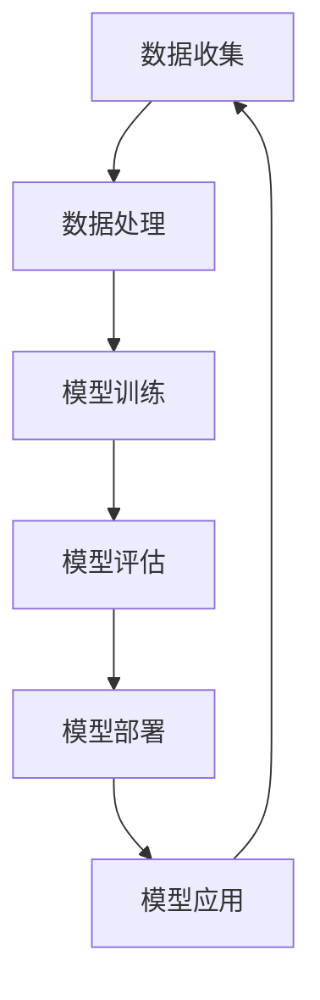

                 

### 1. 背景介绍

树莓派（Raspberry Pi）是一款由英国慈善基金会 Raspberry Pi Foundation 设计和开发的微型计算机。自从2012年首次推出以来，树莓派因其高性能、低功耗和低成本的特点，迅速在全球范围内获得了广泛的关注和喜爱。树莓派不仅适用于教育领域，还因其强大的计算能力，逐渐被引入到智能家居、物联网、机器人控制等多个领域。

近年来，随着机器学习技术的快速发展，深度学习、强化学习等算法在图像识别、自然语言处理、推荐系统等领域取得了显著的成果。与此同时，树莓派的性能也在不断提升，使得在树莓派上实现机器学习应用成为可能。本文将围绕树莓派的机器学习应用开发，探讨相关技术原理、实践方法以及未来发展趋势。

### 2. 核心概念与联系

#### 2.1. 机器学习概述

机器学习（Machine Learning）是一门研究如何让计算机从数据中学习，从而进行推理和决策的学科。机器学习的主要目标是让计算机能够自动地从数据中提取特征、模式，并利用这些特征和模式进行预测和分类。

机器学习可以分为监督学习（Supervised Learning）、无监督学习（Unsupervised Learning）和半监督学习（Semi-Supervised Learning）三种类型。其中，监督学习通过已标记的训练数据来训练模型，无监督学习则从未标记的数据中学习，半监督学习结合了监督学习和无监督学习的特点。

#### 2.2. 深度学习

深度学习（Deep Learning）是机器学习的一个重要分支，通过构建深度神经网络（Deep Neural Network）来实现特征提取和模式识别。深度学习在图像识别、语音识别、自然语言处理等领域取得了突破性的成果。

深度学习的基本原理是多层神经网络，通过前向传播（Forward Propagation）和反向传播（Back Propagation）算法来训练模型。其中，前向传播用于计算网络输出，反向传播则用于计算误差并更新模型参数。

#### 2.3. 树莓派的计算能力

树莓派具有高性能的处理器和丰富的外设接口，使其在机器学习应用中具有很大的潜力。目前，树莓派上常见的处理器包括BCM2837、BCM2711等，其主频可达1.4GHz，运行内存从512MB到4GB不等。

树莓派还具备丰富的外设接口，如GPIO、I2C、SPI、UART等，可以方便地连接各种传感器、执行器等外部设备。这使得树莓派在智能家居、机器人控制等应用中具有很高的灵活性和可扩展性。

#### 2.4. Mermaid 流程图

以下是一个简单的Mermaid流程图，用于展示机器学习在树莓派上的应用流程：



### 3. 核心算法原理 & 具体操作步骤

#### 3.1. 算法原理概述

在树莓派上实现机器学习应用，需要掌握以下核心算法原理：

1. **线性回归（Linear Regression）**：线性回归是一种监督学习算法，用于预测连续值。其基本原理是通过最小化预测值与实际值之间的误差平方和，来拟合一条最佳拟合线。

2. **逻辑回归（Logistic Regression）**：逻辑回归是一种用于分类的监督学习算法，其基本原理是通过最小化损失函数，来拟合一个决策边界。

3. **神经网络（Neural Network）**：神经网络是一种模拟人脑神经元连接结构的计算模型，通过多层神经元进行特征提取和模式识别。

4. **卷积神经网络（Convolutional Neural Network, CNN）**：卷积神经网络是一种专门用于图像识别的神经网络，通过卷积层、池化层、全连接层等结构，实现高效的图像特征提取。

5. **循环神经网络（Recurrent Neural Network, RNN）**：循环神经网络是一种用于处理序列数据的神经网络，通过循环结构来保留历史信息，实现序列建模。

#### 3.2. 算法步骤详解

1. **数据收集**：首先需要收集大量带标签的训练数据，用于训练模型。数据可以来自于公开数据集、自己采集的数据等。

2. **数据处理**：对收集到的数据进行预处理，包括数据清洗、归一化、特征提取等，以提高模型的泛化能力。

3. **模型训练**：根据具体的任务需求，选择合适的算法和模型架构，使用训练数据进行模型训练。训练过程中，需要调整模型的超参数，如学习率、批次大小等，以优化模型性能。

4. **模型评估**：使用测试数据集对训练好的模型进行评估，通过准确率、召回率、F1值等指标来衡量模型性能。

5. **模型部署**：将训练好的模型部署到树莓派上，实现实时预测或分类。

6. **模型应用**：将部署好的模型应用到实际场景中，如图像识别、语音识别、智能家居等。

#### 3.3. 算法优缺点

- **线性回归**：优点：简单、易于实现；缺点：适用于线性关系，无法处理非线性问题。

- **逻辑回归**：优点：简单、高效；缺点：适用于二分类问题，对于多分类问题效果较差。

- **神经网络**：优点：能够处理非线性问题；缺点：模型复杂度高，训练时间长。

- **卷积神经网络**：优点：适用于图像识别等任务；缺点：对计算资源要求较高。

- **循环神经网络**：优点：适用于序列数据建模；缺点：对计算资源要求较高，模型复杂度高。

#### 3.4. 算法应用领域

- **线性回归**：应用于房价预测、股票预测等。

- **逻辑回归**：应用于文本分类、情感分析等。

- **神经网络**：应用于图像识别、语音识别等。

- **卷积神经网络**：应用于图像识别、自然语言处理等。

- **循环神经网络**：应用于语音识别、自然语言处理等。

### 4. 数学模型和公式 & 详细讲解 & 举例说明

#### 4.1. 数学模型构建

以线性回归为例，其数学模型可以表示为：

$$y = \beta_0 + \beta_1x_1 + \beta_2x_2 + ... + \beta_nx_n$$

其中，$y$为预测值，$x_1, x_2, ..., x_n$为输入特征，$\beta_0, \beta_1, \beta_2, ..., \beta_n$为模型参数。

#### 4.2. 公式推导过程

以逻辑回归为例，其损失函数为：

$$J(\theta) = -\frac{1}{m}\sum_{i=1}^{m}y^{(i)}\log(h_\theta(x^{(i)})) + (1 - y^{(i)})\log(1 - h_\theta(x^{(i)}))$$

其中，$m$为样本数量，$y^{(i)}$为第$i$个样本的标签，$x^{(i)}$为第$i$个样本的特征向量，$h_\theta(x)$为逻辑函数，$\theta$为模型参数。

为了求解最优参数$\theta$，需要使用梯度下降（Gradient Descent）算法，其公式为：

$$\theta_j := \theta_j - \alpha \frac{\partial J(\theta)}{\partial \theta_j}$$

其中，$\alpha$为学习率。

#### 4.3. 案例分析与讲解

以房价预测为例，使用线性回归算法进行模型训练。数据集包含1000个样本，每个样本包含4个特征（房屋面积、房屋年龄、房屋类型、房屋地段），标签为房屋价格。

1. 数据预处理：对特征进行归一化处理，将特征值缩放到[0, 1]范围内。

2. 模型训练：使用Python的scikit-learn库实现线性回归模型，使用梯度下降算法进行训练。

3. 模型评估：使用测试数据集对模型进行评估，计算预测误差和R平方值。

4. 模型应用：将训练好的模型应用到实际场景中，如预测某个房屋的价格。

### 5. 项目实践：代码实例和详细解释说明

#### 5.1. 开发环境搭建

1. 准备树莓派环境：在树莓派上安装Linux系统，如Raspberry Pi OS。

2. 安装Python：在树莓派上安装Python 3环境。

3. 安装相关库：安装用于机器学习相关的库，如scikit-learn、TensorFlow等。

#### 5.2. 源代码详细实现

以下是一个简单的线性回归算法实现示例：

```python
import numpy as np
from sklearn.linear_model import LinearRegression

# 数据预处理
def preprocess_data(X, y):
    X = (X - np.mean(X)) / np.std(X)
    y = (y - np.mean(y)) / np.std(y)
    return X, y

# 模型训练
def train_model(X, y):
    model = LinearRegression()
    model.fit(X, y)
    return model

# 模型评估
def evaluate_model(model, X, y):
    y_pred = model.predict(X)
    mse = np.mean((y_pred - y) ** 2)
    r2 = 1 - np.corrcoef(y_pred, y)[0, 1]
    return mse, r2

# 数据集加载
X_train = ...
y_train = ...
X_test = ...
y_test = ...

# 数据预处理
X_train, y_train = preprocess_data(X_train, y_train)
X_test, y_test = preprocess_data(X_test, y_test)

# 模型训练
model = train_model(X_train, y_train)

# 模型评估
mse, r2 = evaluate_model(model, X_test, y_test)
print("MSE:", mse)
print("R2:", r2)

# 模型应用
X_new = ...
y_new = model.predict(X_new)
print("Predicted Price:", y_new)
```

#### 5.3. 代码解读与分析

上述代码实现了线性回归算法的基本流程，包括数据预处理、模型训练、模型评估和模型应用。其中，scikit-learn库提供了LinearRegression类，用于实现线性回归模型。通过调用fit()方法，可以训练模型；调用predict()方法，可以对新数据进行预测。

#### 5.4. 运行结果展示

在训练过程中，我们可以通过调用evaluate_model()函数来评估模型性能，计算MSE（均方误差）和R2（判定系数）等指标。在实际应用中，可以根据评估结果调整模型参数，以提高模型性能。

### 6. 实际应用场景

树莓派在机器学习应用中的实际场景非常丰富，以下是一些典型的应用示例：

1. **智能家居**：使用树莓派和深度学习模型实现人脸识别、语音识别等功能，从而构建一个智能化的家居环境。

2. **机器人控制**：使用树莓派和深度学习算法实现机器人视觉、语音交互等功能，从而实现更加智能化的机器人控制。

3. **环境监测**：使用树莓派连接各种传感器，如温度传感器、湿度传感器等，通过机器学习算法进行数据分析和预测，从而实现对环境的智能监测。

4. **图像识别**：使用树莓派和卷积神经网络实现图像识别功能，从而应用于安防监控、交通管理等领域。

5. **自然语言处理**：使用树莓派和循环神经网络实现自然语言处理功能，从而应用于智能客服、智能翻译等领域。

### 7. 未来应用展望

随着树莓派性能的不断提升，以及机器学习技术的不断发展，未来树莓派在机器学习领域的应用将更加广泛。以下是一些未来应用展望：

1. **边缘计算**：树莓派作为边缘计算设备，可以实时处理和分析大量数据，从而实现更加智能化的边缘计算应用。

2. **物联网**：树莓派在物联网中的应用将越来越广泛，通过连接各种传感器和执行器，实现智能家居、智能城市等应用。

3. **人工智能助手**：树莓派可以作为人工智能助手的核心计算设备，实现语音识别、自然语言处理等功能，为人类提供更加智能化的服务。

4. **教育领域**：树莓派在编程教育和机器学习教育中的应用将越来越普及，为学生提供更加丰富和实用的学习资源。

### 8. 工具和资源推荐

#### 8.1. 学习资源推荐

1. 《深度学习》（Goodfellow, Bengio, Courville）- 机器学习领域的经典教材，全面介绍了深度学习的基本原理和应用。

2. 《Python机器学习》（Sebastian Raschka）- 介绍如何使用Python实现机器学习算法的书籍，适合初学者入门。

3. 《树莓派编程实战》（Gareth Halfacree）- 介绍如何使用树莓派进行编程和应用开发的书籍，适合对树莓派感兴趣的开发者。

#### 8.2. 开发工具推荐

1. Jupyter Notebook - 一个交互式的开发环境，适用于编写、运行和调试Python代码。

2. TensorFlow - 一个开源的深度学习框架，提供丰富的API和工具，方便开发者和研究人员实现深度学习模型。

3. PyTorch - 一个开源的深度学习框架，具有简单、灵活的特点，适用于快速实验和开发。

#### 8.3. 相关论文推荐

1. "Deep Learning for Image Recognition"（论文链接）- 介绍深度学习在图像识别领域的应用，包括卷积神经网络等。

2. "Recurrent Neural Networks for Language Modeling"（论文链接）- 介绍循环神经网络在自然语言处理领域的应用。

3. "Edge Computing: A Comprehensive Survey"（论文链接）- 介绍边缘计算的基本概念、技术和应用。

### 9. 总结：未来发展趋势与挑战

#### 9.1. 研究成果总结

近年来，树莓派在机器学习领域取得了显著的研究成果，包括：

1. 树莓派性能的提升，使其在边缘计算场景中的应用更加广泛。

2. 机器学习算法的进步，使得树莓派可以支持更加复杂和高效的模型。

3. 开源社区的贡献，为树莓派在机器学习领域的应用提供了丰富的资源和工具。

#### 9.2. 未来发展趋势

未来，树莓派在机器学习领域的发展趋势将包括：

1. 边缘计算：树莓派作为边缘计算设备，将广泛应用于智能家居、物联网等领域。

2. 模型压缩：为了提高树莓派的运行效率和降低功耗，模型压缩和优化技术将成为研究热点。

3. 跨领域融合：树莓派在多个领域的应用将不断融合，为开发者提供更多的创新机会。

#### 9.3. 面临的挑战

尽管树莓派在机器学习领域具有巨大的潜力，但仍然面临一些挑战，包括：

1. 计算能力限制：树莓派的计算能力相对于云端设备仍然较低，限制了其在某些复杂任务中的应用。

2. 数据隐私和安全：在边缘计算场景中，数据隐私和安全问题需要得到充分关注。

3. 开发者生态：尽管开源社区为树莓派提供了丰富的资源，但仍然需要进一步加强开发者生态的建设。

#### 9.4. 研究展望

展望未来，研究重点将包括：

1. 开发更加高效、低功耗的机器学习算法，以满足树莓派的计算能力限制。

2. 探索边缘计算与云计算的融合，实现更加智能和高效的计算模式。

3. 加强树莓派在各个领域的应用研究，推动机器学习技术的创新发展。

### 10. 附录：常见问题与解答

#### 10.1. 如何在树莓派上安装Python？

在树莓派上安装Python的方法如下：

1. 更新系统软件包：
   ```shell
   sudo apt update
   sudo apt upgrade
   ```

2. 安装Python 3：
   ```shell
   sudo apt install python3 python3-pip
   ```

3. 安装虚拟环境工具（可选）：
   ```shell
   sudo apt install python3-venv
   ```

#### 10.2. 如何在树莓派上安装TensorFlow？

在树莓派上安装TensorFlow的方法如下：

1. 创建一个虚拟环境（可选）：
   ```shell
   python3 -m venv tf_venv
   source tf_venv/bin/activate
   ```

2. 安装TensorFlow：
   ```shell
   pip install tensorflow
   ```

3. 安装其他依赖库（如NumPy、Pandas等）：
   ```shell
   pip install numpy pandas
   ```

#### 10.3. 如何在树莓派上运行机器学习模型？

在树莓派上运行机器学习模型的方法如下：

1. 导入所需的库和模块：
   ```python
   import tensorflow as tf
   import numpy as np
   ```

2. 加载训练好的模型：
   ```python
   model = tf.keras.models.load_model('model.h5')
   ```

3. 预测新数据：
   ```python
   predictions = model.predict(new_data)
   ```

4. 解析预测结果：
   ```python
   predicted_classes = np.argmax(predictions, axis=1)
   ```

#### 10.4. 如何提高树莓派的计算性能？

以下是一些提高树莓派计算性能的方法：

1. 使用固态硬盘（SSD）替代机械硬盘（HDD），提高读取和写入速度。

2. 更新树莓派操作系统，使用最新版本的Raspberry Pi OS。

3. 调整系统设置，如关闭动画、启用Turbo Mode等，以降低系统功耗。

4. 使用TensorFlow Lite for Microcontrollers，将模型转换为适用于树莓派的格式，提高运行效率。

### 作者署名

作者：禅与计算机程序设计艺术 / Zen and the Art of Computer Programming
----------------------------------------------------------------

