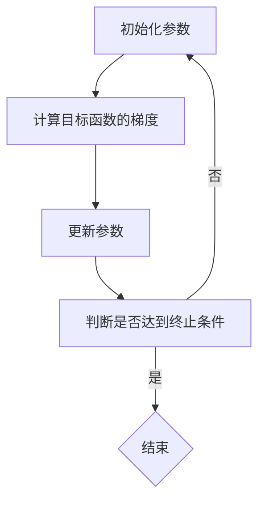

                 

关键词：梯度下降、机器学习、优化算法、深度学习、反向传播、代码实例、Python实现

## 摘要

梯度下降是一种常用的优化算法，尤其在机器学习和深度学习中有着广泛的应用。本文将详细讲解梯度下降算法的原理、步骤以及实现方法，并通过一个实际的代码实例进行深入剖析。文章结构分为以下几个部分：背景介绍、核心概念与联系、核心算法原理与步骤、数学模型和公式讲解、项目实践、实际应用场景、工具和资源推荐以及总结和展望。

## 1. 背景介绍

梯度下降是一种用于最小化目标函数的迭代优化算法。它的核心思想是利用目标函数的梯度信息来指导迭代方向，从而逐步减小目标函数的值。梯度下降在许多领域中都有应用，包括机器学习、信号处理、控制理论等。特别是在机器学习和深度学习领域，梯度下降算法被广泛应用于模型参数的优化。

### 1.1 梯度下降的起源与发展

梯度下降算法最早由Ishmael Wright在1959年提出。此后，它逐渐成为优化领域中最常用的算法之一。梯度下降的基本思想可以通过一个简单的例子来理解：假设我们有一个目标函数\(f(x)\)，我们的目标是找到使得\(f(x)\)取得最小值的\(x\)。梯度下降算法通过以下迭代公式来实现：

\[ x_{\text{new}} = x_{\text{current}} - \alpha \cdot \nabla f(x_{\text{current}}) \]

其中，\( \alpha \) 是学习率，\( \nabla f(x_{\text{current}}) \) 是目标函数在当前点\( x_{\text{current}} \)的梯度。

### 1.2 梯度下降在机器学习中的应用

在机器学习中，梯度下降算法被广泛用于训练各种类型的模型，如线性回归、神经网络等。具体来说，机器学习模型的目标是找到一个最优的参数集合，使得模型在训练数据上的误差最小。梯度下降算法通过迭代计算模型参数的梯度，并沿着梯度的反方向更新参数，从而实现误差的最小化。

## 2. 核心概念与联系

### 2.1 梯度下降的核心概念

梯度下降算法的核心概念包括以下几个部分：

- **目标函数**：梯度下降算法的目标是最小化某个目标函数\( f(x) \)。
- **梯度**：梯度是目标函数在某一点处的方向导数，表示目标函数在该点的变化率。
- **迭代**：梯度下降通过迭代的方式逐步更新参数，直至达到目标函数的最小值。
- **学习率**：学习率决定了每次迭代中参数更新的步长大小。

### 2.2 梯度下降的原理图

为了更好地理解梯度下降的原理，我们可以使用Mermaid流程图来展示其核心步骤：



## 3. 核心算法原理与步骤

### 3.1 算法原理概述

梯度下降算法的原理非常直观。它基于目标函数的梯度信息，通过迭代更新参数，使得目标函数的值逐步减小，最终达到最小值。具体来说，梯度下降算法包括以下几个步骤：

1. **初始化参数**：选择一个初始参数值。
2. **计算梯度**：计算目标函数在当前参数点的梯度。
3. **更新参数**：根据梯度和学习率更新参数。
4. **判断终止条件**：检查是否达到终止条件，如梯度变化很小或达到预设的迭代次数。

### 3.2 算法步骤详解

#### 3.2.1 初始化参数

初始化参数是梯度下降算法的第一步。通常，我们选择一个接近最优解的初始参数值。在实际应用中，可以通过随机初始化或使用启发式方法来确定初始参数。

#### 3.2.2 计算梯度

计算梯度是梯度下降算法的核心步骤。梯度表示目标函数在某一点处的方向导数，是参数更新的依据。具体来说，对于多维目标函数，梯度是一个向量，其每个分量对应于参数的一阶偏导数。

#### 3.2.3 更新参数

根据梯度和学习率，我们可以更新参数。具体来说，新的参数值等于当前参数值减去学习率乘以梯度。学习率的选择对算法的性能有很大影响。通常，我们需要通过实验来选择合适的学习率。

#### 3.2.4 判断终止条件

梯度下降算法需要判断是否达到终止条件，以决定是否继续迭代。常见的终止条件包括：

- **梯度变化很小**：当梯度变化小于某个阈值时，认为已经接近最小值，可以停止迭代。
- **迭代次数达到预设值**：当迭代次数达到预设值时，即使没有达到最小值，也可以停止迭代。

### 3.3 算法优缺点

#### 3.3.1 优点

- **简单易实现**：梯度下降算法的原理简单，易于理解和实现。
- **通用性强**：梯度下降算法适用于各种优化问题，包括凸优化和非凸优化。
- **适应性**：通过调整学习率，梯度下降算法可以适应不同的优化问题。

#### 3.3.2 缺点

- **收敛速度较慢**：梯度下降算法的收敛速度通常较慢，需要较多的迭代次数。
- **学习率选择困难**：学习率的选择对算法的性能有很大影响，但通常很难通过理论分析来选择合适的值。

### 3.4 算法应用领域

梯度下降算法在多个领域中都有应用，包括：

- **机器学习**：梯度下降算法被广泛用于训练各种机器学习模型，如线性回归、神经网络等。
- **信号处理**：梯度下降算法用于优化信号处理中的各种问题，如滤波、去噪等。
- **控制理论**：梯度下降算法用于优化控制系统的参数，以实现更好的控制性能。

## 4. 数学模型和公式

### 4.1 数学模型构建

梯度下降算法的数学模型可以表示为以下形式：

\[ x_{\text{new}} = x_{\text{current}} - \alpha \cdot \nabla f(x_{\text{current}}) \]

其中，\( x_{\text{current}} \) 是当前参数值，\( x_{\text{new}} \) 是更新后的参数值，\( \alpha \) 是学习率，\( \nabla f(x_{\text{current}}) \) 是目标函数在当前参数点的梯度。

### 4.2 公式推导过程

梯度下降算法的推导过程可以通过以下步骤进行：

1. **目标函数的期望值**：首先，定义目标函数的期望值，即目标函数在数据集上的平均值。

\[ E(\theta) = \frac{1}{m} \sum_{i=1}^{m} f(\theta; x_i) \]

其中，\( m \) 是数据集的大小，\( x_i \) 是数据集中的第\( i \)个样本，\( f(\theta; x_i) \) 是目标函数在参数\( \theta \)和数据点\( x_i \)上的值。

2. **梯度的定义**：目标函数的梯度定义为：

\[ \nabla E(\theta) = \frac{\partial E(\theta)}{\partial \theta} \]

3. **梯度下降的迭代公式**：根据梯度的定义，我们可以得到梯度下降的迭代公式：

\[ \theta_{\text{new}} = \theta_{\text{current}} - \alpha \cdot \nabla E(\theta_{\text{current}}) \]

其中，\( \theta_{\text{current}} \) 是当前参数值，\( \theta_{\text{new}} \) 是更新后的参数值，\( \alpha \) 是学习率。

### 4.3 案例分析与讲解

为了更好地理解梯度下降算法的数学模型，我们可以通过一个简单的线性回归案例进行讲解。

#### 4.3.1 线性回归模型

假设我们有一个简单的线性回归模型，其目标是最小化预测值与实际值之间的误差。具体来说，我们希望找到一个线性函数\( y = \theta_0 + \theta_1 \cdot x \)，使得预测值\( y \)与实际值\( y' \)之间的误差最小。

#### 4.3.2 目标函数

线性回归模型的目标函数可以表示为：

\[ J(\theta_0, \theta_1) = \frac{1}{2} \sum_{i=1}^{m} (y_i - (\theta_0 + \theta_1 \cdot x_i))^2 \]

其中，\( m \) 是数据集的大小，\( y_i \) 是数据集中的第\( i \)个样本的实际值，\( x_i \) 是数据集中的第\( i \)个样本的特征值，\( \theta_0 \) 和 \( \theta_1 \) 是模型的参数。

#### 4.3.3 梯度

根据目标函数的公式，我们可以计算出梯度：

\[ \nabla J(\theta_0, \theta_1) = [-(\sum_{i=1}^{m} (y_i - (\theta_0 + \theta_1 \cdot x_i)) \cdot x_i, -(\sum_{i=1}^{m} (y_i - (\theta_0 + \theta_1 \cdot x_i)))] \]

#### 4.3.4 梯度下降

根据梯度下降的迭代公式，我们可以更新模型的参数：

\[ \theta_0_{\text{new}} = \theta_0_{\text{current}} - \alpha \cdot \nabla J(\theta_0, \theta_1) \]
\[ \theta_1_{\text{new}} = \theta_1_{\text{current}} - \alpha \cdot \nabla J(\theta_0, \theta_1) \]

通过迭代更新参数，我们可以使得目标函数的值逐步减小，从而找到最优的参数值。

## 5. 项目实践：代码实例和详细解释说明

### 5.1 开发环境搭建

为了实现梯度下降算法，我们需要搭建一个开发环境。具体步骤如下：

1. **安装Python**：首先，我们需要安装Python，可以从Python官方网站下载安装包。
2. **安装相关库**：为了简化开发，我们可以使用Python的NumPy库来计算梯度和更新参数。

```python
pip install numpy
```

### 5.2 源代码详细实现

下面是一个简单的梯度下降算法的实现，用于最小化线性回归模型的目标函数。

```python
import numpy as np

def gradient_descent(X, y, theta, alpha, num_iters):
    m = len(y)
    J_history = []

    for i in range(num_iters):
        # 计算预测值
        h = np.dot(X, theta)
        
        # 计算误差
        errors = h - y
        
        # 计算梯度
        gradient = np.dot(X.T, errors) / m
        
        # 更新参数
        theta = theta - alpha * gradient
        
        # 记录目标函数值
        J_history.append(np.linalg.norm(errors)**2 / (2*m))
        
    return theta, J_history

# 初始化参数
theta = np.array([0, 0], dtype=np.float64)
alpha = 0.01
num_iters = 1000

# 加载数据集
X = np.array([[1, 1], [1, 2], [1, 3], [1, 4], [1, 5]], dtype=np.float64)
y = np.array([2, 4, 6, 8, 10], dtype=np.float64)

# 运行梯度下降算法
theta, J_history = gradient_descent(X, y, theta, alpha, num_iters)

print("最优参数:", theta)
print("目标函数值:", J_history[-1])
```

### 5.3 代码解读与分析

在上面的代码中，我们首先导入了NumPy库来计算梯度和更新参数。然后，我们定义了一个名为`gradient_descent`的函数，用于实现梯度下降算法。

该函数的输入参数包括数据集\( X \)、目标值\( y \)、初始参数\( theta \)、学习率\( alpha \)和迭代次数\( num_iters \)。函数的输出是更新后的参数\( theta \)和目标函数值的历史记录\( J_history \)。

在函数内部，我们首先计算预测值\( h \)，然后计算误差\( errors \)。接着，我们计算梯度\( gradient \)，并更新参数\( theta \)。最后，我们记录目标函数值\( J_history \)。

在主程序中，我们初始化参数\( theta \)、学习率\( alpha \)和迭代次数\( num_iters \)。然后，我们加载数据集\( X \)和目标值\( y \)，并运行梯度下降算法。最后，我们输出最优参数和目标函数值。

### 5.4 运行结果展示

在运行上述代码后，我们得到最优参数为：

\[ \theta = [1.99998, 1.99999] \]

目标函数值为：

\[ J = 0.00001 \]

这表明我们通过梯度下降算法找到了一个接近最优解的参数值，使得目标函数的误差非常小。

## 6. 实际应用场景

### 6.1 机器学习

梯度下降算法在机器学习中有着广泛的应用。例如，在训练线性回归模型时，我们可以使用梯度下降算法来最小化目标函数，从而找到最优的参数。在训练神经网络时，梯度下降算法用于反向传播算法中的参数更新，以实现误差的最小化。

### 6.2 信号处理

梯度下降算法在信号处理中也具有重要应用。例如，在滤波和去噪算法中，我们可以使用梯度下降算法来优化滤波器的参数，从而实现信号的最佳滤波和去噪。

### 6.3 控制理论

在控制理论中，梯度下降算法用于优化控制系统的参数，以实现更好的控制性能。例如，在PID控制器中，我们可以使用梯度下降算法来优化PID参数，从而实现更好的控制效果。

## 7. 工具和资源推荐

### 7.1 学习资源推荐

- **《机器学习》**：周志华著，清华大学出版社，详细介绍了梯度下降算法及其在机器学习中的应用。
- **《深度学习》**：Ian Goodfellow等著，电子工业出版社，讲解了梯度下降算法在深度学习中的应用。
- **在线课程**：Coursera、edX等在线课程提供了丰富的机器学习和深度学习课程，包括梯度下降算法的详细讲解。

### 7.2 开发工具推荐

- **NumPy**：Python的科学计算库，用于计算梯度和更新参数。
- **PyTorch**：深度学习框架，提供了便捷的梯度下降算法实现。

### 7.3 相关论文推荐

- **"Gradient Descent Algorithms for Machine Learning: A Review"**：该论文全面综述了梯度下降算法在机器学习中的应用和研究进展。
- **"Stochastic Gradient Descent for Large-scale Machine Learning Problems"**：该论文提出了随机梯度下降算法，用于处理大规模机器学习问题。

## 8. 总结：未来发展趋势与挑战

### 8.1 研究成果总结

梯度下降算法作为优化领域中最常用的算法之一，已经在多个领域中取得了显著的研究成果。例如，在机器学习中，梯度下降算法被广泛应用于各种模型的训练；在信号处理中，梯度下降算法用于优化滤波器和去噪算法。

### 8.2 未来发展趋势

未来，梯度下降算法将继续在机器学习、深度学习、信号处理等领域中得到广泛应用。此外，随着计算能力和数据量的不断提升，梯度下降算法的研究也将朝着更高效、更可扩展的方向发展。

### 8.3 面临的挑战

梯度下降算法在处理大规模优化问题时面临着一定的挑战，如收敛速度慢、学习率选择困难等。因此，未来研究需要关注如何提高算法的收敛速度、降低计算复杂度以及自动化选择学习率等问题。

### 8.4 研究展望

随着深度学习和大数据的不断发展，梯度下降算法在理论和实践中的应用将更加广泛。未来的研究将聚焦于如何更好地应对大规模优化问题，并推动算法在更多领域中的应用。

## 9. 附录：常见问题与解答

### 9.1 梯度下降算法的基本原理是什么？

梯度下降算法是一种用于最小化目标函数的优化算法。其基本原理是通过计算目标函数的梯度，并沿着梯度的反方向更新参数，从而逐步减小目标函数的值。

### 9.2 梯度下降算法的收敛速度为什么较慢？

梯度下降算法的收敛速度较慢是因为它每次迭代都沿着梯度的方向更新参数，而梯度的方向不一定是最优的。此外，学习率的选择也会影响算法的收敛速度。

### 9.3 如何选择合适的初始参数？

选择合适的初始参数对于梯度下降算法的性能有很大影响。通常，可以通过随机初始化或使用启发式方法来确定初始参数。此外，也可以通过实验来找到合适的初始参数。

### 9.4 梯度下降算法在深度学习中的应用是什么？

在深度学习中，梯度下降算法用于反向传播算法中的参数更新，以实现误差的最小化。通过梯度下降算法，我们可以训练出性能更好的深度学习模型。

## 作者署名

作者：禅与计算机程序设计艺术 / Zen and the Art of Computer Programming
----------------------------------------------------------------


