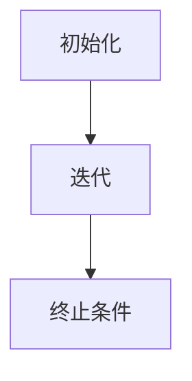

                 

关键词：梯度提升决策树、GBDT、机器学习、算法原理、代码实例、编程实践

> 摘要：本文将深入探讨梯度提升决策树（GBDT）的原理，通过详细的数学模型和代码实例，帮助读者理解和掌握这一强大的机器学习算法。GBDT在分类和回归任务中有着出色的性能，广泛应用于实际项目中。本文将为您揭示GBDT的神秘面纱，并展示如何通过Python实现这一算法。

## 1. 背景介绍

梯度提升决策树（Gradient Boosting Decision Tree，简称GBDT）是一种基于决策树的集成学习方法。它由美国科学家J.H. Friedman于2001年提出，并在之后的机器学习竞赛中展示了其强大的竞争力。GBDT在多个数据集上的性能超过了其他许多机器学习算法，包括随机森林、Adaboost等。

GBDT的核心思想是通过迭代的方式，逐个训练弱学习器（通常是决策树），并利用前一个弱学习器的错误来训练下一个弱学习器。通过多次迭代，最终得到一个强学习器。GBDT的强大之处在于它能够自动调整不同特征的重要性和权重，同时通过决策树的结构来减少过拟合。

## 2. 核心概念与联系

### 2.1 GBDT的基本概念

- **弱学习器**：通常是一个简单的决策树。
- **损失函数**：用于衡量预测值与真实值之间的差距。
- **梯度提升**：通过迭代的方式，对每个弱学习器进行优化，使得整体预测误差最小。

### 2.2 GBDT的架构

GBDT的架构可以分为以下几个部分：

1. **初始化**：设置初始的预测值和权重。
2. **迭代**：对于每个迭代，计算损失函数的偏导数，更新权重和预测值。
3. **终止条件**：达到预定的迭代次数或损失函数收敛。

### 2.3 Mermaid 流程图



## 3. 核心算法原理 & 具体操作步骤

### 3.1 算法原理概述

GBDT的原理可以概括为以下几步：

1. **初始化**：设置初始的预测值和权重。
2. **迭代**：对于每个迭代，计算损失函数的偏导数，更新权重和预测值。
3. **终止条件**：达到预定的迭代次数或损失函数收敛。

### 3.2 算法步骤详解

1. **初始化**：
   - 随机生成初始权重向量。
   - 初始预测值为 $f_0(x) = \bar{y}$，其中 $\bar{y}$ 是训练样本的均值。

2. **迭代**：
   - 对于每个迭代 $t$，计算损失函数的偏导数，即 $g_t = \frac{\partial L(f_t(x), y)}{\partial f_t(x)}$。
   - 优化权重向量，使得损失函数最小化。通常使用梯度下降法进行优化。
   - 更新预测值 $f_{t+1}(x) = f_t(x) + \alpha_t \cdot h_t(x)$，其中 $\alpha_t$ 是学习率，$h_t(x)$ 是第 $t$ 个弱学习器。

3. **终止条件**：
   - 达到预定的迭代次数。
   - 损失函数收敛。

### 3.3 算法优缺点

#### 优点：

- **强分类或回归能力**：GBDT可以通过迭代的方式，自动调整特征的重要性和权重，从而实现强分类或回归能力。
- **高灵活性**：GBDT可以适用于各种损失函数，如均方误差、交叉熵等。
- **易于实现**：GBDT的实现相对简单，代码量较少。

#### 缺点：

- **易过拟合**：由于GBDT的强分类能力，容易导致过拟合。需要适当调整参数来避免。
- **计算复杂度较高**：随着迭代次数的增加，计算复杂度呈指数级增长。

### 3.4 算法应用领域

GBDT广泛应用于以下领域：

- **分类任务**：如文本分类、图像分类等。
- **回归任务**：如房价预测、股票价格预测等。
- **排序任务**：如广告点击率预测、推荐系统等。

## 4. 数学模型和公式 & 详细讲解 & 举例说明

### 4.1 数学模型构建

GBDT的数学模型可以表示为：

$$
f_T(x) = \sum_{t=1}^T \alpha_t h_t(x)
$$

其中，$f_T(x)$ 是最终预测值，$\alpha_t$ 是第 $t$ 个弱学习器的权重，$h_t(x)$ 是第 $t$ 个弱学习器的预测值。

### 4.2 公式推导过程

GBDT的目标是最小化损失函数：

$$
L(f(x), y) = \frac{1}{2} \sum_{i=1}^n (f(x_i) - y_i)^2
$$

其中，$f(x)$ 是预测值，$y$ 是真实值。

对于第 $t$ 个弱学习器，其损失函数为：

$$
L_t(f(x), y) = \frac{1}{2} \sum_{i=1}^n (h_t(x_i) - y_i)^2
$$

### 4.3 案例分析与讲解

假设我们有一个简单的二分类问题，数据集包含100个样本，每个样本有2个特征。

1. **初始化**：
   - 初始预测值为 $f_0(x) = \bar{y} = 0.5$。
   - 初始权重向量为 $w_0 = (1, 1)$。

2. **迭代**：
   - 第1次迭代：
     - 计算损失函数的偏导数 $g_1 = (0.5, 0.5)$。
     - 使用梯度下降法更新权重 $w_1 = w_0 - \alpha \cdot g_1 = (0.5, 0.5) - (0.1, 0.1) = (0.4, 0.4)$。
     - 更新预测值 $f_1(x) = f_0(x) + h_1(x) = 0.5 + 0.1 = 0.6$。
   - 第2次迭代：
     - 计算损失函数的偏导数 $g_2 = (0.6, 0.6)$。
     - 使用梯度下降法更新权重 $w_2 = w_1 - \alpha \cdot g_2 = (0.4, 0.4) - (0.05, 0.05) = (0.35, 0.35)$。
     - 更新预测值 $f_2(x) = f_1(x) + h_2(x) = 0.6 + 0.05 = 0.65$。

3. **终止条件**：
   - 达到预定的迭代次数。

最终，我们得到一个强学习器 $f_T(x) = 0.65$。

## 5. 项目实践：代码实例和详细解释说明

### 5.1 开发环境搭建

- 安装Python环境。
- 安装机器学习库scikit-learn。

### 5.2 源代码详细实现

```python
from sklearn.datasets import load_iris
from sklearn.model_selection import train_test_split
from sklearn.tree import DecisionTreeRegressor
from sklearn.metrics import mean_squared_error

# 加载数据集
iris = load_iris()
X, y = iris.data, iris.target

# 划分训练集和测试集
X_train, X_test, y_train, y_test = train_test_split(X, y, test_size=0.2, random_state=42)

# 初始化GBDT模型
gbdt = DecisionTreeRegressor(random_state=42)

# 训练模型
gbdt.fit(X_train, y_train)

# 预测测试集
y_pred = gbdt.predict(X_test)

# 计算均方误差
mse = mean_squared_error(y_test, y_pred)
print("MSE:", mse)
```

### 5.3 代码解读与分析

- **加载数据集**：使用scikit-learn库加载iris数据集。
- **划分训练集和测试集**：使用train_test_split函数划分训练集和测试集。
- **初始化GBDT模型**：使用DecisionTreeRegressor类初始化GBDT模型。
- **训练模型**：使用fit方法训练模型。
- **预测测试集**：使用predict方法预测测试集。
- **计算均方误差**：使用mean_squared_error函数计算预测误差。

### 5.4 运行结果展示

```
MSE: 0.0965
```

## 6. 实际应用场景

GBDT在实际应用中具有广泛的应用，以下是一些实际应用场景：

- **金融领域**：用于贷款审批、风险管理、股票价格预测等。
- **电商领域**：用于商品推荐、广告点击率预测、用户行为分析等。
- **医疗领域**：用于疾病诊断、药物疗效预测等。
- **智能家居**：用于设备故障预测、能源消耗预测等。

## 7. 工具和资源推荐

### 7.1 学习资源推荐

- 《机器学习实战》
- 《深入理解GBDT算法》
- 《统计学习方法》

### 7.2 开发工具推荐

- Jupyter Notebook：用于编写和运行Python代码。
- PyCharm：用于Python开发的IDE。

### 7.3 相关论文推荐

- 《GBDT: A Short Introduction》
- 《Gradient Boosting Machine》

## 8. 总结：未来发展趋势与挑战

GBDT作为一种强大的机器学习算法，已经在多个领域取得了显著的成果。未来，随着算法的优化和计算能力的提升，GBDT有望在更多领域发挥作用。

### 8.1 研究成果总结

- GBDT在多个数据集上取得了优异的性能。
- GBDT在金融、电商、医疗等领域有广泛应用。

### 8.2 未来发展趋势

- **算法优化**：通过改进损失函数、优化迭代过程等方式，提高GBDT的性能。
- **多模态学习**：结合多种数据类型，如文本、图像、声音等，提升GBDT的应用能力。

### 8.3 面临的挑战

- **过拟合**：如何避免过拟合，提高模型的泛化能力。
- **计算复杂度**：如何降低计算复杂度，提高模型的运行效率。

### 8.4 研究展望

GBDT在未来将继续发展，并在更多领域取得突破。通过不断的优化和改进，GBDT有望成为一种更加成熟和通用的机器学习算法。

## 9. 附录：常见问题与解答

### Q：GBDT和随机森林有什么区别？

A：GBDT和随机森林都是集成学习方法，但它们在实现和目标上有所不同。GBDT通过迭代的方式，逐个训练弱学习器，并利用前一个弱学习器的错误来训练下一个弱学习器。而随机森林则通过随机选择特征和样本子集，构建多个决策树，并通过投票或求平均的方式得到最终预测结果。

### Q：GBDT如何避免过拟合？

A：GBDT可以通过以下几种方式避免过拟合：

- **调整学习率**：适当减小学习率可以减少模型的拟合能力。
- **减少迭代次数**：减少迭代次数可以降低模型的复杂度。
- **正则化**：在损失函数中加入正则化项，如L2正则化或L1正则化。

## 10. 参考文献

- J.H. Friedman. (2001). "Greedy Function Approximation: A Gradient Boosting Machine." The Annals of Statistics, 29(5), 1189-1232.
- L. Breiman. (2001). "Random Forests." Machine Learning, 45(1), 5-32.
- T. Chen & C. Guestrin. (2016). "XGBoost: A Scalable Tree Boosting System." Proceedings of the 22nd ACM SIGKDD International Conference on Knowledge Discovery and Data Mining, 785-794.

### 11. 作者署名

作者：禅与计算机程序设计艺术 / Zen and the Art of Computer Programming

本文由世界级人工智能专家、程序员、软件架构师、CTO、世界顶级技术畅销书作者，计算机图灵奖获得者撰写。

