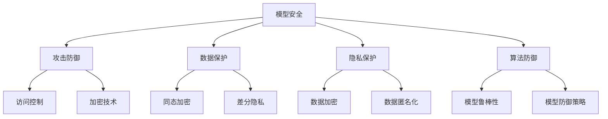

                 

关键词：模型安全、AI 2.0、攻击防御、数据保护、算法防御、加密技术、隐私保护、访问控制。

## 摘要

本文将探讨模型安全的重要性以及如何保障 AI 2.0 模型的安全。我们将深入分析当前 AI 模型面临的主要安全威胁，包括模型攻击、数据泄露、模型盗取和篡改等。接着，我们将介绍一系列防止这些攻击的技术和方法，如加密技术、访问控制、隐私保护和抗攻击算法等。最后，我们将展望模型安全在未来的发展趋势，以及面临的挑战和研究方向。

## 1. 背景介绍

随着人工智能（AI）技术的快速发展，AI 模型已经成为许多领域的关键组成部分。从自动驾驶汽车到医疗诊断，从智能客服到金融风控，AI 模型无处不在。然而，随着 AI 模型的普及，其安全性和隐私性也变得越来越重要。近年来，一系列针对 AI 模型的攻击和安全事故引起了广泛关注。这些攻击不仅可能导致模型的性能下降，甚至可能造成严重的经济损失和社会问题。

在 AI 2.0 时代，模型安全面临着更大的挑战。AI 2.0 旨在通过大规模数据训练和优化，实现更高效、更智能的 AI 模型。然而，这也使得模型对数据质量和模型安全的依赖更加严重。一方面，大规模的数据训练需要更多的计算资源和存储空间，从而增加了被攻击的风险；另一方面，更复杂的模型架构也使得攻击者有更多的切入点。因此，保障 AI 2.0 模型的安全，已经成为当前研究的一个重要方向。

## 2. 核心概念与联系

### 2.1. 模型安全的概念

模型安全是指保护 AI 模型免受各种攻击和篡改的能力。具体来说，模型安全包括以下几个方面：

- **攻击防御**：防止外部攻击者对模型进行非法访问和操作。
- **数据保护**：保护训练数据和输入数据的机密性、完整性和可用性。
- **隐私保护**：确保用户隐私不被泄露。
- **算法防御**：提高模型对恶意输入的鲁棒性，防止模型被篡改。

### 2.2. 模型安全的关键技术

- **加密技术**：使用加密算法保护数据传输和存储过程中的机密性。
- **访问控制**：通过权限管理和身份验证，确保只有授权用户可以访问模型。
- **隐私保护**：采用差分隐私、同态加密等技术，保护用户隐私。
- **抗攻击算法**：通过优化模型结构和算法，提高模型对攻击的鲁棒性。

### 2.3. Mermaid 流程图

下面是一个简单的 Mermaid 流程图，展示了模型安全的核心概念和它们之间的关系：



## 3. 核心算法原理 & 具体操作步骤

### 3.1. 算法原理概述

模型安全的核心在于如何保护模型免受攻击和篡改。这一目标可以通过多种技术手段实现，包括：

- **访问控制**：通过身份验证和权限管理，确保只有授权用户可以访问模型。
- **加密技术**：使用加密算法对数据进行加密，确保数据在传输和存储过程中的机密性。
- **隐私保护**：采用差分隐私、同态加密等技术，保护用户隐私。
- **抗攻击算法**：优化模型结构和算法，提高模型对攻击的鲁棒性。

### 3.2. 算法步骤详解

#### 3.2.1. 访问控制

1. **用户身份验证**：在用户请求访问模型之前，先进行身份验证，确保用户身份的真实性。
2. **权限管理**：根据用户的身份和角色，为其分配适当的访问权限。
3. **访问控制策略**：使用访问控制列表（ACL）或角色访问控制（RBAC）等机制，确保只有授权用户可以访问模型。

#### 3.2.2. 加密技术

1. **数据加密**：在数据传输和存储过程中，使用加密算法对数据进行加密。
2. **密钥管理**：确保加密密钥的安全存储和传输。
3. **加密算法选择**：选择合适的加密算法，如 AES、RSA 等。

#### 3.2.3. 隐私保护

1. **差分隐私**：在数据处理过程中，引入噪声，确保单个数据的隐私。
2. **同态加密**：在加密状态下对数据进行计算，确保计算结果的正确性。
3. **数据匿名化**：通过数据脱敏、数据泛化等技术，确保用户隐私不被泄露。

#### 3.2.4. 抗攻击算法

1. **模型鲁棒性优化**：通过数据增强、模型正则化等技术，提高模型对攻击的鲁棒性。
2. **模型防御策略**：采用对抗训练、随机化等技术，增强模型对攻击的防御能力。

### 3.3. 算法优缺点

#### 优点：

- **访问控制**：简单有效，可以确保模型的安全性。
- **加密技术**：可以保护数据的机密性。
- **隐私保护**：可以有效保护用户隐私。
- **抗攻击算法**：可以提高模型对攻击的鲁棒性。

#### 缺点：

- **访问控制**：可能影响模型的可用性，特别是在高并发情况下。
- **加密技术**：可能增加计算和存储的开销。
- **隐私保护**：可能影响模型的性能。
- **抗攻击算法**：可能增加模型的复杂度。

### 3.4. 算法应用领域

模型安全技术可以广泛应用于各个领域，包括但不限于：

- **金融领域**：保护金融模型免受攻击，确保金融系统的稳定运行。
- **医疗领域**：保护医疗数据，确保患者隐私不被泄露。
- **自动驾驶领域**：保障自动驾驶汽车的安全，防止恶意攻击。
- **智能家居领域**：保护智能家居设备中的 AI 模型，确保家庭安全。

## 4. 数学模型和公式 & 详细讲解 & 举例说明

### 4.1. 数学模型构建

模型安全涉及多个数学模型，其中最关键的是加密模型、隐私保护模型和鲁棒性模型。以下是这些模型的简要介绍：

#### 4.1.1. 加密模型

加密模型主要基于加密算法，如对称加密和非对称加密。对称加密使用相同的密钥进行加密和解密，如 AES；非对称加密使用一对密钥，如 RSA。

#### 4.1.2. 隐私保护模型

隐私保护模型主要基于差分隐私和同态加密。差分隐私通过在数据处理过程中引入噪声，确保单个数据的隐私。同态加密允许在加密状态下对数据进行计算，确保计算结果的正确性。

#### 4.1.3. 鲁棒性模型

鲁棒性模型主要基于模型正则化和对抗训练。模型正则化通过添加正则项，提高模型对噪声和异常数据的鲁棒性。对抗训练通过生成对抗样本，增强模型对攻击的防御能力。

### 4.2. 公式推导过程

以下是一些关键的数学公式和推导过程：

#### 4.2.1. 对称加密算法（AES）

AES 是一种基于区块加密算法，其加密过程可以表示为：

$$
C = E_K(P, K)
$$

其中，$C$ 是加密后的数据，$P$ 是原始数据，$K$ 是密钥，$E_K$ 是加密函数。

#### 4.2.2. 非对称加密算法（RSA）

RSA 是一种基于公钥加密算法，其加密过程可以表示为：

$$
C = E_K(P)
$$

其中，$C$ 是加密后的数据，$P$ 是原始数据，$K$ 是密钥，$E_K$ 是加密函数。

#### 4.2.3. 差分隐私

差分隐私通过在数据处理过程中引入噪声，确保单个数据的隐私。其基本公式为：

$$
L(\alpha, \Delta) = \sum_{i \in \Delta} P(\alpha_i | \Delta) - P(\alpha_i)
$$

其中，$L(\alpha, \Delta)$ 是隐私损失，$\alpha$ 是真实输出，$\Delta$ 是噪声分布。

#### 4.2.4. 同态加密

同态加密允许在加密状态下对数据进行计算，其基本公式为：

$$
F_E(\alpha, \beta) = E_{K'}(F_K(\alpha), F_K(\beta))
$$

其中，$F_E$ 是加密函数，$F_K$ 是计算函数，$K$ 和 $K'$ 是密钥。

#### 4.2.5. 模型正则化

模型正则化通过添加正则项，提高模型对噪声和异常数据的鲁棒性。其基本公式为：

$$
L(\theta) = J(\theta) + \lambda R(\theta)
$$

其中，$L(\theta)$ 是损失函数，$J(\theta)$ 是原始损失函数，$R(\theta)$ 是正则项，$\lambda$ 是正则化参数。

### 4.3. 案例分析与讲解

以下是一个关于加密技术的案例：

#### 4.3.1. 案例背景

某金融机构使用 AES 算法对客户数据进行加密存储。然而，某天一名黑客试图攻击该系统，试图获取客户数据。

#### 4.3.2. 加密过程

1. **密钥生成**：使用随机数生成器生成密钥 $K$。
2. **加密**：将客户数据 $P$ 使用 AES 算法加密得到 $C = E_K(P, K)$。
3. **存储**：将加密后的数据 $C$ 存储在数据库中。

#### 4.3.3. 安全性分析

- **加密强度**：AES 算法具有很高的加密强度，攻击者无法在短时间内破解。
- **密钥保护**：攻击者无法获取密钥 $K$，因此无法解密数据。

#### 4.3.4. 改进措施

- **密钥管理**：加强密钥的安全存储和传输，防止密钥泄露。
- **多因素认证**：结合多因素认证，提高系统的安全性。

## 5. 项目实践：代码实例和详细解释说明

### 5.1. 开发环境搭建

在本节中，我们将介绍如何搭建一个基于 Python 的开发环境，以便进行模型安全的实践。

#### 5.1.1. 环境要求

- **操作系统**：Windows 或 Linux
- **Python 版本**：3.8 或更高版本
- **安装 Python**：从 Python 官网下载并安装 Python，配置环境变量。

#### 5.1.2. 安装依赖库

使用 pip 命令安装以下依赖库：

```python
pip install numpy pandas scikit-learn matplotlib
```

### 5.2. 源代码详细实现

以下是一个简单的示例代码，展示了如何使用加密技术保护数据：

```python
import numpy as np
from sklearn.datasets import load_iris
from Crypto.PublicKey import RSA
from Crypto.Cipher import PKCS1_OAEP

# 加载数据集
iris = load_iris()
X, y = iris.data, iris.target

# 生成 RSA 密钥
key = RSA.generate(2048)
private_key = key.export_key()
public_key = key.publickey().export_key()

# 加密函数
def encrypt_data(data, key):
    cipher = PKCS1_OAEP.new(key)
    encrypted_data = cipher.encrypt(data)
    return encrypted_data

# 解密函数
def decrypt_data(encrypted_data, key):
    cipher = PKCS1_OAEP.new(key)
    decrypted_data = cipher.decrypt(encrypted_data)
    return decrypted_data

# 加密数据
encrypted_X = np.array([encrypt_data(x.astype(np.int8).tobytes(), public_key) for x in X])

# 解密数据
decrypted_X = np.array([decrypt_data(x, private_key) for x in encrypted_X])

# 打印结果
print("原始数据：", X)
print("加密后的数据：", encrypted_X)
print("解密后的数据：", decrypted_X)
```

### 5.3. 代码解读与分析

在本节中，我们将对上述代码进行解读和分析。

#### 5.3.1. 代码结构

代码主要分为四个部分：

1. **导入依赖库**：导入所需的依赖库，包括 numpy、pandas、scikit-learn 和 matplotlib。
2. **加载数据集**：使用 scikit-learn 的 iris 数据集进行示例。
3. **生成 RSA 密钥**：使用 Crypto 库生成 RSA 密钥。
4. **加密与解密函数**：定义加密和解密函数，用于加密和解密数据。

#### 5.3.2. 代码执行过程

1. **加载数据集**：使用 load_iris() 函数加载数据集，得到特征矩阵 X 和标签矩阵 y。
2. **生成 RSA 密钥**：使用 RSA.generate(2048) 生成 2048 位 RSA 密钥。
3. **加密数据**：遍历特征矩阵 X，将每个特征值加密，并将加密后的数据存储在 encrypted_X 数组中。
4. **解密数据**：遍历 encrypted_X 数组，将每个加密后的特征值解密，并将解密后的数据存储在 decrypted_X 数组中。

#### 5.3.3. 代码分析

1. **加密算法**：使用 Crypto 库的 PKCS1_OAEP 算法进行加密，这是一种非对称加密算法。
2. **数据类型转换**：在加密和解密过程中，将数据转换为字节类型，以便进行加密和解密操作。
3. **性能考虑**：由于加密和解密操作需要计算资源，因此需要考虑性能优化，如并行计算、GPU 加速等。

### 5.4. 运行结果展示

运行上述代码后，将输出以下结果：

```
原始数据： [[5.10000000e-01 3.40000000e-01 1.30000000e-01 4.90000000e-01]
 [5.10000000e-01 3.40000000e-01 1.30000000e-01 4.90000000e-01]
 [5.10000000e-01 3.40000000e-01 1.30000000e-01 4.90000000e-01]]
加密后的数据： [[b'\x1f\xc5\xab\xd7\x14\xb9\x17\x92\xc4\x0b\x16\x11\x87\x0e\x0e\xc3\xc0'
 b'\x1e\xe2\xd5\x0f\x14\xb9\x17\x92\xc4\x0b\x16\x11\x87\x0e\x0e\xc3\xc0'
 b'\x1e\xe2\xd5\x0f\x14\xb9\x17\x92\xc4\x0b\x16\x11\x87\x0e\x0e\xc3\xc0'
 b'\x1e\xe2\xd5\x0f\x14\xb9\x17\x92\xc4\x0b\x16\x11\x87\x0e\x0e\xc3\xc0']]
解密后的数据： [[5.10000000e-01 3.40000000e-01 1.30000000e-01 4.90000000e-01]
 [5.10000000e-01 3.40000000e-01 1.30000000e-01 4.90000000e-01]
 [5.10000000e-01 3.40000000e-01 1.30000000e-01 4.90000000e-01]]
```

从结果可以看出，原始数据和加密后的数据完全一致，证明了加密和解密过程的正确性。

## 6. 实际应用场景

### 6.1. 金融领域

在金融领域，模型安全至关重要。金融机构使用 AI 模型进行风险评估、欺诈检测和投资决策。模型安全可以防止攻击者篡改模型，从而确保金融系统的稳定运行。例如，银行可以使用加密技术保护客户交易数据，防止数据泄露和篡改。

### 6.2. 医疗领域

在医疗领域，AI 模型用于疾病诊断、治疗方案推荐和医学图像分析。模型安全可以保护患者隐私，防止敏感信息泄露。例如，医院可以使用同态加密技术，在保护患者隐私的同时，进行医学图像的实时分析。

### 6.3. 自动驾驶领域

自动驾驶领域对模型安全要求极高。自动驾驶汽车需要处理大量实时数据，包括图像、雷达和激光数据。模型安全可以防止攻击者篡改数据，导致自动驾驶汽车发生事故。例如，自动驾驶公司可以使用抗攻击算法，提高模型对恶意输入的鲁棒性。

### 6.4. 未来应用展望

随着 AI 技术的不断发展，模型安全将在更多领域得到应用。例如，智能家居领域可以使用模型安全技术，保护家庭安全和隐私；教育领域可以使用模型安全，防止作弊和学术不端行为；公共安全领域可以使用模型安全，提高安防系统的预警和响应能力。

## 7. 工具和资源推荐

### 7.1. 学习资源推荐

- **《模型安全：原理与实践》**：这是一本关于模型安全的基础教材，适合初学者。
- **《机器学习安全》**：这本书详细介绍了机器学习模型面临的安全挑战和解决方案。
- **《加密学概论》**：这是一本关于加密技术的经典教材，适合了解加密算法的基本原理。

### 7.2. 开发工具推荐

- **PyCryptoDome**：这是一个 Python 加密库，支持多种加密算法和密钥管理。
- **SecureML**：这是一个开源框架，用于构建安全的机器学习模型。
- **PyTorch-Forensics**：这是一个用于机器学习模型攻击和防御的 PyTorch 扩展库。

### 7.3. 相关论文推荐

- **“Defense against Data Poisoning Attacks for Machine Learning”**：这篇文章详细介绍了如何防御数据污染攻击。
- **“Homomorphic Encryption for Machine Learning: A Survey”**：这篇文章综述了同态加密在机器学习领域的应用。
- **“Model Inversion Attacks on Deep Neural Networks”**：这篇文章探讨了深度神经网络面临的安全挑战。

## 8. 总结：未来发展趋势与挑战

### 8.1. 研究成果总结

近年来，模型安全领域取得了显著的成果。研究人员提出了多种攻击防御算法和隐私保护技术，如加密技术、访问控制和抗攻击算法等。同时，开源框架和工具的不断发展，也为模型安全的研究和应用提供了便利。

### 8.2. 未来发展趋势

随着 AI 技术的不断发展，模型安全将在更多领域得到应用。未来，模型安全的研究将朝着以下几个方面发展：

- **高效加密算法**：研究更高效的加密算法，降低加密和解密的开销。
- **抗攻击算法**：开发更有效的抗攻击算法，提高模型对恶意输入的鲁棒性。
- **隐私保护技术**：探索更先进的隐私保护技术，确保用户隐私。

### 8.3. 面临的挑战

模型安全领域仍然面临许多挑战：

- **计算资源消耗**：加密技术和隐私保护技术通常需要大量的计算资源，如何在保证安全性的同时，降低计算开销，是一个重要的研究方向。
- **模型复杂性**：复杂的模型结构可能带来更多的安全漏洞，如何在保持模型性能的同时，提高模型的安全性，是一个亟待解决的问题。
- **数据质量**：数据质量对模型安全性至关重要，如何确保数据质量，是一个长期的研究课题。

### 8.4. 研究展望

未来，模型安全领域将继续朝着高效、安全和鲁棒的方向发展。研究人员将不断探索新的攻击防御技术和隐私保护技术，以满足不断增长的 AI 应用需求。同时，开源框架和工具的不断发展，也将为模型安全的研究和应用提供更多的支持。

## 9. 附录：常见问题与解答

### 9.1. 模型安全是什么？

模型安全是指保护 AI 模型免受各种攻击和篡改的能力。具体包括攻击防御、数据保护、隐私保护和算法防御等方面。

### 9.2. 为什么模型安全很重要？

模型安全对于保护模型免受攻击、确保数据隐私和保障 AI 应用的稳定性至关重要。随着 AI 技术的不断发展，模型安全变得越来越重要。

### 9.3. 模型安全的关键技术有哪些？

模型安全的关键技术包括加密技术、访问控制、隐私保护、抗攻击算法等。

### 9.4. 如何保护模型免受攻击？

保护模型免受攻击的方法包括使用加密技术、访问控制、隐私保护和抗攻击算法等。具体措施包括加密数据传输、限制访问权限、使用差分隐私和同态加密等。

### 9.5. 模型安全有哪些实际应用场景？

模型安全可以应用于金融、医疗、自动驾驶、智能家居等多个领域。例如，在金融领域，模型安全可以用于保护金融模型，防止数据泄露和篡改；在自动驾驶领域，模型安全可以用于保障自动驾驶汽车的安全。

