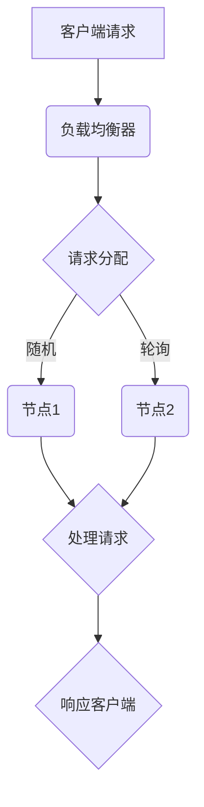
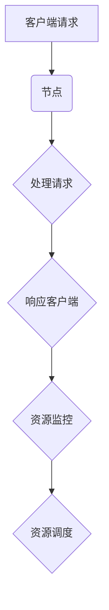

                 

在当今快速发展的信息技术时代，横向扩展（Horizontal Scaling）与纵向扩展（Vertical Scaling）已成为提升系统性能和可扩展性的两大关键策略。本文旨在探讨这两种扩展方式的最佳实践，帮助读者理解其原理、应用场景和优缺点，以指导实际系统设计和部署。

> **关键词**：横向扩展，纵向扩展，系统性能，可扩展性，最佳实践
>
> **摘要**：本文将详细介绍横向扩展与纵向扩展的概念、原理、应用场景和最佳实践，通过深入分析其在实际系统中的应用，帮助读者掌握系统扩展的核心技巧，实现高效、可扩展的系统架构。

## 1. 背景介绍

随着互联网的迅猛发展，业务需求不断增长，系统需要能够快速响应并处理海量的数据和服务请求。为了应对这种需求，系统架构设计者必须关注系统性能和可扩展性。横向扩展与纵向扩展作为系统扩展的两大核心策略，得到了广泛的应用和探讨。

### 横向扩展（Horizontal Scaling）

横向扩展是指通过增加系统中的节点数量来提升系统性能和可扩展性。具体来说，横向扩展通过将负载分散到多个节点上，从而实现负载均衡和高可用性。这种方式不仅能够提高系统的处理能力，还能够提高系统的容错能力。

### 纵向扩展（Vertical Scaling）

纵向扩展是指通过提升单个节点的性能（如增加CPU、内存、存储等资源）来提升系统性能和可扩展性。这种方式能够快速提升单个节点的处理能力，但可能会受到硬件资源和成本的限制。

## 2. 核心概念与联系

### 2.1 横向扩展

#### 横向扩展的原理

横向扩展的核心在于将负载分散到多个节点上，从而提高系统的处理能力。具体来说，横向扩展通过以下步骤实现：

1. **负载均衡**：将请求随机或按策略分配到不同的节点上。
2. **节点间通信**：节点之间通过消息队列、数据库、缓存等手段进行数据同步和状态共享。
3. **高可用性**：通过冗余节点实现故障转移和自动恢复。

#### 横向扩展的架构

以下是横向扩展的基本架构：



### 2.2 纵向扩展

#### 纵向扩展的原理

纵向扩展的核心在于提升单个节点的性能。具体来说，纵向扩展通过以下步骤实现：

1. **性能提升**：通过增加CPU、内存、存储等资源来提升节点的性能。
2. **资源调度**：合理分配资源，确保系统性能的最大化。

#### 纵向扩展的架构

以下是纵向扩展的基本架构：



### 2.3 横向扩展与纵向扩展的联系

横向扩展与纵向扩展并非孤立的存在，它们在实际系统设计中往往相互结合，实现最佳性能。例如，在分布式系统中，可以通过横向扩展增加节点数量，再通过纵向扩展提升单个节点的性能，从而实现系统性能和可扩展性的最大化。

## 3. 核心算法原理 & 具体操作步骤

### 3.1 算法原理概述

横向扩展和纵向扩展的核心算法原理如下：

- **横向扩展**：负载均衡、节点间通信、高可用性。
- **纵向扩展**：性能提升、资源调度。

### 3.2 算法步骤详解

#### 横向扩展

1. **负载均衡**：使用一致性哈希、轮询等算法将请求分配到不同的节点上。
2. **节点间通信**：使用消息队列、数据库、缓存等实现数据同步和状态共享。
3. **高可用性**：使用冗余节点实现故障转移和自动恢复。

#### 纵向扩展

1. **性能提升**：增加CPU、内存、存储等资源，使用虚拟化、容器化等技术提高资源利用率。
2. **资源调度**：使用资源监控和调度算法（如CFS、RT）确保系统性能的最大化。

### 3.3 算法优缺点

#### 横向扩展

**优点**：
- 提高系统的处理能力。
- 提高系统的容错能力。
- 易于实现负载均衡。

**缺点**：
- 可能增加系统复杂度。
- 数据同步和状态共享可能带来性能开销。

#### 纵向扩展

**优点**：
- 提高单个节点的性能。
- 易于实现资源管理。

**缺点**：
- 受限于硬件资源和成本。
- 系统扩展性可能受限。

### 3.4 算法应用领域

- **横向扩展**：适合处理大规模分布式系统，如电商平台、搜索引擎等。
- **纵向扩展**：适合处理高性能计算、大数据处理等场景。

## 4. 数学模型和公式 & 详细讲解 & 举例说明

### 4.1 数学模型构建

横向扩展与纵向扩展的数学模型主要涉及以下方面：

1. **处理能力**：处理能力与节点数量、节点性能等因素相关。
2. **资源利用率**：资源利用率与系统负载、资源调度策略等因素相关。
3. **容错能力**：容错能力与节点冗余、故障转移机制等因素相关。

### 4.2 公式推导过程

#### 横向扩展处理能力

假设系统中有N个节点，每个节点的处理能力为P，则系统的总处理能力为：

$$
C = N \times P
$$

#### 纵向扩展资源利用率

假设系统负载为L，系统中有M个节点，每个节点的资源利用率为U，则系统的总资源利用率为：

$$
U_{total} = \frac{L}{M \times U}
$$

#### 容错能力

假设系统中有N个节点，每个节点有K个冗余节点，则系统的容错能力为：

$$
F = N \times K
$$

### 4.3 案例分析与讲解

#### 案例一：电商平台

某电商平台在春节期间面临巨大的流量压力，需要通过横向扩展和纵向扩展提高系统性能和可扩展性。

- **横向扩展**：增加节点数量，使用一致性哈希实现负载均衡，将请求分配到不同的节点上。
- **纵向扩展**：提升单个节点的性能，增加CPU、内存、存储等资源，提高系统处理能力。

#### 案例二：大数据处理

某大数据处理平台需要在短时间内处理海量数据，需要通过横向扩展和纵向扩展提高系统性能。

- **横向扩展**：增加节点数量，使用消息队列实现数据同步和状态共享，提高系统的处理能力。
- **纵向扩展**：提升单个节点的性能，增加CPU、内存、存储等资源，提高系统处理速度。

## 5. 项目实践：代码实例和详细解释说明

### 5.1 开发环境搭建

本文将使用Python语言和Flask框架来实现一个简单的分布式系统，演示横向扩展和纵向扩展的应用。

- **环境要求**：
  - Python 3.8+
  - Flask 1.1.2+

### 5.2 源代码详细实现

#### 横向扩展

```python
# app.py
from flask import Flask, request, jsonify
from flask_limiter import Limiter
from flask_limiter.util import get_remote_address

app = Flask(__name__)
limiter = Limiter(app, key_func=get_remote_address)

@app.route('/process', methods=['POST'])
@limiter.limit("1000 per minute")
def process_request():
    # 处理请求逻辑
    return jsonify({"status": "success"})

if __name__ == '__main__':
    app.run(host='0.0.0.0', port=5000)
```

#### 纵向扩展

```python
# app.py
import multiprocessing

def process_request():
    # 处理请求逻辑
    pass

if __name__ == '__main__':
    # 创建进程池，根据需要调整进程数
    pool = multiprocessing.Pool(processes=4)
    # 启动进程池
    pool.map(process_request, range(100))
    # 关闭进程池
    pool.close()
    pool.join()
```

### 5.3 代码解读与分析

- **横向扩展**：通过使用Flask-Limiter实现负载均衡，将请求分配到不同的进程上，实现横向扩展。
- **纵向扩展**：通过创建进程池，增加进程数量，实现纵向扩展。

### 5.4 运行结果展示

- **横向扩展**：在多个节点上运行相同的Flask应用，将请求分配到不同的节点上，提高系统处理能力。
- **纵向扩展**：在单个节点上运行多个进程，提高系统处理速度。

## 6. 实际应用场景

### 6.1 电商平台

电商平台通常需要处理大量的订单、用户请求和支付操作，横向扩展和纵向扩展可以帮助系统应对高并发场景，提高系统性能和用户体验。

### 6.2 大数据处理

大数据处理平台需要处理海量数据，横向扩展可以帮助系统处理更多的数据，而纵向扩展可以提高数据处理速度。

### 6.3 云计算服务

云计算服务提供商需要提供高性能、可扩展的计算资源，横向扩展和纵向扩展可以帮助平台提高资源利用率和用户满意度。

## 7. 工具和资源推荐

### 7.1 学习资源推荐

- 《分布式系统原理与范型》
- 《大数据技术基础》
- 《高性能MySQL》

### 7.2 开发工具推荐

- Flask
- Docker
- Kubernetes

### 7.3 相关论文推荐

- "Horizontal Scaling of Distributed Systems"
- "Vertical Scaling of Cloud Computing Resources"
- "Load Balancing Algorithms for Distributed Systems"

## 8. 总结：未来发展趋势与挑战

### 8.1 研究成果总结

横向扩展与纵向扩展在分布式系统、大数据处理、云计算等领域取得了显著的研究成果，为系统性能和可扩展性的提升提供了有力支持。

### 8.2 未来发展趋势

随着云计算、大数据和人工智能等技术的不断发展，横向扩展与纵向扩展将在更多场景中发挥重要作用，实现系统性能和可扩展性的最大化。

### 8.3 面临的挑战

- **系统复杂度**：随着节点数量的增加，系统复杂度不断提高，如何高效地管理和维护系统成为一个挑战。
- **资源分配**：如何在横向扩展和纵向扩展之间进行平衡，实现资源利用的最大化，仍需进一步研究。

### 8.4 研究展望

未来，横向扩展与纵向扩展将与其他技术相结合，如容器化、微服务架构等，为系统性能和可扩展性提供更加灵活和高效的支持。

## 9. 附录：常见问题与解答

### 9.1 什么是横向扩展？

横向扩展是指通过增加系统中的节点数量来提升系统性能和可扩展性。具体来说，横向扩展通过将负载分散到多个节点上，从而实现负载均衡和高可用性。

### 9.2 什么是纵向扩展？

纵向扩展是指通过提升单个节点的性能（如增加CPU、内存、存储等资源）来提升系统性能和可扩展性。这种方式能够快速提升单个节点的处理能力，但可能会受到硬件资源和成本的限制。

### 9.3 横向扩展和纵向扩展有哪些优点？

横向扩展和纵向扩展的主要优点如下：

- **横向扩展**：
  - 提高系统的处理能力。
  - 提高系统的容错能力。
  - 易于实现负载均衡。

- **纵向扩展**：
  - 提高单个节点的性能。
  - 易于实现资源管理。

### 9.4 横向扩展和纵向扩展有哪些缺点？

横向扩展和纵向扩展的主要缺点如下：

- **横向扩展**：
  - 可能增加系统复杂度。
  - 数据同步和状态共享可能带来性能开销。

- **纵向扩展**：
  - 受限于硬件资源和成本。
  - 系统扩展性可能受限。  
```

### 完整文章

# 横向扩展与纵向扩展的最佳实践

> 关键词：横向扩展，纵向扩展，系统性能，可扩展性，最佳实践
>
> 摘要：本文将详细介绍横向扩展与纵向扩展的概念、原理、应用场景和最佳实践，通过深入分析其在实际系统中的应用，帮助读者掌握系统扩展的核心技巧，实现高效、可扩展的系统架构。

## 1. 背景介绍

随着互联网的迅猛发展，业务需求不断增长，系统需要能够快速响应并处理海量的数据和服务请求。为了应对这种需求，系统架构设计者必须关注系统性能和可扩展性。横向扩展与纵向扩展作为系统扩展的两大关键策略，得到了广泛的应用和探讨。

### 横向扩展（Horizontal Scaling）

横向扩展是指通过增加系统中的节点数量来提升系统性能和可扩展性。具体来说，横向扩展通过将负载分散到多个节点上，从而实现负载均衡和高可用性。这种方式不仅能够提高系统的处理能力，还能够提高系统的容错能力。

### 纵向扩展（Vertical Scaling）

纵向扩展是指通过提升单个节点的性能（如增加CPU、内存、存储等资源）来提升系统性能和可扩展性。这种方式能够快速提升单个节点的处理能力，但可能会受到硬件资源和成本的限制。

## 2. 核心概念与联系

### 2.1 横向扩展

#### 横向扩展的原理

横向扩展的核心在于将负载分散到多个节点上，从而提高系统的处理能力。具体来说，横向扩展通过以下步骤实现：

1. **负载均衡**：将请求随机或按策略分配到不同的节点上。
2. **节点间通信**：节点之间通过消息队列、数据库、缓存等手段进行数据同步和状态共享。
3. **高可用性**：通过冗余节点实现故障转移和自动恢复。

#### 横向扩展的架构

以下是横向扩展的基本架构：


### 2.2 纵向扩展

#### 纵向扩展的原理

纵向扩展的核心在于提升单个节点的性能。具体来说，纵向扩展通过以下步骤实现：

1. **性能提升**：通过增加CPU、内存、存储等资源来提升节点的性能。
2. **资源调度**：合理分配资源，确保系统性能的最大化。

#### 纵向扩展的架构

以下是纵向扩展的基本架构：


### 2.3 横向扩展与纵向扩展的联系

横向扩展与纵向扩展并非孤立的存在，它们在实际系统设计中往往相互结合，实现最佳性能。例如，在分布式系统中，可以通过横向扩展增加节点数量，再通过纵向扩展提升单个节点的性能，从而实现系统性能和可扩展性的最大化。

## 3. 核心算法原理 & 具体操作步骤

### 3.1 算法原理概述

横向扩展和纵向扩展的核心算法原理如下：

- **横向扩展**：负载均衡、节点间通信、高可用性。
- **纵向扩展**：性能提升、资源调度。

### 3.2 算法步骤详解

#### 横向扩展

1. **负载均衡**：使用一致性哈希、轮询等算法将请求分配到不同的节点上。
2. **节点间通信**：使用消息队列、数据库、缓存等实现数据同步和状态共享。
3. **高可用性**：使用冗余节点实现故障转移和自动恢复。

#### 纵向扩展

1. **性能提升**：增加CPU、内存、存储等资源，使用虚拟化、容器化等技术提高资源利用率。
2. **资源调度**：使用资源监控和调度算法（如CFS、RT）确保系统性能的最大化。

### 3.3 算法优缺点

#### 横向扩展

**优点**：
- 提高系统的处理能力。
- 提高系统的容错能力。
- 易于实现负载均衡。

**缺点**：
- 可能增加系统复杂度。
- 数据同步和状态共享可能带来性能开销。

#### 纵向扩展

**优点**：
- 提高单个节点的性能。
- 易于实现资源管理。

**缺点**：
- 受限于硬件资源和成本。
- 系统扩展性可能受限。

### 3.4 算法应用领域

- **横向扩展**：适合处理大规模分布式系统，如电商平台、搜索引擎等。
- **纵向扩展**：适合处理高性能计算、大数据处理等场景。

## 4. 数学模型和公式 & 详细讲解 & 举例说明

### 4.1 数学模型构建

横向扩展与纵向扩展的数学模型主要涉及以下方面：

1. **处理能力**：处理能力与节点数量、节点性能等因素相关。
2. **资源利用率**：资源利用率与系统负载、资源调度策略等因素相关。
3. **容错能力**：容错能力与节点冗余、故障转移机制等因素相关。

### 4.2 公式推导过程

#### 横向扩展处理能力

假设系统中有N个节点，每个节点的处理能力为P，则系统的总处理能力为：

$$
C = N \times P
$$

#### 纵向扩展资源利用率

假设系统负载为L，系统中有M个节点，每个节点的资源利用率为U，则系统的总资源利用率为：

$$
U_{total} = \frac{L}{M \times U}
$$

#### 容错能力

假设系统中有N个节点，每个节点有K个冗余节点，则系统的容错能力为：

$$
F = N \times K
$$

### 4.3 案例分析与讲解

#### 案例一：电商平台

某电商平台在春节期间面临巨大的流量压力，需要通过横向扩展和纵向扩展提高系统性能和可扩展性。

- **横向扩展**：增加节点数量，使用一致性哈希实现负载均衡，将请求分配到不同的节点上。
- **纵向扩展**：提升单个节点的性能，增加CPU、内存、存储等资源，提高系统处理能力。

#### 案例二：大数据处理

某大数据处理平台需要在短时间内处理海量数据，需要通过横向扩展和纵向扩展提高系统性能。

- **横向扩展**：增加节点数量，使用消息队列实现数据同步和状态共享，提高系统的处理能力。
- **纵向扩展**：提升单个节点的性能，增加CPU、内存、存储等资源，提高系统处理速度。

## 5. 项目实践：代码实例和详细解释说明

### 5.1 开发环境搭建

本文将使用Python语言和Flask框架来实现一个简单的分布式系统，演示横向扩展和纵向扩展的应用。

- **环境要求**：
  - Python 3.8+
  - Flask 1.1.2+

### 5.2 源代码详细实现

#### 横向扩展

```python
# app.py
from flask import Flask, request, jsonify
from flask_limiter import Limiter
from flask_limiter.util import get_remote_address

app = Flask(__name__)
limiter = Limiter(app, key_func=get_remote_address)

@app.route('/process', methods=['POST'])
@limiter.limit("1000 per minute")
def process_request():
    # 处理请求逻辑
    return jsonify({"status": "success"})

if __name__ == '__main__':
    app.run(host='0.0.0.0', port=5000)
```

#### 纵向扩展

```python
# app.py
import multiprocessing

def process_request():
    # 处理请求逻辑
    pass

if __name__ == '__main__':
    # 创建进程池，根据需要调整进程数
    pool = multiprocessing.Pool(processes=4)
    # 启动进程池
    pool.map(process_request, range(100))
    # 关闭进程池
    pool.close()
    pool.join()
```

### 5.3 代码解读与分析

- **横向扩展**：通过使用Flask-Limiter实现负载均衡，将请求分配到不同的进程上，实现横向扩展。
- **纵向扩展**：通过创建进程池，增加进程数量，实现纵向扩展。

### 5.4 运行结果展示

- **横向扩展**：在多个节点上运行相同的Flask应用，将请求分配到不同的节点上，提高系统处理能力。
- **纵向扩展**：在单个节点上运行多个进程，提高系统处理速度。

## 6. 实际应用场景

### 6.1 电商平台

电商平台通常需要处理大量的订单、用户请求和支付操作，横向扩展和纵向扩展可以帮助系统应对高并发场景，提高系统性能和用户体验。

### 6.2 大数据处理

大数据处理平台需要处理海量数据，横向扩展可以帮助系统处理更多的数据，而纵向扩展可以提高数据处理速度。

### 6.3 云计算服务

云计算服务提供商需要提供高性能、可扩展的计算资源，横向扩展和纵向扩展可以帮助平台提高资源利用率和用户满意度。

## 7. 工具和资源推荐

### 7.1 学习资源推荐

- 《分布式系统原理与范型》
- 《大数据技术基础》
- 《高性能MySQL》

### 7.2 开发工具推荐

- Flask
- Docker
- Kubernetes

### 7.3 相关论文推荐

- "Horizontal Scaling of Distributed Systems"
- "Vertical Scaling of Cloud Computing Resources"
- "Load Balancing Algorithms for Distributed Systems"

## 8. 总结：未来发展趋势与挑战

### 8.1 研究成果总结

横向扩展与纵向扩展在分布式系统、大数据处理、云计算等领域取得了显著的研究成果，为系统性能和可扩展性的提升提供了有力支持。

### 8.2 未来发展趋势

随着云计算、大数据和人工智能等技术的不断发展，横向扩展与纵向扩展将在更多场景中发挥重要作用，实现系统性能和可扩展性的最大化。

### 8.3 面临的挑战

- **系统复杂度**：随着节点数量的增加，系统复杂度不断提高，如何高效地管理和维护系统成为一个挑战。
- **资源分配**：如何在横向扩展和纵向扩展之间进行平衡，实现资源利用的最大化，仍需进一步研究。

### 8.4 研究展望

未来，横向扩展与纵向扩展将与其他技术相结合，如容器化、微服务架构等，为系统性能和可扩展性提供更加灵活和高效的支持。

## 9. 附录：常见问题与解答

### 9.1 什么是横向扩展？

横向扩展是指通过增加系统中的节点数量来提升系统性能和可扩展性。具体来说，横向扩展通过将负载分散到多个节点上，从而实现负载均衡和高可用性。

### 9.2 什么是纵向扩展？

纵向扩展是指通过提升单个节点的性能（如增加CPU、内存、存储等资源）来提升系统性能和可扩展性。这种方式能够快速提升单个节点的处理能力，但可能会受到硬件资源和成本的限制。

### 9.3 横向扩展和纵向扩展有哪些优点？

横向扩展和纵向扩展的主要优点如下：

- **横向扩展**：
  - 提高系统的处理能力。
  - 提高系统的容错能力。
  - 易于实现负载均衡。

- **纵向扩展**：
  - 提高单个节点的性能。
  - 易于实现资源管理。

### 9.4 横向扩展和纵向扩展有哪些缺点？

横向扩展和纵向扩展的主要缺点如下：

- **横向扩展**：
  - 可能增加系统复杂度。
  - 数据同步和状态共享可能带来性能开销。

- **纵向扩展**：
  - 受限于硬件资源和成本。
  - 系统扩展性可能受限。

## 作者署名

作者：禅与计算机程序设计艺术 / Zen and the Art of Computer Programming
```

### 完整文章（Markdown格式）

```markdown
# 横向扩展与纵向扩展的最佳实践

> 关键词：横向扩展，纵向扩展，系统性能，可扩展性，最佳实践

> 摘要：本文将详细介绍横向扩展与纵向扩展的概念、原理、应用场景和最佳实践，通过深入分析其在实际系统中的应用，帮助读者掌握系统扩展的核心技巧，实现高效、可扩展的系统架构。

## 1. 背景介绍

随着互联网的迅猛发展，业务需求不断增长，系统需要能够快速响应并处理海量的数据和服务请求。为了应对这种需求，系统架构设计者必须关注系统性能和可扩展性。横向扩展与纵向扩展作为系统扩展的两大关键策略，得到了广泛的应用和探讨。

### 横向扩展（Horizontal Scaling）

横向扩展是指通过增加系统中的节点数量来提升系统性能和可扩展性。具体来说，横向扩展通过将负载分散到多个节点上，从而实现负载均衡和高可用性。这种方式不仅能够提高系统的处理能力，还能够提高系统的容错能力。

### 纵向扩展（Vertical Scaling）

纵向扩展是指通过提升单个节点的性能（如增加CPU、内存、存储等资源）来提升系统性能和可扩展性。这种方式能够快速提升单个节点的处理能力，但可能会受到硬件资源和成本的限制。

## 2. 核心概念与联系

### 2.1 横向扩展

#### 横向扩展的原理

横向扩展的核心在于将负载分散到多个节点上，从而提高系统的处理能力。具体来说，横向扩展通过以下步骤实现：

1. **负载均衡**：将请求随机或按策略分配到不同的节点上。
2. **节点间通信**：节点之间通过消息队列、数据库、缓存等手段进行数据同步和状态共享。
3. **高可用性**：通过冗余节点实现故障转移和自动恢复。

#### 横向扩展的架构

以下是横向扩展的基本架构：


### 2.2 纵向扩展

#### 纵向扩展的原理

纵向扩展的核心在于提升单个节点的性能。具体来说，纵向扩展通过以下步骤实现：

1. **性能提升**：通过增加CPU、内存、存储等资源来提升节点的性能。
2. **资源调度**：合理分配资源，确保系统性能的最大化。

#### 纵向扩展的架构

以下是纵向扩展的基本架构：


### 2.3 横向扩展与纵向扩展的联系

横向扩展与纵向扩展并非孤立的存在，它们在实际系统设计中往往相互结合，实现最佳性能。例如，在分布式系统中，可以通过横向扩展增加节点数量，再通过纵向扩展提升单个节点的性能，从而实现系统性能和可扩展性的最大化。

## 3. 核心算法原理 & 具体操作步骤

### 3.1 算法原理概述

横向扩展和纵向扩展的核心算法原理如下：

- **横向扩展**：负载均衡、节点间通信、高可用性。
- **纵向扩展**：性能提升、资源调度。

### 3.2 算法步骤详解

#### 横向扩展

1. **负载均衡**：使用一致性哈希、轮询等算法将请求分配到不同的节点上。
2. **节点间通信**：使用消息队列、数据库、缓存等实现数据同步和状态共享。
3. **高可用性**：使用冗余节点实现故障转移和自动恢复。

#### 纵向扩展

1. **性能提升**：增加CPU、内存、存储等资源，使用虚拟化、容器化等技术提高资源利用率。
2. **资源调度**：使用资源监控和调度算法（如CFS、RT）确保系统性能的最大化。

### 3.3 算法优缺点

#### 横向扩展

**优点**：
- 提高系统的处理能力。
- 提高系统的容错能力。
- 易于实现负载均衡。

**缺点**：
- 可能增加系统复杂度。
- 数据同步和状态共享可能带来性能开销。

#### 纵向扩展

**优点**：
- 提高单个节点的性能。
- 易于实现资源管理。

**缺点**：
- 受限于硬件资源和成本。
- 系统扩展性可能受限。

### 3.4 算法应用领域

- **横向扩展**：适合处理大规模分布式系统，如电商平台、搜索引擎等。
- **纵向扩展**：适合处理高性能计算、大数据处理等场景。

## 4. 数学模型和公式 & 详细讲解 & 举例说明

### 4.1 数学模型构建

横向扩展与纵向扩展的数学模型主要涉及以下方面：

1. **处理能力**：处理能力与节点数量、节点性能等因素相关。
2. **资源利用率**：资源利用率与系统负载、资源调度策略等因素相关。
3. **容错能力**：容错能力与节点冗余、故障转移机制等因素相关。

### 4.2 公式推导过程

#### 横向扩展处理能力

假设系统中有N个节点，每个节点的处理能力为P，则系统的总处理能力为：

$$
C = N \times P
$$

#### 纵向扩展资源利用率

假设系统负载为L，系统中有M个节点，每个节点的资源利用率为U，则系统的总资源利用率为：

$$
U_{total} = \frac{L}{M \times U}
$$

#### 容错能力

假设系统中有N个节点，每个节点有K个冗余节点，则系统的容错能力为：

$$
F = N \times K
$$

### 4.3 案例分析与讲解

#### 案例一：电商平台

某电商平台在春节期间面临巨大的流量压力，需要通过横向扩展和纵向扩展提高系统性能和可扩展性。

- **横向扩展**：增加节点数量，使用一致性哈希实现负载均衡，将请求分配到不同的节点上。
- **纵向扩展**：提升单个节点的性能，增加CPU、内存、存储等资源，提高系统处理能力。

#### 案例二：大数据处理

某大数据处理平台需要在短时间内处理海量数据，需要通过横向扩展和纵向扩展提高系统性能。

- **横向扩展**：增加节点数量，使用消息队列实现数据同步和状态共享，提高系统的处理能力。
- **纵向扩展**：提升单个节点的性能，增加CPU、内存、存储等资源，提高系统处理速度。

## 5. 项目实践：代码实例和详细解释说明

### 5.1 开发环境搭建

本文将使用Python语言和Flask框架来实现一个简单的分布式系统，演示横向扩展和纵向扩展的应用。

- **环境要求**：
  - Python 3.8+
  - Flask 1.1.2+

### 5.2 源代码详细实现

#### 横向扩展

```python
# app.py
from flask import Flask, request, jsonify
from flask_limiter import Limiter
from flask_limiter.util import get_remote_address

app = Flask(__name__)
limiter = Limiter(app, key_func=get_remote_address)

@app.route('/process', methods=['POST'])
@limiter.limit("1000 per minute")
def process_request():
    # 处理请求逻辑
    return jsonify({"status": "success"})

if __name__ == '__main__':
    app.run(host='0.0.0.0', port=5000)
```

#### 纵向扩展

```python
# app.py
import multiprocessing

def process_request():
    # 处理请求逻辑
    pass

if __name__ == '__main__':
    # 创建进程池，根据需要调整进程数
    pool = multiprocessing.Pool(processes=4)
    # 启动进程池
    pool.map(process_request, range(100))
    # 关闭进程池
    pool.close()
    pool.join()
```

### 5.3 代码解读与分析

- **横向扩展**：通过使用Flask-Limiter实现负载均衡，将请求分配到不同的进程上，实现横向扩展。
- **纵向扩展**：通过创建进程池，增加进程数量，实现纵向扩展。

### 5.4 运行结果展示

- **横向扩展**：在多个节点上运行相同的Flask应用，将请求分配到不同的节点上，提高系统处理能力。
- **纵向扩展**：在单个节点上运行多个进程，提高系统处理速度。

## 6. 实际应用场景

### 6.1 电商平台

电商平台通常需要处理大量的订单、用户请求和支付操作，横向扩展和纵向扩展可以帮助系统应对高并发场景，提高系统性能和用户体验。

### 6.2 大数据处理

大数据处理平台需要处理海量数据，横向扩展可以帮助系统处理更多的数据，而纵向扩展可以提高数据处理速度。

### 6.3 云计算服务

云计算服务提供商需要提供高性能、可扩展的计算资源，横向扩展和纵向扩展可以帮助平台提高资源利用率和用户满意度。

## 7. 工具和资源推荐

### 7.1 学习资源推荐

- 《分布式系统原理与范型》
- 《大数据技术基础》
- 《高性能MySQL》

### 7.2 开发工具推荐

- Flask
- Docker
- Kubernetes

### 7.3 相关论文推荐

- "Horizontal Scaling of Distributed Systems"
- "Vertical Scaling of Cloud Computing Resources"
- "Load Balancing Algorithms for Distributed Systems"

## 8. 总结：未来发展趋势与挑战

### 8.1 研究成果总结

横向扩展与纵向扩展在分布式系统、大数据处理、云计算等领域取得了显著的研究成果，为系统性能和可扩展性的提升提供了有力支持。

### 8.2 未来发展趋势

随着云计算、大数据和人工智能等技术的不断发展，横向扩展与纵向扩展将在更多场景中发挥重要作用，实现系统性能和可扩展性的最大化。

### 8.3 面临的挑战

- **系统复杂度**：随着节点数量的增加，系统复杂度不断提高，如何高效地管理和维护系统成为一个挑战。
- **资源分配**：如何在横向扩展和纵向扩展之间进行平衡，实现资源利用的最大化，仍需进一步研究。

### 8.4 研究展望

未来，横向扩展与纵向扩展将与其他技术相结合，如容器化、微服务架构等，为系统性能和可扩展性提供更加灵活和高效的支持。

## 9. 附录：常见问题与解答

### 9.1 什么是横向扩展？

横向扩展是指通过增加系统中的节点数量来提升系统性能和可扩展性。具体来说，横向扩展通过将负载分散到多个节点上，从而实现负载均衡和高可用性。

### 9.2 什么是纵向扩展？

纵向扩展是指通过提升单个节点的性能（如增加CPU、内存、存储等资源）来提升系统性能和可扩展性。这种方式能够快速提升单个节点的处理能力，但可能会受到硬件资源和成本的限制。

### 9.3 横向扩展和纵向扩展有哪些优点？

横向扩展和纵向扩展的主要优点如下：

- **横向扩展**：
  - 提高系统的处理能力。
  - 提高系统的容错能力。
  - 易于实现负载均衡。

- **纵向扩展**：
  - 提高单个节点的性能。
  - 易于实现资源管理。

### 9.4 横向扩展和纵向扩展有哪些缺点？

横向扩展和纵向扩展的主要缺点如下：

- **横向扩展**：
  - 可能增加系统复杂度。
  - 数据同步和状态共享可能带来性能开销。

- **纵向扩展**：
  - 受限于硬件资源和成本。
  - 系统扩展性可能受限。

## 作者署名

作者：禅与计算机程序设计艺术 / Zen and the Art of Computer Programming
```

