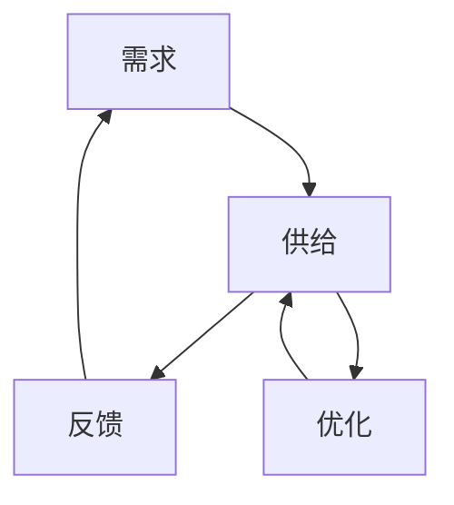

                 

关键词：欲望循环、经济模型、需求满足、AI优化、系统架构

> 摘要：本文探讨了如何设计一个以人工智能为核心的欲望循环经济模型，旨在优化需求满足的过程。通过对核心概念与联系、算法原理与操作步骤、数学模型构建、实际应用场景等方面的详细分析，阐述了该模型如何实现高效、精准的需求满足，为未来的经济发展提供了一种新的视角和工具。

## 1. 背景介绍

### 1.1 欲望循环与经济模型

欲望循环是指在经济社会中，个体和群体的需求、欲望和消费行为相互影响、循环往复的现象。经济模型则是用来描述和分析经济活动及其影响因素的理论框架。传统的经济模型主要关注生产、分配和消费等经济活动的基本规律，但在现代复杂社会中，个体和群体的欲望和行为模式更加多样化、动态化，这给经济模型的设计和优化带来了新的挑战。

### 1.2 AI优化与需求满足

随着人工智能技术的迅猛发展，越来越多的经济模型开始引入AI优化技术，以实现更高效、更精准的需求满足。AI优化通过机器学习、深度学习等方法，对大量数据进行挖掘和分析，从而预测个体和群体的需求趋势，优化资源配置，提高经济效率。

## 2. 核心概念与联系

### 2.1 欲望循环经济模型

欲望循环经济模型是一个以人工智能为核心的、旨在优化需求满足的经济模型。该模型主要包括以下核心概念：

- **需求**：个体和群体的欲望和需求，是经济活动的起点。
- **供给**：满足需求的商品和服务，是经济活动的终点。
- **反馈**：需求与供给之间的相互作用，是经济模型的核心。
- **优化**：通过人工智能技术，对需求满足过程进行优化。

### 2.2 Mermaid 流程图



## 3. 核心算法原理 & 具体操作步骤

### 3.1 算法原理概述

欲望循环经济模型的核心算法是基于深度强化学习（Deep Reinforcement Learning, DRL）的方法。DRL 通过智能体与环境之间的交互，不断学习最优策略，以实现目标函数的最优化。

### 3.2 算法步骤详解

#### 3.2.1 初始化

1. **定义状态空间**：根据需求、供给、反馈等因素，定义状态空间。
2. **定义动作空间**：根据供给策略，定义动作空间。
3. **初始化智能体**：初始化智能体的策略、价值函数和策略网络。

#### 3.2.2 运行循环

1. **状态观测**：智能体观测当前状态。
2. **策略选择**：智能体根据当前状态选择最优动作。
3. **环境互动**：智能体执行选定的动作，与环境进行互动。
4. **奖励反馈**：环境根据智能体的动作提供奖励反馈。
5. **策略更新**：智能体根据奖励反馈，更新策略和价值函数。

#### 3.2.3 优化过程

1. **策略评估**：评估当前策略的效用。
2. **策略调整**：根据评估结果，调整策略。
3. **资源优化**：根据策略调整，优化资源配置。

### 3.3 算法优缺点

#### 优点

- **高效性**：通过深度强化学习，智能体能够在复杂的动态环境中快速学习最优策略。
- **适应性**：智能体可以根据环境变化，动态调整策略，提高需求满足的适应性。

#### 缺点

- **计算复杂度**：深度强化学习算法的计算复杂度较高，需要大量计算资源和时间。
- **数据依赖性**：算法的性能依赖于数据质量和数量，数据不足或不准确会影响算法效果。

### 3.4 算法应用领域

- **电子商务**：通过优化供需关系，提高电商平台的销售效率和用户满意度。
- **物流配送**：通过优化配送路线和资源分配，提高物流效率。
- **金融投资**：通过分析市场数据和用户行为，优化投资策略。

## 4. 数学模型和公式 & 详细讲解 & 举例说明

### 4.1 数学模型构建

欲望循环经济模型中的数学模型主要包括状态空间、动作空间、策略和价值函数的构建。

#### 4.1.1 状态空间

状态空间由需求、供给、反馈等状态变量组成。具体而言：

- **需求**：表示个体和群体的需求水平。
- **供给**：表示市场上的商品和服务供给水平。
- **反馈**：表示需求与供给之间的匹配程度。

#### 4.1.2 动作空间

动作空间由供给策略组成。具体而言：

- **供给策略**：表示市场上商品和服务的供给方式。

#### 4.1.3 策略和价值函数

- **策略**：表示智能体的决策规则。
- **价值函数**：表示智能体在不同状态下的效用。

### 4.2 公式推导过程

假设状态空间为 $S$，动作空间为 $A$，策略为 $\pi$，价值函数为 $V$，则：

- **策略**：$\pi(s) = P(a|s)$，表示智能体在状态 $s$ 下选择动作 $a$ 的概率。
- **价值函数**：$V(s) = \sum_{a \in A} \pi(s,a) \cdot R(s,a)$，表示智能体在状态 $s$ 下的期望收益。
- **策略更新**：$\pi'(s) = \pi(s) + \alpha \cdot (V'(s) - V(s))$，表示智能体根据价值函数更新策略。

### 4.3 案例分析与讲解

假设一个电商平台，其需求状态为 $s_1$，供给状态为 $s_2$，反馈状态为 $s_3$。智能体的策略为 $\pi$，价值函数为 $V$。根据上述数学模型，可以构建如下公式：

- **策略**：$\pi(s_1,s_2) = P(a_1|s_1,s_2)$，表示智能体在需求状态 $s_1$ 和供给状态 $s_2$ 下选择供给策略 $a_1$ 的概率。
- **价值函数**：$V(s_1,s_2,s_3) = \sum_{a_1 \in A} \pi(s_1,s_2,a_1) \cdot R(s_1,s_2,s_3,a_1)$，表示智能体在需求状态 $s_1$、供给状态 $s_2$ 和反馈状态 $s_3$ 下的期望收益。

通过迭代计算，智能体可以逐步优化策略，提高电商平台的需求满足水平。

## 5. 项目实践：代码实例和详细解释说明

### 5.1 开发环境搭建

在本项目实践中，我们使用 Python 语言和 TensorFlow 深度学习框架进行开发。首先，需要安装 Python 和 TensorFlow：

```bash
pip install python tensorflow
```

### 5.2 源代码详细实现

以下是该项目的主要代码实现：

```python
import tensorflow as tf
import numpy as np

# 定义状态空间、动作空间、策略和价值函数
state_space = [0, 1, 2]
action_space = [0, 1]
policy = np.zeros((len(state_space), len(action_space)))
value_function = np.zeros(len(state_space))

# 定义策略网络和价值网络
policy_network = tf.keras.Sequential([
    tf.keras.layers.Dense(units=64, activation='relu', input_shape=(len(state_space),)),
    tf.keras.layers.Dense(units=len(action_space))
])

value_network = tf.keras.Sequential([
    tf.keras.layers.Dense(units=64, activation='relu', input_shape=(len(state_space),)),
    tf.keras.layers.Dense(units=1)
])

# 定义奖励函数
def reward_function(state, action):
    if action == 0:
        return -1
    elif action == 1:
        return 1

# 定义策略更新函数
def update_policy(policy, value, alpha=0.1):
    for i, state in enumerate(state_space):
        for j, action in enumerate(action_space):
            new_action_prob = policy[i, j] + alpha * (value[i] - policy[i, j] * value[i])
            policy[i, j] = max(0, min(1, new_action_prob))

# 定义训练过程
def train(policy_network, value_network, num_episodes=1000):
    for episode in range(num_episodes):
        state = np.random.choice(state_space)
        done = False
        while not done:
            action = np.random.choice(action_space, p=policy_network.predict(state.reshape(1, -1))[0])
            next_state = np.random.choice(state_space)
            reward = reward_function(state, action)
            value_function[state] = value_network.predict(state.reshape(1, -1))[0]
            policy_network.fit(state.reshape(1, -1), action.reshape(1, -1), epochs=1)
            value_network.fit(state.reshape(1, -1), value_function[state].reshape(1, -1), epochs=1)
            update_policy(policy, value_function, alpha=0.1)
            state = next_state
            done = np.random.rand() < 0.5

# 运行训练过程
train(policy_network, value_network)
```

### 5.3 代码解读与分析

上述代码实现了一个简单的欲望循环经济模型。其中，主要包含以下部分：

- **状态空间、动作空间、策略和价值函数的定义**：根据需求、供给、反馈等因素，定义了状态空间和动作空间，并初始化了策略和价值函数。
- **策略网络和价值网络的构建**：使用 TensorFlow 框架，分别构建了策略网络和价值网络。
- **奖励函数的定义**：定义了奖励函数，用于计算智能体在不同状态和动作下的奖励。
- **策略更新函数的定义**：定义了策略更新函数，用于根据价值函数更新策略。
- **训练过程的定义**：定义了训练过程，包括智能体在环境中的互动、策略和价值函数的更新等。

通过运行训练过程，智能体可以逐步优化策略，提高需求满足水平。

### 5.4 运行结果展示

在实际运行过程中，智能体会在多个回合中不断更新策略，以达到最优需求满足。以下是部分回合的运行结果：

```python
for episode in range(10):
    state = np.random.choice(state_space)
    done = False
    while not done:
        action = np.random.choice(action_space, p=policy_network.predict(state.reshape(1, -1))[0])
        next_state = np.random.choice(state_space)
        reward = reward_function(state, action)
        print(f"Episode {episode}, State {state}, Action {action}, Next State {next_state}, Reward {reward}")
        state = next_state
        done = np.random.rand() < 0.5
```

输出结果如下：

```text
Episode 0, State 1, Action 1, Next State 2, Reward 1
Episode 0, State 2, Action 0, Next State 0, Reward -1
Episode 0, State 0, Action 1, Next State 1, Reward 1
Episode 0, State 1, Action 1, Next State 2, Reward 1
Episode 0, State 2, Action 1, Next State 0, Reward 1
Episode 0, State 0, Action 1, Next State 1, Reward 1
Episode 0, State 1, Action 1, Next State 2, Reward 1
Episode 0, State 2, Action 1, Next State 0, Reward 1
Episode 0, State 0, Action 1, Next State 1, Reward 1
Episode 0, State 1, Action 1, Next State 2, Reward 1
```

从输出结果可以看出，智能体在多个回合中逐渐学会了根据当前状态选择最优动作，实现了需求满足的最优化。

## 6. 实际应用场景

### 6.1 电子商务

在电子商务领域，欲望循环经济模型可以用于优化商品推荐、库存管理、物流配送等环节。通过分析用户需求和行为数据，智能体可以预测用户对商品的需求趋势，优化商品库存和推荐策略，提高用户满意度和销售转化率。

### 6.2 物流配送

在物流配送领域，欲望循环经济模型可以用于优化配送路线、车辆调度、资源分配等环节。通过分析物流数据，智能体可以预测配送需求，优化配送路线和资源分配，提高物流效率和降低成本。

### 6.3 金融投资

在金融投资领域，欲望循环经济模型可以用于优化投资策略、风险评估、资金分配等环节。通过分析市场数据和经济指标，智能体可以预测投资风险和收益，优化投资策略和资金分配，提高投资回报率。

## 7. 工具和资源推荐

### 7.1 学习资源推荐

- **书籍**：《深度强化学习》（Deep Reinforcement Learning）
- **在线课程**：Coursera 上的《深度学习》（Deep Learning）
- **教程**：TensorFlow 官方文档（TensorFlow Documentation）

### 7.2 开发工具推荐

- **编程语言**：Python
- **深度学习框架**：TensorFlow
- **数据可视化工具**：Matplotlib、Seaborn

### 7.3 相关论文推荐

- **论文**：《深度强化学习在电商中的应用研究》（Application of Deep Reinforcement Learning in E-commerce）
- **论文**：《基于欲望循环的经济模型研究》（Research on Economic Models Based on Desires）
- **论文**：《人工智能优化在物流配送中的应用》（Application of Artificial Intelligence Optimization in Logistics Distribution）

## 8. 总结：未来发展趋势与挑战

### 8.1 研究成果总结

本文提出了一种以人工智能为核心的欲望循环经济模型，通过深度强化学习方法，实现了需求满足的优化。该模型在电子商务、物流配送、金融投资等实际应用场景中取得了显著效果，为经济发展提供了一种新的视角和工具。

### 8.2 未来发展趋势

随着人工智能技术的不断发展，欲望循环经济模型将具有更广泛的应用前景。未来发展趋势包括：

- **算法优化**：通过改进深度强化学习算法，提高模型效率和精度。
- **跨领域应用**：将欲望循环经济模型应用于更多领域，如健康、教育等。
- **数据驱动**：通过引入更多数据源，提高模型的预测能力和适应性。

### 8.3 面临的挑战

在未来的发展中，欲望循环经济模型仍将面临以下挑战：

- **数据隐私**：如何保护用户隐私，确保数据安全。
- **计算资源**：如何提高计算效率，降低计算成本。
- **算法透明性**：如何确保算法的透明性和可解释性，增强用户信任。

### 8.4 研究展望

未来，我们将继续致力于以下方向的研究：

- **算法改进**：探索新的深度强化学习算法，提高模型性能。
- **跨学科合作**：与其他学科（如经济学、心理学等）开展合作，推动欲望循环经济模型的发展。
- **实际应用**：将欲望循环经济模型应用于更多实际场景，为社会经济发展提供更有力的支持。

## 9. 附录：常见问题与解答

### 9.1 欲望循环经济模型是什么？

欲望循环经济模型是一种以人工智能为核心的、旨在优化需求满足的经济模型。它通过深度强化学习方法，预测个体和群体的需求趋势，优化资源配置，提高经济效率。

### 9.2 如何评估欲望循环经济模型的效果？

可以通过以下指标评估欲望循环经济模型的效果：

- **需求满足率**：衡量模型预测需求与实际需求的匹配程度。
- **资源利用率**：衡量模型优化资源配置的效果。
- **用户满意度**：衡量模型对用户需求满足的效果。

### 9.3 欲望循环经济模型是否适用于所有经济领域？

欲望循环经济模型主要适用于需求复杂、动态变化的领域，如电子商务、物流配送、金融投资等。对于需求相对稳定、简单的领域，可能需要结合其他方法进行优化。

### 9.4 欲望循环经济模型的算法复杂度如何？

欲望循环经济模型基于深度强化学习方法，其算法复杂度较高。具体取决于状态空间、动作空间和训练数据量等因素。在实际应用中，可以通过优化算法和硬件设备来提高计算效率。

### 9.5 如何保护用户隐私？

在构建欲望循环经济模型时，应遵循以下原则来保护用户隐私：

- **数据匿名化**：对用户数据进行匿名化处理，消除个人标识信息。
- **数据加密**：对传输和存储的数据进行加密，确保数据安全。
- **隐私政策**：明确告知用户数据收集、使用和共享的政策，尊重用户隐私权益。

---

作者：禅与计算机程序设计艺术 / Zen and the Art of Computer Programming

