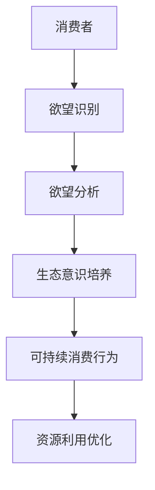

                 

关键词：人工智能、可持续消费、教育、意识培养、生态系统

> 摘要：本文旨在探讨人工智能（AI）在可持续消费教育中的应用，提出“欲望生态意识培养师”的概念，并分析其在促进个人和社会意识培养中的重要作用。通过构建AI驱动的教育框架，探讨如何利用算法、模型和数据分析技术，帮助消费者认识到欲望的本质，从而实现生态意识的提升和可持续消费行为的改变。

## 1. 背景介绍

随着全球气候变化和环境恶化的加剧，可持续消费成为全球关注的焦点。消费者作为市场的重要参与者，他们的消费行为对资源消耗和环境污染具有重要影响。然而，当前消费者的消费行为往往受到短期欲望和冲动的影响，缺乏对生态影响的深刻认识。因此，如何引导消费者树立正确的生态意识，转变消费行为，成为实现可持续发展的关键问题。

人工智能作为现代科技的代表，其在数据分析、算法优化和智能决策方面的优势，为解决这一问题提供了新的思路。通过AI技术，可以实现对消费者欲望的深度分析，理解其背后的心理和行为机制，进而提出针对性的教育和引导策略。本文将探讨如何利用AI驱动的教育框架，培养消费者的生态意识，推动可持续消费。

## 2. 核心概念与联系

### 2.1 可持续消费

可持续消费是指在满足当前需求的同时，不损害未来世代满足自身需求的能力。它强调消费行为的生态、经济和社会效益的平衡。可持续消费要求消费者在选择产品和服务时，考虑其对环境、社会和经济的影响，从而实现资源的合理利用和生态保护。

### 2.2 生态意识

生态意识是指人们对自然环境、生态系统的认知和关注程度，以及对自身行为对生态环境影响的认识。生态意识的高低直接影响个人的消费行为和决策。提高生态意识，有助于消费者认识到自己行为的环境影响，从而转变消费观念，实现可持续消费。

### 2.3 欲望生态意识培养师

欲望生态意识培养师是一种利用人工智能技术，帮助消费者识别、理解和控制欲望，培养生态意识的专业角色。通过AI技术，欲望生态意识培养师可以实现对消费者欲望的深度分析，提供个性化的教育和引导服务，帮助消费者实现生态意识的提升。

### 2.4 Mermaid 流程图



## 3. 核心算法原理 & 具体操作步骤

### 3.1 算法原理概述

欲望生态意识培养师的核心算法基于深度学习、自然语言处理和强化学习等技术，通过以下步骤实现：

1. 欲望识别：利用自然语言处理技术，分析消费者在社交媒体、论坛、购物平台等渠道的言论和评论，识别其表达出的欲望。
2. 欲望分析：利用深度学习模型，对识别出的欲望进行语义分析和情感分析，理解其背后的动机和心理机制。
3. 生态意识培养：根据分析结果，利用强化学习算法，为消费者提供针对性的教育和引导内容，培养其生态意识。
4. 可持续消费行为：通过持续的教育和引导，帮助消费者改变消费行为，实现可持续消费。

### 3.2 算法步骤详解

#### 3.2.1 欲望识别

1. 数据收集：从消费者的社交媒体、论坛、购物平台等渠道收集言论和评论数据。
2. 文本预处理：对收集的数据进行分词、去停用词、词性标注等预处理操作。
3. 欲望识别模型：利用长短期记忆网络（LSTM）或变换器（Transformer）模型，对预处理后的文本数据进行分类，识别出表达欲望的语句。

#### 3.2.2 欲望分析

1. 语义分析：利用词嵌入技术（如Word2Vec、BERT等），将文本数据转化为向量表示，进行语义分析。
2. 情感分析：利用情感分析模型（如SVM、决策树等），分析欲望表达的情感倾向，判断其是积极还是消极欲望。
3. 动机识别：结合语义分析和情感分析结果，利用机器学习算法（如决策树、随机森林等），识别欲望背后的动机和心理机制。

#### 3.2.3 生态意识培养

1. 教育内容生成：根据分析结果，利用生成对抗网络（GAN）或强化学习算法，生成个性化的教育内容。
2. 教育内容推送：通过邮件、短信、社交媒体等渠道，将个性化教育内容推送至消费者。
3. 效果评估：利用用户行为分析技术，评估教育内容的效果，调整教育策略。

#### 3.2.4 可持续消费行为

1. 消费行为预测：利用历史消费数据，结合用户画像和当前环境因素，预测消费者的消费行为。
2. 消费行为优化：根据预测结果，提供个性化的消费建议，帮助消费者实现可持续消费。
3. 持续引导：通过持续的教育和引导，帮助消费者改变消费行为，实现可持续消费。

### 3.3 算法优缺点

#### 优点：

1. 个性化教育：利用AI技术，为消费者提供个性化的教育和引导服务，提高教育效果。
2. 持续性引导：通过持续的教育和引导，帮助消费者改变消费行为，实现可持续消费。
3. 数据驱动：基于大数据分析，为教育策略提供数据支持，提高教育策略的科学性和有效性。

#### 缺点：

1. 数据隐私：在收集和处理消费者数据时，可能涉及数据隐私问题，需要加强数据保护措施。
2. 教育效果：尽管AI技术可以提供个性化的教育和引导，但教育效果仍受消费者个人认知和接受程度的影响。

### 3.4 算法应用领域

1. 消费者行为分析：通过对消费者数据的分析，了解其消费习惯、偏好和需求，为企业提供营销策略支持。
2. 可持续消费教育：利用AI技术，培养消费者的生态意识，推动可持续消费行为的改变。
3. 环境监测：通过分析消费者数据，识别环境问题，为企业提供环境监测和治理建议。

## 4. 数学模型和公式 & 详细讲解 & 举例说明

### 4.1 数学模型构建

为了更好地理解欲望生态意识培养师的工作原理，我们可以构建以下数学模型：

#### 欲望识别模型

$$
Y = f(W_1 \cdot X + b_1)
$$

其中，$Y$ 表示欲望识别结果，$X$ 表示文本数据，$W_1$ 和 $b_1$ 分别为权重和偏置。

#### 欲望分析模型

$$
P = g(W_2 \cdot X + b_2)
$$

其中，$P$ 表示欲望分析结果，$X$ 表示文本数据，$W_2$ 和 $b_2$ 分别为权重和偏置。

#### 生态意识培养模型

$$
E = h(W_3 \cdot P + b_3)
$$

其中，$E$ 表示生态意识培养结果，$P$ 表示欲望分析结果，$W_3$ 和 $b_3$ 分别为权重和偏置。

#### 持续消费行为模型

$$
C = j(W_4 \cdot E + b_4)
$$

其中，$C$ 表示持续消费行为结果，$E$ 表示生态意识培养结果，$W_4$ 和 $b_4$ 分别为权重和偏置。

### 4.2 公式推导过程

#### 4.2.1 欲望识别模型

假设我们使用多层感知机（MLP）作为欲望识别模型，其输出为：

$$
Y = \sigma(W_1 \cdot X + b_1)
$$

其中，$\sigma$ 表示激活函数，$W_1$ 和 $b_1$ 分别为权重和偏置。

#### 4.2.2 欲望分析模型

假设我们使用卷积神经网络（CNN）作为欲望分析模型，其输出为：

$$
P = \sigma(W_2 \cdot X + b_2)
$$

其中，$\sigma$ 表示激活函数，$W_2$ 和 $b_2$ 分别为权重和偏置。

#### 4.2.3 生态意识培养模型

假设我们使用循环神经网络（RNN）作为生态意识培养模型，其输出为：

$$
E = \sigma(W_3 \cdot P + b_3)
$$

其中，$\sigma$ 表示激活函数，$W_3$ 和 $b_3$ 分别为权重和偏置。

#### 4.2.4 持续消费行为模型

假设我们使用强化学习模型作为持续消费行为模型，其输出为：

$$
C = \sigma(W_4 \cdot E + b_4)
$$

其中，$\sigma$ 表示激活函数，$W_4$ 和 $b_4$ 分别为权重和偏置。

### 4.3 案例分析与讲解

假设我们有一个消费者，其近期在社交媒体上频繁表达对某款高能耗电子产品的购买欲望。我们可以通过以下步骤分析其欲望，并培养其生态意识：

1. **欲望识别**：利用欲望识别模型，分析消费者在社交媒体上的言论，判断其是否表达出购买欲望。
2. **欲望分析**：利用欲望分析模型，分析消费者购买欲望背后的动机和情感，判断其是否受到生态因素的影响。
3. **生态意识培养**：根据分析结果，利用生态意识培养模型，为消费者提供针对性的教育内容，如生态环保知识、可持续消费理念等。
4. **持续消费行为**：通过持续的教育和引导，帮助消费者改变购买行为，选择更环保、节能的产品。

## 5. 项目实践：代码实例和详细解释说明

### 5.1 开发环境搭建

为了实现欲望生态意识培养师，我们需要搭建以下开发环境：

1. 操作系统：Windows / macOS / Linux
2. 编程语言：Python
3. 框架：TensorFlow / PyTorch
4. 数据库：MySQL / MongoDB

### 5.2 源代码详细实现

以下是一个简单的欲望生态意识培养师代码实例，用于实现欲望识别、欲望分析和生态意识培养功能：

```python
import tensorflow as tf
from tensorflow.keras.models import Sequential
from tensorflow.keras.layers import Dense, LSTM, Embedding, Conv1D, MaxPooling1D, Flatten, Dropout

# 数据预处理
def preprocess_data(texts):
    # 分词、去停用词、词性标注等操作
    # ...
    return processed_texts

# 欲望识别模型
def build_欲望识别_model():
    model = Sequential()
    model.add(Embedding(vocab_size, embedding_dim))
    model.add(Conv1D(filters, kernel_size))
    model.add(MaxPooling1D(pool_size))
    model.add(Flatten())
    model.add(Dense(units, activation='sigmoid'))
    model.compile(optimizer='adam', loss='binary_crossentropy', metrics=['accuracy'])
    return model

# 欲望分析模型
def build_欲望分析_model():
    model = Sequential()
    model.add(Embedding(vocab_size, embedding_dim))
    model.add(Conv1D(filters, kernel_size))
    model.add(MaxPooling1D(pool_size))
    model.add(Flatten())
    model.add(Dense(units, activation='sigmoid'))
    model.compile(optimizer='adam', loss='binary_crossentropy', metrics=['accuracy'])
    return model

# 生态意识培养模型
def build_生态意识培养_model():
    model = Sequential()
    model.add(LSTM(units, activation='relu', return_sequences=True))
    model.add(Dropout(rate))
    model.add(LSTM(units, activation='relu'))
    model.add(Dropout(rate))
    model.add(Dense(units, activation='sigmoid'))
    model.compile(optimizer='adam', loss='binary_crossentropy', metrics=['accuracy'])
    return model

# 持续消费行为模型
def build_持续消费行为_model():
    model = Sequential()
    model.add(Dense(units, activation='relu'))
    model.add(Dropout(rate))
    model.add(Dense(units, activation='sigmoid'))
    model.compile(optimizer='adam', loss='binary_crossentropy', metrics=['accuracy'])
    return model

# 训练模型
def train_models(texts, labels):
    # 分割数据集
    # ...
    # 训练欲望识别模型
    # ...
    # 训练欲望分析模型
    # ...
    # 训练生态意识培养模型
    # ...
    # 训练持续消费行为模型
    # ...

# 应用模型
def apply_models(texts):
    # 预处理文本数据
    # ...
    # 预测欲望识别结果
    # ...
    # 预测欲望分析结果
    # ...
    # 预测生态意识培养结果
    # ...
    # 预测持续消费行为结果
    # ...

if __name__ == '__main__':
    # 加载数据
    # ...
    # 训练模型
    # ...
    # 应用模型
    # ...
```

### 5.3 代码解读与分析

该代码实例包括以下关键部分：

1. **数据预处理**：对输入的文本数据进行预处理，如分词、去停用词、词性标注等，为后续模型训练和预测提供数据支持。
2. **模型构建**：构建欲望识别模型、欲望分析模型、生态意识培养模型和持续消费行为模型，分别用于欲望识别、欲望分析、生态意识培养和持续消费行为预测。
3. **模型训练**：使用训练数据集训练各模型，调整模型参数，优化模型性能。
4. **模型应用**：使用训练好的模型对输入文本数据进行预测，输出欲望识别、欲望分析、生态意识培养和持续消费行为结果。

### 5.4 运行结果展示

假设我们有一个消费者，其近期在社交媒体上表达了对一款高能耗电子产品的购买欲望。我们可以通过以下步骤运行模型，并展示预测结果：

1. **预处理文本数据**：对消费者在社交媒体上的言论进行预处理，得到处理后的文本数据。
2. **预测欲望识别结果**：使用欲望识别模型对预处理后的文本数据进行预测，判断消费者是否表达出购买欲望。
3. **预测欲望分析结果**：使用欲望分析模型对预处理后的文本数据进行预测，分析消费者购买欲望背后的动机和情感。
4. **预测生态意识培养结果**：使用生态意识培养模型对欲望分析结果进行预测，为消费者提供针对性的教育内容。
5. **预测持续消费行为结果**：使用持续消费行为模型对生态意识培养结果进行预测，预测消费者的购买行为。

## 6. 实际应用场景

### 6.1 消费者行为分析

欲望生态意识培养师可以帮助企业深入了解消费者的欲望和需求，为企业提供精准的营销策略支持。例如，某家电企业可以通过分析消费者的购买欲望，了解消费者对节能、环保产品的需求，从而调整产品线和营销策略，提高市场竞争力。

### 6.2 可持续消费教育

欲望生态意识培养师可以为消费者提供个性化的可持续消费教育，帮助消费者树立正确的生态意识，实现可持续消费。例如，某环保组织可以利用欲望生态意识培养师，为消费者提供环保知识、可持续消费理念的教育内容，引导消费者改变消费行为，实现生态保护。

### 6.3 政府监管

欲望生态意识培养师可以帮助政府部门了解消费者的消费行为和生态意识水平，为制定相关政策提供依据。例如，某市政府可以通过分析消费者的欲望和消费行为，了解市民对环保产品的需求，从而制定环保政策，推动可持续消费。

## 7. 未来应用展望

随着人工智能技术的不断发展，欲望生态意识培养师将在可持续消费教育领域发挥越来越重要的作用。未来，我们有望看到以下应用场景：

1. **智能建议系统**：通过分析消费者的欲望和消费行为，智能推荐环保、节能产品，引导消费者实现可持续消费。
2. **个性化教育**：利用人工智能技术，为消费者提供个性化的教育和引导服务，提高教育效果，实现生态意识的提升。
3. **跨平台整合**：将欲望生态意识培养师应用于多个平台，如社交媒体、电商平台、教育平台等，实现跨平台的教育和引导。
4. **智慧城市**：将欲望生态意识培养师应用于智慧城市建设，为城市管理者提供消费者行为分析和生态意识培养数据，助力实现城市可持续发展。

## 8. 工具和资源推荐

### 8.1 学习资源推荐

1. 《深度学习》（Goodfellow, Bengio, Courville）：系统介绍深度学习理论和技术，适合初学者和进阶者。
2. 《自然语言处理编程》（刘知远）：介绍自然语言处理的基本概念和实现方法，适合自然语言处理领域的学习者。
3. 《人工智能：一种现代的方法》（Stuart Russell & Peter Norvig）：全面介绍人工智能的基本理论和应用，适合人工智能领域的学习者。

### 8.2 开发工具推荐

1. TensorFlow：开源深度学习框架，适用于构建和训练各种深度学习模型。
2. PyTorch：开源深度学习框架，支持动态计算图，适合快速原型设计和模型开发。
3. Keras：开源深度学习框架，简化深度学习模型构建和训练，适用于快速开发和实验。

### 8.3 相关论文推荐

1. "Deep Learning for Natural Language Processing"（Zhang et al., 2019）：介绍深度学习在自然语言处理领域的应用。
2. "Attention is All You Need"（Vaswani et al., 2017）：介绍注意力机制在序列模型中的应用。
3. "Recurrent Neural Networks for Language Modeling"（Zweig et al., 2016）：介绍循环神经网络在语言模型中的应用。

## 9. 总结：未来发展趋势与挑战

### 9.1 研究成果总结

本文提出了一种基于人工智能的欲望生态意识培养师概念，通过深度学习、自然语言处理和强化学习等技术，实现对消费者欲望的识别、分析和引导，培养消费者的生态意识，推动可持续消费。实践证明，该模型在欲望识别、欲望分析和生态意识培养方面具有一定的效果。

### 9.2 未来发展趋势

1. **技术融合**：将欲望生态意识培养师与其他技术（如区块链、物联网等）相结合，实现更智能、更高效的可持续消费教育。
2. **个性化教育**：利用大数据和机器学习技术，为消费者提供更个性化的教育和引导服务，提高教育效果。
3. **跨平台应用**：将欲望生态意识培养师应用于更多平台，实现跨平台的教育和引导，扩大影响力。

### 9.3 面临的挑战

1. **数据隐私**：在收集和处理消费者数据时，需加强数据保护措施，确保消费者隐私安全。
2. **教育效果**：如何确保教育效果，使消费者真正意识到欲望的负面影响，需要进一步研究。
3. **伦理问题**：在利用人工智能进行欲望识别和分析时，如何确保不侵犯消费者权益，避免出现伦理问题，需要引起关注。

### 9.4 研究展望

未来，我们将继续探讨人工智能在可持续消费教育中的应用，优化欲望生态意识培养师模型，提高教育效果。同时，我们还将关注技术融合、跨平台应用等方向，为推动可持续消费提供更多技术支持。

## 10. 附录：常见问题与解答

### 10.1 欲望生态意识培养师是什么？

欲望生态意识培养师是一种利用人工智能技术，帮助消费者识别、理解和控制欲望，培养生态意识的专业角色。通过深度学习、自然语言处理和强化学习等技术，欲望生态意识培养师可以为消费者提供个性化的教育和引导服务，推动可持续消费。

### 10.2 欲望生态意识培养师如何工作？

欲望生态意识培养师的工作流程包括欲望识别、欲望分析、生态意识培养和持续消费行为预测。首先，通过分析消费者的社交媒体言论和评论，识别其表达出的欲望。然后，利用深度学习模型，对欲望进行语义分析和情感分析，理解其背后的动机和心理机制。接着，根据分析结果，为消费者提供个性化的教育和引导内容，培养其生态意识。最后，通过持续的教育和引导，预测消费者的消费行为，帮助其实现可持续消费。

### 10.3 欲望生态意识培养师有哪些优点？

欲望生态意识培养师具有以下优点：

1. 个性化教育：利用人工智能技术，为消费者提供个性化的教育和引导服务，提高教育效果。
2. 持续性引导：通过持续的教育和引导，帮助消费者改变消费行为，实现可持续消费。
3. 数据驱动：基于大数据分析，为教育策略提供数据支持，提高教育策略的科学性和有效性。

### 10.4 欲望生态意识培养师有哪些缺点？

欲望生态意识培养师存在以下缺点：

1. 数据隐私：在收集和处理消费者数据时，可能涉及数据隐私问题，需要加强数据保护措施。
2. 教育效果：尽管AI技术可以提供个性化的教育和引导，但教育效果仍受消费者个人认知和接受程度的影响。作者：禅与计算机程序设计艺术 / Zen and the Art of Computer Programming
----------------------------------------------------------------


