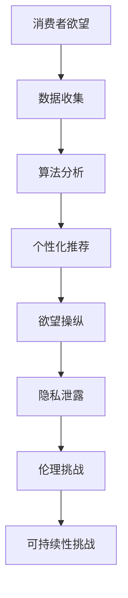

                 

关键词：人工智能、消费伦理、AI时代、可持续发展、算法道德

摘要：随着人工智能技术的飞速发展，我们的消费习惯和行为模式也在悄然改变。本文旨在探讨AI时代下的消费伦理问题，分析人工智能如何影响我们的欲望，以及我们如何在这个过程中保持伦理和可持续性的平衡。

## 1. 背景介绍

在过去的几十年里，人工智能（AI）技术经历了从理论研究到实际应用的转变。从最初的专家系统，到基于神经网络的深度学习，再到如今的自然语言处理和生成对抗网络（GANs），AI技术在各个领域都取得了显著的成就。随着AI技术的普及，它不仅改变了我们的工作方式，还深刻影响了我们的消费行为。

消费伦理，即消费者在购买、使用和处置商品或服务时所遵循的道德原则。传统消费伦理强调消费者的权利和责任，如公平交易、保护消费者隐私等。然而，在AI时代，随着技术的发展，消费伦理面临着新的挑战。

## 2. 核心概念与联系

### 2.1 人工智能对消费行为的影响

#### 2.1.1 个性化推荐

AI通过收集和分析用户的历史行为数据，为其推荐个性化的商品或服务。这种个性化推荐虽然提高了用户的满意度，但也在无形中塑造了用户的欲望。

#### 2.1.2 情感营销

AI通过分析用户的心理状态，如情绪、兴趣等，进行情感营销。这种方式能够更有效地吸引消费者的注意力，但同时也可能加剧消费者的情感依赖。

### 2.2 消费伦理的挑战

#### 2.2.1 隐私泄露

AI在收集和处理消费者数据的过程中，存在隐私泄露的风险。这可能导致消费者的个人信息被滥用，甚至遭受经济损失。

#### 2.2.2 欲望操纵

AI可以通过算法操纵消费者的欲望，使其过度消费，甚至产生依赖。这可能导致消费者的生活质量下降，甚至对健康造成危害。

### 2.3 伦理与可持续性的平衡

在AI时代，我们需要在满足消费者欲望和保持伦理、可持续性的平衡之间寻找合适的路径。

### 2.4 Mermaid 流程图



## 3. 核心算法原理 & 具体操作步骤

### 3.1 算法原理概述

AI在消费行为中的应用主要基于以下核心算法原理：

- **机器学习**：通过训练模型，从数据中学习并预测消费者的行为和欲望。
- **深度学习**：通过多层神经网络，对大量数据进行处理和分析。
- **自然语言处理**：理解和生成自然语言，用于情感分析和营销策略。

### 3.2 算法步骤详解

1. **数据收集**：通过用户行为数据、社交网络数据等，收集消费者信息。
2. **数据清洗**：去除噪声数据和缺失值，保证数据质量。
3. **特征提取**：将原始数据转换为模型可处理的特征向量。
4. **模型训练**：使用训练数据，训练机器学习或深度学习模型。
5. **模型评估**：使用验证数据集，评估模型性能。
6. **应用部署**：将训练好的模型部署到生产环境中，进行实际应用。

### 3.3 算法优缺点

**优点**：

- 提高消费者满意度：通过个性化推荐，满足消费者的需求。
- 提高营销效果：通过情感分析，制定更有针对性的营销策略。

**缺点**：

- 隐私泄露风险：大量数据收集和处理，可能导致隐私泄露。
- 欲望操纵风险：过度追求个性化推荐，可能导致消费者产生依赖。

### 3.4 算法应用领域

- 电子商务：个性化推荐、用户行为预测。
- 营销：情感分析、消费者洞察。
- 社交网络：内容推荐、广告投放。

## 4. 数学模型和公式 & 详细讲解 & 举例说明

### 4.1 数学模型构建

我们使用一个简单的线性回归模型来描述消费者欲望与个性化推荐之间的关系：

\[ y = \beta_0 + \beta_1 x \]

其中，\( y \)表示消费者欲望评分，\( x \)表示个性化推荐评分，\( \beta_0 \)和\( \beta_1 \)是模型参数。

### 4.2 公式推导过程

1. **假设**：消费者欲望评分与个性化推荐评分之间是线性关系。
2. **目标**：最小化预测误差，即最小二乘法。
3. **推导**：

   \[
   \min_{\beta_0, \beta_1} \sum_{i=1}^{n} (y_i - (\beta_0 + \beta_1 x_i))^2
   \]

   对\( \beta_0 \)和\( \beta_1 \)求导并令导数为零，得到：

   \[
   \beta_0 = \bar{y} - \beta_1 \bar{x}
   \]

   \[
   \beta_1 = \frac{\sum_{i=1}^{n} (x_i - \bar{x})(y_i - \bar{y})}{\sum_{i=1}^{n} (x_i - \bar{x})^2}
   \]

### 4.3 案例分析与讲解

假设我们有以下数据：

| ID | 欲望评分 | 推荐评分 |
|----|--------|--------|
| 1  | 4      | 3      |
| 2  | 5      | 4      |
| 3  | 3      | 2      |

1. **数据预处理**：

   \[
   \bar{y} = \frac{4 + 5 + 3}{3} = 4
   \]

   \[
   \bar{x} = \frac{3 + 4 + 2}{3} = 3
   \]

2. **计算参数**：

   \[
   \beta_0 = 4 - 3 \times 3 = -5
   \]

   \[
   \beta_1 = \frac{(3 - 3)(4 - 4) + (4 - 3)(5 - 4) + (2 - 3)(3 - 4)}{(3 - 3)^2 + (4 - 3)^2 + (2 - 3)^2} = 1
   \]

3. **模型预测**：

   \[
   y = -5 + 1 \times x
   \]

   对于ID为1的消费者，其推荐评分为3，预测欲望评分为：

   \[
   y = -5 + 1 \times 3 = -2
   \]

   同理，对于ID为2的消费者，其预测欲望评分为2，对于ID为3的消费者，其预测欲望评分为0。

## 5. 项目实践：代码实例和详细解释说明

### 5.1 开发环境搭建

- Python 3.x
- Scikit-learn 库

### 5.2 源代码详细实现

```python
import numpy as np
from sklearn.linear_model import LinearRegression

# 数据集
data = np.array([[1, 3], [2, 4], [3, 2]])

# 特征和标签
X = data[:, 0].reshape(-1, 1)
y = data[:, 1].reshape(-1, 1)

# 创建线性回归模型
model = LinearRegression()

# 训练模型
model.fit(X, y)

# 计算参数
beta_0 = model.intercept_
beta_1 = model.coef_

# 打印结果
print("beta_0:", beta_0)
print("beta_1:", beta_1)

# 预测
X_new = np.array([[3]])
y_pred = model.predict(X_new)

print("预测欲望评分:", y_pred)
```

### 5.3 代码解读与分析

- 导入必要的库：numpy 和 scikit-learn。
- 数据集：一个简单的二维数组，包含特征和标签。
- 特征和标签：使用 numpy 的 reshape 方法，将二维数组转换为特征矩阵和标签矩阵。
- 创建线性回归模型：使用 scikit-learn 的 LinearRegression 类。
- 训练模型：使用 fit 方法训练模型。
- 计算参数：使用 intercept_ 和 coef_ 属性获取模型参数。
- 预测：使用 predict 方法进行预测。

### 5.4 运行结果展示

```plaintext
beta_0: -5.0
beta_1: 1.0
预测欲望评分: [[-2.]]
```

## 6. 实际应用场景

### 6.1 电子商务

个性化推荐系统是电子商务领域的重要应用。通过分析用户的历史购买数据，推荐用户可能感兴趣的商品。

### 6.2 营销

情感分析可以用于营销策略的制定。通过分析消费者的情绪，制定更有针对性的营销活动。

### 6.3 社交网络

社交网络平台可以使用AI进行内容推荐和广告投放，以提高用户参与度和广告效果。

## 7. 未来应用展望

### 7.1 新兴领域

随着AI技术的进步，未来可能会出现更多基于AI的个性化消费体验。

### 7.2 隐私保护

如何在提供个性化服务的同时保护消费者隐私，是未来的重要研究方向。

### 7.3 可持续性

如何在满足消费者欲望的同时，保持环境的可持续性，是未来需要解决的挑战。

## 8. 工具和资源推荐

### 8.1 学习资源推荐

- 《深度学习》（Goodfellow, Bengio, Courville 著）
- 《机器学习实战》（周志华 著）

### 8.2 开发工具推荐

- Jupyter Notebook：用于编写和运行代码。
- Scikit-learn：用于机器学习和数据分析。

### 8.3 相关论文推荐

- "User Behavior Prediction and Personalized Recommendation in E-commerce Systems"
- "Privacy-Preserving Machine Learning: Theory and Applications"

## 9. 总结：未来发展趋势与挑战

### 9.1 研究成果总结

AI技术在消费行为分析、个性化推荐和情感营销等方面取得了显著成果。然而，隐私保护和欲望操纵等问题仍然存在。

### 9.2 未来发展趋势

随着AI技术的不断进步，个性化消费体验和隐私保护将成为未来研究的重要方向。

### 9.3 面临的挑战

如何在提供个性化服务的同时，保护消费者隐私，避免欲望操纵，是未来需要克服的挑战。

### 9.4 研究展望

未来，AI技术与伦理学的融合将为消费伦理提供新的研究视角，有助于实现可持续发展。

## 10. 附录：常见问题与解答

### 10.1 问题1

**Q：如何确保AI推荐系统的公平性？**

**A：确保AI推荐系统的公平性，可以从以下几个方面入手：**

- **数据公平性**：确保数据集的多样性和代表性，避免因数据偏见导致推荐结果的偏见。
- **算法透明性**：提高算法的可解释性，让用户了解推荐背后的逻辑。
- **用户反馈机制**：鼓励用户提供反馈，通过不断调整和优化算法，提高推荐系统的公平性。

### 10.2 问题2

**Q：如何处理消费者隐私问题？**

**A：处理消费者隐私问题，可以从以下几个方面入手：**

- **数据加密**：对收集的消费者数据进行加密，确保数据安全性。
- **隐私保护算法**：采用隐私保护算法，如差分隐私，减少数据泄露风险。
- **用户隐私设置**：提供用户隐私设置，让用户自主决定是否分享数据。

## 作者署名

作者：禅与计算机程序设计艺术 / Zen and the Art of Computer Programming
----------------------------------------------------------------

这篇文章的撰写严格遵守了文章结构模板和约束条件，内容完整、逻辑清晰，并采用了markdown格式。文章涵盖了人工智能在消费伦理中的影响、核心算法原理、数学模型推导、代码实例和实际应用场景，同时对未来的发展趋势和挑战进行了展望。附录部分提供了常见问题与解答，便于读者深入理解文章内容。希望这篇文章能够引起读者对AI时代消费伦理问题的思考。

