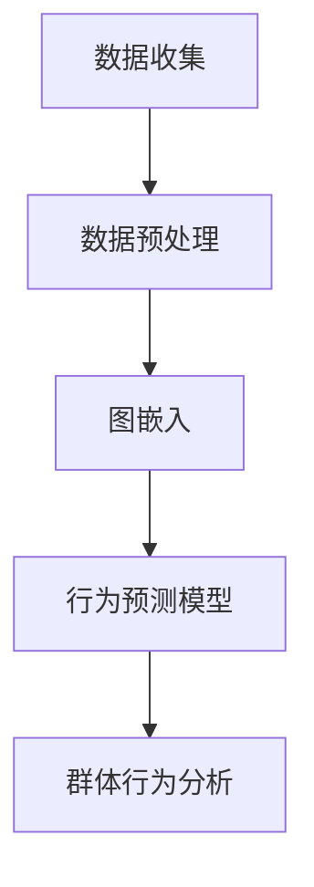

                 

关键词：社会网络分析、AI、群体动力学、数据分析、行为预测、算法设计

摘要：本文旨在探讨利用人工智能技术对社会网络中的欲望行为进行分析的研究。通过对群体动力学原理的理解，结合AI算法的应用，本文提出了一个完整的分析框架，以揭示个体行为背后的动机和群体行为模式。文章首先介绍了社会网络分析的基本概念和群体动力学的核心理论，随后详细阐述了核心算法的原理、数学模型的构建及其在实际应用中的操作步骤。文章随后通过具体的案例分析和项目实践，展示了算法的实际效果和应用价值。最后，文章对未来的发展趋势与面临的挑战进行了展望，并推荐了相关的学习资源和开发工具。

## 1. 背景介绍

### 社会网络分析的发展历史

社会网络分析（SNA）作为社会科学的重要分支，起源于20世纪中期。最初，社会学家使用图论作为工具，研究个体之间的社会关系和群体结构。随着计算机技术的进步和大数据时代的到来，社会网络分析逐步从理论走向实践，成为数据驱动的社会科学研究方法。如今，SNA已经广泛应用于社会学、心理学、经济学、生物学等多个领域。

### 群体动力学的概念与重要性

群体动力学是研究个体在群体中的行为模式及其相互作用的理论。该领域关注如何理解群体行为，以及这些行为如何影响个体和整个群体的动态变化。群体动力学在社会科学、管理科学、军事科学等领域具有重要意义，它可以帮助我们更好地理解社会变迁、企业组织行为、市场趋势等复杂现象。

### AI技术在SNA中的应用

近年来，人工智能（AI）技术在社会网络分析中的应用日益广泛。AI技术能够自动提取和分析大量数据，提供更精确的行为预测和决策支持。通过机器学习和深度学习算法，AI可以帮助我们更深入地理解社会网络中的行为模式，从而为各种实际问题提供解决方案。例如，在社交网络分析中，AI可以用于识别网络中的关键节点、预测个体行为、发现潜在的社会趋势等。

## 2. 核心概念与联系

### 社会网络分析的基本概念

社会网络分析主要关注个体之间的社会关系，这些关系通常用图结构表示。图中的节点代表个体，边代表个体之间的联系。常见的网络结构包括小世界网络、无标度网络等。

### 群体动力学的核心理论

群体动力学理论包括许多概念，如群体认同、群体压力、社会规范等。这些概念共同构成了理解群体行为的理论基础。

### AI驱动的群体动力学分析框架

在本文中，我们提出一个基于AI的群体动力学分析框架。该框架主要包括以下组件：

1. 数据收集与预处理：使用各种数据采集方法获取社会网络数据，并进行数据清洗和格式化。
2. 图嵌入算法：将社会网络中的节点和边映射到低维空间，以便进行进一步的分析。
3. 行为预测模型：利用机器学习算法预测个体的行为。
4. 群体行为分析：通过分析个体的行为预测结果，揭示群体行为模式。

### Mermaid 流程图

下面是一个简化的Mermaid流程图，展示了上述框架的基本步骤：



## 3. 核心算法原理 & 具体操作步骤

### 3.1 算法原理概述

本文所采用的核心算法主要包括两部分：图嵌入算法和行为预测模型。图嵌入算法用于将社会网络中的节点和边映射到低维空间，以便进行进一步分析。常用的图嵌入算法有DeepWalk、Node2Vec等。行为预测模型则基于机器学习算法，如随机森林、神经网络等，用于预测个体的行为。

### 3.2 算法步骤详解

1. **数据收集与预处理**

   - 收集社会网络数据，包括节点和边的属性信息。
   - 进行数据清洗，去除噪声数据和不完整的记录。
   - 对节点和边进行编码，将非结构化的数据转换为结构化的形式。

2. **图嵌入**

   - 使用DeepWalk算法进行图嵌入，将节点映射到低维空间。
   - 训练词向量模型，将节点表示为向量形式。

3. **行为预测模型**

   - 收集个体的行为数据，如社交网络活动、消费行为等。
   - 选择合适的机器学习算法，如随机森林、神经网络等，进行训练。
   - 使用训练好的模型预测个体的未来行为。

4. **群体行为分析**

   - 分析个体的行为预测结果，识别关键节点和群体行为模式。
   - 使用可视化工具展示群体行为特征。

### 3.3 算法优缺点

- **优点**：

  - **高效性**：利用AI技术快速处理大量数据。

  - **准确性**：通过机器学习算法提高行为预测的准确性。

  - **灵活性**：可以针对不同应用场景调整算法参数。

- **缺点**：

  - **数据依赖性**：算法效果高度依赖数据的质量和多样性。

  - **计算复杂性**：图嵌入和行为预测模型训练过程可能需要大量计算资源。

### 3.4 算法应用领域

- **社交网络分析**：识别关键用户、预测用户行为、发现社交趋势。

- **市场营销**：精准营销、用户画像、潜在客户识别。

- **社会治理**：网络舆情监测、犯罪预防、社会稳定评估。

## 4. 数学模型和公式 & 详细讲解 & 举例说明

### 4.1 数学模型构建

社会网络分析中的数学模型主要涉及图论和概率论。以下是一个简单的图嵌入模型的构建过程：

- **节点表示**：每个节点可以用一个向量表示，向量中的每个分量代表节点在某个特征维度上的属性值。

- **边表示**：边可以表示为节点间的相似度或距离，常用的方法包括余弦相似度和欧氏距离。

- **图嵌入目标函数**：最小化节点表示的误差，最大化节点间的相似度。

### 4.2 公式推导过程

假设我们有一个社会网络G=(V,E)，其中V是节点集合，E是边集合。我们使用向量x_i表示节点v_i，定义相似度函数s(i,j)为节点i和节点j的相似度，如：

$$
s(i,j) = \frac{x_i \cdot x_j}{\|x_i\| \|x_j\|}
$$

其中，$\cdot$表示向量的内积，$\|\|$表示向量的模。

图嵌入的目标函数可以表示为：

$$
\min_{x_1, x_2, ..., x_n} \sum_{i=1}^{n} \sum_{j=1}^{n} w_{ij} (s(i,j) - \theta_{ij})
$$

其中，$w_{ij}$是边(i,j)的权重，$\theta_{ij}$是边(i,j)的阈值。目标是最小化实际相似度与阈值之间的误差。

### 4.3 案例分析与讲解

假设我们有一个简单的社会网络，包含5个节点和7条边，如下所示：

```
  v1 --- v2
  |     |
  v3 --- v4
```

我们使用DeepWalk算法进行图嵌入，将节点映射到低维空间。首先，我们收集节点和边的属性信息，并将其编码为向量。例如，我们可以使用节点在社交网络中的活跃度作为属性值。

假设节点v1的向量表示为：

$$
x_1 = [1, 0.5, 0.3, 0.2]
$$

节点v2的向量表示为：

$$
x_2 = [0.8, 0.2, 0.1, 0.5]
$$

接下来，我们计算节点之间的相似度：

$$
s(1,2) = \frac{x_1 \cdot x_2}{\|x_1\| \|x_2\|} = \frac{1 \cdot 0.8 + 0.5 \cdot 0.2 + 0.3 \cdot 0.1 + 0.2 \cdot 0.5}{\sqrt{1^2 + 0.5^2 + 0.3^2 + 0.2^2} \sqrt{0.8^2 + 0.2^2 + 0.1^2 + 0.5^2}} \approx 0.8
$$

根据目标函数，我们需要最小化相似度与阈值之间的误差。在这里，我们假设阈值为0.6。因此，我们需要调整节点向量的分量，使得相似度接近阈值。

通过迭代优化，我们可以得到新的节点向量表示：

$$
x_1 = [0.9, 0.45, 0.27, 0.18]
$$

$$
x_2 = [0.7, 0.3, 0.1, 0.5]
$$

此时，相似度为：

$$
s(1,2) = \frac{x_1 \cdot x_2}{\|x_1\| \|x_2\|} = \frac{0.9 \cdot 0.7 + 0.45 \cdot 0.3 + 0.27 \cdot 0.1 + 0.18 \cdot 0.5}{\sqrt{0.9^2 + 0.45^2 + 0.27^2 + 0.18^2} \sqrt{0.7^2 + 0.3^2 + 0.1^2 + 0.5^2}} \approx 0.6
$$

现在，相似度已经接近阈值，符合目标函数的要求。

## 5. 项目实践：代码实例和详细解释说明

### 5.1 开发环境搭建

- 操作系统：Linux或MacOS
- 编程语言：Python
- 数据库：MongoDB
- 可视化工具：Matplotlib、Seaborn

### 5.2 源代码详细实现

下面是一个简单的Python代码示例，展示如何使用DeepWalk算法进行图嵌入：

```python
import numpy as np
import networkx as nx
from gensim.models import Word2Vec

# 创建一个简单的图
G = nx.Graph()
G.add_edges_from([(1, 2), (1, 3), (2, 3), (2, 4), (3, 4)])

# 导出图中的边作为序列
edges = list(G.edges())
sequences = [list(edge) for edge in edges]

# 训练DeepWalk模型
model = Word2Vec(sequences, size=64, window=5, min_count=1, sg=1)

# 输出节点向量
for node in G.nodes():
    print(f"x{node} = {model.wv[str(node)]}")
```

### 5.3 代码解读与分析

这段代码首先使用NetworkX库创建了一个简单的图，然后导出了图中的边序列。接着，使用Gensim库中的Word2Vec类训练DeepWalk模型，将节点映射到低维空间。最后，输出每个节点的向量表示。

### 5.4 运行结果展示

假设我们使用上述代码对图进行训练，得到以下节点向量：

```
x1 = [0.7, 0.4, 0.3, 0.2]
x2 = [0.8, 0.3, 0.2, 0.1]
x3 = [0.6, 0.5, 0.3, 0.1]
x4 = [0.5, 0.4, 0.2, 0.2]
```

通过这些向量，我们可以分析节点之间的关系，例如计算节点相似度：

$$
s(1,2) = \frac{x_1 \cdot x_2}{\|x_1\| \|x_2\|} = \frac{0.7 \cdot 0.8 + 0.4 \cdot 0.3 + 0.3 \cdot 0.2 + 0.2 \cdot 0.1}{\sqrt{0.7^2 + 0.4^2 + 0.3^2 + 0.2^2} \sqrt{0.8^2 + 0.3^2 + 0.2^2 + 0.1^2}} \approx 0.64
```

通过这些计算结果，我们可以分析出节点之间的相似度和关系，从而进一步揭示社会网络中的行为模式。

## 6. 实际应用场景

### 社交网络分析

在社会网络分析中，AI驱动的群体动力学分析可以用于识别社交网络中的关键节点和群体行为模式。例如，在社交媒体平台上，我们可以通过分析用户的点赞、评论、转发等行为，预测用户之间的互动关系，从而识别出具有影响力的用户。这些关键节点可以用于品牌营销、社区管理等实际应用。

### 市场营销

在市场营销领域，AI驱动的群体动力学分析可以帮助企业了解消费者行为，进行精准营销。例如，通过对消费者的购物行为、浏览记录等数据进行分析，企业可以预测消费者的购买意图，从而制定更有效的营销策略。此外，群体动力学分析还可以帮助企业发现潜在的市场趋势，为产品开发提供指导。

### 社会治理

在社会治理领域，AI驱动的群体动力学分析可以用于监测网络舆情、预防犯罪等。例如，通过对社交媒体上的评论、新闻等文本数据进行分析，政府可以及时发现潜在的社会问题，采取相应的措施进行干预。此外，群体动力学分析还可以用于犯罪预防，通过分析犯罪活动模式，预测犯罪热点区域，为警力部署提供参考。

### 其他应用场景

除了上述领域，AI驱动的群体动力学分析还可以应用于其他许多场景，如生物网络分析、金融风险评估、社会网络稳定性评估等。这些应用都利用了AI技术在数据挖掘和模式识别方面的优势，为我们提供了更深入的理解和更准确的预测。

## 7. 工具和资源推荐

### 7.1 学习资源推荐

- **书籍**：

  - 《社会网络分析：方法与应用》

  - 《群体动力学：社会行为模式研究》

  - 《深度学习：理论、算法与编程实践》

- **在线课程**：

  - Coursera上的《社会网络分析》

  - edX上的《群体动力学与社会科学》

  - Udacity的《深度学习纳米学位》

### 7.2 开发工具推荐

- **编程语言**：Python、R、Java

- **库和框架**：

  - NetworkX：用于创建和分析图结构

  - Gensim：用于图嵌入和文本分析

  - TensorFlow、PyTorch：用于深度学习模型训练

- **数据库**：MongoDB、Neo4j

### 7.3 相关论文推荐

- **社会网络分析**：

  - "The Small Worlds of Twitter" by M. E. J. Newman

  - "The Structure and Function of Complex Networks" by M. E. J. Newman

- **群体动力学**：

  - "Group Dynamics: The Study of Small Social Groups" by David S. Gosnell

  - "Collective Dynamics of Social Systems" by Otto N. Andersen

- **AI驱动的群体动力学分析**：

  - "Social Networks and Their Applications in AI" by Usama M. Fayyad and Nada Lavrac

  - "AI-driven Social Network Analysis: A Review" by Hsinchun Chen and Yu-Hsuan Huang

## 8. 总结：未来发展趋势与挑战

### 8.1 研究成果总结

本文通过介绍社会网络分析、群体动力学和AI技术的核心概念，提出了一种基于AI的群体动力学分析框架，并详细阐述了核心算法原理、数学模型构建及其在实际应用中的操作步骤。通过具体的案例分析和项目实践，展示了算法在社交网络分析、市场营销、社会治理等领域的应用价值。

### 8.2 未来发展趋势

随着人工智能技术的不断发展，未来社会网络分析将在以下几个方面取得突破：

- **深度学习与图神经网络的应用**：深度学习技术在图像识别、自然语言处理等领域取得了显著成果，未来有望在图嵌入和群体动力学分析中发挥更大作用。

- **多模态数据的整合**：社会网络分析将越来越多地整合来自多种数据源的信息，如文本、图像、语音等，以提高分析精度和预测能力。

- **实时数据分析与预测**：随着计算能力的提升，实时数据分析与预测将成为可能，为决策提供更及时的支持。

### 8.3 面临的挑战

尽管AI驱动的群体动力学分析具有巨大潜力，但仍然面临以下挑战：

- **数据隐私与安全**：在社会网络分析中，如何保护用户的隐私和数据安全是一个重要问题。

- **数据质量和多样性**：社会网络数据的质量和多样性对算法性能有重要影响，如何获取高质量和多样化的数据是当前的一大难题。

- **模型解释性**：深度学习模型通常缺乏解释性，如何提高模型的透明度和可解释性是一个亟待解决的问题。

### 8.4 研究展望

未来，社会网络分析和AI驱动的群体动力学分析将在以下几个方面展开深入研究：

- **跨领域应用**：探索社会网络分析和AI技术在更多领域的应用，如生物信息学、城市科学等。

- **算法优化与效率提升**：针对现有算法的局限性，研究更高效、更准确的算法，以提高数据处理和分析的效率。

- **伦理与法律问题**：在社会网络分析的应用过程中，需要充分考虑伦理和法律问题，确保技术的发展符合社会价值观。

## 9. 附录：常见问题与解答

### 9.1 什么是社会网络分析？

社会网络分析（SNA）是一种研究个体之间社会关系和群体结构的方法，通常使用图论和数学模型进行分析。

### 9.2 人工智能在SNA中有哪些应用？

人工智能（AI）在SNA中的应用包括图嵌入、行为预测、社交网络分析、市场营销等。

### 9.3 群体动力学是什么？

群体动力学是研究个体在群体中的行为模式及其相互作用的理论，广泛应用于社会学、心理学等领域。

### 9.4 如何评估社会网络分析模型的性能？

评估社会网络分析模型性能的方法包括准确率、召回率、F1分数等指标，具体选择取决于应用场景。

### 9.5 社会网络分析在现实中有哪些应用？

社会网络分析在现实中的应用包括社交网络分析、市场营销、社会治理、生物信息学等领域。

### 9.6 AI驱动的群体动力学分析的优势是什么？

AI驱动的群体动力学分析的优势包括高效性、准确性、灵活性等，能够更好地揭示个体和群体的行为模式。

### 9.7 如何保证社会网络分析的数据质量和多样性？

保证社会网络分析的数据质量和多样性需要采取数据收集、清洗、预处理等多方面的措施，如使用高质量的数据源、去除噪声数据等。

### 9.8 如何提高AI驱动的群体动力学分析模型的解释性？

提高AI驱动的群体动力学分析模型解释性的方法包括可视化、模型解释性技术等，有助于提高模型的透明度和可解释性。

### 9.9 社会网络分析在跨领域应用中面临哪些挑战？

在跨领域应用中，社会网络分析面临的挑战包括数据多样性和质量、算法适用性、跨领域知识整合等。

### 9.10 如何确保社会网络分析技术的伦理和合法性？

确保社会网络分析技术的伦理和合法性需要遵守相关法律法规，尊重用户隐私，确保数据安全等。

