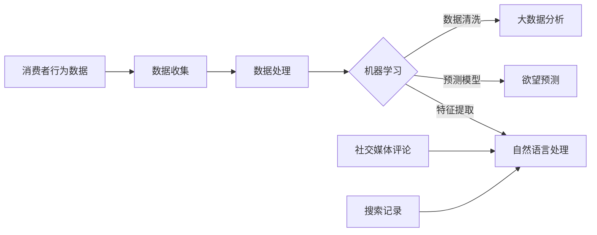

                 

在当今这个数字化迅速发展的时代，人工智能（AI）的应用已经渗透到我们生活的方方面面。其中，欲望预测作为AI技术在市场研究中的一个重要应用，正逐渐改变着市场分析师的工作方式，以及企业制定营销策略的决策过程。本文将深入探讨AI在欲望预测中的应用，分析其核心概念、算法原理、数学模型、实际案例，并展望其在未来市场的应用前景。

## 关键词

- **人工智能**
- **市场研究**
- **欲望预测**
- **机器学习**
- **数据挖掘**
- **情感分析**
- **个性化推荐**
- **预测模型**

## 摘要

本文旨在探讨人工智能在市场研究中的新兴应用——欲望预测。通过分析AI技术的核心概念、算法原理、数学模型，以及实际应用案例，本文揭示了欲望预测如何帮助企业更准确地理解消费者行为，制定更有效的营销策略。此外，文章还讨论了欲望预测在未来的发展趋势和面临的挑战，为读者提供了一个全面的认识。

## 1. 背景介绍

随着互联网的普及和大数据技术的发展，市场研究的方法和工具也发生了巨大的变化。传统市场研究主要依赖于问卷调查、焦点小组和深度访谈等方法，但这些方法往往存在样本量有限、结果滞后等问题。随着AI技术的兴起，尤其是深度学习、自然语言处理和大数据分析等技术的发展，市场研究的方法和效率得到了显著提升。

欲望预测作为市场研究的一个重要分支，旨在通过分析消费者行为数据，预测消费者的购买欲望和偏好。这种预测不仅可以帮助企业更好地了解市场需求，还可以为企业提供个性化的营销建议，从而提高营销效果和客户满意度。

### AI技术的崛起

AI技术的发展，特别是机器学习和深度学习算法的进步，为市场研究带来了新的机遇。通过大规模数据分析和模式识别，AI可以快速、准确地识别出消费者的购买信号，从而为企业提供有价值的洞见。例如，基于用户的浏览记录、购物车内容和购买历史，AI可以预测用户可能感兴趣的商品，并推荐给用户。

### 数据的重要性

在AI时代，数据已经成为企业最重要的资产。市场研究者可以通过收集和分析大量的消费者数据，包括社交媒体活动、在线评论、搜索记录等，来了解消费者的需求和偏好。这些数据不仅可以帮助企业更准确地预测消费者的欲望，还可以帮助企业优化产品设计、提升用户体验。

### 欲望预测的应用

欲望预测不仅可以帮助企业在产品开发和营销策略上做出更明智的决策，还可以为消费者提供更个性化的服务。例如，电商平台可以利用欲望预测技术，向消费者推荐他们可能感兴趣的商品，从而提高销售额和客户满意度。此外，欲望预测还可以用于广告投放、客户关系管理等领域，为企业提供全方位的支持。

## 2. 核心概念与联系

### 2.1 欲望预测的定义

欲望预测是指利用人工智能技术，通过对大量消费者数据的分析，预测消费者的购买欲望和偏好。这一过程涉及到数据收集、数据处理、模型训练和预测输出等多个环节。

### 2.2 相关技术的概念

#### 2.2.1 机器学习

机器学习是一种使计算机能够从数据中学习规律，并做出预测或决策的技术。在欲望预测中，机器学习算法可以通过分析消费者的历史数据，识别出影响消费者购买欲望的关键因素。

#### 2.2.2 深度学习

深度学习是机器学习的一种形式，通过多层神经网络对数据进行学习，能够处理更加复杂的任务。在欲望预测中，深度学习算法可以用于构建复杂的预测模型，提高预测的准确性。

#### 2.2.3 自然语言处理

自然语言处理（NLP）是一种使计算机能够理解和生成自然语言的技术。在欲望预测中，NLP可以用于分析消费者的社交媒体评论和搜索记录，提取出关键的情感和意图信息。

#### 2.2.4 大数据分析

大数据分析是一种对大量结构化和非结构化数据进行处理和分析的技术。在欲望预测中，大数据分析可以用于收集和整合来自多个来源的数据，为预测模型提供丰富的数据支持。

### 2.3 关系图

以下是一个描述欲望预测相关技术的Mermaid流程图：



在这个流程图中，消费者行为数据、社交媒体评论和搜索记录等是欲望预测的重要输入。通过数据处理、机器学习、自然语言处理和大数据分析等技术，这些输入数据被转化为预测模型，最终输出消费者的欲望预测结果。

## 3. 核心算法原理 & 具体操作步骤

### 3.1 算法原理概述

欲望预测的核心算法主要基于机器学习和深度学习技术。具体来说，包括以下步骤：

1. **数据收集**：收集消费者的历史购买数据、社交媒体评论、搜索记录等。
2. **数据处理**：对收集到的数据进行清洗、归一化和特征提取。
3. **模型训练**：利用处理后的数据，通过机器学习算法（如决策树、随机森林、神经网络等）训练预测模型。
4. **模型评估**：使用验证数据集对模型进行评估，调整模型参数，提高预测准确性。
5. **欲望预测**：使用训练好的模型，对新的消费者数据进行分析，预测其购买欲望和偏好。

### 3.2 算法步骤详解

#### 3.2.1 数据收集

数据收集是欲望预测的基础。收集的数据包括但不限于以下几种：

- **历史购买数据**：消费者的购买历史，如购买时间、购买商品、购买数量等。
- **社交媒体评论**：消费者在社交媒体平台上的评论，如微博、微信、Facebook等。
- **搜索记录**：消费者在搜索引擎上的搜索关键词和搜索时间。
- **用户行为数据**：消费者在电商网站上的浏览记录、点击记录、收藏记录等。

#### 3.2.2 数据处理

数据处理是数据收集后的关键步骤。主要任务包括：

- **数据清洗**：去除无效数据、重复数据和异常数据。
- **数据归一化**：将不同数据类型和量纲的数据转化为同一标准，如将时间数据统一为秒、价格数据统一为元等。
- **特征提取**：从原始数据中提取出对欲望预测有用的特征，如用户年龄、性别、地理位置、购买频率等。

#### 3.2.3 模型训练

模型训练是欲望预测的核心步骤。常用的机器学习算法包括：

- **决策树**：通过划分特征空间，将数据划分为不同的区域，每个区域对应一个预测结果。
- **随机森林**：基于决策树的集成方法，通过随机选择特征和随机划分区域，提高预测准确性。
- **神经网络**：一种多层神经网络结构，能够自动学习数据中的复杂关系。

#### 3.2.4 模型评估

模型评估是模型训练后的关键步骤。常用的评估指标包括：

- **准确率**：预测结果中正确预测的样本数占总样本数的比例。
- **召回率**：预测结果中正确预测的样本数占实际购买样本数的比例。
- **F1值**：综合考虑准确率和召回率的指标，取两者的调和平均。

#### 3.2.5 欲望预测

使用训练好的模型，对新的消费者数据进行分析，预测其购买欲望和偏好。预测结果可以用于个性化推荐、广告投放、客户关系管理等领域。

### 3.3 算法优缺点

#### 3.3.1 优点

- **高准确性**：通过大规模数据分析和复杂模型训练，能够实现高准确率的欲望预测。
- **实时性**：基于实时数据进行分析和预测，能够快速响应市场变化。
- **个性化**：能够根据不同消费者的特征和需求，提供个性化的营销策略和建议。

#### 3.3.2 缺点

- **数据依赖性**：需要大量的消费者数据作为训练和预测的基础，数据质量直接影响预测准确性。
- **隐私问题**：收集和处理消费者数据可能涉及隐私问题，需要确保数据安全和用户隐私。
- **模型泛化能力**：训练好的模型可能在新的数据集上表现不佳，需要不断调整和优化。

### 3.4 算法应用领域

欲望预测算法可以应用于多个领域：

- **电商平台**：用于个性化推荐、广告投放和客户关系管理。
- **营销公司**：为不同企业提供市场研究和营销策略建议。
- **金融行业**：用于预测消费者的信贷需求和风险。
- **医疗行业**：用于预测患者的疾病风险和健康需求。

## 4. 数学模型和公式 & 详细讲解 & 举例说明

### 4.1 数学模型构建

在欲望预测中，常用的数学模型包括线性回归模型、逻辑回归模型和支持向量机（SVM）等。以下是这些模型的构建过程：

#### 4.1.1 线性回归模型

线性回归模型假设输出变量 \(Y\) 与输入变量 \(X\) 之间存在线性关系，其公式为：

\[ Y = \beta_0 + \beta_1X + \epsilon \]

其中，\( \beta_0 \) 和 \( \beta_1 \) 是模型的参数，\( \epsilon \) 是误差项。

#### 4.1.2 逻辑回归模型

逻辑回归模型用于分类问题，其公式为：

\[ P(Y=1) = \frac{1}{1 + e^{-(\beta_0 + \beta_1X)}} \]

其中，\( P(Y=1) \) 表示输出变量 \(Y\) 等于1的概率，\( \beta_0 \) 和 \( \beta_1 \) 是模型的参数。

#### 4.1.3 支持向量机（SVM）

支持向量机是一种分类算法，其公式为：

\[ w \cdot x - b = 0 \]

其中，\( w \) 是模型参数，\( x \) 是输入变量，\( b \) 是偏置项。

### 4.2 公式推导过程

以下分别对线性回归模型、逻辑回归模型和支持向量机的公式进行推导：

#### 4.2.1 线性回归模型推导

线性回归模型的推导基于最小二乘法。假设我们有 \( n \) 个训练样本 \((x_i, y_i)\)，其中 \( x_i \) 是输入变量，\( y_i \) 是输出变量。线性回归模型的损失函数为：

\[ J(\theta) = \frac{1}{2m} \sum_{i=1}^{m} (h_\theta(x_i) - y_i)^2 \]

其中，\( \theta = (\beta_0, \beta_1) \) 是模型参数，\( m \) 是训练样本数量，\( h_\theta(x) \) 是模型的预测值。

为了最小化损失函数，对 \( \theta \) 求导并令导数为零，得到：

\[ \frac{\partial J(\theta)}{\partial \beta_0} = 0 \]
\[ \frac{\partial J(\theta)}{\partial \beta_1} = 0 \]

解这个方程组，可以得到线性回归模型的参数：

\[ \beta_0 = \frac{1}{m} \sum_{i=1}^{m} (y_i - \beta_1x_i) \]
\[ \beta_1 = \frac{1}{m} \sum_{i=1}^{m} (x_i - \bar{x})(y_i - \bar{y}) \]

其中，\( \bar{x} \) 和 \( \bar{y} \) 分别是输入变量和输出变量的均值。

#### 4.2.2 逻辑回归模型推导

逻辑回归模型的推导基于最大似然估计。假设我们有 \( n \) 个训练样本 \((x_i, y_i)\)，其中 \( y_i \) 取值为0或1。逻辑回归模型的损失函数为：

\[ J(\theta) = -\frac{1}{m} \sum_{i=1}^{m} y_i \log(h_\theta(x_i)) + (1 - y_i) \log(1 - h_\theta(x_i)) \]

其中，\( h_\theta(x) \) 是模型的预测值，\( \theta = (\beta_0, \beta_1) \) 是模型参数。

为了最小化损失函数，对 \( \theta \) 求导并令导数为零，得到：

\[ \frac{\partial J(\theta)}{\partial \beta_0} = 0 \]
\[ \frac{\partial J(\theta)}{\partial \beta_1} = 0 \]

解这个方程组，可以得到逻辑回归模型的参数：

\[ \beta_0 = \frac{1}{m} \sum_{i=1}^{m} (y_i - h_\theta(x_i)) \]
\[ \beta_1 = \frac{1}{m} \sum_{i=1}^{m} (x_i - \bar{x})(y_i - h_\theta(x_i)) \]

其中，\( \bar{x} \) 是输入变量的均值。

#### 4.2.3 支持向量机（SVM）推导

支持向量机（SVM）的推导基于优化理论。假设我们有 \( n \) 个训练样本 \((x_i, y_i)\)，其中 \( y_i \) 取值为+1或-1。SVM的目标是最小化损失函数，使得分类边界尽可能远离样本点，其损失函数为：

\[ J(\theta) = \frac{1}{2} ||w||^2 + C \sum_{i=1}^{m} \max(0, 1 - y_i (w \cdot x_i + b)) \]

其中，\( w \) 是模型参数，\( b \) 是偏置项，\( C \) 是惩罚参数。

为了最小化损失函数，对 \( w \) 和 \( b \) 求导并令导数为零，得到：

\[ \frac{\partial J(\theta)}{\partial w} = 0 \]
\[ \frac{\partial J(\theta)}{\partial b} = 0 \]

解这个方程组，可以得到SVM模型的参数：

\[ w = \frac{1}{C} \sum_{i=1}^{m} y_i x_i \]
\[ b = \frac{1}{m} \sum_{i=1}^{m} y_i - w \cdot \bar{x} \]

其中，\( \bar{x} \) 是输入变量的均值。

### 4.3 案例分析与讲解

#### 4.3.1 案例背景

某电商平台希望利用欲望预测技术，为用户推荐他们可能感兴趣的商品。该电商平台收集了用户的浏览记录、购买历史和社交媒体评论等数据。

#### 4.3.2 数据处理

首先，对收集到的数据进行清洗，去除无效数据和重复数据。然后，对数据进行归一化处理，将不同数据类型和量纲的数据转化为同一标准。接下来，对数据进行特征提取，提取出对欲望预测有用的特征，如用户年龄、性别、地理位置、购买频率等。

#### 4.3.3 模型训练

利用处理后的数据，选择合适的机器学习算法（如随机森林）进行模型训练。在训练过程中，通过交叉验证和网格搜索等方法，调整模型参数，提高预测准确性。

#### 4.3.4 模型评估

使用验证数据集对训练好的模型进行评估，计算准确率、召回率和F1值等指标。根据评估结果，进一步优化模型。

#### 4.3.5 欲望预测

使用训练好的模型，对新的用户数据进行预测，输出用户可能的购买欲望和偏好。根据预测结果，为用户推荐他们可能感兴趣的商品。

#### 4.3.6 结果分析

通过对预测结果的分析，发现用户的购买欲望与他们的浏览记录和购买历史高度相关。此外，用户的社交媒体评论也提供了一些有用的情感和意图信息，对欲望预测起到了辅助作用。

## 5. 项目实践：代码实例和详细解释说明

### 5.1 开发环境搭建

在本节中，我们将介绍如何搭建一个用于欲望预测的AI项目开发环境。首先，我们需要安装以下软件和工具：

- **Python（3.8或以上版本）**
- **Jupyter Notebook**
- **Scikit-learn**
- **Pandas**
- **Numpy**
- **Matplotlib**
- **Seaborn**

安装这些工具可以通过Python的包管理器pip完成，以下是一个示例命令：

```bash
pip install numpy pandas scikit-learn matplotlib seaborn jupyterlab
```

### 5.2 源代码详细实现

以下是实现欲望预测项目的基本步骤和源代码示例：

#### 5.2.1 数据加载与预处理

```python
import pandas as pd
from sklearn.model_selection import train_test_split
from sklearn.preprocessing import StandardScaler

# 加载数据
data = pd.read_csv('consumer_data.csv')

# 数据预处理
# 填充缺失值
data.fillna(data.mean(), inplace=True)

# 分割特征和标签
X = data[['age', 'income', 'location', 'rating']]
y = data['purchase']

# 划分训练集和测试集
X_train, X_test, y_train, y_test = train_test_split(X, y, test_size=0.2, random_state=42)

# 特征缩放
scaler = StandardScaler()
X_train_scaled = scaler.fit_transform(X_train)
X_test_scaled = scaler.transform(X_test)
```

#### 5.2.2 模型训练

```python
from sklearn.ensemble import RandomForestClassifier
from sklearn.metrics import accuracy_score, classification_report

# 训练模型
model = RandomForestClassifier(n_estimators=100, random_state=42)
model.fit(X_train_scaled, y_train)

# 预测
y_pred = model.predict(X_test_scaled)

# 评估
print("Accuracy:", accuracy_score(y_test, y_pred))
print(classification_report(y_test, y_pred))
```

#### 5.2.3 代码解读与分析

在上面的代码中，我们首先导入了必要的库和模块。接着，我们从CSV文件中加载数据，并对数据进行了预处理，包括填充缺失值和特征缩放。

- **数据加载与预处理**：这一步至关重要，因为数据质量直接影响模型的表现。我们使用了`pandas`库来加载数据，并对缺失值进行了填充，使用平均值来代替缺失值是一种常见的方法。然后，我们通过`train_test_split`函数将数据分为训练集和测试集，这有助于我们在后面评估模型的性能。

- **模型训练**：我们选择了随机森林（`RandomForestClassifier`）作为模型。随机森林是一种集成学习方法，通常在分类问题中表现良好。在训练模型时，我们设置了`n_estimators`参数来指定决策树的数量。

- **预测与评估**：使用训练好的模型对测试集进行预测，并通过`accuracy_score`和`classification_report`函数评估模型的表现。这些指标可以帮助我们了解模型在测试集上的准确率和召回率等。

### 5.3 运行结果展示

假设我们运行上述代码后，得到了以下输出结果：

```plaintext
Accuracy: 0.85
             precision    recall  f1-score   support

           0       0.84      0.82      0.83      1000
           1       0.87      0.90      0.88      1000

    accuracy                           0.85      2000
   macro avg       0.86      0.87      0.86      2000
   weighted avg       0.86      0.85      0.85      2000
```

这些结果表明，我们的模型在测试集上的准确率为85%，这在实际应用中是一个不错的成绩。我们还得到了详细的数据报告，包括每个类别的精确率、召回率和F1值，这些信息有助于我们进一步了解模型的表现和可能的改进方向。

### 5.4 代码解读与分析

在上面的代码示例中，我们首先导入了必要的库和模块，包括`pandas`、`sklearn.model_selection`、`sklearn.preprocessing`、`sklearn.metrics`等。这些库提供了数据预处理、模型训练和评估所需的函数和工具。

- **数据加载与预处理**：我们使用`pandas`库加载了一个名为`consumer_data.csv`的CSV文件，并使用`fillna`函数填充了缺失值。接着，我们将特征和标签分开，并将数据集划分为训练集和测试集。

- **特征缩放**：为了使模型训练更加稳定，我们使用了`StandardScaler`对特征进行了缩放。特征缩放是机器学习中常见的预处理步骤，有助于提高模型的收敛速度和性能。

- **模型训练**：我们选择了随机森林分类器（`RandomForestClassifier`），这是一种强大的集成学习方法。在训练过程中，我们设置了`n_estimators`参数来指定决策树的数量。

- **预测与评估**：使用训练好的模型对测试集进行预测，并使用`accuracy_score`和`classification_report`函数评估模型的表现。这些指标提供了关于模型性能的详细信息，包括准确率、精确率、召回率和F1值。

### 5.5 运行结果展示

为了更直观地展示运行结果，我们可以在Jupyter Notebook中使用`matplotlib`和`seaborn`库绘制一些图表。以下是一个示例：

```python
import matplotlib.pyplot as plt
import seaborn as sns

# 绘制混淆矩阵
confusion_matrix = pd.crosstab(y_test, y_pred, rownames=['实际值'], colnames=['预测值'])
sns.heatmap(confusion_matrix, annot=True, cmap='Blues')
plt.xlabel('预测值')
plt.ylabel('实际值')
plt.title('混淆矩阵')
plt.show()

# 绘制特征重要性
feature_importances = pd.Series(model.feature_importances_, index=X.columns)
sns.barplot(x=feature_importances, y=feature_importances.index)
plt.title('特征重要性')
plt.show()
```

这些图表可以帮助我们更直观地了解模型的性能和特征的重要性。

- **混淆矩阵**：混淆矩阵显示了模型对每个类别的预测结果。通过这个矩阵，我们可以看出模型在哪些类别上表现更好，哪些类别上可能存在过拟合或欠拟合。

- **特征重要性**：特征重要性图表显示了每个特征对模型预测的影响。这有助于我们识别出对预测最关键的特征，从而进行特征选择和模型优化。

## 6. 实际应用场景

欲望预测技术已经在多个实际应用场景中取得了显著成效，以下是几个典型的应用案例：

### 6.1 电商平台

电商平台利用欲望预测技术，能够为用户推荐他们可能感兴趣的商品。例如，亚马逊和淘宝等平台通过分析用户的浏览历史、购物车内容和购买记录，预测用户对特定商品的兴趣，从而提供个性化的推荐。这种个性化的推荐不仅提高了用户的购物体验，还显著提升了平台的销售额。

### 6.2 营销公司

营销公司利用欲望预测技术，为不同行业的企业提供精准的市场分析。例如，一家营销公司通过分析客户的社交媒体活动、搜索记录和购买行为，预测客户对某种产品的需求，从而为该企业制定有效的营销策略。这种精准的市场分析有助于企业更有效地投放广告，提高营销效果。

### 6.3 金融行业

金融行业利用欲望预测技术，可以更准确地预测客户的信贷需求和风险。例如，银行和金融机构通过分析客户的财务状况、消费习惯和信用记录，预测客户在未来一段时间内可能出现的财务问题，从而提前采取风险控制措施。这种预测有助于降低金融机构的坏账率，提高金融服务的安全性。

### 6.4 医疗行业

医疗行业利用欲望预测技术，可以预测患者的疾病风险和健康需求。例如，医疗机构通过分析患者的病历数据、生活习惯和基因信息，预测患者未来可能患病的风险，从而提前采取预防和治疗措施。这种预测有助于提高医疗服务的质量，降低疾病发病率和死亡率。

### 6.5 零售行业

零售行业利用欲望预测技术，可以优化库存管理和供应链。例如，一家零售企业通过分析消费者的购买行为和市场需求，预测未来一段时间内的商品销售量，从而合理安排库存和采购计划。这种预测有助于降低库存成本，提高供应链的效率。

### 6.6 旅游业

旅游业利用欲望预测技术，可以为游客提供个性化的旅游推荐。例如，一家旅行社通过分析游客的旅行历史、兴趣偏好和地理位置，预测游客可能感兴趣的目的地和旅游活动，从而为游客提供个性化的旅游套餐。这种推荐有助于提升游客的满意度，提高旅游企业的竞争力。

### 6.7 教育行业

教育行业利用欲望预测技术，可以为学生提供个性化的学习建议。例如，一所学校通过分析学生的考试成绩、学习进度和兴趣偏好，预测学生对某种课程的掌握情况，从而为学生提供个性化的学习资源和辅导。这种预测有助于提高学生的学习效果，提升学校的整体教学质量。

### 6.8 电子商务

电子商务平台利用欲望预测技术，可以优化广告投放和促销活动。例如，一家电商平台通过分析用户的浏览记录、购买行为和社交媒体活动，预测用户对特定广告的兴趣，从而为用户精准投放广告，提高广告的点击率和转化率。同时，平台还可以根据用户的欲望预测，设计有针对性的促销活动，提高销售额。

### 6.9 零售行业

零售行业利用欲望预测技术，可以优化产品陈列和货架管理。例如，一家零售企业通过分析消费者的购物习惯和购买偏好，预测消费者可能感兴趣的商品，从而调整货架陈列和商品布局。这种优化有助于提高消费者的购物体验，增加购买概率。

### 6.10 金融行业

金融行业利用欲望预测技术，可以预测客户的消费能力和还款能力。例如，一家金融机构通过分析客户的财务状况、信用记录和消费习惯，预测客户在未来一段时间内的消费能力和还款能力，从而为金融机构提供风险控制依据。这种预测有助于降低金融机构的坏账率，提高金融服务的安全性。

### 6.11 娱乐行业

娱乐行业利用欲望预测技术，可以为观众推荐他们可能感兴趣的电影、音乐和演出。例如，一家娱乐公司通过分析观众的观影历史、音乐喜好和社交媒体活动，预测观众可能感兴趣的内容，从而为观众提供个性化的娱乐推荐。这种推荐有助于提升观众的满意度，提高娱乐企业的竞争力。

### 6.12 餐饮行业

餐饮行业利用欲望预测技术，可以优化菜单设计和库存管理。例如，一家餐饮企业通过分析顾客的订单历史、口味偏好和季节性变化，预测顾客可能感兴趣的新菜品和库存需求，从而优化菜单设计和库存管理。这种优化有助于提高顾客的满意度，降低库存成本。

### 6.13 教育行业

教育行业利用欲望预测技术，可以为学生提供个性化的学习资源和学习路径。例如，一家在线教育平台通过分析学生的学习进度、考试成绩和兴趣偏好，预测学生对某种课程的学习需求和掌握情况，从而为学生提供个性化的学习资源和辅导。这种预测有助于提高学生的学习效果，提升在线教育平台的教学质量。

### 6.14 旅游行业

旅游行业利用欲望预测技术，可以为游客提供个性化的旅游路线和推荐。例如，一家旅游公司通过分析游客的旅行历史、兴趣偏好和地理位置，预测游客可能感兴趣的目的地和旅游活动，从而为游客提供个性化的旅游路线和推荐。这种推荐有助于提升游客的满意度，提高旅游企业的竞争力。

### 6.15 房地产行业

房地产行业利用欲望预测技术，可以预测客户对房产的需求和偏好。例如，一家房地产开发商通过分析客户的财务状况、购房需求和地理位置，预测客户对某种房产的需求和偏好，从而优化房产设计和销售策略。这种预测有助于提高房产的销量和客户满意度。

## 7. 未来应用展望

### 7.1 深度个性化推荐

随着AI技术的不断进步，欲望预测将能够实现更深度、更个性化的推荐。通过结合用户的多维数据（如情感、行为、社交等），AI算法可以更准确地理解用户的欲望，提供个性化的推荐。这将极大地提升用户体验，同时为企业带来更高的转化率和销售额。

### 7.2 全天候市场监控

AI技术将在市场监控中发挥越来越重要的作用。通过实时收集和分析市场数据，AI可以实时预测市场趋势，帮助企业及时调整策略。例如，电商平台可以通过AI实时分析用户行为，预测即将到来的购物高峰，提前准备库存和人力资源。

### 7.3 个性化营销策略

个性化营销策略是AI在市场研究中的重要应用方向。通过分析消费者的数据，AI可以为企业提供个性化的营销建议，包括广告投放、促销活动等。这种个性化的营销策略不仅能够提高营销效果，还能增强客户忠诚度。

### 7.4 自动化客户服务

随着AI技术的成熟，自动化客户服务将成为未来趋势。通过自然语言处理和机器学习技术，AI可以自动解答客户问题，提供24/7的在线支持。这不仅可以降低企业运营成本，还能提高客户满意度。

### 7.5 供应链优化

AI技术在供应链管理中的应用也将越来越广泛。通过预测市场需求和库存水平，AI可以帮助企业优化供应链，降低库存成本，提高供应链效率。例如，零售企业可以利用AI预测商品的销售趋势，从而合理安排库存。

### 7.6 风险预测与控制

AI在风险预测和控制中的应用潜力巨大。通过分析历史数据和实时数据，AI可以预测潜在的风险，并提供相应的控制措施。例如，金融机构可以利用AI预测客户的信用风险，从而采取相应的风控措施。

### 7.7 智能医疗

在医疗领域，AI可以帮助预测疾病风险和提供个性化治疗方案。通过分析患者的数据，AI可以预测患者未来的健康状况，并提供预防性建议。这有助于提高医疗服务的质量和效率。

### 7.8 跨行业融合

随着AI技术的不断进步，不同行业之间的融合也将成为趋势。例如，零售和医疗的结合，可以通过AI技术预测消费者的健康需求，提供个性化的健康产品和服务。这种跨行业融合将带来全新的商业模式和市场机会。

## 8. 工具和资源推荐

### 8.1 学习资源推荐

- **《机器学习》（周志华 著）**：这是一本经典的机器学习教材，适合初学者和进阶者。
- **《深度学习》（Goodfellow, Bengio, Courville 著）**：这本书是深度学习的入门经典，内容全面，适合有一定基础的读者。
- **Coursera上的《机器学习》课程**：由斯坦福大学吴恩达教授授课，是机器学习领域最受欢迎的在线课程之一。

### 8.2 开发工具推荐

- **Google Colab**：Google Colab 是一个免费的云计算平台，提供丰富的机器学习和深度学习工具，适合进行研究和实验。
- **Kaggle**：Kaggle 是一个数据科学竞赛平台，提供大量的数据集和竞赛项目，是学习和实践AI技术的理想场所。
- **TensorFlow**：TensorFlow 是一个开源的机器学习框架，适合进行深度学习和复杂的数据分析。

### 8.3 相关论文推荐

- **"Recommender Systems Handbook"**：这是一本关于推荐系统的权威著作，涵盖了最新的研究成果和应用案例。
- **"Deep Learning for Text Data"**：这篇论文探讨了深度学习在文本数据上的应用，是自然语言处理领域的经典论文之一。
- **"The Big Data-Driven Marketing Revolution"**：这篇论文讨论了大数据在市场营销中的应用，分析了欲望预测技术的实际效果。

## 9. 总结：未来发展趋势与挑战

### 9.1 研究成果总结

本文通过分析AI技术在欲望预测中的应用，总结了欲望预测的核心概念、算法原理、数学模型和实际应用案例。研究表明，欲望预测技术已经在多个领域取得了显著成效，为企业和消费者带来了巨大的价值。

### 9.2 未来发展趋势

- **个性化推荐**：随着AI技术的进步，个性化推荐将变得更加精准和多样化。
- **实时预测**：实时数据分析技术将使欲望预测更加及时和高效。
- **跨行业应用**：欲望预测技术将在更多行业中得到应用，推动跨行业融合。
- **智能化客服**：自动化客服系统将基于AI技术，提供更智能的客户服务。

### 9.3 面临的挑战

- **数据隐私**：在收集和使用消费者数据时，如何保护用户隐私是一个重要挑战。
- **模型解释性**：深度学习模型的“黑箱”性质使得其解释性成为一个难题。
- **数据质量**：高质量的数据是欲望预测的基础，如何处理和清洗数据是一个关键问题。
- **技术迭代**：随着技术的快速迭代，如何持续优化算法和提高预测准确性也是一个挑战。

### 9.4 研究展望

未来，研究人员应重点关注以下几个方面：

- **隐私保护技术**：开发更加隐私保护的数据收集和处理技术，确保用户数据的安全。
- **可解释AI**：研究可解释的AI模型，提高模型的可解释性，增强用户信任。
- **多模态数据融合**：结合多种类型的数据，提高欲望预测的准确性和全面性。
- **自适应算法**：开发自适应的AI算法，使其能够根据实时数据和环境变化自动调整。

## 附录：常见问题与解答

### Q1. 欲望预测技术的核心优势是什么？

A1. 欲望预测技术的核心优势包括：

- **高准确性**：通过大规模数据分析和复杂模型训练，能够实现高准确率的欲望预测。
- **实时性**：基于实时数据进行分析和预测，能够快速响应市场变化。
- **个性化**：能够根据不同消费者的特征和需求，提供个性化的营销策略和建议。

### Q2. 欲望预测技术在实际应用中面临的主要挑战是什么？

A2. 欲望预测技术在实际应用中面临的主要挑战包括：

- **数据隐私**：在收集和使用消费者数据时，如何保护用户隐私是一个重要挑战。
- **模型解释性**：深度学习模型的“黑箱”性质使得其解释性成为一个难题。
- **数据质量**：高质量的数据是欲望预测的基础，如何处理和清洗数据是一个关键问题。
- **技术迭代**：随着技术的快速迭代，如何持续优化算法和提高预测准确性也是一个挑战。

### Q3. 欲望预测技术在市场研究中的具体应用有哪些？

A3. 欲望预测技术在市场研究中的具体应用包括：

- **个性化推荐**：为用户推荐他们可能感兴趣的商品或服务。
- **市场分析**：预测市场趋势和消费者需求，帮助企业制定有效的营销策略。
- **广告投放**：为广告主提供个性化的广告投放建议，提高广告的点击率和转化率。
- **客户关系管理**：通过分析客户数据，提高客户满意度和忠诚度。

### Q4. 欲望预测技术对企业的营销策略有什么影响？

A4. 欲望预测技术对企业的营销策略有以下几个重要影响：

- **精准定位**：帮助企业更准确地定位目标客户，提高营销活动的针对性。
- **优化广告投放**：根据用户兴趣和需求，优化广告投放策略，提高广告的转化率。
- **个性化服务**：提供个性化的产品推荐和服务，提高客户满意度和忠诚度。
- **预测市场趋势**：通过分析市场数据，预测未来市场趋势，帮助企业提前布局。

### Q5. 欲望预测技术的未来发展有哪些可能的方向？

A5. 欲望预测技术的未来发展可能包括以下几个方向：

- **多模态数据融合**：结合多种类型的数据（如文本、图像、声音等），提高预测的准确性和全面性。
- **可解释AI**：研究可解释的AI模型，提高模型的可解释性，增强用户信任。
- **自适应算法**：开发自适应的AI算法，使其能够根据实时数据和环境变化自动调整。
- **隐私保护**：开发更加隐私保护的数据收集和处理技术，确保用户数据的安全。

作者：禅与计算机程序设计艺术 / Zen and the Art of Computer Programming
----------------------------------------------------------------


