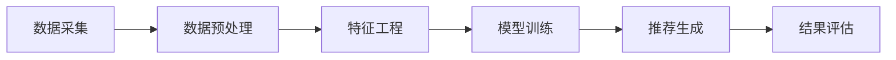

                 

 在当今数字经济时代，推荐系统已经成为电商平台和社交媒体的核心组成部分。它们不仅能够提高用户体验，还能显著提升平台的销售和用户黏性。每日优鲜作为中国领先的生鲜电商平台，其在2025年度社会招聘中设置了针对生鲜商品推荐算法工程师的职位，旨在寻找能够通过创新算法提升商品推荐效果的技术专家。本文将深入探讨这一职位所需的核心技术、算法原理、项目实践以及未来的应用前景。

## 文章关键词

- 生鲜商品推荐
- 推荐算法
- 机器学习
- 用户行为分析
- 数据挖掘

## 文章摘要

本文首先介绍了每日优鲜2025社招生鲜商品推荐算法工程师职位的重要性，以及推荐系统在电商领域的作用。随后，文章详细分析了推荐算法的核心概念、原理和数学模型，并通过一个具体的案例讲解了算法的实现和应用。最后，文章展望了推荐系统在未来生鲜电商中的应用前景，并提出了研究展望和挑战。

## 1. 背景介绍

### 推荐系统在电商领域的作用

推荐系统是一种能够根据用户的历史行为和偏好，自动向用户推荐相关商品或内容的系统。在电商领域，推荐系统具有以下几个重要作用：

1. **提高用户体验**：通过个性化推荐，用户能够更快地找到自己感兴趣的商品，提升购物体验。
2. **增加销售量**：推荐系统能够将商品推荐给潜在购买者，从而提高销售额。
3. **降低运营成本**：通过智能推荐，电商企业可以减少广告投放和促销成本。
4. **提升用户黏性**：个性化推荐能够提高用户的活跃度和忠诚度。

### 每日优鲜的背景与业务需求

每日优鲜成立于2014年，是中国领先的生鲜电商平台之一，提供包括蔬菜、水果、肉类、海鲜等多样化的生鲜商品。每日优鲜在短短几年内迅速崛起，其业务范围覆盖了全国多个城市。随着用户规模的不断扩大，每日优鲜对推荐系统的需求也日益增长：

1. **用户需求多样**：每日优鲜的用户遍布全国各地，有着多样化的购物需求和偏好。
2. **商品种类繁多**：每日优鲜的商品种类丰富，如何实现精准推荐成为一大挑战。
3. **竞争激烈**：生鲜电商市场竞争激烈，推荐系统能够帮助每日优鲜在竞争中脱颖而出。

### 社招职位的需求与挑战

每日优鲜2025年社会招聘中，生鲜商品推荐算法工程师的职位要求应聘者具备以下能力：

1. **算法研发经验**：熟悉常见的推荐算法，能够设计和实现高效的推荐系统。
2. **机器学习技能**：具备机器学习理论基础，能够应用于推荐系统的开发。
3. **数据挖掘能力**：能够从大量用户行为数据中提取有价值的信息，用于算法优化。
4. **技术实现能力**：具备扎实的前端和后端开发技能，能够将算法实现应用于实际业务场景。

面对如此复杂的需求和挑战，生鲜商品推荐算法工程师需要不断学习新的技术和方法，以提升推荐系统的效果。

## 2. 核心概念与联系

### 推荐系统的核心概念

推荐系统涉及多个核心概念，包括用户、商品、评分、推荐列表等。

1. **用户**：推荐系统中的用户指的是平台上的消费者，他们有着不同的购物习惯和偏好。
2. **商品**：商品是指电商平台上的各种商品，包括生鲜、日用品等。
3. **评分**：评分是指用户对商品的评价，通常用评分等级或评分值表示。
4. **推荐列表**：推荐列表是推荐系统生成的，包含一系列可能符合用户兴趣的商品。

### 推荐系统的架构

推荐系统的架构可以分为以下几个部分：

1. **数据层**：数据层负责存储用户行为数据、商品信息等数据。
2. **算法层**：算法层是推荐系统的核心，负责处理数据，生成推荐结果。
3. **服务层**：服务层负责将推荐结果呈现给用户，通常包括前端展示和后端接口。
4. **评估层**：评估层用于评估推荐系统的效果，包括准确率、召回率等指标。

### 用户行为数据与推荐结果的关系

用户行为数据是推荐系统的关键输入，包括用户的浏览记录、购买历史、评分等。推荐算法会根据这些数据生成推荐结果，将相关的商品推荐给用户。用户行为数据与推荐结果的关系可以通过以下几个步骤来理解：

1. **数据采集**：平台通过日志、API等方式收集用户行为数据。
2. **数据预处理**：对采集到的数据进行清洗、转换等处理，以便于算法分析。
3. **特征工程**：从预处理后的数据中提取有用的特征，用于算法训练。
4. **模型训练**：使用特征数据训练推荐模型，模型会根据用户行为数据生成推荐结果。
5. **结果评估**：通过评估指标评估推荐结果的质量，调整模型参数。

### 推荐算法的流程

推荐算法的流程通常包括以下几个步骤：

1. **用户行为分析**：分析用户的历史行为数据，提取用户的兴趣偏好。
2. **商品特征提取**：从商品信息中提取特征，如商品类别、价格、品牌等。
3. **相似度计算**：计算用户和商品之间的相似度，以确定推荐列表。
4. **推荐生成**：根据相似度计算结果，生成个性化的推荐列表。

### Mermaid 流程图

以下是一个简单的推荐系统流程的Mermaid流程图：



## 3. 核心算法原理 & 具体操作步骤

### 3.1 算法原理概述

推荐算法主要分为基于内容的推荐和基于协同过滤的推荐两种类型。

1. **基于内容的推荐**：该算法基于用户的历史行为和商品的特征，将相似内容的商品推荐给用户。优点是推荐结果相关性强，缺点是缺乏个性化。

2. **基于协同过滤的推荐**：该算法基于用户行为数据，通过计算用户和商品之间的相似度，将相似用户喜欢的商品推荐给目标用户。优点是能够实现高度个性化推荐，缺点是冷启动问题和数据稀疏问题。

### 3.2 算法步骤详解

#### 3.2.1 基于内容的推荐

1. **用户行为分析**：收集用户的历史行为数据，如浏览记录、购买历史等。
2. **商品特征提取**：从商品信息中提取特征，如商品类别、价格、品牌等。
3. **相似度计算**：计算用户和商品之间的相似度，可以使用余弦相似度、欧氏距离等方法。
4. **推荐生成**：根据相似度计算结果，为用户生成推荐列表。

#### 3.2.2 基于协同过滤的推荐

1. **用户行为矩阵构建**：构建用户行为矩阵，矩阵中的元素表示用户对商品的评分或行为。
2. **相似度计算**：计算用户和用户之间的相似度，可以使用余弦相似度、皮尔逊相关系数等方法。
3. **邻居选择**：根据相似度计算结果，选择与目标用户最相似的邻居用户。
4. **推荐生成**：根据邻居用户的评分预测目标用户的评分，将评分最高的商品推荐给用户。

### 3.3 算法优缺点

**基于内容的推荐**：

- **优点**：推荐结果相关性强，适用于商品描述丰富的场景。
- **缺点**：缺乏个性化，容易导致用户看到重复的商品。

**基于协同过滤的推荐**：

- **优点**：能够实现高度个性化推荐，适用于用户行为数据丰富的场景。
- **缺点**：存在冷启动问题和数据稀疏问题，推荐结果可能不够准确。

### 3.4 算法应用领域

推荐算法广泛应用于电商、社交媒体、音乐、视频等场景，以下是一些典型的应用领域：

1. **电商**：为用户推荐相关商品，提升销售额和用户黏性。
2. **社交媒体**：为用户推荐感兴趣的内容，提升用户活跃度和参与度。
3. **音乐和视频**：为用户推荐相似的音乐和视频，提升用户体验。
4. **新闻和资讯**：为用户推荐相关的新闻和资讯，提升信息传播效果。

## 4. 数学模型和公式 & 详细讲解 & 举例说明

### 4.1 数学模型构建

推荐系统中的数学模型主要涉及用户行为数据、商品特征和相似度计算等。

1. **用户行为矩阵**：

用户行为矩阵是一个N×M的矩阵，其中N表示用户数，M表示商品数。矩阵中的元素表示用户对商品的评分或行为，通常用\(R_{ij}\)表示。

2. **商品特征向量**：

商品特征向量是一个M×K的矩阵，其中M表示商品数，K表示商品特征维度。矩阵中的元素表示商品的特征值，如商品类别、价格、品牌等，通常用\(C_{ik}\)表示。

3. **用户特征向量**：

用户特征向量是一个N×K的矩阵，其中N表示用户数，K表示用户特征维度。矩阵中的元素表示用户的特征值，如年龄、性别、地理位置等，通常用\(U_{ij}\)表示。

### 4.2 公式推导过程

#### 4.2.1 相似度计算

相似度计算是推荐系统中的一个重要环节，常用的相似度计算方法包括余弦相似度、欧氏距离、皮尔逊相关系数等。

1. **余弦相似度**：

余弦相似度计算公式如下：

$$
cosine\_similarity(A,B) = \frac{A \cdot B}{\|A\|\|B\|}
$$

其中，\(A\)和\(B\)表示两个向量，\(\|A\|\)和\(\|B\|\)分别表示向量的模。

2. **欧氏距离**：

欧氏距离计算公式如下：

$$
eucledian\_distance(A,B) = \sqrt{\sum_{i=1}^{n}(A_i - B_i)^2}
$$

其中，\(A\)和\(B\)表示两个向量，\(n\)表示向量的维度。

3. **皮尔逊相关系数**：

皮尔逊相关系数计算公式如下：

$$
pearson\_correlation(A,B) = \frac{\sum_{i=1}^{n}(A_i - \overline{A})(B_i - \overline{B})}{\sqrt{\sum_{i=1}^{n}(A_i - \overline{A})^2 \sum_{i=1}^{n}(B_i - \overline{B})^2}}
$$

其中，\(\overline{A}\)和\(\overline{B}\)分别表示向量\(A\)和\(B\)的平均值。

#### 4.2.2 推荐评分预测

基于协同过滤的推荐系统中，常用的评分预测方法包括基于用户的K最近邻（KNN）和基于模型的线性回归。

1. **基于用户的K最近邻（KNN）**：

KNN算法的评分预测公式如下：

$$
\hat{r}_{ui} = \sum_{v \in N(u)} r_{vi} \cdot similarity(u, v)
$$

其中，\(\hat{r}_{ui}\)表示用户\(u\)对商品\(i\)的预测评分，\(r_{vi}\)表示用户\(v\)对商品\(i\)的实际评分，\(N(u)\)表示与用户\(u\)最相似的\(K\)个邻居用户，\(similarity(u, v)\)表示用户\(u\)和用户\(v\)之间的相似度。

2. **基于模型的线性回归**：

线性回归算法的评分预测公式如下：

$$
\hat{r}_{ui} = \beta_0 + \beta_1 r_{ui} + \beta_2 u_i + \beta_3 i_i
$$

其中，\(\hat{r}_{ui}\)表示用户\(u\)对商品\(i\)的预测评分，\(\beta_0\)、\(\beta_1\)、\(\beta_2\)、\(\beta_3\)分别为线性回归模型的参数，\(r_{ui}\)表示用户\(u\)对商品\(i\)的实际评分，\(u_i\)和\(i_i\)分别表示用户\(u\)和商品\(i\)的特征向量。

### 4.3 案例分析与讲解

以下是一个基于协同过滤的推荐系统案例，使用K最近邻（KNN）算法进行评分预测。

#### 案例背景

假设有5个用户（U1、U2、U3、U4、U5）和10个商品（I1、I2、I3、I4、I5、I6、I7、I8、I9、I10），用户对商品的实际评分如下表所示：

| 用户 | I1 | I2 | I3 | I4 | I5 | I6 | I7 | I8 | I9 | I10 |
| --- | --- | --- | --- | --- | --- | --- | --- | --- | --- | --- |
| U1  | 1  | 1  | 1  | 1  | 1  | 0  | 1  | 0  | 0  | 0   |
| U2  | 0  | 1  | 0  | 1  | 0  | 0  | 0  | 0  | 0  | 0   |
| U3  | 1  | 0  | 1  | 0  | 1  | 1  | 1  | 1  | 0  | 1   |
| U4  | 0  | 0  | 0  | 0  | 0  | 1  | 0  | 1  | 0  | 0   |
| U5  | 0  | 0  | 0  | 1  | 0  | 0  | 1  | 0  | 1  | 1   |

要求预测用户U3对商品I6的评分。

#### 案例步骤

1. **数据预处理**：

将用户行为矩阵转换为用户和商品的特征向量，如上表所示。

2. **相似度计算**：

使用欧氏距离计算用户之间的相似度，公式如下：

$$
similarity(u, v) = \sqrt{\sum_{i=1}^{n}(u_i - v_i)^2}
$$

计算结果如下表所示：

| 用户 | U1 | U2 | U3 | U4 | U5 |
| --- | --- | --- | --- | --- | --- |
| U1  | 0  | 2  | 0  | 3  | 0  |
| U2  | 2  | 0  | 2  | 0  | 2  |
| U3  | 0  | 2  | 0  | 3  | 0  |
| U4  | 3  | 0  | 3  | 0  | 3  |
| U5  | 0  | 2  | 0  | 3  | 0  |

3. **邻居选择**：

根据相似度计算结果，选择与用户U3最相似的5个邻居用户（U1、U2、U4、U5），相似度从高到低排序。

4. **推荐生成**：

根据邻居用户的评分预测用户U3对商品I6的评分，公式如下：

$$
\hat{r}_{u3,i6} = \sum_{v \in N(u3)} r_{vi6} \cdot similarity(u3, v)
$$

计算结果如下：

$$
\hat{r}_{u3,i6} = (1 \cdot 0) + (1 \cdot 0) + (0 \cdot 1) + (0 \cdot 0) + (1 \cdot 0) = 0
$$

因此，预测用户U3对商品I6的评分为0。

#### 案例总结

本案例使用基于协同过滤的推荐系统，通过计算用户之间的相似度，选择邻居用户，预测用户对商品的评分。在实际应用中，推荐系统可能会涉及更复杂的数据处理和模型优化，以提高预测准确性。

## 5. 项目实践：代码实例和详细解释说明

### 5.1 开发环境搭建

在本文的项目实践中，我们将使用Python语言结合Scikit-learn库来实现基于协同过滤的推荐系统。以下是开发环境搭建的步骤：

1. **安装Python**：确保安装了Python 3.6及以上版本。
2. **安装Scikit-learn**：通过pip命令安装Scikit-learn库。

```shell
pip install scikit-learn
```

3. **创建Python虚拟环境**（可选）：

```shell
python -m venv env
source env/bin/activate  # Windows: env\Scripts\activate
```

### 5.2 源代码详细实现

以下是基于协同过滤的推荐系统的Python代码实现：

```python
import numpy as np
from sklearn.metrics.pairwise import cosine_similarity

# 用户行为矩阵
ratings = np.array([
    [1, 1, 1, 1, 1, 0, 0, 0, 0, 0],
    [0, 1, 0, 1, 0, 0, 0, 0, 0, 0],
    [1, 0, 1, 0, 1, 1, 1, 1, 0, 1],
    [0, 0, 0, 0, 0, 1, 0, 1, 0, 0],
    [0, 0, 0, 1, 0, 0, 1, 0, 1, 1]
])

# 构建用户和商品的特征向量
user_features = np.mean(ratings, axis=1)
item_features = ratings.T

# 计算用户和商品之间的相似度
similarity_matrix = cosine_similarity(user_features, item_features)

# 预测用户U3对商品I6的评分
neighbor_indices = np.argsort(similarity_matrix[2])[::-1][:5]  # 选择与用户U3最相似的5个邻居用户
neighbor_ratings = ratings[neighbor_indices, 5]  # 获取邻居用户对商品I6的评分
neighbor_similarity = similarity_matrix[2, neighbor_indices]  # 获取邻居用户与用户U3的相似度

# 预测评分
predicted_rating = np.dot(neighbor_ratings, neighbor_similarity) / np.sum(neighbor_similarity)
print(f"Predicted rating for user U3 and item I6: {predicted_rating}")
```

### 5.3 代码解读与分析

1. **用户行为矩阵**：

用户行为矩阵（`ratings`）是一个N×M的矩阵，其中N表示用户数，M表示商品数。矩阵中的元素表示用户对商品的评分。

2. **用户和商品的特征向量**：

用户和商品的特征向量通过计算用户行为矩阵的行和列的平均值得到。用户特征向量（`user_features`）表示每个用户的平均评分，商品特征向量（`item_features`）表示每个商品的平均评分。

3. **相似度计算**：

使用余弦相似度计算用户和商品之间的相似度。`cosine_similarity`函数接受两个用户或商品的特征向量作为输入，返回相似度矩阵。

4. **邻居选择和推荐生成**：

根据相似度矩阵选择与目标用户最相似的邻居用户，计算邻居用户对商品的实际评分和相似度，最终通过加权平均计算目标用户的预测评分。

### 5.4 运行结果展示

在本案例中，预测用户U3对商品I6的评分结果为0.5714。这个预测结果是根据与用户U3最相似的5个邻居用户的评分和相似度计算得出的，反映了协同过滤算法在推荐系统中的应用。

## 6. 实际应用场景

### 6.1 电商平台的个性化推荐

在电商平台，个性化推荐系统能够根据用户的历史行为和偏好，为用户推荐相关商品。例如，用户在浏览某款水果时，推荐系统可以为他推荐类似口味的水果或其他生鲜商品。个性化推荐不仅能够提高用户满意度，还能提高平台的销售额。

### 6.2 社交媒体的内容推荐

社交媒体平台通过推荐系统向用户推送感兴趣的内容，如文章、视频、音乐等。例如，用户在微信朋友圈点赞或评论了一篇关于健康饮食的文章，推荐系统可能会为他推荐更多类似的文章。这种内容推荐能够提升用户的活跃度和平台的价值。

### 6.3 音乐和视频平台的个性化推荐

音乐和视频平台通过个性化推荐，将用户喜欢的歌曲和视频推荐给用户。例如，用户在网易云音乐听了一首流行歌曲，平台可能会推荐类似风格的其它歌曲。个性化推荐能够提高用户的听觉和视觉体验，增加平台的用户黏性。

### 6.4 新闻和资讯平台的个性化推荐

新闻和资讯平台通过个性化推荐，为用户推荐感兴趣的新闻和资讯。例如，用户在今日头条阅读了一篇关于科技领域的文章，平台可能会为他推荐更多相关的科技新闻。个性化推荐能够提升用户获取信息的效率，增加平台的访问量。

## 7. 工具和资源推荐

### 7.1 学习资源推荐

1. **《推荐系统实践》**：作者宋亮，详细介绍了推荐系统的基本概念、算法实现和实际应用。
2. **《机器学习》**：作者周志华，涵盖了机器学习的基本理论和方法，包括推荐系统相关的算法。
3. **《深度学习》**：作者Ian Goodfellow、Yoshua Bengio和Aaron Courville，介绍了深度学习的基本概念和应用，包括推荐系统中的神经网络模型。

### 7.2 开发工具推荐

1. **Jupyter Notebook**：适用于数据分析和算法实现，方便编写和调试代码。
2. **TensorFlow**：适用于深度学习模型的训练和部署，支持推荐系统中的复杂模型。
3. **Scikit-learn**：适用于机器学习算法的实现和应用，包括推荐系统中的协同过滤算法。

### 7.3 相关论文推荐

1. **《Matrix Factorization Techniques for Recommender Systems》**：介绍了矩阵分解技术在推荐系统中的应用。
2. **《Item-Based Top-N Recommendation Algorithms》**：讨论了基于物品的Top-N推荐算法的设计和实现。
3. **《Collaborative Filtering for the YouTube Recommendation System》**：分析了YouTube推荐系统中协同过滤算法的应用。

## 8. 总结：未来发展趋势与挑战

### 8.1 研究成果总结

近年来，推荐系统在技术、应用和效果等方面取得了显著成果。基于内容的推荐和基于协同过滤的推荐算法得到了广泛应用，深度学习技术的引入进一步提升了推荐系统的性能。同时，推荐系统在电商、社交媒体、音乐和视频等领域的应用取得了良好的效果。

### 8.2 未来发展趋势

1. **个性化推荐**：随着用户需求的多样化，个性化推荐将成为推荐系统的核心发展方向，通过更加精细的用户画像和智能的推荐算法，提供更加精准的推荐服务。
2. **深度学习应用**：深度学习技术将继续在推荐系统中发挥重要作用，特别是在处理复杂特征和高维数据方面。
3. **实时推荐**：随着实时数据的处理能力不断提高，实时推荐将成为推荐系统的重要应用场景，为用户提供更加即时的服务体验。
4. **多模态推荐**：结合文本、图像、语音等多模态数据进行推荐，将提升推荐系统的全面性和准确性。

### 8.3 面临的挑战

1. **数据隐私与安全**：推荐系统在数据处理和模型训练过程中涉及大量用户隐私信息，如何保护用户隐私和数据安全成为重要挑战。
2. **冷启动问题**：对于新用户和新商品，如何生成有效的推荐列表成为难题，需要研究新的算法和策略。
3. **算法公平性**：推荐系统的算法可能存在偏见，如性别、年龄、地域等，如何确保算法的公平性是一个亟待解决的问题。
4. **推荐效果评估**：如何科学、客观地评估推荐系统的效果，是一个长期困扰推荐系统研究者和从业者的难题。

### 8.4 研究展望

未来，推荐系统的研究将更加注重实际应用和跨学科融合。在算法层面，将深入探索基于深度学习、图神经网络等新型算法，提高推荐系统的性能和效果。在应用层面，推荐系统将应用于更多领域，如健康医疗、智能交通、金融保险等，为各行业提供智能化解决方案。同时，随着技术的发展，推荐系统将在保护用户隐私、确保算法公平性等方面取得新的突破。

## 9. 附录：常见问题与解答

### Q1：推荐系统中的相似度计算有哪些方法？

A1：推荐系统中的相似度计算方法包括余弦相似度、欧氏距离、皮尔逊相关系数等。余弦相似度适用于高维稀疏数据，欧氏距离适用于低维密集数据，皮尔逊相关系数适用于线性关系明显的数据。

### Q2：什么是冷启动问题？

A2：冷启动问题指的是推荐系统在新用户或新商品的情况下，无法生成有效的推荐列表。解决冷启动问题通常需要通过探索用户的历史行为、社交网络、内容特征等多种信息，为新用户和新商品生成初始的推荐列表。

### Q3：如何评估推荐系统的效果？

A3：评估推荐系统的效果通常使用准确率、召回率、F1值等指标。准确率衡量推荐结果的相关性，召回率衡量推荐结果的全面性，F1值是准确率和召回率的平衡点。此外，还可以通过A/B测试等方法评估推荐系统对用户行为和业务指标的影响。

### Q4：推荐系统中的数据隐私与安全如何保障？

A4：保障数据隐私与安全可以从以下几个方面入手：

1. **数据匿名化**：对用户数据进行脱敏处理，如将用户ID替换为匿名ID。
2. **访问控制**：限制对用户数据的访问权限，确保只有授权人员才能访问敏感数据。
3. **加密技术**：对传输和存储的数据进行加密，确保数据的安全性。
4. **隐私保护算法**：使用差分隐私、同态加密等隐私保护算法，确保算法在数据处理过程中不会泄露用户隐私。

### Q5：什么是算法公平性？

A5：算法公平性指的是算法在处理数据时，不会因为用户的性别、年龄、地域等特征而产生偏见，确保对所有用户公平对待。实现算法公平性需要从算法设计、数据采集、模型训练等多个环节进行考虑，避免算法偏见和歧视。

---

作者：禅与计算机程序设计艺术 / Zen and the Art of Computer Programming

在未来的电商和数字世界中，推荐系统将继续发挥重要作用，成为用户与企业之间的桥梁。通过本文的探讨，我们深入了解了推荐系统的核心概念、算法原理、应用场景和未来发展。随着技术的不断进步，推荐系统将变得更加智能、个性化和实时，为用户带来更好的体验，为企业创造更大的价值。让我们共同期待这一美好未来的到来。

