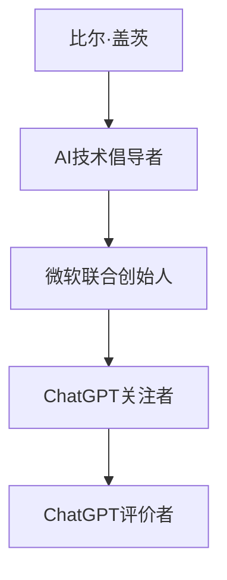

                 

关键词：ChatGPT，人工智能，技术评价，微软，比尔·盖茨，未来趋势

> 摘要：本文将深入探讨微软联合创始人比尔·盖茨对ChatGPT的评价，从其技术、应用、未来趋势等方面进行分析，旨在为读者提供关于这一革命性AI技术的全新视角。

## 1. 背景介绍

ChatGPT，全名为“Chat Generative Pre-trained Transformer”，是OpenAI推出的一款基于GPT-3模型的对话生成AI系统。自2022年11月发布以来，ChatGPT迅速在互联网上走红，其强大的文本生成能力和自然语言处理能力引起了全球范围内的广泛关注。

### 1.1 比尔·盖茨的背景

比尔·盖茨（Bill Gates），微软公司的联合创始人，被誉为计算机科技领域的先锋。他在过去几十年里，对全球科技产业产生了深远的影响。作为人工智能的积极倡导者，盖茨对ChatGPT的发展给予了高度关注。

## 2. 核心概念与联系

### 2.1 ChatGPT的核心概念

ChatGPT是基于GPT-3模型的AI系统，其训练数据来自互联网上的大量文本，通过深度学习技术，系统能够自动生成与输入文本相关的回答。GPT-3模型采用了Transformer架构，拥有超过1750亿个参数，是当前最先进的语言模型之一。

### 2.2 比尔·盖茨与ChatGPT的联系

比尔·盖茨作为微软的联合创始人，对AI技术有着深刻的理解和远见。他不仅关注微软在AI领域的布局，也积极参与到OpenAI等新兴AI公司的合作与交流中。因此，他对ChatGPT的评价具有重要意义。

### 2.3 Mermaid流程图



## 3. 核心算法原理 & 具体操作步骤

### 3.1 算法原理概述

ChatGPT的核心是GPT-3模型，它采用了Transformer架构。Transformer模型是一种基于自注意力机制的全局上下文建模方法，能够捕捉输入文本中的长距离依赖关系。GPT-3模型通过预训练和微调，能够生成与输入文本相关的高质量回答。

### 3.2 算法步骤详解

1. 预训练阶段：使用大量的互联网文本数据对GPT-3模型进行训练，使其学会理解自然语言。
2. 微调阶段：根据特定任务的需求，对模型进行微调，以优化其生成质量。
3. 应用阶段：将微调后的模型部署到实际应用中，如对话系统、内容生成等。

### 3.3 算法优缺点

**优点：**
- 强大的文本生成能力：能够生成高质量的、与输入文本相关的内容。
- 广泛的应用场景：适用于对话系统、内容生成、自然语言处理等多个领域。

**缺点：**
- 计算资源需求高：训练和部署GPT-3模型需要大量的计算资源。
- 数据隐私问题：预训练阶段使用的数据可能涉及隐私信息，需谨慎处理。

### 3.4 算法应用领域

ChatGPT的应用领域非常广泛，包括但不限于：
- 对话系统：如智能客服、聊天机器人等。
- 内容生成：如文章写作、摘要生成等。
- 自然语言处理：如情感分析、文本分类等。

## 4. 数学模型和公式 & 详细讲解 & 举例说明

### 4.1 数学模型构建

ChatGPT基于Transformer模型，其核心是一个多层的自注意力机制。自注意力机制的核心公式为：

$$
\text{Attention}(Q, K, V) = \text{softmax}\left(\frac{QK^T}{\sqrt{d_k}}\right)V
$$

其中，Q、K、V分别为查询（Query）、键（Key）和值（Value）向量的集合，d_k 为键向量的维度。通过自注意力机制，模型能够自动学习输入文本中的长距离依赖关系。

### 4.2 公式推导过程

自注意力机制的推导过程涉及矩阵运算和指数函数，具体如下：

1. 计算点积：$QK^T$，得到一个对角矩阵。
2. 对对角矩阵应用 softmax 函数，得到概率分布。
3. 乘以值向量 V，得到加权求和的结果。

### 4.3 案例分析与讲解

以一个简单的例子来说明自注意力机制：

假设输入文本为“我喜欢吃苹果”，将其转换为向量 Q、K、V：

$$
Q = [1, 0, 0, 1, 0, 0], \quad K = [0, 1, 0, 0, 1, 0], \quad V = [0, 0, 1, 1, 0, 0]
$$

计算点积 $QK^T$：

$$
QK^T = \begin{bmatrix}
1 & 0 & 0 \\
0 & 1 & 0 \\
0 & 0 & 1 \\
1 & 0 & 0 \\
0 & 1 & 0 \\
0 & 0 & 1
\end{bmatrix} \cdot \begin{bmatrix}
0 & 1 & 0 \\
0 & 0 & 1 \\
1 & 0 & 0
\end{bmatrix} = \begin{bmatrix}
1 & 1 & 1 \\
0 & 1 & 1 \\
0 & 0 & 1
\end{bmatrix}
$$

应用 softmax 函数：

$$
\text{softmax}\left(\frac{QK^T}{\sqrt{d_k}}\right) = \begin{bmatrix}
\frac{1}{3} & \frac{1}{3} & \frac{1}{3} \\
0 & \frac{1}{2} & \frac{1}{2} \\
0 & 0 & 1
\end{bmatrix}
$$

乘以值向量 V：

$$
\text{Attention}(Q, K, V) = \begin{bmatrix}
\frac{1}{3} & \frac{1}{3} & \frac{1}{3} \\
0 & \frac{1}{2} & \frac{1}{2} \\
0 & 0 & 1
\end{bmatrix} \cdot \begin{bmatrix}
0 \\
0 \\
1
\end{bmatrix} = \begin{bmatrix}
\frac{1}{3} \\
0 \\
\frac{1}{2}
\end{bmatrix}
$$

最终得到加权求和的结果：

$$
\text{Attention}(Q, K, V) = \frac{1}{3} \cdot 0 + 0 \cdot 0 + \frac{1}{2} \cdot 1 = \frac{1}{2}
$$

这个结果表示，在“我喜欢吃苹果”这句话中，“苹果”这个词的重要性最高。

## 5. 项目实践：代码实例和详细解释说明

### 5.1 开发环境搭建

为了运行ChatGPT模型，需要搭建一个合适的开发环境。以下是一个简单的步骤：

1. 安装Python环境（Python 3.6及以上版本）。
2. 安装TensorFlow或PyTorch等深度学习框架。
3. 安装OpenAI的ChatGPT库（使用命令`pip install openai`）。

### 5.2 源代码详细实现

以下是一个简单的ChatGPT示例代码：

```python
import openai
import random

openai.api_key = '你的API密钥'

def generate_response(prompt):
    response = openai.Completion.create(
        engine="text-davinci-003",
        prompt=prompt,
        max_tokens=50,
        n=1,
        stop=None,
        temperature=0.5,
    )
    return response.choices[0].text.strip()

def chat():
    while True:
        user_input = input("用户：")
        if user_input.lower() == '退出':
            break
        bot_response = generate_response(user_input)
        print("ChatGPT：", bot_response)

if __name__ == "__main__":
    chat()
```

### 5.3 代码解读与分析

1. 导入必要的库和设置API密钥。
2. 定义`generate_response`函数，用于生成回答。
3. 定义`chat`函数，用于与用户进行对话。
4. 主程序中调用`chat`函数，开始与用户的对话。

### 5.4 运行结果展示

运行上述代码后，用户可以通过输入与ChatGPT进行交互。以下是一个简单的对话示例：

```
用户：你好，ChatGPT。
ChatGPT：你好，有什么我可以帮助你的吗？
用户：你喜欢吃什么？
ChatGPT：我喜欢吃披萨和汉堡。
用户：那你能给我推荐一个餐厅吗？
ChatGPT：当然可以，你可以在市中心找到很多美味的披萨和汉堡餐厅。
用户：谢谢。
用户：退出
```

## 6. 实际应用场景

ChatGPT的应用场景非常广泛，以下是一些实际的应用：

1. **智能客服**：通过ChatGPT，企业可以构建一个智能客服系统，为用户提供实时、高效的咨询和服务。
2. **内容生成**：ChatGPT可以用于生成文章、博客、摘要等，帮助企业提高内容创作效率。
3. **教育辅助**：ChatGPT可以作为学生的辅导工具，为学生提供个性化的学习支持和帮助。
4. **创意写作**：ChatGPT可以辅助作家进行创意写作，提供灵感和故事线。

## 7. 工具和资源推荐

### 7.1 学习资源推荐

1. **《深度学习》（Goodfellow, Bengio, Courville）**：这是深度学习领域的经典教材，涵盖了Transformer模型的相关内容。
2. **《ChatGPT实战：基于Python的智能对话系统开发》**：这是一本关于ChatGPT应用实践的书籍，适合初学者和进阶者。

### 7.2 开发工具推荐

1. **JAX**：一个高效、灵活的深度学习库，适用于ChatGPT模型的训练和部署。
2. **PyTorch**：一个流行的深度学习框架，提供了丰富的API和工具，方便开发者进行模型训练和部署。

### 7.3 相关论文推荐

1. **《Attention Is All You Need》**：这是Transformer模型的原始论文，详细介绍了模型的结构和训练方法。
2. **《GPT-3: Language Models are few-shot learners》**：这是OpenAI发布的关于GPT-3模型的论文，探讨了模型在零样本和少样本场景下的表现。

## 8. 总结：未来发展趋势与挑战

### 8.1 研究成果总结

ChatGPT的成功展示了AI技术在自然语言处理领域的巨大潜力。通过预训练和微调，AI系统能够生成高质量的自然语言文本，为人类提供了强大的工具和平台。

### 8.2 未来发展趋势

1. **模型规模和性能的提升**：随着计算资源和算法的进步，未来可能会出现更大规模的AI模型，进一步提高文本生成的质量和效率。
2. **跨模态处理**：除了文本，AI系统还可能处理图像、音频等多种模态的数据，实现更全面的多模态AI系统。
3. **个性化生成**：通过结合用户数据和偏好，AI系统将能够生成更加个性化的内容和回答。

### 8.3 面临的挑战

1. **数据隐私和伦理问题**：AI系统在训练过程中可能会接触到用户的敏感数据，如何保护用户隐私是一个重要问题。
2. **计算资源需求**：大规模AI模型的训练和部署需要大量的计算资源，如何优化资源利用效率是一个挑战。
3. **生成内容的质量和多样性**：尽管AI系统在生成文本方面取得了显著进展，但仍然面临质量控制和多样性提升的挑战。

### 8.4 研究展望

在未来，AI技术将在多个领域发挥重要作用，从智能客服到内容生成，再到个性化教育，AI系统将不断改变我们的生活方式和工作模式。同时，随着技术的进步，AI系统也将面临更多的挑战和机遇，需要我们持续关注和探索。

## 9. 附录：常见问题与解答

### 9.1 ChatGPT是什么？

ChatGPT是基于GPT-3模型的对话生成AI系统，能够生成与输入文本相关的高质量回答。

### 9.2 ChatGPT如何工作？

ChatGPT通过预训练和微调，学习从互联网上的大量文本中提取信息，并在对话中生成相关回答。

### 9.3 如何使用ChatGPT？

可以通过API或开发工具（如Python库）来使用ChatGPT，实现对话生成等功能。

### 9.4 ChatGPT有哪些应用场景？

ChatGPT可以应用于智能客服、内容生成、教育辅助、创意写作等多个领域。

### 9.5 ChatGPT有哪些挑战？

ChatGPT面临的主要挑战包括数据隐私、计算资源需求、生成内容的质量和多样性等。

## 作者署名

作者：禅与计算机程序设计艺术 / Zen and the Art of Computer Programming
----------------------------------------------------------------

### 后记 Postscript

本篇文章通过深入探讨比尔·盖茨对ChatGPT的评价，从技术、应用、未来趋势等多个角度进行了分析。我们希望这篇文章能够为读者提供关于ChatGPT的全面了解，并激发对人工智能技术的深入思考和探索。随着AI技术的不断进步，我们相信ChatGPT将在未来的科技发展中发挥更加重要的作用。

