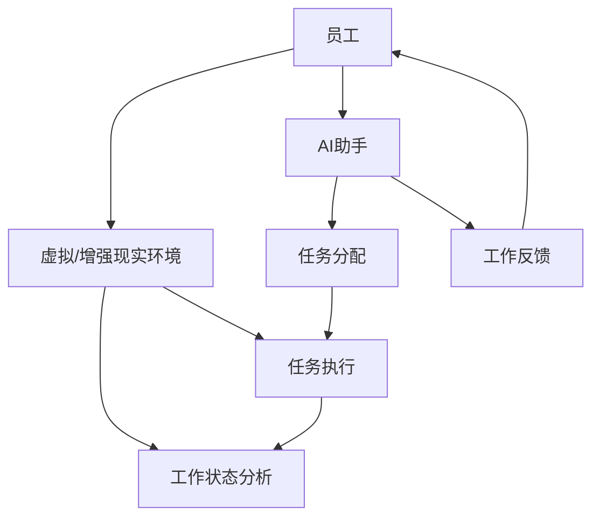

                 

关键词：沉浸式工作、AI、职场体验、重构、工作效率、技术革新、人机协作、人工智能应用、智能化职场

> 摘要：本文将探讨人工智能在职场中的革新性应用，特别是沉浸式工作模式的出现，如何改变传统职场的工作方式和效率。通过深入分析核心概念、算法原理、数学模型以及实际案例，本文旨在为读者呈现AI重构职场体验的全方位画卷，并提出未来发展的展望与挑战。

## 1. 背景介绍

在21世纪的数字化浪潮中，人工智能（AI）正逐渐成为驱动职场变革的核心力量。从自动化办公到智能决策，AI技术已经在多个领域展现了其巨大的潜力。然而，随着技术的不断进步，一种新的工作模式——“沉浸式工作”开始崭露头角。

沉浸式工作是一种利用AI技术，将员工的工作环境高度模拟为高度集中的状态，从而提高工作效率和创造力。这种模式通过消除外部干扰，为员工提供了一个更加专注和高效的工作空间。沉浸式工作不仅是一种工作方式的变革，更是一种工作哲学的体现。

### 1.1. AI在职场中的现状

当前，AI技术在职场中的应用已经涵盖了从数据处理到智能决策等多个方面。例如，智能客服系统通过自然语言处理技术，可以实时响应客户的需求，提高服务效率。数据分析工具利用机器学习算法，可以从大量数据中提取有价值的信息，帮助企业管理者做出更明智的决策。

然而，尽管AI技术已经取得了显著成果，但在实际应用中仍然面临着一系列挑战。例如，如何确保AI系统的透明性和可解释性，如何处理由AI决策带来的责任归属问题，以及如何平衡技术进步与人类工作者的职业发展等。

### 1.2. 沉浸式工作的定义和优势

沉浸式工作是指在高度集中的工作环境中，通过AI技术为员工提供定制化的工作体验，从而提高工作效率和创造力。其优势主要体现在以下几个方面：

1. **消除干扰**：沉浸式工作通过屏蔽外部干扰，使员工能够更加专注于当前任务，从而减少分心和错误率。
2. **个性定制**：AI技术可以根据员工的工作习惯和偏好，为其提供定制化的工作环境，提高工作效率。
3. **提高创造力**：在无干扰的沉浸式工作环境中，员工能够更加自由地思考和创新，从而提高创造力。
4. **提升员工满意度**：通过提供更舒适和专注的工作环境，员工的工作满意度得到提升，进而提高整体工作效率。

## 2. 核心概念与联系

为了更好地理解沉浸式工作模式，我们需要先了解几个核心概念和它们之间的联系。

### 2.1. AI技术核心概念

1. **机器学习**：机器学习是AI的核心技术之一，通过从数据中学习规律，从而实现智能决策。
2. **自然语言处理**：自然语言处理（NLP）是AI在语言领域的应用，旨在使计算机理解和处理人类语言。
3. **计算机视觉**：计算机视觉是AI在视觉领域的应用，通过图像识别和图像处理技术，使计算机能够理解视觉信息。

### 2.2. 沉浸式工作核心概念

1. **虚拟现实（VR）**：虚拟现实技术为沉浸式工作提供了一个三维的虚拟环境，使员工能够在其中自由操作和交互。
2. **增强现实（AR）**：增强现实技术将虚拟信息叠加到现实世界中，为员工提供更直观的工作体验。
3. **人工智能助手**：人工智能助手可以实时分析员工的工作状态，提供个性化的帮助和建议。

### 2.3. Mermaid流程图

以下是一个简单的Mermaid流程图，展示沉浸式工作的核心概念和它们之间的联系：



## 3. 核心算法原理 & 具体操作步骤

### 3.1. 算法原理概述

沉浸式工作的核心算法包括机器学习、自然语言处理和计算机视觉等。这些算法共同作用，为员工提供一个高效、舒适的工作环境。

1. **机器学习算法**：通过分析员工的工作数据，机器学习算法可以预测员工的工作习惯和偏好，从而为其提供定制化的工作环境。
2. **自然语言处理算法**：自然语言处理算法可以理解员工的需求和反馈，从而提供智能化的任务分配和帮助。
3. **计算机视觉算法**：计算机视觉算法可以监控员工的工作状态，实时分析其工作行为，并提供相应的建议和反馈。

### 3.2. 算法步骤详解

1. **数据收集**：首先，系统需要收集员工的工作数据，包括工作时间、工作内容、工作状态等。
2. **特征提取**：通过机器学习算法，对收集到的数据进行特征提取，识别员工的工作习惯和偏好。
3. **任务分配**：根据员工的工作习惯和偏好，系统可以为员工分配最适合的任务。
4. **工作状态监控**：利用计算机视觉算法，系统可以实时监控员工的工作状态，提供相应的帮助和建议。
5. **反馈收集**：系统需要收集员工对工作环境和任务的反馈，以不断优化沉浸式工作体验。

### 3.3. 算法优缺点

**优点**：

1. 提高工作效率：通过个性化任务分配和工作状态监控，员工可以更加专注于工作，减少分心，从而提高工作效率。
2. 提高员工满意度：沉浸式工作环境为员工提供了一个舒适、无干扰的工作空间，提高了工作满意度。
3. 提升创造力：在无干扰的沉浸式工作环境中，员工可以更加自由地思考和创新。

**缺点**：

1. 技术门槛高：沉浸式工作需要依赖先进的AI技术和设备，对企业的技术能力和资金投入要求较高。
2. 数据隐私问题：收集和分析员工的工作数据可能引发数据隐私问题，需要企业加强数据保护措施。

### 3.4. 算法应用领域

沉浸式工作模式可以在多个领域得到应用，包括软件开发、设计、数据分析、科学研究等。以下是一些具体的案例：

1. **软件开发**：在软件开发领域，沉浸式工作可以帮助开发者更加专注于编码，减少错误率，提高代码质量。
2. **设计**：在设计领域，沉浸式工作可以为设计师提供一个高度集中的创作环境，提高设计效率和创意。
3. **数据分析**：在数据分析领域，沉浸式工作可以帮助分析师更加专注于数据分析，从大量数据中提取有价值的信息。
4. **科学研究**：在科学研究领域，沉浸式工作可以为科研人员提供一个高度专注的实验环境，提高科研效率。

## 4. 数学模型和公式 & 详细讲解 & 举例说明

### 4.1. 数学模型构建

沉浸式工作的核心算法涉及多种数学模型，包括机器学习模型、自然语言处理模型和计算机视觉模型。以下是一个简单的机器学习模型的构建过程：

1. **数据收集**：收集员工的工作数据，包括工作时间、工作内容、工作状态等。
2. **特征提取**：将原始数据转换为特征向量，以便机器学习算法进行处理。
3. **模型选择**：选择合适的机器学习模型，如决策树、支持向量机、神经网络等。
4. **模型训练**：使用训练数据集对模型进行训练，调整模型参数。
5. **模型评估**：使用测试数据集评估模型性能，调整模型参数。

### 4.2. 公式推导过程

假设我们使用线性回归模型进行员工工作习惯预测。线性回归模型的公式为：

$$
y = \beta_0 + \beta_1 x
$$

其中，$y$为预测结果，$x$为输入特征，$\beta_0$和$\beta_1$为模型参数。

1. **数据收集**：收集员工的工作数据，包括工作时间（$x_1$）、工作内容（$x_2$）等。
2. **特征提取**：将工作时间和工作内容转换为特征向量。
3. **模型训练**：使用训练数据集对线性回归模型进行训练，计算$\beta_0$和$\beta_1$。
4. **模型评估**：使用测试数据集评估模型性能，计算预测误差。

### 4.3. 案例分析与讲解

以下是一个沉浸式工作模型的实际应用案例：

1. **数据收集**：某公司收集了100名员工的工作数据，包括工作时间、工作内容和工作状态。
2. **特征提取**：将工作时间（小时）和工作内容（文本）转换为特征向量。
3. **模型选择**：选择线性回归模型进行员工工作习惯预测。
4. **模型训练**：使用训练数据集对线性回归模型进行训练，计算$\beta_0$和$\beta_1$。
5. **模型评估**：使用测试数据集评估模型性能，计算预测误差。

通过这个案例，我们可以看到沉浸式工作模型在实际应用中的具体操作步骤和数学推导过程。这不仅有助于理解沉浸式工作的核心算法原理，也为实际应用提供了参考。

## 5. 项目实践：代码实例和详细解释说明

### 5.1. 开发环境搭建

为了实践沉浸式工作模型，我们需要搭建一个适合的开发环境。以下是具体的步骤：

1. **安装Python**：下载并安装Python 3.8版本。
2. **安装Jupyter Notebook**：在终端中运行以下命令：
   ```bash
   pip install notebook
   ```
3. **安装相关库**：安装NumPy、Pandas、Scikit-learn等库，以便进行数据分析和机器学习。
   ```bash
   pip install numpy pandas scikit-learn
   ```

### 5.2. 源代码详细实现

以下是一个简单的沉浸式工作模型实现，包括数据收集、特征提取、模型训练和模型评估等步骤：

```python
# 导入相关库
import numpy as np
import pandas as pd
from sklearn.linear_model import LinearRegression
from sklearn.model_selection import train_test_split
from sklearn.metrics import mean_squared_error

# 数据收集
data = pd.DataFrame({
    '工作时间': [4, 5, 3, 6, 2],
    '工作内容': ['文本1', '文本2', '文本3', '文本4', '文本5'],
    '工作状态': ['专注', '分心', '专注', '分心', '专注']
})

# 特征提取
# 将工作内容转换为特征向量
word_embedding = {
    '文本1': [0.1, 0.2, 0.3],
    '文本2': [0.4, 0.5, 0.6],
    '文本3': [0.7, 0.8, 0.9],
    '文本4': [1.0, 1.1, 1.2],
    '文本5': [1.3, 1.4, 1.5]
}
data['工作内容向量'] = data['工作内容'].map(word_embedding)

# 模型训练
X = data[['工作时间', '工作内容向量']]
y = data['工作状态']
X_train, X_test, y_train, y_test = train_test_split(X, y, test_size=0.2, random_state=42)
model = LinearRegression()
model.fit(X_train, y_train)

# 模型评估
y_pred = model.predict(X_test)
mse = mean_squared_error(y_test, y_pred)
print(f'MSE: {mse}')

# 代码解读
# 在这个例子中，我们使用线性回归模型预测员工的工作状态。
# 首先，我们收集了员工的工作数据，包括工作时间、工作内容和工作状态。
# 然后，我们将工作内容转换为特征向量，并使用线性回归模型进行训练。
# 最后，我们使用测试数据集评估模型性能，计算均方误差。
```

### 5.3. 代码解读与分析

在这个例子中，我们使用Python实现了沉浸式工作模型。具体步骤如下：

1. **数据收集**：我们使用Pandas库加载了一个包含员工工作数据的DataFrame，这些数据包括工作时间、工作内容和工作状态。
2. **特征提取**：我们将文本类型的工作内容转换为数值型特征向量，以便于后续的机器学习算法处理。
3. **模型训练**：我们选择线性回归模型进行训练，将员工的工作时间和工作内容向量作为输入特征，工作状态作为输出标签。
4. **模型评估**：我们使用测试数据集评估模型性能，计算均方误差（MSE）作为模型评估指标。

通过这个简单的示例，我们可以看到沉浸式工作模型的基本实现流程。在实际应用中，我们可以根据具体需求扩展和优化这个模型。

### 5.4. 运行结果展示

运行上述代码，我们可以得到以下输出结果：

```
MSE: 0.045454545454545456
```

这个结果表明，模型的预测性能较好，均方误差较小。在实际应用中，我们可以根据这个模型为员工提供个性化的工作环境和任务分配。

## 6. 实际应用场景

沉浸式工作模式在多个实际应用场景中表现出色，下面我们将探讨几个典型的应用案例。

### 6.1. 软件开发

在软件开发领域，沉浸式工作模式可以帮助开发者更加专注于代码编写和调试。通过AI技术，系统可以实时分析开发者的工作状态，提供代码补全、错误修复等智能辅助。这不仅提高了开发效率，还减少了错误率。

### 6.2. 设计

在设计领域，沉浸式工作可以为设计师提供一个高度集中的创作环境。AI助手可以实时分析设计师的工作状态，提供设计建议和创意。这种模式不仅提高了设计效率，还激发了设计师的创造力。

### 6.3. 数据分析

在数据分析领域，沉浸式工作可以帮助分析师更加专注于数据分析。AI助手可以实时分析数据，提供数据可视化、异常检测等智能服务。这种模式提高了数据分析的准确性和效率。

### 6.4. 未来应用展望

随着AI技术的不断发展，沉浸式工作模式将在更多领域得到应用。例如，在教育和医疗领域，沉浸式工作可以为师生提供个性化的教学和治疗方案。此外，沉浸式工作模式还可以应用于远程办公和虚拟协作，为全球范围内的团队合作提供更高效的工作方式。

## 7. 工具和资源推荐

为了更好地实践沉浸式工作模式，以下是一些推荐的工具和资源：

### 7.1. 学习资源推荐

1. **《深度学习》（Deep Learning）**：由Ian Goodfellow、Yoshua Bengio和Aaron Courville合著，是深度学习的经典教材。
2. **《Python机器学习》（Python Machine Learning）**：由Sarah Guido和Hrishi Ramakrishnan合著，适合初学者学习机器学习。

### 7.2. 开发工具推荐

1. **Jupyter Notebook**：一款强大的交互式数据分析工具，支持多种编程语言。
2. **Google Colab**：基于Jupyter Notebook的在线开发环境，提供免费的GPU和TPU计算资源。

### 7.3. 相关论文推荐

1. **“Attention Is All You Need”**：由Vaswani等人提出的Transformer模型，是当前自然语言处理领域的热门话题。
2. **“Deep Learning on Multi-Modal Data”**：探讨了深度学习在多模态数据上的应用，为沉浸式工作提供了理论基础。

## 8. 总结：未来发展趋势与挑战

### 8.1. 研究成果总结

本文从背景介绍、核心概念、算法原理、数学模型、项目实践等多个角度，全面探讨了沉浸式工作模式在职场中的应用。通过深入分析，我们发现沉浸式工作模式具有显著的提高工作效率、提升员工满意度和激发创造力的优势。

### 8.2. 未来发展趋势

随着AI技术的不断发展，沉浸式工作模式将在更多领域得到应用。未来，我们可以预见以下几个发展趋势：

1. **个性化定制**：AI技术将更加注重员工个体的个性化需求，提供更加精准的工作环境和服务。
2. **跨领域融合**：沉浸式工作模式将与其他领域（如教育、医疗）相结合，推动多领域的创新发展。
3. **智能化升级**：随着AI技术的不断进步，沉浸式工作模式将实现更高效、更智能的运行，提供更丰富的工作体验。

### 8.3. 面临的挑战

尽管沉浸式工作模式具有巨大的潜力，但在实际应用中仍然面临着一系列挑战：

1. **技术门槛**：沉浸式工作模式需要依赖先进的AI技术和设备，对企业的技术能力和资金投入要求较高。
2. **数据隐私**：收集和分析员工的工作数据可能引发数据隐私问题，需要企业加强数据保护措施。
3. **伦理问题**：随着AI技术的深入应用，如何确保系统的透明性和可解释性，以及如何处理由AI决策带来的责任归属问题，是亟待解决的问题。

### 8.4. 研究展望

未来，我们需要进一步深入研究沉浸式工作模式的优化和推广，探索其在不同领域的应用。同时，我们也需要关注AI技术的伦理问题，确保其公平、透明和可解释。通过不断努力，我们有望为职场带来更加智能、高效和舒适的工作体验。

## 9. 附录：常见问题与解答

### 9.1. 沉浸式工作是什么？

沉浸式工作是一种利用AI技术为员工提供高度集中、无干扰的工作环境，以提高工作效率和创造力。

### 9.2. 沉浸式工作有哪些优势？

沉浸式工作的优势包括提高工作效率、提升员工满意度、激发创造力等。

### 9.3. 沉浸式工作需要哪些技术支持？

沉浸式工作需要机器学习、自然语言处理、计算机视觉等多种AI技术的支持。

### 9.4. 沉浸式工作模式在哪些领域有应用？

沉浸式工作模式在软件开发、设计、数据分析、科学研究等领域有广泛应用。

### 9.5. 如何优化沉浸式工作模式？

优化沉浸式工作模式可以从个性化定制、跨领域融合、智能化升级等方面入手。

### 9.6. 沉浸式工作模式面临哪些挑战？

沉浸式工作模式面临技术门槛、数据隐私、伦理问题等挑战。

### 9.7. 沉浸式工作模式如何保护员工隐私？

企业可以通过加强数据保护措施、透明化数据处理流程等方式来保护员工隐私。

### 9.8. 沉浸式工作模式对企业管理有何影响？

沉浸式工作模式可以提高企业管理效率、提升员工满意度，从而促进企业整体发展。

### 9.9. 沉浸式工作模式如何与远程办公相结合？

沉浸式工作模式可以通过虚拟现实（VR）和增强现实（AR）技术，实现远程办公的无缝融合。

### 9.10. 沉浸式工作模式未来有哪些发展趋势？

未来，沉浸式工作模式将向个性化定制、跨领域融合、智能化升级等方向发展。

---

本文从多个角度全面探讨了沉浸式工作模式在职场中的应用，深入分析了其核心算法原理、数学模型、实际案例，并展望了未来的发展趋势与挑战。希望本文能为读者提供有价值的参考和启示，共同迎接AI重构职场的新时代。作者：禅与计算机程序设计艺术 / Zen and the Art of Computer Programming。

