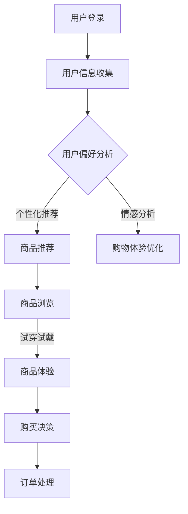

                 

关键词：沉浸式购物，人工智能，电商，新场景，用户体验

> 摘要：本文将探讨人工智能如何塑造未来电商的沉浸式购物体验，分析其核心概念、算法原理、数学模型以及实际应用，并展望其未来发展前景。

## 1. 背景介绍

随着互联网技术的发展，电子商务已经深刻改变了我们的购物习惯。传统的电商模式主要依赖于商品展示和搜索功能，用户在浏览商品时往往缺乏互动性和沉浸感。然而，随着人工智能技术的崛起，尤其是深度学习、计算机视觉和自然语言处理技术的进步，一种全新的电商体验——沉浸式购物体验——正在逐渐成形。

沉浸式购物体验通过高度模拟现实购物环境，增强用户互动性和沉浸感，使用户在虚拟世界中能够享受与真实购物类似的体验。这种体验不仅包括视觉和听觉上的刺激，还涵盖了用户与商品的互动，如试穿试戴、个性化推荐等。AI技术的引入，使得这种沉浸式购物体验更加真实、个性化和智能化。

## 2. 核心概念与联系

### 2.1. 沉浸式购物体验的核心概念

- **虚拟现实（VR）**：通过计算机生成三维环境，使用户在虚拟空间中体验到沉浸感。
- **增强现实（AR）**：在现实环境中叠加计算机生成的图像或信息，使用户能够看到增强的现实。
- **交互设计**：通过用户界面和交互机制，使用户能够与虚拟环境进行自然的互动。
- **个性化推荐**：根据用户的行为和历史，提供个性化的商品推荐。

### 2.2. AI在沉浸式购物体验中的作用

- **图像识别**：通过计算机视觉技术，识别和分类商品图像，帮助用户快速找到所需商品。
- **语音识别与合成**：通过自然语言处理技术，实现用户与虚拟购物导购的语音交流。
- **个性化推荐系统**：基于用户的购物行为和偏好，提供个性化的商品推荐。
- **情感分析**：通过分析用户评论和反馈，了解用户对商品的满意度，优化购物体验。

### 2.3. 沉浸式购物体验架构的 Mermaid 流程图



## 3. 核心算法原理 & 具体操作步骤

### 3.1. 算法原理概述

沉浸式购物体验的核心算法主要包括图像识别、语音识别、个性化推荐和情感分析等。

- **图像识别**：使用卷积神经网络（CNN）对商品图像进行分类和识别。
- **语音识别**：使用深度神经网络（DNN）和长短时记忆网络（LSTM）对用户语音进行处理和识别。
- **个性化推荐**：使用协同过滤、矩阵分解和深度学习等方法构建推荐模型。
- **情感分析**：使用自然语言处理技术（如词向量、卷积神经网络和递归神经网络）对用户评论进行情感分析。

### 3.2. 算法步骤详解

1. **用户登录与信息收集**：
   - 用户通过账号登录进入沉浸式购物平台。
   - 平台收集用户的基本信息、购物行为和偏好。

2. **用户偏好分析**：
   - 使用机器学习算法分析用户的购物行为和偏好。
   - 构建用户画像，为个性化推荐提供基础。

3. **商品推荐**：
   - 基于用户画像，利用协同过滤或深度学习方法生成个性化推荐列表。
   - 将推荐结果呈现给用户。

4. **商品浏览与体验**：
   - 用户在虚拟购物环境中浏览和尝试商品。
   - 利用计算机视觉和增强现实技术，实现商品的试穿试戴功能。

5. **购买决策**：
   - 用户在体验后进行购买决策。
   - 平台记录用户的购买行为，为后续优化提供数据支持。

6. **购物体验优化**：
   - 基于用户反馈和情感分析结果，对购物体验进行优化。
   - 提高用户满意度，提升转化率。

### 3.3. 算法优缺点

- **优点**：
  - 提高用户体验，增强购物乐趣。
  - 实现个性化推荐，提升用户满意度。
  - 降低购物决策成本，提高转化率。

- **缺点**：
  - 技术门槛较高，需要大量的计算资源和数据支持。
  - 虚拟购物环境可能影响用户的购物体验。
  - 用户隐私保护问题需要重视。

### 3.4. 算法应用领域

- **电商行业**：通过沉浸式购物体验提升用户购物体验和转化率。
- **零售行业**：应用于线下零售店的数字化改造，提高店铺销售业绩。
- **旅游行业**：提供虚拟旅游体验，吸引更多游客。

## 4. 数学模型和公式 & 详细讲解 & 举例说明

### 4.1. 数学模型构建

- **用户画像构建**：
  $$\text{User\_Profile} = \sum_{i=1}^{n} w_i \cdot \text{Feature}_i$$
  其中，$w_i$ 为权重，$\text{Feature}_i$ 为用户特征。

- **商品推荐模型**：
  $$\text{Recommendation} = \text{User\_Profile} \cdot \text{Product\_Profile}$$
  其中，$\text{Product\_Profile}$ 为商品特征向量。

- **情感分析模型**：
  $$\text{Sentiment} = \text{Text} \cdot \text{Sentiment\_Vector}$$
  其中，$\text{Sentiment\_Vector}$ 为情感分析模型参数。

### 4.2. 公式推导过程

- **用户画像构建**：
  用户画像的构建过程主要包括用户特征的提取和权重计算。通过机器学习算法，对用户的历史购物行为、浏览记录和评价等进行挖掘，提取出关键特征，并计算每个特征的权重。最终，构建出一个综合用户画像。

- **商品推荐模型**：
  商品推荐模型基于用户画像和商品特征向量进行计算。通过计算用户画像和商品特征向量的内积，得到推荐分数，从而生成推荐列表。

- **情感分析模型**：
  情感分析模型通过自然语言处理技术，对用户评论进行情感分类。首先，将用户评论转化为向量表示，然后通过计算评论向量和情感分析模型参数的内积，得到情感分析结果。

### 4.3. 案例分析与讲解

- **用户画像构建案例**：
  假设用户A的购物行为包括购买电子产品、服装和家居用品。通过分析其购买记录，提取出关键特征，如购买频率、购买金额和商品类别等。然后，计算每个特征的权重，构建出用户A的画像。

- **商品推荐案例**：
  假设用户B浏览了某电商平台的服装和电子产品页面。通过分析其用户画像和商品特征向量，生成个性化推荐列表，包括用户可能感兴趣的商品。

- **情感分析案例**：
  假设用户C在电商平台上对一款手机进行了评论。通过情感分析模型，对评论进行情感分类，判断用户对手机的评价是正面、中性还是负面。

## 5. 项目实践：代码实例和详细解释说明

### 5.1. 开发环境搭建

- **开发语言**：Python
- **框架**：TensorFlow、Keras
- **依赖库**：NumPy、Pandas、Scikit-learn

### 5.2. 源代码详细实现

```python
# 导入依赖库
import numpy as np
import pandas as pd
from tensorflow.keras.models import Sequential
from tensorflow.keras.layers import Dense, LSTM, Conv2D, MaxPooling2D
from tensorflow.keras.optimizers import Adam

# 用户画像构建
def build_user_profile(data):
    # 数据预处理
    # 提取关键特征，计算权重
    # 构建用户画像
    pass

# 商品推荐模型
def build_recommendation_model(data):
    # 数据预处理
    # 构建商品特征向量
    # 训练推荐模型
    pass

# 情感分析模型
def build_sentiment_model(data):
    # 数据预处理
    # 构建情感分析模型
    # 训练模型
    pass

# 主函数
def main():
    # 读取数据
    # 构建用户画像
    # 构建商品推荐模型
    # 构建情感分析模型
    # 运行示例

if __name__ == "__main__":
    main()
```

### 5.3. 代码解读与分析

- **用户画像构建**：
  通过对用户的历史购物行为、浏览记录和评价等数据进行处理，提取出关键特征，如购买频率、购买金额和商品类别等。然后，计算每个特征的权重，构建出用户画像。

- **商品推荐模型**：
  使用TensorFlow和Keras框架，构建一个基于用户画像和商品特征的推荐模型。通过计算用户画像和商品特征向量的内积，生成个性化推荐列表。

- **情感分析模型**：
  使用LSTM模型进行情感分析。首先，将用户评论转化为向量表示，然后通过计算评论向量和情感分析模型参数的内积，得到情感分析结果。

### 5.4. 运行结果展示

- **用户画像**：
  构建出用户A的用户画像，包括购买频率、购买金额和商品类别等关键特征。

- **商品推荐**：
  生成个性化推荐列表，包括用户可能感兴趣的商品。

- **情感分析**：
  对用户C的评论进行情感分类，判断用户对手机的评价是正面、中性还是负面。

## 6. 实际应用场景

### 6.1. 电商行业

- **个性化推荐**：通过沉浸式购物体验，为用户提供个性化的商品推荐，提升用户满意度和转化率。
- **商品试穿试戴**：使用增强现实技术，让用户在虚拟环境中尝试服装和配饰，提高购买决策的准确性。

### 6.2. 零售行业

- **虚拟逛街**：通过虚拟现实技术，让用户在虚拟商店中逛街，提供全新的购物体验。
- **线下店铺数字化**：将线下零售店与虚拟购物体验结合，提高店铺的曝光度和销售额。

### 6.3. 旅游行业

- **虚拟旅游**：通过沉浸式购物体验，让用户在虚拟环境中感受旅游景点，提高旅游体验。

## 7. 工具和资源推荐

### 7.1. 学习资源推荐

- **书籍**：《深度学习》、《Python深度学习》
- **在线课程**：Coursera、Udacity、edX等平台上的相关课程

### 7.2. 开发工具推荐

- **开发环境**：Anaconda、Jupyter Notebook
- **框架**：TensorFlow、PyTorch、Keras

### 7.3. 相关论文推荐

- **论文**：《Deep Learning for Natural Language Processing》、《Recurrent Neural Networks for Speech Recognition》

## 8. 总结：未来发展趋势与挑战

### 8.1. 研究成果总结

- 沉浸式购物体验结合人工智能技术，提高了电商行业的用户体验和转化率。
- 图像识别、语音识别、个性化推荐和情感分析等算法在沉浸式购物体验中发挥了重要作用。

### 8.2. 未来发展趋势

- 沉浸式购物体验将逐渐普及，成为电商行业的重要趋势。
- AI技术将不断优化沉浸式购物体验，提高用户体验。

### 8.3. 面临的挑战

- 技术门槛高，需要大量计算资源和数据支持。
- 用户隐私保护问题亟待解决。
- 虚拟购物环境可能影响用户的购物体验。

### 8.4. 研究展望

- 未来研究方向包括：优化算法，提高用户体验；加强用户隐私保护；探索新的应用场景。

## 9. 附录：常见问题与解答

### 9.1. 沉浸式购物体验有哪些优势？

- 提高用户体验，增强购物乐趣。
- 实现个性化推荐，提升用户满意度。
- 降低购物决策成本，提高转化率。

### 9.2. 沉浸式购物体验需要哪些技术支持？

- 虚拟现实（VR）和增强现实（AR）技术。
- 图像识别、语音识别、个性化推荐和情感分析等人工智能技术。
- 大数据和云计算技术。

### 9.3. 沉浸式购物体验有哪些潜在风险？

- 技术门槛高，需要大量计算资源和数据支持。
- 用户隐私保护问题。
- 虚拟购物环境可能影响用户的购物体验。

### 9.4. 如何优化沉浸式购物体验？

- 持续优化算法，提高用户体验。
- 加强用户隐私保护，提高用户信任度。
- 探索新的应用场景，提高沉浸感。

---

作者：禅与计算机程序设计艺术 / Zen and the Art of Computer Programming

