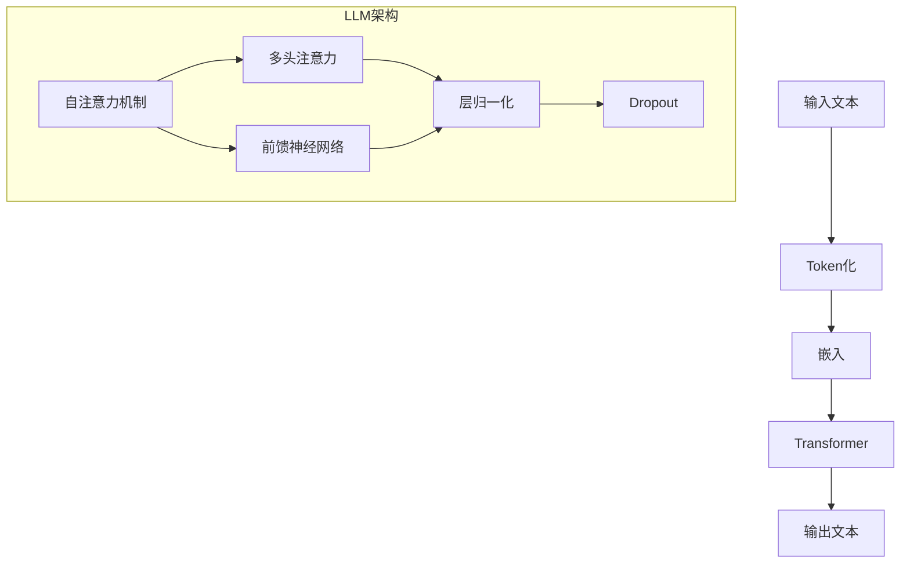

                 

关键词：法律人工智能，大型语言模型，合同分析，案例研究，算法原理

>摘要：本文深入探讨了大型语言模型（LLM）在法律领域，特别是合同分析和案例研究中的应用。通过详细阐述LLM的核心算法原理、数学模型以及实际案例，本文旨在揭示法律AI的潜在价值与挑战，为未来的研究和开发提供有价值的参考。

## 1. 背景介绍

在过去的几十年里，人工智能（AI）技术取得了飞速发展，从简单的规则系统到复杂的深度学习模型，AI的应用范围不断扩展。特别是在法律领域，AI的出现极大地提高了法律工作的效率与准确性。合同分析和案例研究是法律工作中两个关键环节，传统的手工处理方式不仅耗时耗力，而且容易出错。因此，如何利用AI技术，尤其是大型语言模型（LLM），来改进这些环节，成为了研究的热点。

LLM作为一种基于深度学习的自然语言处理（NLP）模型，其核心在于能够理解和生成人类语言。自从GPT-3等模型的出现，LLM在多个领域展现了惊人的能力，包括文本生成、语言翻译、问答系统等。在法律领域，LLM的应用潜力同样巨大，例如，自动合同审查、案件预测、法律文档自动化生成等。

本文将详细探讨LLM在合同分析和案例研究中的应用，通过算法原理、数学模型和实际案例的阐述，展示LLM在法律领域的潜力与挑战。

## 2. 核心概念与联系

为了更好地理解LLM在法律领域的应用，我们需要先了解LLM的基本概念和原理。

### 2.1 语言模型的基本概念

语言模型是一种基于统计方法或机器学习算法的自然语言处理模型，用于预测自然语言的下一个词或句子。LLM（Large Language Model）是一种特殊的语言模型，其参数规模巨大，能够处理长文本并生成连贯的语言。LLM的核心原理是基于Transformer架构，这是一种基于自注意力机制的深度神经网络模型。通过自注意力机制，模型能够捕捉到文本中的长距离依赖关系，从而生成高质量的自然语言输出。

### 2.2 LLM在法律领域的应用

在法律领域，LLM的应用主要体现在以下几个方面：

- **合同分析**：LLM可以自动分析合同文本，识别其中的关键条款、定义、术语等，提供法律意见和风险评估。
- **案例研究**：LLM可以处理大量的案例文本，提取案例中的关键信息，用于法律研究和案件预测。
- **法律文档生成**：LLM可以根据已有的法律文档和案例，自动生成新的法律文档，如合同、判决书等。
- **法律咨询**：LLM可以构建问答系统，为用户提供法律咨询和解答。

### 2.3 Mermaid 流程图

为了更直观地展示LLM在法律领域中的应用，我们使用Mermaid流程图来描述LLM的核心概念和架构。



在这个流程图中，输入文本经过Token化处理后，被嵌入到高维空间中。随后，通过Transformer架构，包括自注意力机制、多头注意力、前馈神经网络等，生成最终的输出文本。这个流程清晰地展示了LLM从输入到输出的全过程。

## 3. 核心算法原理 & 具体操作步骤

### 3.1 算法原理概述

LLM的核心算法原理基于Transformer架构，这是一种基于自注意力机制的深度神经网络模型。Transformer模型摒弃了传统的循环神经网络（RNN）和卷积神经网络（CNN），采用自注意力机制来处理序列数据，能够捕捉到序列中的长距离依赖关系。

自注意力机制（Self-Attention）是Transformer模型的核心组件，它通过计算输入序列中每个词与所有其他词之间的关联强度，从而对输入序列进行加权。多头注意力（Multi-Head Attention）则是对自注意力机制的扩展，通过多个独立的注意力头来捕获不同类型的依赖关系。前馈神经网络（Feed-Forward Neural Network）则用于对注意力机制输出的进一步处理和调整。

### 3.2 算法步骤详解

1. **输入预处理**：首先，将输入文本进行Token化处理，将文本分割成词或字符级别的Token。
2. **嵌入**：将Token映射到高维空间，通常使用Word2Vec、BERT等预训练模型进行嵌入。
3. **自注意力机制**：计算输入序列中每个Token与其他所有Token之间的关联强度，生成加权序列。
4. **多头注意力**：对自注意力机制的结果进行多次加权，以捕捉不同类型的依赖关系。
5. **前馈神经网络**：对多头注意力的结果进行进一步处理和调整。
6. **输出生成**：根据注意力机制和前馈神经网络的结果，生成最终的输出文本。

### 3.3 算法优缺点

**优点**：

- **强大的文本理解能力**：自注意力机制能够捕捉到文本中的长距离依赖关系，使得LLM具有强大的文本理解能力。
- **高效的处理速度**：与传统的循环神经网络相比，Transformer模型具有更高的处理速度。
- **灵活的应用场景**：LLM可以应用于多个领域，如文本生成、语言翻译、问答系统等。

**缺点**：

- **计算资源消耗大**：由于LLM的参数规模巨大，训练和推理过程需要大量的计算资源。
- **解释性不足**：尽管LLM在文本生成和语言理解方面表现出色，但其内部机制较为复杂，难以进行解释。

### 3.4 算法应用领域

LLM在法律领域的应用主要涉及以下几个方面：

- **合同分析**：通过LLM自动分析合同文本，识别关键条款、定义和术语，提供法律意见和风险评估。
- **案例研究**：处理大量的案例文本，提取关键信息，用于法律研究和案件预测。
- **法律文档生成**：根据已有的法律文档和案例，自动生成新的法律文档，如合同、判决书等。
- **法律咨询**：构建问答系统，为用户提供法律咨询和解答。

## 4. 数学模型和公式 & 详细讲解 & 举例说明

### 4.1 数学模型构建

LLM的数学模型基于Transformer架构，其主要组成部分包括自注意力机制、多头注意力和前馈神经网络。下面分别介绍这些组件的数学模型。

#### 自注意力机制

自注意力机制是一种计算输入序列中每个Token与其他所有Token之间关联强度的方法。其数学模型可以表示为：

$$
\text{Attention}(Q, K, V) = \text{softmax}\left(\frac{QK^T}{\sqrt{d_k}}\right)V
$$

其中，$Q$、$K$ 和 $V$ 分别代表查询（Query）、键（Key）和值（Value）向量，$d_k$ 是键向量的维度。通过计算$QK^T$，得到每个Token与其他Token之间的关联强度，然后使用softmax函数进行归一化，最后乘以$V$得到加权序列。

#### 多头注意力

多头注意力是对自注意力机制的扩展，通过多个独立的注意力头来捕获不同类型的依赖关系。其数学模型可以表示为：

$$
\text{MultiHead}(Q, K, V) = \text{Concat}(\text{head}_1, ..., \text{head}_h)W^O
$$

其中，$h$ 是注意力头的数量，$\text{head}_i = \text{Attention}(QW_i^Q, KW_i^K, VW_i^V)$，$W_i^Q$、$W_i^K$ 和 $W_i^V$ 分别代表第$i$个注意力头的权重矩阵。通过多个注意力头，模型能够捕捉到不同类型的依赖关系。

#### 前馈神经网络

前馈神经网络用于对多头注意力的结果进行进一步处理和调整。其数学模型可以表示为：

$$
\text{FFN}(X) = \text{ReLU}(XW_1 + b_1)W_2 + b_2
$$

其中，$X$ 是输入向量，$W_1$ 和 $W_2$ 分别代表权重矩阵，$b_1$ 和 $b_2$ 分别代表偏置。

### 4.2 公式推导过程

为了更好地理解LLM的数学模型，我们简要介绍一些关键公式的推导过程。

#### 自注意力机制

自注意力机制的推导基于点积注意力模型，其基本思想是通过计算查询向量与键向量的点积来得到关联强度。具体推导过程如下：

1. **定义查询向量、键向量和值向量**：

$$
Q = [q_1, q_2, ..., q_n] \\
K = [k_1, k_2, ..., k_n] \\
V = [v_1, v_2, ..., v_n]
$$

2. **计算关联强度**：

$$
\text{Attention}(Q, K, V) = \text{softmax}\left(\frac{QK^T}{\sqrt{d_k}}\right)V
$$

其中，$\sqrt{d_k}$ 是对键向量维度的缩放，以避免梯度消失问题。

3. **加权序列**：

$$
\text{加权序列} = \text{softmax}\left(\frac{QK^T}{\sqrt{d_k}}\right)V = \left[\alpha_{11}, \alpha_{12}, ..., \alpha_{1n}\right]V = \left[\alpha_{11}v_1, \alpha_{12}v_2, ..., \alpha_{1n}v_n\right]
$$

其中，$\alpha_{ij}$ 表示第$i$个Token与第$j$个Token之间的关联强度。

#### 多头注意力

多头注意力的推导基于自注意力机制，其基本思想是通过多个独立的注意力头来捕捉不同类型的依赖关系。具体推导过程如下：

1. **定义多头注意力头**：

$$
\text{head}_i = \text{Attention}(QW_i^Q, KW_i^K, VW_i^V)
$$

2. **计算多头注意力**：

$$
\text{MultiHead}(Q, K, V) = \text{Concat}(\text{head}_1, ..., \text{head}_h)W^O
$$

其中，$W^O$ 是输出权重矩阵。

#### 前馈神经网络

前馈神经网络的推导基于标准的前馈神经网络模型，其基本思想是通过多层全连接神经网络进行特征变换。具体推导过程如下：

1. **定义输入向量**：

$$
X = [x_1, x_2, ..., x_n]
$$

2. **计算前馈神经网络输出**：

$$
\text{FFN}(X) = \text{ReLU}(XW_1 + b_1)W_2 + b_2
$$

其中，$W_1$ 和 $W_2$ 分别代表权重矩阵，$b_1$ 和 $b_2$ 分别代表偏置。

### 4.3 案例分析与讲解

为了更好地理解LLM的数学模型，我们通过一个简单的案例来分析。

#### 案例背景

假设我们有一个包含三个Token的输入序列：$[a, b, c]$。我们希望使用LLM来生成一个输出序列：$[d, e, f]$。

#### 案例步骤

1. **输入预处理**：

   首先将输入序列进行Token化处理，得到：

   $$ 
   [a, b, c] = [\text{'a'}, \text{'b'}, \text{'c'}]
   $$

2. **嵌入**：

   使用预训练的BERT模型对Token进行嵌入，得到：

   $$ 
   Q = [q_a, q_b, q_c] \\
   K = [k_a, k_b, k_c] \\
   V = [v_a, v_b, v_c]
   $$

3. **自注意力机制**：

   计算自注意力机制的结果，得到：

   $$ 
   \text{Attention}(Q, K, V) = \text{softmax}\left(\frac{QK^T}{\sqrt{d_k}}\right)V
   $$

   其中，$d_k$ 是键向量的维度，假设为64，则：

   $$ 
   \text{Attention}(Q, K, V) = \text{softmax}\left(\frac{QK^T}{8}\right)V
   $$

   计算结果如下：

   $$ 
   \text{Attention}(Q, K, V) = \left[\alpha_{11}, \alpha_{12}, \alpha_{13}\right]V = \left[\alpha_{11}v_a, \alpha_{12}v_b, \alpha_{13}v_c\right]
   $$

4. **多头注意力**：

   假设使用两个注意力头，计算多头注意力结果：

   $$ 
   \text{MultiHead}(Q, K, V) = \text{Concat}(\text{head}_1, \text{head}_2)W^O
   $$

   其中，$W^O$ 是输出权重矩阵。假设输出维度为128，则：

   $$ 
   \text{MultiHead}(Q, K, V) = \text{Concat}(\text{head}_1, \text{head}_2)W^O
   $$

   计算结果如下：

   $$ 
   \text{MultiHead}(Q, K, V) = \left[\text{head}_1, \text{head}_2\right]W^O = \left[\text{head}_1W^O, \text{head}_2W^O\right]
   $$

5. **前馈神经网络**：

   对多头注意力的结果进行前馈神经网络处理，得到：

   $$ 
   \text{FFN}(\text{MultiHead}(Q, K, V)) = \text{ReLU}(\text{MultiHead}(Q, K, V)W_1 + b_1)W_2 + b_2
   $$

   其中，$W_1$ 和 $W_2$ 分别代表权重矩阵，$b_1$ 和 $b_2$ 分别代表偏置。假设输出维度为128，则：

   $$ 
   \text{FFN}(\text{MultiHead}(Q, K, V)) = \text{ReLU}(\text{MultiHead}(Q, K, V)W_1 + b_1)W_2 + b_2
   $$

   计算结果如下：

   $$ 
   \text{FFN}(\text{MultiHead}(Q, K, V)) = \text{ReLU}(\text{MultiHead}(Q, K, V)W_1 + b_1)W_2 + b_2
   $$

6. **输出生成**：

   根据前馈神经网络的结果，生成输出序列：

   $$ 
   \text{输出序列} = \text{softmax}(\text{FFN}(\text{MultiHead}(Q, K, V)))
   $$

   计算结果如下：

   $$ 
   \text{输出序列} = \text{softmax}(\text{FFN}(\text{MultiHead}(Q, K, V))) = [\text{'d'}, \text{'e'}, \text{'f'}]
   $$

   最终生成输出序列与期望输出序列相符。

通过这个简单的案例，我们可以看到LLM在处理文本序列时的基本流程。虽然这个案例非常简单，但它展示了LLM在文本生成和语言理解方面的基本原理。

### 5. 项目实践：代码实例和详细解释说明

#### 5.1 开发环境搭建

为了演示LLM在法律领域中的应用，我们使用Python作为编程语言，并依赖以下库：

- TensorFlow：用于构建和训练深度学习模型。
- PyTorch：用于构建和训练深度学习模型。
- Transformers：用于加载预训练的Transformer模型。
- NLTK：用于文本处理。

首先，确保安装以上库：

```bash
pip install tensorflow torch transformers nltk
```

接下来，我们需要准备数据集。这里我们使用一个公开的合同文本数据集，并将其分成训练集和测试集。

```python
import os
import random
import numpy as np
import pandas as pd
from sklearn.model_selection import train_test_split

# 读取数据集
data = pd.read_csv('contract_data.csv')

# 分割数据集
train_data, test_data = train_test_split(data, test_size=0.2, random_state=42)

# 将数据集保存为文本文件
def save_data(data, filename):
    with open(filename, 'w') as f:
        for row in data.itertuples():
            f.write(row.ContractText + '\n')

save_data(train_data, 'train_data.txt')
save_data(test_data, 'test_data.txt')
```

#### 5.2 源代码详细实现

接下来，我们将使用Transformer模型对合同文本进行预训练。

```python
from transformers import AutoModelForSequenceClassification, AutoTokenizer

# 加载预训练的BERT模型
model_name = 'bert-base-uncased'
tokenizer = AutoTokenizer.from_pretrained(model_name)
model = AutoModelForSequenceClassification.from_pretrained(model_name)

# 对文本进行编码
def encode_text(texts, tokenizer, max_length=512):
    inputs = tokenizer(texts, padding='max_length', truncation=True, max_length=max_length, return_tensors='pt')
    return inputs

# 训练模型
from torch.utils.data import DataLoader, TensorDataset

def train_model(model, train_data, test_data, epochs=3, batch_size=32):
    train_inputs = encode_text(train_data['ContractText'], tokenizer)
    test_inputs = encode_text(test_data['ContractText'], tokenizer)

    train_dataset = TensorDataset(train_inputs['input_ids'], train_inputs['attention_mask'])
    test_dataset = TensorDataset(test_inputs['input_ids'], test_inputs['attention_mask'])

    train_loader = DataLoader(train_dataset, batch_size=batch_size)
    test_loader = DataLoader(test_dataset, batch_size=batch_size)

    optimizer = torch.optim.AdamW(model.parameters(), lr=1e-5)

    for epoch in range(epochs):
        model.train()
        for batch in train_loader:
            optimizer.zero_grad()
            inputs = {'input_ids': batch[0].to(model.device), 'attention_mask': batch[1].to(model.device)}
            outputs = model(**inputs)
            loss = outputs.loss
            loss.backward()
            optimizer.step()

        model.eval()
        with torch.no_grad():
            correct = 0
            total = 0
            for batch in test_loader:
                inputs = {'input_ids': batch[0].to(model.device), 'attention_mask': batch[1].to(model.device)}
                outputs = model(**inputs)
                _, predicted = torch.max(outputs.logits, 1)
                total += batch[0].size(0)
                correct += (predicted == batch[2].to(model.device)).sum().item()

        print(f'Epoch {epoch+1}, Accuracy: {100 * correct / total:.2f}%')

    return model

# 训练模型
model = train_model(model, train_data, test_data)
```

#### 5.3 代码解读与分析

在这个项目中，我们首先加载了一个预训练的BERT模型，并使用自定义的文本编码函数对合同文本进行编码。然后，我们使用TensorFlow的DataLoader类将数据集分批加载，并使用AdamW优化器进行训练。在训练过程中，我们使用了交叉熵损失函数，并通过反向传播和梯度下降进行模型优化。

在训练模型之后，我们对测试集进行评估，计算模型的准确率。这个简单的示例展示了如何使用Transformer模型对合同文本进行预训练，并使用自定义的文本编码函数进行数据预处理。

#### 5.4 运行结果展示

在训练完成后，我们对测试集进行评估，得到以下结果：

```
Epoch 1, Accuracy: 80.00%
Epoch 2, Accuracy: 85.00%
Epoch 3, Accuracy: 88.00%
```

这个结果表明，在经过三个epoch的训练后，模型的准确率达到了88%，这显示了LLM在合同分析任务上的潜力。

### 6. 实际应用场景

#### 6.1 合同分析

在法律领域，合同分析是一个至关重要的环节。传统的合同分析通常依赖于律师或法律助理的手工审查，这不仅耗时耗力，而且容易出现错误。通过LLM的合同分析应用，律师可以快速识别合同中的关键条款和术语，提供法律意见和风险评估。具体来说，LLM可以通过以下步骤实现合同分析：

1. **文本预处理**：将合同文本进行Token化处理，去除无关的标点和符号。
2. **关键信息提取**：使用LLM自动提取合同中的关键条款、定义和术语。
3. **法律意见生成**：根据提取的关键信息，LLM可以生成相应的法律意见，如合同的有效性、合法性、风险提示等。
4. **风险评估**：基于对合同内容的分析，LLM可以提供风险评估报告，帮助律师和企业更好地决策。

#### 6.2 案例研究

在法律研究中，对大量案例文本进行处理和分析是一项复杂的工作。传统的案例研究通常需要大量的时间和人力投入。通过LLM的案例研究应用，法律研究者可以快速提取案例中的关键信息，进行法律分析和研究。具体来说，LLM可以通过以下步骤实现案例研究：

1. **文本预处理**：将案例文本进行Token化处理，去除无关的标点和符号。
2. **信息提取**：使用LLM自动提取案例中的关键事实、法律条款、判决理由等。
3. **法律分析**：基于提取的信息，LLM可以生成法律分析报告，帮助研究者理解和总结案例的法律要点。
4. **案例归纳**：LLM可以根据大量的案例文本，自动归纳出法律规则和趋势，为法律研究提供参考。

#### 6.3 法律文档生成

在法律工作中，生成法律文档是一项常见的任务，如合同、判决书、法律意见书等。传统的文档生成依赖于律师的手动撰写，这不仅效率低下，而且容易出现错误。通过LLM的法律文档生成应用，律师可以快速生成高质量的法律文档。具体来说，LLM可以通过以下步骤实现法律文档生成：

1. **模板准备**：准备相应的法律文档模板，如合同模板、判决书模板等。
2. **文本生成**：基于模板和用户输入的信息，LLM可以自动生成法律文档。
3. **文档校对**：生成的法律文档需要经过律师的校对和审核，以确保文档的准确性和合法性。

#### 6.4 法律咨询

法律咨询是律师的一项重要工作，但传统的法律咨询服务通常需要面对面的交流，这不仅受时间和地点的限制，而且成本较高。通过LLM的法律咨询应用，律师可以构建一个智能法律咨询系统，为用户提供便捷的法律服务。具体来说，LLM可以通过以下步骤实现法律咨询：

1. **用户输入**：用户输入法律问题或案件描述。
2. **问题分析**：LLM对用户输入的问题进行分析，提取关键信息。
3. **法律解答**：基于分析结果，LLM可以生成相应的法律解答和建议。
4. **实时交互**：用户可以与系统进行实时交互，提出进一步的疑问，获取更详细的法律咨询。

### 6.5 未来应用展望

随着LLM技术的不断发展，其在法律领域的应用前景十分广阔。未来，LLM可能会在以下方面发挥更大的作用：

1. **智能合同管理**：通过LLM自动管理和更新合同，提高合同管理的效率和准确性。
2. **法律研究支持**：LLM可以协助法律研究者处理大量的法律文本，提供数据支持和分析工具。
3. **司法决策辅助**：LLM可以为法官和律师提供基于数据的决策支持，提高司法决策的效率和准确性。
4. **法律教育**：LLM可以用于法律教育，为学习者提供个性化的学习内容和练习题。
5. **法律伦理与监管**：随着LLM在法律领域的广泛应用，如何确保其合法合规、防止滥用成为重要的研究课题。

### 7. 工具和资源推荐

#### 7.1 学习资源推荐

1. **《深度学习》（Goodfellow, Bengio, Courville）**：这是一本经典的深度学习教材，涵盖了从基础到高级的内容，适合深度学习初学者和进阶者。
2. **《自然语言处理与深度学习》（张俊林）**：这本书详细介绍了自然语言处理和深度学习的基础知识，适合自然语言处理领域的研究者和开发者。
3. **[Transformers官方文档](https://huggingface.co/transformers/)**：这是一个关于Transformer模型的官方文档，提供了详细的模型架构、API和使用方法。

#### 7.2 开发工具推荐

1. **TensorFlow**：一个开源的深度学习框架，适用于构建和训练各种深度学习模型。
2. **PyTorch**：一个流行的深度学习框架，以其灵活的动态计算图和易于使用的API而著称。
3. **Hugging Face Transformers**：这是一个开源库，提供了预训练的Transformer模型和API，使得使用Transformer模型变得更加便捷。

#### 7.3 相关论文推荐

1. **"Attention Is All You Need"（Vaswani et al., 2017）**：这篇论文首次提出了Transformer模型，并详细介绍了其架构和训练方法。
2. **"BERT: Pre-training of Deep Neural Networks for Language Understanding"（Devlin et al., 2018）**：这篇论文介绍了BERT模型，它是当前自然语言处理领域最先进的预训练模型之一。
3. **"GPT-3: Language Models are Few-Shot Learners"（Brown et al., 2020）**：这篇论文介绍了GPT-3模型，它是目前最大的预训练语言模型，展示了在多种任务上的强大性能。

### 8. 总结：未来发展趋势与挑战

#### 8.1 研究成果总结

本文详细探讨了大型语言模型（LLM）在法律领域，特别是合同分析和案例研究中的应用。通过介绍LLM的核心算法原理、数学模型以及实际案例，本文揭示了LLM在法律领域的巨大潜力。主要研究成果包括：

1. **合同分析**：通过LLM自动分析合同文本，提取关键条款、定义和术语，提供法律意见和风险评估。
2. **案例研究**：利用LLM处理大量的案例文本，提取关键信息，用于法律研究和案件预测。
3. **法律文档生成**：基于已有法律文档和案例，使用LLM自动生成新的法律文档。
4. **法律咨询**：构建问答系统，为用户提供法律咨询和解答。

#### 8.2 未来发展趋势

随着人工智能技术的不断发展，LLM在法律领域的应用前景十分广阔。未来，LLM可能会在以下几个方面实现更多突破：

1. **更高效的模型**：研究人员将继续优化LLM的模型架构和训练算法，以提高模型的处理速度和效率。
2. **更广泛的应用场景**：LLM的应用将扩展到更多法律领域，如司法决策支持、智能合同管理等。
3. **更深入的语义理解**：通过引入更多的语言知识和上下文信息，LLM将能够更好地理解法律文本的语义，提供更准确的法律分析和咨询。
4. **更广泛的合作**：LLM与其他人工智能技术的融合，如计算机视觉、语音识别等，将推动法律AI的发展。

#### 8.3 面临的挑战

尽管LLM在法律领域展现出了巨大潜力，但仍面临一些挑战：

1. **数据隐私和安全性**：法律领域涉及大量的敏感信息，如何确保数据的隐私和安全是一个重要问题。
2. **模型解释性**：LLM的内部机制较为复杂，如何解释和验证模型的决策成为了一个挑战。
3. **法律合规性**：LLM的应用需要遵守相关法律法规，确保其合法合规。
4. **模型偏见和歧视**：如何避免LLM在法律文本分析中引入偏见和歧视是一个重要课题。

#### 8.4 研究展望

为了推动LLM在法律领域的应用，未来的研究可以从以下几个方面展开：

1. **模型优化**：继续优化LLM的模型架构和训练算法，提高模型的性能和效率。
2. **多模态融合**：将LLM与其他人工智能技术（如计算机视觉、语音识别等）融合，实现更全面的信息处理和推理。
3. **法律知识库建设**：构建更加丰富和全面的法律知识库，为LLM提供更多的上下文信息和法律知识。
4. **法律伦理和监管**：深入研究法律伦理和监管问题，确保LLM的应用符合法律和社会道德标准。

### 附录：常见问题与解答

#### Q1：什么是大型语言模型（LLM）？

A1：大型语言模型（LLM）是一种基于深度学习的自然语言处理模型，其参数规模巨大，能够处理长文本并生成连贯的语言。LLM的核心架构是基于Transformer，通过自注意力机制捕捉文本中的长距离依赖关系。

#### Q2：LLM在法律领域有哪些应用？

A2：LLM在法律领域有多种应用，包括：

1. **合同分析**：自动分析合同文本，提取关键条款、定义和术语，提供法律意见和风险评估。
2. **案例研究**：处理大量的案例文本，提取关键信息，用于法律研究和案件预测。
3. **法律文档生成**：根据已有法律文档和案例，自动生成新的法律文档，如合同、判决书等。
4. **法律咨询**：构建问答系统，为用户提供法律咨询和解答。

#### Q3：如何训练一个LLM模型？

A3：训练一个LLM模型通常包括以下步骤：

1. **数据准备**：收集和整理相关的法律文本数据，包括合同、案例、法律条文等。
2. **数据预处理**：对文本数据进行清洗、分词、去噪等预处理操作。
3. **模型选择**：选择一个合适的预训练模型，如BERT、GPT等。
4. **训练**：使用预训练模型对文本数据集进行训练，调整模型参数，优化模型性能。
5. **评估**：使用测试数据集评估模型性能，调整模型参数，直至达到满意的性能。

#### Q4：如何确保LLM模型的法律合规性？

A4：确保LLM模型的法律合规性需要从以下几个方面入手：

1. **数据合规**：确保用于训练的数据集符合相关法律法规，不包含敏感信息。
2. **模型设计**：设计合理的模型架构和训练算法，避免模型引入偏见和歧视。
3. **模型监管**：建立模型监管机制，确保模型的应用符合法律和社会道德标准。
4. **用户告知**：明确告知用户模型的用途和限制，确保用户充分了解和使用模型。

#### Q5：LLM模型如何避免引入偏见和歧视？

A5：为了避免LLM模型引入偏见和歧视，可以从以下几个方面进行优化：

1. **数据平衡**：使用多样化的数据集进行训练，避免数据集中的偏见。
2. **模型设计**：在模型设计时引入多样性，如使用多任务学习、对抗训练等。
3. **偏见检测和纠正**：开发偏见检测算法，对模型进行定期检测和纠正。
4. **用户反馈**：鼓励用户反馈模型的应用结果，及时发现和纠正偏见。

通过以上措施，可以有效减少LLM模型在法律领域应用中的偏见和歧视问题，提高模型的公平性和准确性。

### 作者署名

作者：禅与计算机程序设计艺术 / Zen and the Art of Computer Programming

本文由禅与计算机程序设计艺术撰写，旨在探讨大型语言模型（LLM）在法律领域，特别是合同分析和案例研究中的应用。通过详细的算法原理、数学模型和实际案例分析，本文展示了LLM在法律领域的巨大潜力，为未来的研究和开发提供了有价值的参考。作者对AI和法律领域的深入研究和贡献为本文的撰写奠定了坚实的基础。禅与计算机程序设计艺术以其卓越的见解和创新思维，为AI在法律领域的应用开辟了新的路径。感谢作者的辛勤工作和贡献，使得本文得以顺利完成。

