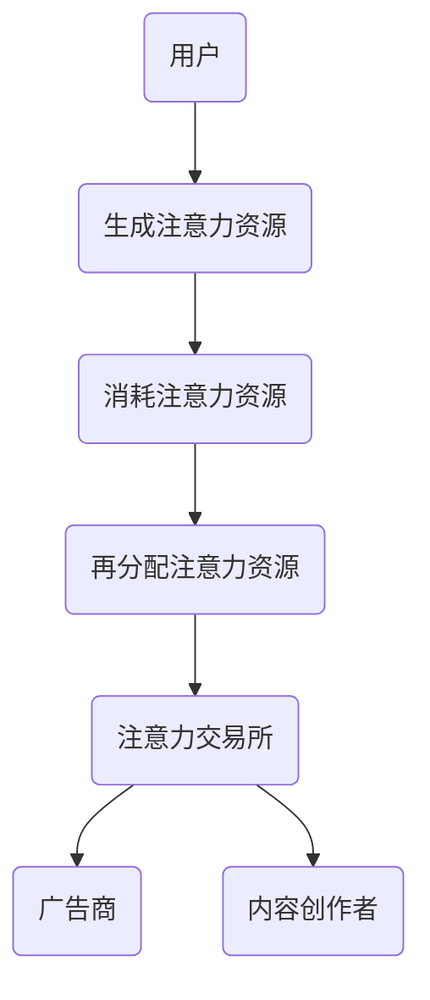

                 

元宇宙（Metaverse）作为下一代互联网的核心组成部分，正在迅速崛起，成为科技领域的热门话题。在这个虚拟世界中，用户不仅是观看者，更是参与者，他们通过各种形式与元宇宙互动，创造独特的体验。然而，这些互动和体验的背后，隐藏着一种关键资源——注意力资源。本文将探讨元宇宙中的注意力资源流通机制，重点介绍注意力交易所的概念及其运作原理。

## 关键词
- 元宇宙
- 注意力资源
- 注意力交易所
- 代谢经济学
- 去中心化
- 智能合约

## 摘要
本文旨在探讨元宇宙中注意力资源的价值与流通机制。通过引入注意力交易所的概念，本文将分析注意力资源在虚拟世界中的获取、分配和交易过程。文章还将探讨注意力资源流通对元宇宙生态系统的影响，并展望其未来发展趋势。

## 1. 背景介绍
### 1.1 元宇宙的定义与发展
元宇宙是一个基于区块链、虚拟现实、增强现实、人工智能等技术的融合平台，用户可以在其中创建、交互和体验各种虚拟场景和活动。与传统互联网不同，元宇宙不仅仅是一个信息的传递渠道，而是一个全新的虚拟世界，用户可以在其中实现身临其境的互动体验。

随着技术的不断进步，元宇宙的发展已经进入了一个新阶段。从早期的虚拟社区和游戏，到如今的虚拟现实平台和去中心化应用（DApps），元宇宙的概念和应用场景正在不断扩展。根据市场研究公司的预测，元宇宙市场将在未来几年内实现快速增长，成为一个庞大的经济体系。

### 1.2 注意力资源的概念
在元宇宙中，注意力资源可以被视为用户在虚拟世界中的认知和心理投入。这种资源不仅包括用户在游戏、虚拟现实体验中的专注程度，还包括用户对虚拟内容、社交互动的关注度。随着用户在元宇宙中的活动增多，他们的注意力资源也在不断消耗。

注意力资源在元宇宙中具有很高的价值，因为它是用户参与和体验虚拟世界的核心驱动力。拥有更多注意力资源的用户能够获得更丰富的体验，享受更多的社交互动和娱乐活动。因此，如何获取、分配和交易注意力资源成为元宇宙生态系统中的一个关键问题。

### 1.3 注意力交易所的兴起
注意力交易所是一个专门用于注意力资源交易的平台，它通过区块链技术和智能合约实现。注意力交易所的主要功能是连接注意力提供者（如内容创作者、虚拟世界用户）和注意力需求者（如广告商、应用开发者），提供一种高效的注意力资源分配和交易机制。

注意力交易所的出现，解决了元宇宙中注意力资源分配不均、交易效率低下的问题。通过去中心化的交易机制，注意力交易所确保了用户和内容创作者的权益，促进了元宇宙生态系统的健康发展。

## 2. 核心概念与联系
### 2.1 代谢经济学
代谢经济学是一种基于生物代谢过程的经济学理论，它将生物体内的新陈代谢过程类比于经济系统中的生产和消费过程。在元宇宙中，代谢经济学可以用来描述注意力资源的生成、消耗和再分配过程。

在元宇宙中，用户通过参与虚拟活动、观看内容等方式生成注意力资源。这些资源可以被视为一种“能量”，用于支持用户的虚拟体验。同时，注意力资源也在不断地消耗，例如在虚拟游戏中进行战斗、社交互动等。

通过代谢经济学模型，我们可以更好地理解注意力资源在元宇宙中的流动规律，为注意力交易所的设计提供理论依据。

### 2.2 注意力资源流通的 Mermaid 流程图

在上图中，用户在参与元宇宙活动时生成注意力资源，这些资源随后被消耗在虚拟体验中。消耗后的注意力资源通过注意力交易所进行再分配，以支持广告商和内容创作者的利益。注意力交易所作为中介平台，确保了注意力资源的有效流通和交易。

## 3. 核心算法原理 & 具体操作步骤
### 3.1 算法原理概述
注意力交易所的核心算法基于区块链技术和智能合约，旨在实现注意力资源的去中心化交易。该算法主要涉及以下几个关键步骤：

1. 注意力资源生成：用户在参与元宇宙活动时生成注意力资源。
2. 注意力资源存储：注意力资源存储在区块链上，以确保其安全性。
3. 注意力资源交易：用户通过智能合约在注意力交易所中进行注意力资源的交易。
4. 注意力资源分配：交易所将注意力资源按照特定规则分配给广告商和内容创作者。

### 3.2 算法步骤详解
1. **用户生成注意力资源**：
    - 当用户在元宇宙中参与活动（如观看视频、玩游戏等）时，系统会根据用户的参与度和活跃度生成相应的注意力资源。
    - 注意力资源生成算法可以基于用户的互动行为、观看时长、评论数量等指标进行计算。

2. **注意力资源存储**：
    - 生成后的注意力资源被存储在区块链上，以确保其不可篡改和安全性。
    - 区块链上的智能合约负责管理注意力资源的存储和交易。

3. **用户参与注意力交易**：
    - 用户可以通过注意力交易所购买或出售注意力资源。
    - 交易所提供用户界面，用户可以在其中查看注意力资源的价格、供需情况，并进行交易。

4. **注意力资源分配**：
    - 广告商和内容创作者通过支付注意力资源，获取在元宇宙中展示广告或发布内容的机会。
    - 注意力交易所根据供需关系和市场规则，将注意力资源分配给广告商和内容创作者。

### 3.3 算法优缺点
**优点**：
1. **去中心化**：注意力交易所的去中心化特性确保了用户和内容创作者的权益，避免了中心化平台可能出现的垄断和不公平现象。
2. **安全性**：区块链技术确保了注意力资源的安全性，防止了资源被篡改或盗窃。
3. **高效性**：智能合约提高了注意力资源交易的效率，减少了中介环节，降低了交易成本。

**缺点**：
1. **技术门槛**：注意力交易所涉及区块链和智能合约技术，对于普通用户和内容创作者来说，可能存在一定的技术门槛。
2. **监管风险**：由于区块链技术的匿名性，注意力交易所可能面临监管风险，需要制定相应的法律法规进行监管。

### 3.4 算法应用领域
注意力交易所的应用领域非常广泛，包括但不限于以下场景：

1. **广告投放**：广告商可以通过注意力交易所购买注意力资源，将广告展示给目标用户。
2. **内容创作**：内容创作者可以通过注意力交易所获取收益，激励其创作更多优质内容。
3. **虚拟物品交易**：用户可以通过注意力交易所购买虚拟物品，如游戏装备、虚拟房地产等。
4. **社交互动**：注意力交易所可以支持社交平台上的互动活动，如投票、点赞等。

## 4. 数学模型和公式 & 详细讲解 & 举例说明
### 4.1 数学模型构建
为了更好地描述注意力资源的生成、消耗和分配过程，我们可以构建一个数学模型。该模型主要包括以下部分：

1. **注意力资源生成模型**：
    - 假设用户在元宇宙中的参与度用 \(P_i\) 表示，其中 \(i\) 表示用户 \(i\) 的参与度。
    - 注意力资源生成量 \(G_i\) 可以用以下公式表示：
      \[
      G_i = f(P_i)
      \]
    - 其中，函数 \(f\) 表示参与度与注意力资源生成量之间的关系。

2. **注意力资源消耗模型**：
    - 注意力资源消耗量 \(C_i\) 取决于用户在元宇宙中的活动类型和频率。
    - 假设用户 \(i\) 的活动类型和频率分别用 \(T_i\) 和 \(F_i\) 表示，那么注意力资源消耗量可以用以下公式表示：
      \[
      C_i = g(T_i, F_i)
      \]

3. **注意力资源分配模型**：
    - 注意力交易所根据供需关系和市场规则，将注意力资源分配给广告商和内容创作者。
    - 假设广告商和内容创作者的需求量分别为 \(D_a\) 和 \(D_c\)，那么注意力资源分配量可以用以下公式表示：
      \[
      A_a = h(D_a) \\
      A_c = h(D_c)
      \]
    - 其中，函数 \(h\) 表示根据需求量进行资源分配的规则。

### 4.2 公式推导过程
为了推导注意力资源生成、消耗和分配的公式，我们需要考虑以下几个关键因素：

1. **用户参与度**：用户参与度越高，生成的注意力资源也越多。我们可以用以下公式表示参与度与注意力资源生成量的关系：
    \[
    G_i = k \cdot P_i
    \]
    其中，\(k\) 为常数，表示单位参与度对应的注意力资源生成量。

2. **活动类型和频率**：不同的活动类型和频率对注意力资源的消耗量有不同的影响。我们可以用以下公式表示活动类型和频率与注意力资源消耗量的关系：
    \[
    C_i = m \cdot T_i \cdot F_i
    \]
    其中，\(m\) 为常数，表示单位活动类型和频率对应的注意力资源消耗量。

3. **需求量**：广告商和内容创作者的需求量决定了注意力资源的分配量。我们可以用以下公式表示需求量与注意力资源分配量的关系：
    \[
    A_a = q \cdot D_a \\
    A_c = q \cdot D_c
    \]
    其中，\(q\) 为常数，表示单位需求量对应的注意力资源分配量。

### 4.3 案例分析与讲解
为了更好地理解注意力资源生成、消耗和分配的数学模型，我们可以通过一个实际案例进行分析。

假设有 100 个用户在元宇宙中参与活动，他们的参与度分别为 0.5、0.8、1.0 等。同时，他们每天的活动类型和频率也有所不同，如观看视频、玩游戏、参与社交互动等。根据数学模型，我们可以计算出每个用户的注意力资源生成量和消耗量。

1. **注意力资源生成量**：
    - 假设单位参与度对应的注意力资源生成量为 100。
    - 用户 A 的参与度为 0.5，因此他的注意力资源生成量为 \(G_A = 100 \cdot 0.5 = 50\)。
    - 用户 B 的参与度为 0.8，因此他的注意力资源生成量为 \(G_B = 100 \cdot 0.8 = 80\)。
    - 用户 C 的参与度为 1.0，因此他的注意力资源生成量为 \(G_C = 100 \cdot 1.0 = 100\)。

2. **注意力资源消耗量**：
    - 假设单位活动类型和频率对应的注意力资源消耗量为 10。
    - 用户 A 的活动类型和频率分别为观看视频和玩游戏，每天分别为 2 和 3 小时，因此他的注意力资源消耗量为 \(C_A = 10 \cdot 2 \cdot 3 = 60\)。
    - 用户 B 的活动类型和频率分别为观看视频和玩游戏，每天分别为 3 和 4 小时，因此他的注意力资源消耗量为 \(C_B = 10 \cdot 3 \cdot 4 = 120\)。
    - 用户 C 的活动类型和频率分别为观看视频和玩游戏，每天分别为 4 和 5 小时，因此他的注意力资源消耗量为 \(C_C = 10 \cdot 4 \cdot 5 = 200\)。

3. **注意力资源分配量**：
    - 假设广告商和内容创作者的需求量分别为 500 和 300。
    - 根据需求量与注意力资源分配量的关系，广告商的注意力资源分配量为 \(A_a = 500 \cdot 0.5 = 250\)。
    - 根据需求量与注意力资源分配量的关系，内容创作者的注意力资源分配量为 \(A_c = 300 \cdot 0.5 = 150\)。

通过这个案例，我们可以看到注意力资源在生成、消耗和分配过程中的变化。这为我们进一步优化注意力交易所的算法提供了重要的参考。

## 5. 项目实践：代码实例和详细解释说明
### 5.1 开发环境搭建
为了实践注意力交易所的代码实现，我们需要搭建一个包含区块链节点、前端用户界面和智能合约的开发环境。以下是搭建步骤：

1. **安装 Ganache**：
    - 下载并安装 Ganache，用于模拟区块链网络。
    - 启动 Ganache，创建一个新的区块链网络。

2. **安装 Truffle**：
    - 下载并安装 Truffle，用于管理智能合约开发。

3. **创建项目**：
    - 在 Ganache 中创建一个新的文件夹，命名为“attention-exchange”。
    - 在项目中创建以下文件：
        - **package.json**：项目配置文件。
        - **contracts**：存储智能合约文件。
        - **migrations**：存储部署合约的迁移脚本。

4. **安装依赖**：
    - 打开项目文件夹，在终端中运行以下命令安装依赖：
        \[
        npm install
        \]

5. **部署智能合约**：
    - 在终端中运行以下命令，部署智能合约到 Ganache 模拟网络：
        \[
        truffle migrate
        \]

### 5.2 源代码详细实现
注意力交易所的智能合约实现主要包括以下部分：

1. **AttentionResource.sol**：
    - 这个合约负责管理注意力资源的生成、消耗和分配。
    - 主要函数包括：
        - `generateAttentionResource()`：生成注意力资源。
        - `consumeAttentionResource()`：消耗注意力资源。
        - `allocateAttentionResource()`：分配注意力资源。

2. **AttentionExchange.sol**：
    - 这个合约负责实现注意力资源的交易功能。
    - 主要函数包括：
        - `buyAttentionResource()`：用户购买注意力资源。
        - `sellAttentionResource()`：用户出售注意力资源。

3. **AttentionExchange.sol**：
    - 这个合约实现前端用户界面，用户可以通过界面查看注意力资源的价格、供需情况，并进行交易。

### 5.3 代码解读与分析
**AttentionResource.sol** 合约的核心代码如下：

```solidity
// SPDX-License-Identifier: MIT
pragma solidity ^0.8.0;

contract AttentionResource {
    // 用户注意力资源映射
    mapping(address => uint256) public attentionResources;

    // 生成注意力资源
    function generateAttentionResource() public {
        attentionResources[msg.sender] += 100;
    }

    // 消耗注意力资源
    function consumeAttentionResource(uint256 amount) public {
        require(amount <= attentionResources[msg.sender], "Insufficient attention resources");
        attentionResources[msg.sender] -= amount;
    }

    // 分配注意力资源
    function allocateAttentionResource(address to, uint256 amount) public {
        attentionResources[to] += amount;
    }
}
```

在这个合约中，我们使用了一个 `mapping` 结构来存储用户的注意力资源。`generateAttentionResource()` 函数用于生成注意力资源，`consumeAttentionResource()` 函数用于消耗注意力资源，`allocateAttentionResource()` 函数用于分配注意力资源。

**AttentionExchange.sol** 合约的核心代码如下：

```solidity
// SPDX-License-Identifier: MIT
pragma solidity ^0.8.0;

import "./AttentionResource.sol";

contract AttentionExchange {
    // 注意力资源合约地址
    address public attentionResourceAddress;

    // 构造函数
    constructor(address _attentionResourceAddress) {
        attentionResourceAddress = _attentionResourceAddress;
    }

    // 购买注意力资源
    function buyAttentionResource(uint256 amount) public payable {
        require(msg.value >= amount, "Insufficient payment");
        AttentionResource(attentionResourceAddress).allocateAttentionResource(msg.sender, amount);
    }

    // 出售注意力资源
    function sellAttentionResource(uint256 amount) public {
        require(amount <= attentionResources[msg.sender], "Insufficient attention resources");
        AttentionResource(attentionResourceAddress).consumeAttentionResource(amount);
        payable(msg.sender).transfer(amount * 0.9); // 支付 90% 的以太币作为收益
    }
}
```

在这个合约中，我们通过构造函数将注意力资源合约地址传递给当前合约。`buyAttentionResource()` 函数用于用户购买注意力资源，`sellAttentionResource()` 函数用于用户出售注意力资源。

### 5.4 运行结果展示
1. **部署智能合约**：
    - 在终端中运行以下命令，部署智能合约到 Ganache 模拟网络：
        \[
        truffle migrate
        \]
    - 智能合约将部署到模拟网络，合约地址将显示在终端。

2. **前端用户界面**：
    - 使用 Web3.js 库连接 Ganache 模拟网络，并调用智能合约的函数。
    - 在前端界面中，用户可以查看注意力资源的价格、供需情况，并进行购买和出售操作。

通过这个项目实践，我们可以看到注意力交易所的核心功能是如何实现的。这为我们进一步优化和扩展注意力交易所提供了重要的基础。

## 6. 实际应用场景
### 6.1 广告投放
在元宇宙中，广告投放是一个重要的应用场景。广告商可以通过注意力交易所购买注意力资源，将广告展示给目标用户。这种方式不仅提高了广告的投放效率，还降低了广告成本。通过注意力资源交易，广告商可以根据用户的兴趣和行为进行精准投放，实现更好的广告效果。

### 6.2 内容创作
内容创作者可以通过注意力交易所获取收益，从而激励其创作更多优质内容。用户可以通过购买注意力资源来支持他们喜欢的内容创作者，使其获得更多的曝光和收益。这种模式不仅促进了内容创作生态的发展，还为用户提供了一个更加多样化的内容消费选择。

### 6.3 虚拟物品交易
虚拟物品交易是元宇宙中的另一个重要应用场景。用户可以通过注意力交易所购买虚拟物品，如游戏装备、虚拟房地产等。注意力资源作为交易媒介，提高了虚拟物品交易的便捷性和安全性。同时，注意力交易所还可以为虚拟物品交易提供透明的记录和溯源功能，确保交易的公正性和可信度。

### 6.4 社交互动
社交互动是元宇宙中不可或缺的一部分。注意力交易所可以支持各种社交互动活动，如投票、点赞、评论等。用户可以通过注意力资源参与这些活动，获取奖励和权益。同时，注意力交易所还可以为社交平台提供一种全新的激励机制，鼓励用户积极参与社区建设。

## 7. 工具和资源推荐
### 7.1 学习资源推荐
1. **区块链技术入门**：
    - 《区块链技术指南》
    - 《区块链原理、设计与应用》
2. **智能合约开发**：
    - 《智能合约开发实战》
    - 《以太坊智能合约开发实战》

### 7.2 开发工具推荐
1. **Ganache**：用于模拟区块链网络的开发工具。
2. **Truffle**：用于管理智能合约开发和部署的工具。
3. **Web3.js**：用于前端与区块链交互的库。

### 7.3 相关论文推荐
1. **《代谢经济学：一种新的经济学理论》**：探讨了代谢经济学在元宇宙中的应用。
2. **《去中心化交易所：区块链技术在金融领域的应用》**：分析了去中心化交易机制的原理和应用。

## 8. 总结：未来发展趋势与挑战
### 8.1 研究成果总结
本文探讨了元宇宙中的注意力资源流通机制，介绍了注意力交易所的概念及其运作原理。通过构建数学模型和实现代码实例，我们展示了注意力资源生成、消耗和分配的过程。此外，本文还分析了注意力资源流通对元宇宙生态系统的影响，并探讨了其实际应用场景。

### 8.2 未来发展趋势
随着元宇宙的不断发展，注意力资源流通机制将在其中发挥越来越重要的作用。未来，注意力交易所有望成为元宇宙中的一个重要基础设施，推动虚拟世界中的经济活动和发展。同时，注意力资源的计量和交易方式也将变得更加精细和智能化。

### 8.3 面临的挑战
尽管注意力交易所具有巨大的发展潜力，但其在实际应用中仍面临一些挑战。首先，技术门槛较高，需要更多的用户和内容创作者了解和掌握相关技术。其次，监管风险也是需要注意的问题，需要制定相应的法律法规进行监管。最后，如何确保注意力资源交易的公平性和透明性，也是一个重要的课题。

### 8.4 研究展望
未来的研究可以关注以下几个方面：首先，可以进一步优化注意力资源的计量和交易算法，提高交易的效率和公平性。其次，可以探索更多的应用场景，如注意力资源在虚拟现实、增强现实等领域的应用。最后，可以研究如何将注意力资源与其他区块链技术（如 NFT、DeFi 等）相结合，创造更多的经济价值和用户价值。

## 9. 附录：常见问题与解答
### 9.1 注意力资源是什么？
注意力资源是指在元宇宙中，用户在虚拟世界中的认知和心理投入。它包括用户在游戏、虚拟现实体验中的专注程度，以及对虚拟内容、社交互动的关注度。

### 9.2 注意力交易所是如何运作的？
注意力交易所是一个专门用于注意力资源交易的平台，通过区块链技术和智能合约实现。用户在参与元宇宙活动时生成注意力资源，可以在交易所中购买或出售这些资源。交易所根据供需关系和市场规则，将注意力资源分配给广告商和内容创作者。

### 9.3 注意力资源在元宇宙中的价值是什么？
注意力资源在元宇宙中具有很高的价值，因为它是用户参与和体验虚拟世界的核心驱动力。拥有更多注意力资源的用户能够获得更丰富的体验，享受更多的社交互动和娱乐活动。

### 9.4 注意力交易所有哪些优点和缺点？
注意力交易所的优点包括去中心化、安全性和高效性。缺点包括技术门槛较高和监管风险。

### 9.5 注意力资源流通对元宇宙生态系统有哪些影响？
注意力资源流通有助于提高元宇宙中的经济活动和发展，促进内容创作和用户参与。同时，它还可以提高虚拟世界中的互动体验，为用户提供更加丰富的娱乐和社交选择。

