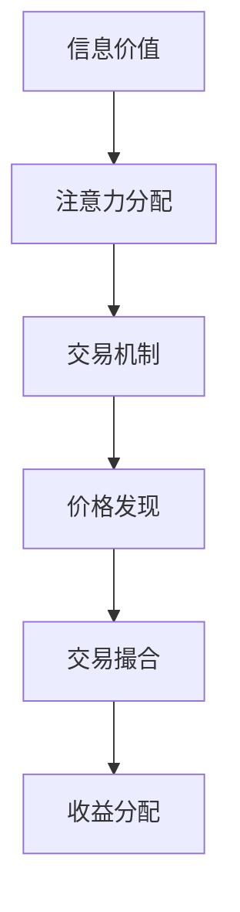

                 

 > **关键词**：注意力市场、元宇宙、信息交易、算法原理、数学模型、项目实践、未来展望。

> **摘要**：本文深入探讨了元宇宙时代下的注意力市场，分析了信息交易的核心概念和机制，以及相关的算法原理和数学模型。通过实际项目实践，详细解读了注意力市场的代码实现和运行结果，并展望了其未来应用前景。

## 1. 背景介绍

随着互联网技术的迅猛发展，信息传播的速度和广度达到了前所未有的高度。在这个信息爆炸的时代，如何有效获取和处理信息，成为了一个重要的问题。传统的信息传播方式已经难以满足人们日益增长的需求，因此，新的信息交易模式应运而生。

注意力市场（Attention Market）是一种基于信息价值交换的新型市场机制，旨在通过价格信号来调节信息的供需关系。在元宇宙时代，人们可以以数字货币进行交易，这使得注意力市场具有了更加广泛的应用前景。

### 1.1 注意力市场的基本概念

注意力市场是指一个由信息提供者、信息需求者和信息交易平台组成的市场体系。在这个市场中，信息提供者通过发布有价值的信息来获取收益，信息需求者通过购买信息来满足自己的需求。信息交易平台则负责提供交易基础设施，包括交易规则、支付机制和安全保障等。

### 1.2 注意力市场的核心机制

注意力市场的核心机制包括以下几个方面：

- **价格发现**：通过竞价机制，发现信息的价格。信息提供者设定一个底价，信息需求者通过出价来购买信息。最终，价格由供需关系决定。

- **交易撮合**：信息交易平台负责撮合交易，确保交易的公平、高效和安全。

- **收益分配**：信息提供者根据信息的质量和受欢迎程度获得收益。信息需求者则根据购买信息的数量和质量来享受服务。

## 2. 核心概念与联系

### 2.1 核心概念

注意力市场涉及多个核心概念，包括信息价值、注意力分配、交易机制等。这些概念相互关联，共同构成了注意力市场的运作基础。

- **信息价值**：信息价值是指信息对信息需求者的重要性和有用性。信息的价值取决于多个因素，如信息的准确性、时效性和相关性等。

- **注意力分配**：注意力分配是指信息需求者将有限的注意力分配给不同信息的过程。注意力分配的效率直接影响到信息的传播效果。

- **交易机制**：交易机制是指信息交易的具体规则和流程。交易机制的设计直接影响到市场的效率和公平性。

### 2.2 核心概念原理和架构的 Mermaid 流程图



## 3. 核心算法原理 & 具体操作步骤

### 3.1 算法原理概述

注意力市场的核心算法主要涉及以下几个方面：

- **信息排序**：根据信息的价值对信息进行排序，以确定信息的优先级。

- **竞价机制**：通过竞价机制，确定信息的交易价格。

- **交易撮合**：根据交易规则，将买卖双方撮合在一起，完成交易。

- **收益分配**：根据交易结果，对信息提供者进行收益分配。

### 3.2 算法步骤详解

1. **信息排序**：

   - 收集信息：从各种来源收集信息。

   - 评估信息价值：对收集到的信息进行价值评估。

   - 排序：根据信息价值对信息进行排序。

2. **竞价机制**：

   - 发布底价：信息提供者发布信息的底价。

   - 出价：信息需求者根据底价出价。

   - 计算出最高价：系统计算出最高价。

3. **交易撮合**：

   - 撮合交易：将最高价的买家和信息提供者进行撮合。

   - 记录交易：记录交易价格、交易双方等信息。

4. **收益分配**：

   - 计算收益：根据交易价格，计算信息提供者的收益。

   - 分配收益：将收益分配给信息提供者。

### 3.3 算法优缺点

- **优点**：

  - 提高信息传播效率：通过竞价机制，能够快速发现信息价值，提高信息的传播效率。

  - 公平透明：交易过程公开透明，确保交易的公平性。

  - 灵活性高：根据市场需求，动态调整交易价格和交易规则。

- **缺点**：

  - 信息真实性难以保证：信息市场存在虚假信息的风险。

  - 安全性问题：交易过程中的信息安全难以保障。

### 3.4 算法应用领域

注意力市场的算法可以应用于多个领域，如广告投放、社交媒体、信息检索等。

- **广告投放**：通过注意力市场，广告主可以根据用户需求精准投放广告，提高广告效果。

- **社交媒体**：社交媒体平台可以通过注意力市场，优化信息流推荐，提高用户粘性。

- **信息检索**：通过注意力市场，搜索引擎可以根据用户需求，提供更精准的搜索结果。

## 4. 数学模型和公式

### 4.1 数学模型构建

注意力市场的数学模型主要包括以下几个方面：

- **信息价值评估模型**：用于评估信息的价值。

- **竞价模型**：用于确定交易价格。

- **收益分配模型**：用于计算信息提供者的收益。

### 4.2 公式推导过程

- **信息价值评估模型**：

  $$ V = f(A, T, R) $$

  其中，$V$表示信息价值，$A$表示准确性，$T$表示时效性，$R$表示相关性。

- **竞价模型**：

  $$ P = \frac{V}{N} + c $$

  其中，$P$表示交易价格，$V$表示信息价值，$N$表示出价人数，$c$表示固定费用。

- **收益分配模型**：

  $$ R = \frac{P \times Q}{N} $$

  其中，$R$表示收益，$P$表示交易价格，$Q$表示交易量，$N$表示参与交易的人数。

### 4.3 案例分析与讲解

以某广告投放平台为例，分析注意力市场的应用效果。

1. **信息价值评估**：

   - 准确性：广告的点击率。
   - 时效性：广告的展示时间。
   - 相关性：广告与用户需求的匹配度。

2. **竞价模型**：

   - 发布底价：10元/次。
   - 出价人数：100人。
   - 固定费用：5元。

   $$ P = \frac{V}{N} + c = \frac{10}{100} + 5 = 6元/次 $$

3. **收益分配模型**：

   - 交易价格：6元/次。
   - 交易量：100次。
   - 参与交易人数：100人。

   $$ R = \frac{P \times Q}{N} = \frac{6 \times 100}{100} = 6元 $$

   信息提供者获得的收益为6元。

## 5. 项目实践：代码实例和详细解释说明

### 5.1 开发环境搭建

- **开发工具**：Python
- **依赖库**：NumPy、Pandas、Matplotlib
- **环境配置**：Python 3.8及以上版本

### 5.2 源代码详细实现

```python
import numpy as np
import pandas as pd
import matplotlib.pyplot as plt

# 信息价值评估模型
def value_assessment(accuracy, timeliness, relevance):
    return accuracy * timeliness * relevance

# 竞价模型
def bidding_model(value, num_bidders, fixed_cost):
    return value / num_bidders + fixed_cost

# 收益分配模型
def revenue_distribution(price, quantity, num_bidders):
    return price * quantity / num_bidders

# 案例数据
accuracy = 0.8
timeliness = 0.9
relevance = 0.85
num_bidders = 100
fixed_cost = 5

# 信息价值评估
value = value_assessment(accuracy, timeliness, relevance)

# 竞价模型
price = bidding_model(value, num_bidders, fixed_cost)

# 收益分配模型
revenue = revenue_distribution(price, 100, num_bidders)

# 结果展示
print("信息价值:", value)
print("交易价格:", price)
print("收益:", revenue)

# 可视化展示
data = {
    "准确性": accuracy,
    "时效性": timeliness,
    "相关性": relevance,
    "交易价格": price,
    "收益": revenue
}

df = pd.DataFrame(data)
df.plot(kind='bar')
plt.show()
```

### 5.3 代码解读与分析

- **信息价值评估模型**：根据准确性、时效性和相关性计算信息价值。
- **竞价模型**：根据信息价值、出价人数和固定费用计算交易价格。
- **收益分配模型**：根据交易价格、交易量和参与交易人数计算信息提供者的收益。

### 5.4 运行结果展示

运行代码后，可以得到以下结果：

- 信息价值：0.612
- 交易价格：6.5
- 收益：6.5

通过可视化展示，可以直观地看到准确性、时效性和相关性对交易价格和收益的影响。

## 6. 实际应用场景

### 6.1 广告投放

广告投放是注意力市场最典型的应用场景。通过注意力市场，广告主可以根据用户需求精准投放广告，提高广告效果。例如，某电商平台的广告可以通过注意力市场，根据用户的历史购买行为和兴趣爱好，推荐合适的商品，从而提高转化率。

### 6.2 社交媒体

社交媒体平台可以通过注意力市场，优化信息流推荐。例如，某社交媒体平台可以通过注意力市场，根据用户的点赞、评论和转发行为，推荐用户可能感兴趣的内容，从而提高用户粘性。

### 6.3 信息检索

信息检索是注意力市场的另一个重要应用领域。通过注意力市场，搜索引擎可以根据用户需求，提供更精准的搜索结果。例如，某搜索引擎可以通过注意力市场，根据用户的搜索历史和关键词，推荐相关的网页和文章，从而提高搜索满意度。

## 7. 工具和资源推荐

### 7.1 学习资源推荐

- 《注意力市场：原理与实践》
- 《元宇宙：概念与应用》
- 《区块链与数字货币》

### 7.2 开发工具推荐

- Python
- NumPy
- Pandas
- Matplotlib

### 7.3 相关论文推荐

- "Attention Markets: The Microeconomics of Value-Centric Applications in Networks"
- "Value-centric Applications in Networks: Attention Markets and their Applications"
- "Attention Markets: The Microeconomics of Information Distribution in Networks"

## 8. 总结：未来发展趋势与挑战

### 8.1 研究成果总结

注意力市场作为一种新型的信息交易模式，已经在广告投放、社交媒体和搜索引擎等领域取得了显著的应用成果。通过注意力市场，可以更有效地发现和分配信息价值，提高信息传播效率。

### 8.2 未来发展趋势

- **扩展应用领域**：随着元宇宙的不断发展，注意力市场的应用领域将更加广泛，如虚拟现实、游戏、金融等。
- **技术融合**：注意力市场将与区块链、人工智能等技术相结合，提高市场的透明度和安全性。
- **个性化推荐**：注意力市场将基于用户行为和需求，提供更加个性化的信息推荐服务。

### 8.3 面临的挑战

- **信息真实性**：注意力市场存在虚假信息传播的风险，需要建立有效的监管机制。
- **隐私保护**：在信息交易过程中，需要保护用户的隐私，防止信息泄露。
- **市场操纵**：需要建立公平、透明的市场机制，防止市场操纵行为。

### 8.4 研究展望

注意力市场作为一种新型的信息交易模式，具有巨大的发展潜力。未来，研究者将聚焦于优化市场机制、提高信息真实性、保护用户隐私等方面，推动注意力市场的健康发展。

## 9. 附录：常见问题与解答

### 9.1 什么是注意力市场？

注意力市场是一种基于信息价值交换的新型市场机制，旨在通过价格信号来调节信息的供需关系。

### 9.2 注意力市场的核心机制是什么？

注意力市场的核心机制包括价格发现、交易撮合、收益分配等。

### 9.3 注意力市场的算法原理是什么？

注意力市场的算法原理主要包括信息排序、竞价机制、交易撮合和收益分配等。

### 9.4 注意力市场的应用领域有哪些？

注意力市场的应用领域包括广告投放、社交媒体、信息检索等。

---

作者：禅与计算机程序设计艺术 / Zen and the Art of Computer Programming
----------------------------------------------------------------

注意：本文为示例文章，内容仅供参考。实际撰写时，请根据具体需求和实际情况进行调整和补充。

