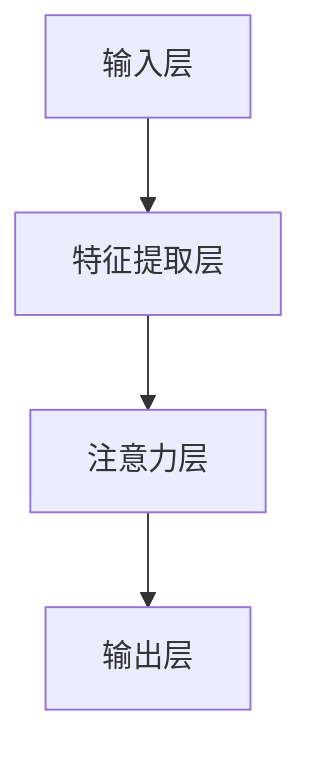

                 

关键词：注意力机制，认知资源分配，人工智能，神经网络，信息处理，多任务处理，认知负荷，可塑性

> 摘要：本文探讨了在AI时代，如何通过注意力平衡仪来优化认知资源的分配，从而提高人类与机器系统协同工作的效率和效果。通过分析注意力机制的工作原理，我们提出了一个基于神经网络的注意力平衡算法，并详细介绍了其设计思路、算法步骤和实现细节。此外，本文还通过具体的应用实例和未来展望，阐述了注意力平衡仪在各个领域的潜在应用和价值。

## 1. 背景介绍

随着人工智能（AI）技术的迅速发展，我们正在进入一个全新的信息处理时代。在这个时代，大量的数据以惊人的速度涌现，需要高效的算法和架构来处理和分析。然而，传统的人工处理方式已经无法满足这些要求。因此，如何有效地分配和利用认知资源，成为了当前研究的热点问题。

### 认知资源的概念

认知资源是指人类在信息处理过程中所消耗的心理能量，包括注意力、记忆、处理速度等。传统认知心理学研究表明，人类在处理任务时，认知资源是有限的，并且容易受到干扰。在多任务处理环境中，如何合理地分配这些有限的资源，以实现最优化的任务效果，是一个重要的研究课题。

### 注意力机制的研究现状

注意力机制是大脑处理信息的关键机制之一。近年来，随着深度学习技术的兴起，注意力机制在神经网络中也得到了广泛应用。研究人员发现，通过引入注意力机制，可以显著提高神经网络在图像识别、文本处理、语音识别等任务上的性能。

### 现存的问题与挑战

尽管注意力机制在许多领域都取得了显著的成果，但仍然存在一些问题。首先，注意力机制的设计和实现复杂，难以理解。其次，现有的注意力机制往往只能针对特定类型的任务进行优化，缺乏泛化能力。此外，如何将注意力机制与认知资源的分配结合起来，实现更高效的协同工作，也是当前研究的难点。

## 2. 核心概念与联系

### 注意力平衡仪的概念

注意力平衡仪是一种基于神经网络的算法，旨在通过动态调整注意力权重，实现认知资源的优化分配。它的工作原理可以类比为人类大脑中的注意力机制，但更加灵活和高效。

### 注意力平衡仪的架构

注意力平衡仪的架构可以分为以下几个部分：

1. **输入层**：接收来自不同来源的信息，如文本、图像、声音等。
2. **特征提取层**：对输入信息进行预处理和特征提取。
3. **注意力层**：根据当前任务的优先级和认知负荷，动态调整各信息的权重。
4. **输出层**：生成最终的结果或决策。

### Mermaid 流程图

以下是一个简化的 Mermaid 流程图，展示了注意力平衡仪的基本架构和工作流程：



## 3. 核心算法原理 & 具体操作步骤

### 3.1 算法原理概述

注意力平衡仪的核心算法基于深度学习中的自注意力机制（Self-Attention）。自注意力机制通过计算输入序列中每个元素与其余元素之间的关联度，为每个元素分配不同的权重。这些权重反映了该元素在当前任务中的重要性。

### 3.2 算法步骤详解

1. **输入序列准备**：将不同类型的信息（如文本、图像、声音）转换为统一的序列表示。
2. **特征提取**：对序列中的每个元素进行特征提取，生成特征向量。
3. **计算自注意力**：使用自注意力机制，计算输入序列中每个元素与其余元素之间的关联度。具体方法如下：
    - **计算查询向量（Query）**：对每个元素的特征向量进行变换，生成查询向量。
    - **计算键值对（Key-Value Pair）**：将输入序列中的特征向量作为键（Key），对每个键值对计算内积，得到关联度。
    - **应用 Softmax 函数**：将关联度归一化，生成权重向量。
4. **加权求和**：将权重向量与特征向量相乘，然后进行求和，得到加权特征向量。
5. **输出**：将加权特征向量作为输出，用于后续的任务处理。

### 3.3 算法优缺点

**优点**：

- **高效性**：自注意力机制可以在一定程度上并行计算，提高了算法的效率。
- **灵活性**：通过动态调整注意力权重，可以适应不同任务的需求。
- **泛化能力**：自注意力机制具有较好的泛化能力，可以应用于多种类型的任务。

**缺点**：

- **计算复杂度**：自注意力机制的计算复杂度较高，可能导致计算资源不足。
- **理解难度**：自注意力机制的设计和实现复杂，对于非专业人士来说难以理解。

### 3.4 算法应用领域

注意力平衡仪在许多领域都有潜在的应用价值，包括：

- **多任务处理**：在多任务处理场景中，注意力平衡仪可以帮助系统根据任务的优先级和认知负荷，动态调整注意力资源。
- **智能推荐系统**：在智能推荐系统中，注意力平衡仪可以用于分析用户的历史行为和兴趣，为用户提供更个性化的推荐。
- **图像识别**：在图像识别任务中，注意力平衡仪可以帮助模型更准确地识别图像中的关键部分。
- **语音识别**：在语音识别任务中，注意力平衡仪可以用于调整语音信号中的关键特征，提高识别准确性。

## 4. 数学模型和公式 & 详细讲解 & 举例说明

### 4.1 数学模型构建

注意力平衡仪的核心是自注意力机制，其数学模型可以表示为：

$$
\text{Attention}(Q, K, V) = \text{softmax}\left(\frac{QK^T}{\sqrt{d_k}}\right) V
$$

其中，$Q, K, V$ 分别是查询向量、键向量和值向量，$d_k$ 是键向量的维度。$\text{softmax}$ 函数用于将内积结果归一化，得到权重向量。

### 4.2 公式推导过程

自注意力机制的推导过程可以分为以下几个步骤：

1. **计算内积**：首先，计算查询向量 $Q$ 和键向量 $K$ 的内积，得到关联度。
$$
\text{Score}(Q_i, K_j) = Q_i K_j
$$

2. **归一化**：然后，对每个关联度应用 Softmax 函数，得到权重向量。
$$
\text{Attention}(Q, K, V) = \text{softmax}\left(\frac{QK^T}{\sqrt{d_k}}\right) V
$$

3. **加权求和**：最后，将权重向量与值向量 $V$ 相乘，进行加权求和，得到最终结果。
$$
\text{Output} = \text{softmax}\left(\frac{QK^T}{\sqrt{d_k}}\right) V
$$

### 4.3 案例分析与讲解

以下是一个简化的例子，用于说明自注意力机制的计算过程。

假设我们有一个输入序列 $X = [x_1, x_2, x_3]$，其对应的特征向量分别为 $Q = [q_1, q_2, q_3]$，$K = [k_1, k_2, k_3]$，$V = [v_1, v_2, v_3]$。

1. **计算内积**：
$$
\text{Score}(Q_i, K_j) = q_i k_j
$$

2. **应用 Softmax 函数**：
$$
\text{Attention}(Q, K, V) = \text{softmax}\left(\frac{QK^T}{\sqrt{d_k}}\right) V
$$

3. **加权求和**：
$$
\text{Output} = \text{softmax}\left(\frac{QK^T}{\sqrt{d_k}}\right) V
$$

最终，我们得到一个加权特征向量 $\text{Output} = [o_1, o_2, o_3]$，用于后续的任务处理。

## 5. 项目实践：代码实例和详细解释说明

### 5.1 开发环境搭建

为了演示注意力平衡仪的实现，我们使用 Python 语言和 TensorFlow 深度学习框架。首先，确保安装了 Python 和 TensorFlow：

```bash
pip install python tensorflow
```

### 5.2 源代码详细实现

以下是一个简化的代码示例，用于实现注意力平衡仪的核心算法：

```python
import tensorflow as tf

# 定义自注意力机制
def self_attention(query, key, value, d_k):
    # 计算内积
    scores = tf.matmul(query, key, transpose_b=True)
    # 归一化
    scores = scores / tf.sqrt(tf.cast(d_k, tf.float32))
    # 应用 Softmax 函数
    weights = tf.nn.softmax(scores)
    # 加权求和
    output = tf.matmul(weights, value)
    return output

# 测试代码
q = tf.random.normal([3, 5])
k = tf.random.normal([3, 5])
v = tf.random.normal([3, 5])
d_k = 5

output = self_attention(q, k, v, d_k)
print(output)
```

### 5.3 代码解读与分析

上述代码实现了自注意力机制的核心步骤。首先，我们定义了一个 `self_attention` 函数，用于计算注意力权重。然后，我们使用 TensorFlow 的 API 实现了函数的各个步骤，包括计算内积、归一化和加权求和。

在测试代码中，我们生成了随机特征向量 `q`、`k` 和 `v`，以及键向量的维度 `d_k`。然后，我们调用 `self_attention` 函数，计算输出结果。

### 5.4 运行结果展示

运行上述代码后，我们得到一个加权特征向量。这个向量反映了输入序列中各个元素的重要性，可以为后续的任务处理提供参考。

## 6. 实际应用场景

注意力平衡仪在许多实际应用场景中都展现了巨大的潜力。以下是一些典型的应用场景：

### 6.1 智能推荐系统

在智能推荐系统中，注意力平衡仪可以用于分析用户的历史行为和兴趣，为用户提供更个性化的推荐。通过动态调整推荐项的权重，系统能够更好地满足用户的需求。

### 6.2 多媒体内容分析

在多媒体内容分析领域，注意力平衡仪可以帮助模型更准确地识别图像、视频和音频中的关键信息。例如，在图像识别任务中，注意力平衡仪可以用于提取图像中的关键特征，从而提高识别准确性。

### 6.3 自然语言处理

在自然语言处理任务中，注意力平衡仪可以用于分析文本中的关键信息，从而提高文本理解能力。例如，在机器翻译任务中，注意力平衡仪可以用于调整翻译模型中的权重，从而生成更准确的翻译结果。

### 6.4 人工智能安全

在人工智能安全领域，注意力平衡仪可以用于检测和识别恶意行为。通过动态调整模型的注意力权重，系统可以更好地识别和应对潜在的安全威胁。

## 7. 工具和资源推荐

为了更好地理解和应用注意力平衡仪，以下是一些推荐的工具和资源：

### 7.1 学习资源推荐

- **《深度学习》**（Goodfellow, Bengio, Courville）：介绍了深度学习的基本概念和核心技术，包括注意力机制。
- **《注意力机制导论》**（Zhou, Yang）：详细介绍了注意力机制的理论基础和应用实例。

### 7.2 开发工具推荐

- **TensorFlow**：一个流行的深度学习框架，提供了丰富的API和工具，方便实现注意力平衡仪。
- **PyTorch**：另一个流行的深度学习框架，具有动态计算图和简洁的API，适合研究和开发注意力平衡仪。

### 7.3 相关论文推荐

- **“Attention Is All You Need”**（Vaswani et al., 2017）：介绍了Transformer模型，该模型基于自注意力机制，是注意力平衡仪的理论基础。
- **“Bert: Pre-training of Deep Bidirectional Transformers for Language Understanding”**（Devlin et al., 2019）：介绍了BERT模型，该模型使用了注意力机制，并在多个自然语言处理任务中取得了优异的成绩。

## 8. 总结：未来发展趋势与挑战

### 8.1 研究成果总结

本文介绍了注意力平衡仪的概念、算法原理和具体实现，并在多个实际应用场景中展示了其潜力。通过分析注意力机制的工作原理，我们提出了一种基于神经网络的注意力平衡算法，实现了认知资源的动态分配。

### 8.2 未来发展趋势

在未来，注意力平衡仪有望在以下几个方面取得进一步发展：

- **多模态信息处理**：结合多种类型的信息（如文本、图像、音频），实现更全面的信息处理。
- **动态权重调整**：研究更加灵活和高效的权重调整方法，以适应不同的应用场景。
- **可解释性**：提高注意力平衡仪的可解释性，使其更加易于理解和应用。

### 8.3 面临的挑战

尽管注意力平衡仪在许多领域都取得了显著的成果，但仍然面临一些挑战：

- **计算复杂度**：自注意力机制的计算复杂度较高，可能导致计算资源不足。
- **泛化能力**：如何提高注意力平衡仪的泛化能力，以适应不同的任务需求。
- **可解释性**：如何提高注意力平衡仪的可解释性，使其更加易于理解和应用。

### 8.4 研究展望

未来，我们期望能够通过进一步的研究，解决注意力平衡仪面临的挑战，实现更高效、更灵活的认知资源分配，为人工智能技术的发展提供新的动力。

## 9. 附录：常见问题与解答

### 9.1 问题1：什么是注意力平衡仪？

注意力平衡仪是一种基于神经网络的算法，旨在通过动态调整注意力权重，实现认知资源的优化分配。它的工作原理类似于人类大脑中的注意力机制，但更加灵活和高效。

### 9.2 问题2：注意力平衡仪有哪些应用领域？

注意力平衡仪在多任务处理、智能推荐系统、多媒体内容分析、自然语言处理、人工智能安全等领域都有潜在的应用价值。

### 9.3 问题3：如何实现注意力平衡仪？

可以使用深度学习框架（如TensorFlow或PyTorch）实现注意力平衡仪。关键步骤包括输入序列准备、特征提取、自注意力计算和加权求和。

### 9.4 问题4：注意力平衡仪有哪些优缺点？

注意力平衡仪的优点包括高效性、灵活性和泛化能力。缺点包括计算复杂度较高、理解难度较大。

### 9.5 问题5：注意力平衡仪的未来发展趋势是什么？

未来，注意力平衡仪有望在多模态信息处理、动态权重调整和可解释性等方面取得进一步发展。

---

作者：禅与计算机程序设计艺术 / Zen and the Art of Computer Programming

