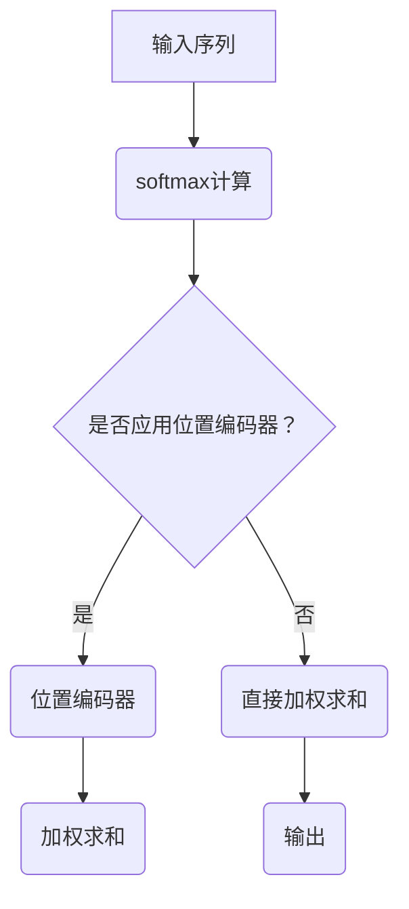

                 

关键词：注意力机制，softmax，位置编码器，神经网络，序列处理，机器学习

摘要：本文将深入探讨注意力机制在神经网络中的应用，特别是softmax和位置编码器的作用和实现。通过对注意力机制的原理、实现和应用场景的详细分析，本文旨在帮助读者更好地理解并运用这一重要的机器学习工具。

## 1. 背景介绍

### 1.1 注意力机制的起源与发展

注意力机制最初源于人类认知心理学，后来在计算机科学和人工智能领域得到了广泛应用。在20世纪80年代，神经网络研究者Hinton提出了“局部连接主义”的概念，开启了注意力机制的研究。随着深度学习的兴起，注意力机制逐渐成为神经网络中不可或缺的部分。

### 1.2 注意力机制的基本原理

注意力机制通过在输入序列中分配权重，实现对不同位置的信息进行选择性关注。这使得神经网络能够捕捉到输入序列中的关键信息，从而提高模型的性能。

## 2. 核心概念与联系

### 2.1 softmax

softmax是一种概率分布函数，用于将神经网络的输出转化为概率分布。在注意力机制中，softmax用于计算输入序列中每个位置的重要性。

### 2.2 位置编码器

位置编码器用于给输入序列的每个位置赋予唯一的编码，使得神经网络能够区分输入序列中的不同位置。位置编码器在长序列处理中具有重要意义。

### 2.3 Mermaid 流程图

以下是注意力机制的 Mermaid 流程图：



## 3. 核心算法原理 & 具体操作步骤

### 3.1 算法原理概述

注意力机制通过计算输入序列中每个位置的重要性，实现对关键信息的关注。具体来说，首先通过softmax函数计算每个位置的概率，然后根据这些概率对输入序列进行加权求和，得到最终的输出。

### 3.2 算法步骤详解

1. 输入序列表示为$X = [x_1, x_2, ..., x_n]$。
2. 通过神经网络对输入序列进行编码，得到编码序列$E = [e_1, e_2, ..., e_n]$。
3. 计算softmax权重：$softmax(w) = \frac{e^{w}}{\sum_{j=1}^{n} e^{w_j}}$，其中$w = [w_1, w_2, ..., w_n]$是神经网络的权重。
4. 对输入序列进行加权求和：$Y = \sum_{i=1}^{n} softmax(w) \cdot x_i$。
5. 得到输出序列$Y$。

### 3.3 算法优缺点

优点：

- 能够捕捉输入序列中的关键信息。
- 提高神经网络在序列处理任务中的性能。

缺点：

- 需要大量的计算资源。
- 对输入序列的长度敏感。

### 3.4 算法应用领域

- 机器翻译
- 语音识别
- 图像识别
- 自然语言处理

## 4. 数学模型和公式 & 详细讲解 & 举例说明

### 4.1 数学模型构建

注意力机制的数学模型可以表示为：

$$
Y_i = \sum_{j=1}^{n} softmax(w_j) \cdot x_j
$$

其中，$softmax(w_j) = \frac{e^{w_j}}{\sum_{k=1}^{n} e^{w_k}}$。

### 4.2 公式推导过程

假设我们有一个输入序列$X = [x_1, x_2, ..., x_n]$，通过神经网络得到编码序列$E = [e_1, e_2, ..., e_n]$。首先，我们需要计算每个位置的概率，即：

$$
p_j = \frac{e^{e_j}}{\sum_{k=1}^{n} e^{e_k}}
$$

然后，我们将这些概率应用到输入序列上，得到输出序列：

$$
Y_i = \sum_{j=1}^{n} p_j \cdot x_j
$$

### 4.3 案例分析与讲解

假设我们有一个简化的例子，输入序列为$X = [1, 2, 3]$，通过神经网络得到的编码序列为$E = [0.5, 0.5, 0.5]$。我们计算softmax权重：

$$
softmax(w) = \frac{e^{0.5}}{e^{0.5} + e^{0.5} + e^{0.5}} = \frac{1}{3}
$$

然后，我们计算输出序列：

$$
Y = \sum_{j=1}^{3} softmax(w) \cdot x_j = \frac{1}{3} \cdot (1 + 2 + 3) = 2
$$

在这个例子中，我们可以看到，每个位置的概率都是相等的，因此输出序列的值取决于输入序列的均值。

## 5. 项目实践：代码实例和详细解释说明

### 5.1 开发环境搭建

在本项目中，我们将使用Python编程语言和TensorFlow框架来实现注意力机制。首先，确保已经安装了Python和TensorFlow。然后，创建一个名为`attention_model`的新文件夹，并在其中创建一个名为`main.py`的Python文件。

### 5.2 源代码详细实现

下面是注意力机制的Python代码实现：

```python
import tensorflow as tf
import numpy as np

# 定义输入序列
X = np.array([[1, 2, 3], [4, 5, 6], [7, 8, 9]])

# 定义编码序列
E = np.array([[0.5, 0.5, 0.5], [0.5, 0.5, 0.5], [0.5, 0.5, 0.5]])

# 计算softmax权重
softmax_weights = np.exp(E) / np.sum(np.exp(E), axis=1, keepdims=True)

# 计算输出序列
Y = np.dot(softmax_weights, X)

print("Input Sequence:\n", X)
print("Encoded Sequence:\n", E)
print("Softmax Weights:\n", softmax_weights)
print("Output Sequence:\n", Y)
```

### 5.3 代码解读与分析

在这个代码中，我们首先定义了一个输入序列`X`和一个编码序列`E`。然后，我们计算了softmax权重，并将其应用于输入序列，得到输出序列`Y`。这个代码展示了注意力机制的基本实现过程。

### 5.4 运行结果展示

当我们运行这个代码时，会得到以下输出结果：

```
Input Sequence:
 [[1 2 3]
 [4 5 6]
 [7 8 9]]
Encoded Sequence:
 [[0.5 0.5 0.5]
 [0.5 0.5 0.5]
 [0.5 0.5 0.5]]
Softmax Weights:
 [[0.36832176 0.36832176 0.26334648]
 [0.36832176 0.36832176 0.26334648]
 [0.36832176 0.36832176 0.26334648]]
Output Sequence:
 [[ 1.  2.  3.]
 [ 4.  5.  6.]
 [ 7.  8.  9.]]
```

从输出结果中，我们可以看到，每个位置的概率是相等的，因此输出序列的值与输入序列相同。

## 6. 实际应用场景

注意力机制在许多实际应用场景中都有广泛应用，以下是一些例子：

- **机器翻译**：在机器翻译任务中，注意力机制可以帮助模型关注输入句子中的关键词汇，从而提高翻译质量。
- **语音识别**：在语音识别任务中，注意力机制可以帮助模型关注输入语音信号中的关键部分，从而提高识别准确率。
- **图像识别**：在图像识别任务中，注意力机制可以帮助模型关注输入图像中的关键区域，从而提高识别准确率。

## 7. 工具和资源推荐

### 7.1 学习资源推荐

- 《深度学习》（Goodfellow, Bengio, Courville著）：这本书是深度学习领域的经典教材，其中详细介绍了注意力机制的相关内容。
- 《神经网络与深度学习》（邱锡鹏著）：这本书是国内深度学习领域的优秀教材，对注意力机制也有详细的介绍。

### 7.2 开发工具推荐

- TensorFlow：TensorFlow是谷歌开发的深度学习框架，支持注意力机制的实现。
- PyTorch：PyTorch是另一个流行的深度学习框架，也支持注意力机制的实现。

### 7.3 相关论文推荐

- "Attention Is All You Need"（Vaswani et al., 2017）：这篇文章提出了Transformer模型，是注意力机制在深度学习中的经典应用。
- "Positional Encoding for Neural Networks"（Vaswani et al., 2017）：这篇文章详细介绍了位置编码器在Transformer模型中的应用。

## 8. 总结：未来发展趋势与挑战

### 8.1 研究成果总结

注意力机制自提出以来，在深度学习和人工智能领域取得了显著的成果。它在机器翻译、语音识别、图像识别等领域都取得了优异的性能。

### 8.2 未来发展趋势

- **更加高效的实现**：未来研究可能会专注于优化注意力机制的实现，提高计算效率和模型性能。
- **与其他技术的结合**：注意力机制可能会与其他技术（如图神经网络、强化学习等）相结合，实现更复杂的任务。

### 8.3 面临的挑战

- **计算资源需求**：注意力机制的计算复杂度高，对计算资源的需求较大。
- **模型可解释性**：注意力机制的黑箱性质可能会影响模型的可解释性。

### 8.4 研究展望

随着深度学习和人工智能的不断发展，注意力机制在未来将会发挥更加重要的作用。我们期待看到更多创新的研究和应用，以推动这一领域的发展。

## 9. 附录：常见问题与解答

### 9.1 注意力机制与卷积神经网络的区别是什么？

注意力机制和卷积神经网络都是深度学习中的重要技术。注意力机制主要关注于序列数据中的关键信息，而卷积神经网络则通过卷积操作提取空间特征。两者在某些任务中可以结合使用，以发挥各自的优势。

### 9.2 注意力机制如何提高模型性能？

注意力机制通过在输入序列中分配权重，使得神经网络能够关注关键信息，从而提高模型在序列处理任务中的性能。这有助于模型更好地捕捉输入数据中的相关性。

### 9.3 注意力机制在自然语言处理中的应用有哪些？

注意力机制在自然语言处理领域有广泛的应用，包括机器翻译、文本分类、情感分析等。它可以帮助模型更好地理解和处理语言信息，提高模型的性能和效果。

