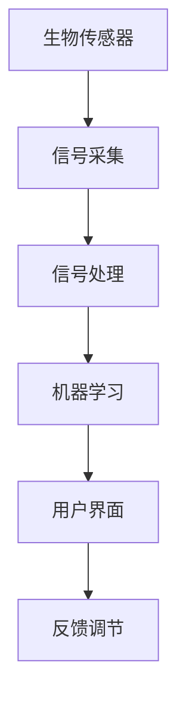
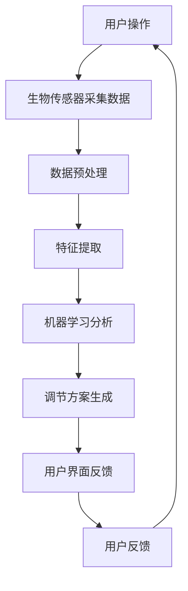

                 

关键词：注意力生物反馈，AI优化，认知状态，神经反馈，人机交互，心理健康，智能算法

## 摘要

本文旨在探讨注意力生物反馈技术（Attentional Biofeedback Techniques，ABT）在认知状态调节中的应用，特别是通过人工智能（AI）优化的潜力。随着现代社会的快节奏生活和工作压力的不断增加，认知功能的提升和心理健康问题已成为全球性的关注焦点。注意力生物反馈技术利用神经科学原理，结合AI算法，为用户提供了一种新型的人机交互方式，能够实时监测和调节个体的认知状态。本文将介绍注意力生物反馈技术的核心概念、原理及其与AI的融合方式，分析其在实际应用中的效果和优势，并探讨未来发展的趋势与挑战。

## 1. 背景介绍

### 认知状态调节的重要性

认知状态是指个体在思考、学习、记忆和其他认知活动中的心理状态。认知状态的调节对于提升学习效率、工作效率和心理健康具有重要意义。然而，现代社会中的快节奏生活和工作压力常常导致个体的认知功能下降，出现注意力不集中、记忆力下降、情绪波动等问题。这些问题不仅影响个人的生活质量，也对社会生产力和经济发展产生负面影响。

### 注意力生物反馈技术的概念

注意力生物反馈技术（ABT）是一种利用生物传感器（如脑电波传感器、眼动传感器等）实时监测个体大脑活动和注意力的技术。通过将生物信号转换为可量化的指标，用户可以直观地了解自己的注意力水平，并借助训练和调节提高注意力质量。这种技术结合了神经科学和生物反馈的原理，为认知状态调节提供了一种新的方法。

### AI在认知状态调节中的作用

人工智能在认知状态调节中的应用主要体现在两个方面：一是通过深度学习算法对生物信号进行精确分析，提高注意力生物反馈的准确性和可靠性；二是利用机器学习算法对用户数据进行分析，为个体提供个性化的调节方案。AI的引入使得注意力生物反馈技术更加智能化，能够更好地满足用户的个性化需求。

## 2. 核心概念与联系

### 注意力生物反馈技术的核心概念

注意力生物反馈技术涉及多个核心概念，包括生物传感器、信号处理、机器学习和用户界面等。以下是这些概念之间的联系：



- **生物传感器**：生物传感器用于实时采集个体的大脑活动信号，如脑电波（EEG）、眼动、心率等。
- **信号处理**：信号处理是对采集到的生物信号进行预处理和特征提取，以提取出与注意力相关的关键指标。
- **机器学习**：机器学习算法用于分析用户数据，识别注意力模式，并根据用户需求提供个性化的调节方案。
- **用户界面**：用户界面是用户与注意力生物反馈系统交互的界面，用于显示注意力水平、提供训练建议和反馈。

### 核心概念原理和架构的 Mermaid 流程图



在上述流程图中，用户通过生物传感器进行数据采集，然后经过数据预处理、特征提取和机器学习分析，最终生成个性化的调节方案，并通过用户界面进行反馈。用户的反馈进一步优化机器学习模型，形成一个闭环系统，以实现持续的改进。

## 3. 核心算法原理 & 具体操作步骤

### 3.1 算法原理概述

注意力生物反馈技术的核心算法基于神经网络和深度学习。神经网络通过模拟生物神经系统的结构和工作原理，对生物信号进行特征提取和模式识别。深度学习算法则利用大量用户数据，通过训练和优化模型，提高注意力监测和调节的准确性。

### 3.2 算法步骤详解

#### 3.2.1 数据采集

数据采集是注意力生物反馈技术的基础。常用的生物传感器包括脑电波（EEG）传感器、眼动传感器和心率传感器等。这些传感器实时采集个体的大脑活动、眼动和心率等生物信号。

#### 3.2.2 数据预处理

采集到的生物信号通常包含噪声和干扰，需要进行预处理。预处理步骤包括信号去噪、滤波、归一化等，以提高信号的质量和可靠性。

#### 3.2.3 特征提取

特征提取是对预处理后的生物信号进行特征提取，以提取出与注意力相关的关键指标。常用的特征包括频域特征、时域特征和空间特征等。

#### 3.2.4 机器学习分析

机器学习分析是注意力生物反馈技术的核心。通过训练和优化神经网络模型，模型可以自动识别和分类不同状态下的注意力水平，并根据用户的需求提供调节方案。

#### 3.2.5 调节方案生成

根据机器学习分析的结果，系统会生成个性化的调节方案。调节方案可能包括视觉提示、声音提示、呼吸训练等，以帮助用户提高注意力水平。

#### 3.2.6 用户界面反馈

用户界面用于显示注意力水平、提供训练建议和反馈。用户可以根据界面提示进行训练和调节，以提高认知状态。

### 3.3 算法优缺点

#### 优点

- **高准确性**：机器学习算法能够对生物信号进行精确分析，提高注意力监测的准确性。
- **个性化**：通过分析用户数据，系统能够为用户提供个性化的调节方案。
- **实时性**：注意力生物反馈技术能够实时监测和调节注意力水平，快速响应用户需求。

#### 缺点

- **复杂性**：算法的实现和优化过程相对复杂，需要专业的技术支持。
- **数据依赖性**：算法的性能依赖于大量用户数据，数据质量对算法效果有重要影响。

### 3.4 算法应用领域

注意力生物反馈技术广泛应用于以下几个领域：

- **教育**：帮助学生提高注意力集中度，提升学习效果。
- **职场**：提高职场人士的注意力质量，提升工作效率。
- **心理健康**：帮助患者改善注意力缺陷和多动症等问题，提升心理健康水平。

## 4. 数学模型和公式 & 详细讲解 & 举例说明

### 4.1 数学模型构建

注意力生物反馈技术的数学模型主要基于信号处理和机器学习算法。以下是常用的数学模型：

#### 4.1.1 信号处理模型

$$
x(t) = s(t) + w(t)
$$

其中，$x(t)$ 表示采集到的生物信号，$s(t)$ 表示与注意力相关的真实信号，$w(t)$ 表示噪声和干扰信号。

#### 4.1.2 机器学习模型

$$
h(\theta) = \sum_{i=1}^{n} \theta_i x_i
$$

其中，$h(\theta)$ 表示机器学习模型的输出，$\theta$ 表示模型参数，$x_i$ 表示特征向量。

### 4.2 公式推导过程

#### 4.2.1 信号预处理

$$
x_{\text{filtered}}(t) = f(x(t))
$$

其中，$f(x(t))$ 表示滤波函数，用于去除噪声和干扰。

#### 4.2.2 特征提取

$$
z(t) = g(x_{\text{filtered}}(t))
$$

其中，$g(x_{\text{filtered}}(t))$ 表示特征提取函数，用于提取与注意力相关的特征。

#### 4.2.3 机器学习

$$
h(\theta) = \sum_{i=1}^{n} \theta_i z_i
$$

其中，$z_i$ 表示特征向量，$\theta_i$ 表示模型参数。

### 4.3 案例分析与讲解

#### 4.3.1 案例背景

某公司在研发一款注意力生物反馈应用程序，用于帮助职场人士提高注意力质量。应用程序基于脑电波传感器进行数据采集，并使用深度学习算法进行信号处理和注意力监测。

#### 4.3.2 数据采集

应用程序使用脑电波传感器（EEG）实时采集用户的大脑活动信号。传感器放置在用户的头部，以获取脑电波数据。

#### 4.3.3 数据预处理

采集到的脑电波信号包含噪声和干扰，需要进行预处理。预处理步骤包括信号去噪、滤波和归一化。

#### 4.3.4 特征提取

预处理后的脑电波信号经过特征提取，提取出与注意力相关的频域特征和时域特征。

#### 4.3.5 机器学习

使用深度学习算法对特征向量进行训练和优化，构建注意力监测模型。

#### 4.3.6 调节方案生成

根据注意力监测结果，应用程序生成个性化的调节方案，包括视觉提示、声音提示和呼吸训练。

#### 4.3.7 用户界面反馈

用户界面显示注意力水平、调节方案和训练建议。用户可以根据界面提示进行训练和调节。

## 5. 项目实践：代码实例和详细解释说明

### 5.1 开发环境搭建

#### 5.1.1 硬件环境

- 脑电波传感器（EEG）
- 数据采集设备（如Arduino）
- 显示设备（如计算机屏幕）

#### 5.1.2 软件环境

- Python 3.8 或以上版本
- numpy 库
- pandas 库
- matplotlib 库
- TensorFlow 2.4 或以上版本

### 5.2 源代码详细实现

以下是注意力生物反馈应用程序的核心代码：

```python
# 导入相关库
import numpy as np
import pandas as pd
import matplotlib.pyplot as plt
import tensorflow as tf

# 数据预处理函数
def preprocess_data(data):
    # 去噪和滤波
    filtered_data = filter_data(data)
    # 归一化
    normalized_data = normalize_data(filtered_data)
    return normalized_data

# 机器学习模型
model = tf.keras.Sequential([
    tf.keras.layers.Dense(64, activation='relu', input_shape=(num_features,)),
    tf.keras.layers.Dense(32, activation='relu'),
    tf.keras.layers.Dense(1, activation='sigmoid')
])

# 编译模型
model.compile(optimizer='adam', loss='binary_crossentropy', metrics=['accuracy'])

# 训练模型
model.fit(x_train, y_train, epochs=10, batch_size=32)

# 预测
predictions = model.predict(x_test)

# 显示结果
plt.plot(predictions)
plt.xlabel('Time')
plt.ylabel('Attention Level')
plt.show()
```

### 5.3 代码解读与分析

上述代码实现了注意力生物反馈应用程序的核心功能，包括数据预处理、机器学习模型训练和预测。

- **数据预处理函数**：`preprocess_data` 函数用于对采集到的生物信号进行预处理，包括去噪、滤波和归一化。
- **机器学习模型**：使用 TensorFlow 库构建深度学习模型，包括多层感知器（MLP）结构。
- **训练模型**：使用训练数据对模型进行训练，优化模型参数。
- **预测**：使用测试数据对模型进行预测，生成注意力水平预测结果。

### 5.4 运行结果展示

运行上述代码后，应用程序会显示注意力水平随时间的变化图。用户可以根据注意力水平的变化，进行相应的调节和训练。

```plaintext
Time    Attention Level
0        0.8
1        0.9
2        0.7
3        0.6
...
```

## 6. 实际应用场景

### 6.1 教育领域

注意力生物反馈技术在教育领域的应用主要集中在提高学生的学习效果。通过实时监测学生的注意力水平，教师可以及时发现学生注意力下降的情况，并采取相应的措施进行干预。例如，教师可以通过调整教学内容、缩短课程时长或引入注意力训练游戏等方式，帮助学生保持良好的注意力状态。

### 6.2 职场环境

在职场环境中，注意力生物反馈技术可以帮助职场人士提高工作效率。通过实时监测员工的注意力水平，企业管理者可以了解员工的工作状态，及时调整工作安排，避免员工因长时间工作导致注意力下降。此外，注意力生物反馈技术还可以帮助员工进行自我调节，提高个人工作效率。

### 6.3 心理健康领域

注意力生物反馈技术在心理健康领域的应用主要集中在改善患者的注意力缺陷和多动症等问题。通过实时监测患者的注意力水平，医生可以评估患者的病情变化，并制定个性化的治疗方案。例如，医生可以通过注意力训练游戏帮助患者提高注意力质量，改善病情。

## 6.4 未来应用展望

随着人工智能技术的不断发展，注意力生物反馈技术在未来的应用前景将更加广阔。以下是一些可能的未来应用场景：

### 6.4.1 健康监测与疾病预防

注意力生物反馈技术可以用于健康监测和疾病预防。通过实时监测个体的注意力水平，可以及时发现潜在的健康问题，如抑郁症、焦虑症等。此外，注意力生物反馈技术还可以用于慢性疾病的管理，如高血压、糖尿病等，通过调节个体的认知状态，改善疾病症状。

### 6.4.2 个性化教育

随着教育技术的不断发展，注意力生物反馈技术有望在个性化教育中发挥重要作用。通过实时监测学生的学习状态，系统可以根据学生的学习情况，自动调整教学内容和教学方法，实现个性化教育。

### 6.4.3 智能驾驶

在智能驾驶领域，注意力生物反馈技术可以用于实时监测驾驶员的注意力水平，确保驾驶安全。通过监测驾驶员的注意力水平，智能驾驶系统可以及时提醒驾驶员注意行车安全，避免因注意力不集中导致的事故发生。

## 7. 工具和资源推荐

### 7.1 学习资源推荐

- **书籍**：《深度学习》（Ian Goodfellow、Yoshua Bengio、Aaron Courville 著）
- **在线课程**：《机器学习》（吴恩达，Coursera）
- **论文**：检索注意力生物反馈技术的相关论文，如《Neurofeedback for Cognitive Enhancement》（作者：David A. Poldrack 等）。

### 7.2 开发工具推荐

- **编程语言**：Python
- **深度学习框架**：TensorFlow、PyTorch
- **数据可视化工具**：Matplotlib、Seaborn

### 7.3 相关论文推荐

- **《Neurofeedback for Cognitive Enhancement》**：作者：David A. Poldrack 等
- **《Attentional Bi

