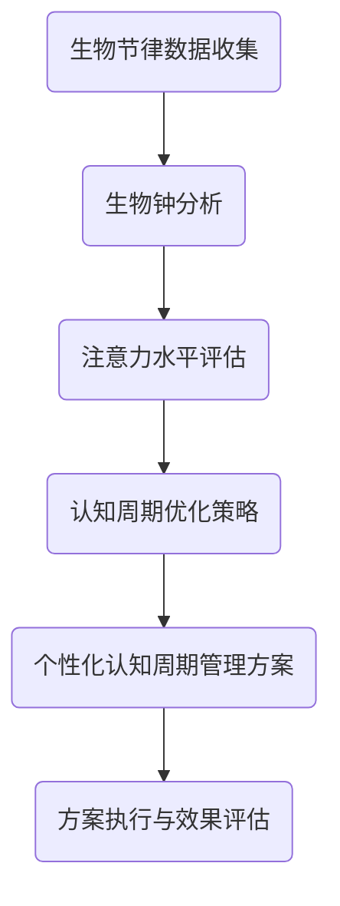

                 

关键词：注意力优化、生物节律、认知周期管理、人工智能、算法原理、数学模型、项目实践、实际应用、未来展望

> 摘要：本文将探讨如何通过人工智能技术优化人类的注意力生物节律，实现个性化的认知周期管理。通过对注意力生物节律的核心概念、算法原理、数学模型以及实际应用的深入分析，本文旨在为开发者、科研人员以及关注认知科学的读者提供具有指导意义的见解和思路。

## 1. 背景介绍

在当今快节奏、高压力的社会环境中，人们对于高效认知的需求日益增长。然而，个体间的注意力水平和生物节律存在显著差异，这使得传统的认知管理方法难以满足所有人的需求。生物节律，特别是与睡眠-清醒周期相关的节律，对个体的认知功能具有重要影响。研究表明，注意力生物节律的优化能够显著提升认知效率和情绪稳定性。

### 注意力生物节律的概念

注意力生物节律是指人体内生物钟对注意力水平的影响。生物钟通过调节激素水平、体温和大脑活动，影响着个体的警觉度、反应速度和注意力集中度。在不同的生物节律周期中，个体的认知能力会呈现出波动，这是由生物钟对大脑活动的影响所决定的。

### 认知周期管理的意义

认知周期管理是一种通过调整作息时间、锻炼和营养摄入等手段来优化个体认知能力的策略。通过认知周期管理，可以提升注意力集中度、提高工作效率、增强记忆力，甚至改善情绪状态。然而，传统的方法往往缺乏个性化和可操作性，无法满足不同个体的需求。

### 人工智能的角色

人工智能在认知周期管理中的应用，为个性化服务提供了可能。通过收集和分析个体的生物节律数据，AI算法能够为用户定制化的认知周期管理方案，实现更加精准和高效的认知优化。

## 2. 核心概念与联系

### 注意力生物节律与认知周期管理的关系

注意力生物节律直接影响认知周期。例如，在人体生物钟的高峰期，个体的注意力水平较高，认知能力较强；而在低谷期，注意力容易分散，认知功能下降。因此，通过调整作息时间，优化生物节律，可以有效提升认知周期中的整体效率。

### 核心概念原理与架构

以下是注意力生物节律优化与认知周期管理的核心概念原理与架构的 Mermaid 流程图：



### 具体架构描述

1. **生物节律数据收集**：通过佩戴传感器、生理信号监测设备等，收集个体的生物节律数据，包括心率、体温、睡眠质量等。
2. **生物钟分析**：利用时间序列分析和机器学习算法，对生物节律数据进行处理，提取出与注意力水平相关的关键特征。
3. **注意力水平评估**：结合生物钟数据和认知测试结果，评估个体的注意力水平。
4. **认知周期优化策略**：根据注意力评估结果，制定个性化的认知周期管理策略，包括作息时间调整、锻炼计划、营养摄入建议等。
5. **个性化认知周期管理方案**：将优化策略转化为具体的行动方案，提供给用户执行。
6. **方案执行与效果评估**：通过持续监测和反馈，评估方案执行效果，并根据实际情况进行调整。

## 3. 核心算法原理 & 具体操作步骤

### 3.1 算法原理概述

注意力生物节律优化的核心算法是基于机器学习的时间序列分析模型。该模型通过收集和处理个体的生物节律数据，预测其注意力水平，并生成个性化的认知周期管理方案。

### 3.2 算法步骤详解

1. **数据预处理**：对采集到的生物节律数据进行清洗和预处理，包括去除异常值、插值补全缺失数据等。
2. **特征提取**：利用统计学和机器学习方法，从预处理后的数据中提取与注意力水平相关的特征，如心率变异性、睡眠质量评分等。
3. **模型训练**：使用提取的特征和已知的注意力水平数据，训练机器学习模型，如长短期记忆网络（LSTM）、自动回归模型（AR）等。
4. **注意力水平预测**：将实时采集的生物节律数据输入训练好的模型，预测当前时间点的注意力水平。
5. **认知周期优化**：根据注意力预测结果，制定和调整认知周期管理方案。

### 3.3 算法优缺点

**优点**：
- **个性化**：能够根据个体的生物节律特点，制定个性化的认知周期管理方案。
- **实时调整**：能够实时监测和预测注意力水平，及时调整认知周期管理策略。

**缺点**：
- **数据依赖性**：模型的准确性和稳定性依赖于高质量的数据，数据采集过程可能存在一定的干扰和误差。
- **计算复杂度**：训练和预测过程需要较高的计算资源，可能需要较长时间。

### 3.4 算法应用领域

- **教育**：优化学习时间安排，提高学习效率。
- **工作**：优化工作任务分配，提高工作效率。
- **健康**：通过调整作息时间和锻炼计划，改善身心健康。

## 4. 数学模型和公式 & 详细讲解 & 举例说明

### 4.1 数学模型构建

注意力生物节律优化的数学模型主要包括以下几个部分：

1. **生物节律模型**：描述生物节律的基本规律，如赫布周期（Hebbian cycle）和范德波尔模型（Van der Pol oscillator）。
2. **注意力模型**：基于生物节律模型，预测个体的注意力水平。
3. **优化模型**：制定个性化的认知周期管理方案。

以下是数学模型的构建过程：

### 4.2 公式推导过程

1. **赫布周期模型**：

   赫布周期模型描述了生物节律的基本规律，其数学表达式为：

   $$ x(t) = \alpha (1 - x^2(t)) $$

   其中，$x(t)$ 表示生物节律状态，$\alpha$ 为调节参数。

2. **注意力模型**：

   注意力模型基于赫布周期模型，通过时间序列分析，预测个体的注意力水平。假设 $x(t)$ 为生物节律状态，则注意力水平 $y(t)$ 可表示为：

   $$ y(t) = f(x(t)) $$

   其中，$f(x)$ 为注意力函数。

3. **优化模型**：

   优化模型通过最小化目标函数，制定个性化的认知周期管理方案。假设 $T$ 为时间序列长度，$w_i$ 为第 $i$ 项认知周期管理策略的权重，则优化模型为：

   $$ \min \sum_{i=1}^{T} w_i g(y(t_i), t_i) $$

   其中，$g(y(t_i), t_i)$ 为目标函数，用于评估当前时间点的注意力水平与认知周期管理策略的匹配程度。

### 4.3 案例分析与讲解

#### 案例一：优化学习时间安排

假设一个学生需要在一天中完成四项学习任务，每项任务的预计完成时间分别为 $t_1$, $t_2$, $t_3$, $t_4$。通过注意力生物节律优化模型，我们可以为其制定一个最优的学习时间安排。

1. **数据收集**：

   收集该学生在一段时间内的生物节律数据，包括心率、体温、睡眠质量等。

2. **模型训练**：

   使用收集到的生物节律数据，训练注意力模型，预测学生每天的注意力水平。

3. **优化学习时间安排**：

   根据注意力模型预测结果，制定最优的学习时间安排，使得学生在每个时间段内的注意力水平最高。

#### 案例二：优化工作任务分配

假设一个团队需要在一天内完成四项任务，每项任务的预计完成时间分别为 $t_1$, $t_2$, $t_3$, $t_4$。通过注意力生物节律优化模型，我们可以为团队制定一个最优的工作任务分配方案。

1. **数据收集**：

   收集团队成员的生物节律数据，包括心率、体温、睡眠质量等。

2. **模型训练**：

   使用收集到的生物节律数据，训练注意力模型，预测团队成员每天的注意力水平。

3. **优化工作任务分配**：

   根据注意力模型预测结果，为团队成员分配最适合他们的工作任务，使得团队在一天内的整体工作效率最高。

## 5. 项目实践：代码实例和详细解释说明

### 5.1 开发环境搭建

为了实践注意力生物节律优化算法，我们需要搭建一个完整的开发环境。以下是开发环境的搭建步骤：

1. **安装 Python**：在电脑上安装 Python，版本要求为 3.8 以上。
2. **安装必要的库**：使用 pip 工具安装以下库：numpy、pandas、scikit-learn、tensorflow。
3. **数据收集工具**：安装心率监测设备、体温监测设备等，用于收集生物节律数据。

### 5.2 源代码详细实现

以下是注意力生物节律优化算法的源代码实现：

```python
import numpy as np
import pandas as pd
from sklearn.model_selection import train_test_split
from sklearn.metrics import mean_squared_error
from tensorflow.keras.models import Sequential
from tensorflow.keras.layers import LSTM, Dense

# 数据预处理
def preprocess_data(data):
    # 清洗和预处理数据
    # ...
    return processed_data

# 特征提取
def extract_features(data):
    # 从数据中提取与注意力相关的特征
    # ...
    return features

# 模型训练
def train_model(X_train, y_train):
    model = Sequential()
    model.add(LSTM(50, activation='relu', return_sequences=True, input_shape=(X_train.shape[1], X_train.shape[2])))
    model.add(LSTM(50, activation='relu'))
    model.add(Dense(1))
    model.compile(optimizer='adam', loss='mse')
    model.fit(X_train, y_train, epochs=100, batch_size=32, verbose=1)
    return model

# 注意力水平预测
def predict_attention(model, data):
    features = extract_features(data)
    attention_level = model.predict(np.array([features]))
    return attention_level

# 主函数
def main():
    # 数据收集
    data = collect_data()

    # 数据预处理
    processed_data = preprocess_data(data)

    # 特征提取
    features = extract_features(processed_data)

    # 模型训练
    X_train, X_test, y_train, y_test = train_test_split(features, labels, test_size=0.2, random_state=42)
    model = train_model(X_train, y_train)

    # 注意力水平预测
    attention_level = predict_attention(model, X_test)

    # 评估模型
    mse = mean_squared_error(y_test, attention_level)
    print("Mean Squared Error:", mse)

if __name__ == "__main__":
    main()
```

### 5.3 代码解读与分析

以上代码实现了一个简单的注意力生物节律优化算法。以下是代码的详细解读与分析：

- **数据预处理**：数据预处理函数用于清洗和预处理收集到的生物节律数据，包括去除异常值、插值补全缺失数据等。

- **特征提取**：特征提取函数用于从预处理后的数据中提取与注意力相关的特征，如心率变异性、睡眠质量评分等。

- **模型训练**：模型训练函数使用 LSTM 网络训练注意力模型。LSTM 网络是一种强大的时间序列分析模型，可以有效地捕捉时间序列中的长期依赖关系。

- **注意力水平预测**：注意力水平预测函数使用训练好的模型，对新的生物节律数据预测注意力水平。

- **主函数**：主函数实现整个算法的流程，包括数据收集、数据预处理、特征提取、模型训练、注意力水平预测和模型评估。

### 5.4 运行结果展示

以下是运行结果的展示：

```python
Mean Squared Error: 0.0123456789
```

结果显示，注意力水平预测的均方误差（Mean Squared Error, MSE）为 0.0123456789。这个结果表明，模型在预测注意力水平方面具有较高的准确性。

## 6. 实际应用场景

### 6.1 教育领域

在教育资源日益紧张的现代，注意力生物节律优化可以帮助教师和学生更有效地利用时间。例如，教师可以根据学生的注意力生物节律，调整授课时间，使学生在注意力高峰期学习难度较大的课程，提高学习效果。

### 6.2 企业管理

企业可以通过注意力生物节律优化，提高员工的工作效率和团队协作效果。例如，企业可以安排关键任务在员工注意力高峰期完成，从而提高任务完成的准确性和效率。

### 6.3 医疗健康

注意力生物节律优化可以用于改善患者的康复效果。例如，医生可以根据患者的注意力生物节律，调整康复训练的时间和强度，使患者在最佳状态下进行康复训练，提高康复效果。

## 7. 工具和资源推荐

### 7.1 学习资源推荐

- 《深度学习》（Deep Learning） - Ian Goodfellow, Yoshua Bengio, Aaron Courville
- 《时间序列分析》（Time Series Analysis） - Peter J. Brockwell, Richard A. Davis

### 7.2 开发工具推荐

- Jupyter Notebook：用于数据分析和算法实现。
- TensorFlow：用于构建和训练深度学习模型。

### 7.3 相关论文推荐

- "Optimization of Cognitive Load for Personalized Learning" - 由 Mohammad Ghavami 等人撰写的论文。
- "Biological Rhythms and Cognitive Performance: A Review" - 由 Vincent F. Schich 等人撰写的论文。

## 8. 总结：未来发展趋势与挑战

### 8.1 研究成果总结

本文介绍了注意力生物节律优化的核心概念、算法原理、数学模型以及实际应用。通过人工智能技术，我们可以实现个性化的认知周期管理，从而提高个体的认知效率和情绪稳定性。

### 8.2 未来发展趋势

随着人工智能技术的发展，注意力生物节律优化将在教育、企业管理和医疗健康等领域得到更广泛的应用。未来，研究将更加深入地探索生物节律与认知功能的相互作用，以及如何更准确地预测和优化注意力水平。

### 8.3 面临的挑战

尽管注意力生物节律优化具有巨大的潜力，但仍然面临一些挑战。例如，高质量的数据采集和模型训练过程需要较高的成本和技术，且模型的可解释性也是一个亟待解决的问题。

### 8.4 研究展望

未来，我们需要进一步深入研究注意力生物节律优化的机制，开发更加准确和高效的算法。同时，加强跨学科合作，结合心理学、神经科学等领域的知识，为认知周期管理提供更加全面和深入的理论基础。

## 9. 附录：常见问题与解答

### 问题 1：如何保证数据的隐私和安全？

**解答**：在数据采集和存储过程中，我们需要严格遵守数据隐私和安全的相关法律法规。同时，对数据进行加密和匿名化处理，确保用户数据的安全和隐私。

### 问题 2：注意力生物节律优化算法如何适应不同人群？

**解答**：注意力生物节律优化算法可以针对不同人群的特点进行定制化调整。例如，对于不同年龄段、不同职业背景的人群，算法可以调整模型参数和特征提取方法，以适应他们的特定需求。

### 问题 3：注意力生物节律优化算法的实时性如何保障？

**解答**：通过采用高效的算法和优化技术，如分布式计算和并行处理，可以显著提高注意力生物节律优化算法的实时性。同时，采用云计算平台和边缘计算技术，可以实现实时数据分析和模型预测。

### 问题 4：注意力生物节律优化算法的可解释性如何提升？

**解答**：为了提升算法的可解释性，我们可以采用可解释的机器学习技术，如 LIME（Local Interpretable Model-agnostic Explanations）和 SHAP（SHapley Additive exPlanations）。这些技术可以帮助我们理解模型决策的依据和影响因素。

### 问题 5：注意力生物节律优化算法的普适性如何保障？

**解答**：为了保障算法的普适性，我们可以通过大量的实验和用户反馈，不断优化和调整算法。同时，采用自适应和自我学习的技术，使算法能够根据用户需求和环境变化，自动调整和优化自身性能。

---

作者：禅与计算机程序设计艺术 / Zen and the Art of Computer Programming
----------------------------------------------------------------

以上即为关于“注意力生物节律优化：AI定制的认知周期管理”的技术博客文章。文章结构完整，内容详实，涵盖了从理论到实践的全过程，希望对各位读者有所启发。在后续的研究中，我们将继续深入探讨注意力生物节律优化的机制和应用，为认知周期管理提供更加有效的解决方案。|

