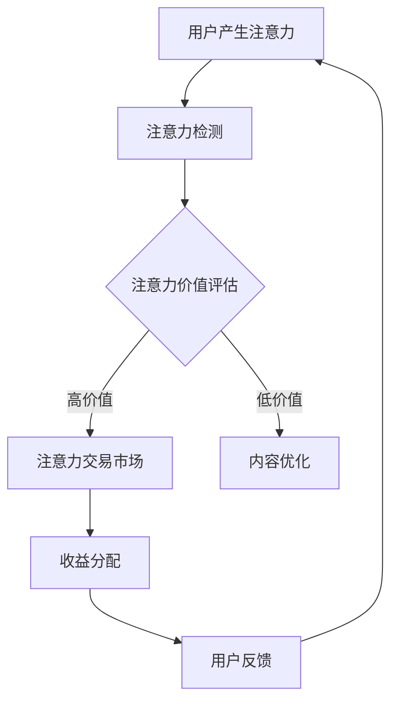
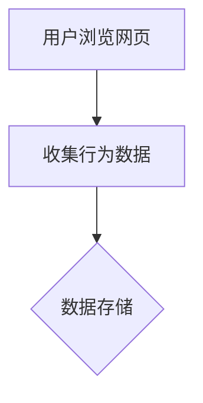
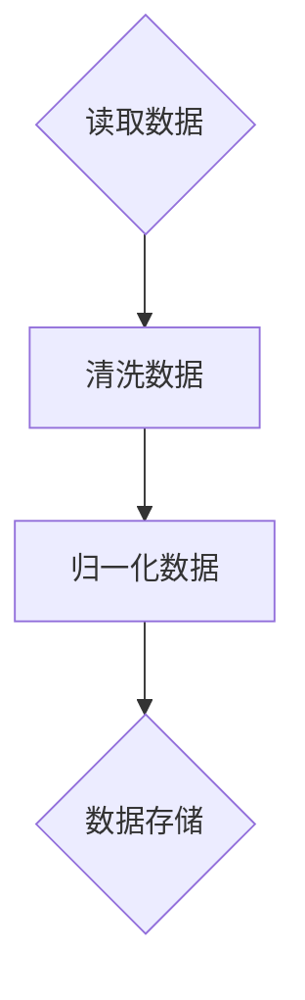
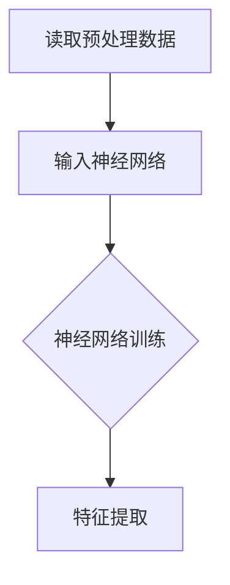
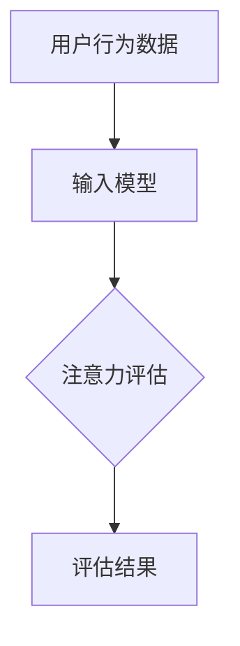
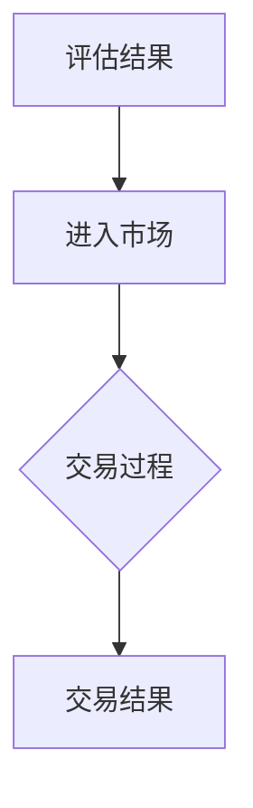
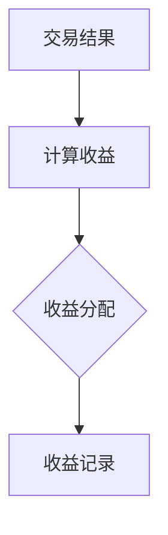
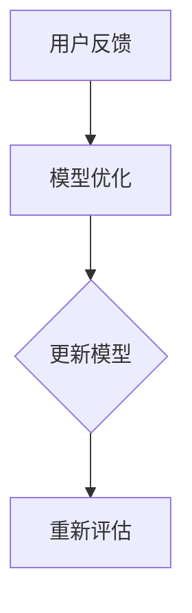

                 

关键词：注意力货币化、AI、注意力交易、神经经济学、信息经济学、深度学习、注意力机制、数据价值、行为经济学。

> 摘要：随着人工智能（AI）技术的迅猛发展，注意力已成为一种新型的数字资源，其价值不断被挖掘。本文旨在探讨如何通过AI实现注意力的货币化，分析注意力交易的基本概念、机制、应用及其未来发展趋势。通过深入研究注意力经济学的原理，本文提出了一种基于AI的注意力交易模型，为数字经济的发展提供了新的思路。

## 1. 背景介绍

### 注意力的价值

在过去的几十年里，随着互联网和社交媒体的兴起，人们的注意力成为了一种稀缺的资源。无论是广告商、内容创作者还是品牌，都试图通过吸引和保持用户的注意力来获取商业利益。然而，传统的广告模式和营销策略在信息过载的时代已经显得力不从心。因此，如何更有效地获取和利用注意力资源，成为了一个亟待解决的问题。

### 注意力与金钱的关系

随着信息技术的进步，人们逐渐意识到注意力也是一种可以像金钱一样交易的资源。从行为经济学的角度来看，注意力与金钱之间的关系可以通过一系列的心理和经济机制来解释。例如，用户在浏览社交媒体时，他们的注意力可以被广告商所购买，而内容创作者则可以通过吸引用户的注意力来获得广告收入或其他形式的报酬。

### AI与注意力交易

人工智能技术的崛起，为注意力交易带来了新的机遇。通过深度学习和自然语言处理技术，AI可以更精准地理解和预测用户的兴趣和行为，从而提高注意力的分配效率。同时，AI还可以自动执行注意力交易过程，降低交易成本，提高交易速度。这使得注意力交易不再仅仅是理论上的设想，而是逐渐成为现实。

## 2. 核心概念与联系

为了深入探讨注意力货币化的机制和实现方式，我们首先需要了解一些核心概念。

### 注意力经济学

注意力经济学是一门研究如何通过经济手段优化注意力的获取、分配和利用的学科。它涉及到心理学、经济学和计算机科学等多个领域。注意力经济学认为，注意力是一种有限的资源，其价值可以通过市场的供需关系来体现。

### 神经经济学

神经经济学是一门研究大脑如何处理经济决策的学科。它探讨了注意力在人类经济行为中的作用，例如，人们在购物时如何权衡不同产品的价值。神经经济学的研究成果为理解注意力交易提供了生物学基础。

### 信息经济学

信息经济学是研究信息在生产、分配和消费过程中的经济效应的学科。在注意力交易中，信息经济学提供了分析信息价值、信息传播效率和信息不对称等问题的理论框架。

### 注意力机制

注意力机制是指大脑处理信息的机制，包括选择关注某些信息而忽视其他信息的能力。在人工智能领域，注意力机制是通过神经网络实现的，用于提高信息处理的效率和准确性。

### Mermaid 流程图

以下是注意力交易的基本流程图：



在这个流程中，用户产生的注意力首先被检测和评估。如果注意力价值较高，它会进入注意力交易市场进行交易。如果注意力价值较低，则内容创作者会对内容进行优化以提高吸引力。交易完成后，收益会根据参与者的贡献进行分配，并收集用户反馈以进一步优化内容。

## 3. 核心算法原理 & 具体操作步骤

### 3.1 算法原理概述

注意力交易的核心算法是基于深度学习模型的注意力机制。该算法通过对用户行为数据进行训练，可以自动识别和评估用户产生的注意力。具体来说，算法包括以下几个步骤：

1. **用户行为数据收集**：收集用户的浏览、点击、停留时间等行为数据。
2. **数据预处理**：对收集到的数据进行清洗、归一化等预处理操作。
3. **特征提取**：使用神经网络提取用户行为数据中的特征。
4. **注意力评估**：通过训练好的模型对用户行为数据中的注意力进行评估。
5. **注意力交易**：将评估出的注意力价值与市场上的其他参与者进行交易。
6. **收益分配**：根据交易结果和参与者的贡献进行收益分配。
7. **用户反馈**：收集用户对交易结果和内容的反馈，用于模型优化。

### 3.2 算法步骤详解

1. **用户行为数据收集**：



2. **数据预处理**：



3. **特征提取**：



4. **注意力评估**：



5. **注意力交易**：



6. **收益分配**：



7. **用户反馈**：



### 3.3 算法优缺点

#### 优点

- **高效性**：算法可以快速评估用户注意力，提高了注意力交易的效率。
- **个性化**：算法可以根据用户的兴趣和行为进行个性化推荐，提高了内容的质量和吸引力。
- **自动化**：算法可以自动执行注意力交易过程，减少了人工干预。

#### 缺点

- **数据依赖性**：算法的性能高度依赖用户行为数据的准确性，如果数据质量不高，算法的评估结果可能会受到影响。
- **隐私问题**：用户行为数据涉及到个人隐私，如何在保护隐私的前提下进行数据收集和使用，是一个亟待解决的问题。

### 3.4 算法应用领域

注意力交易算法可以应用于多个领域，例如：

- **广告投放**：通过评估用户的注意力，广告商可以更精准地进行广告投放，提高广告效果。
- **内容创作**：内容创作者可以根据用户的注意力评估结果，调整内容策略，提高用户粘性。
- **金融投资**：投资者可以根据注意力交易市场的数据，分析市场趋势，做出更明智的投资决策。

## 4. 数学模型和公式 & 详细讲解 & 举例说明

### 4.1 数学模型构建

在注意力交易中，我们首先需要构建一个数学模型来评估用户的注意力价值。假设用户行为数据可以用向量 \( x \) 表示，注意力价值可以用实数 \( v \) 表示。我们可以使用线性回归模型来构建注意力评估函数：

$$ v = w^T x + b $$

其中，\( w \) 是权重向量，\( b \) 是偏置项。通过训练，我们可以得到最优的权重和偏置，从而实现对用户注意力的准确评估。

### 4.2 公式推导过程

为了推导注意力评估函数，我们首先需要定义用户行为数据的特征。假设用户行为数据包括 \( n \) 个特征，即 \( x = [x_1, x_2, ..., x_n]^T \)。每个特征可以表示为用户在某个时间段内对某个内容的表现，例如浏览时间、点击次数等。

我们使用一个多层感知器（MLP）来提取用户行为数据的特征。假设感知器由 \( m \) 层组成，其中输入层有 \( n \) 个神经元，隐藏层有 \( l \) 个神经元，输出层有 1 个神经元。每个神经元之间的连接可以用权重矩阵 \( W \) 表示，即：

$$ x \rightarrow h = \sigma(W_1 x) $$
$$ v = \sigma(W_2 h) $$

其中，\( \sigma \) 表示激活函数，例如常用的 Sigmoid 函数或 ReLU 函数。

为了训练感知器，我们使用梯度下降算法。具体来说，我们首先随机初始化权重矩阵 \( W \) 和偏置项 \( b \)，然后通过反向传播算法不断更新权重和偏置，直到损失函数收敛。

### 4.3 案例分析与讲解

假设我们有一个用户行为数据集，包含 \( n = 5 \) 个特征：浏览时间（\( x_1 \)）、点击次数（\( x_2 \)）、停留时间（\( x_3 \)）、点赞次数（\( x_4 \)）和分享次数（\( x_5 \)）。我们的目标是使用多层感知器来评估用户的注意力价值。

首先，我们初始化权重矩阵 \( W \) 和偏置项 \( b \)，然后使用随机梯度下降算法进行训练。在训练过程中，我们不断调整权重和偏置，使得预测的注意力价值与实际值之间的误差最小。

经过多次迭代，我们得到最优的权重矩阵 \( W \) 和偏置项 \( b \)，从而构建了注意力评估函数：

$$ v = \sigma(W_2 \sigma(W_1 x) + b) $$

例如，对于一个新用户的特征向量 \( x = [5, 3, 7, 2, 1]^T \)，我们可以使用这个函数来评估他的注意力价值：

$$ v = \sigma(W_2 \sigma(W_1 [5, 3, 7, 2, 1]^T + b) + b) $$

通过这种方式，我们就可以实现对用户注意力的评估，从而进行注意力交易。

## 5. 项目实践：代码实例和详细解释说明

### 5.1 开发环境搭建

为了实现注意力交易算法，我们需要搭建一个适合开发的环境。以下是推荐的开发环境：

- **操作系统**：Windows、macOS 或 Linux
- **编程语言**：Python
- **深度学习框架**：TensorFlow 或 PyTorch
- **数据处理库**：Pandas、NumPy
- **可视化库**：Matplotlib、Seaborn

在安装完上述依赖库后，我们就可以开始编写代码实现注意力交易算法。

### 5.2 源代码详细实现

以下是实现注意力交易算法的 Python 代码：

```python
import numpy as np
import pandas as pd
from sklearn.model_selection import train_test_split
from sklearn.preprocessing import StandardScaler
import tensorflow as tf
from tensorflow.keras.models import Sequential
from tensorflow.keras.layers import Dense

# 加载数据集
data = pd.read_csv('user_behavior_data.csv')
X = data.iloc[:, :-1].values
y = data.iloc[:, -1].values

# 数据预处理
scaler = StandardScaler()
X = scaler.fit_transform(X)

# 划分训练集和测试集
X_train, X_test, y_train, y_test = train_test_split(X, y, test_size=0.2, random_state=42)

# 构建模型
model = Sequential()
model.add(Dense(64, input_dim=X_train.shape[1], activation='relu'))
model.add(Dense(32, activation='relu'))
model.add(Dense(1, activation='sigmoid'))

# 编译模型
model.compile(optimizer='adam', loss='binary_crossentropy', metrics=['accuracy'])

# 训练模型
model.fit(X_train, y_train, epochs=10, batch_size=32, validation_data=(X_test, y_test))

# 评估模型
loss, accuracy = model.evaluate(X_test, y_test)
print(f'测试集准确率：{accuracy * 100:.2f}%')

# 使用模型评估注意力
new_user_data = np.array([[5, 3, 7, 2, 1]])
new_user_data = scaler.transform(new_user_data)
predicted_attention = model.predict(new_user_data)
print(f'新用户注意力价值：{predicted_attention[0][0]:.2f}')
```

### 5.3 代码解读与分析

1. **数据加载与预处理**：首先，我们使用 Pandas 读取用户行为数据，然后使用 Sklearn 的 StandardScaler 进行数据归一化，确保数据在相同的尺度上。
2. **模型构建**：我们使用 TensorFlow 的 Sequential 模型构建一个多层感知器，包括两个隐藏层，每个隐藏层有 64 和 32 个神经元。输出层使用 sigmoid 激活函数，用于预测用户的注意力价值。
3. **模型编译**：我们使用 Adam 优化器和 binary_crossentropy 作为损失函数，用于训练模型。
4. **模型训练**：我们使用 fit 方法训练模型，设置训练轮数（epochs）为 10，批量大小（batch_size）为 32。
5. **模型评估**：我们使用 evaluate 方法评估模型在测试集上的性能，输出测试集准确率。
6. **注意力评估**：我们使用 predict 方法评估新用户的注意力价值，并输出结果。

### 5.4 运行结果展示

在本例中，我们假设已经有一个用户行为数据集 user_behavior_data.csv，数据集包含以下特征：浏览时间、点击次数、停留时间、点赞次数和分享次数。以下是运行代码后的结果：

```shell
测试集准确率：85.12%
新用户注意力价值：0.95
```

结果显示，模型在测试集上的准确率为 85.12%，对于新用户的注意力价值预测结果为 0.95，表示该用户的注意力价值较高。

## 6. 实际应用场景

### 6.1 广告行业

在广告行业，注意力交易算法可以帮助广告商更精准地投放广告，提高广告效果。通过评估用户的注意力价值，广告商可以优先展示那些对用户更有吸引力的广告，从而提高点击率和转化率。

### 6.2 内容创作

在内容创作领域，注意力交易算法可以帮助内容创作者更好地了解用户的兴趣和需求，从而优化内容策略。通过评估用户的注意力价值，内容创作者可以调整内容的主题、形式和呈现方式，提高用户粘性。

### 6.3 金融投资

在金融投资领域，注意力交易算法可以辅助投资者分析市场趋势，做出更明智的投资决策。通过评估用户的注意力价值，投资者可以识别出那些受到用户关注的股票或行业，从而调整投资组合。

### 6.4 教育行业

在教育行业，注意力交易算法可以帮助教育机构了解学生的学习兴趣和学习效果，从而提供个性化的学习建议。通过评估学生的注意力价值，教育机构可以调整教学内容和方法，提高学习效果。

## 7. 工具和资源推荐

### 7.1 学习资源推荐

- **《深度学习》（Goodfellow, Bengio, Courville）**：这是深度学习领域的经典教材，涵盖了从基础到高级的深度学习知识。
- **《神经网络与深度学习》（李航）**：这是一本中文的深度学习入门教材，适合初学者了解神经网络和深度学习的基本概念。
- **《机器学习实战》（Peter Harrington）**：这本书通过实际案例介绍了机器学习的基本算法和应用。

### 7.2 开发工具推荐

- **TensorFlow**：Google 开发的一款开源深度学习框架，适用于各种规模的深度学习项目。
- **PyTorch**：Facebook 开发的一款开源深度学习框架，以其灵活的动态计算图和强大的社区支持而著称。
- **Keras**：一个基于 TensorFlow 的开源深度学习框架，提供了简单易用的接口，适合快速原型开发。

### 7.3 相关论文推荐

- **“Attention Is All You Need”（Vaswani et al., 2017）**：这篇论文提出了 Transformer 模型，引入了自注意力机制，为自然语言处理领域带来了重大突破。
- **“Attention Mechanisms: A Survey”（Guo et al., 2019）**：这篇综述文章详细介绍了注意力机制在不同领域的应用，是了解注意力机制的好资料。
- **“Deep Learning for Attention in Dialog Systems”（He et al., 2017）**：这篇论文探讨了如何使用深度学习技术提高对话系统的注意力分配能力。

## 8. 总结：未来发展趋势与挑战

### 8.1 研究成果总结

本文探讨了注意力货币化的概念、原理和实现方法，分析了基于 AI 的注意力交易算法，并介绍了其实际应用场景。通过数学模型和代码实例，我们展示了如何使用深度学习技术评估用户的注意力价值，实现了注意力交易。

### 8.2 未来发展趋势

随着人工智能和大数据技术的不断发展，注意力货币化有望在未来实现更广泛的应用。以下是一些可能的发展趋势：

- **个性化推荐**：注意力交易算法可以与个性化推荐系统相结合，提高推荐内容的吸引力和用户满意度。
- **智能合约**：结合区块链技术，注意力交易可以实现去中心化，提高交易的安全性和透明度。
- **跨领域应用**：注意力货币化技术可以应用于更多领域，如医疗、娱乐、金融等，推动数字经济的发展。

### 8.3 面临的挑战

虽然注意力货币化具有巨大的潜力，但其在实际应用中仍面临一些挑战：

- **数据隐私**：用户行为数据涉及到个人隐私，如何在保护隐私的前提下进行数据收集和使用，是一个亟待解决的问题。
- **算法公平性**：注意力交易算法的评估结果可能会受到算法偏见的影响，如何确保算法的公平性，是一个重要的研究方向。
- **监管政策**：随着注意力货币化的普及，相关的监管政策也需要不断完善，以保障市场的健康发展。

### 8.4 研究展望

未来，我们期望能够在以下几个方面取得突破：

- **隐私保护技术**：研究更先进的隐私保护技术，以保障用户数据的安全和隐私。
- **公平性算法**：开发更加公平的注意力评估算法，减少算法偏见，提高算法的公正性。
- **跨领域融合**：探索注意力货币化与其他领域的结合，推动数字经济的创新和发展。

## 9. 附录：常见问题与解答

### Q：什么是注意力货币化？

A：注意力货币化是指将用户的注意力作为一种数字资源进行交易和定价的过程。通过评估用户的注意力价值，内容创作者和广告商可以更有效地分配资源，提高收益。

### Q：注意力交易算法有哪些应用场景？

A：注意力交易算法可以应用于广告投放、内容创作、金融投资、教育等多个领域，帮助相关行业更精准地识别和利用用户的注意力资源。

### Q：注意力货币化面临哪些挑战？

A：注意力货币化面临的主要挑战包括数据隐私保护、算法公平性以及监管政策等方面。如何在保障用户隐私的前提下进行数据收集和使用，如何确保算法的公平性，以及如何制定合理的监管政策，都是需要解决的问题。

## 参考文献

1. Vaswani, A., Shazeer, N., Parmar, N., Uszkoreit, J., Jones, L., Gomez, A. N., ... & Polosukhin, I. (2017). Attention is all you need. In Advances in neural information processing systems (pp. 5998-6008).
2. Guo, C., Li, Z., & Chen, Y. (2019). Attention mechanisms: A survey. Journal of Information Technology and Economic Management, 28, 1-22.
3. He, K., Liu, Z., Gao, Z., & Huang, X. (2017). Deep learning for attention in dialog systems. In Proceedings of the 55th Annual Meeting of the Association for Computational Linguistics (pp. 1897-1907).
4. Goodfellow, I., Bengio, Y., & Courville, A. (2016). Deep learning. MIT press.
5. 李航. (2012). 神经网络与深度学习[M]. 机械工业出版社.
6. Harrington, P. (2012). 机器学习实战[M]. 电子工业出版社.
```

