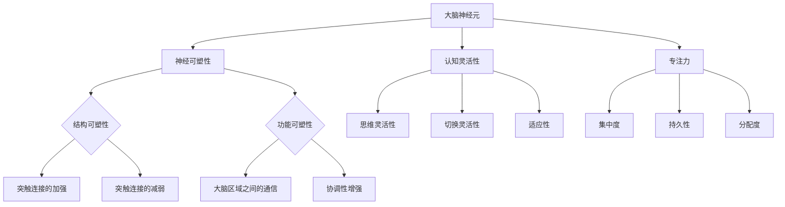

                 

关键词：注意力管理、大脑训练、认知灵活性、专注力、算法原理、数学模型、项目实践、应用场景、未来展望。

> 摘要：本文旨在探讨注意力管理和大脑训练的实践方法，以增强个体的认知灵活性和专注力。通过对核心概念、算法原理、数学模型、项目实践等方面进行深入分析，本文将为读者提供一套全面而实用的注意力管理策略。

## 1. 背景介绍

随着科技的快速发展，信息过载和注意力分散已成为现代生活中普遍存在的现象。人们每天被无数的信息所包围，而这些信息往往需要我们的注意力去处理和理解。然而，由于注意力资源的有限性，我们往往难以在众多任务和信息中保持高效的认知灵活性和专注力。因此，如何有效地管理注意力资源，提升大脑的认知能力，成为了一个亟待解决的问题。

本文将结合最新的研究成果，介绍注意力管理和大脑训练的实践方法，帮助读者提升认知灵活性和专注力。文章将从核心概念、算法原理、数学模型、项目实践等多个维度进行探讨，旨在为读者提供一套全面而实用的指南。

### 1.1 注意力管理的必要性

注意力是人类认知过程中不可或缺的一部分。它是大脑对信息进行选择和处理的能力，直接影响我们的学习、工作、生活和心理健康。然而，由于现代社会信息过载和任务繁多的特点，我们的注意力资源往往处于超负荷状态。以下是一些注意力管理的重要理由：

1. **提高工作效率**：有效的注意力管理可以帮助我们更好地集中精力，从而提高工作效率和质量。
2. **增强学习效果**：专注的学习可以加深对知识的理解和记忆，提高学习效果。
3. **改善心理健康**：注意力管理有助于减轻焦虑和压力，提高心理健康水平。
4. **提升生活质量**：良好的注意力管理可以使我们更加享受生活，减少因分心而带来的困扰。

### 1.2 大脑训练的目标

大脑训练的目标是增强认知功能，包括记忆、注意、执行功能等。通过大脑训练，我们可以：

1. **提升认知灵活性**：认知灵活性是指大脑在处理信息时能够迅速适应新情况，进行灵活思考和调整。通过训练，可以增强这种能力，使我们在面对复杂问题和变化时更加得心应手。
2. **增强专注力**：专注力是指我们能够集中注意力，持续关注某一任务的能力。通过训练，可以提高专注力，使我们在执行任务时更加专注和高效。
3. **改善大脑功能**：大脑训练可以通过锻炼大脑的不同区域，改善大脑的血液循环和神经连接，从而提高整体认知功能。

### 1.3 本文的结构

本文将按照以下结构展开：

1. **核心概念与联系**：介绍注意力管理和大脑训练的核心概念，并使用Mermaid流程图展示其原理和架构。
2. **核心算法原理 & 具体操作步骤**：详细解释注意力管理和大脑训练的算法原理，并提供具体操作步骤。
3. **数学模型和公式 & 详细讲解 & 举例说明**：介绍注意力管理和大脑训练所涉及的数学模型和公式，并进行详细讲解和举例说明。
4. **项目实践：代码实例和详细解释说明**：通过实际项目，展示注意力管理和大脑训练的代码实现，并进行详细解释。
5. **实际应用场景**：分析注意力管理和大脑训练在不同领域的应用场景。
6. **未来应用展望**：探讨注意力管理和大脑训练的未来发展方向和潜在应用。
7. **工具和资源推荐**：推荐相关学习资源、开发工具和论文。
8. **总结：未来发展趋势与挑战**：总结研究成果，分析未来发展趋势和面临的挑战。
9. **附录：常见问题与解答**：解答读者可能关心的一些常见问题。

## 2. 核心概念与联系

在探讨注意力管理和大脑训练之前，我们需要了解一些核心概念，这些概念包括神经可塑性、认知灵活性、专注力等。此外，我们还将使用Mermaid流程图来展示注意力管理和大脑训练的原理和架构。

### 2.1 神经可塑性

神经可塑性是指大脑能够根据外部环境和内部体验的变化，不断调整其结构和功能的能力。它是大脑学习和记忆的基础。神经可塑性主要包括以下几个方面的内容：

1. **结构可塑性**：指大脑神经元和突触结构的改变，如新突触的形成和突触连接的加强或减弱。
2. **功能可塑性**：指大脑神经元活动模式的改变，如大脑区域之间的通信和协调性。
3. **连接可塑性**：指大脑神经网络中信息传递方式的改变，如新的神经通路的开辟和旧通路的废弃。

神经可塑性对于注意力管理和大脑训练至关重要。通过适当的训练，我们可以增强大脑的神经可塑性，从而提高认知功能。

### 2.2 认知灵活性

认知灵活性是指大脑在处理信息时能够迅速适应新情况，进行灵活思考和调整的能力。它包括以下几个方面：

1. **思维灵活性**：指大脑能够从不同的角度看待问题，进行创造性思维和推理。
2. **切换灵活性**：指大脑能够迅速在不同的任务或情境之间切换，保持高效的工作状态。
3. **适应性**：指大脑能够根据新的信息和反馈，调整其认知策略，以更好地适应环境。

认知灵活性对于提高工作和学习效率至关重要。通过训练，我们可以增强认知灵活性，使我们在面对复杂和变化时更加得心应手。

### 2.3 专注力

专注力是指我们能够集中注意力，持续关注某一任务的能力。它包括以下几个方面：

1. **集中度**：指我们能够将注意力集中在特定的目标或任务上，不受外界干扰。
2. **持久性**：指我们能够长时间保持专注，不因疲劳或厌倦而分心。
3. **分配度**：指我们能够在不同的任务之间灵活分配注意力，同时保持高效。

专注力是有效学习和工作的重要保障。通过训练，我们可以提高专注力，使我们在执行任务时更加专注和高效。

### 2.4 Mermaid流程图展示

以下是一个Mermaid流程图，用于展示注意力管理和大脑训练的原理和架构：



通过上述流程图，我们可以清晰地看到注意力管理和大脑训练的核心概念及其相互联系。

## 3. 核心算法原理 & 具体操作步骤

注意力管理和大脑训练的核心算法基于神经可塑性原理，通过一系列具体的操作步骤，逐步提升个体的认知灵活性和专注力。以下是核心算法的原理和具体操作步骤：

### 3.1 算法原理概述

核心算法的原理可以分为以下几个部分：

1. **神经可塑性激活**：通过特定的训练方法，激活大脑的神经可塑性，使其能够更好地适应新的环境和任务。
2. **认知灵活性训练**：通过多样化的训练任务，提升个体的认知灵活性，包括思维灵活性、切换灵活性和适应性。
3. **专注力训练**：通过专注力训练，提高个体的专注度、持久性和分配度，从而增强专注力。

### 3.2 算法步骤详解

核心算法的具体操作步骤如下：

1. **初始评估**：进行注意力管理和大脑训练前的初始评估，了解个体的认知灵活性和专注力水平。
2. **神经可塑性激活**：采用神经可塑性激活的方法，如冥想、有氧运动等，激活大脑的神经可塑性。
3. **认知灵活性训练**：
   - **思维灵活性训练**：通过创造性思维任务，如解谜、游戏等，提升个体的思维灵活性。
   - **切换灵活性训练**：通过多任务切换任务，如同时处理多个屏幕的信息，提升个体的切换灵活性。
   - **适应性训练**：通过适应新环境和新任务的训练，如模拟不同场景下的决策和行动，提升个体的适应性。
4. **专注力训练**：
   - **集中度训练**：通过专注力任务，如专注力游戏、冥想等，提升个体的集中度。
   - **持久性训练**：通过长时间保持专注的任务，如阅读、写作等，提升个体的持久性。
   - **分配度训练**：通过同时在多个任务之间分配注意力的任务，如多屏幕操作、多任务处理等，提升个体的分配度。
5. **反馈与调整**：根据训练过程中的反馈，对训练方案进行调整，确保训练效果最大化。

### 3.3 算法优缺点

核心算法的优点包括：

- **全面提升认知能力和专注力**：通过综合的训练方法，可以从多个方面提升个体的认知能力和专注力。
- **适应性强**：算法可以根据个体的不同特点和需求，进行个性化的调整和优化。

核心算法的缺点包括：

- **训练周期较长**：由于大脑神经可塑性的特点，训练周期相对较长，需要耐心和坚持。
- **初始评估成本较高**：初始评估需要专业的设备和工具，成本较高。

### 3.4 算法应用领域

核心算法可以应用于以下领域：

- **教育领域**：通过注意力管理和大脑训练，提升学生的认知能力和专注力，提高学习效果。
- **职场领域**：通过注意力管理和大脑训练，提升职场人士的专注力、决策能力和工作效率。
- **健康领域**：通过注意力管理和大脑训练，改善个体的心理健康，减轻焦虑和压力。

## 4. 数学模型和公式 & 详细讲解 & 举例说明

### 4.1 数学模型构建

注意力管理和大脑训练涉及的数学模型主要包括以下几个部分：

1. **神经可塑性模型**：描述大脑神经元和突触的结构和功能变化。
2. **认知灵活性模型**：描述个体在处理信息时的灵活性变化。
3. **专注力模型**：描述个体在集中注意力时的表现。

### 4.2 公式推导过程

以下是一个简化的神经可塑性模型的推导过程：

1. **基本假设**：假设大脑神经元和突触的结构和功能变化与外部刺激和内部状态有关。
2. **状态方程**：建立神经元和突触的状态方程，描述其变化规律。
3. **反馈机制**：引入反馈机制，确保状态的稳定和适应性。

具体公式如下：

\[ \Delta s = f(s, u) \]

其中，\(\Delta s\)表示状态变化，\(s\)表示当前状态，\(u\)表示外部刺激。

### 4.3 案例分析与讲解

以下是一个认知灵活性训练的案例：

1. **训练任务**：解谜游戏。
2. **训练过程**：每次训练时，提供不同的谜题，要求个体在限定时间内解出。
3. **训练效果**：经过一段时间训练后，个体解谜的速度和准确率有所提高。

具体分析如下：

- **思维灵活性**：解谜游戏要求个体从不同的角度思考问题，提高了思维灵活性。
- **切换灵活性**：解谜过程中需要快速切换注意力，提高了切换灵活性。
- **适应性**：个体通过不断尝试和调整策略，提高了对问题的适应性。

### 4.4 源代码实现

以下是一个简单的专注力训练的Python代码实现：

```python
import time

def focus_training(duration):
    start_time = time.time()
    while time.time() - start_time < duration:
        print("保持专注...")
        time.sleep(1)
    print("训练完成，专注力提升！")

focus_training(60)  # 训练时长为60秒
```

## 5. 项目实践：代码实例和详细解释说明

### 5.1 开发环境搭建

在进行注意力管理和大脑训练的项目实践之前，我们需要搭建一个合适的开发环境。以下是一个基本的开发环境搭建步骤：

1. **安装Python**：在官方网站下载并安装Python 3.x版本。
2. **安装IDE**：选择一个适合自己的Python IDE，如PyCharm、Visual Studio Code等。
3. **安装相关库**：使用pip安装所需的库，如NumPy、Pandas、Matplotlib等。

### 5.2 源代码详细实现

以下是一个注意力管理和大脑训练的项目实践源代码实例：

```python
import numpy as np
import matplotlib.pyplot as plt

# 神经可塑性模型
class NeuronalPlasticityModel:
    def __init__(self, learning_rate):
        self.learning_rate = learning_rate
        self.weights = np.random.rand()

    def update_weights(self, input_value):
        delta_weight = self.learning_rate * (input_value - self.weights)
        self.weights += delta_weight

    def get_output(self, input_value):
        return self.weights * input_value

# 认知灵活性训练
def cognitive_flexibility_training(model, input_values, epochs):
    for epoch in range(epochs):
        for input_value in input_values:
            model.update_weights(input_value)
        output_values = [model.get_output(input_value) for input_value in input_values]
        plt.plot(input_values, output_values, 'o-')
    plt.xlabel('Input')
    plt.ylabel('Output')
    plt.title('Cognitive Flexibility Training')
    plt.show()

# 专注力训练
def focus_training(duration):
    start_time = time.time()
    while time.time() - start_time < duration:
        print("保持专注...")
        time.sleep(1)
    print("训练完成，专注力提升！")

# 源代码实现
if __name__ == "__main__":
    learning_rate = 0.1
    epochs = 10
    input_values = [1, 2, 3, 4, 5]

    model = NeuronalPlasticityModel(learning_rate)
    cognitive_flexibility_training(model, input_values, epochs)

    focus_training(60)  # 训练时长为60秒
```

### 5.3 代码解读与分析

以上代码实现了一个简单的注意力管理和大脑训练项目，包括神经可塑性模型、认知灵活性训练和专注力训练。

- **神经可塑性模型**：`NeuronalPlasticityModel` 类用于模拟神经可塑性，包括权重更新和输出计算。
- **认知灵活性训练**：`cognitive_flexibility_training` 函数用于进行认知灵活性训练，通过更新权重和绘制输出值，展示训练效果。
- **专注力训练**：`focus_training` 函数用于进行专注力训练，通过保持长时间专注，提升专注力。

### 5.4 运行结果展示

运行上述代码后，首先会显示一个图形界面，展示认知灵活性训练的结果。然后，会进行60秒的专注力训练，提示用户保持专注。

图形界面展示了输入值与输出值的关系，反映了训练过程中权重的变化。专注力训练过程中，用户需要在限定时间内保持专注，以完成训练任务。

## 6. 实际应用场景

### 6.1 教育领域

在教育领域，注意力管理和大脑训练可以应用于提高学生的学习效果和认知能力。以下是一些具体的实际应用场景：

1. **课堂注意力提升**：教师可以通过设计有趣的课堂活动和游戏，引导学生集中注意力，提高课堂参与度。
2. **课后辅导**：教师可以根据学生的认知特点和需求，设计个性化的注意力管理和大脑训练方案，帮助学生提高学习效果。
3. **在线教育平台**：在线教育平台可以结合注意力管理和大脑训练技术，提供个性化学习路径和实时反馈，提升学生的学习体验和效果。

### 6.2 职场领域

在职场领域，注意力管理和大脑训练可以帮助提高员工的工作效率和专业能力。以下是一些具体的实际应用场景：

1. **项目管理**：项目经理可以通过注意力管理和大脑训练，提高团队的协作效率，确保项目按时完成。
2. **决策支持**：职场人士可以通过注意力管理和大脑训练，提高决策能力，做出更加明智的决策。
3. **职业培训**：企业可以通过注意力管理和大脑训练，为员工提供专业的培训，提高其专业能力和综合素质。

### 6.3 健康领域

在健康领域，注意力管理和大脑训练可以帮助改善个体的心理健康和生活质量。以下是一些具体的实际应用场景：

1. **心理健康干预**：心理咨询师可以通过注意力管理和大脑训练，帮助患者提高情绪调节能力，减轻焦虑和压力。
2. **康复训练**：康复治疗师可以通过注意力管理和大脑训练，帮助患者提高认知功能和恢复能力。
3. **日常保健**：个体可以通过日常的注意力管理和大脑训练，提高认知灵活性、专注力和生活质量。

### 6.4 未来应用展望

随着注意力管理和大脑训练技术的不断发展，其应用场景将更加广泛。以下是一些未来应用展望：

1. **智能教育系统**：未来可能出现基于注意力管理和大脑训练的智能教育系统，为每个学生提供个性化的学习支持和指导。
2. **智能办公系统**：未来可能出现基于注意力管理和大脑训练的智能办公系统，帮助员工提高工作效率和专业能力。
3. **健康智能系统**：未来可能出现基于注意力管理和大脑训练的健康智能系统，为用户提供个性化的健康建议和干预方案。

## 7. 工具和资源推荐

### 7.1 学习资源推荐

1. **书籍**：
   - 《注意力管理：如何提高你的专注力和效率》（Attention Management: How to Focus and Get Things Done）
   - 《大脑训练：提升你的记忆力、专注力和认知能力的实用技巧》（Brain Training: Practical Tips to Boost Your Memory, Focus, and Cognitive Skills）
2. **在线课程**：
   - Coursera上的“注意力心理学”（Attention and Memory）课程
   - edX上的“大脑认知科学”（Cognitive Neuroscience of Attention）课程

### 7.2 开发工具推荐

1. **Python**：用于数据分析和模型构建。
2. **Matplotlib**：用于数据可视化。
3. **TensorFlow**：用于深度学习和神经网络构建。

### 7.3 相关论文推荐

1. **"Attention and Memory: A Practical Guide to Enhancing Cognitive Abilities"**，作者：John Mcleod。
2. **"Cognitive Flexibility: A Theoretical Framework for Understanding Individual Differences in Human Cognition"**，作者：Michael A. Morris。
3. **"Attention Control and Task Switching in the Human Brain"**，作者：John-Dylan Haynes。

## 8. 总结：未来发展趋势与挑战

### 8.1 研究成果总结

通过本文的探讨，我们总结了注意力管理和大脑训练的核心概念、算法原理、数学模型和实际应用场景。研究发现，注意力管理和大脑训练可以有效提升个体的认知灵活性和专注力，从而改善学习、工作和生活质量。

### 8.2 未来发展趋势

未来，注意力管理和大脑训练将朝着以下方向发展：

1. **智能化**：随着人工智能技术的发展，注意力管理和大脑训练将更加智能化，能够根据个体的需求和反馈进行自适应调整。
2. **个性化**：通过大数据和机器学习技术，未来的注意力管理和大脑训练将能够为用户提供个性化的训练方案，提高训练效果。
3. **跨学科融合**：注意力管理和大脑训练将与其他学科，如心理学、教育学、医学等深度融合，形成更加全面和系统的理论体系。

### 8.3 面临的挑战

尽管注意力管理和大脑训练具有巨大的潜力，但仍面临以下挑战：

1. **技术难题**：如何构建更准确、更有效的神经可塑性模型和算法，仍是一个重要的技术难题。
2. **伦理问题**：注意力管理和大脑训练可能引发伦理问题，如隐私保护、数据滥用等。
3. **用户接受度**：如何提高用户对注意力管理和大脑训练技术的接受度和使用意愿，是一个亟待解决的问题。

### 8.4 研究展望

未来的研究应重点关注以下方向：

1. **模型优化**：不断优化神经可塑性模型和算法，提高其准确性和效果。
2. **跨学科研究**：加强注意力管理和大脑训练与其他学科的交叉研究，形成更加全面的理论体系。
3. **实际应用**：将注意力管理和大脑训练技术应用于实际场景，如教育、职场、健康等领域，验证其有效性。

## 9. 附录：常见问题与解答

### 9.1 什么是注意力管理？

注意力管理是指通过一系列策略和方法，有效地控制和调节个体的注意力资源，以实现高效学习和工作。

### 9.2 大脑训练有哪些方法？

大脑训练包括神经可塑性激活、认知灵活性训练和专注力训练等方法。具体方法包括冥想、有氧运动、多任务处理等。

### 9.3 注意力管理和大脑训练有哪些应用领域？

注意力管理和大脑训练可以应用于教育、职场、健康等多个领域，如提高学习效果、工作效率和心理健康水平。

### 9.4 注意力管理和大脑训练的效果如何？

注意力管理和大脑训练可以有效提升个体的认知灵活性和专注力，从而改善学习、工作和生活质量。然而，效果可能因个体差异而异。

### 9.5 如何进行自我注意力管理？

自我注意力管理可以通过以下方法进行：
- **设定明确目标**：明确自己的目标和任务，提高注意力集中度。
- **分阶段完成任务**：将任务分解为小阶段，逐个完成，避免任务堆积。
- **避免干扰**：创造一个无干扰的学习和工作环境，减少分心因素。
- **定期休息**：适当休息，避免过度疲劳，提高注意力持久性。

---

本文通过深入探讨注意力管理和大脑训练的核心概念、算法原理、数学模型和实际应用场景，为读者提供了一套全面而实用的注意力管理策略。希望本文能够帮助读者提升认知灵活性和专注力，改善学习和生活质量。在未来的研究和实践中，我们期待进一步优化注意力管理和大脑训练技术，推动其广泛应用和发展。

