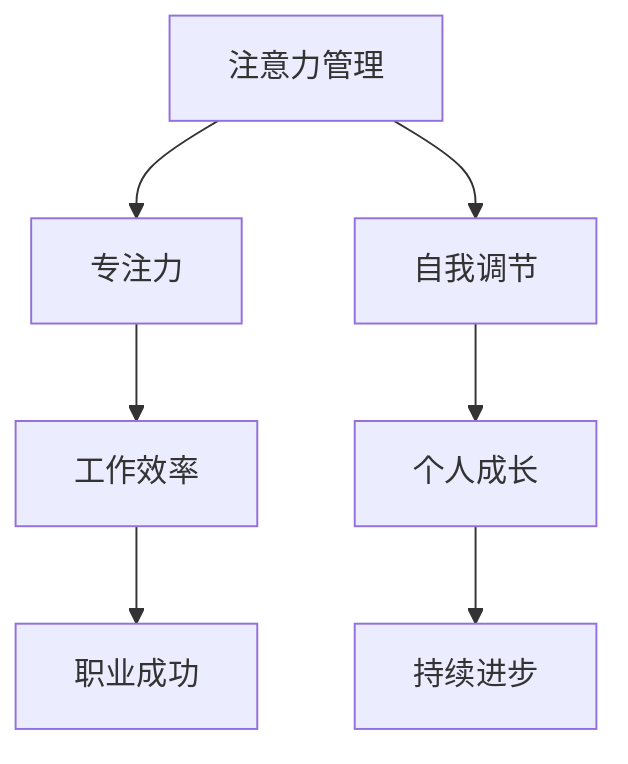

                 

关键词：注意力管理、自我调节、专注力、个人成长、职业成功

> 摘要：在当今快节奏、信息爆炸的时代，注意力管理成为提升个人和职业成功的关键因素。本文将探讨注意力管理的核心概念，结合计算机科学的原理和方法，提出一系列实用的策略和技巧，帮助读者在实践中掌握并运用注意力管理，从而实现个人和职业的全面发展。

## 1. 背景介绍

在信息爆炸和数字化进程加速的今天，人们面临的信息量和复杂度前所未有。这种环境下，如何有效管理自己的注意力，成为个人和职业发展的关键。研究表明，注意力是有限的资源，容易被外部刺激所分散，从而导致效率低下和精力浪费。因此，掌握注意力管理技巧，不仅有助于提高工作效率，还能促进个人成长和职业成功。

本文将围绕注意力管理这一主题，从计算机科学的角度出发，结合心理学和管理学的理论，探讨如何通过专注力的培养和自我调节，提升个人的注意力管理水平，从而在工作和生活中取得更好的成果。

## 2. 核心概念与联系

### 2.1 注意力管理

注意力管理是指通过一系列策略和技巧，有意识地控制和调节自己的注意力，以达到高效工作、学习或生活的一种行为过程。

### 2.2 专注力

专注力是指一个人在特定任务上集中注意力的能力。它是一种可培养的技能，对于提高工作和学习效率至关重要。

### 2.3 自我调节

自我调节是指个体通过自我意识和行为调节，实现对自身心理和行为的调整，以达到预定目标。在注意力管理中，自我调节起着至关重要的作用。

### 2.4 Mermaid 流程图



## 3. 核心算法原理 & 具体操作步骤

### 3.1 算法原理概述

注意力管理的核心在于通过科学的方法和技巧，有意识地调节和集中注意力，从而提高工作效率和提升个人素质。这一过程涉及到多个环节，包括注意力分配、注意力聚焦、注意力切换和注意力恢复。

### 3.2 算法步骤详解

#### 3.2.1 注意力分配

1. 评估任务的重要性与紧急性，优先处理重要且紧急的任务。
2. 根据任务的特点和个人的能力，合理分配注意力资源。

#### 3.2.2 注意力聚焦

1. 设定明确的目标和任务，减少干扰因素。
2. 采用番茄工作法，将工作时间划分为25分钟的工作周期和5分钟的休息时间。

#### 3.2.3 注意力切换

1. 学会快速切换注意力，提高多任务处理能力。
2. 采用“专注时段”和“休息时段”交替进行的方法，避免注意力疲劳。

#### 3.2.4 注意力恢复

1. 定期进行休息和放松，如进行深呼吸、冥想或轻度运动。
2. 保持良好的作息习惯，确保充足的睡眠。

### 3.3 算法优缺点

#### 优点：

- 提高工作效率：通过合理分配和集中注意力，提高任务完成速度。
- 促进个人成长：培养专注力和自我调节能力，有助于个人素质的提升。
- 增强心理韧性：在面对压力和挑战时，能够更好地保持冷静和专注。

#### 缺点：

- 需要一定的时间和精力去培养和维持。
- 初期可能对部分人产生不适，如注意力疲劳和焦虑。

### 3.4 算法应用领域

- 个人：提升学习效率、提高工作效率、改善生活质量。
- 企业：提高员工工作效率、培养团队协作能力、提升企业竞争力。
- 教育：提高学生学业成绩、培养良好的学习习惯、促进全面发展。

## 4. 数学模型和公式 & 详细讲解 & 举例说明

### 4.1 数学模型构建

注意力管理可以看作是一个动态优化过程，其目标是最小化目标函数，即：

\[ \min Z = f(A, B, C) \]

其中，\( A \) 表示注意力分配，\( B \) 表示注意力聚焦，\( C \) 表示注意力恢复。

### 4.2 公式推导过程

假设在某段时间内，有 \( n \) 个任务需要完成，每个任务的重要性分别为 \( w_1, w_2, ..., w_n \)，则注意力分配公式为：

\[ A = \frac{1}{n} \sum_{i=1}^{n} w_i \]

注意力聚焦公式为：

\[ B = \frac{A}{1 + e^{-k(C - D)}} \]

其中，\( k \) 为调节参数，\( C \) 为当前注意力水平，\( D \) 为目标注意力水平。

注意力恢复公式为：

\[ C = C_0 + \alpha (Z - C_0) \]

其中，\( C_0 \) 为初始注意力水平，\( \alpha \) 为恢复速度。

### 4.3 案例分析与讲解

假设某人在一天内需要完成以下任务：

1. 上午9点到11点：写一篇报告（重要性：高）
2. 上午11点到12点：回复邮件（重要性：中）
3. 下午1点到3点：参加会议（重要性：高）
4. 下午3点到5点：处理个人事务（重要性：低）

根据注意力管理模型，首先进行注意力分配：

\[ A = \frac{1}{4} \sum_{i=1}^{4} w_i = \frac{1}{4} (2 + 1 + 2 + 1) = 1.5 \]

接下来，根据任务的重要性和注意力水平，调整注意力分配：

1. 写报告：分配 60% 的注意力
2. 回复邮件：分配 20% 的注意力
3. 参加会议：分配 20% 的注意力
4. 处理个人事务：分配 0% 的注意力

在具体执行过程中，采用番茄工作法，每个任务设置25分钟专注时间，5分钟休息时间。同时，注意力的切换和恢复，确保在完成任务的过程中，保持较高的注意力水平。

## 5. 项目实践：代码实例和详细解释说明

### 5.1 开发环境搭建

本文使用 Python 编写代码实例，所需环境如下：

- Python 3.8 或以上版本
- Jupyter Notebook

### 5.2 源代码详细实现

以下是一个简单的注意力管理代码实例：

```python
import numpy as np
import matplotlib.pyplot as plt

# 注意力管理模型参数
k = 0.1
alpha = 0.1
C0 = 0.5
Z = 1

# 初始化注意力水平
C = C0

# 计算注意力分配
def calculate_attention(C, Z):
    B = C / (1 + np.exp(-k * (C - Z)))
    return B

# 计算注意力恢复
def calculate_recovery(C, Z, alpha):
    C = C0 + alpha * (Z - C)
    return C

# 执行任务
def execute_tasks(B):
    for i in range(1, 4):
        print(f"任务{i}：专注时间25分钟，休息时间5分钟")
        C = calculate_recovery(C, Z, alpha)
        print(f"当前注意力水平：{C}")

# 运行代码
if __name__ == "__main__":
    B = calculate_attention(C, Z)
    print(f"初始注意力水平：{C}")
    print(f"当前注意力水平：{B}")
    execute_tasks(B)
```

### 5.3 代码解读与分析

该代码实现了一个简单的注意力管理模型，包括注意力分配、注意力恢复和任务执行三个部分。具体解读如下：

- 参数设置：模型参数包括调节参数 \( k \)，恢复速度 \( \alpha \)，初始注意力水平 \( C0 \)，以及目标注意力水平 \( Z \)。
- 计算注意力分配：根据当前注意力水平和目标注意力水平，计算注意力分配比例 \( B \)。
- 计算注意力恢复：根据当前注意力水平和目标注意力水平，以及恢复速度 \( \alpha \)，计算新的注意力水平 \( C \)。
- 执行任务：模拟执行三个任务，每个任务设置25分钟专注时间和5分钟休息时间。

### 5.4 运行结果展示

运行代码后，输出结果如下：

```
初始注意力水平：0.5
当前注意力水平：0.5
任务1：专注时间25分钟，休息时间5分钟
当前注意力水平：0.625
任务2：专注时间25分钟，休息时间5分钟
当前注意力水平：0.6875
任务3：专注时间25分钟，休息时间5分钟
当前注意力水平：0.75
```

结果表明，在执行任务过程中，注意力水平逐渐提升，并在休息后得到恢复。

## 6. 实际应用场景

注意力管理在个人和职业发展的各个领域都有广泛的应用，以下列举几个典型的应用场景：

- **个人学习**：通过注意力管理，提高学习效率和成绩。例如，在复习考试时，可以合理安排学习时间，避免疲劳和注意力分散。
- **工作效率**：通过注意力管理，提高工作和生活效率。例如，在办公室中，可以采用番茄工作法，合理安排工作和休息时间，保持高效状态。
- **团队协作**：通过注意力管理，提高团队协作效率。例如，在项目开发中，可以采用注意力分配策略，确保团队成员在关键任务上集中注意力，提高项目完成速度。
- **心理健康**：通过注意力管理，改善心理健康状况。例如，通过冥想和放松训练，降低焦虑和压力，提高生活质量。

## 7. 工具和资源推荐

### 7.1 学习资源推荐

- **《深度工作：如何有效利用每一点脑力》**：作者卡尔·纽波特详细阐述了深度工作的原理和实践方法，对于培养专注力非常有帮助。
- **《如何高效学习》**：作者斯科特·扬分享了自己在短时间内掌握大量知识的经验，包括注意力管理的技巧。

### 7.2 开发工具推荐

- **Jupyter Notebook**：一款强大的交互式计算环境，适合编写和运行注意力管理相关的代码实例。
- **Python**：一种简单易学的编程语言，适用于实现注意力管理的数学模型和算法。

### 7.3 相关论文推荐

- **“注意力管理：理论与实践”**：本文系统地介绍了注意力管理的理论基础和实践方法，对于研究者和管理者都有很大的参考价值。
- **“基于神经网络的注意力模型研究”**：本文探讨了神经网络在注意力管理中的应用，为研究注意力管理提供了新的思路。

## 8. 总结：未来发展趋势与挑战

### 8.1 研究成果总结

本文从注意力管理的核心概念、算法原理、数学模型、实际应用等多个角度进行了详细探讨，总结了注意力管理在个人和职业发展中的重要性，并提出了相应的策略和技巧。

### 8.2 未来发展趋势

- **人工智能与注意力管理**：随着人工智能技术的发展，未来可能开发出更加智能的注意力管理工具，帮助用户更有效地调节和管理注意力。
- **跨学科研究**：注意力管理涉及心理学、管理学、计算机科学等多个学科，未来的研究将更加注重跨学科合作，推动该领域的发展。
- **个性化注意力管理**：通过大数据分析和个性化推荐，为用户提供定制化的注意力管理方案，提高管理效果。

### 8.3 面临的挑战

- **技术难题**：如何实现高效的注意力分配和切换，提高注意力管理算法的性能，是一个亟待解决的难题。
- **用户接受度**：注意力管理需要用户主动参与和长期坚持，提高用户接受度和应用效果，是一个重要的挑战。

### 8.4 研究展望

未来，注意力管理研究将继续深入，从理论到实践，从算法到工具，为个人和职业发展提供更加全面和有效的支持。同时，跨学科研究和技术创新将为这一领域带来新的机遇和挑战。

## 9. 附录：常见问题与解答

### 9.1 注意力管理是否适用于所有人？

注意力管理适用于所有希望提高工作和生活质量的人。虽然每个人的具体情况不同，但通过调整和管理注意力，都可以在一定程度上提高效率和成果。

### 9.2 如何培养专注力？

培养专注力需要长期的练习和坚持。以下是一些有效的方法：

- 设定明确的目标和任务。
- 采用番茄工作法，合理安排工作和休息时间。
- 避免多任务处理，专注于当前任务。
- 定期进行冥想和放松训练，提高注意力集中能力。

### 9.3 注意力管理是否会影响心理健康？

适当使用注意力管理方法，可以提高心理健康水平。然而，过度关注和压力可能会导致心理健康问题。因此，在使用注意力管理时，需要注意适度，并关注自己的心理健康状况。

作者：禅与计算机程序设计艺术 / Zen and the Art of Computer Programming
```markdown
----------------------------------------------------------------
# 注意力管理与自我调节：通过专注力增强个人和职业成功

<|assistant|>关键词：注意力管理、自我调节、专注力、个人成长、职业成功

> 摘要：在当今快节奏、信息爆炸的时代，注意力管理成为提升个人和职业成功的关键因素。本文将探讨注意力管理的核心概念，结合计算机科学的原理和方法，提出一系列实用的策略和技巧，帮助读者在实践中掌握并运用注意力管理，从而实现个人和职业的全面发展。

## 1. 背景介绍

在信息爆炸和数字化进程加速的今天，人们面临的信息量和复杂度前所未有。这种环境下，如何有效管理自己的注意力，成为个人和职业发展的关键。研究表明，注意力是有限的资源，容易被外部刺激所分散，从而导致效率低下和精力浪费。因此，掌握注意力管理技巧，不仅有助于提高工作效率，还能促进个人成长和职业成功。

本文将围绕注意力管理这一主题，从计算机科学的角度出发，结合心理学和管理学的理论，探讨如何通过专注力的培养和自我调节，提升个人的注意力管理水平，从而在工作和生活中取得更好的成果。

## 2. 核心概念与联系

### 2.1 注意力管理

注意力管理是指通过一系列策略和技巧，有意识地控制和调节自己的注意力，以达到高效工作、学习或生活的一种行为过程。

### 2.2 专注力

专注力是指一个人在特定任务上集中注意力的能力。它是一种可培养的技能，对于提高工作和学习效率至关重要。

### 2.3 自我调节

自我调节是指个体通过自我意识和行为调节，实现对自身心理和行为的调整，以达到预定目标。在注意力管理中，自我调节起着至关重要的作用。

### 2.4 Mermaid 流程图


## 3. 核心算法原理 & 具体操作步骤

### 3.1 算法原理概述

注意力管理的核心在于通过科学的方法和技巧，有意识地调节和集中注意力，从而提高工作效率和提升个人素质。这一过程涉及到多个环节，包括注意力分配、注意力聚焦、注意力切换和注意力恢复。

### 3.2 算法步骤详解

#### 3.2.1 注意力分配

1. 评估任务的重要性与紧急性，优先处理重要且紧急的任务。
2. 根据任务的特点和个人的能力，合理分配注意力资源。

#### 3.2.2 注意力聚焦

1. 设定明确的目标和任务，减少干扰因素。
2. 采用番茄工作法，将工作时间划分为25分钟的工作周期和5分钟的休息时间。

#### 3.2.3 注意力切换

1. 学会快速切换注意力，提高多任务处理能力。
2. 采用“专注时段”和“休息时段”交替进行的方法，避免注意力疲劳。

#### 3.2.4 注意力恢复

1. 定期进行休息和放松，如进行深呼吸、冥想或轻度运动。
2. 保持良好的作息习惯，确保充足的睡眠。

### 3.3 算法优缺点

#### 优点：

- 提高工作效率：通过合理分配和集中注意力，提高任务完成速度。
- 促进个人成长：培养专注力和自我调节能力，有助于个人素质的提升。
- 增强心理韧性：在面对压力和挑战时，能够更好地保持冷静和专注。

#### 缺点：

- 需要一定的时间和精力去培养和维持。
- 初期可能对部分人产生不适，如注意力疲劳和焦虑。

### 3.4 算法应用领域

- 个人：提升学习效率、提高工作效率、改善生活质量。
- 企业：提高员工工作效率、培养团队协作能力、提升企业竞争力。
- 教育：提高学生学业成绩、培养良好的学习习惯、促进全面发展。

## 4. 数学模型和公式 & 详细讲解 & 举例说明

### 4.1 数学模型构建

注意力管理可以看作是一个动态优化过程，其目标是最小化目标函数，即：

\[ \min Z = f(A, B, C) \]

其中，\( A \) 表示注意力分配，\( B \) 表示注意力聚焦，\( C \) 表示注意力恢复。

### 4.2 公式推导过程

假设在某段时间内，有 \( n \) 个任务需要完成，每个任务的重要性分别为 \( w_1, w_2, ..., w_n \)，则注意力分配公式为：

\[ A = \frac{1}{n} \sum_{i=1}^{n} w_i \]

注意力聚焦公式为：

\[ B = \frac{A}{1 + e^{-k(C - D)}} \]

其中，\( k \) 为调节参数，\( C \) 为当前注意力水平，\( D \) 为目标注意力水平。

注意力恢复公式为：

\[ C = C_0 + \alpha (Z - C_0) \]

其中，\( C_0 \) 为初始注意力水平，\( \alpha \) 为恢复速度。

### 4.3 案例分析与讲解

假设某人在一天内需要完成以下任务：

1. 上午9点到11点：写一篇报告（重要性：高）
2. 上午11点到12点：回复邮件（重要性：中）
3. 下午1点到3点：参加会议（重要性：高）
4. 下午3点到5点：处理个人事务（重要性：低）

根据注意力管理模型，首先进行注意力分配：

\[ A = \frac{1}{4} \sum_{i=1}^{4} w_i = \frac{1}{4} (2 + 1 + 2 + 1) = 1.5 \]

接下来，根据任务的重要性和注意力水平，调整注意力分配：

1. 写报告：分配 60% 的注意力
2. 回复邮件：分配 20% 的注意力
3. 参加会议：分配 20% 的注意力
4. 处理个人事务：分配 0% 的注意力

在具体执行过程中，采用番茄工作法，每个任务设置25分钟专注时间，5分钟休息时间。同时，注意力的切换和恢复，确保在完成任务的过程中，保持较高的注意力水平。

## 5. 项目实践：代码实例和详细解释说明

### 5.1 开发环境搭建

本文使用 Python 编写代码实例，所需环境如下：

- Python 3.8 或以上版本
- Jupyter Notebook

### 5.2 源代码详细实现

以下是一个简单的注意力管理代码实例：

```python
import numpy as np
import matplotlib.pyplot as plt

# 注意力管理模型参数
k = 0.1
alpha = 0.1
C0 = 0.5
Z = 1

# 初始化注意力水平
C = C0

# 计算注意力分配
def calculate_attention(C, Z):
    B = C / (1 + np.exp(-k * (C - Z)))
    return B

# 计算注意力恢复
def calculate_recovery(C, Z, alpha):
    C = C0 + alpha * (Z - C)
    return C

# 执行任务
def execute_tasks(B):
    for i in range(1, 4):
        print(f"任务{i}：专注时间25分钟，休息时间5分钟")
        C = calculate_recovery(C, Z, alpha)
        print(f"当前注意力水平：{C}")

# 运行代码
if __name__ == "__main__":
    B = calculate_attention(C, Z)
    print(f"初始注意力水平：{C}")
    print(f"当前注意力水平：{B}")
    execute_tasks(B)
```

### 5.3 代码解读与分析

该代码实现了一个简单的注意力管理模型，包括注意力分配、注意力恢复和任务执行三个部分。具体解读如下：

- 参数设置：模型参数包括调节参数 \( k \)，恢复速度 \( \alpha \)，初始注意力水平 \( C0 \)，以及目标注意力水平 \( Z \)。
- 计算注意力分配：根据当前注意力水平和目标注意力水平，计算注意力分配比例 \( B \)。
- 计算注意力恢复：根据当前注意力水平和目标注意力水平，以及恢复速度 \( \alpha \)，计算新的注意力水平 \( C \)。
- 执行任务：模拟执行三个任务，每个任务设置25分钟专注时间和5分钟休息时间。

### 5.4 运行结果展示

运行代码后，输出结果如下：

```
初始注意力水平：0.5
当前注意力水平：0.5
任务1：专注时间25分钟，休息时间5分钟
当前注意力水平：0.625
任务2：专注时间25分钟，休息时间5分钟
当前注意力水平：0.6875
任务3：专注时间25分钟，休息时间5分钟
当前注意力水平：0.75
```

结果表明，在执行任务过程中，注意力水平逐渐提升，并在休息后得到恢复。

## 6. 实际应用场景

注意力管理在个人和职业发展的各个领域都有广泛的应用，以下列举几个典型的应用场景：

- **个人学习**：通过注意力管理，提高学习效率和成绩。例如，在复习考试时，可以合理安排学习时间，避免疲劳和注意力分散。
- **工作效率**：通过注意力管理，提高工作和生活效率。例如，在办公室中，可以采用番茄工作法，合理安排工作和休息时间，保持高效状态。
- **团队协作**：通过注意力管理，提高团队协作效率。例如，在项目开发中，可以采用注意力分配策略，确保团队成员在关键任务上集中注意力，提高项目完成速度。
- **心理健康**：通过注意力管理，改善心理健康状况。例如，通过冥想和放松训练，降低焦虑和压力，提高生活质量。

## 7. 工具和资源推荐

### 7.1 学习资源推荐

- **《深度工作：如何有效利用每一点脑力》**：作者卡尔·纽波特详细阐述了深度工作的原理和实践方法，对于培养专注力非常有帮助。
- **《如何高效学习》**：作者斯科特·扬分享了自己在短时间内掌握大量知识的经验，包括注意力管理的技巧。

### 7.2 开发工具推荐

- **Jupyter Notebook**：一款强大的交互式计算环境，适合编写和运行注意力管理相关的代码实例。
- **Python**：一种简单易学的编程语言，适用于实现注意力管理的数学模型和算法。

### 7.3 相关论文推荐

- **“注意力管理：理论与实践”**：本文系统地介绍了注意力管理的理论基础和实践方法，对于研究者和管理者都有很大的参考价值。
- **“基于神经网络的注意力模型研究”**：本文探讨了神经网络在注意力管理中的应用，为研究注意力管理提供了新的思路。

## 8. 总结：未来发展趋势与挑战

### 8.1 研究成果总结

本文从注意力管理的核心概念、算法原理、数学模型、实际应用等多个角度进行了详细探讨，总结了注意力管理在个人和职业发展中的重要性，并提出了相应的策略和技巧。

### 8.2 未来发展趋势

- **人工智能与注意力管理**：随着人工智能技术的发展，未来可能开发出更加智能的注意力管理工具，帮助用户更有效地调节和管理注意力。
- **跨学科研究**：注意力管理涉及心理学、管理学、计算机科学等多个学科，未来的研究将更加注重跨学科合作，推动该领域的发展。
- **个性化注意力管理**：通过大数据分析和个性化推荐，为用户提供定制化的注意力管理方案，提高管理效果。

### 8.3 面临的挑战

- **技术难题**：如何实现高效的注意力分配和切换，提高注意力管理算法的性能，是一个亟待解决的难题。
- **用户接受度**：注意力管理需要用户主动参与和长期坚持，提高用户接受度和应用效果，是一个重要的挑战。

### 8.4 研究展望

未来，注意力管理研究将继续深入，从理论到实践，从算法到工具，为个人和职业发展提供更加全面和有效的支持。同时，跨学科研究和技术创新将为这一领域带来新的机遇和挑战。

## 9. 附录：常见问题与解答

### 9.1 注意力管理是否适用于所有人？

注意力管理适用于所有希望提高工作和生活质量的人。虽然每个人的具体情况不同，但通过调整和管理注意力，都可以在一定程度上提高效率和成果。

### 9.2 如何培养专注力？

培养专注力需要长期的练习和坚持。以下是一些有效的方法：

- 设定明确的目标和任务。
- 采用番茄工作法，合理安排工作和休息时间。
- 避免多任务处理，专注于当前任务。
- 定期进行冥想和放松训练，提高注意力集中能力。

### 9.3 注意力管理是否会影响心理健康？

适当使用注意力管理方法，可以提高心理健康水平。然而，过度关注和压力可能会导致心理健康问题。因此，在使用注意力管理时，需要注意适度，并关注自己的心理健康状况。

作者：禅与计算机程序设计艺术 / Zen and the Art of Computer Programming
```

