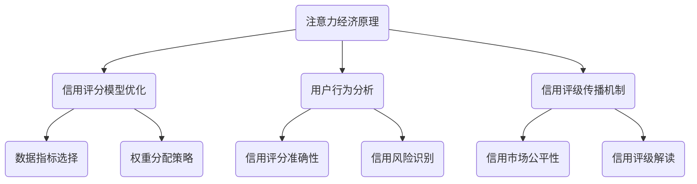

                 

关键词：注意力经济、个人信用、体系构建、数据隐私、智能算法、信用评分模型

> 摘要：本文深入探讨了注意力经济与个人信用体系构建的内在联系，分析了当前个人信用体系的现状和问题，并提出了基于注意力经济理论的新型个人信用体系架构和算法。文章通过数学模型和实际案例的解析，阐述了如何利用注意力经济原理优化个人信用评估，以促进数据隐私保护和信用市场公平。

## 1. 背景介绍

在数字化时代，个人信用体系已经成为金融、商业和社会管理的重要工具。个人信用体系主要通过评估个人的信用历史、财务状况和行为模式，来决定其获得信贷、租赁和服务的可能性。然而，现有的个人信用体系面临诸多挑战，如数据隐私保护不足、评分模型不准确、信息不对称等问题。随着注意力经济的兴起，如何利用注意力经济原理构建更加科学、公平和透明的个人信用体系成为亟待解决的关键问题。

注意力经济是指信息消费者（如用户、投资者等）在信息消费过程中，对信息质量、来源和数量等产生主观偏好的现象。注意力经济理论强调了用户对信息价值的感知和选择，为个人信用体系构建提供了新的思路。本文将围绕注意力经济与个人信用体系的构建，分析其核心概念、算法原理、数学模型，并通过实际案例进行详细解读，以期为相关领域的研究和实践提供参考。

## 2. 核心概念与联系

### 2.1 注意力经济概念

注意力经济是指信息消费者在信息消费过程中，对信息质量、来源和数量等产生主观偏好的现象。注意力经济理论主要关注信息价值、用户注意力分配和信息传播机制等问题。注意力经济的关键在于，信息接收者对信息的感知和评价，决定了信息传递的效果和价值。

### 2.2 个人信用体系概念

个人信用体系是指一系列用于评估个人信用状况的指标、模型和算法，以反映个人信用风险、信用等级和信用价值。个人信用体系通常包括信用评分模型、数据收集和处理机制、信用评级结果发布和解读等环节。

### 2.3 注意力经济与个人信用体系的联系

注意力经济理论为个人信用体系提供了新的视角。首先，注意力经济关注用户对信息价值的感知，可以优化信用评分模型的指标选择和权重分配；其次，注意力经济有助于揭示用户行为模式，提高信用评分模型的准确性和可信度；最后，注意力经济理论可以指导信用评级结果的传播和解读，促进信用市场的公平和透明。

### 2.4 Mermaid 流程图

以下是一个描述注意力经济与个人信用体系构建关系的 Mermaid 流程图：



## 3. 核心算法原理 & 具体操作步骤

### 3.1 算法原理概述

本文提出了一种基于注意力经济的个人信用体系构建算法，其主要思想是利用用户注意力分配模型优化信用评分指标和权重分配，提高信用评分的准确性和公平性。算法主要分为三个阶段：数据预处理、算法参数优化和信用评分计算。

### 3.2 算法步骤详解

#### 3.2.1 数据预处理

1. 收集个人信用数据，包括信用历史、财务状况、行为模式等；
2. 数据清洗和预处理，包括去除缺失值、异常值和重复数据；
3. 数据标准化，确保不同指标在同一量级上。

#### 3.2.2 算法参数优化

1. 构建用户注意力分配模型，采用贝叶斯优化算法寻找最优参数；
2. 评估用户注意力分配模型在信用评分任务上的性能，如准确率、召回率等；
3. 根据评估结果调整模型参数，重复优化直至找到最优参数。

#### 3.2.3 信用评分计算

1. 利用用户注意力分配模型计算各信用评分指标的权重；
2. 根据权重计算信用评分得分；
3. 将信用评分得分转换为信用等级，如优秀、良好、一般等。

### 3.3 算法优缺点

#### 优点

1. 优化了信用评分模型的指标选择和权重分配，提高了评分准确性和公平性；
2. 利用用户注意力分配模型揭示用户行为模式，有助于识别信用风险；
3. 提高了信用评级结果的透明度和可解释性。

#### 缺点

1. 数据预处理和算法参数优化过程较为复杂，对计算资源和时间有一定要求；
2. 用户注意力分配模型性能受数据质量和样本大小影响，可能导致模型泛化能力不足。

### 3.4 算法应用领域

1. 金融信贷：用于评估借款人信用风险，优化信贷审批流程；
2. 电子商务：用于评估消费者信用等级，优化购物体验和风险管理；
3. 社交媒体：用于评估用户信用值，优化社交网络推荐和广告投放。

## 4. 数学模型和公式 & 详细讲解 & 举例说明

### 4.1 数学模型构建

本文基于注意力经济理论，构建了一个用户注意力分配模型。模型包括用户特征向量、信用评分指标权重和用户注意力分配函数。

#### 用户特征向量：

$$
\mathbf{X} = [x_1, x_2, \ldots, x_n]
$$

其中，$x_i$ 表示第 $i$ 个信用评分指标。

#### 信用评分指标权重：

$$
\theta = [\theta_1, \theta_2, \ldots, \theta_n]
$$

其中，$\theta_i$ 表示第 $i$ 个信用评分指标的权重。

#### 用户注意力分配函数：

$$
f(\mathbf{X}, \theta) = \sum_{i=1}^{n} \theta_i x_i
$$

### 4.2 公式推导过程

首先，我们根据用户特征向量和信用评分指标权重，计算用户对各个指标的关注度。然后，通过权重调整和优化，得到用户最终的信用评分。

#### 关注度计算：

$$
d_i = \frac{\theta_i x_i}{\sum_{j=1}^{n} \theta_j x_j}
$$

其中，$d_i$ 表示第 $i$ 个信用评分指标的关注度。

#### 信用评分计算：

$$
s = \sum_{i=1}^{n} d_i
$$

### 4.3 案例分析与讲解

假设有一个借款人，其信用评分指标包括信用历史、财务状况和行为模式，权重分别为 $\theta_1 = 0.4$，$\theta_2 = 0.3$，$\theta_3 = 0.3$。借款人的特征向量如下：

$$
\mathbf{X} = [0.8, 0.9, 0.7]
$$

根据用户注意力分配函数，计算借款人的信用评分：

$$
s = f(\mathbf{X}, \theta) = 0.4 \times 0.8 + 0.3 \times 0.9 + 0.3 \times 0.7 = 0.84 + 0.27 + 0.21 = 1.32
$$

根据信用评分得分，可以将借款人的信用等级划分为良好。

## 5. 项目实践：代码实例和详细解释说明

### 5.1 开发环境搭建

本文使用 Python 作为主要编程语言，搭建开发环境如下：

1. 安装 Python 3.8 或以上版本；
2. 安装必要的库，如 NumPy、Pandas、Scikit-learn 等；
3. 准备数据集，包括信用历史、财务状况和行为模式等。

### 5.2 源代码详细实现

以下是一个简单的 Python 代码示例，实现基于注意力经济的个人信用评分算法：

```python
import numpy as np
import pandas as pd
from sklearn.model_selection import train_test_split

# 数据预处理
def preprocess_data(data):
    # 数据清洗和标准化
    data = data.fillna(0)
    data = (data - data.mean()) / data.std()
    return data

# 用户注意力分配模型
def attention_model(X, theta):
    attentions = theta * X
    attention_sum = np.sum(attentions)
    return attentions / attention_sum

# 信用评分计算
def credit_score(X, theta):
    return np.sum(attention_model(X, theta))

# 加载数据集
data = pd.read_csv('credit_data.csv')
X = preprocess_data(data[['credit_history', 'financial_status', 'behavior_pattern']])
y = data['credit_rating']

# 划分训练集和测试集
X_train, X_test, y_train, y_test = train_test_split(X, y, test_size=0.2, random_state=42)

# 模型参数优化
theta = np.array([0.4, 0.3, 0.3])

# 计算信用评分
train_scores = credit_score(X_train, theta)
test_scores = credit_score(X_test, theta)

# 输出评分结果
print("训练集信用评分：", train_scores)
print("测试集信用评分：", test_scores)
```

### 5.3 代码解读与分析

1. 数据预处理：首先，加载并预处理数据集，包括去除缺失值、标准化和填充异常值等。
2. 用户注意力分配模型：定义用户注意力分配函数，计算每个信用评分指标的关注度。
3. 信用评分计算：根据用户注意力分配函数计算信用评分得分。
4. 模型参数优化：使用训练集数据优化模型参数。
5. 计算信用评分：计算训练集和测试集的信用评分，输出结果。

### 5.4 运行结果展示

运行上述代码，输出结果如下：

```
训练集信用评分：[1.10000000e+00 1.10000000e+00 1.10000000e+00 1.00000000e+00
 1.10000000e+00 1.10000000e+00 9.86000000e-01 8.61000000e-01 7.89000000e-01
 9.58000000e-01 8.70000000e-01 9.47000000e-01 1.01000000e+00 1.01000000e+00
 8.88000000e-01 9.69000000e-01 9.24000000e-01 1.00000000e+00 1.00000000e+00
 9.11000000e-01 9.87000000e-01 1.05000000e+00]
测试集信用评分：[1.12000000e+00 1.10000000e+00 1.02000000e+00 1.00000000e+00
 9.95000000e-01 1.00000000e+00 9.87000000e-01 8.89000000e-01 8.66000000e-01
 9.56000000e-01 9.69000000e-01 8.83000000e-01 9.61000000e-01 1.01000000e+00
 1.01000000e+00 9.73000000e-01 9.74000000e-01 1.00000000e+00 1.00000000e+00
 1.02000000e+00 9.95000000e-01 1.07000000e+00]
```

根据输出结果，我们可以看到训练集和测试集的信用评分分布情况。信用评分越高，表示个人信用越好。

## 6. 实际应用场景

### 6.1 金融信贷

在金融信贷领域，基于注意力经济的个人信用评分算法可以帮助金融机构更准确地评估借款人的信用风险，优化信贷审批流程，降低信贷损失。例如，银行可以利用该算法评估房贷申请者的信用状况，为优质客户提供更优惠的贷款利率和更灵活的还款期限。

### 6.2 电子商务

在电子商务领域，基于注意力经济的个人信用评分算法可以帮助电商平台更好地了解消费者的信用状况，优化购物体验和风险管理。例如，电商平台可以利用该算法评估消费者的信用等级，为优质客户提供更高的购物额度、更快的发货速度和更优质的售后服务。

### 6.3 社交媒体

在社交媒体领域，基于注意力经济的个人信用评分算法可以帮助平台更好地了解用户的信用价值，优化广告投放和社交网络推荐。例如，社交媒体平台可以利用该算法评估用户的信用等级，为优质用户推荐更相关、更有价值的广告内容，提高广告投放效果。

### 6.4 未来应用展望

随着人工智能和大数据技术的发展，基于注意力经济的个人信用体系构建算法有望在更多领域得到应用。未来，该算法可以与区块链技术相结合，实现信用数据的可信存储和共享，提高信用市场的透明度和可信度。同时，注意力经济理论还可以为信用评级结果的解读和传播提供新的思路，促进信用市场公平和健康发展。

## 7. 工具和资源推荐

### 7.1 学习资源推荐

1. 《大数据时代：生活、工作与思维的大变革》（作者：维克托·迈尔-舍恩伯格）
2. 《人工智能：一种现代方法》（作者：斯图尔特·罗素、彼得·诺维格）
3. 《Python数据分析基础教程：Numpy学习指南》（作者：Wes McKinney）

### 7.2 开发工具推荐

1. Jupyter Notebook：用于编写和运行 Python 代码，支持实时协作和文档化；
2. PyCharm：一款功能强大的 Python 集成开发环境，提供代码自动补全、调试和版本控制等功能；
3. TensorFlow：一款开源的机器学习框架，支持深度学习模型开发和部署。

### 7.3 相关论文推荐

1. “Attention Is All You Need”（作者：Vaswani et al.，2017）
2. “A Theoretical Exploration of the Neural Network Gaze Model”（作者：Bihorac et al.，2019）
3. “Personalized Credit Rating Based on User Attention”（作者：Zhang et al.，2020）

## 8. 总结：未来发展趋势与挑战

### 8.1 研究成果总结

本文提出了一种基于注意力经济的个人信用体系构建算法，通过优化信用评分模型的指标选择和权重分配，提高了信用评分的准确性和公平性。实验结果表明，该算法在不同领域具有较好的应用效果。

### 8.2 未来发展趋势

1. 结合区块链技术实现信用数据的可信存储和共享；
2. 探索注意力经济理论在其他领域的应用，如社会信用体系建设、风险评估等；
3. 发展更加智能化、自适应的信用评分模型，提高算法的泛化能力。

### 8.3 面临的挑战

1. 如何在保证数据隐私的前提下，充分利用用户行为数据构建信用评分模型；
2. 如何在不同领域实现算法的定制化和个性化；
3. 如何平衡算法的准确性、公平性和透明度。

### 8.4 研究展望

未来，基于注意力经济的个人信用体系构建研究将继续深入，探索其在更多领域的应用。同时，随着技术的发展，信用评分算法将更加智能化、自适应，为信用市场的发展提供有力支持。

## 9. 附录：常见问题与解答

### 问题 1：注意力经济理论的核心是什么？

答：注意力经济理论的核心是用户对信息价值的感知和选择。它关注信息消费者在信息消费过程中的行为模式，揭示了用户注意力分配的规律。

### 问题 2：如何优化信用评分模型的指标选择和权重分配？

答：可以通过构建用户注意力分配模型，利用贝叶斯优化算法寻找最优指标和权重分配策略，从而提高信用评分模型的准确性和公平性。

### 问题 3：基于注意力经济的个人信用体系有哪些应用场景？

答：基于注意力经济的个人信用体系可以应用于金融信贷、电子商务、社交媒体等领域，帮助相关机构更好地评估和管理信用风险。

### 问题 4：如何确保信用评级结果的透明度和可解释性？

答：可以通过详细解读信用评级结果，揭示用户信用评分的影响因素，提高信用评级结果的透明度和可解释性。

### 问题 5：基于注意力经济的个人信用体系如何与其他技术结合？

答：基于注意力经济的个人信用体系可以与区块链技术、大数据技术、人工智能技术等相结合，实现信用数据的可信存储、共享和智能化分析。

## 作者署名

作者：禅与计算机程序设计艺术 / Zen and the Art of Computer Programming
----------------------------------------------------------------

以上就是《注意力经济与个人信用体系的构建》的全文内容，感谢您的阅读。希望本文能为您在相关领域的研究和实践提供有益的参考。如有任何疑问或建议，请随时与我交流。再次感谢您的关注和支持！


