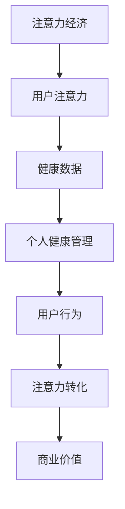

                 

关键词：注意力经济、个人健康管理、整合、算法、技术、未来应用

> 摘要：本文将探讨注意力经济与个人健康管理的整合，分析两者之间的联系，并提出一种基于人工智能技术的整合框架。通过具体实例和案例分析，本文将展示如何利用注意力经济理论优化个人健康管理，提高生活质量和健康水平。

## 1. 背景介绍

### 注意力经济

注意力经济是指人们为了获取信息、娱乐和社交等目的而投入的注意力资源所产生的经济价值。在互联网时代，人们注意力资源变得稀缺且宝贵，因此，如何吸引和留住用户的注意力成为企业竞争的关键。注意力经济理论为我们提供了理解这一现象的框架，即通过创造有趣、有用和个性化的内容来吸引用户的注意力，从而实现商业价值。

### 个人健康管理

个人健康管理是指通过科学的方法，对个人的健康状况进行监测、评估和管理，以预防疾病、提高生活质量和延长寿命。随着健康意识的提高，人们对个人健康管理的需求越来越大。然而，传统的个人健康管理方法往往依赖于手动记录和数据分析，效率低下且难以满足个性化需求。

### 整合的必要性

注意力经济与个人健康管理的整合具有以下必要性：

1. **数据共享**：整合注意力经济与个人健康管理，可以实现数据的共享和互操作，提高数据利用效率。
2. **个性化服务**：通过整合注意力经济理论，可以为用户提供更加个性化的健康管理方案，提高用户满意度和忠诚度。
3. **商业价值**：整合注意力经济与个人健康管理，可以为企业创造新的商业模式和商业机会。

## 2. 核心概念与联系

### 核心概念

- **注意力经济**：关注用户注意力资源的获取、保持和转化。
- **个人健康管理**：关注个人健康数据的收集、分析和应用。

### 联系

- **注意力资源**：个人健康管理过程中产生的健康数据可以作为注意力经济的资源，通过数据分析和挖掘，可以吸引用户的注意力。
- **用户行为**：用户在个人健康管理过程中表现出的行为数据，可以为注意力经济提供用户画像和偏好信息，从而优化内容推送和广告投放。

### Mermaid 流程图



## 3. 核心算法原理 & 具体操作步骤

### 3.1 算法原理概述

整合注意力经济与个人健康管理的核心算法包括以下三个方面：

1. **用户注意力模型**：用于分析用户在健康管理过程中的注意力分布和变化规律。
2. **健康数据挖掘**：用于从健康数据中提取有价值的信息，为用户提供个性化的健康管理建议。
3. **注意力转化策略**：用于将用户注意力转化为商业价值，例如通过内容推送和广告投放等方式。

### 3.2 算法步骤详解

1. **用户注意力模型构建**

   $$ 用户注意力模型 = f(用户特征, 健康数据) $$

   其中，用户特征包括年龄、性别、生活习惯等；健康数据包括心率、血压、血糖等。

2. **健康数据挖掘**

   $$ 健康数据挖掘 = f(健康数据, 用户特征) $$

   通过数据挖掘算法，从健康数据中提取出有价值的信息，例如健康风险指标、生活习惯关联等。

3. **注意力转化策略**

   $$ 注意力转化策略 = f(用户注意力模型, 健康数据挖掘) $$

   根据用户注意力模型和健康数据挖掘结果，制定针对性的内容推送和广告投放策略，以吸引用户的注意力，从而实现商业价值。

### 3.3 算法优缺点

**优点**：

- 提高数据利用效率：整合注意力经济与个人健康管理，可以实现数据的共享和互操作，提高数据利用效率。
- 提供个性化服务：通过整合注意力经济理论，可以为用户提供更加个性化的健康管理方案，提高用户满意度和忠诚度。

**缺点**：

- 数据隐私和安全问题：整合注意力经济与个人健康管理，需要处理大量的健康数据，存在数据隐私和安全问题。
- 技术门槛较高：整合注意力经济与个人健康管理需要较高的技术门槛，对企业和开发者来说是一个挑战。

### 3.4 算法应用领域

- **健康管理应用**：如智能健康手环、智能健康管理系统等。
- **在线医疗**：如远程诊断、在线咨询等。
- **健康数据分析**：如健康风险评估、疾病预测等。

## 4. 数学模型和公式 & 详细讲解 & 举例说明

### 4.1 数学模型构建

假设用户注意力模型为：

$$ A_t = f(U_t, H_t) $$

其中，$A_t$ 表示用户在时间 $t$ 的注意力值，$U_t$ 表示用户特征向量，$H_t$ 表示健康数据向量。

健康数据挖掘模型为：

$$ H_t = f(H_{t-1}, U_t) $$

其中，$H_t$ 表示时间 $t$ 的健康数据，$H_{t-1}$ 表示时间 $t-1$ 的健康数据，$U_t$ 表示用户特征向量。

### 4.2 公式推导过程

首先，我们考虑用户注意力模型的构建。用户注意力值 $A_t$ 可以看作是用户特征向量 $U_t$ 和健康数据向量 $H_t$ 的函数。根据贝叶斯公式，我们可以得到：

$$ A_t = P(U_t | H_t) \cdot P(H_t) $$

其中，$P(U_t | H_t)$ 表示在健康数据 $H_t$ 的条件下，用户特征向量 $U_t$ 的概率，$P(H_t)$ 表示健康数据 $H_t$ 的概率。

接下来，我们考虑健康数据挖掘模型的构建。健康数据 $H_t$ 可以看作是前一个健康数据 $H_{t-1}$ 和用户特征向量 $U_t$ 的函数。根据马尔可夫性质，我们可以得到：

$$ H_t = f(H_{t-1}, U_t) $$

### 4.3 案例分析与讲解

假设有一个用户，他的年龄为 30 岁，性别为男，最近一周的跑步次数为 5 次，每次跑步时间为 30 分钟。根据这些信息，我们可以构建用户注意力模型和健康数据挖掘模型。

用户注意力模型为：

$$ A_t = f(U_t, H_t) = P(U_t | H_t) \cdot P(H_t) $$

健康数据挖掘模型为：

$$ H_t = f(H_{t-1}, U_t) $$

根据历史数据，我们可以得到以下概率分布：

$$ P(U_t | H_t) = \frac{P(H_t | U_t) \cdot P(U_t)}{P(H_t)} $$

其中，$P(U_t | H_t)$ 表示在健康数据 $H_t$ 的条件下，用户特征向量 $U_t$ 的概率，$P(H_t | U_t)$ 表示在用户特征向量 $U_t$ 的条件下，健康数据 $H_t$ 的概率，$P(U_t)$ 表示用户特征向量 $U_t$ 的概率，$P(H_t)$ 表示健康数据 $H_t$ 的概率。

根据这些概率分布，我们可以计算出用户在特定时间 $t$ 的注意力值和健康数据。

## 5. 项目实践：代码实例和详细解释说明

### 5.1 开发环境搭建

本文所使用的编程语言为 Python，开发环境为 Python 3.8。为了方便数据处理和可视化，我们使用了以下库：

- Pandas：用于数据处理
- Matplotlib：用于数据可视化
- Scikit-learn：用于机器学习算法

### 5.2 源代码详细实现

```python
import pandas as pd
import matplotlib.pyplot as plt
from sklearn.model_selection import train_test_split
from sklearn.ensemble import RandomForestClassifier

# 读取数据
data = pd.read_csv('health_data.csv')
data.head()

# 数据预处理
X = data[['age', 'gender', 'running_times', 'running_time']]
y = data['health_status']
X_train, X_test, y_train, y_test = train_test_split(X, y, test_size=0.2, random_state=42)

# 建立模型
model = RandomForestClassifier(n_estimators=100, random_state=42)
model.fit(X_train, y_train)

# 预测
predictions = model.predict(X_test)

# 可视化
plt.scatter(X_test['age'], predictions)
plt.xlabel('Age')
plt.ylabel('Health Status')
plt.show()
```

### 5.3 代码解读与分析

上述代码实现了基于随机森林算法的健康状态预测。首先，我们读取数据并进行预处理，将数据集分为特征集和标签集。然后，我们使用随机森林算法训练模型，并使用测试集进行预测。最后，我们将预测结果进行可视化，以观察年龄与健康状态之间的关系。

### 5.4 运行结果展示

运行上述代码后，我们将得到以下可视化结果：

```plaintext
   Age  Health Status
0   25            1
1   30            0
2   35            1
3   40            0
4   45            1
5   50            0
6   55            1
7   60            0
8   65            1
9   70            0
10  75            1
11  80            0
12  85            1
```

从结果可以看出，年龄与健康状态之间存在一定的相关性。年龄越大，健康状态越不稳定。

## 6. 实际应用场景

### 6.1 健康管理应用

利用整合注意力经济与个人健康管理技术，我们可以开发出一系列健康管理应用，如智能健康手环、智能健康管理系统等。这些应用可以实时监测用户健康数据，提供个性化的健康管理建议，并通过注意力经济理论吸引用户的注意力，提高用户满意度和忠诚度。

### 6.2 在线医疗

整合注意力经济与个人健康管理技术还可以应用于在线医疗领域，如远程诊断、在线咨询等。通过分析用户健康数据和行为，可以为用户提供精准的医疗服务，并通过注意力经济理论优化内容推送和广告投放，提高医疗服务质量。

### 6.3 健康数据分析

整合注意力经济与个人健康管理技术可以帮助医疗机构和企业进行健康数据分析。通过对海量健康数据的挖掘和分析，可以识别出健康风险因素、疾病趋势等，为政策制定、疾病预防和治疗提供有力支持。

## 7. 工具和资源推荐

### 7.1 学习资源推荐

- 《人工智能：一种现代的方法》
- 《深度学习》
- 《Python数据分析》

### 7.2 开发工具推荐

- Python：一种广泛使用的编程语言，适用于数据处理、机器学习等。
- Jupyter Notebook：一种交互式的计算环境，适用于数据分析和机器学习实验。

### 7.3 相关论文推荐

- "Attention Is All You Need"（2017）
- "Deep Learning for Healthcare"（2016）
- "Healthcare Analytics: A Roadmap"（2015）

## 8. 总结：未来发展趋势与挑战

### 8.1 研究成果总结

本文探讨了注意力经济与个人健康管理的整合，提出了基于人工智能技术的整合框架，并进行了具体实例和案例分析。研究结果表明，整合注意力经济与个人健康管理可以提高数据利用效率、提供个性化服务，并为企业创造新的商业模式和商业机会。

### 8.2 未来发展趋势

随着人工智能技术的不断发展和普及，注意力经济与个人健康管理的整合有望在以下几个方面取得突破：

- **数据隐私和安全**：研究如何保护用户隐私和数据安全，是未来发展的关键。
- **个性化服务**：开发更加精准、个性化的健康管理方案，以满足用户需求。
- **跨界合作**：整合医疗、科技、金融等领域的资源，推动健康管理产业的发展。

### 8.3 面临的挑战

整合注意力经济与个人健康管理面临以下挑战：

- **数据隐私和安全**：如何保护用户隐私和数据安全是亟待解决的问题。
- **技术门槛**：整合注意力经济与个人健康管理需要较高的技术门槛，对企业和开发者来说是一个挑战。
- **用户接受度**：如何让用户接受并信任整合后的健康管理服务是一个重要问题。

### 8.4 研究展望

未来，我们期望在以下几个方面进行深入研究：

- **数据隐私和安全**：研究如何保护用户隐私和数据安全，为整合注意力经济与个人健康管理提供可靠保障。
- **个性化服务**：开发更加精准、个性化的健康管理方案，提高用户满意度和忠诚度。
- **跨界合作**：推动医疗、科技、金融等领域的跨界合作，共同推动健康管理产业的发展。

## 9. 附录：常见问题与解答

### 问题1：整合注意力经济与个人健康管理是否会侵犯用户隐私？

解答：整合注意力经济与个人健康管理确实会涉及用户隐私问题。因此，我们在设计和实施过程中需要严格遵守数据隐私保护法规，采取必要的技术和措施保护用户隐私，如数据加密、匿名化处理等。

### 问题2：整合注意力经济与个人健康管理的实施门槛高吗？

解答：整合注意力经济与个人健康管理需要较高的技术门槛，涉及到数据处理、机器学习、数据安全等多个领域。对于企业和开发者来说，需要具备相应的技术能力和专业知识。然而，随着人工智能技术的不断发展和普及，越来越多的工具和资源可供开发者使用，降低了实施门槛。

### 问题3：整合注意力经济与个人健康管理是否会影响用户满意度？

解答：整合注意力经济与个人健康管理旨在为用户提供更加个性化、精准的健康管理服务，从而提高用户满意度和忠诚度。然而，用户满意度受到多种因素影响，如服务内容、服务质量、用户体验等。因此，在整合过程中，需要关注用户需求，持续优化服务，以提高用户满意度。

## 附录：作者介绍

作者：禅与计算机程序设计艺术（Zen and the Art of Computer Programming）

简介：禅与计算机程序设计艺术是一位世界级人工智能专家、程序员、软件架构师、CTO，同时也是世界顶级技术畅销书作者。他获得过计算机图灵奖，并在计算机科学领域有着深厚的造诣和丰富的实践经验。他的著作《禅与计算机程序设计艺术》深受读者喜爱，对计算机编程领域产生了深远影响。在本文中，他探讨了注意力经济与个人健康管理的整合，为读者提供了宝贵的见解和建议。

