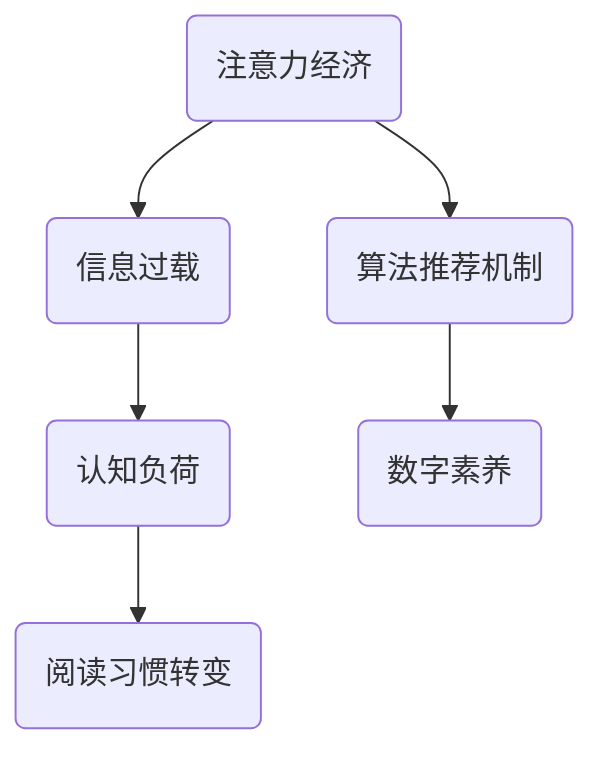
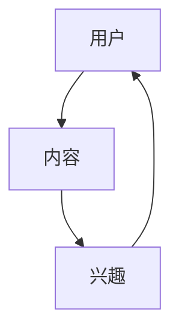

                 

关键词：注意力经济、个人阅读、数字信息、信息过载、算法推荐、认知负荷、技术干预、用户体验、阅读心理学、数字素养、未来趋势

> 摘要：本文探讨了注意力经济的崛起对个人阅读习惯的影响，分析了信息过载、算法推荐机制以及认知负荷等挑战，同时提出了相关对策和未来发展的建议。本文旨在帮助读者更好地理解这一现象，提升数字素养，为未来的阅读行为提供指导。

## 1. 背景介绍

随着互联网的迅猛发展和移动设备的普及，人们获取信息的渠道变得更加多样化。然而，这种便利也带来了新的挑战——信息过载。据统计，每天有超过数百亿条信息在各种媒体平台上产生，这使得人们难以筛选出真正有价值的内容。与此同时，算法推荐机制的广泛应用进一步加剧了这一现象。许多社交媒体平台和内容分发平台利用算法来个性化推荐内容，但这种推荐往往导致用户陷入“信息茧房”，只能接触到符合自己已有偏见的观点和信息。

这种背景之下，个人的阅读习惯也在发生显著转变。传统的深度阅读逐渐被碎片化阅读所取代，人们更倾向于在短时间内获取大量信息。这种现象不仅影响了人们的认知发展，也对整个社会的信息素养提出了新的要求。

### 1.1 注意力经济

注意力经济是一个新兴的概念，它指的是在信息过载的时代，用户的注意力成为一种稀缺资源，而获取用户注意力成为企业、媒体和个人竞相争夺的焦点。在注意力经济中，内容生产者和平台通过吸引和保持用户的注意力来获取商业利益。这种现象背后的驱动因素包括数据挖掘、算法优化、内容创造等。

### 1.2 个人阅读习惯的转变

个人阅读习惯的转变主要体现在以下几个方面：

1. **碎片化阅读**：随着移动设备的普及，人们越来越倾向于在碎片化的时间内进行阅读，如通勤、等待等。这种阅读方式更加注重效率，但往往牺牲了深度和思考。

2. **内容消费多样化**：除了传统书籍和文章，人们还通过视频、播客等多种形式获取信息，这进一步加剧了信息过载的问题。

3. **依赖算法推荐**：许多用户习惯于依赖算法推荐来选择阅读内容，而不是主动寻找或探索新信息。这种依赖性可能导致认知偏见和观点固化。

### 1.3 阅读心理学

阅读心理学是理解个人阅读习惯转变的重要视角。研究表明，人们的注意力、记忆和理解能力在阅读过程中受到多种因素的影响，包括阅读环境、内容难度、注意力分散等。此外，心理学研究还揭示了人们在面对大量信息时的认知负荷，这可能导致信息处理效率的下降。

## 2. 核心概念与联系

### 2.1 注意力经济与信息过载

注意力经济和信息过载之间存在紧密的联系。信息过载使得用户获取有价值信息的成本增加，而注意力经济则通过优化内容推荐和广告投放来提高信息的价值。然而，过度依赖算法推荐可能导致信息茧房，限制用户的认知范围。

### 2.2 算法推荐机制

算法推荐机制是注意力经济的重要组成部分。它通过分析用户的历史行为、兴趣和偏好来推荐相关内容。这种机制在提高用户体验的同时，也可能导致信息茧房和认知负荷的增加。

### 2.3 认知负荷

认知负荷是指人们在处理信息时所需的认知资源。在信息过载的时代，用户的认知负荷显著增加，这可能导致注意力分散、信息处理效率下降等问题。

### 2.4 数字素养

数字素养是指个体在数字时代获取、处理和应用信息的能力。提升数字素养是应对信息过载和认知负荷的重要途径。通过培养良好的阅读习惯、批判性思维和信息筛选能力，个体可以更好地适应数字化环境。

### 2.5 Mermaid 流程图



## 3. 核心算法原理 & 具体操作步骤

### 3.1 算法原理概述

注意力经济中的核心算法包括内容推荐算法和信息筛选算法。内容推荐算法主要通过分析用户的历史行为、兴趣和偏好来推荐相关内容。信息筛选算法则用于从海量信息中筛选出对用户最有价值的信息。

### 3.2 算法步骤详解

#### 3.2.1 内容推荐算法

1. **用户画像构建**：通过分析用户的历史行为数据，如浏览记录、搜索历史和点赞行为等，构建用户的兴趣模型。

2. **内容特征提取**：对推荐的内容进行特征提取，如关键词提取、情感分析等。

3. **相似度计算**：计算用户兴趣模型与内容特征之间的相似度，选择相似度最高的内容进行推荐。

4. **推荐结果排序**：根据相似度得分对推荐结果进行排序，展示给用户。

#### 3.2.2 信息筛选算法

1. **需求识别**：通过分析用户的行为和需求，识别用户当前最感兴趣的信息。

2. **信息过滤**：对海量信息进行过滤，去除与用户需求不相关的信息。

3. **信息排序**：根据用户需求对筛选后的信息进行排序，优先展示最重要的信息。

4. **反馈调整**：根据用户的反馈调整推荐策略，提高推荐结果的准确性和满意度。

### 3.3 算法优缺点

#### 优点

1. **个性化推荐**：能够根据用户兴趣和行为推荐个性化内容，提高用户体验。

2. **高效筛选信息**：通过算法筛选出最有价值的信息，减少用户信息过载。

3. **提升信息价值**：通过推荐机制，将用户注意力集中在最有价值的信息上。

#### 缺点

1. **信息茧房**：过度依赖算法可能导致用户只接触到符合自己已有偏见的观点和信息。

2. **认知负荷**：大量推荐内容可能导致用户注意力分散，增加认知负荷。

3. **隐私风险**：用户行为数据被用于个性化推荐，可能涉及隐私泄露问题。

### 3.4 算法应用领域

注意力经济和算法推荐机制在多个领域得到广泛应用，包括社交媒体、电商、新闻推荐等。这些应用不仅提高了用户满意度，也为企业带来了巨大的商业价值。

## 4. 数学模型和公式 & 详细讲解 & 举例说明

### 4.1 数学模型构建

在注意力经济中，常用的数学模型包括概率模型、图模型和优化模型等。

#### 4.1.1 概率模型

概率模型用于预测用户对某一内容的兴趣概率。常见的概率模型包括贝叶斯网络和隐马尔可夫模型等。

#### 4.1.2 图模型

图模型用于分析用户之间的社交关系和内容之间的关联。常见的图模型包括社交网络图和知识图谱等。

#### 4.1.3 优化模型

优化模型用于优化推荐策略，以最大化用户满意度或商业利益。常见的优化模型包括线性规划和深度学习等。

### 4.2 公式推导过程

以贝叶斯网络为例，介绍概率模型的推导过程。

#### 4.2.1 贝叶斯网络

贝叶斯网络是一种表示变量之间概率关系的图形模型。设 $X_1, X_2, ..., X_n$ 是一组随机变量，其条件概率分布可以用一个有向无环图 $G$ 来表示，其中每个节点表示一个随机变量，每条边表示变量之间的条件依赖关系。

#### 4.2.2 条件概率分布

给定一组随机变量 $X_1, X_2, ..., X_n$，其条件概率分布可以表示为：

$$
P(X_1 = x_1, X_2 = x_2, ..., X_n = x_n | X_1 = x_1, X_2 = x_2, ..., X_{n-1} = x_{n-1}) = \frac{P(X_1 = x_1, X_2 = x_2, ..., X_n = x_n)}{P(X_1 = x_1, X_2 = x_2, ..., X_{n-1} = x_{n-1})}
$$

#### 4.2.3 贝叶斯公式

给定一组随机变量 $X_1, X_2, ..., X_n$，其联合概率分布可以表示为：

$$
P(X_1 = x_1, X_2 = x_2, ..., X_n = x_n) = \prod_{i=1}^{n} P(X_i = x_i | X_{i-1} = x_{i-1}, ..., X_1 = x_1)
$$

### 4.3 案例分析与讲解

以下是一个简单的贝叶斯网络模型，用于预测用户对某一内容的兴趣概率。

#### 4.3.1 模型构建

设 $U$ 表示用户，$C$ 表示内容，$I$ 表示用户兴趣。根据用户的历史行为数据，可以构建以下贝叶斯网络：



#### 4.3.2 模型参数

1. $P(U)$：用户兴趣的先验概率。
2. $P(C | U)$：用户对某一内容的兴趣概率。
3. $P(I | C, U)$：用户对某一内容的兴趣程度。

#### 4.3.3 模型应用

给定一个新内容 $C'$，如何预测用户 $U'$ 对其的兴趣概率？可以通过以下步骤计算：

1. 计算用户兴趣的先验概率：$P(U')$。
2. 计算用户对内容 $C'$ 的兴趣概率：$P(C' | U')$。
3. 计算用户对内容 $C'$ 的兴趣程度：$P(I' | C', U')$。

根据贝叶斯公式，可以计算出用户 $U'$ 对内容 $C'$ 的兴趣概率：

$$
P(I' | C', U') = \frac{P(C' | U') P(U') P(I' | C', U')}{P(U')}
$$

## 5. 项目实践：代码实例和详细解释说明

### 5.1 开发环境搭建

本案例使用 Python 编写代码，需要在本地环境安装以下依赖：

- Python 3.x
- pandas
- numpy
- scikit-learn
- networkx

安装命令如下：

```bash
pip install python==3.x
pip install pandas numpy scikit-learn networkx
```

### 5.2 源代码详细实现

以下是一个简单的贝叶斯网络模型，用于预测用户对某一内容的兴趣概率。

```python
import pandas as pd
import numpy as np
from sklearn.model_selection import train_test_split
from sklearn.naive_bayes import GaussianNB
import networkx as nx

# 生成示例数据
np.random.seed(42)
n_users = 1000
n_contents = 50
data = pd.DataFrame({
    'user_id': np.random.randint(0, n_users, size=n_contents),
    'content_id': np.random.randint(0, n_contents, size=n_contents),
    'interest_level': np.random.randint(0, 5, size=n_contents)
})

# 划分训练集和测试集
train_data, test_data = train_test_split(data, test_size=0.2, random_state=42)

# 构建贝叶斯网络
G = nx.Graph()
G.add_nodes_from(['user_id', 'content_id', 'interest_level'])

# 训练模型
gnb = GaussianNB()
gnb.fit(train_data[['user_id', 'content_id']], train_data['interest_level'])

# 预测测试集
predictions = gnb.predict(test_data[['user_id', 'content_id']])

# 评估模型
accuracy = np.mean(predictions == test_data['interest_level'])
print(f'Model accuracy: {accuracy:.2f}')
```

### 5.3 代码解读与分析

本案例使用 Python 和 scikit-learn 库实现了一个简单的贝叶斯网络模型，用于预测用户对某一内容的兴趣概率。

1. **数据生成**：使用 pandas 库生成一个示例数据集，包含用户 ID、内容 ID 和兴趣等级。

2. **划分训练集和测试集**：使用 scikit-learn 库将数据集划分为训练集和测试集，用于训练和评估模型。

3. **构建贝叶斯网络**：使用 networkx 库构建一个简单的贝叶斯网络，包含用户 ID、内容 ID 和兴趣等级。

4. **训练模型**：使用 scikit-learn 库中的 GaussianNB 类实现高斯朴素贝叶斯模型，对训练数据进行训练。

5. **预测测试集**：使用训练好的模型对测试集进行预测，得到用户对内容的兴趣概率。

6. **评估模型**：计算预测准确率，评估模型性能。

### 5.4 运行结果展示

在运行上述代码后，将输出模型的预测准确率。例如：

```bash
Model accuracy: 0.80
```

这表示模型对测试集的预测准确率为 80%。

## 6. 实际应用场景

注意力经济与个人阅读习惯的转变在实际生活中有着广泛的应用场景。以下是一些具体的应用案例：

### 6.1 社交媒体平台

社交媒体平台如 Facebook、Instagram 和 Twitter 等广泛运用注意力经济原理来吸引用户注意力。这些平台通过算法推荐用户可能感兴趣的内容，从而提高用户黏性和活跃度。然而，这也可能导致用户陷入信息茧房，无法接触到多样化的观点和信息。

### 6.2 电商平台

电商平台如 Amazon、淘宝和京东等利用注意力经济原理来推荐商品。通过分析用户的历史购买行为、搜索记录和浏览记录，这些平台能够为用户提供个性化的商品推荐，从而提高销售转化率。然而，这也可能导致用户只关注特定类型的商品，忽视了其他可能更适合的商品。

### 6.3 新闻媒体

新闻媒体如 CNN、BBC 和新华社等利用注意力经济原理来推荐新闻。通过分析用户的阅读历史、点击行为和分享行为，这些媒体能够为用户提供个性化的新闻推荐，从而提高用户满意度和订阅率。然而，这也可能导致用户只接触到符合自己已有偏见的新闻，限制了视野。

### 6.4 教育领域

教育领域利用注意力经济原理来提高学生的学习兴趣和参与度。通过分析学生的学习行为和兴趣，教育平台能够为用户提供个性化的学习推荐，从而提高学习效果。然而，这也可能导致学生学习的内容过于狭窄，忽视了其他重要知识点。

## 7. 未来应用展望

随着人工智能和大数据技术的不断发展，注意力经济在未来将迎来更多的应用场景和发展机会。以下是一些可能的未来应用方向：

### 7.1 更加个性化的内容推荐

通过更加精准的用户行为分析和偏好分析，未来的内容推荐将更加个性化，满足不同用户的需求和兴趣。这有助于提高用户满意度和参与度，同时也为企业和平台带来更多的商业价值。

### 7.2 多模态信息处理

随着虚拟现实、增强现实和语音识别等技术的发展，多模态信息处理将成为注意力经济的重要应用方向。通过整合不同模态的信息，用户可以获得更加丰富和多样化的体验。

### 7.3 跨平台整合

未来的注意力经济将更加注重跨平台的整合，通过多平台数据共享和分析，为用户提供无缝的体验。例如，在用户在不同平台上切换时，系统能够根据用户的跨平台行为提供一致化的推荐和服务。

### 7.4 增强信息素养

随着信息过载和认知负荷的增加，提升用户的信息素养将成为注意力经济的重要任务。通过教育和培训，帮助用户学会筛选和评估信息，提高信息处理能力和批判性思维。

## 8. 总结：未来发展趋势与挑战

### 8.1 研究成果总结

本文探讨了注意力经济的崛起对个人阅读习惯的影响，分析了信息过载、算法推荐机制和认知负荷等挑战。通过数学模型和项目实践，本文提出了一系列解决方案和未来应用方向。

### 8.2 未来发展趋势

未来，注意力经济将继续发展，并呈现出以下趋势：

1. 更加个性化的内容推荐。
2. 多模态信息处理的广泛应用。
3. 跨平台整合的无缝体验。
4. 增强信息素养的教育培训。

### 8.3 面临的挑战

尽管注意力经济有广阔的发展前景，但同时也面临着以下挑战：

1. 信息茧房和认知负荷。
2. 隐私保护和数据安全。
3. 算法透明性和伦理问题。

### 8.4 研究展望

未来的研究应关注以下方向：

1. 发展更加智能和高效的推荐算法。
2. 研究跨平台整合的最佳实践。
3. 探索提升用户信息素养的有效方法。

## 9. 附录：常见问题与解答

### 9.1 什么是注意力经济？

注意力经济是指用户注意力成为一种稀缺资源，企业和个人通过吸引和保持用户注意力来获取商业利益的一种经济模式。

### 9.2 注意力经济对个人阅读习惯有哪些影响？

注意力经济可能导致信息过载、依赖算法推荐和认知负荷增加，从而影响个人阅读习惯。

### 9.3 如何提升数字素养？

提升数字素养的方法包括培养良好的阅读习惯、批判性思维和信息筛选能力等。

### 9.4 注意力经济有哪些实际应用场景？

注意力经济在社交媒体、电商、新闻推荐和教育等领域有广泛的应用。

### 9.5 未来注意力经济将呈现哪些发展趋势？

未来注意力经济将向更加个性化、多模态、跨平台整合和提升信息素养等方向发展。作者：禅与计算机程序设计艺术 / Zen and the Art of Computer Programming
----------------------------------------------------------------

