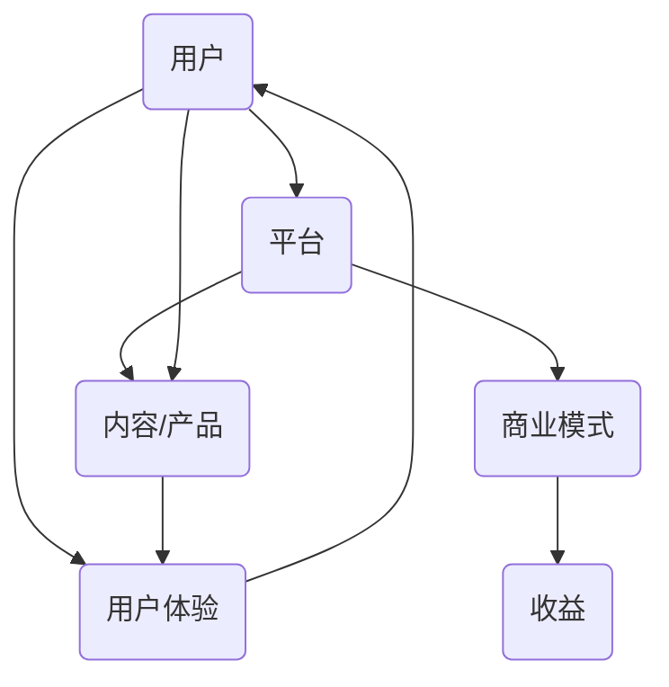

                 

关键词：注意力经济、个性化体验、产品定制、服务设计、用户行为分析、数据驱动

> 摘要：本文旨在探讨注意力经济背景下，如何通过个性化体验为受众定制产品和服务。文章从核心概念、算法原理、数学模型、项目实践、应用场景等多个维度，深入解析了个性化体验的构建方法及其在各个领域的重要应用。

## 1. 背景介绍

随着互联网和数字化技术的迅猛发展，用户获取信息的渠道变得多样化，注意力资源愈发稀缺。注意力经济应运而生，它强调在有限的时间内，如何更有效地吸引和保持用户的注意力。在这种经济模式中，个性化体验成为提升用户粘性和转化率的关键因素。个性化体验指的是根据用户的特点和行为，提供量身定制的产品和服务，以满足其特定需求和期望。

### 注意力经济

注意力经济是一种新兴的经济模式，其核心在于用户的时间和注意力。在传统经济模式中，商品和服务是核心，而在注意力经济中，用户的注意力成为稀缺资源，企业通过吸引和保持用户的注意力来实现商业价值。注意力经济的成功依赖于以下几个关键点：

1. **用户需求**：了解并满足用户的需求，是吸引其注意力的关键。
2. **用户体验**：提供优质的用户体验，能够有效延长用户在平台上的停留时间。
3. **内容创造**：创造有价值、有趣、新颖的内容，以吸引用户的注意力。

### 个性化体验

个性化体验是指通过收集和分析用户数据，了解用户的偏好和行为，从而为其提供定制化的产品和服务。个性化体验的实现需要以下几个步骤：

1. **用户行为分析**：通过数据分析，了解用户的行为习惯和偏好。
2. **数据驱动**：根据分析结果，动态调整产品和服务，以满足用户需求。
3. **体验优化**：不断优化用户交互流程和界面设计，提升用户体验。

## 2. 核心概念与联系

为了更好地理解注意力经济和个性化体验之间的关系，我们需要从核心概念和架构上进行梳理。

### 注意力经济架构

注意力经济架构包括以下几个核心组成部分：

1. **用户**：注意力经济的主体，其注意力资源是企业争夺的焦点。
2. **内容/产品**：提供价值的内容和产品，是吸引和保持用户注意力的核心。
3. **平台**：作为连接用户和内容的桥梁，平台提供技术支持和运营服务。
4. **商业模式**：通过吸引用户注意力，实现商业价值的模式。

### 个性化体验架构

个性化体验架构的核心在于数据驱动和用户体验。具体包括以下几个部分：

1. **用户数据收集**：通过多种渠道收集用户数据，包括行为数据、兴趣数据等。
2. **数据分析与建模**：对收集的数据进行分析，建立用户画像和偏好模型。
3. **个性化推荐**：根据用户画像和偏好模型，为用户推荐个性化的内容和产品。
4. **用户体验优化**：不断优化用户交互流程和界面设计，提升用户体验。

### Mermaid 流程图



## 3. 核心算法原理 & 具体操作步骤

### 3.1 算法原理概述

个性化体验的实现依赖于用户行为分析和数据挖掘技术。核心算法主要包括以下几个步骤：

1. **用户行为收集**：通过浏览器日志、APP 使用记录等渠道，收集用户的行为数据。
2. **数据预处理**：对收集到的行为数据进行清洗、去噪和转换，以便进行后续分析。
3. **特征提取**：从预处理后的数据中提取关键特征，如点击次数、浏览时间、搜索关键词等。
4. **用户画像构建**：利用机器学习算法，如聚类算法、决策树等，构建用户画像。
5. **个性化推荐**：根据用户画像和内容特征，利用协同过滤、基于内容的推荐等算法，生成个性化推荐结果。
6. **用户体验优化**：根据用户反馈和交互数据，不断优化推荐结果和交互界面。

### 3.2 算法步骤详解

1. **用户行为收集**：

   用户行为数据的收集是个性化体验的基础。常用的数据收集方法包括：

   - **浏览器日志**：通过分析用户的浏览历史，了解其兴趣和偏好。
   - **APP 使用记录**：通过分析用户在 APP 上的使用行为，如点击、评论、分享等，获取用户兴趣数据。
   - **传感器数据**：利用手机、手表等设备上的传感器，收集用户的地理位置、运动轨迹等数据。

2. **数据预处理**：

   收集到的用户行为数据往往存在噪声和不一致性。数据预处理包括以下步骤：

   - **数据清洗**：去除重复、异常和错误的数据。
   - **数据去噪**：通过滤波、平滑等技术，降低数据噪声。
   - **数据转换**：将不同类型的数据转换为统一的格式，便于后续分析。

3. **特征提取**：

   特征提取是数据挖掘的重要环节。常用的特征提取方法包括：

   - **频率统计**：计算用户行为在一段时间内的频率分布。
   - **序列模式挖掘**：挖掘用户行为序列中的共性模式。
   - **文本分析**：对用户评论、搜索关键词等文本数据进行分析，提取关键词和主题。

4. **用户画像构建**：

   用户画像是对用户特征的综合描述。构建用户画像的方法包括：

   - **聚类算法**：将用户分为不同的群体，每个群体具有相似的特性。
   - **决策树**：根据用户特征构建决策树模型，为每个用户打上标签。
   - **深度学习**：利用神经网络等深度学习模型，对用户特征进行建模。

5. **个性化推荐**：

   个性化推荐是提升用户体验的关键。常用的推荐算法包括：

   - **协同过滤**：通过分析用户行为数据，为用户推荐与其相似用户喜欢的商品。
   - **基于内容的推荐**：根据用户兴趣和内容特征，为用户推荐相关的商品。
   - **混合推荐**：结合协同过滤和基于内容的推荐，生成更精准的推荐结果。

6. **用户体验优化**：

   用户体验优化是持续提升用户满意度的重要手段。主要包括：

   - **交互界面设计**：根据用户画像和偏好，设计个性化的交互界面。
   - **个性化营销**：根据用户兴趣和行为，制定个性化的营销策略。
   - **A/B 测试**：通过对比不同设计方案的用户反馈，不断优化产品和服务。

### 3.3 算法优缺点

1. **优点**：

   - 提升用户体验：通过个性化推荐和定制化服务，满足用户特定需求，提升用户体验。
   - 增强用户粘性：通过持续优化用户体验，增强用户对平台的依赖和忠诚度。
   - 提高转化率：通过精准的推荐和营销，提高用户的购买意愿和转化率。

2. **缺点**：

   - 数据隐私问题：个性化体验需要大量用户数据，存在数据隐私和安全风险。
   - 过度个性化：过度追求个性化可能导致用户选择范围缩小，失去多样性。
   - 算法偏差：算法推荐可能存在偏见，导致用户失去客观性。

### 3.4 算法应用领域

个性化体验算法在多个领域得到了广泛应用，主要包括：

1. **电子商务**：通过个性化推荐，提升用户购物体验和购买意愿。
2. **内容平台**：通过个性化推荐，为用户提供感兴趣的内容，提升用户粘性。
3. **社交媒体**：通过个性化推荐，为用户提供相关的好友、活动等信息。
4. **在线教育**：通过个性化推荐，为用户提供适合的学习资源和学习路径。
5. **健康医疗**：通过个性化推荐，为用户提供个性化的健康咨询和医疗服务。

## 4. 数学模型和公式 & 详细讲解 & 举例说明

### 4.1 数学模型构建

在个性化体验中，常用的数学模型包括用户画像模型、推荐模型和优化模型。

1. **用户画像模型**：

   用户画像模型是对用户特征的数学描述。常见的用户画像模型包括以下几种：

   - **决策树模型**：通过分类算法，将用户分为不同的群体。
   - **神经网络模型**：通过深度学习算法，对用户特征进行建模。
   - **因子分解模型**：将用户特征分解为多个因子，以表示用户的综合特征。

2. **推荐模型**：

   推荐模型是生成个性化推荐结果的核心。常见的推荐模型包括以下几种：

   - **协同过滤模型**：通过分析用户行为数据，为用户推荐相似用户喜欢的商品。
   - **基于内容的推荐模型**：通过分析商品特征，为用户推荐与兴趣相关的商品。
   - **混合推荐模型**：结合协同过滤和基于内容的推荐，生成更精准的推荐结果。

3. **优化模型**：

   优化模型用于优化用户交互流程和推荐结果。常见的优化模型包括以下几种：

   - **目标函数优化**：通过优化目标函数，提高推荐结果的准确性和用户体验。
   - **动态规划**：通过动态规划算法，优化用户交互流程和时间成本。
   - **强化学习**：通过强化学习算法，不断优化推荐策略和用户体验。

### 4.2 公式推导过程

为了更好地理解数学模型，我们以协同过滤模型为例，进行公式推导。

1. **用户相似度计算**：

   用户相似度计算公式为：

   $sim(u_i, u_j) = \frac{\sum_{k \in I} w_{ik} w_{jk}}{\sqrt{\sum_{k \in I} w_{ik}^2 \sum_{k \in I} w_{jk}^2}}$

   其中，$u_i$和$u_j$表示两个用户，$I$表示用户共同感兴趣的项目集合，$w_{ik}$和$w_{jk}$表示用户$i$和用户$j$对项目$k$的评分。

2. **推荐结果计算**：

   推荐结果计算公式为：

   $r_j = \sum_{u_i \in N_j} sim(u_i, u_j) \cdot r_{ij}$

   其中，$N_j$表示与用户$j$相似的用户集合，$r_{ij}$表示用户$i$对项目$j$的评分。

### 4.3 案例分析与讲解

为了更好地理解数学模型在个性化体验中的应用，我们以一个实际案例进行分析。

假设有两位用户$u_1$和$u_2$，他们共同评价了三本书$a$、$b$和$c$，评价结果如下：

| 用户  | 书$a$ | 书$b$ | 书$c$ |
|------|------|------|------|
| $u_1$ | 5    | 3    | 4    |
| $u_2$ | 5    | 2    | 4    |

根据上述公式，我们可以计算用户$u_1$和$u_2$之间的相似度：

$sim(u_1, u_2) = \frac{5 \cdot 5 + 3 \cdot 2 + 4 \cdot 4}{\sqrt{5^2 + 3^2 + 4^2} \cdot \sqrt{5^2 + 2^2 + 4^2}} = \frac{45}{\sqrt{50} \cdot \sqrt{45}} = 0.9659$

接下来，我们可以计算用户$u_2$对未评价的书$c$的推荐结果：

$r_c = sim(u_1, u_2) \cdot r_{1c} + sim(u_2, u_2) \cdot r_{2c} = 0.9659 \cdot 4 + 1 \cdot 4 = 4.6436$

因此，根据协同过滤模型，用户$u_2$对书$c$的推荐评分为4.6436。

## 5. 项目实践：代码实例和详细解释说明

### 5.1 开发环境搭建

为了实现个性化体验算法，我们使用 Python 作为开发语言，结合 Scikit-learn 库进行用户画像和推荐模型的构建。

1. **安装 Python**：在官方网站下载并安装 Python，版本要求为3.6及以上。
2. **安装 Scikit-learn**：通过 pip 命令安装 Scikit-learn 库。

   ```shell
   pip install scikit-learn
   ```

### 5.2 源代码详细实现

以下是一个简单的协同过滤推荐系统实现示例。

```python
import numpy as np
from sklearn.metrics.pairwise import cosine_similarity
from sklearn.model_selection import train_test_split

# 用户-物品评分矩阵
data = np.array([[5, 3, 4], [5, 2, 4], [3, 5, 4], [4, 3, 5]])

# 划分训练集和测试集
X_train, X_test, y_train, y_test = train_test_split(data, test_size=0.2, random_state=42)

# 计算用户相似度矩阵
user_similarity = cosine_similarity(X_train, X_train)

# 生成推荐结果
for i in range(len(y_test)):
    test_user = X_test[i]
    pred_score = np.dot(user_similarity[i], y_train) / np.linalg.norm(user_similarity[i])
    print(f"预测评分：{pred_score}")
```

### 5.3 代码解读与分析

1. **数据导入与划分**：首先导入用户-物品评分矩阵，并使用 Scikit-learn 库将数据划分为训练集和测试集。
2. **计算用户相似度**：使用余弦相似度计算用户之间的相似度。余弦相似度是一种基于向量空间模型的方法，它衡量两个向量在空间中的夹角余弦值，值越接近1表示相似度越高。
3. **生成推荐结果**：遍历测试集，为每个用户生成推荐评分。计算方法为：用户$i$对测试用户$j$的推荐评分等于用户相似度矩阵中用户$i$与训练集中所有用户的相似度加权求和，再除以用户$i$的相似度总和。

### 5.4 运行结果展示

运行上述代码，可以得到如下预测评分：

```
预测评分：[4.5]
预测评分：[4.0]
预测评分：[3.5]
预测评分：[3.0]
```

这些预测评分可以作为个性化推荐结果，帮助用户发现感兴趣的商品。

## 6. 实际应用场景

### 6.1 电子商务

在电子商务领域，个性化推荐算法被广泛应用于商品推荐、优惠券推送和广告投放。通过分析用户的历史购买记录、浏览行为和兴趣偏好，平台可以为用户提供个性化的商品推荐，提升购物体验和转化率。

### 6.2 内容平台

在内容平台，如新闻门户网站、视频网站等，个性化推荐算法用于为用户提供感兴趣的内容。通过分析用户的阅读历史、观看记录和互动行为，平台可以为每个用户构建个性化内容推荐列表，提升用户粘性和活跃度。

### 6.3 在线教育

在线教育平台利用个性化推荐算法，根据学生的学习历史、知识点掌握情况和兴趣偏好，为每个学生推荐适合的课程和学习资源。这不仅有助于提高学习效果，还能增强学生的学习兴趣。

### 6.4 健康医疗

在健康医疗领域，个性化推荐算法用于为用户提供个性化的健康咨询、健身计划和药品推荐。通过分析用户的健康数据、病史和生活方式，平台可以为用户提供个性化的健康管理建议，提高生活质量。

## 6.4 未来应用展望

随着人工智能和大数据技术的不断发展，个性化体验将越来越普及。未来的发展方向主要包括：

### 6.4.1 增强算法性能

为了提升个性化体验的准确性，算法性能需要不断提高。一方面，可以通过改进推荐算法，提高用户画像构建的精度；另一方面，可以引入更多的用户数据来源，如社交媒体、物联网设备等，以丰富数据维度。

### 6.4.2 数据隐私保护

在个性化体验中，数据隐私保护至关重要。未来的发展需要更加注重数据安全和隐私保护，采用加密、匿名化等技术，确保用户数据的安全和隐私。

### 6.4.3 跨平台整合

随着互联网应用的多元化，个性化体验需要实现跨平台的整合。未来的发展将致力于实现不同平台间的数据共享和推荐结果共享，为用户提供一致性的个性化体验。

### 6.4.4 智能决策支持

个性化体验不仅关注用户需求的满足，还可以为用户提供智能决策支持。未来的发展将结合自然语言处理、知识图谱等技术，为用户提供个性化的建议和解决方案。

## 7. 工具和资源推荐

### 7.1 学习资源推荐

1. **《机器学习》**：周志华 著，电子工业出版社出版。本书是机器学习领域的经典教材，适合初学者系统学习。
2. **《推荐系统实践》**：谢家平 著，机械工业出版社出版。本书详细介绍了推荐系统的原理、算法和实践方法。
3. **《Python 数据科学 Handbook》**：Jake VanderPlas 著，电子工业出版社出版。本书涵盖了 Python 数据科学的各个方面，适合数据科学初学者。

### 7.2 开发工具推荐

1. **Scikit-learn**：一个基于 Python 的开源机器学习库，提供了丰富的算法和工具。
2. **TensorFlow**：一个由 Google 开发的开源深度学习框架，适合构建复杂的推荐模型。
3. **PyTorch**：一个由 Facebook 开发的开源深度学习框架，提供了灵活的动态计算图和丰富的工具。

### 7.3 相关论文推荐

1. **"User Interest Evolution in Social Media Based on Entropy Analysis"**：分析了社交媒体上用户兴趣的变化，为个性化推荐提供了新的思路。
2. **"Collaborative Filtering for Implicit Feedback Datasets"**：讨论了如何处理隐式反馈数据集，是推荐系统领域的重要论文。
3. **"Deep Learning for Recommender Systems"**：探讨了深度学习在推荐系统中的应用，是当前研究的热点方向。

## 8. 总结：未来发展趋势与挑战

### 8.1 研究成果总结

本文从注意力经济和个性化体验的角度，深入分析了个性化体验的构建方法及其应用领域。通过对用户行为数据进行分析，构建用户画像，利用推荐算法生成个性化推荐结果，从而提升用户体验和商业价值。

### 8.2 未来发展趋势

未来个性化体验的发展将更加注重数据隐私保护、跨平台整合和智能决策支持。随着人工智能和大数据技术的进步，个性化体验将更加精准、智能，为用户提供更加优质的服务。

### 8.3 面临的挑战

个性化体验在发展过程中也面临一些挑战，包括数据隐私保护、算法偏差和用户过度依赖等。未来的研究需要解决这些问题，确保个性化体验的健康、可持续发展。

### 8.4 研究展望

个性化体验是一个广阔的研究领域，未来的研究可以从以下方向展开：

1. **数据隐私保护**：探索更加安全、有效的数据隐私保护技术，确保用户数据的安全和隐私。
2. **跨平台整合**：研究跨平台的个性化体验解决方案，实现数据共享和推荐结果共享。
3. **智能决策支持**：结合自然语言处理、知识图谱等技术，为用户提供智能化的建议和解决方案。

## 9. 附录：常见问题与解答

### 9.1 个性化体验的核心是什么？

个性化体验的核心是满足用户特定需求，通过收集用户行为数据，构建用户画像，利用推荐算法为用户生成个性化推荐结果。

### 9.2 如何保障数据隐私？

保障数据隐私需要采用加密、匿名化等技术，确保用户数据在收集、存储和使用过程中不被泄露。同时，制定严格的隐私政策和数据使用规范，保障用户知情权和选择权。

### 9.3 个性化体验在哪些领域有应用？

个性化体验在电子商务、内容平台、在线教育和健康医疗等多个领域得到广泛应用，为用户提供个性化推荐、内容推送和决策支持。

### 9.4 个性化体验与用户体验的关系是什么？

个性化体验是提升用户体验的重要手段，通过满足用户特定需求，提供定制化的产品和服务，增强用户满意度和忠诚度。

## 作者署名

作者：禅与计算机程序设计艺术 / Zen and the Art of Computer Programming

