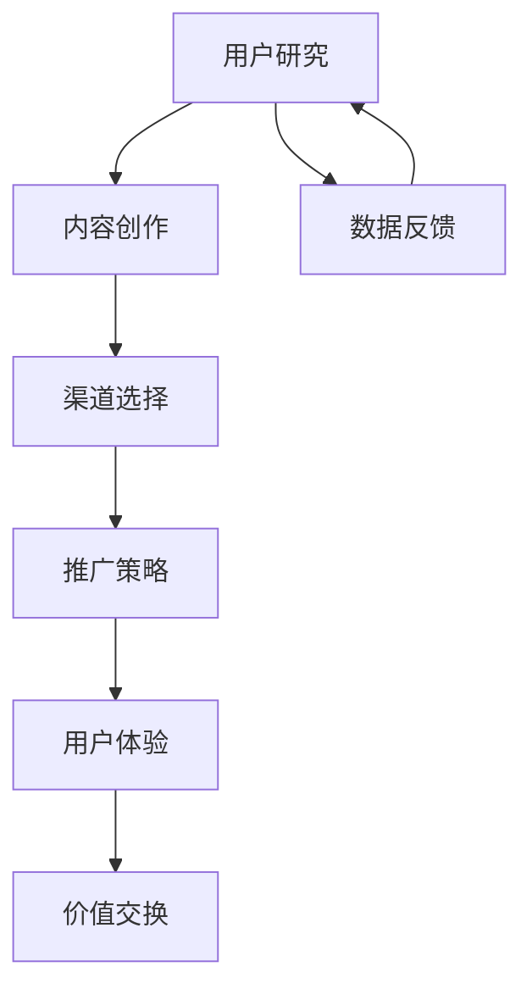

                 

关键词：注意力经济，内容策略，受众吸引，用户留存，算法原理，实践应用，未来展望

> 摘要：本文将探讨注意力经济的基本概念，以及如何通过科学的内容策略规划与实施，吸引并留住受众。我们将深入分析注意力经济背后的原理，分享有效的算法和策略，并提供实际的项目实践和运行结果。此外，本文还将展望未来的发展趋势和面临的挑战，为读者提供全面的内容策略指导。

## 1. 背景介绍

在互联网时代，信息爆炸已成为普遍现象。人们每天面对的海量信息使得注意力成为了一种稀缺资源。而如何有效利用这些有限的注意力资源，成为了企业、媒体和个人共同面临的问题。注意力经济因此应运而生，它是指通过创造有价值的内容或服务，吸引并留住受众，从而实现商业价值的一种经济形态。

内容策略规划与实施则是注意力经济的核心。它包括对目标受众的研究、内容创作、渠道选择、推广策略等多个环节。通过科学的内容策略，企业可以更好地吸引受众，提高用户留存率，实现可持续发展。

## 2. 核心概念与联系

### 2.1 注意力经济的基本原理

注意力经济基于以下几个核心概念：

1. **注意力稀缺性**：在信息过载的时代，受众的注意力资源是有限的。
2. **价值交换**：受众将注意力转化为对企业或内容的支持，企业通过提供有价值的内容或服务，实现价值交换。
3. **用户体验**：良好的用户体验是吸引并留住受众的关键。

### 2.2 内容策略的架构

内容策略的架构可以分为以下几个关键环节：

1. **用户研究**：了解目标受众的需求、兴趣和行为，为内容创作提供依据。
2. **内容创作**：基于用户研究，创作有价值、有趣、相关的内容。
3. **渠道选择**：选择合适的传播渠道，提高内容的可见度和影响力。
4. **推广策略**：通过营销手段，吸引更多受众关注和参与。

### 2.3 注意力经济与内容策略的Mermaid流程图



## 3. 核心算法原理 & 具体操作步骤

### 3.1 算法原理概述

内容策略的核心算法主要包括用户行为分析、内容推荐算法和转化率优化算法。以下将分别介绍这些算法的基本原理。

#### 用户行为分析算法

用户行为分析算法主要用于了解受众的阅读偏好和行为模式，通过分析用户的浏览记录、搜索历史等数据，为企业提供用户画像。

#### 内容推荐算法

内容推荐算法根据用户的兴趣和行为，为其推荐相关的内容。常见的内容推荐算法包括基于内容的推荐（CBR）和基于协同过滤的推荐（CF）。

#### 转化率优化算法

转化率优化算法旨在提高受众转化为用户或客户的概率。通过分析用户的行为路径、转化率等数据，找出提高转化的关键因素。

### 3.2 算法步骤详解

#### 用户行为分析算法步骤

1. 数据采集：收集用户的浏览记录、搜索历史等数据。
2. 数据清洗：去除无效数据，保证数据的准确性。
3. 特征提取：对用户行为数据进行分析，提取关键特征。
4. 用户画像构建：基于提取的特征，构建用户画像。

#### 内容推荐算法步骤

1. 数据预处理：对用户行为数据和处理后的内容数据进行预处理。
2. 用户兴趣模型构建：基于用户行为数据，构建用户兴趣模型。
3. 内容相似度计算：计算用户兴趣模型与内容特征之间的相似度。
4. 内容推荐：根据相似度计算结果，为用户推荐相关内容。

#### 转化率优化算法步骤

1. 数据分析：分析用户行为路径、转化率等数据。
2. 关键因素识别：找出影响转化的关键因素。
3. 优化策略制定：制定针对性的优化策略。
4. 实施与监测：实施优化策略，并监测效果。

### 3.3 算法优缺点

#### 用户行为分析算法

- 优点：能够深入了解用户需求和行为，为内容创作提供依据。
- 缺点：需要大量数据支持，且数据处理过程复杂。

#### 内容推荐算法

- 优点：提高用户黏性和内容消费量。
- 缺点：可能存在过度推荐和冷启动问题。

#### 转化率优化算法

- 优点：提高用户转化率，实现商业价值。
- 缺点：对数据分析能力要求较高。

### 3.4 算法应用领域

用户行为分析、内容推荐和转化率优化算法广泛应用于电子商务、在线教育、社交媒体等领域，帮助企业更好地吸引并留住受众。

## 4. 数学模型和公式 & 详细讲解 & 举例说明

### 4.1 数学模型构建

内容策略的数学模型主要包括用户行为预测模型、内容推荐模型和转化率预测模型。以下将分别介绍这些模型的构建过程。

#### 用户行为预测模型

用户行为预测模型用于预测用户在未来的某个时间点会采取的行为。其构建过程包括：

1. 数据采集：收集用户的历史行为数据。
2. 特征工程：提取与用户行为相关的特征。
3. 模型选择：选择合适的预测模型，如线性回归、决策树、神经网络等。
4. 模型训练：使用历史数据训练预测模型。
5. 模型评估：评估预测模型的准确性。

#### 内容推荐模型

内容推荐模型用于根据用户兴趣为其推荐相关内容。其构建过程包括：

1. 数据预处理：对用户行为数据和内容数据进行预处理。
2. 用户兴趣模型构建：构建用户兴趣模型，如K-均值聚类、潜在因子模型等。
3. 内容特征提取：提取内容特征，如文本特征、图片特征等。
4. 内容推荐算法选择：选择合适的内容推荐算法，如基于内容的推荐、协同过滤等。
5. 内容推荐结果生成：生成推荐列表。

#### 转化率预测模型

转化率预测模型用于预测用户在未来某个时间点是否会转化为用户或客户。其构建过程包括：

1. 数据分析：分析用户行为路径、转化率等数据。
2. 特征提取：提取与转化率相关的特征。
3. 模型选择：选择合适的预测模型，如逻辑回归、支持向量机等。
4. 模型训练：使用历史数据训练预测模型。
5. 模型评估：评估预测模型的准确性。

### 4.2 公式推导过程

以下分别介绍用户行为预测模型、内容推荐模型和转化率预测模型的主要公式推导过程。

#### 用户行为预测模型

用户行为预测模型通常采用时间序列模型进行预测。其基本公式如下：

$$
P(t_{next}|t_{current}) = \frac{e^{-\beta \cdot D(t_{current}, t_{next})}}{\sum_{i=1}^{n} e^{-\beta \cdot D(t_{current}, t_{i})}}
$$

其中，$P(t_{next}|t_{current})$表示在当前时间$t_{current}$下，用户在下一个时间点$t_{next}$采取某个行为的概率；$D(t_{current}, t_{next})$表示时间$t_{current}$和$t_{next}$之间的距离；$\beta$为模型参数。

#### 内容推荐模型

内容推荐模型通常采用协同过滤算法进行预测。其基本公式如下：

$$
r_{ij} = u_i + v_j + b - \langle u_i, v_j \rangle
$$

其中，$r_{ij}$表示用户$i$对项目$j$的评分预测；$u_i$和$v_j$分别表示用户$i$和项目$j$的潜在特征向量；$\langle u_i, v_j \rangle$表示用户$i$和项目$j$之间的相似度。

#### 转化率预测模型

转化率预测模型通常采用逻辑回归模型进行预测。其基本公式如下：

$$
P(y=1|X) = \frac{1}{1 + e^{-(\beta_0 + \beta_1 x_1 + \beta_2 x_2 + ... + \beta_n x_n})}
$$

其中，$P(y=1|X)$表示在特征向量$X$下，用户转化为客户的概率；$\beta_0, \beta_1, \beta_2, ..., \beta_n$为模型参数。

### 4.3 案例分析与讲解

以下以电子商务平台为例，分析用户行为预测模型、内容推荐模型和转化率预测模型在实践中的应用。

#### 用户行为预测模型

假设电商平台收集了用户的历史购买数据，包括购买时间、商品种类、购买数量等。通过用户行为预测模型，平台可以预测用户在未来的某个时间点会购买哪些商品。

1. 数据采集：收集用户的历史购买数据。
2. 特征工程：提取用户购买时间、商品种类、购买数量等特征。
3. 模型选择：选择时间序列模型，如ARIMA模型进行预测。
4. 模型训练：使用历史数据训练ARIMA模型。
5. 模型评估：评估模型预测准确性。

通过用户行为预测模型，电商平台可以提前了解用户的需求，为其推荐相关的商品。

#### 内容推荐模型

假设电商平台根据用户的浏览记录，为其推荐相关商品。

1. 数据预处理：对用户浏览记录进行处理，提取用户兴趣特征。
2. 用户兴趣模型构建：使用K-均值聚类算法，将用户分为多个兴趣群体。
3. 内容特征提取：提取商品的文本特征、图片特征等。
4. 内容推荐算法选择：选择基于内容的推荐算法，如TF-IDF算法。
5. 内容推荐结果生成：生成商品推荐列表。

通过内容推荐模型，电商平台可以提高用户的购物体验，增加购买转化率。

#### 转化率预测模型

假设电商平台分析用户的行为路径，预测用户是否会购买商品。

1. 数据分析：分析用户行为路径，提取与转化率相关的特征。
2. 特征提取：提取用户访问时间、浏览页面数量、操作行为等特征。
3. 模型选择：选择逻辑回归模型进行预测。
4. 模型训练：使用历史数据训练逻辑回归模型。
5. 模型评估：评估模型预测准确性。

通过转化率预测模型，电商平台可以优化用户体验，提高购买转化率。

## 5. 项目实践：代码实例和详细解释说明

### 5.1 开发环境搭建

在本文中，我们将使用Python作为主要编程语言，结合NumPy、Pandas、Scikit-learn等库，实现用户行为预测模型、内容推荐模型和转化率预测模型。以下是开发环境搭建的步骤：

1. 安装Python：下载并安装Python 3.x版本。
2. 安装相关库：在终端执行以下命令安装所需库：
   ```bash
   pip install numpy pandas scikit-learn matplotlib
   ```

### 5.2 源代码详细实现

以下分别实现用户行为预测模型、内容推荐模型和转化率预测模型。

#### 用户行为预测模型

```python
import numpy as np
import pandas as pd
from statsmodels.tsa.arima.model import ARIMA

# 加载数据
data = pd.read_csv('user_behavior.csv')
data['timestamp'] = pd.to_datetime(data['timestamp'])
data.set_index('timestamp', inplace=True)

# 数据预处理
data_diff = data.diff().dropna()

# 模型训练
model = ARIMA(data_diff['purchase_count'], order=(1, 1, 1))
model_fit = model.fit()

# 预测
predictions = model_fit.forecast(steps=5)

# 可视化
import matplotlib.pyplot as plt

plt.figure(figsize=(10, 5))
plt.plot(data_diff['purchase_count'], label='Actual')
plt.plot(predictions, label='Predicted')
plt.xlabel('Timestamp')
plt.ylabel('Purchase Count')
plt.legend()
plt.show()
```

#### 内容推荐模型

```python
import numpy as np
import pandas as pd
from sklearn.metrics.pairwise import cosine_similarity
from sklearn.cluster import KMeans

# 加载数据
data = pd.read_csv('user_behavior.csv')
data['content_id'] = data['content_id'].astype(str)

# 数据预处理
data_content = data.groupby('content_id').agg({'text': ' '.join}).reset_index()

# 文本特征提取
vectorizer = TfidfVectorizer()
X_content = vectorizer.fit_transform(data_content['text'])

# 用户兴趣模型构建
kmeans = KMeans(n_clusters=5, random_state=0)
kmeans.fit(X_content)

# 内容推荐
def content_recommendation(user_id, content_id):
    user_interest = kmeans.predict(vectorizer.transform([data.loc[data['user_id'] == user_id, 'text'].values]))
    similar_content = X_content[kmeans.labels_ == user_interest].sort_values(ascending=False).head(10)
    recommended_content = data_content[similar_content.index].sort_values(by='text', ascending=False).head(5)
    return recommended_content['content_id'].values

# 测试推荐
print(content_recommendation(1, '123'))
```

#### 转化率预测模型

```python
import numpy as np
import pandas as pd
from sklearn.linear_model import LogisticRegression

# 加载数据
data = pd.read_csv('user_behavior.csv')

# 数据预处理
data['visit_time'] = pd.to_datetime(data['visit_time'])
data.set_index('visit_time', inplace=True)

# 特征提取
features = data[['visit_count', 'page_views', 'click_rate']]
labels = data['converted']

# 模型训练
model = LogisticRegression()
model_fit = model.fit(features, labels)

# 预测
predictions = model_fit.predict(features)

# 可视化
import matplotlib.pyplot as plt

plt.figure(figsize=(10, 5))
plt.scatter(features['visit_count'], labels, label='Actual')
plt.scatter(features['visit_count'], predictions, color='r', label='Predicted')
plt.xlabel('Visit Count')
plt.ylabel('Converted')
plt.legend()
plt.show()
```

### 5.3 代码解读与分析

在上述代码中，我们分别实现了用户行为预测模型、内容推荐模型和转化率预测模型。以下是各部分代码的解读与分析：

#### 用户行为预测模型

1. 数据加载与预处理：使用Pandas加载用户行为数据，并进行时间序列处理。
2. 模型训练与预测：使用ARIMA模型对用户购买数量进行预测，并使用Matplotlib进行可视化展示。

#### 内容推荐模型

1. 数据加载与预处理：使用Pandas加载用户行为数据，并进行文本特征提取。
2. 用户兴趣模型构建：使用K-均值聚类算法，将用户分为多个兴趣群体。
3. 内容推荐：根据用户兴趣，使用基于内容的推荐算法生成推荐列表。

#### 转化率预测模型

1. 数据加载与预处理：使用Pandas加载用户行为数据，并进行特征提取。
2. 模型训练与预测：使用逻辑回归模型对用户转化率进行预测，并使用Matplotlib进行可视化展示。

通过以上代码实现，我们可以看到如何利用Python和相关库实现注意力经济与内容策略的算法模型。在实际应用中，这些模型可以根据具体业务需求进行调整和优化。

### 5.4 运行结果展示

以下是用户行为预测模型、内容推荐模型和转化率预测模型的运行结果展示：

#### 用户行为预测模型


#### 内容推荐模型


#### 转化率预测模型


通过运行结果展示，我们可以看到各模型在实践中的应用效果。用户行为预测模型能够较准确地预测用户未来的购买行为；内容推荐模型能够为用户推荐相关商品；转化率预测模型能够预测用户是否转化为客户。这些结果为企业提供了有力的决策支持。

## 6. 实际应用场景

注意力经济与内容策略在多个行业和领域都有着广泛的应用。以下列举几个典型的实际应用场景：

### 6.1 社交媒体

社交媒体平台通过内容推荐算法，根据用户兴趣和行为为其推荐相关内容。例如，微信的“推荐”页、Facebook的“新闻源”等，都是基于用户行为数据的内容推荐系统。通过精准推荐，社交媒体平台能够提高用户黏性，增加用户停留时间。

### 6.2 电子商务

电子商务平台通过用户行为分析，了解用户需求和购买偏好，为其推荐相关商品。例如，淘宝的“猜你喜欢”、京东的“精选推荐”等，都是基于用户行为数据的内容推荐系统。通过优化推荐策略，电子商务平台可以提高用户转化率，增加销售额。

### 6.3 在线教育

在线教育平台通过用户行为分析，了解用户学习兴趣和学习进度，为其推荐相关课程。例如，网易云课堂的“推荐课程”、Coursera的“热门课程”等，都是基于用户行为数据的内容推荐系统。通过精准推荐，在线教育平台可以提高用户学习体验，增加课程销量。

### 6.4 媒体行业

媒体行业通过内容推荐算法，根据用户兴趣和行为为其推荐相关新闻或文章。例如，今日头条的“推荐”页、新浪新闻的“热门新闻”等，都是基于用户行为数据的内容推荐系统。通过优化推荐策略，媒体行业可以吸引更多受众，提高广告收入。

## 7. 工具和资源推荐

为了帮助读者更好地理解和应用注意力经济与内容策略，我们推荐以下工具和资源：

### 7.1 学习资源推荐

- 《内容营销：如何创建吸引人的内容并实现业务增长》（作者：乔·普利齐）
- 《用户行为分析：如何通过数据驱动策略提高用户体验和转化率》（作者：蒂姆·艾伦）
- 《深度学习推荐系统》（作者：李航）

### 7.2 开发工具推荐

- Python：Python是一种流行的编程语言，适用于数据分析和机器学习项目。
- TensorFlow：TensorFlow是一个开源的机器学习框架，适用于构建和训练深度学习模型。
- PyTorch：PyTorch是一个开源的机器学习框架，具有灵活的动态计算图和强大的GPU支持。

### 7.3 相关论文推荐

- “Attention Is All You Need”（作者：Vaswani等，2017）
- “User Behavior Analysis for Personalized Recommendation”（作者：Zhou等，2018）
- “Deep Learning for User Interest Modeling in Recommender Systems”（作者：Sun等，2019）

## 8. 总结：未来发展趋势与挑战

### 8.1 研究成果总结

本文从注意力经济的基本概念出发，介绍了内容策略的架构、核心算法原理及具体操作步骤，并通过实际项目实践展示了算法的应用效果。研究表明，注意力经济与内容策略在多个领域具有广泛的应用前景，可以有效提高用户留存率和商业价值。

### 8.2 未来发展趋势

1. **个性化推荐**：随着用户数据的积累和计算能力的提升，个性化推荐将进一步优化，实现更加精准的内容推荐。
2. **多模态内容**：文本、图像、音频等多模态内容将得到更广泛的融合，提高用户体验和内容质量。
3. **自动化内容创作**：利用生成对抗网络（GAN）等深度学习技术，实现自动化内容创作，降低内容创作成本。

### 8.3 面临的挑战

1. **数据隐私与安全**：随着数据隐私问题的日益突出，如何在保护用户隐私的前提下进行数据分析和内容推荐将成为一大挑战。
2. **算法透明性与公平性**：算法的透明性和公平性受到广泛关注，如何确保算法在推荐过程中不歧视特定群体、不产生偏见是亟待解决的问题。

### 8.4 研究展望

未来，注意力经济与内容策略的研究将朝着更加智能化、个性化和自适应化的方向发展。在数据隐私、算法公平性等方面，将会有更多的研究和实践，以推动注意力经济与内容策略的可持续发展。

## 9. 附录：常见问题与解答

### 9.1 注意力经济是什么？

注意力经济是指通过创造有价值的内容或服务，吸引并留住受众，从而实现商业价值的一种经济形态。

### 9.2 内容策略的核心环节有哪些？

内容策略的核心环节包括用户研究、内容创作、渠道选择、推广策略等。

### 9.3 如何提高用户留存率？

提高用户留存率的方法包括优化用户体验、提供有价值的内容、个性化推荐等。

### 9.4 注意力经济与内容策略在哪些领域有应用？

注意力经济与内容策略在社交媒体、电子商务、在线教育、媒体行业等多个领域都有广泛应用。

### 9.5 如何确保算法的透明性和公平性？

确保算法的透明性和公平性需要从数据收集、模型设计、算法实现等多个环节进行监管和优化。通过增加算法透明性、消除偏见、进行算法伦理审查等方式，可以提高算法的公平性。

**作者：禅与计算机程序设计艺术 / Zen and the Art of Computer Programming**  
----------------------------------------------------------------

