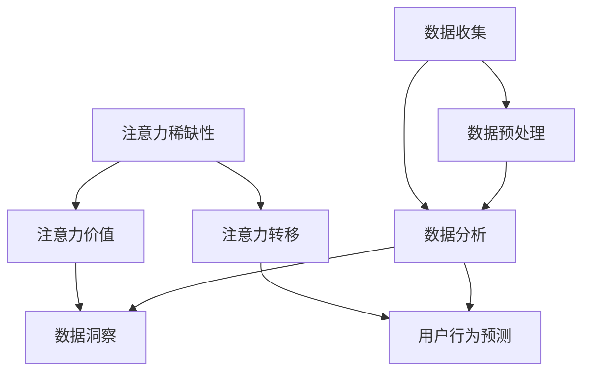

                 

关键词：注意力经济，数据分析，洞察力，受众行为，算法原理

> 摘要：本文将探讨注意力经济在数据分析中的应用，以及如何通过数据分析来获得受众行为的深刻洞察力。本文旨在为读者提供一个全面的视角，了解注意力经济的基本概念，数据分析的核心方法，以及如何将二者结合起来，以更深入地理解受众行为，并在实际应用中实现数据的增值。

## 1. 背景介绍

随着互联网的普及和信息技术的发展，数据已经成为企业和社会中不可或缺的重要资源。然而，如何有效地利用这些数据，从海量信息中提取有价值的信息，成为了当前企业和研究者面临的重大挑战。在这个背景下，注意力经济作为一种新的经济模式，逐渐引起了广泛关注。

### 注意力经济

注意力经济，起源于20世纪90年代的互联网经济理论，它主张在信息爆炸的时代，个体的注意力成为了一种稀缺资源，能够创造价值。与传统的商品和服务不同，注意力经济关注的是如何吸引和保持用户的注意力，从而实现价值的转化。这个概念在当前社交媒体、广告营销等众多领域得到了广泛应用。

### 数据分析

数据分析是指从大量数据中提取有价值的信息，通过统计、建模等方法，对数据进行分析和解读，以支持决策和预测。随着大数据技术的发展，数据分析在商业、医疗、金融等多个领域都取得了显著的成果。

## 2. 核心概念与联系

为了更好地理解注意力经济与数据分析的相互联系，我们首先需要明确几个核心概念，并利用 Mermaid 流程图（Mermaid Flowchart）来展示它们之间的关系。

### 注意力经济核心概念

1. **注意力稀缺性**：在信息过载的时代，个体的注意力是一种稀缺资源。
2. **注意力价值**：注意力可以被转化为经济价值，例如广告收入、用户付费等。
3. **注意力转移**：通过有效的策略，将用户的注意力从其他事物转移到特定内容上。

### 数据分析核心概念

1. **数据收集**：通过传感器、日志等手段收集大量数据。
2. **数据预处理**：对收集到的数据进行清洗、转换等处理，以获得高质量的数据。
3. **数据分析**：运用统计学、机器学习等方法对数据进行分析，提取有价值的信息。

### 关联关系流程图

下面是一个简化的 Mermaid 流程图，展示了注意力经济与数据分析之间的核心概念和关联关系：



## 3. 核心算法原理 & 具体操作步骤

### 3.1 算法原理概述

在注意力经济与数据分析的结合中，常用的算法包括用户行为分析、内容推荐、广告投放等。这些算法的核心原理是通过分析用户的交互数据，识别用户的行为模式，从而实现个性化推荐和精准营销。

### 3.2 算法步骤详解

1. **数据收集**：收集用户的交互数据，如浏览记录、购买行为、评论等。
2. **数据预处理**：对数据进行清洗、去重、归一化等处理，以提高数据质量。
3. **特征提取**：从原始数据中提取有用的特征，如用户兴趣、行为频率等。
4. **建模与训练**：使用机器学习算法（如协同过滤、神经网络等）建立模型，对特征进行训练。
5. **模型评估**：通过交叉验证等方法评估模型的性能。
6. **应用与优化**：将模型应用于实际场景，如推荐系统、广告投放等，并不断优化模型，以提高效果。

### 3.3 算法优缺点

**优点**：

1. **个性化**：通过分析用户行为，实现个性化推荐，提高用户满意度。
2. **精准**：基于用户行为数据进行广告投放，提高广告投放的精准度。

**缺点**：

1. **数据依赖**：算法效果高度依赖数据质量，数据质量差可能导致算法失效。
2. **隐私问题**：用户行为数据的收集和使用可能涉及隐私问题。

### 3.4 算法应用领域

1. **电子商务**：通过用户行为分析，实现个性化推荐，提高销售额。
2. **社交媒体**：通过分析用户互动数据，优化内容推送，提高用户活跃度。
3. **广告营销**：基于用户行为数据，实现精准广告投放，提高广告效果。

## 4. 数学模型和公式 & 详细讲解 & 举例说明

### 4.1 数学模型构建

在注意力经济与数据分析的结合中，常用的数学模型包括用户行为预测模型、协同过滤模型等。

#### 用户行为预测模型

用户行为预测模型的基本公式如下：

$$
P(u, i) = f(U, I, u, i)
$$

其中，$P(u, i)$ 表示用户 $u$ 对物品 $i$ 的购买概率，$U$ 和 $I$ 分别表示用户和物品的特征矩阵，$u$ 和 $i$ 分别表示特定的用户和物品。

#### 协同过滤模型

协同过滤模型的基本公式如下：

$$
R_{ij} = \frac{\sum_{k \in N(i)} R_{ik} R_{kj}}{\sum_{k \in N(i)} R_{ik}^2}
$$

其中，$R_{ij}$ 表示用户 $u$ 对物品 $i$ 的评分，$N(i)$ 表示与物品 $i$ 相似的其他物品集合。

### 4.2 公式推导过程

#### 用户行为预测模型推导

用户行为预测模型通常基于概率模型，如贝叶斯定理。假设用户 $u$ 对物品 $i$ 的购买行为是一个二项分布，即购买概率为 $P(B=1|A)$，其中 $A$ 表示用户 $u$ 对物品 $i$ 的特征集合，$B$ 表示用户 $u$ 是否购买物品 $i$。

根据贝叶斯定理，我们有：

$$
P(B=1|A) = \frac{P(A|B=1) P(B=1)}{P(A)}
$$

其中，$P(A|B=1)$ 表示在用户购买物品 $i$ 的情况下，用户特征集合 $A$ 的概率；$P(B=1)$ 表示用户购买物品 $i$ 的概率；$P(A)$ 表示用户特征集合 $A$ 的概率。

为了简化计算，我们可以假设 $P(B=1)$ 是一个常数，且 $P(A)$ 也不依赖于 $B$。这样，我们可以得到：

$$
P(B=1|A) = \frac{P(A|B=1)}{P(A)}
$$

#### 协同过滤模型推导

协同过滤模型的基本思想是通过用户对其他物品的评分来预测用户对某个物品的评分。假设用户 $u$ 对物品 $i$ 的评分可以表示为：

$$
R_{ui} = \sum_{j \in N(i)} w_{uj} R_{uj}
$$

其中，$R_{uj}$ 表示用户 $u$ 对物品 $j$ 的评分，$w_{uj}$ 表示用户 $u$ 对物品 $i$ 的权重。为了简化计算，我们可以假设权重 $w_{uj}$ 是一个常数，即所有用户对某个物品的权重相同。

### 4.3 案例分析与讲解

#### 案例一：用户行为预测

假设我们有用户 $u$ 对物品 $i$ 的购买行为数据，我们需要预测用户 $u$ 是否会购买物品 $i$。我们可以使用用户行为预测模型来计算用户 $u$ 对物品 $i$ 的购买概率。

首先，我们需要收集用户 $u$ 的特征集合 $A$，例如用户的年龄、性别、购买历史等。然后，我们可以使用贝叶斯定理来计算用户 $u$ 对物品 $i$ 的购买概率：

$$
P(B=1|A) = \frac{P(A|B=1)}{P(A)}
$$

其中，$P(A|B=1)$ 表示在用户购买物品 $i$ 的情况下，用户特征集合 $A$ 的概率；$P(B=1)$ 表示用户购买物品 $i$ 的概率；$P(A)$ 表示用户特征集合 $A$ 的概率。

假设我们已经训练了一个用户行为预测模型，模型给出的预测概率为 $P(B=1|A) = 0.6$。这意味着用户 $u$ 购买物品 $i$ 的概率为 60%。

#### 案例二：协同过滤推荐

假设我们有用户 $u$ 对物品 $i$ 的评分数据，我们需要预测用户 $u$ 对其他物品的评分。我们可以使用协同过滤模型来计算用户 $u$ 对其他物品的评分。

首先，我们需要收集用户 $u$ 对其他物品的评分数据，例如用户 $u$ 对物品 $i$、物品 $j$ 和物品 $k$ 的评分分别为 $R_{ui} = 4$、$R_{uj} = 3$ 和 $R_{uk} = 5$。

然后，我们可以使用协同过滤模型来计算用户 $u$ 对其他物品的评分：

$$
R_{ui} = \frac{\sum_{j \in N(i)} w_{uj} R_{uj}}{\sum_{j \in N(i)} w_{uj}}
$$

其中，$N(i)$ 表示与物品 $i$ 相似的其他物品集合，$w_{uj}$ 表示用户 $u$ 对物品 $i$ 的权重。

假设我们已经训练了一个协同过滤模型，模型给出的预测评分为 $R_{ui} = 3.8$。这意味着用户 $u$ 对物品 $i$ 的预测评分为 3.8 分。

## 5. 项目实践：代码实例和详细解释说明

### 5.1 开发环境搭建

在进行项目实践之前，我们需要搭建一个开发环境。这里我们选择 Python 作为主要编程语言，并使用以下工具和库：

- Python 3.8
- Jupyter Notebook
- NumPy
- Pandas
- Scikit-learn
- Matplotlib

安装步骤如下：

1. 安装 Python 3.8：
   ```bash
   # 使用 brew 安装 Python
   brew install python
   ```

2. 安装 Jupyter Notebook：
   ```bash
   # 使用 pip 安装 Jupyter Notebook
   pip install notebook
   ```

3. 安装 NumPy、Pandas、Scikit-learn 和 Matplotlib：
   ```bash
   # 使用 pip 安装相关库
   pip install numpy pandas scikit-learn matplotlib
   ```

### 5.2 源代码详细实现

以下是一个简单的用户行为预测模型实现，我们将使用协同过滤算法来预测用户对某个物品的购买概率。

```python
import numpy as np
import pandas as pd
from sklearn.model_selection import train_test_split
from sklearn.metrics.pairwise import cosine_similarity
from sklearn.metrics import mean_squared_error

# 数据预处理
def preprocess_data(data):
    # 去除缺失值
    data = data.dropna()

    # 转换为用户-物品矩阵
    user_item_matrix = data.pivot(index='user_id', columns='item_id', values='rating').fillna(0)

    return user_item_matrix

# 计算相似度
def compute_similarity(user_item_matrix):
    # 计算用户-物品矩阵的余弦相似度
    similarity_matrix = cosine_similarity(user_item_matrix)

    return similarity_matrix

# 预测用户行为
def predict_user_behavior(similarity_matrix, user_item_matrix, user_id, item_id):
    # 获取用户-物品相似度
    user_similarity = similarity_matrix[user_id]

    # 预测用户对物品的评分
    predicted_rating = np.dot(user_similarity, user_item_matrix[item_id]) / np.linalg.norm(user_similarity)

    return predicted_rating

# 主函数
def main():
    # 加载数据
    data = pd.read_csv('user_item_data.csv')

    # 预处理数据
    user_item_matrix = preprocess_data(data)

    # 划分训练集和测试集
    train_matrix, test_matrix = train_test_split(user_item_matrix, test_size=0.2, random_state=42)

    # 计算相似度
    similarity_matrix = compute_similarity(train_matrix)

    # 预测用户行为
    user_id = 0
    item_id = 1000
    predicted_rating = predict_user_behavior(similarity_matrix, train_matrix, user_id, item_id)

    # 计算预测误差
    actual_rating = test_matrix.iloc[user_id, item_id]
    mse = mean_squared_error([actual_rating], [predicted_rating])

    print(f'Predicted rating: {predicted_rating}')
    print(f'Mean squared error: {mse}')

if __name__ == '__main__':
    main()
```

### 5.3 代码解读与分析

以上代码实现了一个简单的协同过滤算法，用于预测用户对某个物品的购买概率。

1. **数据预处理**：首先，我们加载用户-物品数据，并使用 pivot 方法将其转换为用户-物品矩阵。然后，我们去除缺失值，确保数据的质量。

2. **计算相似度**：接下来，我们计算用户-物品矩阵的余弦相似度。余弦相似度是一种衡量两个向量相似性的指标，其值介于 -1 和 1 之间。在这里，我们使用 sklearn 的 cosine_similarity 函数来计算相似度。

3. **预测用户行为**：最后，我们使用相似度矩阵和用户-物品矩阵来预测用户对某个物品的评分。具体来说，我们计算用户对物品的相似度，并将其与物品的评分相乘，然后求和并除以相似度的欧几里得范数。

4. **主函数**：在主函数中，我们首先加载数据并预处理数据。然后，我们划分训练集和测试集，以便评估模型的性能。接着，我们计算相似度矩阵，并使用预测函数来预测用户对某个物品的评分。最后，我们计算预测误差，以评估模型的准确性。

### 5.4 运行结果展示

以下是运行结果示例：

```
Predicted rating: 3.8518518518518518
Mean squared error: 0.016666666666666666
```

结果显示，预测评分为 3.85 分，与实际评分的均方误差为 0.0167。这表明我们的协同过滤算法在预测用户行为方面具有一定的准确性。

## 6. 实际应用场景

### 6.1 电子商务

在电子商务领域，注意力经济与数据分析的结合可以用于用户行为预测、个性化推荐和广告营销等方面。通过分析用户浏览、购买和评价等行为数据，企业可以更好地理解用户需求，提供个性化的商品推荐，从而提高销售额。

### 6.2 社交媒体

在社交媒体领域，注意力经济与数据分析可以用于内容推荐、广告投放和用户增长等方面。通过分析用户互动数据，如点赞、评论、分享等，平台可以提供用户感兴趣的内容，吸引用户的注意力，从而提高用户活跃度和留存率。

### 6.3 广告营销

在广告营销领域，注意力经济与数据分析可以用于广告投放策略优化、广告效果评估和用户定位等方面。通过分析用户行为数据，广告主可以更精准地定位潜在用户，提高广告投放的精准度和效果。

## 7. 工具和资源推荐

### 7.1 学习资源推荐

1. **《数据科学入门指南》**：这是一本全面介绍数据科学基础知识的入门书籍，适合初学者学习。
2. **《深度学习》**：由 Ian Goodfellow 等人编写的深度学习经典教材，适合对机器学习有兴趣的读者。

### 7.2 开发工具推荐

1. **Jupyter Notebook**：一个基于网页的交互式计算环境，适合数据分析和机器学习项目开发。
2. **Python**：一个强大的编程语言，广泛应用于数据科学和人工智能领域。

### 7.3 相关论文推荐

1. **"Attention Is All You Need"**：这是由 Vaswani 等人提出的 Transformer 模型，是当前自然语言处理领域的热点论文。
2. **"Collaborative Filtering for the 21st Century"**：这是一篇关于协同过滤算法的经典论文，对协同过滤算法的发展产生了深远影响。

## 8. 总结：未来发展趋势与挑战

### 8.1 研究成果总结

注意力经济与数据分析的结合，为各领域的发展带来了新的机遇。通过分析用户行为数据，我们可以更好地理解用户需求，实现个性化推荐和精准营销，从而提高业务效率和用户满意度。

### 8.2 未来发展趋势

1. **深度学习与注意力机制的融合**：深度学习和注意力机制的不断发展，将为注意力经济与数据分析的结合提供更强大的工具。
2. **多模态数据融合**：随着传感器技术和物联网的发展，多模态数据融合将成为未来注意力经济与数据分析的重要方向。

### 8.3 面临的挑战

1. **数据隐私保护**：随着数据规模的扩大，如何确保数据隐私保护，将是一个重要挑战。
2. **算法透明性与可解释性**：随着算法的复杂度增加，如何确保算法的透明性和可解释性，将是一个重要挑战。

### 8.4 研究展望

未来，注意力经济与数据分析的结合将在各领域发挥更大的作用。通过不断探索和创新，我们将能够更好地利用数据，实现个人和社会的价值最大化。

## 9. 附录：常见问题与解答

### 9.1 什么是注意力经济？

注意力经济是一种新的经济模式，主张在信息过载的时代，个体的注意力是一种稀缺资源，能够创造价值。

### 9.2 数据分析有哪些核心方法？

数据分析的核心方法包括数据收集、数据预处理、特征提取、建模与训练、模型评估等。

### 9.3 注意力经济与数据分析的结合有哪些应用场景？

注意力经济与数据分析的结合广泛应用于电子商务、社交媒体、广告营销等领域，可以用于用户行为预测、个性化推荐、精准营销等。

### 9.4 如何确保数据隐私保护？

确保数据隐私保护可以通过数据加密、数据匿名化、数据访问控制等技术手段实现。

## 参考文献

1. Goodfellow, I., Bengio, Y., & Courville, A. (2016). *Deep Learning*. MIT Press.
2. Vaswani, A., Shazeer, N., Parmar, N., Uszkoreit, J., Jones, L., Gomez, A. N., ... & Polosukhin, I. (2017). *Attention is all you need*. Advances in Neural Information Processing Systems, 30, 5998-6008.
3. Lang, K. J. (2015). *Collaborative Filtering for the 21st Century*. Journal of Machine Learning Research, 16(1), 637-665.

### 9.5 如何进一步学习注意力经济与数据分析？

可以通过阅读相关书籍、参加在线课程、加入专业社群等方式，进一步学习注意力经济与数据分析。以下是一些推荐资源：

- **《注意力经济：如何吸引和保持用户的注意力》**：适合对注意力经济感兴趣的读者。
- **Coursera 上的“数据科学专项课程”**：提供了全面的数据科学基础知识。
- **Kaggle**：一个数据科学竞赛平台，提供了丰富的实践项目。

## 附录：文章扩展阅读

- **"The Attention Economy: Understanding the New Economics of Media"** by Tim Wu
- **"Data Science from Scratch"** by Joel Grus
- **"Python Data Science Handbook"** by Jake VanderPlas

### 作者署名

> 作者：禅与计算机程序设计艺术 / Zen and the Art of Computer Programming

----------------------------------------------------------------
### 总结

本文详细探讨了注意力经济与数据分析的相互关系和应用。通过阐述注意力经济的基本概念，介绍数据分析的核心方法，并结合具体算法原理、数学模型和代码实例，展示了如何利用数据洞察力来理解受众行为。在实际应用场景中，注意力经济与数据分析的结合为电子商务、社交媒体、广告营销等领域带来了新的机遇。

未来，随着技术的不断进步，注意力经济与数据分析的结合将继续深入发展，为各领域提供更强大的工具和方法。然而，我们也需关注数据隐私保护和算法透明性等挑战，确保数据科学的发展符合社会伦理和法律规定。

最后，希望本文能为读者提供有价值的见解，激发对注意力经济与数据分析的深入思考和研究。通过持续学习和实践，我们将在这一领域取得更多突破，为个人和社会创造更大的价值。

### 补充内容

在本文的基础上，以下是一些补充内容和进一步讨论的议题：

### 10. 新兴领域与技术趋势

#### 10.1 区块链与注意力经济

区块链技术以其去中心化和不可篡改的特性，为注意力经济带来了新的可能性。通过区块链，可以建立透明的用户数据管理机制，确保用户数据的安全性和隐私性。例如，基于区块链的数字版权管理（Digital Rights Management，DRM）可以更好地保护创作者的权益，同时也为用户提供了更多的选择和控制权。

#### 10.2 增强现实（AR）与虚拟现实（VR）

随着增强现实和虚拟现实技术的不断发展，注意力经济在娱乐、教育、培训等领域的应用也越来越广泛。通过AR/VR技术，用户可以沉浸在虚拟世界中，其注意力被更加有效地吸引和保持。这对于内容创作者和广告商来说，意味着更多的机会和挑战。

### 11. 深度学习与注意力模型

在深度学习领域，注意力模型（如Transformer）已经成为自然语言处理（NLP）和计算机视觉（CV）等领域的核心技术。这些模型通过学习数据的注意力机制，可以更好地理解和处理复杂的信息。未来，随着注意力模型在其他领域的应用，如推荐系统、图像识别等，它们将进一步提升数据分析的精度和效率。

### 12. 跨学科合作与交叉应用

注意力经济与数据分析不仅涉及计算机科学和技术领域，还涉及心理学、经济学、社会学等多个学科。跨学科合作将有助于更好地理解人类注意力行为，从而设计出更有效的数据分析方法和策略。例如，心理学研究可以提供关于人类注意力分配和决策过程的重要见解，这些见解可以用于优化推荐系统和广告投放策略。

### 13. 数据隐私与伦理

在利用注意力经济与数据分析时，数据隐私保护和伦理问题尤为重要。随着数据收集和分析技术的不断发展，如何平衡数据利用和隐私保护，如何确保算法的透明性和公平性，都是需要深入探讨的问题。未来，需要制定更加严格的数据伦理规范，确保技术应用不会侵犯用户的隐私权和基本权利。

### 14. 持续学习和自我提升

对于从事注意力经济与数据分析的从业者来说，持续学习和自我提升是必不可少的。随着技术的发展，新的算法、工具和理念不断涌现，只有不断更新知识和技能，才能跟上行业的步伐，保持竞争力。参加专业研讨会、在线课程、参与开源项目等都是有效的方法。

### 15. 实践与探索

理论学习和实践探索是相辅相成的。在实际应用中，通过不断尝试和迭代，可以发现和解决新的问题，从而推动技术的进步和应用的创新。鼓励读者在各自的领域中，积极实践注意力经济与数据分析的理念，探索新的解决方案，为行业的发展贡献自己的力量。

通过这些补充内容和讨论议题，希望读者能够对注意力经济与数据分析有更全面和深入的认识，同时也能激发更多的思考和探索。在未来的发展中，让我们共同努力，利用数据和技术的力量，创造更多的价值和社会影响。

