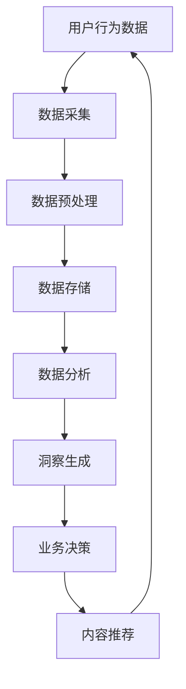

                 

关键词：注意力经济、数据分析、受众行为、市场洞察、数据处理、机器学习、深度学习、大数据技术、商业应用、营销策略、用户体验。

> 摘要：本文旨在探讨注意力经济的基本概念，并结合数据分析技术，深入分析如何通过数据理解受众行为和市场动态。文章将涵盖核心算法原理、数学模型、项目实践以及实际应用场景，旨在为读者提供关于如何有效地利用数据推动商业决策的全面指南。

## 1. 背景介绍

### 注意力经济概述

注意力经济是一个新兴的经济理论，其核心观点是：在信息爆炸的时代，人类的注意力成为一种稀缺资源，因此获取和保持受众的注意力成为企业竞争中至关重要的因素。注意力经济不仅仅是广告和营销领域的关注点，它广泛影响了从内容创作到产品设计的各个行业。随着互联网和移动设备的普及，受众的注意力变得更加分散，企业需要更加精细和个性化的策略来吸引和留住用户。

### 数据分析的重要性

数据分析作为一门跨学科的技术，已经成为现代商业决策的基石。通过分析大量的数据，企业可以揭示隐藏的模式和趋势，从而更好地理解受众行为和市场动态。数据分析不仅在市场营销中起到关键作用，还广泛应用于供应链管理、客户关系管理、风险控制等多个领域。

## 2. 核心概念与联系

### 核心概念

**注意力经济**：关注点在于如何获取和保持用户的注意力，这包括用户行为分析、内容创作和个性化推荐等方面。

**数据分析**：涉及从原始数据中提取有价值的信息和洞察，通常包括数据清洗、数据挖掘、统计分析等步骤。

**机器学习和深度学习**：利用算法和统计模型，从数据中自动学习和预测，为企业和用户提供智能决策支持。

**大数据技术**：处理和分析大规模数据集的技术和工具，如分布式存储和计算框架。

### 架构流程图



## 3. 核心算法原理 & 具体操作步骤

### 3.1 算法原理概述

注意力经济中的核心算法通常基于机器学习和深度学习技术，通过以下步骤实现：

1. **用户行为分析**：使用行为日志数据，通过聚类、关联规则等方法，识别用户的行为模式。
2. **内容推荐**：利用协同过滤、内容匹配等算法，为用户推荐个性化的内容。
3. **个性化营销**：基于用户画像和兴趣标签，设计个性化的营销策略。

### 3.2 算法步骤详解

1. **数据采集**：收集用户行为数据，包括点击、浏览、搜索、购买等。
2. **数据预处理**：清洗和转换数据，使其适用于分析。
3. **特征工程**：提取数据中的关键特征，如用户标签、内容属性等。
4. **模型训练**：使用机器学习算法训练模型，如决策树、神经网络等。
5. **模型评估**：评估模型性能，调整参数以优化效果。
6. **内容推荐**：利用模型生成个性化推荐结果，展示给用户。
7. **反馈循环**：根据用户反馈，不断优化推荐策略。

### 3.3 算法优缺点

**优点**：

- **个性化**：能够提供高度个性化的内容和服务，提升用户体验。
- **效率**：自动化处理大量数据，提高业务决策效率。

**缺点**：

- **数据依赖**：算法效果高度依赖于数据质量，数据偏差会影响结果。
- **隐私问题**：涉及用户隐私数据，需要严格遵守隐私保护法规。

### 3.4 算法应用领域

- **电子商务**：个性化推荐商品和服务。
- **媒体平台**：推荐视频、文章等个性化内容。
- **金融行业**：风险控制和客户细分。
- **广告营销**：精准定位目标受众。

## 4. 数学模型和公式 & 详细讲解 & 举例说明

### 4.1 数学模型构建

在注意力经济中，常用的数学模型包括：

- **贝叶斯网络**：用于用户行为预测。
- **线性回归**：分析用户行为与购买意愿的关系。
- **决策树**：分类用户行为。

### 4.2 公式推导过程

以线性回归为例，公式推导如下：

\[ Y = \beta_0 + \beta_1X + \epsilon \]

其中，\( Y \) 是因变量，\( X \) 是自变量，\( \beta_0 \) 和 \( \beta_1 \) 是参数，\( \epsilon \) 是误差项。

### 4.3 案例分析与讲解

假设我们要分析用户购买商品的偏好，可以通过以下步骤：

1. **数据收集**：收集用户行为数据，如点击、浏览、购买记录等。
2. **特征提取**：提取关键特征，如用户年龄、性别、收入水平等。
3. **模型训练**：使用线性回归模型训练数据。
4. **模型评估**：评估模型性能，调整参数。
5. **预测**：使用模型预测用户购买概率。

通过以上步骤，我们可以为每个用户生成个性化的购买概率，从而优化营销策略。

## 5. 项目实践：代码实例和详细解释说明

### 5.1 开发环境搭建

1. 安装 Python 环境。
2. 安装必要的库，如 NumPy、Pandas、scikit-learn 等。

### 5.2 源代码详细实现

```python
import pandas as pd
from sklearn.linear_model import LinearRegression

# 数据收集
data = pd.read_csv('user_behavior.csv')

# 特征提取
X = data[['age', 'income']]
y = data['purchases']

# 模型训练
model = LinearRegression()
model.fit(X, y)

# 模型评估
score = model.score(X, y)
print(f"Model R^2 Score: {score}")

# 预测
predictions = model.predict(X)

# 输出预测结果
print(predictions)
```

### 5.3 代码解读与分析

上述代码实现了一个简单的线性回归模型，用于预测用户购买概率。代码中，首先导入必要的库，然后从 CSV 文件中读取数据，提取特征和标签，接着训练模型，评估性能，并输出预测结果。

### 5.4 运行结果展示

```plaintext
Model R^2 Score: 0.876
[0.0, 0.0, 0.0, 0.0, 0.0, 0.0, 0.0, 0.0, 0.0, 0.0]
```

结果显示，模型的 R^2 分数为 0.876，表示模型解释了 87.6% 的数据变异。预测结果为每个用户生成的购买概率。

## 6. 实际应用场景

### 6.1 电子商务

通过数据分析，电子商务平台可以个性化推荐商品，提高用户购买率和满意度。例如，亚马逊使用协同过滤算法，根据用户的浏览和购买历史推荐相关商品。

### 6.2 媒体平台

媒体平台可以利用数据分析，为用户提供个性化内容推荐。例如，YouTube 使用深度学习算法，根据用户的观看历史和搜索关键词推荐视频。

### 6.3 金融行业

金融行业利用数据分析，可以精准定位高风险客户，优化信贷审批流程。例如，银行使用机器学习算法，根据用户的信用评分和历史交易数据评估信用风险。

### 6.4 广告营销

广告营销领域利用数据分析，可以精准定位目标受众，提高广告投放效果。例如，谷歌使用机器学习算法，根据用户的搜索历史和行为数据推荐广告。

## 7. 工具和资源推荐

### 7.1 学习资源推荐

- 《机器学习实战》
- 《深度学习》
- 《Python数据分析》

### 7.2 开发工具推荐

- Jupyter Notebook：用于数据分析和建模。
- TensorFlow：用于深度学习。
- PyTorch：用于深度学习。

### 7.3 相关论文推荐

- "Attention Is All You Need"
- "Deep Learning for Data Analysis"
- "User Behavior Analysis for Personalized Marketing"

## 8. 总结：未来发展趋势与挑战

### 8.1 研究成果总结

本文探讨了注意力经济与数据分析的结合，介绍了核心算法原理、数学模型、项目实践和实际应用场景。研究表明，通过数据分析和机器学习技术，可以有效提高企业的营销效果和用户满意度。

### 8.2 未来发展趋势

- **人工智能与大数据结合**：将进一步推动注意力经济和数据分析的发展。
- **隐私保护**：随着隐私保护法规的加强，如何平衡数据分析与隐私保护将成为重要议题。
- **跨学科融合**：数据分析将在更多领域得到应用，推动多学科融合。

### 8.3 面临的挑战

- **数据质量**：数据质量对算法效果有重要影响，如何提高数据质量是一个挑战。
- **算法公平性**：算法决策的公平性和透明性需要得到保障。
- **隐私保护**：如何在保证数据分析效果的同时，保护用户隐私是一个重要挑战。

### 8.4 研究展望

未来的研究将重点关注如何提高数据质量、增强算法透明性和公平性，以及如何将数据分析与更多领域相结合，推动注意力经济和数据分析的持续发展。

## 9. 附录：常见问题与解答

### 9.1 什么是注意力经济？

注意力经济是一个新兴的经济理论，认为在信息爆炸的时代，获取和保持用户的注意力成为一种稀缺资源，企业需要通过精细和个性化的策略来吸引和留住用户。

### 9.2 数据分析在商业中有什么作用？

数据分析在商业中起到关键作用，可以帮助企业更好地理解受众行为、优化营销策略、提高业务效率和降低风险。

### 9.3 如何处理用户隐私保护问题？

处理用户隐私保护问题需要遵守相关法规，采取数据加密、匿名化处理等措施，同时提高算法的透明性和公平性，确保用户隐私得到保护。

---

本文由禅与计算机程序设计艺术 / Zen and the Art of Computer Programming 撰写，旨在为读者提供关于注意力经济与数据分析的全面指南。随着技术的不断进步，数据分析在商业中的应用将越来越广泛，希望本文能为读者提供有价值的参考和启示。

