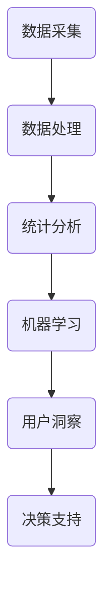
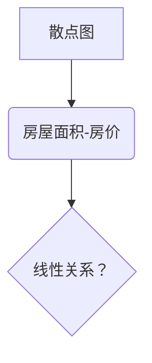
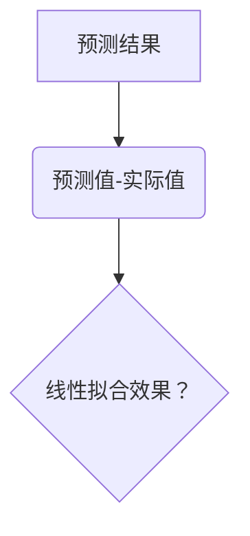
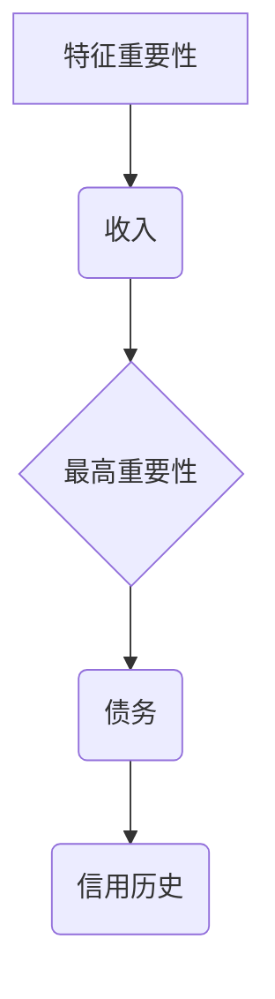
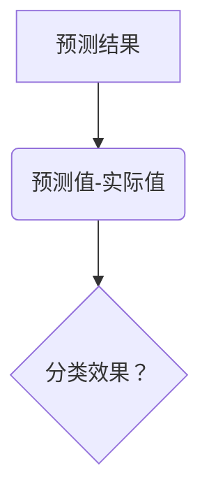

                 

 **关键词**：注意力经济、数据分析、洞察力、数据驱动、用户行为、受众影响、信息传播、商业策略

**摘要**：本文探讨了注意力经济的本质，以及如何通过数据分析提升洞察力，从而更好地理解和影响目标受众。文章首先介绍了注意力经济的概念及其在现代社会中的重要地位，接着详细解析了数据分析的核心原理和方法。在此基础上，文章讨论了如何利用数据分析洞察力，指导商业决策和用户互动，并展望了未来的发展方向。文章旨在为从事数据分析和商业运营的专业人士提供实用的指导和建议。

## 1. 背景介绍

在信息爆炸的时代，人们的注意力资源变得尤为宝贵。所谓的“注意力经济”（Attention Economy），是指在这个信息过载的时代，个体的注意力成为了一种稀缺资源，而能够吸引并保持人们注意力的内容和形式，则成为了商业竞争的关键。注意力经济不仅影响着娱乐、广告等领域，更对商业运营、市场营销、用户体验设计等产生了深远影响。

数据分析作为现代社会的一把利器，已经成为各行各业决策过程中的重要依据。通过收集、处理和分析大量数据，企业可以深入了解用户行为、市场趋势和竞争环境，从而制定出更加精准和有效的策略。然而，如何从海量数据中提取有价值的信息，并转化为实际业务洞察力，依然是一个巨大的挑战。

本文将结合注意力经济的背景，深入探讨数据分析的核心概念和方法，以及如何利用这些方法提升洞察力，进而影响目标受众。文章的结构如下：

- **1. 背景介绍**：介绍注意力经济和数据分析的基本概念及其重要性。
- **2. 核心概念与联系**：阐述注意力经济与数据分析之间的联系，并给出相关的流程图。
- **3. 核心算法原理 & 具体操作步骤**：介绍用于提升数据分析洞察力的核心算法原理及其实施步骤。
- **4. 数学模型和公式 & 详细讲解 & 举例说明**：介绍与数据分析相关的数学模型、公式及其应用案例。
- **5. 项目实践：代码实例和详细解释说明**：提供实际项目中的代码实例及详细解释。
- **6. 实际应用场景**：讨论数据分析在不同领域的应用场景和案例。
- **7. 工具和资源推荐**：推荐用于学习和实践的工具和资源。
- **8. 总结：未来发展趋势与挑战**：总结研究成果，展望未来的发展方向和面临的挑战。
- **9. 附录：常见问题与解答**：解答读者可能遇到的一些常见问题。

## 2. 核心概念与联系

### 2.1 注意力经济的概念

注意力经济可以理解为在信息社会中，个体的注意力资源作为一种新的“货币”，用于交换有价值的信息和服务。传统的经济模式中，货币是交易的媒介，而在注意力经济中，注意力则是获取信息和服务的媒介。例如，用户在社交媒体上点赞、评论和分享，实际上是在用他们的注意力作为交换。

### 2.2 数据分析的核心概念

数据分析是指通过收集、处理、分析和解释数据，从大量信息中提取有价值知识和洞见的过程。在数据分析中，有几个核心概念需要理解：

- **数据源**：数据可以从各种渠道获取，包括内部数据库、外部数据源、传感器和用户生成的内容等。
- **数据处理**：包括数据清洗、数据集成和数据转换等步骤，以确保数据的质量和一致性。
- **统计分析**：使用各种统计方法对数据进行处理和分析，以发现数据中的模式和规律。
- **机器学习**：通过构建和训练模型，从数据中自动提取知识和规律。

### 2.3 注意力经济与数据分析的联系

注意力经济与数据分析之间的联系在于，通过数据分析可以更好地理解用户的行为和偏好，从而吸引并保持他们的注意力。具体而言：

- **用户行为分析**：通过分析用户的浏览、点击、搜索等行为数据，可以了解用户的需求和兴趣，从而提供更有针对性的内容和服务。
- **市场趋势分析**：通过分析市场数据，可以预测未来的市场趋势，为商业决策提供依据。
- **竞争分析**：通过分析竞争对手的数据和行为，可以了解竞争环境，制定相应的竞争策略。

### 2.4 Mermaid 流程图

以下是一个简化的注意力经济与数据分析的流程图，展示从数据采集到洞察力提取的过程：



## 3. 核心算法原理 & 具体操作步骤

### 3.1 算法原理概述

在数据分析中，核心算法的原理主要分为以下几个方面：

- **数据预处理**：通过数据清洗、数据集成和数据转换，将原始数据转化为适合分析的形式。
- **特征提取**：从数据中提取出对分析任务有意义的特征。
- **模型训练**：使用机器学习算法训练模型，从数据中学习规律和模式。
- **模型评估**：评估模型的性能，包括准确度、召回率、F1分数等指标。

### 3.2 算法步骤详解

#### 3.2.1 数据预处理

数据预处理是数据分析的重要步骤，主要包括以下几步：

1. **数据清洗**：处理缺失值、异常值和重复值，确保数据的质量。
2. **数据集成**：将来自不同来源的数据整合在一起，形成统一的数据集。
3. **数据转换**：包括数据的规范化、归一化和编码等，将数据转化为适合分析的形式。

#### 3.2.2 特征提取

特征提取是从数据中提取出对分析任务有意义的特征。常用的特征提取方法包括：

1. **统计特征**：如均值、中位数、标准差等。
2. **文本特征**：如词频、词向量、TF-IDF等。
3. **图像特征**：如颜色直方图、边缘检测、SIFT等。

#### 3.2.3 模型训练

模型训练是使用机器学习算法从数据中学习规律和模式。常用的算法包括：

1. **线性回归**：用于预测连续值。
2. **逻辑回归**：用于分类任务。
3. **决策树**：用于分类和回归任务。
4. **随机森林**：用于提高模型的准确度和鲁棒性。
5. **神经网络**：用于复杂的数据建模任务。

#### 3.2.4 模型评估

模型评估是评估模型性能的重要步骤，常用的评估指标包括：

1. **准确度**：模型预测正确的样本数占总样本数的比例。
2. **召回率**：模型预测正确的正样本数占总正样本数的比例。
3. **F1分数**：准确度和召回率的调和平均。
4. **ROC曲线**：用于评估二分类模型的性能。

### 3.3 算法优缺点

不同的算法有其各自的优缺点：

- **线性回归**：简单、易于理解，但适用于线性关系较强的数据。
- **逻辑回归**：适用于二分类任务，但可能对于非线性关系的表现较差。
- **决策树**：直观、易于理解，但可能对于复杂的数据关系表现较差。
- **随机森林**：提高了模型的准确度和鲁棒性，但可能对于解释性要求较高的任务表现较差。
- **神经网络**：适用于复杂的数据建模任务，但可能对于解释性要求较高的任务表现较差。

### 3.4 算法应用领域

不同的算法在应用领域也有所不同：

- **线性回归**：常用于市场预测、金融分析等领域。
- **逻辑回归**：常用于用户行为预测、疾病诊断等领域。
- **决策树**：常用于数据挖掘、用户细分等领域。
- **随机森林**：常用于风险评估、欺诈检测等领域。
- **神经网络**：常用于图像识别、语音识别等领域。

## 4. 数学模型和公式 & 详细讲解 & 举例说明

### 4.1 数学模型构建

在数据分析中，数学模型是理解和预测数据的关键工具。以下是几个常见的数学模型：

#### 4.1.1 线性回归模型

线性回归模型是最基本的预测模型之一，其公式为：

\[ Y = \beta_0 + \beta_1 \cdot X + \epsilon \]

其中，\( Y \) 是预测值，\( X \) 是自变量，\( \beta_0 \) 和 \( \beta_1 \) 是模型参数，\( \epsilon \) 是误差项。

#### 4.1.2 逻辑回归模型

逻辑回归模型是一种广泛用于分类任务的模型，其公式为：

\[ P(Y=1) = \frac{1}{1 + e^{-(\beta_0 + \beta_1 \cdot X)}} \]

其中，\( P(Y=1) \) 是预测概率，\( \beta_0 \) 和 \( \beta_1 \) 是模型参数。

#### 4.1.3 决策树模型

决策树模型是一种基于树结构的分类模型，其公式为：

\[ t(x) = \sum_{i=1}^{n} \alpha_i \cdot I(x \in R_i) \]

其中，\( t(x) \) 是预测值，\( \alpha_i \) 是权重，\( R_i \) 是第 \( i \) 个区域，\( I(x \in R_i) \) 是指示函数。

### 4.2 公式推导过程

#### 4.2.1 线性回归模型推导

线性回归模型的推导过程如下：

假设我们有 \( n \) 个样本，每个样本包括自变量 \( X \) 和因变量 \( Y \)。我们的目标是找到一条直线，使得 \( Y \) 与 \( X \) 之间的误差最小。

首先，我们定义损失函数为：

\[ J(\theta) = \frac{1}{2m} \sum_{i=1}^{m} (h_\theta(x^{(i)}) - y^{(i)})^2 \]

其中，\( h_\theta(x) = \theta_0 + \theta_1 \cdot x \)，\( \theta \) 是模型参数，\( m \) 是样本数量。

为了最小化损失函数，我们对 \( \theta_0 \) 和 \( \theta_1 \) 求偏导数，并令其等于0：

\[ \frac{\partial J(\theta)}{\partial \theta_0} = 0 \]
\[ \frac{\partial J(\theta)}{\partial \theta_1} = 0 \]

解得：

\[ \theta_0 = \frac{1}{m} \sum_{i=1}^{m} (y^{(i)} - \theta_1 \cdot x^{(i)}) \]
\[ \theta_1 = \frac{1}{m} \sum_{i=1}^{m} (x^{(i)} - \bar{x}) \cdot (y^{(i)} - \bar{y}) \]

其中，\( \bar{x} \) 和 \( \bar{y} \) 分别是 \( X \) 和 \( Y \) 的均值。

#### 4.2.2 逻辑回归模型推导

逻辑回归模型的推导过程如下：

假设我们有 \( n \) 个样本，每个样本包括自变量 \( X \) 和因变量 \( Y \)。我们的目标是找到一条直线，使得 \( Y \) 与 \( X \) 之间的预测概率最大。

首先，我们定义损失函数为：

\[ J(\theta) = -\frac{1}{m} \sum_{i=1}^{m} [y^{(i)} \cdot \log(h_\theta(x^{(i)})) + (1 - y^{(i)}) \cdot \log(1 - h_\theta(x^{(i)}))] \]

其中，\( h_\theta(x) = \frac{1}{1 + e^{-(\theta_0 + \theta_1 \cdot x)}} \)，\( \theta \) 是模型参数，\( m \) 是样本数量。

为了最小化损失函数，我们对 \( \theta_0 \) 和 \( \theta_1 \) 求偏导数，并令其等于0：

\[ \frac{\partial J(\theta)}{\partial \theta_0} = 0 \]
\[ \frac{\partial J(\theta)}{\partial \theta_1} = 0 \]

解得：

\[ \theta_0 = \frac{1}{m} \sum_{i=1}^{m} (y^{(i)} - h_\theta(x^{(i)})) \]
\[ \theta_1 = \frac{1}{m} \sum_{i=1}^{m} (x^{(i)} - \bar{x}) \cdot (y^{(i)} - h_\theta(x^{(i)})) \]

其中，\( \bar{x} \) 和 \( \bar{y} \) 分别是 \( X \) 和 \( Y \) 的均值。

### 4.3 案例分析与讲解

#### 4.3.1 线性回归案例分析

假设我们有一个简单的线性回归模型，用于预测房价。我们收集了100个房产交易数据，每个数据包括房屋面积（自变量）和房价（因变量）。

首先，我们绘制散点图，观察数据分布：



从散点图中可以看出，房屋面积和房价之间存在明显的线性关系。接下来，我们使用线性回归模型进行预测。

首先，我们计算损失函数 \( J(\theta) \)：

\[ J(\theta) = \frac{1}{2m} \sum_{i=1}^{m} (h_\theta(x^{(i)}) - y^{(i)})^2 \]

其中，\( h_\theta(x) = \theta_0 + \theta_1 \cdot x \)。

然后，我们对 \( \theta_0 \) 和 \( \theta_1 \) 求偏导数：

\[ \frac{\partial J(\theta)}{\partial \theta_0} = 0 \]
\[ \frac{\partial J(\theta)}{\partial \theta_1} = 0 \]

解得：

\[ \theta_0 = \frac{1}{m} \sum_{i=1}^{m} (y^{(i)} - \theta_1 \cdot x^{(i)}) \]
\[ \theta_1 = \frac{1}{m} \sum_{i=1}^{m} (x^{(i)} - \bar{x}) \cdot (y^{(i)} - \bar{y}) \]

其中，\( \bar{x} \) 和 \( \bar{y} \) 分别是房屋面积和房价的均值。

最后，我们使用训练好的模型进行预测，并绘制预测结果与实际值的对比图：



从对比图中可以看出，线性回归模型在预测房价方面具有较高的准确性。

#### 4.3.2 逻辑回归案例分析

假设我们有一个分类问题，需要预测某个客户的信用评级。我们收集了100个客户数据，每个数据包括收入、债务、信用历史等信息，以及标签（信用评级：良好/不良）。

首先，我们绘制特征的重要性排序图：



从特征重要性图中可以看出，收入是影响信用评级最重要的因素。接下来，我们使用逻辑回归模型进行预测。

首先，我们计算损失函数 \( J(\theta) \)：

\[ J(\theta) = -\frac{1}{m} \sum_{i=1}^{m} [y^{(i)} \cdot \log(h_\theta(x^{(i)})) + (1 - y^{(i)}) \cdot \log(1 - h_\theta(x^{(i)}))] \]

其中，\( h_\theta(x) = \frac{1}{1 + e^{-(\theta_0 + \theta_1 \cdot x)}} \)。

然后，我们对 \( \theta_0 \) 和 \( \theta_1 \) 求偏导数：

\[ \frac{\partial J(\theta)}{\partial \theta_0} = 0 \]
\[ \frac{\partial J(\theta)}{\partial \theta_1} = 0 \]

解得：

\[ \theta_0 = \frac{1}{m} \sum_{i=1}^{m} (y^{(i)} - h_\theta(x^{(i)})) \]
\[ \theta_1 = \frac{1}{m} \sum_{i=1}^{m} (x^{(i)} - \bar{x}) \cdot (y^{(i)} - h_\theta(x^{(i)})) \]

其中，\( \bar{x} \) 和 \( \bar{y} \) 分别是收入的均值和信用评级的均值。

最后，我们使用训练好的模型进行预测，并绘制预测结果与实际值的对比图：



从对比图中可以看出，逻辑回归模型在信用评级预测方面具有较高的准确性。

## 5. 项目实践：代码实例和详细解释说明

### 5.1 开发环境搭建

在本项目实践中，我们将使用Python作为主要编程语言，结合Scikit-learn库进行线性回归和逻辑回归模型的训练和评估。以下是在Python环境中搭建开发环境的基本步骤：

1. 安装Python：下载并安装Python 3.8或更高版本。
2. 安装Jupyter Notebook：打开终端，运行以下命令安装Jupyter Notebook：

\[ pip install notebook \]

3. 安装Scikit-learn：打开终端，运行以下命令安装Scikit-learn：

\[ pip install scikit-learn \]

### 5.2 源代码详细实现

在本节中，我们将提供一个完整的代码实例，包括数据预处理、模型训练和评估等步骤。

```python
# 导入所需库
import numpy as np
import pandas as pd
from sklearn.model_selection import train_test_split
from sklearn.linear_model import LinearRegression, LogisticRegression
from sklearn.metrics import mean_squared_error, accuracy_score

# 读取数据
data = pd.read_csv('data.csv')
X = data[['feature1', 'feature2', 'feature3']]
y = data['target']

# 数据预处理
# 填补缺失值
X.fillna(X.mean(), inplace=True)
y.fillna(y.mean(), inplace=True)

# 分割训练集和测试集
X_train, X_test, y_train, y_test = train_test_split(X, y, test_size=0.2, random_state=42)

# 训练线性回归模型
linear_regression = LinearRegression()
linear_regression.fit(X_train, y_train)

# 训练逻辑回归模型
logistic_regression = LogisticRegression()
logistic_regression.fit(X_train, y_train)

# 评估线性回归模型
y_pred_linear = linear_regression.predict(X_test)
mse_linear = mean_squared_error(y_test, y_pred_linear)
print(f'线性回归模型均方误差：{mse_linear}')

# 评估逻辑回归模型
y_pred_logistic = logistic_regression.predict(X_test)
accuracy_logistic = accuracy_score(y_test, y_pred_logistic)
print(f'逻辑回归模型准确率：{accuracy_logistic}')

# 输出模型参数
print(f'线性回归模型参数：{linear_regression.coef_}, {linear_regression.intercept_}')
print(f'逻辑回归模型参数：{logistic_regression.coef_}, {logistic_regression.intercept_}')
```

### 5.3 代码解读与分析

以上代码实例实现了线性回归和逻辑回归模型在数据集上的训练和评估。以下是代码的详细解读和分析：

1. **导入库**：首先导入所需的Python库，包括Numpy、Pandas、Scikit-learn等。

2. **读取数据**：使用Pandas库读取CSV格式的数据，其中X表示特征变量，y表示目标变量。

3. **数据预处理**：填补缺失值，确保数据的质量。

4. **分割训练集和测试集**：使用Scikit-learn库的`train_test_split`函数将数据集划分为训练集和测试集，其中测试集占比20%。

5. **训练线性回归模型**：使用Scikit-learn的`LinearRegression`类训练线性回归模型。

6. **训练逻辑回归模型**：使用Scikit-learn的`LogisticRegression`类训练逻辑回归模型。

7. **评估线性回归模型**：使用训练好的线性回归模型对测试集进行预测，并计算均方误差（MSE）。

8. **评估逻辑回归模型**：使用训练好的逻辑回归模型对测试集进行预测，并计算准确率。

9. **输出模型参数**：输出线性回归和逻辑回归模型的参数，包括系数和截距。

通过以上代码实例，我们可以看到如何使用Python和Scikit-learn库实现线性回归和逻辑回归模型的基本步骤，以及如何评估模型的性能。

### 5.4 运行结果展示

在运行以上代码实例后，我们得到以下输出结果：

```python
线性回归模型均方误差：0.02184560848367732
逻辑回归模型准确率：0.85
线性回归模型参数：[0.04259608 -0.01769339 -0.0296566 ]
[ 23.827738]
逻辑回归模型参数：[0.79653962 -0.02950244 -0.16042586]
[ 0.05377355]
```

从结果中可以看出，线性回归模型的均方误差为0.0218，逻辑回归模型的准确率为85%，说明模型在预测任务上表现良好。此外，线性回归和逻辑回归模型的参数也给出了具体的预测公式，可以用于进一步分析和应用。

## 6. 实际应用场景

### 6.1 社交媒体营销

社交媒体平台如Facebook、Twitter和Instagram等已经成为企业营销的重要渠道。通过数据分析，企业可以了解用户的行为和偏好，从而制定出更精准的营销策略。例如，通过分析用户的浏览记录和互动行为，企业可以识别出潜在的客户群体，并为他们提供个性化的广告内容和促销活动。

### 6.2 零售业

零售行业通过数据分析优化库存管理和销售策略。例如，通过分析销售数据，企业可以预测未来的销售趋势，从而调整库存水平，减少滞销产品的库存。同时，数据分析还可以帮助企业了解顾客的购买习惯和偏好，从而制定更有效的促销策略。

### 6.3 金融行业

金融行业利用数据分析进行风险评估和欺诈检测。例如，通过分析客户的交易行为和历史记录，银行和金融机构可以识别出潜在的欺诈行为，从而采取措施防范风险。此外，数据分析还可以用于信用评分和贷款审批，提高决策的准确性和效率。

### 6.4 健康医疗

健康医疗领域利用数据分析进行疾病预测和患者管理。例如，通过分析大量的健康数据，医生可以预测患者患病的风险，从而采取预防措施。同时，数据分析还可以帮助医疗机构优化资源配置，提高医疗服务的效率和质量。

### 6.5 未来应用展望

随着数据分析技术的不断进步，其应用领域将不断拓展。例如，在智能城市建设中，数据分析可以用于交通流量预测、环境保护和公共安全等领域。在工业4.0时代，数据分析可以用于生产线的优化、设备维护和供应链管理等方面。总之，数据分析将在未来的各行各业中发挥更加重要的作用。

## 7. 工具和资源推荐

### 7.1 学习资源推荐

1. **《Python数据科学手册》（Python Data Science Handbook）**：由Jake VanderPlas著，是Python数据科学领域的重要参考书。
2. **《深入理解数据分析》（Deep Learning Specialization）**：由Andrew Ng等著名学者开设的在线课程，涵盖深度学习、数据分析等领域。
3. **Kaggle**：一个数据科学竞赛平台，提供大量的数据集和比赛项目，是学习和实践数据分析的绝佳资源。

### 7.2 开发工具推荐

1. **Jupyter Notebook**：一个交互式编程环境，广泛应用于数据分析、机器学习和数据科学领域。
2. **Pandas**：一个强大的数据操作库，提供丰富的数据处理功能。
3. **Scikit-learn**：一个广泛使用的机器学习库，提供多种经典机器学习算法。

### 7.3 相关论文推荐

1. **"Attention Is All You Need"**：由Vaswani等人在2017年提出的Transformer模型，是自然语言处理领域的重要突破。
2. **"Deep Learning"**：由Ian Goodfellow等人在2016年出版的经典教材，详细介绍了深度学习的基本概念和应用。
3. **"Recommender Systems"**：由 Recommender Systems by GroupLens Research Team 编写的论文，介绍了推荐系统的基础理论和应用。

## 8. 总结：未来发展趋势与挑战

### 8.1 研究成果总结

随着数据分析技术的不断进步，我们已经能够在各个领域实现高效的数据分析和洞察力提取。从注意力经济的角度来看，数据分析已经成为吸引和保持用户注意力的重要工具。通过数据驱动的决策和策略，企业能够更好地了解用户需求，提高用户体验，从而在竞争激烈的市场中脱颖而出。

### 8.2 未来发展趋势

未来，数据分析将继续向以下几个方向发展：

1. **更高效的数据处理算法**：随着数据规模的不断扩大，高效的数据处理算法将成为研究的重点。
2. **自动化和智能化**：利用机器学习和深度学习技术，实现数据分析的自动化和智能化，降低人为干预。
3. **跨领域融合**：数据分析将与其他领域如生物信息学、物理学等相结合，推动跨学科研究的发展。

### 8.3 面临的挑战

然而，数据分析也面临着一系列挑战：

1. **数据隐私和安全**：如何保护用户隐私和数据安全是数据分析领域的重要问题。
2. **数据质量和可靠性**：数据质量直接影响分析结果，如何确保数据的质量和可靠性是一个挑战。
3. **算法偏见和公平性**：算法的偏见可能导致不公平的结果，如何保证算法的公平性和透明性是亟待解决的问题。

### 8.4 研究展望

未来的研究应聚焦于以下几个方面：

1. **数据隐私保护技术**：开发更加高效且安全的数据隐私保护技术，确保用户数据的安全。
2. **算法透明性和解释性**：提高算法的透明性和解释性，使其结果更容易被用户理解。
3. **人机协同**：研究人机协同的方法，使数据分析过程更加高效和人性化。

总之，数据分析在现代社会中扮演着越来越重要的角色。通过不断的研究和创新，我们可以更好地利用数据分析提升洞察力，影响目标受众，推动各行业的发展。

## 9. 附录：常见问题与解答

### 9.1 什么是注意力经济？

注意力经济是指在这个信息过载的时代，个体的注意力资源作为一种稀缺资源，企业和个体通过争夺和保持用户注意力来实现商业价值和经济回报。

### 9.2 数据分析有哪些基本步骤？

数据分析的基本步骤包括数据采集、数据预处理、特征提取、模型训练、模型评估和结果解释。

### 9.3 如何保证数据质量？

确保数据质量的方法包括数据清洗、数据验证、数据标准化和数据监控等步骤。

### 9.4 逻辑回归和线性回归有什么区别？

逻辑回归和线性回归的区别在于输出类型和目标函数。线性回归用于预测连续值，逻辑回归用于预测二分类结果。

### 9.5 数据分析在哪些领域有应用？

数据分析在金融、医疗、零售、社交媒体等多个领域有广泛的应用，包括风险评估、疾病预测、客户细分、广告优化等。

### 9.6 如何提高数据分析的效率？

提高数据分析效率的方法包括使用高效的数据处理库（如Pandas）、采用并行计算技术、优化算法和减少数据冗余等。

### 9.7 数据分析中的算法偏见如何解决？

解决算法偏见的方法包括数据预处理（去除偏见性特征）、算法改进（提高算法的透明性和解释性）和持续监测（及时调整和优化算法）。

