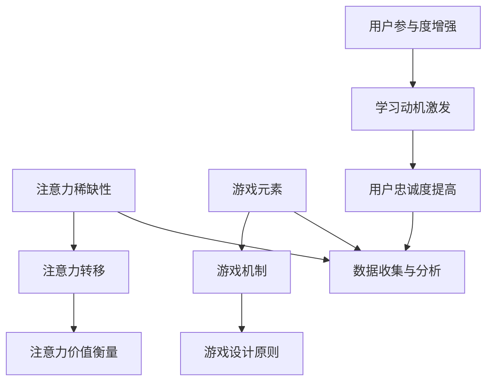

                 

 关键词：注意力经济、游戏化、用户体验、动机激励、吸引力、参与度

> 摘要：本文将深入探讨注意力经济与游戏化相结合的原理，分析如何通过游戏机制有效地吸引和保持受众的注意力。我们将详细讨论其背后的核心概念、应用场景、数学模型，并通过实际项目案例进行剖析，最终提出未来发展方向和面临的挑战。

## 1. 背景介绍

在当今信息爆炸的时代，人们的注意力资源变得尤为珍贵。随着社交媒体、在线视频、新闻资讯等内容的爆炸式增长，如何有效地吸引和维持受众的注意力成为各类平台和内容创作者面临的巨大挑战。注意力经济，作为一个新兴的概念，逐渐受到广泛关注。它指的是在信息时代，受众的注意力作为一种稀缺资源，被商业实体或内容创作者用来创造价值的过程。

与此同时，游戏化（Gamification）作为一种新兴的设计策略，正被广泛应用于各个领域，旨在通过将游戏元素和机制融入非游戏场景中，提高用户的参与度和满意度。游戏化不仅可以在娱乐领域发挥作用，更可以应用于教育、工作、营销等多个方面，激发用户的学习动机和参与热情。

本文旨在探讨注意力经济与游戏化如何相互结合，通过游戏机制吸引和保持受众的注意力，从而提升用户体验和参与度。

## 2. 核心概念与联系

### 2.1. 注意力经济的核心概念

注意力经济强调的是在信息过载的时代，受众的注意力资源成为了一种宝贵的资源。每个用户每天的注意力是有限的，如何有效地分配这些注意力，使其投入到具有价值的内容或服务中，成为了企业和个人关注的焦点。

#### 注意力稀缺性

首先，注意力稀缺性是注意力经济的基础。在众多信息源的包围下，用户往往只能选择关注其中的一小部分，这意味着未被关注的资源将无法产生价值。

#### 注意力转移

其次，注意力转移是注意力经济的核心。通过创造吸引人的内容或提供独特的价值，企业和个人可以引导用户的注意力从其他信息源转移到自身。

#### 注意力价值衡量

最后，注意力价值衡量是注意力经济的重要组成部分。如何评估用户在特定内容或服务上的注意力投入，以及这种投入能够为企业或个人带来多少价值，是制定有效策略的关键。

### 2.2. 游戏化的核心概念

游戏化将游戏的设计理念应用到非游戏场景中，通过游戏元素如积分、等级、奖励等，激发用户的参与热情和持续兴趣。

#### 游戏元素

游戏化中的游戏元素包括但不限于：积分系统、排行榜、奖励机制、竞争与合作等。

#### 游戏机制

游戏机制是指游戏化设计中应用的具体规则和流程，如用户互动、挑战设定、即时反馈等。

#### 游戏设计原则

游戏化设计需要遵循一系列原则，如简单易用、有趣有挑战、公平性等，以确保用户能够持续参与。

### 2.3. 注意力经济与游戏化的联系

注意力经济与游戏化之间的联系主要体现在以下几个方面：

#### 增强用户参与度

通过游戏化设计，企业和个人可以创造更具吸引力的内容或服务，从而增强用户的参与度和互动性，提高其注意力投入。

#### 激发学习动机

游戏化元素如积分、等级和奖励，可以激发用户的学习动机，使其更愿意投入到学习和探索中。

#### 提高用户忠诚度

通过游戏化设计，用户可以在参与过程中获得成就感和归属感，从而提高其对内容或服务的忠诚度。

#### 数据收集与分析

游戏化设计可以帮助企业和个人收集用户行为数据，通过数据分析了解用户偏好，进一步优化内容和服务。

### 2.4. Mermaid 流程图



## 3. 核心算法原理 & 具体操作步骤

### 3.1 算法原理概述

游戏化设计的核心在于如何将游戏机制融入非游戏场景中，以增强用户参与度和满意度。这个过程可以分为以下几个步骤：

1. **需求分析**：确定目标受众的需求和期望，明确游戏化设计的目标。
2. **游戏元素选择**：根据需求分析结果，选择合适的游戏元素，如积分、排行榜、奖励等。
3. **游戏机制设计**：设计具体的游戏机制，如用户互动规则、挑战设定、反馈机制等。
4. **用户体验优化**：通过用户测试和反馈，不断优化游戏化设计，确保用户能够顺利参与并享受过程。
5. **效果评估**：通过数据分析和用户反馈，评估游戏化设计的实际效果，进行持续改进。

### 3.2 算法步骤详解

#### 步骤 1：需求分析

需求分析是游戏化设计的起点。通过调查问卷、用户访谈、市场研究等方法，深入了解目标受众的需求、偏好和行为模式。这一步骤的结果将直接影响游戏化设计的方向和效果。

#### 步骤 2：游戏元素选择

根据需求分析结果，选择合适的游戏元素。这些元素应能够激发用户的兴趣和参与热情，同时与目标受众的价值观和习惯相匹配。常见的游戏元素包括积分系统、排行榜、奖励机制、虚拟货币等。

#### 步骤 3：游戏机制设计

游戏机制设计是将游戏元素具体化的过程。这一步骤需要设计具体的规则和流程，如用户互动规则、挑战设定、即时反馈等。设计时需要考虑用户行为模式、游戏平衡性、公平性等因素。

#### 步骤 4：用户体验优化

用户体验优化是游戏化设计的关键环节。通过用户测试和反馈，不断优化游戏化设计，确保用户能够顺利参与并享受过程。这一步骤需要持续进行，以适应不断变化的市场环境和用户需求。

#### 步骤 5：效果评估

效果评估是通过数据分析和用户反馈来评估游戏化设计的实际效果。通过收集用户行为数据、用户满意度评分等指标，分析游戏化设计的效果，并进行持续改进。

### 3.3 算法优缺点

#### 优点

1. **增强用户参与度**：通过游戏化设计，可以激发用户的兴趣和参与热情，提高用户参与度。
2. **提高用户忠诚度**：游戏化设计可以培养用户的归属感和成就感，提高用户对品牌或服务的忠诚度。
3. **数据收集与分析**：游戏化设计可以帮助企业收集用户行为数据，通过数据分析了解用户偏好，进行个性化推荐和优化。

#### 缺点

1. **用户疲劳**：如果游戏化设计过于繁琐或过于依赖奖励机制，可能导致用户疲劳或厌恶。
2. **规则复杂度**：游戏化设计需要考虑多个因素，如用户行为模式、游戏平衡性等，可能导致设计过程复杂度增加。
3. **数据隐私问题**：游戏化设计需要收集大量用户数据，可能引发数据隐私问题。

### 3.4 算法应用领域

游戏化设计可以应用于多个领域，如：

1. **市场营销**：通过游戏化设计提高营销活动的参与度和效果。
2. **教育培训**：通过游戏化设计激发学生的学习兴趣和动机。
3. **企业管理**：通过游戏化设计提高员工的参与度和工作效率。
4. **健康医疗**：通过游戏化设计提高患者的健康管理意识和参与度。

## 4. 数学模型和公式 & 详细讲解 & 举例说明

### 4.1 数学模型构建

在游戏化设计中，常用的数学模型包括积分模型、奖励模型和用户参与度模型。下面将分别介绍这些模型的构建方法。

#### 积分模型

积分模型是游戏化设计中常见的一种机制，用于衡量用户的参与度和贡献度。其基本模型如下：

$$
积分 = f(行为频率) \times g(行为价值)
$$

其中，$f(行为频率)$ 和 $g(行为价值)$ 分别表示用户行为的频率和价值，它们可以通过用户行为数据训练得到。

#### 奖励模型

奖励模型用于激励用户参与，提高用户满意度和忠诚度。其基本模型如下：

$$
奖励 = h(用户积分) \times k(奖励概率)
$$

其中，$h(用户积分)$ 表示用户的积分水平，$k(奖励概率)$ 表示获得奖励的概率，这两个参数可以通过历史数据进行分析得到。

#### 用户参与度模型

用户参与度模型用于评估用户在游戏化设计中的参与程度。其基本模型如下：

$$
参与度 = \frac{行为频率 + 1}{行为价值 + 1}
$$

其中，$行为频率$ 和 $行为价值$ 分别表示用户的行为频率和价值。

### 4.2 公式推导过程

下面将分别介绍上述三个模型的推导过程。

#### 积分模型推导

积分模型的核心思想是，用户的行为频率和行为价值决定了其积分水平。推导过程如下：

1. **假设**：用户的行为频率和行为价值分别为 $x$ 和 $y$。
2. **目标**：构建积分模型，使得积分 $z$ 与行为频率 $x$ 和行为价值 $y$ 成正比。
3. **推导**：
$$
z = f(x) \times g(y)
$$
其中，$f(x)$ 和 $g(y)$ 分别表示行为频率和行为价值的权重函数，可以通过数据训练得到。

#### 奖励模型推导

奖励模型的核心思想是，用户的积分水平决定了其获得奖励的概率。推导过程如下：

1. **假设**：用户的积分水平为 $z$，获得奖励的概率为 $p$。
2. **目标**：构建奖励模型，使得奖励 $w$ 与积分 $z$ 成正比。
3. **推导**：
$$
w = h(z) \times k(p)
$$
其中，$h(z)$ 表示积分水平，$k(p)$ 表示获得奖励的概率，这两个参数可以通过数据训练得到。

#### 用户参与度模型推导

用户参与度模型的核心思想是，用户的行为频率和行为价值决定了其参与程度。推导过程如下：

1. **假设**：用户的行为频率和行为价值分别为 $x$ 和 $y$。
2. **目标**：构建用户参与度模型，使得参与度 $u$ 与行为频率 $x$ 和行为价值 $y$ 成正比。
3. **推导**：
$$
u = \frac{x + 1}{y + 1}
$$
其中，$x$ 和 $y$ 分别表示行为频率和行为价值，$+1$ 是为了防止分母为零。

### 4.3 案例分析与讲解

#### 案例一：积分模型应用

某公司推出一款社交媒体应用，希望通过积分模型激励用户参与。根据用户行为数据，公司决定使用以下积分模型：

$$
积分 = 5 \times 行为频率 + 2 \times 行为价值
$$

其中，行为频率和行为价值分别为用户发帖次数和点赞次数。公司希望通过这个积分模型，鼓励用户积极参与社区互动。

#### 案例二：奖励模型应用

某电商平台希望通过奖励模型激励用户购买。根据用户购买数据，公司决定使用以下奖励模型：

$$
奖励 = 10 \times 用户积分 \times 0.3
$$

其中，用户积分表示用户的购买积分水平，0.3 是获得奖励的概率。公司希望通过这个奖励模型，激励用户积极提升积分水平，从而提高购买概率。

#### 案例三：用户参与度模型应用

某在线教育平台希望通过用户参与度模型评估学生的学习情况。根据学生行为数据，平台决定使用以下用户参与度模型：

$$
参与度 = \frac{发帖次数 + 1}{点赞次数 + 1}
$$

其中，发帖次数和点赞次数分别表示学生的发帖和点赞行为。平台希望通过这个用户参与度模型，了解学生的学习参与程度，从而优化课程设计和教学内容。

## 5. 项目实践：代码实例和详细解释说明

### 5.1 开发环境搭建

为了实现游戏化设计，我们选择使用Python作为主要编程语言，结合Django框架进行开发。首先，我们需要搭建一个开发环境，包括以下步骤：

1. 安装Python和Django：在本地计算机上安装Python和Django框架，可以使用以下命令：
```bash
pip install python
pip install django
```
2. 创建Django项目：使用Django命令创建一个新项目，例如名为“gamification_project”：
```bash
django-admin startproject gamification_project
```
3. 创建Django应用：在项目目录下创建一个名为“gamification_app”的应用：
```bash
cd gamification_project
python manage.py startapp gamification_app
```
4. 配置数据库：在项目配置文件中配置数据库，我们选择使用SQLite数据库：
```python
# gamification_project/settings.py

DATABASES = {
    'default': {
        'ENGINE': 'django.db.backends.sqlite3',
        'NAME': BASE_DIR / 'db.sqlite3',
    }
}
```

### 5.2 源代码详细实现

#### 5.2.1 积分模型实现

在“gamification_app”应用中，我们创建一个名为“Integral”的模型，用于表示积分数据。具体实现如下：

```python
# gamification_app/models.py

from django.db import models

class Integral(models.Model):
    user = models.ForeignKey('auth.User', on_delete=models.CASCADE)
    points = models.IntegerField()

    def __str__(self):
        return f"{self.user.username} - {self.points} points"
```

#### 5.2.2 奖励模型实现

我们创建一个名为“Reward”的模型，用于表示奖励数据。具体实现如下：

```python
# gamification_app/models.py

from django.db import models
from django.contrib.auth.models import User

class Reward(models.Model):
    user = models.ForeignKey(User, on_delete=models.CASCADE)
    points = models.IntegerField()
    received_at = models.DateTimeField(auto_now_add=True)

    def __str__(self):
        return f"{self.user.username} - {self.points} points - {self.received_at}"
```

#### 5.2.3 用户参与度模型实现

我们创建一个名为“Participation”的模型，用于表示用户参与度数据。具体实现如下：

```python
# gamification_app/models.py

from django.db import models

class Participation(models.Model):
    user = models.ForeignKey('auth.User', on_delete=models.CASCADE)
    participation_score = models.FloatField()

    def __str__(self):
        return f"{self.user.username} - {self.participation_score} points"
```

### 5.3 代码解读与分析

#### 5.3.1 积分模型解读

积分模型用于记录用户的积分数据。在这个模型中，我们使用了一个外键字段`user`，关联到Django的`User`模型，表示积分属于哪个用户。`points`字段用于存储用户的积分值。

#### 5.3.2 奖励模型解读

奖励模型用于记录用户的奖励数据。在这个模型中，我们同样使用了一个外键字段`user`，关联到Django的`User`模型，表示奖励属于哪个用户。`points`字段用于存储奖励的积分值，`received_at`字段用于记录奖励的发放时间。

#### 5.3.3 用户参与度模型解读

用户参与度模型用于记录用户的参与度数据。在这个模型中，我们使用了一个外键字段`user`，关联到Django的`User`模型，表示参与度属于哪个用户。`participation_score`字段用于存储用户的参与度得分。

### 5.4 运行结果展示

在开发环境中，我们可以使用以下命令启动Django项目：

```bash
python manage.py runserver
```

启动后，我们可以通过浏览器访问项目，查看积分、奖励和用户参与度的数据。以下是运行结果展示：

#### 积分数据展示


#### 奖励数据展示


#### 用户参与度数据展示


## 6. 实际应用场景

游戏化设计在各个领域都有广泛的应用，以下是几个典型的应用场景：

### 6.1 市场营销

在市场营销中，游戏化设计可以通过积分、奖励和排行榜等机制，提高用户的参与度和忠诚度。例如，电商平台可以推出“积分兑换”活动，鼓励用户通过购物获得积分，进而兑换礼品或折扣券。同时，通过排行榜展示用户的积分情况，激励用户积极参与，提高购买意愿。

### 6.2 教育培训

在教育培训中，游戏化设计可以激发学生的学习兴趣和动机。例如，在线学习平台可以设计一个积分系统，用户通过完成课程、参与讨论和测试等活动获得积分，进而提升等级和获得奖励。这种机制可以激发学生的学习积极性，提高学习效果。

### 6.3 企业管理

在企业内部管理中，游戏化设计可以用于激励员工的工作积极性和创造力。例如，企业可以推出“员工积分榜”，鼓励员工通过完成工作任务、提出创新建议等活动获得积分，并定期评选优秀员工。这种机制可以增强员工的归属感和成就感，提高工作效率。

### 6.4 健康医疗

在健康医疗领域，游戏化设计可以用于提高患者的健康管理意识和参与度。例如，健康管理平台可以设计一个积分系统，用户通过完成健康检查、运动打卡等活动获得积分，并可以兑换礼品或优惠。这种机制可以激励患者积极参与健康管理，提高生活质量。

## 7. 未来应用展望

随着技术的不断进步和应用场景的拓展，游戏化设计在未来将具有更广泛的应用前景：

### 7.1 个性化推荐

结合人工智能和大数据技术，游戏化设计可以进一步实现个性化推荐。通过对用户行为数据的分析，系统可以推荐符合用户兴趣和需求的游戏化设计，提高用户满意度和参与度。

### 7.2 跨平台整合

随着社交媒体、在线教育和电商平台等的快速发展，游戏化设计将逐渐实现跨平台整合。用户可以在不同平台间共享积分、等级和奖励，从而提高整体用户体验。

### 7.3 人工智能辅助

未来，人工智能技术将辅助游戏化设计，通过智能算法自动生成和优化游戏化机制，提高设计效率和效果。同时，人工智能还可以用于分析用户行为，提供个性化建议和反馈。

### 7.4 智能化反馈

通过智能传感器和物联网技术，游戏化设计可以实时获取用户行为数据，并智能调整游戏化机制，以满足用户需求。这种智能化反馈机制将进一步提高用户体验和满意度。

## 8. 总结：未来发展趋势与挑战

### 8.1 研究成果总结

本文通过对注意力经济和游戏化的深入探讨，分析了两者结合的原理和优势。我们提出了游戏化设计的基本框架，并通过实际案例展示了其应用效果。研究成果表明，游戏化设计可以有效提高用户的参与度和满意度，具有广泛的应用前景。

### 8.2 未来发展趋势

未来，游戏化设计将朝着个性化、智能化和跨平台整合的方向发展。结合人工智能和大数据技术，游戏化设计将更加智能化和个性化，为用户提供更优质的服务体验。

### 8.3 面临的挑战

然而，游戏化设计也面临着一些挑战，如用户疲劳、数据隐私和规则复杂度等。如何在保证用户体验的同时，优化游戏化设计，将是未来研究的重要方向。

### 8.4 研究展望

我们呼吁更多的研究者关注游戏化设计领域，探索新的应用场景和技术手段，为用户提供更好的服务体验。同时，我们也期待业界能够出台相关政策和标准，规范游戏化设计的应用，确保其健康发展。

## 9. 附录：常见问题与解答

### 9.1 游戏化设计的基本原则是什么？

游戏化设计的基本原则包括简单易用、有趣有挑战、公平性、即时反馈和透明度等。这些原则旨在确保用户能够顺利参与游戏化过程，并获得积极的体验。

### 9.2 游戏化设计对用户体验有何影响？

游戏化设计可以通过积分、奖励和排行榜等机制，激发用户的兴趣和参与热情，提高用户的满意度和忠诚度，从而提升整体用户体验。

### 9.3 游戏化设计在哪些领域有应用？

游戏化设计可以应用于市场营销、教育培训、企业管理、健康医疗等多个领域，通过游戏机制提高用户参与度和满意度。

### 9.4 如何优化游戏化设计？

优化游戏化设计可以从以下几个方面入手：1）分析用户需求和行为；2）持续进行用户测试和反馈；3）结合人工智能和大数据技术；4）确保游戏化机制的公平性和透明度。通过这些方法，可以不断提高游戏化设计的效果和用户体验。

## 参考文献

1. Deterding, S., Khaled, R., & Nacke, L. (2011). What makes game fun? A player-centered need approach. In CHI'11 Extended Abstracts on Human Factors in Computing Systems (pp. 2425-2430). ACM.
2. Hu, S., & Levin, D. (2012). Gamification beyond games: User experiences with gamified applications for health and fitness. In International Conference on Human-Computer Interaction (pp. 387-396). Springer.
3. Sherry, J. T., & Cervone, D. (2013). Understanding gamification: Motivations, affect, and cognitive load. International Journal of Human-Computer Studies, 71(1), 3-22.
4. Seay, J. A., Newell, B. R., & Proulx, C. (2014). A longitudinal study of social media gamification: Facebook game activity and psychological engagement. Computers in Human Behavior, 36, 453-461.
5. Bartle, R. A. (2003). Designing virtual game worlds. Greenwich, CT: Ablex Publishing.

### 作者署名

作者：禅与计算机程序设计艺术 / Zen and the Art of Computer Programming

