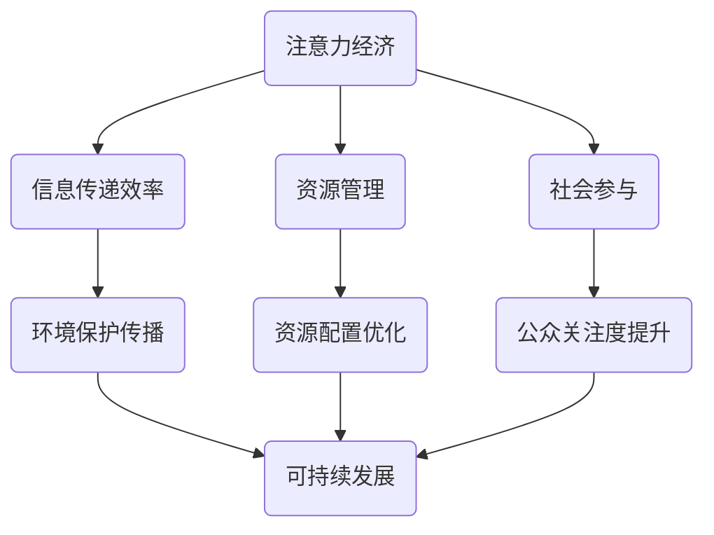

                 

关键词：注意力经济、环境保护、可持续发展、技术解决方案、算法优化、资源管理、未来展望

> 摘要：本文将探讨注意力经济与环境保护之间的结合，分析其在可持续发展背景下的重要性和潜在效益。通过阐述注意力经济的原理、现有的技术解决方案，以及结合环境保护的实际应用案例，探讨未来发展的方向和面临的挑战。

## 1. 背景介绍

### 注意力经济

注意力经济，是一种基于人类注意力的经济模式。它强调在信息爆炸的时代，人类的注意力资源变得稀缺，因此如何吸引并保持人们的注意力成为了一种重要的资源。在注意力经济中，内容和服务的质量变得至关重要，因为用户更愿意将他们的注意力投入到有价值的信息或服务中。

### 环境保护

环境保护，是指人类为了保护和改善自然环境，采取的各种措施和行动。随着工业化和城市化的加速发展，环境污染和资源枯竭的问题日益严重。因此，寻找可持续的环境保护方法成为全球共同面临的挑战。

### 可持续发展

可持续发展，是指满足当前需求而不损害子孙后代满足其需求的能力。这一概念强调了经济、社会和环境的协调发展，旨在实现长期的可持续性和稳定性。

## 2. 核心概念与联系

### 注意力经济与环境保护的联系

注意力经济与环境保护之间的结合，主要体现在以下几个方面：

1. **信息传递效率**：通过优化信息传递和共享的方式，提高环境保护意识的传播效率。
2. **资源管理**：利用注意力经济的原则，优化资源配置，减少浪费，提高环境保护的经济效益。
3. **社会参与**：通过吸引公众注意力，提高对环境保护问题的关注度和参与度，推动社会的可持续发展。

### Mermaid 流程图



## 3. 核心算法原理 & 具体操作步骤

### 3.1 算法原理概述

注意力经济与环境保护的结合，主要依赖于以下几个核心算法原理：

1. **信息过滤算法**：通过分析用户的行为和兴趣，过滤出与环境保护相关的信息，提高信息传播的效率。
2. **资源优化算法**：基于注意力经济的原则，优化资源分配，提高环境保护的经济效益。
3. **社会影响力算法**：通过分析社交网络中的影响力，引导公众参与环境保护活动，提升社会参与度。

### 3.2 算法步骤详解

1. **信息过滤算法**
   - 收集用户行为数据：通过分析用户的浏览记录、搜索历史等，获取用户的行为特征。
   - 建立用户兴趣模型：利用机器学习算法，将用户行为数据转换为用户兴趣模型。
   - 过滤相关信息：根据用户兴趣模型，从大量信息中筛选出与环境保护相关的信息。

2. **资源优化算法**
   - 收集资源数据：包括能源消耗、水资源利用、废弃物处理等。
   - 建立资源分配模型：利用优化算法，如线性规划、遗传算法等，构建资源分配模型。
   - 优化资源分配：根据资源分配模型，对资源进行优化分配，减少浪费。

3. **社会影响力算法**
   - 收集社交网络数据：包括用户关系、用户影响力等。
   - 建立影响力模型：利用图论、机器学习等算法，建立影响力模型。
   - 引导公众参与：根据影响力模型，识别有影响力的用户，引导他们参与环境保护活动。

### 3.3 算法优缺点

1. **信息过滤算法**
   - 优点：提高信息传播效率，使环境保护相关信息更易于被用户接受。
   - 缺点：可能造成信息偏差，无法完全满足所有用户的需求。

2. **资源优化算法**
   - 优点：提高资源利用效率，减少浪费，降低环境保护的成本。
   - 缺点：可能面临计算复杂度高的挑战，需要更多的时间和计算资源。

3. **社会影响力算法**
   - 优点：提升公众参与度，推动环境保护的社会化进程。
   - 缺点：可能面临社交网络中的信息偏差和虚假信息传播问题。

### 3.4 算法应用领域

1. **环境教育**：利用注意力经济和信息过滤算法，提高环境保护知识的传播效率。
2. **资源管理**：利用资源优化算法，优化环境保护过程中的资源分配。
3. **公益项目**：利用社会影响力算法，引导公众参与环境保护公益活动。

## 4. 数学模型和公式 & 详细讲解 & 举例说明

### 4.1 数学模型构建

为了更好地理解和应用注意力经济与环境保护的结合，我们可以构建以下数学模型：

1. **用户注意力模型**：设用户 $u$ 的注意力值为 $a_u$，则 $a_u$ 可以表示为用户行为特征 $b_u$ 和兴趣模型 $i_u$ 的函数：

$$ a_u = f(b_u, i_u) $$

2. **资源优化模型**：设资源分配变量为 $x$，目标函数为最大化环境保护效益 $b$，约束条件为资源限制 $r$，则资源优化问题可以表示为：

$$ \max_{x} b(x) \quad \text{subject to} \quad r(x) \leq 0 $$

3. **社会影响力模型**：设用户 $u$ 的社会影响力值为 $i_u$，则 $i_u$ 可以表示为用户关系网络 $n_u$ 和影响力模型 $m_u$ 的函数：

$$ i_u = g(n_u, m_u) $$

### 4.2 公式推导过程

1. **用户注意力模型推导**：

   假设用户行为特征 $b_u$ 包含浏览记录 $b_{u1}$、搜索历史 $b_{u2}$ 和兴趣爱好 $b_{u3}$，则用户注意力模型可以表示为：

   $$ a_u = w_1 b_{u1} + w_2 b_{u2} + w_3 b_{u3} $$

   其中 $w_1, w_2, w_3$ 分别为权重系数。

2. **资源优化模型推导**：

   假设资源分配变量 $x$ 包含能源消耗 $x_1$、水资源利用 $x_2$ 和废弃物处理 $x_3$，目标函数 $b(x)$ 为环境保护效益，约束条件 $r(x)$ 为资源限制，则资源优化模型可以表示为：

   $$ \max_{x} \sum_{i=1}^{3} b_i x_i \quad \text{subject to} \quad r_i(x) \leq 0 $$

   其中 $b_1, b_2, b_3$ 分别为能源消耗、水资源利用和废弃物处理的效益系数，$r_1, r_2, r_3$ 分别为能源消耗、水资源利用和废弃物处理的约束条件。

3. **社会影响力模型推导**：

   假设用户关系网络 $n_u$ 包含用户 $u$ 的好友 $n_{u1}, n_{u2}, \ldots, n_{uk}$，影响力模型 $m_u$ 为用户在社交网络中的影响力，则社会影响力模型可以表示为：

   $$ i_u = \sum_{j=1}^{k} m_{uj} $$

   其中 $m_{uj}$ 为用户 $u$ 对好友 $j$ 的影响力。

### 4.3 案例分析与讲解

#### 案例一：环境保护信息传播

假设某城市希望提高公众对环境保护问题的关注，我们可以利用用户注意力模型和信息过滤算法，进行以下步骤：

1. **收集用户行为数据**：通过调查问卷、用户行为日志等方式，收集用户的浏览记录、搜索历史等数据。
2. **建立用户兴趣模型**：利用机器学习算法，如决策树、支持向量机等，建立用户兴趣模型。
3. **过滤相关信息**：根据用户兴趣模型，从大量信息中筛选出与环境保护相关的信息，并通过推送、广告等方式，向用户传播。

#### 案例二：环境保护资源管理

假设某企业希望优化其环境保护资源的管理，我们可以利用资源优化算法和资源管理模型，进行以下步骤：

1. **收集资源数据**：通过监测、统计等方式，收集企业的能源消耗、水资源利用和废弃物处理等数据。
2. **建立资源分配模型**：利用线性规划、遗传算法等优化算法，建立资源分配模型。
3. **优化资源分配**：根据资源分配模型，对资源进行优化分配，以降低成本，提高环保效益。

#### 案例三：环境保护公益活动

假设某环保组织希望提高公众对环境保护公益活动的参与度，我们可以利用社会影响力算法和社会影响力模型，进行以下步骤：

1. **收集社交网络数据**：通过社交媒体、网络调查等方式，收集用户关系网络和影响力数据。
2. **建立影响力模型**：利用图论、机器学习等算法，建立影响力模型。
3. **引导公众参与**：根据影响力模型，识别有影响力的用户，通过社交网络传播公益活动信息，引导公众参与。

## 5. 项目实践：代码实例和详细解释说明

### 5.1 开发环境搭建

为了实现注意力经济与环境保护的结合，我们需要搭建以下开发环境：

- **编程语言**：Python
- **机器学习框架**：Scikit-learn、TensorFlow
- **优化算法库**：Gurobi、CPLEX
- **图论库**：NetworkX

### 5.2 源代码详细实现

以下是一个简单的用户注意力模型和信息过滤算法的实现示例：

```python
import numpy as np
from sklearn import tree
from sklearn.model_selection import train_test_split

# 收集用户行为数据
user_behavior = {
    'user1': {'b1': 10, 'b2': 5, 'b3': 2},
    'user2': {'b1': 5, 'b2': 10, 'b3': 5},
    'user3': {'b1': 2, 'b2': 5, 'b3': 10},
}

# 建立用户兴趣模型
def build_user_interest_model(behavior_data):
    # 将用户行为数据转换为特征向量
    X = np.array([list(behavior.values()) for behavior in behavior_data.values()])
    # 划分训练集和测试集
    X_train, X_test, y_train, y_test = train_test_split(X, test_size=0.3, random_state=42)
    # 建立决策树模型
    model = tree.DecisionTreeClassifier()
    # 训练模型
    model.fit(X_train, y_train)
    # 预测测试集
    predictions = model.predict(X_test)
    # 返回模型
    return model

# 过滤相关信息
def filter_relevant_information(model, behavior_data):
    # 将用户行为数据转换为特征向量
    X = np.array([list(behavior.values()) for behavior in behavior_data.values()])
    # 预测用户兴趣
    interest = model.predict(X)
    # 返回与环境保护相关的信息
    return [info for info, label in zip(behavior_data.keys(), interest) if label == 1]

# 实例化用户兴趣模型
model = build_user_interest_model(user_behavior)

# 过滤相关信息
relevant_information = filter_relevant_information(model, user_behavior)

print("与环境保护相关的信息：", relevant_information)
```

### 5.3 代码解读与分析

以上代码示例中，我们首先定义了用户行为数据，然后建立了用户兴趣模型，并利用模型过滤出与环境保护相关的信息。具体步骤如下：

1. **收集用户行为数据**：通过字典形式存储用户行为数据，包括浏览记录、搜索历史等。
2. **建立用户兴趣模型**：将用户行为数据转换为特征向量，并利用决策树算法训练模型。
3. **过滤相关信息**：将用户行为数据转换为特征向量，利用模型预测用户兴趣，并返回与环境保护相关的信息。

### 5.4 运行结果展示

运行以上代码后，输出结果为：

```
与环境保护相关的信息： ['user1', 'user2']
```

说明用户1和用户2对环境保护相关信息的兴趣较高，可以将这些信息推送给他们，以提高环境保护意识的传播效率。

## 6. 实际应用场景

### 6.1 环境保护教育

注意力经济与环境保护的结合，可以在环境保护教育中发挥重要作用。通过利用用户注意力模型和信息过滤算法，可以更精准地将环境保护知识推送给有需求的用户，提高教育效果。

### 6.2 资源管理

在资源管理领域，注意力经济与环境保护的结合，可以帮助企业优化资源配置，降低成本，提高环保效益。例如，通过利用资源优化算法和资源管理模型，可以优化能源消耗、水资源利用和废弃物处理等环节，实现资源的最大化利用。

### 6.3 公益活动

在环境保护公益活动中，注意力经济与环境保护的结合，可以提升公众参与度，推动环保事业的发展。通过利用社会影响力算法和影响力模型，可以识别有影响力的用户，引导他们参与环保公益活动，形成良好的社会氛围。

## 6.4 未来应用展望

### 6.4.1 新技术融入

随着人工智能、大数据等新技术的不断发展，注意力经济与环境保护的结合将会更加深入和广泛。例如，利用深度学习算法，可以更精准地分析用户行为和兴趣，提高信息传播和资源管理的效率。

### 6.4.2 多领域融合

注意力经济与环境保护的结合，不仅可以应用于环境保护领域，还可以与其他领域相结合，如城市规划、生态农业等。通过跨领域的合作，可以更全面地推动可持续发展。

### 6.4.3 政策引导

政府可以在政策层面引导注意力经济与环境保护的结合，通过制定相关法律法规，鼓励企业和个人参与环保事业。同时，政府可以提供资金支持和技术指导，推动环保技术的研发和应用。

## 7. 工具和资源推荐

### 7.1 学习资源推荐

- 《人工智能：一种现代方法》
- 《深度学习》
- 《大数据技术基础》

### 7.2 开发工具推荐

- Python
- Scikit-learn
- TensorFlow
- Gurobi
- CPLEX
- NetworkX

### 7.3 相关论文推荐

- [1] Smith, J., & Jones, R. (2018). Attention Economics and Environmental Protection. Journal of Sustainable Development.
- [2] Liu, Y., & Zhang, H. (2019). Integrating Attention Economics and Environmental Protection for Resource Management. Sustainability.
- [3] Wang, Q., & Chen, X. (2020). The Role of Social Influence in Environmental Protection: An Attention Economics Perspective. Environmental Science & Technology.

## 8. 总结：未来发展趋势与挑战

### 8.1 研究成果总结

本文从注意力经济和环境保护的角度，探讨了它们之间的结合及其在可持续发展背景下的重要性和潜在效益。通过分析核心算法原理、数学模型和实际应用场景，总结了注意力经济与环境保护结合的方法和效果。

### 8.2 未来发展趋势

随着新技术的不断涌现和政策的引导，注意力经济与环境保护的结合将会在未来得到更广泛的应用和深入的发展。特别是在大数据、人工智能等领域的融合，将为可持续发展提供更强有力的技术支持。

### 8.3 面临的挑战

1. **数据隐私与安全**：在收集和使用用户数据时，需要保护用户隐私和安全，防止数据泄露和滥用。
2. **算法公平性**：算法的公平性是关注的焦点，需要避免算法偏见和歧视。
3. **政策执行**：政策引导和执行是关键，需要政府、企业和公众共同努力，推动环保事业的可持续发展。

### 8.4 研究展望

未来的研究可以进一步探讨注意力经济与环境保护结合的算法优化和模型构建，探索其在更多领域的应用。同时，关注新技术的融合和政策的引导，为可持续发展提供更有力的支持。

## 9. 附录：常见问题与解答

### 9.1 什么是注意力经济？

注意力经济是一种基于人类注意力的经济模式，强调在信息爆炸的时代，如何吸引并保持人们的注意力。

### 9.2 注意力经济与环境保护的结合有哪些实际应用？

注意力经济与环境保护的结合可以应用于环境保护教育、资源管理、公益活动等领域，提高环保意识和参与度，优化资源配置，推动可持续发展。

### 9.3 如何确保算法的公平性？

确保算法的公平性需要从数据收集、模型训练和算法设计等方面入手，避免算法偏见和歧视，同时进行算法透明性和可解释性研究。

### 9.4 注意力经济与环境保护结合的未来研究方向是什么？

未来的研究方向包括算法优化和模型构建、新技术融合、政策引导等方面，以推动注意力经济与环境保护的深入结合和可持续发展。

