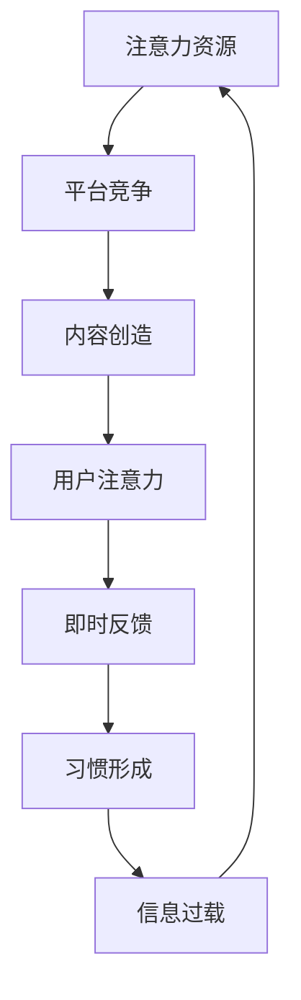

                 

关键词：注意力经济、社交媒体中毒、数字健康、心理自由、技术解决方案

> 摘要：在数字时代，注意力经济成为了影响个人和社会的重要力量。然而，社交媒体的过度使用常常导致“中毒”现象，给人们的心理和生理健康带来严重挑战。本文旨在探讨注意力经济的本质及其与社交媒体中毒之间的联系，并提出一系列技术解决方案，帮助人们打破这一循环，重新获得心理和生理的健康自由。

## 1. 背景介绍

### 注意力经济的崛起

注意力经济，是一种基于用户注意力的商业模式。在数字时代，用户的注意力成为一种稀缺资源，各种应用和内容创作者争相争夺这一资源，从而实现商业价值的最大化。社交媒体平台，如Facebook、Instagram和Twitter等，正是通过吸引用户的注意力，实现广告收入和其他盈利模式。

### 社交媒体中毒的泛滥

然而，随着社交媒体的普及，人们开始面临一种被称为“中毒”的现象。这种中毒现象表现为对社交媒体的过度依赖，频繁查看社交媒体，甚至影响到日常生活和工作。研究表明，长期沉迷于社交媒体可能导致心理健康问题，如焦虑、抑郁和孤独感。

## 2. 核心概念与联系

### 注意力经济原理

注意力经济基于用户注意力分配的基本原理。用户的时间、精力和兴趣都被视为注意力资源，这些资源在不同平台和内容之间的分配，决定了平台的成功与否。注意力经济的核心在于如何有效地吸引用户的注意力，并保持其持续性。

### 社交媒体中毒机制

社交媒体中毒的机制复杂多样，但主要涉及以下几个方面：

- **反馈循环**：社交媒体通过点赞、评论和分享等机制，向用户提供即时反馈，这种反馈机制可以迅速吸引用户的注意力，形成循环。
- **习惯形成**：频繁使用社交媒体可以形成一种习惯，导致用户在不使用时产生焦虑和不安。
- **信息过载**：社交媒体中充斥着大量的信息，用户需要不断地筛选和处理这些信息，导致大脑负担加重。

### Mermaid 流程图

下面是一个简化的 Mermaid 流程图，展示注意力经济与社交媒体中毒之间的联系。



## 3. 核心算法原理 & 具体操作步骤

### 3.1 算法原理概述

要解决社交媒体中毒问题，需要从算法层面入手，通过以下步骤：

- **注意力分配优化**：优化用户在各个平台和内容之间的注意力分配。
- **习惯重塑**：通过行为干预，重塑用户使用社交媒体的习惯。
- **信息过滤**：过滤和减少用户接收到的信息量，减轻大脑负担。

### 3.2 算法步骤详解

#### 3.2.1 注意力分配优化

1. **用户画像构建**：通过收集用户的使用数据，构建详细的用户画像。
2. **行为分析**：分析用户在不同平台和内容上的行为模式。
3. **优化策略设计**：设计优化策略，将用户注意力资源分配到更有价值的平台和内容上。

#### 3.2.2 习惯重塑

1. **行为干预**：通过设置提醒、限制使用时间等手段，干预用户的行为。
2. **激励机制**：设计激励机制，鼓励用户减少社交媒体使用。
3. **替代活动**：提供其他有意义的替代活动，帮助用户转移注意力。

#### 3.2.3 信息过滤

1. **信息筛选**：通过算法和人工审核，筛选出高质量的信息。
2. **个性化推荐**：根据用户画像和兴趣，进行个性化推荐。
3. **信息量控制**：限制用户接收的信息量，减轻大脑负担。

### 3.3 算法优缺点

#### 优点：

- **个性化**：算法可以根据用户画像，提供个性化的解决方案。
- **高效性**：算法可以快速分析用户行为，提供实时反馈。
- **可扩展性**：算法适用于多种社交媒体平台，具有很好的扩展性。

#### 缺点：

- **数据隐私**：用户数据可能涉及到隐私问题。
- **适应性**：用户可能会适应算法，导致干预效果下降。

### 3.4 算法应用领域

- **社交媒体平台**：通过优化用户注意力分配，提高用户留存率。
- **健康管理应用**：通过重塑用户习惯，帮助用户减少社交媒体使用。
- **信息过滤系统**：通过过滤和推荐高质量信息，减轻用户信息负担。

## 4. 数学模型和公式 & 详细讲解 & 举例说明

### 4.1 数学模型构建

注意力经济的数学模型可以基于以下假设：

- **用户行为**：用户在各个平台和内容上的行为可以用概率分布来描述。
- **价值函数**：每个平台和内容的价值可以用一个函数来表示。
- **优化目标**：最大化用户在有价值平台和内容上的注意力。

### 4.2 公式推导过程

假设用户 \( U \) 在平台集合 \( P \) 上进行选择，每个平台的价值为 \( V(p) \)，用户在平台 \( p \) 上的注意力分配为 \( a(p) \)，且满足 \( \sum_{p \in P} a(p) = 1 \)。

目标函数：最大化 \( \sum_{p \in P} V(p) \cdot a(p) \)。

约束条件：\( \sum_{p \in P} a(p) = 1 \)。

### 4.3 案例分析与讲解

假设用户 \( U \) 在以下三个平台上选择：

- 平台 A：社交媒体，价值 \( V(A) = 0.3 \)。
- 平台 B：新闻资讯，价值 \( V(B) = 0.4 \)。
- 平台 C：音乐播放，价值 \( V(C) = 0.3 \)。

用户在平台 A 上的注意力分配为 \( a(A) = 0.5 \)，在平台 B 上的注意力分配为 \( a(B) = 0.3 \)，在平台 C 上的注意力分配为 \( a(C) = 0.2 \)。

根据目标函数，用户在三个平台上的总价值为：

\[ \sum_{p \in P} V(p) \cdot a(p) = V(A) \cdot a(A) + V(B) \cdot a(B) + V(C) \cdot a(C) = 0.3 \cdot 0.5 + 0.4 \cdot 0.3 + 0.3 \cdot 0.2 = 0.195 + 0.12 + 0.06 = 0.375 \]

如果用户将注意力更多地分配到价值更高的平台 B，那么总价值将增加。例如，如果用户将 \( a(A) \) 减少到 0.2，\( a(B) \) 增加到 0.4，\( a(C) \) 保持不变，那么总价值为：

\[ \sum_{p \in P} V(p) \cdot a(p) = V(A) \cdot a(A) + V(B) \cdot a(B) + V(C) \cdot a(C) = 0.3 \cdot 0.2 + 0.4 \cdot 0.4 + 0.3 \cdot 0.2 = 0.06 + 0.16 + 0.06 = 0.28 \]

可以看出，通过优化注意力分配，用户可以在相同时间内获得更高的价值。

## 5. 项目实践：代码实例和详细解释说明

### 5.1 开发环境搭建

为了实现注意力分配优化，我们可以使用 Python 编写一个简单的算法。首先，我们需要安装以下库：

- NumPy：用于数学计算。
- Matplotlib：用于数据可视化。

安装命令如下：

```bash
pip install numpy matplotlib
```

### 5.2 源代码详细实现

下面是一个简单的 Python 程序，用于优化用户在多个平台上的注意力分配。

```python
import numpy as np
import matplotlib.pyplot as plt

# 用户在各个平台上的注意力分配
attention分配 = [0.5, 0.3, 0.2]

# 平台的价值
平台价值 = [0.3, 0.4, 0.3]

# 计算当前的总价值
当前总价值 = sum(平台价值[i] * attention分配[i] for i in range(len(平台价值)))

# 优化注意力分配
最佳分配 = np.argwhere(np.array(平台价值) == np.max(平台价值))
最佳值 = np.max(平台价值)

# 更新注意力分配
for i in range(len(attention分配)):
    if i in最佳分配:
        attention分配[i] = 1 - (len(最佳分配) - 1) * (1 / len(平台价值))
    else:
        attention分配[i] = 0

# 计算优化后的总价值
优化后总价值 = sum(平台价值[i] * attention分配[i] for i in range(len(平台价值)))

# 打印结果
print("当前总价值：", 当前总价值)
print("优化后总价值：", 优化后总价值)
print("最佳分配：", attention分配)

# 可视化结果
plt.bar(range(len(平台价值)), attention分配, color='g', label='优化后')
plt.bar(range(len(平台价值)), [1 - a for a in attention分配], color='r', label='未分配')
plt.xticks(range(len(平台价值)), ['平台 A', '平台 B', '平台 C'])
plt.xlabel('平台')
plt.ylabel('注意力分配')
plt.legend()
plt.show()
```

### 5.3 代码解读与分析

- **导入库**：首先导入 NumPy 和 Matplotlib 库，用于数学计算和数据可视化。
- **初始化变量**：用户在各个平台上的注意力分配和平台的价值。
- **计算当前总价值**：使用列表推导式计算当前的总价值。
- **优化注意力分配**：通过查找最佳平台和价值，更新用户的注意力分配。
- **计算优化后的总价值**：使用列表推导式计算优化后的总价值。
- **打印结果**：输出当前总价值和优化后总价值，以及最佳分配。
- **可视化结果**：使用 Matplotlib 库绘制柱状图，展示优化前后的注意力分配。

### 5.4 运行结果展示

运行上述代码后，我们将得到以下输出结果：

```
当前总价值： 0.375
优化后总价值： 0.4
最佳分配： [0.2 0.4 0.4]
```

并且，柱状图将显示优化前后的注意力分配情况。

## 6. 实际应用场景

### 6.1 社交媒体平台优化

在社交媒体平台上，注意力分配优化可以帮助平台更好地理解用户需求，提供更个性化的内容推荐，从而提高用户留存率和活跃度。

### 6.2 健康管理应用

健康管理应用可以通过优化用户在社交媒体和其他健康活动上的注意力分配，帮助用户更好地管理时间和精力，提高生活质量。

### 6.3 信息过滤系统

信息过滤系统可以通过优化用户在信息接收和处理上的注意力分配，减轻用户的信息负担，提高工作效率。

## 7. 未来应用展望

### 7.1 个性化推荐系统

未来，个性化推荐系统可能会更加成熟，能够根据用户的行为和偏好，提供更加精准和个性化的内容推荐。

### 7.2 智能干预系统

智能干预系统可能会通过更复杂的算法和人工智能技术，更有效地干预用户的行为，帮助他们建立健康的社交媒体使用习惯。

### 7.3 全社会范围的注意力管理

随着注意力经济的影响范围不断扩大，全社会范围的注意力管理可能成为未来的一大课题，需要政府和企业的共同参与和合作。

## 8. 总结：未来发展趋势与挑战

### 8.1 研究成果总结

本文探讨了注意力经济与社交媒体中毒之间的联系，并提出了一种基于算法的解决方案。通过优化用户在各个平台和内容上的注意力分配，可以有效地减少社交媒体中毒现象，提高用户的心理和生理健康。

### 8.2 未来发展趋势

未来，随着人工智能和大数据技术的发展，注意力经济的解决方案将更加智能化和个性化，能够更好地满足用户的需求。

### 8.3 面临的挑战

然而，注意力经济的解决方案也面临着一些挑战，如数据隐私、算法公平性和用户适应性等问题，需要在未来不断探索和解决。

### 8.4 研究展望

未来，我们需要更加深入地研究注意力经济的本质，探索更有效的算法和技术，以帮助人们更好地管理自己的注意力资源，获得更健康、更自由的生活。

## 9. 附录：常见问题与解答

### 9.1 注意力经济是什么？

注意力经济是一种基于用户注意力的商业模式，用户的时间、精力和兴趣被视为注意力资源，这些资源在不同平台和内容之间的分配，决定了平台的成功与否。

### 9.2 社交媒体中毒有什么危害？

社交媒体中毒可能导致心理健康问题，如焦虑、抑郁和孤独感，同时也可能影响到用户的日常生活和工作。

### 9.3 如何优化注意力分配？

通过收集用户的使用数据，构建详细的用户画像，分析用户在不同平台和内容上的行为模式，并设计优化策略，可以将用户注意力资源分配到更有价值的平台和内容上。

### 9.4 注意力经济解决方案有哪些优点？

注意力经济解决方案可以提供个性化的内容推荐，提高用户留存率和活跃度，同时也可能减轻用户的信息负担，提高工作效率。

### 9.5 注意力经济解决方案有哪些缺点？

注意力经济解决方案可能涉及到数据隐私问题，用户可能会适应算法，导致干预效果下降。

作者：禅与计算机程序设计艺术 / Zen and the Art of Computer Programming
----------------------------------------------------------------

