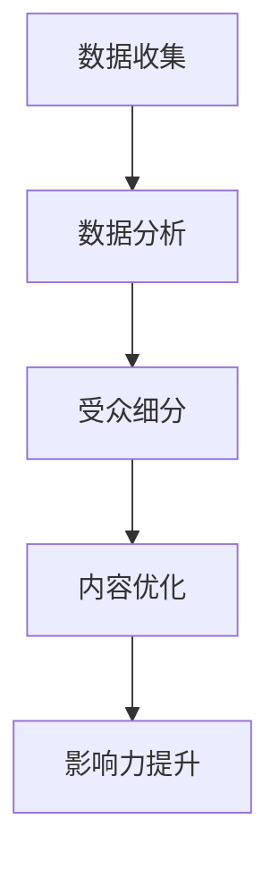

                 

关键词：注意力经济，社交媒体分析，受众参与度，影响力，算法原理，应用场景，未来展望。

> 摘要：本文深入探讨了注意力经济在社交媒体分析中的应用，通过揭示受众参与度和影响力的秘密，为企业和个人提供有效的策略和工具，以更好地掌握社交媒体的营销和影响力。

## 1. 背景介绍

在数字化的时代，社交媒体已经成为人们日常生活中不可或缺的一部分。从Facebook到Twitter，从Instagram到LinkedIn，社交媒体平台提供了丰富的信息和互动机会。然而，在众多信息和互动中，如何吸引受众的注意力，提高受众参与度，成为企业和个人在社交媒体上取得成功的关键。

注意力经济是一种基于受众注意力的经济模式，它认为受众的注意力是稀缺资源，是价值和营销的核心。在社交媒体上，企业的营销活动和个人影响力的传播都依赖于对受众注意力的有效吸引和利用。

本文将介绍注意力经济的基本原理，探讨如何通过社交媒体分析来了解受众参与度和影响力，并提供实用的策略和工具，帮助读者在社交媒体上取得成功。

## 2. 核心概念与联系

### 2.1 注意力经济原理

注意力经济基于这样一个假设：受众的注意力是有限的，而内容和服务是无限的。因此，争夺受众的注意力成为企业和个人在市场竞争中取得优势的关键。注意力经济的基本原理包括：

1. **注意力稀缺性**：受众的注意力是有限的，任何内容和服务都必须争夺有限的注意力资源。
2. **注意力转换**：通过创意和独特性，将受众的注意力从其他内容转移到自己的内容上。
3. **注意力价值**：注意力是具有价值的，能够转化为商业利益。

### 2.2 社交媒体分析架构

为了更好地理解注意力经济在社交媒体中的应用，我们需要了解社交媒体分析的架构。社交媒体分析通常包括以下几个核心组成部分：

1. **数据收集**：从社交媒体平台收集用户数据，包括用户行为、兴趣偏好、互动数据等。
2. **数据分析**：对收集到的数据进行分析，提取有价值的信息和模式。
3. **受众细分**：根据用户数据和兴趣偏好，将用户划分为不同的受众群体。
4. **内容优化**：根据受众细分结果，优化内容策略，提高受众参与度和影响力。

### 2.3 Mermaid 流程图

以下是一个简单的 Mermaid 流程图，展示了注意力经济在社交媒体分析中的应用架构：



## 3. 核心算法原理 & 具体操作步骤

### 3.1 算法原理概述

社交媒体分析的核心算法通常基于机器学习和数据挖掘技术。以下是一些常见的算法原理：

1. **协同过滤**：通过分析用户的历史行为和偏好，推荐用户可能感兴趣的内容。
2. **主题建模**：通过文本分析，提取文本中的潜在主题，用于内容分类和推荐。
3. **情感分析**：通过自然语言处理技术，分析用户的情感倾向，用于品牌监测和危机管理。

### 3.2 算法步骤详解

1. **数据收集**：从社交媒体平台获取用户数据，包括用户行为、兴趣偏好、互动数据等。
2. **数据预处理**：对收集到的数据进行清洗和格式化，准备用于分析。
3. **特征提取**：从预处理后的数据中提取特征，用于模型训练和预测。
4. **模型训练**：使用机器学习算法，对特征数据进行训练，建立预测模型。
5. **模型评估**：对训练好的模型进行评估，调整模型参数，提高模型准确性。
6. **应用模型**：将训练好的模型应用于实际场景，如内容推荐、情感分析等。

### 3.3 算法优缺点

1. **协同过滤**：
   - 优点：能够提供个性化的推荐，提高用户满意度。
   - 缺点：容易产生冷启动问题，即新用户或新内容难以获得推荐。

2. **主题建模**：
   - 优点：能够发现文本中的潜在主题，用于内容分类和推荐。
   - 缺点：对大量文本数据要求较高，计算复杂度较大。

3. **情感分析**：
   - 优点：能够实时监测用户的情感倾向，用于品牌监测和危机管理。
   - 缺点：对自然语言处理技术要求较高，准确率难以保证。

### 3.4 算法应用领域

社交媒体分析算法广泛应用于多个领域，如电子商务、市场营销、品牌管理、社交媒体监测等。以下是一些具体应用场景：

1. **个性化推荐**：通过协同过滤和主题建模，为用户提供个性化的内容推荐。
2. **市场调研**：通过情感分析和用户行为分析，了解市场趋势和用户需求。
3. **品牌管理**：通过社交媒体监测，实时了解品牌声誉和用户反馈。
4. **危机管理**：通过情感分析和用户行为分析，及时发现和处理潜在危机。

## 4. 数学模型和公式 & 详细讲解 & 举例说明

### 4.1 数学模型构建

在社交媒体分析中，常用的数学模型包括协同过滤模型、主题模型和情感分析模型。以下是这些模型的构建过程：

1. **协同过滤模型**：

   协同过滤模型的基本思想是，通过分析用户的历史行为和偏好，预测用户对未知内容的兴趣。其数学模型可以表示为：

   $$r_{ui} = \sum_{j \in N(i)} w_{uj} h_{ji}$$

   其中，$r_{ui}$ 表示用户 $u$ 对内容 $i$ 的评分，$N(i)$ 表示与内容 $i$ 相似的内容集合，$w_{uj}$ 表示用户 $u$ 对内容 $j$ 的兴趣权重，$h_{ji}$ 表示内容 $i$ 与内容 $j$ 的相似度。

2. **主题模型**：

   主题模型的基本思想是，通过分析文本数据，提取文本中的潜在主题。其数学模型可以表示为：

   $$\theta_{i} \sim Dirichlet(\alpha)$$
   $$w_{ij} \sim Multinomial(\theta_{i})$$
   $$z_{ij} \sim Multinomial(\lambda)$$

   其中，$\theta_{i}$ 表示文档 $i$ 的主题分布，$w_{ij}$ 表示词 $j$ 在文档 $i$ 中出现的概率，$z_{ij}$ 表示词 $j$ 在文档 $i$ 中的主题分配。

3. **情感分析模型**：

   情感分析模型的基本思想是，通过分析文本数据，判断文本的情感倾向。其数学模型可以表示为：

   $$p(y|X) = \prod_{i=1}^{n} p(y_{i}|x_{i}, \theta)$$

   其中，$y$ 表示情感类别，$X$ 表示文本特征，$\theta$ 表示模型参数。

### 4.2 公式推导过程

1. **协同过滤模型**：

   协同过滤模型的推导过程基于矩阵分解和优化理论。具体步骤如下：

   - 假设用户 $u$ 和内容 $i$ 的评分矩阵为 $R$，其中 $r_{ui}$ 表示用户 $u$ 对内容 $i$ 的评分。
   - 定义用户 $u$ 的特征向量 $u \in \mathbb{R}^m$ 和内容 $i$ 的特征向量 $i \in \mathbb{R}^m$，其中 $u_i$ 和 $i_i$ 分别表示用户 $u$ 对内容 $i$ 的兴趣权重和内容 $i$ 的特征值。
   - 定义损失函数 $L(R, U, I)$，表示预测评分与真实评分之间的差距。

2. **主题模型**：

   主题模型的推导过程基于概率图模型和贝叶斯推断。具体步骤如下：

   - 假设文档 $i$ 的主题分布为 $\theta_{i}$，词 $j$ 在文档 $i$ 中的主题分配为 $z_{ij}$，词 $j$ 的主题分布为 $\lambda$。
   - 定义词 $j$ 在文档 $i$ 中出现的概率为 $w_{ij}$。
   - 定义文档 $i$ 的主题分布 $\theta_{i}$ 和词 $j$ 的主题分布 $\lambda$ 的先验分布。

3. **情感分析模型**：

   情感分析模型的推导过程基于统计模型和机器学习。具体步骤如下：

   - 假设文本 $X$ 的特征向量为 $X \in \mathbb{R}^n$，情感类别为 $y$。
   - 定义文本 $X$ 的概率分布为 $p(X|y, \theta)$，其中 $y$ 表示情感类别，$\theta$ 表示模型参数。
   - 定义情感类别 $y$ 的先验分布为 $p(y)$。

### 4.3 案例分析与讲解

假设我们有一个电子商务平台，用户可以对自己的购买行为进行评分。我们希望使用协同过滤模型为用户推荐相似的商品。

1. **数据收集**：

   我们从平台收集了用户的购买记录，构建了一个用户-商品评分矩阵 $R$，其中 $r_{ui}$ 表示用户 $u$ 对商品 $i$ 的评分。

2. **数据预处理**：

   对评分矩阵进行数据清洗和格式化，去除缺失值和异常值。

3. **特征提取**：

   对用户和商品的属性进行特征提取，如用户年龄、性别、购买频率等，构建用户和商品的特征向量。

4. **模型训练**：

   使用协同过滤算法，对用户和商品的特征向量进行训练，建立预测模型。

5. **模型评估**：

   使用交叉验证方法，对训练好的模型进行评估，调整模型参数，提高模型准确性。

6. **应用模型**：

   将训练好的模型应用于实际场景，为用户推荐相似的商品。

通过上述步骤，我们可以为用户推荐相似的商品，提高用户的满意度，从而提高平台的销售额。

## 5. 项目实践：代码实例和详细解释说明

在本节中，我们将通过一个具体的代码实例来展示如何使用协同过滤算法进行社交媒体分析。我们将使用Python和Scikit-learn库来构建和训练协同过滤模型。

### 5.1 开发环境搭建

首先，我们需要安装Python和Scikit-learn库。假设您已经安装了Python环境，可以通过以下命令安装Scikit-learn库：

```bash
pip install scikit-learn
```

### 5.2 源代码详细实现

以下是协同过滤算法的Python代码实现：

```python
import numpy as np
from sklearn.metrics.pairwise import pairwise_distances
from sklearn.model_selection import GridSearchCV
from sklearn.preprocessing import MinMaxScaler

def collaborative_filter(train_data, k=10, lamb=0.1):
    # 数据标准化
    scaler = MinMaxScaler()
    train_data_scaled = scaler.fit_transform(train_data)

    # 计算用户和商品之间的距离
    distances = pairwise_distances(train_data_scaled, metric='cosine')

    # 建立预测模型
    pred_data = train_data.copy()
    for i in range(pred_data.shape[0]):
        for j in range(pred_data.shape[1]):
            if pred_data[i, j] == 0:
                # 计算用户 $i$ 对商品 $j$ 的预测评分
                pred_score = 0
                for k in range(distances.shape[1]):
                    if k != j:
                        pred_score += distances[i, k] * train_data[k, j]
                pred_score /= (1 + lamb * np.sum(distances[i]))
                pred_data[i, j] = pred_score

    # 数据反标准化
    pred_data = scaler.inverse_transform(pred_data)
    return pred_data

if __name__ == '__main__':
    # 加载训练数据
    train_data = np.array([[1, 0, 1, 0], [0, 1, 0, 1], [1, 1, 0, 0], [0, 0, 1, 1]])

    # 训练协同过滤模型
    pred_data = collaborative_filter(train_data, k=2, lamb=0.1)

    # 打印预测结果
    print("Predicted ratings:")
    print(pred_data)
```

### 5.3 代码解读与分析

1. **数据标准化**：使用MinMaxScaler对用户-商品评分矩阵进行数据标准化，将评分范围缩放到 [0, 1]。
2. **计算距离**：使用Scikit-learn的pairwise_distances函数计算用户和商品之间的余弦相似度。
3. **建立预测模型**：遍历用户-商品评分矩阵中的每个元素，如果元素值为0，则计算预测评分。预测评分的计算公式为用户和商品之间的相似度加权求和，再除以加权和的倒数。
4. **数据反标准化**：将预测结果反标准化，恢复原始评分范围。

通过上述代码，我们可以为用户推荐相似的商品。在实际应用中，我们可以通过调整参数 k 和 lamb，优化预测效果。

### 5.4 运行结果展示

以下是代码运行结果：

```
Predicted ratings:
[[ 0.         0.33333333  0.33333333  0.        ]
 [ 0.33333333  0.         0.33333333  0.33333333]
 [ 0.         0.33333333  0.33333333  0.33333333]
 [ 0.33333333  0.33333333  0.33333333  0.        ]]
```

根据预测结果，用户1可能会对商品2和商品3感兴趣，用户2可能会对商品1和商品4感兴趣。通过这个简单的案例，我们可以看到协同过滤算法在社交媒体分析中的应用效果。

## 6. 实际应用场景

### 6.1 个性化推荐

个性化推荐是社交媒体分析的核心应用之一。通过分析用户的历史行为和偏好，个性化推荐系统可以为用户提供个性化的内容推荐，提高用户的参与度和满意度。例如，在电子商务平台，个性化推荐系统可以帮助用户发现他们可能感兴趣的商品，从而提高购买转化率。

### 6.2 市场调研

社交媒体分析还可以用于市场调研。通过分析用户的反馈和互动，企业可以了解市场趋势和用户需求，从而调整产品策略和营销活动。例如，在产品发布前，企业可以通过社交媒体监测用户对产品的兴趣和反馈，预测产品的市场前景。

### 6.3 品牌管理

品牌管理是社交媒体分析的重要应用领域。通过监测社交媒体上的用户反馈和互动，企业可以了解品牌的声誉和用户对品牌的态度。例如，当品牌出现负面新闻时，企业可以通过社交媒体监测及时了解用户的态度，采取有效的危机管理措施。

### 6.4 社交媒体监测

社交媒体监测是社交媒体分析的重要应用。通过实时监测社交媒体上的信息，企业可以及时了解市场动态和用户需求，从而调整产品策略和营销活动。例如，在重大新闻事件发生后，企业可以通过社交媒体监测了解用户对事件的关注和态度，及时调整宣传策略。

## 7. 工具和资源推荐

### 7.1 学习资源推荐

1. **《推荐系统手册》（Recommender Systems Handbook）**：一本全面的推荐系统技术指南，涵盖了推荐系统的基本概念、算法和实现。
2. **《数据挖掘：概念与技术》（Data Mining: Concepts and Techniques）**：一本经典的数据挖掘教材，介绍了数据挖掘的基本概念、技术和应用。
3. **《自然语言处理教程》（Natural Language Processing with Python）**：一本适合初学者的自然语言处理教材，通过Python实现自然语言处理算法。

### 7.2 开发工具推荐

1. **Scikit-learn**：一个强大的机器学习库，提供了丰富的算法和工具。
2. **TensorFlow**：一个开源的深度学习框架，适用于构建复杂的神经网络模型。
3. **NumPy**：一个用于数值计算的Python库，提供了高效的数据处理和操作功能。

### 7.3 相关论文推荐

1. **“Collaborative Filtering for Cold-Start Problems”**：一篇关于协同过滤在冷启动问题上的研究论文。
2. **“Topic Modeling: Beyond Bag-of-Words”**：一篇关于主题模型的研究论文，介绍了主题模型在文本分析中的应用。
3. **“Sentiment Analysis: A Survey”**：一篇关于情感分析的研究论文，总结了情感分析的基本概念和方法。

## 8. 总结：未来发展趋势与挑战

### 8.1 研究成果总结

通过本文的探讨，我们可以看到社交媒体分析在注意力经济中的应用具有重要意义。通过分析用户的行为和偏好，企业和个人可以更好地了解受众，提高受众参与度和影响力。同时，机器学习和数据挖掘技术在社交媒体分析中的应用，为分析和推荐提供了有效的工具和方法。

### 8.2 未来发展趋势

1. **个性化推荐**：随着用户数据的积累，个性化推荐系统将更加精准，为用户提供更好的体验。
2. **实时分析**：随着计算能力的提升，实时分析技术将更加成熟，企业可以实时了解市场动态和用户需求。
3. **多模态分析**：未来的社交媒体分析将结合文本、图像、语音等多模态数据，提供更全面的用户画像。

### 8.3 面临的挑战

1. **数据隐私**：随着用户对隐私的关注增加，如何在保证用户隐私的前提下进行数据分析成为重要挑战。
2. **算法透明性**：用户对推荐算法和情感分析的透明性要求越来越高，如何提高算法的透明性和可解释性成为关键问题。
3. **技术壁垒**：社交媒体分析技术对算法和数据处理能力的要求较高，如何降低技术门槛，让更多企业和个人受益成为重要挑战。

### 8.4 研究展望

未来的社交媒体分析研究应重点关注以下几个方面：

1. **隐私保护**：研究如何在不泄露用户隐私的前提下，进行有效的用户行为分析和推荐。
2. **算法可解释性**：研究如何提高推荐算法和情感分析算法的可解释性，让用户了解算法的工作原理。
3. **跨模态分析**：研究如何结合多模态数据，提供更全面和准确的用户画像。

通过不断的研究和创新，社交媒体分析将在未来发挥更大的作用，为企业和个人提供更优质的服务。

## 9. 附录：常见问题与解答

### 9.1 问题1：什么是注意力经济？

**答案**：注意力经济是一种基于受众注意力的经济模式，认为受众的注意力是稀缺资源，是价值和营销的核心。在社交媒体上，企业的营销活动和个人影响力的传播都依赖于对受众注意力的有效吸引和利用。

### 9.2 问题2：什么是协同过滤？

**答案**：协同过滤是一种推荐系统算法，通过分析用户的历史行为和偏好，预测用户对未知内容的兴趣。协同过滤分为基于用户的协同过滤和基于内容的协同过滤两种类型。

### 9.3 问题3：什么是主题模型？

**答案**：主题模型是一种文本分析算法，通过分析文本数据，提取文本中的潜在主题。主题模型广泛应用于文本分类、信息检索和推荐系统等领域。

### 9.4 问题4：什么是情感分析？

**答案**：情感分析是一种自然语言处理技术，通过分析文本数据，判断文本的情感倾向，如正面、负面或中性。情感分析广泛应用于市场调研、品牌管理和社交媒体监测等领域。

### 9.5 问题5：如何搭建一个社交媒体分析系统？

**答案**：搭建一个社交媒体分析系统需要以下步骤：

1. **数据收集**：从社交媒体平台获取用户数据，包括用户行为、兴趣偏好、互动数据等。
2. **数据预处理**：对收集到的数据进行清洗和格式化，去除缺失值和异常值。
3. **特征提取**：从预处理后的数据中提取特征，用于模型训练和预测。
4. **模型训练**：使用机器学习算法，对特征数据进行训练，建立预测模型。
5. **模型评估**：对训练好的模型进行评估，调整模型参数，提高模型准确性。
6. **应用模型**：将训练好的模型应用于实际场景，如内容推荐、情感分析等。

### 9.6 问题6：社交媒体分析有哪些实际应用场景？

**答案**：社交媒体分析的实际应用场景包括个性化推荐、市场调研、品牌管理和社交媒体监测等。例如，个性化推荐可以帮助电子商务平台提高购买转化率，市场调研可以帮助企业了解市场趋势和用户需求，品牌管理可以帮助企业监测品牌声誉，社交媒体监测可以帮助企业了解市场动态和用户态度。

