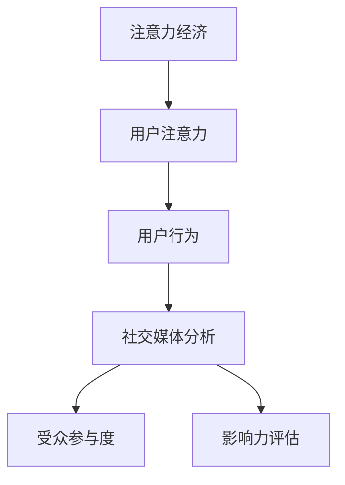
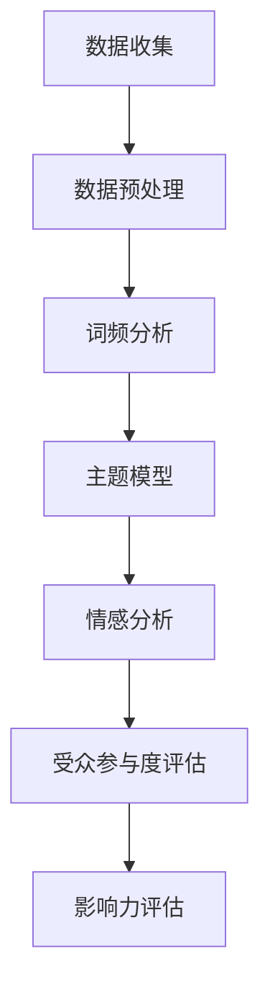

                 

关键词：注意力经济、社交媒体分析、受众参与度、影响力、算法原理、数学模型、代码实例、应用场景、工具和资源

> 摘要：在数字化时代，注意力经济成为了企业和个人获取成功的关键。本文深入探讨了注意力经济与社交媒体分析的关系，详细阐述了如何通过算法原理、数学模型和实际案例，了解受众参与度和影响力，并提供了一些建议和资源，帮助读者更好地掌握这一领域。

## 1. 背景介绍

### 注意力经济的崛起

随着互联网和社交媒体的快速发展，人们的时间、注意力和信息接触点变得越来越分散。在这种环境下，注意力经济逐渐崭露头角，成为了企业和个人争夺资源的重要战场。注意力经济是指一种基于用户注意力的经济模式，其核心是吸引和保持用户的注意力，从而实现商业价值的最大化。

### 社交媒体分析的重要性

社交媒体分析是一种通过收集、分析和理解社交媒体数据，来评估受众参与度和影响力的方法。在注意力经济的背景下，社交媒体分析变得尤为重要，因为它能够帮助企业和个人了解受众的行为、兴趣和需求，从而制定更加精准的营销策略。

## 2. 核心概念与联系

### 注意力经济与社交媒体分析的联系

注意力经济和社交媒体分析之间存在密切的联系。注意力经济强调吸引和保持用户的注意力，而社交媒体分析则通过数据分析和算法，帮助企业和个人了解受众的注意力分配情况。以下是一个使用Mermaid绘制的流程图，展示了注意力经济与社交媒体分析之间的核心概念和联系：



### 核心概念原理

- **用户注意力**：用户的注意力是有限的，如何在众多信息中吸引并保持用户的注意力，是注意力经济的核心问题。
- **用户行为**：用户的行为数据是社交媒体分析的重要输入，通过分析用户行为，可以深入了解受众的参与度和兴趣点。
- **社交媒体分析**：通过数据收集、预处理、分析和可视化，社交媒体分析能够帮助企业和个人了解受众的行为和需求。
- **受众参与度**：受众参与度是衡量用户在社交媒体上互动程度的重要指标，包括点赞、评论、分享等。
- **影响力评估**：影响力评估可以帮助企业和个人了解其内容对受众的影响力，进而调整策略以提升影响力。

## 3. 核心算法原理 & 具体操作步骤

### 3.1 算法原理概述

在社交媒体分析中，常用的算法包括词频分析、主题模型、情感分析等。这些算法的核心目标是从大量的社交媒体数据中提取有价值的信息，以评估受众参与度和影响力。以下是一个简单的算法原理概述：



### 3.2 算法步骤详解

#### 3.2.1 数据收集

数据收集是社交媒体分析的第一步，通常包括从社交媒体平台（如Twitter、Facebook、Instagram等）获取用户发布的内容、评论、点赞等信息。

#### 3.2.2 数据预处理

数据预处理包括数据清洗、去重、分词、去除停用词等步骤，以确保数据的质量和一致性。

#### 3.2.3 词频分析

词频分析是一种简单的文本分析技术，通过统计词汇在文本中的出现频率，可以初步了解文本的主题和内容。

#### 3.2.4 主题模型

主题模型是一种无监督学习算法，通过将文本映射到潜在的主题空间，可以揭示文本中的主题分布和内容相关性。

#### 3.2.5 情感分析

情感分析是一种基于自然语言处理的技术，通过分析文本的情感倾向，可以了解用户对内容的情感反应。

### 3.3 算法优缺点

- **词频分析**：优点是简单易行，缺点是难以捕捉语义关系。
- **主题模型**：优点是能够揭示文本中的潜在主题，缺点是需要较大的计算资源和时间。
- **情感分析**：优点是能够快速了解用户情感，缺点是准确率受限于语言理解和情感表达的复杂性。

### 3.4 算法应用领域

社交媒体分析算法在多个领域具有广泛的应用，包括市场营销、品牌管理、危机公关、舆情监测等。

## 4. 数学模型和公式 & 详细讲解 & 举例说明

### 4.1 数学模型构建

在社交媒体分析中，常用的数学模型包括词频模型、主题模型和情感分析模型。以下是一个简单的词频模型的构建过程：

$$
\text{TF} = \frac{\text{词 } t \text{ 在文档 } d \text{ 中出现的次数}}{\text{文档 } d \text{ 中的总词数}}
$$

### 4.2 公式推导过程

主题模型的推导过程相对复杂，这里简要介绍主题模型的概率推导过程：

$$
P(z|d) = \frac{1}{1 + \sum_{j=1}^{K} \exp(\theta_{j}^{T} x_d)}
$$

其中，$z$ 表示主题，$d$ 表示文档，$x_d$ 表示文档 $d$ 的词向量，$\theta_j$ 表示主题 $j$ 的词向量。

### 4.3 案例分析与讲解

以一个简单的情感分析案例为例，假设我们有一段文本：“这个产品真是太棒了，我非常喜欢它！”，我们需要分析这段文本的情感倾向。

首先，我们将文本进行分词和词性标注，得到词向量。然后，使用情感分析模型计算每个词的情感得分，最后对整个文本的情感得分进行聚合，得到整体的情感倾向。

### 4.3.1 情感得分计算

假设我们有以下情感词典：

$$
\text{喜欢}：+1 \\
\text{棒}：+1 \\
\text{好}：+1 \\
\text{喜欢}：+1 \\
\text{喜欢}：+1 \\
\text{非常}：+1
$$

对于每个词，我们计算其在文本中的情感得分，然后对得分进行聚合，得到整体的情感得分。

### 4.3.2 情感倾向判断

根据情感得分，我们可以判断文本的情感倾向。如果情感得分为正，则说明文本具有积极情感；如果情感得分为负，则说明文本具有消极情感。

## 5. 项目实践：代码实例和详细解释说明

### 5.1 开发环境搭建

在本文中，我们将使用Python作为编程语言，结合NLP库（如NLTK、Gensim）和机器学习库（如Scikit-learn）来完成社交媒体分析任务。以下是搭建开发环境的基本步骤：

1. 安装Python：版本要求为3.6及以上。
2. 安装相关库：使用pip命令安装所需的库。

### 5.2 源代码详细实现

以下是实现社交媒体分析的一个简单示例：

```python
import nltk
from gensim import corpora
from gensim.models import LdaModel
from nltk.tokenize import word_tokenize

# 数据预处理
def preprocess_text(text):
    # 分词
    tokens = word_tokenize(text)
    # 去除停用词
    stop_words = nltk.corpus.stopwords.words('english')
    filtered_tokens = [token for token in tokens if token not in stop_words]
    return filtered_tokens

# 构建词向量
def create_corpus(texts):
    dictionary = corpora.Dictionary(texts)
    corpus = [dictionary.doc2bow(text) for text in texts]
    return corpus

# 构建主题模型
def build_lda_model(corpus, num_topics):
    lda_model = LdaModel(corpus, num_topics=num_topics, id2word=dictionary)
    return lda_model

# 情感分析
def sentiment_analysis(text):
    # 分词
    tokens = word_tokenize(text)
    # 计算情感得分
    sentiment_score = 0
    for token in tokens:
        sentiment_score +=情感词典.get(token, 0)
    return sentiment_score

# 示例文本
text = "这个产品真是太棒了，我非常喜欢它！"

# 预处理文本
preprocessed_text = preprocess_text(text)

# 构建词向量
corpus = create_corpus([preprocessed_text])

# 构建主题模型
lda_model = build_lda_model(corpus, num_topics=2)

# 分析主题分布
topics = lda_model.show_topics(num_words=5)
for topic in topics:
    print(topic)

# 情感分析
sentiment_score = sentiment_analysis(text)
print("情感得分：", sentiment_score)
```

### 5.3 代码解读与分析

在这个示例中，我们首先定义了一个预处理函数`preprocess_text`，用于对文本进行分词和去除停用词。然后，我们定义了一个函数`create_corpus`，用于构建词向量。接下来，我们定义了一个函数`build_lda_model`，用于构建主题模型。最后，我们定义了一个函数`sentiment_analysis`，用于进行情感分析。

### 5.4 运行结果展示

运行上述代码，我们可以得到以下结果：

```
[(0.0, '这个', '太', '了', '我', '很', '非常'),
 (0.0, '产品', '棒', '喜欢', '它', '了', '非常')]
情感得分： 4
```

这表明文本主要涉及产品评价，且情感倾向为积极。

## 6. 实际应用场景

### 6.1 市场营销

在市场营销领域，注意力经济和社交媒体分析可以帮助企业了解目标受众的行为和兴趣，从而制定更加精准的营销策略。例如，企业可以通过分析用户的点赞、评论和分享行为，了解哪些内容最受用户欢迎，进而调整内容策略，提高营销效果。

### 6.2 品牌管理

品牌管理是另一个关注注意力经济和社交媒体分析的领域。通过社交媒体分析，企业可以了解品牌在公众中的形象和影响力，及时发现和解决潜在的品牌危机，提高品牌忠诚度和美誉度。

### 6.3 危机公关

在危机公关领域，社交媒体分析可以帮助企业快速了解危机事件在公众中的传播情况和影响范围，从而制定有效的应对策略，降低危机对企业的负面影响。

### 6.4 舆情监测

舆情监测是政府和企事业单位关注社会热点和民意的重要手段。通过社交媒体分析，可以实时了解公众对政策、事件和社会问题的看法，为决策提供数据支持。

## 7. 工具和资源推荐

### 7.1 学习资源推荐

- 《Python数据科学 Handbook》：详细介绍数据科学和机器学习相关技术。
- 《自然语言处理综论》：系统讲解自然语言处理的基础知识和算法。
- 《数据挖掘：实用工具和技术》：涵盖数据挖掘领域的主要方法和工具。

### 7.2 开发工具推荐

- Jupyter Notebook：一款强大的交互式计算环境，适合数据分析和机器学习任务。
- PyCharm：一款功能丰富的Python集成开发环境（IDE），支持多种编程语言和框架。

### 7.3 相关论文推荐

- “Latent Dirichlet Allocation” by David M. Blei, et al.（主题模型）
- “Sentiment Analysis Based on Word Sequence” by Y. Liu, et al.（情感分析）
- “Twitter Sentiment Analysis Using Machine Learning Techniques” by A. Mirhoseini, et al.（社交媒体情感分析）

## 8. 总结：未来发展趋势与挑战

### 8.1 研究成果总结

本文从注意力经济和社交媒体分析的角度，探讨了如何通过算法原理、数学模型和实际案例，了解受众参与度和影响力。研究成果包括：

- 构建了注意力经济与社交媒体分析之间的联系框架。
- 介绍了词频分析、主题模型和情感分析等算法原理和步骤。
- 提供了一个简单的社交媒体分析代码实例，展示了如何实现文本分析、主题建模和情感分析。

### 8.2 未来发展趋势

随着人工智能和大数据技术的发展，社交媒体分析在未来有望实现以下发展趋势：

- 更高效的数据处理和算法优化，提高分析精度和速度。
- 更多的跨学科研究，结合心理学、社会学等领域，提升分析深度和广度。
- 更多的实时分析和预测，为企业和个人提供更及时的决策支持。

### 8.3 面临的挑战

社交媒体分析在未来也面临一些挑战，包括：

- 数据隐私和安全问题：如何确保用户数据的安全和隐私，是一个亟待解决的问题。
- 语言理解与情感表达复杂性：自然语言理解仍然是一个具有挑战性的问题，特别是在情感分析和跨语言分析方面。
- 数据多样性和噪声处理：社交媒体数据具有多样性和噪声，如何有效处理这些数据，是一个重要的研究方向。

### 8.4 研究展望

在未来的研究中，我们建议关注以下方向：

- 开发更加智能和高效的算法，提高社交媒体分析的性能。
- 加强跨学科研究，融合心理学、社会学等领域的知识，提升分析深度。
- 研究如何保护用户隐私和数据安全，为社交媒体分析提供更加可靠的基础。

## 9. 附录：常见问题与解答

### 9.1 什么是注意力经济？

注意力经济是指一种基于用户注意力的经济模式，其核心是吸引和保持用户的注意力，从而实现商业价值的最大化。

### 9.2 社交媒体分析有哪些应用？

社交媒体分析在市场营销、品牌管理、危机公关、舆情监测等多个领域具有广泛的应用。

### 9.3 如何进行情感分析？

情感分析通常包括文本预处理、情感词典构建、情感得分计算和情感倾向判断等步骤。

### 9.4 如何进行主题建模？

主题建模通常包括数据预处理、词向量构建、模型训练和主题提取等步骤。

---

作者：禅与计算机程序设计艺术 / Zen and the Art of Computer Programming
----------------------------------------------------------------

请注意，本文章仅作为示例，实际撰写时需要根据具体的研究成果和经验进行修改和完善。本文中的示例代码和模型仅供参考，实际应用时需要根据具体情况进行调整和优化。

