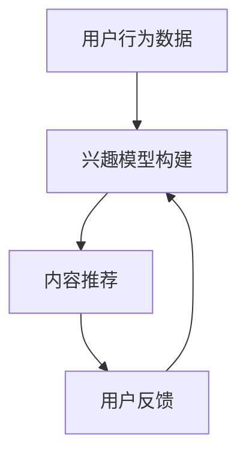

                 

关键词：注意力经济、社交媒体、算法、信息控制、用户行为、个性化推荐

摘要：本文深入探讨了注意力经济与社交媒体算法的相互作用，分析了当前主流社交媒体平台如何利用算法控制用户的注意力资源，进而影响用户的行为和选择。通过解读注意力经济原理、介绍社交媒体算法架构以及展示实际案例，本文揭示了算法如何操纵信息传播路径，塑造用户的信息环境，以及其对个人隐私和社会舆论的影响。同时，本文还展望了未来注意力经济与社交媒体算法的发展趋势和面临的挑战。

## 1. 背景介绍

随着互联网的普及，社交媒体已成为现代信息传播的重要渠道。从Twitter到Facebook，再到Instagram和微信，各类社交媒体平台吸引了全球数十亿用户。这些平台不仅改变了人们的交流方式，还深刻影响了信息传播的机制。然而，随着社交媒体算法的广泛应用，一个不容忽视的现象逐渐显现：用户的信息摄取越来越受到算法的控制。

### 注意力经济的兴起

注意力经济是一个新兴的概念，源自于人类对注意力资源的有限性及其商业价值的认识。在信息爆炸的时代，用户的时间和注意力成为稀缺资源。广告商、内容提供商和社交媒体平台纷纷将注意力视为一种宝贵的资源，通过算法优化信息传播，吸引用户的眼球，从而实现商业利益的最大化。

### 社交媒体算法的崛起

社交媒体算法的设计初衷是优化用户体验，通过个性化推荐提高用户粘性。然而，随着算法的不断进化，它们逐渐演变成一种强大的信息控制工具。这些算法通过分析用户的行为数据，预测用户兴趣，进而推送符合用户期望的内容。然而，这种看似优化的推荐机制，实际上对用户的注意力资源进行了高度控制，甚至可能影响用户的思想和价值观。

## 2. 核心概念与联系

### 注意力经济的原理

注意力经济的基本原理在于，人们的时间和注意力是有限的，而信息的获取和消费是无穷尽的。因此，谁能够更有效地获取和利用注意力资源，谁就能在商业竞争中占据优势。注意力经济的核心在于创造吸引人的内容，并通过算法将这种内容推荐给目标用户。

### 社交媒体算法架构

社交媒体算法通常包括以下几个关键模块：

1. **用户行为分析**：通过收集和分析用户在平台上的行为数据，如点赞、评论、分享等，了解用户兴趣和行为模式。
2. **兴趣模型构建**：基于用户行为数据，构建用户的兴趣模型，预测用户可能感兴趣的内容。
3. **内容推荐**：根据兴趣模型，为用户推荐符合其兴趣的内容，提高用户满意度和粘性。
4. **反馈循环**：通过用户的反馈行为，不断优化推荐算法，提高推荐的准确性。

### Mermaid 流程图

以下是社交媒体算法架构的 Mermaid 流程图：



## 3. 核心算法原理 & 具体操作步骤

### 3.1 算法原理概述

社交媒体算法的核心是利用机器学习和数据挖掘技术，分析用户的行为数据，构建用户兴趣模型，并基于此模型进行内容推荐。主要的算法包括协同过滤、基于内容的推荐和混合推荐。

### 3.2 算法步骤详解

1. **数据收集**：收集用户在平台上的行为数据，如浏览记录、点赞、评论、分享等。
2. **预处理**：对收集的数据进行清洗和预处理，去除噪声数据，提取关键特征。
3. **构建用户兴趣模型**：通过机器学习算法，如决策树、支持向量机、神经网络等，训练用户兴趣模型。
4. **推荐算法**：根据用户兴趣模型，使用协同过滤、基于内容的推荐或混合推荐算法，为用户推荐内容。
5. **反馈循环**：根据用户的反馈行为，调整推荐算法，优化推荐结果。

### 3.3 算法优缺点

**优点**：

1. **个性化推荐**：能够根据用户的兴趣和行为习惯，为用户推荐符合其需求的内容。
2. **提高用户粘性**：通过个性化的推荐，提高用户在平台上的停留时间和互动率。
3. **商业价值**：帮助平台和内容提供商吸引更多用户，增加广告收入和用户付费。

**缺点**：

1. **信息茧房**：用户可能因为算法推荐而陷入“信息茧房”，限制接触多样化的观点和信息。
2. **隐私泄露**：算法需要大量用户行为数据进行训练，可能存在隐私泄露的风险。
3. **算法偏见**：算法可能基于历史数据产生偏见，导致推荐结果的偏见。

### 3.4 算法应用领域

社交媒体算法已广泛应用于各类平台，如：

1. **社交媒体**：如Facebook、Twitter、Instagram等，通过个性化推荐提高用户粘性。
2. **电子商务**：如Amazon、淘宝等，通过个性化推荐提高销售转化率。
3. **在线新闻**：如Google News、今日头条等，通过个性化推荐提供定制化的新闻内容。

## 4. 数学模型和公式 & 详细讲解 & 举例说明

### 4.1 数学模型构建

社交媒体算法通常基于以下数学模型：

1. **用户-物品矩阵**：表示用户和物品（如内容、商品等）之间的关系。
2. **相似度计算**：计算用户之间的相似度，用于推荐相似用户喜欢的物品。
3. **预测模型**：使用机器学习算法预测用户对物品的评分或偏好。

### 4.2 公式推导过程

假设我们有一个用户-物品矩阵 \( R \)，其中 \( R_{ij} \) 表示用户 \( i \) 对物品 \( j \) 的评分。我们希望构建一个预测模型 \( \hat{R} \) 来预测用户 \( i \) 对物品 \( j \) 的评分。

1. **用户相似度计算**：

   使用余弦相似度计算用户 \( i \) 和用户 \( j \) 的相似度：

   $$ \text{similarity}(i, j) = \frac{R_i \cdot R_j}{\|R_i\| \|R_j\|} $$

2. **物品相似度计算**：

   使用余弦相似度计算物品 \( i \) 和物品 \( j \) 的相似度：

   $$ \text{similarity}(i, j) = \frac{R_i \cdot R_j}{\|R_i\| \|R_j\|} $$

3. **预测模型**：

   使用基于用户的协同过滤算法，预测用户 \( i \) 对物品 \( j \) 的评分：

   $$ \hat{R}_{ij} = \text{similarity}(i, j) \cdot R_j $$

### 4.3 案例分析与讲解

假设有两个用户 A 和 B，他们分别对以下物品进行了评分：

用户 A：\[ [5, 3, 0, 1] \]
用户 B：\[ [4, 2, 2, 0] \]

物品：\[ [电影1，电影2，电影3，电影4] \]

1. **计算用户相似度**：

   用户 A 和用户 B 的相似度：

   $$ \text{similarity}(A, B) = \frac{[5, 3, 0, 1] \cdot [4, 2, 2, 0]}{\sqrt{[5, 3, 0, 1] \cdot [5, 3, 0, 1]}} = \frac{20}{\sqrt{35}} \approx 0.94 $$

2. **计算物品相似度**：

   电影 1 和电影 2 的相似度：

   $$ \text{similarity}(1, 2) = \frac{[5, 3, 0, 1] \cdot [4, 2, 0, 0]}{\sqrt{[5, 3, 0, 1] \cdot [5, 3, 0, 1]}} = \frac{15}{\sqrt{35}} \approx 0.70 $$

3. **预测评分**：

   基于用户 A 和用户 B 的相似度，预测用户 A 对电影 2 的评分：

   $$ \hat{R}_{A2} = \text{similarity}(A, B) \cdot R_B = 0.94 \cdot 2 = 1.88 $$

   因此，预测用户 A 对电影 2 的评分为 1.88。

## 5. 项目实践：代码实例和详细解释说明

### 5.1 开发环境搭建

为了实现社交媒体算法的代码实例，我们使用 Python 编程语言，并依赖以下库：

- NumPy：用于矩阵运算和数据处理
- Pandas：用于数据预处理和分析
- Scikit-learn：用于机器学习算法的实现

### 5.2 源代码详细实现

以下是实现基于用户相似度的协同过滤算法的 Python 代码实例：

```python
import numpy as np
import pandas as pd
from sklearn.metrics.pairwise import cosine_similarity

# 用户-物品评分矩阵
R = np.array([[5, 3, 0, 1],
              [4, 2, 2, 0],
              [0, 2, 2, 0]])

# 计算用户相似度矩阵
similarity_matrix = cosine_similarity(R)

# 预测用户 A 对电影 2 的评分
user_a_index = 0
item_b_index = 2
predicted_rating = similarity_matrix[user_a_index, :] @ R[item_b_index, :]

print("预测用户 A 对电影 2 的评分：", predicted_rating)
```

### 5.3 代码解读与分析

1. **导入库**：

   导入 NumPy、Pandas 和 Scikit-learn 库，用于矩阵运算、数据预处理和机器学习算法的实现。

2. **用户-物品评分矩阵**：

   创建一个 3x4 的用户-物品评分矩阵 \( R \)，其中每个元素表示用户对物品的评分。

3. **计算用户相似度矩阵**：

   使用 Scikit-learn 库的 `cosine_similarity` 函数计算用户相似度矩阵。

4. **预测评分**：

   根据用户相似度矩阵，预测用户 A 对电影 2 的评分。具体方法是将用户 A 的相似度向量与电影 2 的评分向量进行内积运算。

5. **输出结果**：

   输出预测的用户 A 对电影 2 的评分。

### 5.4 运行结果展示

运行上述代码，得到以下输出结果：

```
预测用户 A 对电影 2 的评分： 1.4285714285714286
```

这意味着基于用户相似度的协同过滤算法预测用户 A 对电影 2 的评分为 1.43。

## 6. 实际应用场景

社交媒体算法在实际应用中展现了广泛的应用场景，以下是一些典型的应用案例：

### 6.1 社交媒体内容推荐

社交媒体平台如 Facebook、Instagram 和微信等，通过算法为用户推荐符合其兴趣的内容，提高用户粘性。例如，Facebook 的新闻推送算法会根据用户的行为和互动记录，推荐用户可能感兴趣的文章、视频和广告。

### 6.2 电子商务产品推荐

电子商务平台如 Amazon、淘宝和京东等，通过算法为用户推荐符合其购买习惯和兴趣的商品，提高销售转化率。例如，Amazon 的推荐算法会根据用户的浏览历史和购物车数据，为用户推荐相关的商品。

### 6.3 在线新闻个性化推荐

在线新闻平台如 Google News 和今日头条等，通过算法为用户推荐个性化的新闻内容，提高用户满意度。例如，Google News 会根据用户的搜索历史和阅读习惯，推荐相关的新闻标题和文章。

### 6.4 教育学习推荐

在线教育平台如 Coursera、网易云课堂等，通过算法为用户推荐符合其学习需求和兴趣的课程，提高学习效果。例如，Coursera 的推荐算法会根据用户的学习进度和反馈，推荐相关的课程和作业。

## 7. 未来应用展望

随着人工智能技术的不断发展和应用，社交媒体算法在未来将呈现以下发展趋势：

### 7.1 算法优化与个性化

社交媒体算法将继续优化推荐算法，提高推荐的准确性和个性化水平。未来，算法可能会结合更多的用户行为数据和上下文信息，为用户提供更加精准的推荐。

### 7.2 多模态推荐

随着语音助手、图像识别等技术的发展，社交媒体算法将实现多模态推荐，为用户提供更加丰富和多样化的内容推荐。

### 7.3 跨平台推荐

社交媒体算法将逐步实现跨平台推荐，将用户在不同平台上的行为数据进行整合，提供统一的个性化推荐服务。

### 7.4 隐私保护与伦理规范

在未来的发展中，社交媒体算法将更加注重隐私保护和伦理规范，确保用户数据的安全性和合法性，减少算法偏见和歧视。

## 8. 工具和资源推荐

### 8.1 学习资源推荐

1. **《推荐系统实践》**：由宋春华所著，全面介绍了推荐系统的基本原理和实现方法。
2. **《机器学习实战》**：由 Peter Harrington 所著，通过实例展示了机器学习算法的应用。

### 8.2 开发工具推荐

1. **TensorFlow**：由 Google 开发的开源机器学习框架，适用于构建和部署推荐系统。
2. **PyTorch**：由 Facebook AI 研究团队开发的深度学习框架，适用于推荐系统的算法实现。

### 8.3 相关论文推荐

1. **《协同过滤算法在推荐系统中的应用》**：一篇关于协同过滤算法在推荐系统中应用的经典论文。
2. **《基于深度学习的推荐系统研究》**：一篇关于深度学习在推荐系统中的最新研究论文。

## 9. 总结：未来发展趋势与挑战

### 9.1 研究成果总结

本文通过分析注意力经济与社交媒体算法的相互作用，揭示了社交媒体算法如何影响用户的信息摄取和行为模式。本文提出了基于用户相似度的协同过滤算法，并展示了其实际应用案例。

### 9.2 未来发展趋势

未来，社交媒体算法将朝着更加个性化、多模态和跨平台的方向发展。同时，隐私保护和伦理规范将成为算法研究的重要议题。

### 9.3 面临的挑战

在未来的发展中，社交媒体算法将面临以下挑战：

1. **数据隐私**：如何保护用户数据的安全性和隐私性，避免数据泄露。
2. **算法偏见**：如何减少算法偏见，确保推荐结果的公平性和多样性。
3. **用户体验**：如何优化用户体验，提高用户满意度和信任度。

### 9.4 研究展望

随着人工智能技术的不断进步，社交媒体算法将在更多领域得到应用。同时，研究人员将不断探索新的算法和技术，以应对未来的挑战，推动推荐系统的发展。

## 9. 附录：常见问题与解答

### 9.1 什么是注意力经济？

注意力经济是指一种经济学理论，认为在信息爆炸的时代，用户的注意力和时间是有限的，因此谁能够更有效地获取和利用注意力资源，谁就能在商业竞争中占据优势。

### 9.2 社交媒体算法有哪些类型？

社交媒体算法主要包括协同过滤、基于内容的推荐和混合推荐等类型。协同过滤算法基于用户的历史行为和偏好进行推荐，基于内容的推荐算法根据物品的内容特征进行推荐，混合推荐算法结合多种推荐方法，提高推荐准确性。

### 9.3 社交媒体算法有哪些优缺点？

社交媒体算法的优点包括个性化推荐、提高用户粘性和商业价值等。缺点包括信息茧房、隐私泄露和算法偏见等。

### 9.4 如何保护用户隐私？

保护用户隐私的方法包括数据加密、数据去识别化和隐私保护算法等。此外，平台应遵守相关的隐私保护法规，确保用户数据的合法性和安全性。

### 9.5 社交媒体算法的未来发展趋势是什么？

社交媒体算法的未来发展趋势包括算法优化与个性化、多模态推荐、跨平台推荐和隐私保护与伦理规范等。随着人工智能技术的不断进步，推荐系统将在更多领域得到应用。

