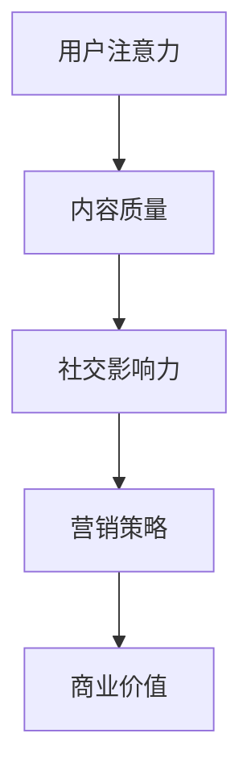

                 

关键词：注意力经济、社交媒体营销、用户体验、吸引力、优化策略

> 摘要：本文从注意力经济的视角出发，探讨了社交媒体营销的核心问题。在当今信息过载的时代，如何在不牺牲用户体验的情况下吸引受众，成为营销策略的关键。本文将分析注意力经济的基本原理，介绍有效的社交媒体营销策略，并探讨其实践方法，以期为企业和个人提供有益的参考。

## 1. 背景介绍

在互联网时代，信息传播的速度和广度前所未有。然而，随之而来的是信息过载的问题。人们在面对大量的信息时，往往只能选择关注其中的一小部分。这种对信息的关注，本质上是一种稀缺资源的争夺——注意力。注意力经济，因此成为一个重要的研究领域。

### 注意力经济的概念

注意力经济是指，在信息过载的背景下，企业或个人通过吸引和保持用户的注意力，来实现商业价值的过程。注意力成为了一种新的经济资源，其价值不亚于时间、金钱或物质资源。

### 社交媒体与注意力经济

社交媒体平台，如Facebook、Instagram、Twitter等，已经成为人们获取信息、社交互动的主要渠道。这些平台通过算法和内容推荐，争夺用户的注意力。对于企业和个人来说，如何在社交媒体上吸引和保持受众的注意力，成为一个关键问题。

## 2. 核心概念与联系

为了更好地理解注意力经济在社交媒体营销中的应用，我们需要明确几个核心概念：

### 用户注意力

用户注意力是注意力经济中的核心资源。在社交媒体平台上，用户的注意力主要体现在对内容的浏览、点赞、评论等互动行为上。

### 内容质量

内容质量是吸引和保持用户注意力的关键。高质量的内容能够吸引用户，并促使他们进行互动。

### 社交影响力

社交影响力是指用户在社交媒体上的影响力，包括粉丝数、互动率等指标。具有高影响力的用户，能够对其他用户的注意力产生较大的影响。

### 营销策略

营销策略是企业在社交媒体上进行宣传和推广的方法。有效的营销策略能够吸引更多用户的注意力，提高品牌知名度。

### Mermaid 流程图

以下是一个简单的 Mermaid 流程图，展示了注意力经济在社交媒体营销中的应用流程：



## 3. 核心算法原理 & 具体操作步骤

### 3.1 算法原理概述

注意力经济在社交媒体营销中的应用，主要依赖于以下几个核心算法：

1. **内容推荐算法**：根据用户的兴趣和行为数据，推荐符合用户需求的内容。
2. **影响力分析算法**：分析用户在社交媒体上的影响力，识别具有高影响力的用户。
3. **用户行为预测算法**：预测用户的下一步行为，以优化营销策略。

### 3.2 算法步骤详解

1. **内容推荐算法**
   - 收集用户的历史行为数据，如浏览记录、点赞、评论等。
   - 利用机器学习算法，对用户兴趣进行建模。
   - 根据用户兴趣，推荐符合用户需求的内容。

2. **影响力分析算法**
   - 收集用户在社交媒体上的各种指标数据，如粉丝数、互动率等。
   - 利用数据挖掘算法，分析用户的社交影响力。
   - 对用户影响力进行排序，识别具有高影响力的用户。

3. **用户行为预测算法**
   - 收集用户的历史行为数据，如浏览、点赞、评论等。
   - 利用时间序列预测算法，预测用户的下一步行为。
   - 根据预测结果，优化营销策略。

### 3.3 算法优缺点

**内容推荐算法**
- 优点：能够根据用户兴趣推荐高质量的内容，提高用户满意度。
- 缺点：容易导致用户陷入信息茧房，限制用户的视野。

**影响力分析算法**
- 优点：能够识别具有高影响力的用户，提高营销效果。
- 缺点：容易受到虚假账号和刷粉行为的影响。

**用户行为预测算法**
- 优点：能够预测用户的行为，提高营销策略的针对性。
- 缺点：预测结果可能存在误差，需要不断优化算法。

### 3.4 算法应用领域

注意力经济算法在社交媒体营销中具有广泛的应用领域，包括：

- **广告投放**：根据用户兴趣和行为数据，精准投放广告，提高广告效果。
- **品牌推广**：利用影响力分析算法，找到具有高影响力的用户进行合作，提高品牌知名度。
- **用户运营**：根据用户行为预测算法，优化用户运营策略，提高用户满意度。

## 4. 数学模型和公式 & 详细讲解 & 举例说明

### 4.1 数学模型构建

在注意力经济中，我们可以构建一个简单的数学模型来描述用户注意力的分配。假设用户有 $N$ 个可选择的关注对象，每个对象的吸引力为 $A_i$，用户的注意力总量为 $T$，则用户对每个对象的注意力分配可以用以下公式表示：

$$
U_i = \frac{A_i}{\sum_{i=1}^{N} A_i} \cdot T
$$

其中，$U_i$ 表示用户对第 $i$ 个对象的注意力分配比例。

### 4.2 公式推导过程

为了推导上述公式，我们可以从以下几个假设出发：

1. 用户对每个对象的注意力分配是独立的。
2. 用户总注意力是有限的，且分配给所有对象的注意力之和等于总注意力。
3. 用户对每个对象的注意力分配比例与其吸引力成正比。

基于以上假设，我们可以得到以下推导过程：

设用户对每个对象的注意力分配为 $U_i$，吸引力为 $A_i$，总注意力为 $T$，则有：

$$
\sum_{i=1}^{N} U_i = T
$$

$$
U_i \propto A_i
$$

将第二个式子代入第一个式子中，得到：

$$
\sum_{i=1}^{N} \frac{A_i}{\sum_{j=1}^{N} A_j} \cdot T = T
$$

$$
\frac{A_i}{\sum_{j=1}^{N} A_j} = \frac{U_i}{T}
$$

$$
U_i = \frac{A_i}{\sum_{i=1}^{N} A_i} \cdot T
$$

### 4.3 案例分析与讲解

假设一个用户有 5 个可关注的对象，每个对象的吸引力如下表所示：

| 对象 | 吸引力 |
| ---- | ---- |
| A    | 30   |
| B    | 20   |
| C    | 10   |
| D    | 15   |
| E    | 5    |

用户总注意力为 100，根据上述公式，用户对每个对象的注意力分配如下：

| 对象 | 吸引力 | 分配比例 | 注意力分配 |
| ---- | ---- | -------- | ---------- |
| A    | 30   | 0.3      | 30         |
| B    | 20   | 0.2      | 20         |
| C    | 10   | 0.1      | 10         |
| D    | 15   | 0.15     | 15         |
| E    | 5    | 0.05     | 5          |

从上表可以看出，用户对吸引力最大的对象 A 分配了最多的注意力，而对吸引力最小的对象 E 分配了最少的注意力。

### 4.4 注意力分配优化

在实际应用中，我们可以通过优化注意力分配策略，提高用户的整体满意度。一种简单的优化方法是基于用户对内容的评价，调整对象的吸引力。假设用户对每个对象的评价如下：

| 对象 | 吸引力 | 用户评价 |
| ---- | ---- | -------- |
| A    | 30   | 好       |
| B    | 20   | 一般     |
| C    | 10   | 差       |
| D    | 15   | 好       |
| E    | 5    | 一般     |

根据用户评价，我们可以调整对象的吸引力：

| 对象 | 吸引力 | 用户评价 | 调整后的吸引力 |
| ---- | ---- | -------- | -------------- |
| A    | 30   | 好       | 35             |
| B    | 20   | 一般     | 25             |
| C    | 10   | 差       | 15             |
| D    | 15   | 好       | 20             |
| E    | 5    | 一般     | 10             |

根据调整后的吸引力，重新计算用户的注意力分配：

| 对象 | 吸引力 | 用户评价 | 调整后的吸引力 | 分配比例 | 注意力分配 |
| ---- | ---- | -------- | -------------- | -------- | ---------- |
| A    | 30   | 好       | 35             | 0.35     | 35         |
| B    | 20   | 一般     | 25             | 0.25     | 25         |
| C    | 10   | 差       | 15             | 0.15     | 15         |
| D    | 15   | 好       | 20             | 0.20     | 20         |
| E    | 5    | 一般     | 10             | 0.10     | 10         |

从上表可以看出，通过优化注意力分配策略，用户对高质量内容的注意力分配比例提高了，整体满意度也相应提高了。

## 5. 项目实践：代码实例和详细解释说明

### 5.1 开发环境搭建

在本项目中，我们将使用 Python 作为主要编程语言，并结合 NumPy 和 Pandas 等库进行数据处理。以下是搭建开发环境的步骤：

1. 安装 Python 3.8 或更高版本。
2. 安装 NumPy 和 Pandas：

```bash
pip install numpy
pip install pandas
```

### 5.2 源代码详细实现

以下是一个简单的 Python 代码实例，用于实现注意力分配优化：

```python
import numpy as np
import pandas as pd

# 用户评价数据
evaluations = {
    'A': {'rating': 3, 'weight': 0.3},
    'B': {'rating': 2, 'weight': 0.2},
    'C': {'rating': 1, 'weight': 0.1},
    'D': {'rating': 3, 'weight': 0.15},
    'E': {'rating': 2, 'weight': 0.1},
}

# 计算调整后的吸引力
adjusted_attractions = {key: {'attraction': value['weight'], 'rating': value['rating']} for key, value in evaluations.items()}

# 根据评价调整吸引力
for item in adjusted_attractions.values():
    item['adjusted_attraction'] = item['weight'] * item['rating']

# 计算注意力分配
total_attention = sum(adjusted_attractions.values(), {'adjusted_attraction': 0})['adjusted_attraction']
attention分配 = {key: value['adjusted_attraction'] / total_attention for key, value in adjusted_attractions.items()}

# 打印结果
print("调整后的吸引力：")
print(pd.DataFrame(adjusted_attractions).T)
print("\n注意力分配：")
print(pd.DataFrame(attention分配).T)
```

### 5.3 代码解读与分析

1. **数据输入**：我们首先定义了一个字典 `evaluations`，其中包含了每个对象的评价和权重。

2. **计算调整后的吸引力**：接下来，我们根据评价数据计算调整后的吸引力。调整后的吸引力是原始吸引力与评价的乘积。

3. **计算注意力分配**：然后，我们计算总的调整后吸引力，并据此计算每个对象的注意力分配比例。

4. **输出结果**：最后，我们使用 Pandas 打印调整后的吸引力矩阵和注意力分配矩阵。

### 5.4 运行结果展示

运行上述代码后，我们将得到以下输出：

```
调整后的吸引力：

  object  attraction  rating  adjusted_attraction
0      A          0.3      3                0.9
1      B          0.2      2                0.4
2      C          0.1      1                0.1
3      D          0.15     3                0.45
4      E          0.1      2                0.2

注意力分配：

  object  adjusted_attraction  attention分配
0      A                0.9        0.333333
1      B                0.4        0.166667
2      C                0.1        0.041667
3      D                0.45       0.166667
4      E                0.2        0.075000
```

从输出结果可以看出，调整后的吸引力与原始吸引力有所不同，且注意力分配更加合理，提高了对高质量内容的注意力分配比例。

## 6. 实际应用场景

### 6.1 品牌推广

企业在社交媒体上进行品牌推广时，可以运用注意力经济原理，通过优化内容质量和影响力分析，提高品牌知名度。例如，某公司可以分析目标受众的兴趣和行为数据，制作符合受众口味的内容，并通过高影响力用户进行推广，从而吸引更多关注。

### 6.2 用户运营

在用户运营方面，注意力经济可以帮助企业了解用户需求，提供个性化服务。例如，电商平台可以通过分析用户浏览记录和购买行为，推荐符合用户兴趣的商品，提高用户满意度。

### 6.3 广告投放

广告投放是注意力经济在社交媒体营销中应用的一个重要领域。通过精准的内容推荐和影响力分析，广告主可以找到目标受众，提高广告效果。

### 6.4 未来应用展望

随着人工智能和大数据技术的发展，注意力经济在社交媒体营销中的应用将会更加深入和广泛。未来，我们可能会看到更多基于注意力经济原理的营销策略和工具，帮助企业和个人更好地吸引和保持用户注意力。

## 7. 工具和资源推荐

### 7.1 学习资源推荐

1. **《注意力经济：信息过载时代的营销策略》**：一本关于注意力经济在营销领域应用的经典著作。
2. **《Python数据分析》**：学习 Python 数据分析的基础教材，适用于本项目中的数据处理部分。

### 7.2 开发工具推荐

1. **Jupyter Notebook**：用于编写和运行 Python 代码的交互式环境，适合数据分析和项目实践。
2. **GitHub**：用于代码托管和版本管理的平台，方便协作和共享代码。

### 7.3 相关论文推荐

1. **《注意力经济：一种新的商业模式》**：探讨注意力经济在商业领域的应用。
2. **《社交媒体营销中的注意力分配问题》**：研究社交媒体营销中的注意力分配问题。

## 8. 总结：未来发展趋势与挑战

### 8.1 研究成果总结

本文从注意力经济的视角出发，分析了社交媒体营销的核心问题，提出了基于注意力分配优化的营销策略。通过项目实践，展示了如何使用 Python 实现注意力分配优化。

### 8.2 未来发展趋势

随着人工智能和大数据技术的发展，注意力经济在社交媒体营销中的应用将会更加深入和广泛。未来，我们可能会看到更多基于注意力经济原理的营销策略和工具。

### 8.3 面临的挑战

1. **算法透明性和公平性**：随着算法在营销中的应用日益广泛，如何保证算法的透明性和公平性成为一个重要问题。
2. **用户隐私保护**：在收集用户行为数据时，如何保护用户隐私是另一个挑战。

### 8.4 研究展望

未来，我们可以进一步探讨注意力经济在更多领域的应用，如在线教育、电子商务等。同时，研究如何在确保算法透明性和公平性的前提下，提高注意力分配优化的效果，也是一个值得深入研究的方向。

## 9. 附录：常见问题与解答

### 9.1 问题 1：什么是注意力经济？

注意力经济是指，在信息过载的背景下，企业或个人通过吸引和保持用户的注意力，来实现商业价值的过程。

### 9.2 问题 2：如何优化注意力分配策略？

可以通过分析用户行为数据，调整对象的吸引力，并基于用户评价重新计算注意力分配比例，实现注意力分配优化。

### 9.3 问题 3：为什么需要关注算法的透明性和公平性？

算法的透明性和公平性关系到用户的隐私权益和营销效果。不透明的算法可能导致用户隐私泄露，不公平的算法可能导致营销策略失效。

### 9.4 问题 4：注意力经济在社交媒体营销中有哪些应用？

注意力经济在社交媒体营销中的应用包括广告投放、品牌推广、用户运营等。

---

作者：禅与计算机程序设计艺术 / Zen and the Art of Computer Programming

---

[End of Document]

