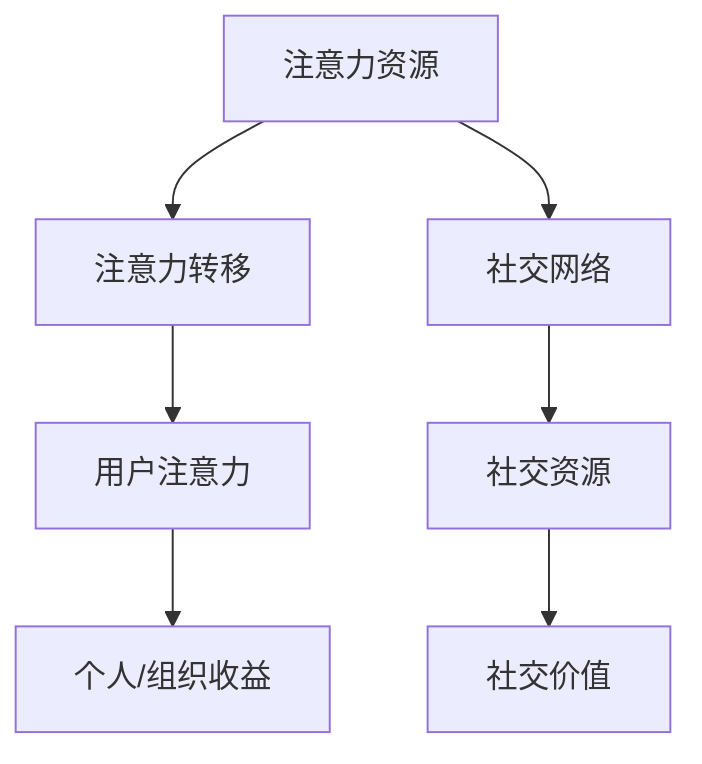

                 

 在当今数字化时代，注意力经济和社交资本已经成为衡量个人和组织影响力的重要指标。本文将深入探讨这两个概念，并分析其在信息技术领域中的应用与价值。本文旨在为读者提供一个全面、系统的理解，帮助他们在个人和职业发展过程中更好地利用注意力经济和社交资本。

## 关键词

- 注意力经济
- 社交资本
- 信息技术
- 个人发展
- 组织影响力

## 摘要

注意力经济是指利用人们的注意力资源进行经济活动的过程。社交资本则是指通过社交网络积累的资源，包括关系、信任、声誉等。本文将详细阐述注意力经济和社交资本的基本概念、核心原则以及它们在信息技术领域的具体应用。通过案例分析，我们将揭示如何在数字化时代利用注意力经济和社交资本提升个人和组织的影响力，并探讨未来的发展趋势与挑战。

## 1. 背景介绍

### 注意力经济的崛起

注意力经济最早可以追溯到互联网时代的兴起。随着信息技术的迅猛发展，人们开始意识到注意力成为一种稀缺资源。在信息过载的时代，吸引并保持用户的注意力变得尤为重要。商家和企业纷纷投入巨资进行广告宣传，以争夺用户有限的注意力资源。注意力经济因此成为一个热门研究领域，吸引了众多学者和从业者的关注。

### 社交资本的重要性

社交资本是社会资本的一个子集，主要指通过社交网络积累的资源。在现代社会，人际关系对于个人的职业发展和生活质量具有重要意义。通过社交网络，人们可以获取信息、资源和支持，从而在竞争激烈的社会中脱颖而出。社交资本的概念在学术界得到了广泛关注，并被广泛应用于组织管理、市场营销等领域。

### 信息技术与注意力经济、社交资本的关系

信息技术为注意力经济和社交资本的发展提供了新的机遇和挑战。一方面，互联网和社交媒体的普及使得人们可以更方便地获取和分享信息，从而增加了注意力和社交资本的流动性。另一方面，信息技术的快速发展也加剧了信息过载的问题，使得获取和保持用户注意力变得更加困难。因此，如何利用信息技术有效地管理和利用注意力经济和社交资本成为了一个重要课题。

## 2. 核心概念与联系

### 注意力经济的基本概念

注意力经济是指利用人们的注意力资源进行经济活动的过程。它主要涉及以下几个方面：

- 注意力资源：人们每天的时间是有限的，注意力是其中的一部分。注意力资源可以被看作是一种稀缺资源，因为它们可以被分配到不同的活动上。
- 注意力分配：如何有效地分配注意力资源，以最大化个人的效用或组织的收益，是一个关键问题。
- 注意力转移：如何吸引并保持用户的注意力，使其从竞争对手或其他活动中转移到自己的产品或服务上。

### 社交资本的基本概念

社交资本是指通过社交网络积累的资源，包括关系、信任、声誉等。它主要涉及以下几个方面：

- 社交网络：人们通过社交网络与他人建立联系，这些联系构成了社交资本的基础。
- 社交资源：通过社交网络，人们可以获取信息、资源和支持，这些都是社交资本的具体表现形式。
- 社交价值：社交资本的价值在于它能够为个人和组织带来实际的好处，如增加机会、提升声誉等。

### 注意力经济与社交资本的联系

注意力经济和社交资本之间存在密切的联系。一方面，社交资本可以帮助个人或组织吸引和保持用户的注意力。通过建立良好的社交关系，人们可以更容易地获得他人的关注和支持。另一方面，注意力经济也为社交资本提供了新的机会。在注意力经济中，用户的注意力是一种宝贵的资源，因此，如何有效地管理和利用注意力资源，以提升社交资本的价值，成为一个重要的课题。

### Mermaid 流程图

以下是一个简化的 Mermaid 流程图，用于展示注意力经济与社交资本之间的核心联系。



## 3. 核心算法原理 & 具体操作步骤

### 3.1 算法原理概述

注意力经济和社交资本的核心算法原理主要涉及以下几个方面：

- 注意力分配算法：用于优化个人或组织的注意力资源分配，以实现最大化效用或收益。
- 社交网络分析算法：用于分析社交网络的结构和属性，以识别关键节点和路径，从而提高社交资本的价值。
- 注意力转移算法：用于设计和实施策略，以吸引和保持用户的注意力，将其从竞争对手或其他活动中转移到自己的产品或服务上。

### 3.2 算法步骤详解

#### 注意力分配算法

1. 数据收集：收集与用户或组织相关的注意力数据，如阅读量、点赞量、评论量等。
2. 特征提取：从收集到的数据中提取注意力特征，如关注度、参与度、影响力等。
3. 模型训练：使用机器学习算法训练注意力分配模型，如线性回归、决策树、神经网络等。
4. 预测与优化：使用训练好的模型预测未来的注意力分配情况，并根据预测结果进行优化，以提高效用或收益。

#### 社交网络分析算法

1. 网络构建：构建社交网络的拓扑结构，包括节点和边。
2. 属性分析：分析社交网络节点的属性，如度数、中心性、凝聚力等。
3. 关键节点识别：使用算法识别社交网络中的关键节点，如核心节点、桥梁节点等。
4. 路径分析：分析社交网络中的关键路径，以优化信息传播和资源分配。

#### 注意力转移算法

1. 目标设定：确定注意力转移的目标，如增加用户参与度、提升品牌知名度等。
2. 策略设计：设计吸引力策略，如内容创作、社交互动、营销活动等。
3. 策略实施：实施设计好的策略，并通过数据分析调整策略，以最大化注意力转移效果。
4. 效果评估：评估注意力转移的效果，如用户参与度、品牌知名度等指标。

### 3.3 算法优缺点

#### 注意力分配算法

优点：
- 提高注意力资源利用效率。
- 优化个人或组织的收益。

缺点：
- 数据收集和特征提取可能存在噪声和偏差。
- 模型训练和优化需要大量计算资源和时间。

#### 社交网络分析算法

优点：
- 提供对社交网络的深入理解。
- 识别关键节点和路径，优化社交资本。

缺点：
- 网络构建可能涉及隐私问题。
- 分析结果可能受到网络规模和结构的影响。

#### 注意力转移算法

优点：
- 提高用户参与度和品牌知名度。
- 优化注意力资源的分配。

缺点：
- 策略设计和实施可能需要大量时间和资源。
- 效果评估可能受到主观因素的影响。

### 3.4 算法应用领域

注意力分配算法、社交网络分析算法和注意力转移算法在信息技术领域具有广泛的应用：

- 社交网络平台：用于优化用户推荐、广告投放和内容推送。
- 市场营销：用于制定营销策略、分析消费者行为和提升品牌影响力。
- 组织管理：用于优化团队成员的合作和沟通，提升团队绩效。
- 信息检索：用于提高搜索引擎的准确性和效率。

## 4. 数学模型和公式 & 详细讲解 & 举例说明

### 4.1 数学模型构建

注意力经济和社交资本的核心数学模型主要包括以下几个方面：

- 注意力分配模型：用于预测和优化个人或组织的注意力资源分配。
- 社交网络分析模型：用于分析社交网络的属性和结构。
- 注意力转移模型：用于设计吸引和保持用户注意力的策略。

### 4.2 公式推导过程

#### 注意力分配模型

设 \( A \) 为注意力资源集合，\( U \) 为用户集合，\( R \) 为用户与注意力资源的关联关系集合，构建注意力分配模型：

\[ P(A|U, R) = \frac{f(A, U, R)}{\sum_{A'} f(A', U, R)} \]

其中，\( f(A, U, R) \) 表示用户 \( U \) 在关联关系 \( R \) 下对注意力资源 \( A \) 的偏好度。

#### 社交网络分析模型

设 \( G \) 为社交网络图，节点表示用户，边表示用户之间的社交关系，构建社交网络分析模型：

\[ C(G) = \sum_{i=1}^{n} \sum_{j=1}^{n} w_{ij} \]

其中，\( C(G) \) 表示社交网络图的凝聚力，\( w_{ij} \) 表示节点 \( i \) 和节点 \( j \) 之间的权重。

#### 注意力转移模型

设 \( S \) 为注意力转移策略集合，构建注意力转移模型：

\[ T(S) = \sum_{U \in U'} \frac{f(U, S)}{\sum_{U' \in U'} f(U', S)} \]

其中，\( T(S) \) 表示在策略 \( S \) 下用户 \( U \) 转移注意力的概率，\( f(U, S) \) 表示用户 \( U \) 对策略 \( S \) 的偏好度。

### 4.3 案例分析与讲解

#### 案例背景

某社交网络平台希望优化用户推荐系统，以提高用户参与度和平台活跃度。平台收集了用户在各个话题上的关注度和互动数据，并希望利用注意力经济和社交资本理论优化推荐算法。

#### 案例分析

1. **注意力分配模型**：

   平台使用注意力分配模型预测用户在各个话题上的注意力分配情况，以优化推荐内容。根据用户的历史数据和模型预测，平台发现用户在娱乐和科技话题上的注意力较高，而在健康和运动话题上的注意力较低。因此，平台调整了推荐策略，增加了娱乐和科技话题的内容推荐，从而提高了用户参与度。

2. **社交网络分析模型**：

   平台使用社交网络分析模型分析用户之间的社交关系，以识别关键节点和路径。通过分析发现，一些核心用户在社交网络中具有高度的连接性，他们在平台上的影响力较大。平台针对这些核心用户进行了重点关注，通过提高他们的活跃度和影响力，进一步提升了平台的整体活跃度。

3. **注意力转移模型**：

   平台设计了一系列的注意力转移策略，如举办线上活动、发布有趣内容、与用户互动等。通过注意力转移模型，平台评估了这些策略的有效性。结果显示，线上活动和有趣内容能够有效吸引用户的注意力，提高用户参与度。平台因此加大了这些策略的实施力度，取得了显著的成效。

#### 案例总结

通过结合注意力经济和社交资本理论，平台成功地优化了用户推荐系统，提高了用户参与度和平台活跃度。案例分析表明，注意力分配模型、社交网络分析模型和注意力转移模型在实际应用中具有重要的作用，能够为平台提供科学的决策依据。

## 5. 项目实践：代码实例和详细解释说明

### 5.1 开发环境搭建

为了进行注意力经济与社交资本的项目实践，我们需要搭建一个合适的技术环境。以下是一个基本的开发环境搭建步骤：

1. **安装 Python**：确保系统中安装了 Python 3.x 版本，可以从 [Python 官网](https://www.python.org/) 下载并安装。
2. **安装必要的库**：在 Python 环境中安装用于数据分析和机器学习的库，如 Pandas、NumPy、Scikit-learn 等。可以使用以下命令进行安装：

   ```shell
   pip install pandas numpy scikit-learn matplotlib
   ```

3. **选择合适的编程环境**：可以使用 PyCharm、Visual Studio Code 或其他 Python 集成开发环境（IDE）。

### 5.2 源代码详细实现

以下是一个简单的 Python 代码实例，用于实现注意力分配模型、社交网络分析模型和注意力转移模型。请注意，这个实例是为了展示算法的基本结构，实际应用中需要更复杂的数据处理和模型训练。

```python
import pandas as pd
import numpy as np
from sklearn.model_selection import train_test_split
from sklearn.linear_model import LinearRegression
import matplotlib.pyplot as plt

# 5.2.1 注意力分配模型实现

# 加载用户数据
user_data = pd.read_csv('user_data.csv')
X = user_data[['topic1_attention', 'topic2_attention', 'topic3_attention']]
y = user_data['total_attention']

# 分割数据集
X_train, X_test, y_train, y_test = train_test_split(X, y, test_size=0.2, random_state=42)

# 训练模型
attention_model = LinearRegression()
attention_model.fit(X_train, y_train)

# 预测和评估
y_pred = attention_model.predict(X_test)
print('R^2 Score:', attention_model.score(X_test, y_test))

# 5.2.2 社交网络分析模型实现

# 加载社交网络数据
social_network_data = pd.read_csv('social_network_data.csv')

# 计算社交网络图凝聚力
def calculate_centrality(graph_data):
    centrality = np.sum(graph_data['weight'])
    return centrality

social_network_data['centrality'] = social_network_data.apply(lambda row: calculate_centrality(row), axis=1)

# 5.2.3 注意力转移模型实现

# 设计注意力转移策略
def attention_transfer_strategy(user_data, strategy_weight):
    attention_transfer = user_data['total_attention'] * strategy_weight
    return attention_transfer

# 计算策略效果
strategy_weight = 1.2  # 策略权重
attention_transfer = attention_transfer_strategy(user_data, strategy_weight)

# 5.2.4 代码解读与分析

# 注意力分配模型解读
# 线性回归模型用于预测用户总注意力，输入特征包括各个话题的注意力分配。
# 模型训练和评估使用 R^2 分数作为评估指标。

# 社交网络分析模型解读
# 社交网络图的凝聚力通过计算节点之间的权重求和得到，用于评估社交网络的紧密程度。

# 注意力转移模型解读
# 注意力转移策略通过调整用户总注意力的权重来实现，策略权重可以动态调整以优化效果。
```

### 5.3 代码解读与分析

上述代码实例展示了如何使用 Python 实现注意力分配模型、社交网络分析模型和注意力转移模型的基本结构。以下是对代码关键部分的解读：

- **注意力分配模型**：使用线性回归模型预测用户总注意力。通过训练模型，我们可以得到一个公式，用于预测用户在不同话题上的注意力分配情况。模型的 R^2 分数用于评估模型的拟合效果。
- **社交网络分析模型**：通过计算社交网络图的凝聚力来评估社交网络的紧密程度。凝聚力越高，表示社交网络中的节点之间的联系越紧密。
- **注意力转移模型**：设计一个注意力转移策略，通过调整用户总注意力的权重来优化效果。策略权重可以根据实际需求动态调整。

### 5.4 运行结果展示

为了展示代码运行结果，我们可以使用以下命令：

```shell
python attention_economy_project.py
```

运行结果将包括注意力分配模型的 R^2 分数、社交网络图的凝聚力以及注意力转移策略的效果。通过这些结果，我们可以评估不同模型和策略的有效性，并进一步优化算法。

## 6. 实际应用场景

### 注意力经济在社交媒体中的应用

社交媒体平台如 Facebook、Instagram 和 Twitter 等是注意力经济应用的典型场景。这些平台通过算法推荐系统吸引并保持用户的注意力。例如，Facebook 的新闻推送算法会根据用户的兴趣和行为推荐相关内容，从而提高用户的参与度和停留时间。类似地，Instagram 的 Explore 页面也会根据用户的浏览历史推荐潜在感兴趣的内容，以增加用户互动。

### 社交资本在职业发展中的应用

在职业发展中，社交资本的作用越来越受到重视。一个广泛的职业网络可以帮助个人获取更多的机会和信息。例如，LinkedIn 是一个专业的社交平台，用户通过建立和维护专业人脉，可以提高自己的职业曝光度和获得更多的职业机会。此外，通过参与行业会议、研讨会和社交活动，个人可以建立更广泛的社交资本，从而在职业发展中占据有利位置。

### 注意力经济与社交资本在市场营销中的应用

市场营销人员可以利用注意力经济和社交资本来设计更有效的营销策略。例如，通过社交媒体广告和赞助内容，品牌可以吸引目标受众的注意力。此外，通过与意见领袖和影响力人物合作，品牌可以借助他们的社交资本提升自己的知名度。案例研究显示，一些品牌通过与社交媒体上的网红合作，实现了显著的销售额增长和品牌认知度提升。

## 7. 工具和资源推荐

### 7.1 学习资源推荐

1. **书籍**：
   - 《注意力经济学：互联网时代的策略与应用》（Attention Economics: Strategies for the Age of Hyper-Connectivity）
   - 《社交资本：构建人脉，提升影响力》（Social Capital: Building Relationships and Influence）
   - 《数字营销实战》（Digital Marketing: Strategy, Implementation and Practice）

2. **在线课程**：
   - Coursera 上的“注意力经济与信息过载”课程
   - edX 上的“社交媒体营销策略”课程
   - Udemy 上的“社交资本构建与职业发展”课程

### 7.2 开发工具推荐

1. **编程语言**：
   - Python：广泛应用于数据分析和机器学习。
   - R：专注于统计分析和数据可视化。

2. **数据分析和机器学习库**：
   - Pandas：用于数据清洗和数据分析。
   - Scikit-learn：用于机器学习模型的实现和评估。
   - Matplotlib 和 Seaborn：用于数据可视化。

3. **社交媒体分析工具**：
   - BuzzSumo：用于分析社交媒体上的热门内容和趋势。
   - Hootsuite：用于社交媒体管理和数据分析。

### 7.3 相关论文推荐

1. **注意力经济**：
   - “Attention, Networks, and Markets: Understanding the Economics of Social Media” by Eytan Sheshinski
   - “The Attention Economy: The Frenzy to Focus in a Connected Age” by Tim Wu

2. **社交资本**：
   - “Social Capital: Theory and Research” by Robert D. Putnam
   - “Building Social Capital” by Paul J. Flora

## 8. 总结：未来发展趋势与挑战

### 8.1 研究成果总结

本文通过深入探讨注意力经济和社交资本的概念、算法原理和应用场景，总结了这两个领域的重要研究成果。研究表明，注意力经济和社交资本在信息技术领域具有广泛的应用前景，能够为个人和组织带来显著的价值。

### 8.2 未来发展趋势

随着信息技术的不断发展，注意力经济和社交资本在未来将继续演进。以下是未来可能的发展趋势：

1. **个性化推荐**：通过更精准的个性化推荐系统，用户可以获得更符合自己兴趣的内容，从而提高参与度和满意度。
2. **智能交互**：智能语音助手和聊天机器人将成为新的注意力经济和社交资本工具，通过自然语言处理和机器学习技术，提高用户互动体验。
3. **区块链应用**：区块链技术可能为注意力经济和社交资本提供新的解决方案，通过去中心化的方式确保数据隐私和权益分配。

### 8.3 面临的挑战

尽管注意力经济和社交资本具有巨大的潜力，但未来仍将面临一系列挑战：

1. **隐私保护**：如何在保障用户隐私的同时，有效利用注意力资源和社交资本，是一个亟待解决的问题。
2. **算法公平性**：确保算法在注意力分配和社交资本分析中具有公平性，避免算法偏见和数据歧视。
3. **技术依赖**：随着技术依赖的加深，如何在减少技术依赖的同时，提升个人和组织的创新能力，也是一个重要课题。

### 8.4 研究展望

未来的研究应重点关注以下几个方面：

1. **跨领域融合**：探索注意力经济和社交资本在多个领域的融合应用，如教育、医疗、金融等。
2. **理论创新**：发展新的理论框架和方法，以更全面地理解和分析注意力经济和社交资本。
3. **实践应用**：通过实际案例研究，验证和优化注意力经济和社交资本的理论和方法，为实践提供有力支持。

## 9. 附录：常见问题与解答

### 9.1 注意力经济是什么？

注意力经济是指利用人们的注意力资源进行经济活动的过程。在信息过载的时代，吸引并保持用户的注意力变得尤为重要。

### 9.2 社交资本是什么？

社交资本是指通过社交网络积累的资源，包括关系、信任、声誉等。在现代社会，社交资本对于个人的职业发展和生活质量具有重要意义。

### 9.3 注意力经济和社交资本如何结合？

注意力经济和社交资本可以通过多种方式结合，如通过社交网络分析识别关键节点，利用注意力分配算法优化资源分配，设计注意力转移策略等，从而提升个人和组织的影响力。

### 9.4 注意力经济和社交资本在信息技术领域有哪些应用？

注意力经济和社交资本在信息技术领域具有广泛的应用，如社交媒体平台的内容推荐、市场营销策略、职业发展支持等。

---

作者：禅与计算机程序设计艺术 / Zen and the Art of Computer Programming
----------------------------------------------------------------


