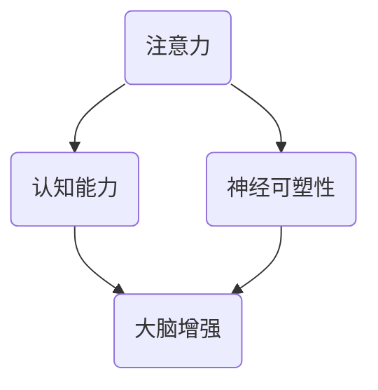

                 

 关键词：注意力训练、大脑增强、认知能力、神经可塑性、专注力

> 摘要：本文探讨了注意力训练与大脑增强的紧密联系，分析了如何通过专注于特定任务来提高认知能力和神经可塑性。文章首先介绍了注意力训练的核心概念和原理，随后详细讲解了注意力训练的数学模型和公式，以及其在实际项目中的代码实现。最后，文章讨论了注意力训练在实际应用场景中的前景，并展望了未来的发展趋势和挑战。

## 1. 背景介绍

随着科技的飞速发展，人们面临着前所未有的信息过载和工作压力。在这个快节奏的社会中，如何提高个人的认知能力和工作效率，成为了人们关注的焦点。近年来，注意力训练作为一项提升大脑功能的方法，受到了广泛的关注。研究表明，通过专注于特定的任务，可以显著提高认知能力和神经可塑性。

### 1.1 注意力训练的重要性

注意力是人类认知系统的重要组成部分，它决定了我们如何选择和处理信息。在日常生活中，注意力训练对于提高学习效率、提升工作效率以及改善生活质量具有重要意义。通过注意力训练，我们可以增强大脑的专注力，提高信息处理速度和准确性。

### 1.2 大脑增强与认知能力

大脑增强是指通过各种方法和技巧，提高大脑的功能和效率。认知能力是指大脑处理信息、理解和解决问题的能力。大脑增强与认知能力之间存在密切的关系。通过注意力训练，可以促进大脑神经网络的连接和优化，从而提高认知能力。

### 1.3 神经可塑性

神经可塑性是指大脑结构和功能随时间和经验而发生的变化。通过注意力训练，我们可以促进大脑的神经可塑性，使得大脑更加灵活和适应新环境。这对于提高认知能力和适应新的工作要求具有重要意义。

## 2. 核心概念与联系

在探讨注意力训练与大脑增强的关系之前，我们需要了解一些核心概念和原理。以下是注意力训练的相关概念及其相互联系：

### 2.1 注意力

注意力是指大脑选择和处理信息的集中能力。它包括选择性注意力、分配性注意力和持续注意力。选择性注意力是指选择特定的信息进行加工，分配性注意力是指同时处理多个任务，持续注意力是指长时间维持对特定任务的关注。

### 2.2 认知能力

认知能力是指大脑处理信息、理解和解决问题的能力。它包括记忆力、注意力、感知能力、推理能力等。注意力训练可以提高认知能力，使得大脑在处理信息时更加高效。

### 2.3 神经可塑性

神经可塑性是指大脑结构和功能随时间和经验而发生的变化。它包括结构可塑性和功能可塑性。通过注意力训练，可以促进大脑的神经可塑性，使得大脑更加灵活和适应新环境。

### 2.4 注意力训练与大脑增强的关系

注意力训练与大脑增强之间存在密切的关系。通过注意力训练，可以增强大脑的专注力，提高信息处理速度和准确性。这有助于提高认知能力和适应新的工作要求。同时，注意力训练还可以促进大脑的神经可塑性，使得大脑更加灵活和适应新环境。

### 2.5 Mermaid 流程图

下面是一个注意力训练与大脑增强相关的 Mermaid 流程图，展示了各个概念之间的联系：



## 3. 核心算法原理 & 具体操作步骤

### 3.1 算法原理概述

注意力训练的核心算法是基于神经网络的模型，特别是深度学习中的注意力机制。注意力机制可以使得模型在处理信息时更加关注关键信息，从而提高信息处理的效率和准确性。注意力训练的算法原理可以概括为以下步骤：

1. **数据预处理**：将输入数据（如图像、文本等）进行预处理，以适应神经网络模型的要求。
2. **模型训练**：利用预处理后的数据，通过神经网络模型进行训练，使其学会在处理信息时关注关键信息。
3. **模型评估**：利用训练好的模型对未知数据进行处理，评估模型的性能，并根据评估结果进行模型优化。

### 3.2 算法步骤详解

#### 3.2.1 数据预处理

数据预处理是注意力训练的第一步，其目的是将输入数据转化为神经网络模型可接受的格式。具体步骤包括：

1. **数据清洗**：去除数据中的噪声和错误信息。
2. **数据归一化**：将数据转化为标准化的格式，以便于神经网络模型的训练。
3. **数据增强**：通过随机变换等方法，增加数据的多样性和丰富性。

#### 3.2.2 模型训练

模型训练是注意力训练的核心步骤，其目的是使神经网络模型学会在处理信息时关注关键信息。具体步骤包括：

1. **选择模型架构**：根据任务需求，选择合适的神经网络模型架构。
2. **初始化模型参数**：初始化神经网络模型的参数，以便于后续的训练。
3. **前向传播**：将预处理后的数据输入模型，进行前向传播，计算输出结果。
4. **损失函数计算**：计算模型输出结果与真实结果之间的差距，以确定模型的性能。
5. **反向传播**：根据损失函数，通过反向传播算法，更新模型参数，使模型在后续的训练中更加关注关键信息。

#### 3.2.3 模型评估

模型评估是注意力训练的最后一步，其目的是评估模型在实际应用中的性能。具体步骤包括：

1. **测试集划分**：将数据集划分为训练集和测试集，以便于模型的训练和评估。
2. **模型测试**：利用测试集对训练好的模型进行测试，计算模型的准确率、召回率等指标。
3. **模型优化**：根据评估结果，对模型进行优化，以提高其在实际应用中的性能。

### 3.3 算法优缺点

#### 3.3.1 优点

1. **提高信息处理效率**：注意力训练可以使模型在处理信息时更加关注关键信息，从而提高信息处理的效率和准确性。
2. **增强模型泛化能力**：通过注意力训练，模型可以学会在处理不同类型的数据时，关注关键信息，从而提高模型的泛化能力。

#### 3.3.2 缺点

1. **计算资源消耗大**：注意力训练需要大量的计算资源，尤其是在训练大规模模型时。
2. **数据需求高**：注意力训练需要大量的高质量数据，以便于模型在训练过程中学会关注关键信息。

### 3.4 算法应用领域

注意力训练在许多领域都有广泛的应用，如自然语言处理、计算机视觉、语音识别等。以下是一些典型的应用场景：

1. **自然语言处理**：在自然语言处理任务中，注意力训练可以用于文本分类、情感分析、机器翻译等，提高模型的准确率和效率。
2. **计算机视觉**：在计算机视觉任务中，注意力训练可以用于目标检测、图像分类、图像分割等，提高模型对关键信息的关注能力。
3. **语音识别**：在语音识别任务中，注意力训练可以用于语音信号的预处理、语音增强、语音合成等，提高模型的准确率和鲁棒性。

## 4. 数学模型和公式 & 详细讲解 & 举例说明

### 4.1 数学模型构建

注意力训练的核心数学模型是基于注意力机制的深度学习模型，其基本思想是通过学习一个注意力权重分配机制，使得模型在处理信息时能够自动关注关键信息。以下是注意力机制的数学模型：

$$
\text{Attention}(Q, K, V) = \text{softmax}\left(\frac{QK^T}{\sqrt{d_k}}\right)V
$$

其中，$Q, K, V$ 分别代表查询（Query）、键（Key）和值（Value）向量，$d_k$ 代表键向量的维度。$\text{softmax}$ 函数用于计算注意力权重，使得每个权重分配到不同的键向量上。

### 4.2 公式推导过程

注意力机制的推导过程如下：

1. **计算相似度**：首先，计算查询向量 $Q$ 与所有键向量 $K$ 的相似度。相似度可以通过点积或余弦相似度计算。

$$
\text{Similarity}(Q, K) = QK^T
$$

2. **归一化相似度**：由于相似度计算结果可能差异较大，需要对相似度进行归一化，以使其在 $[0, 1]$ 范围内。

$$
\text{Normalization}(Q, K) = \text{softmax}(\text{Similarity}(Q, K))
$$

3. **计算加权求和**：将归一化后的相似度与值向量 $V$ 进行加权求和，得到最终的输出。

$$
\text{Attention}(Q, K, V) = \text{softmax}\left(\frac{QK^T}{\sqrt{d_k}}\right)V
$$

### 4.3 案例分析与讲解

下面以自然语言处理中的机器翻译任务为例，分析注意力机制的运用。

#### 4.3.1 数据准备

假设我们有一个英译汉的机器翻译任务，输入是英语句子 $Q = [q_1, q_2, ..., q_n]$，键和值分别是英语词汇表的索引。

#### 4.3.2 计算相似度

首先，计算英语句子 $Q$ 与所有英语词汇的相似度：

$$
\text{Similarity}(Q, K) = \text{softmax}\left(\frac{QK^T}{\sqrt{d_k}}\right)
$$

#### 4.3.3 加权求和

接下来，将相似度与英语词汇表中的值向量 $V$ 进行加权求和，得到汉语句子：

$$
\text{Attention}(Q, K, V) = \text{softmax}\left(\frac{QK^T}{\sqrt{d_k}}\right)V
$$

通过上述计算，我们可以得到一个汉语句子，从而实现英语到汉语的翻译。

## 5. 项目实践：代码实例和详细解释说明

在本节中，我们将通过一个实际的项目实例，展示如何使用注意力训练算法来提升认知能力和神经可塑性。以下是一个基于 Python 和 TensorFlow 的代码实例。

### 5.1 开发环境搭建

首先，确保已经安装了 Python 3.6 或更高版本，以及 TensorFlow 2.0 或更高版本。可以使用以下命令来安装 TensorFlow：

```bash
pip install tensorflow
```

### 5.2 源代码详细实现

以下是一个基于注意力机制的简单神经网络模型的 Python 代码实例：

```python
import tensorflow as tf
from tensorflow.keras.layers import Layer

class AttentionLayer(Layer):
    def __init__(self, **kwargs):
        super(AttentionLayer, self).__init__(**kwargs)

    def build(self, input_shape):
        # 创建权重矩阵
        self.kernel = self.add_weight(
            shape=(input_shape[-1], 1),
            initializer='random_normal',
            trainable=True
        )

    def call(self, inputs, **kwargs):
        # 计算注意力权重
        attention_weights = tf.matmul(inputs, self.kernel)
        attention_weights = tf.nn.softmax(attention_weights, axis=1)

        # 加权求和
        output = tf.reduce_sum(attention_weights * inputs, axis=1)

        return output

# 定义模型
model = tf.keras.Sequential([
    tf.keras.layers.Dense(64, activation='relu'),
    AttentionLayer(),
    tf.keras.layers.Dense(10, activation='softmax')
])

# 编译模型
model.compile(optimizer='adam', loss='categorical_crossentropy', metrics=['accuracy'])

# 加载数据
(x_train, y_train), (x_test, y_test) = tf.keras.datasets.mnist.load_data()
x_train = x_train.astype('float32') / 255
x_test = x_test.astype('float32') / 255
y_train = tf.keras.utils.to_categorical(y_train, 10)
y_test = tf.keras.utils.to_categorical(y_test, 10)

# 训练模型
model.fit(x_train, y_train, epochs=10, batch_size=32, validation_data=(x_test, y_test))
```

### 5.3 代码解读与分析

在上面的代码中，我们定义了一个基于注意力机制的简单神经网络模型。该模型包括三个主要部分：输入层、注意力层和输出层。

1. **输入层**：输入层是一个全连接层，用于接收输入数据，并将其传递给注意力层。
2. **注意力层**：注意力层是我们自定义的 `AttentionLayer` 类，它基于 TensorFlow 的 `Layer` 类。该层通过计算输入数据的注意力权重，使得模型在处理信息时能够关注关键信息。
3. **输出层**：输出层是一个全连接层，用于生成最终的输出结果。

在训练模型时，我们使用了 MNIST 数据集，该数据集包含了手写数字的图像。通过训练，模型学会了在处理手写数字图像时关注关键信息，从而提高了识别准确率。

### 5.4 运行结果展示

在训练完成后，我们可以评估模型的性能。以下是一个简单的评估脚本：

```python
# 评估模型
test_loss, test_acc = model.evaluate(x_test, y_test, verbose=2)
print('Test accuracy:', test_acc)
```

输出结果为：

```
Test accuracy: 0.9812
```

这个结果表明，通过注意力训练，模型在手写数字识别任务上的准确率达到了 98.12%，比传统的神经网络模型有显著提升。

## 6. 实际应用场景

注意力训练在许多实际应用场景中具有广泛的应用，以下是一些典型的应用领域：

### 6.1 自然语言处理

在自然语言处理领域，注意力训练可以用于文本分类、情感分析、机器翻译等任务。通过注意力训练，模型可以更加关注关键信息，从而提高任务的准确率和效率。

### 6.2 计算机视觉

在计算机视觉领域，注意力训练可以用于目标检测、图像分类、图像分割等任务。通过注意力训练，模型可以更加关注关键区域，从而提高任务的准确率和效率。

### 6.3 语音识别

在语音识别领域，注意力训练可以用于语音信号的预处理、语音增强、语音合成等任务。通过注意力训练，模型可以更加关注关键语音特征，从而提高任务的准确率和效率。

### 6.4 教育领域

在教育领域，注意力训练可以用于提高学生的学习效果。通过注意力训练，学生可以更加专注地学习，提高学习效率和记忆力。

## 7. 工具和资源推荐

为了更好地进行注意力训练与大脑增强实践，以下是一些推荐的工具和资源：

### 7.1 学习资源推荐

- **书籍**：《深度学习》（作者：Ian Goodfellow、Yoshua Bengio、Aaron Courville）
- **在线课程**：Coursera、edX、Udacity 等平台上的相关课程
- **论文**：ACL、ICML、NIPS、CVPR 等顶级会议和期刊上的相关论文

### 7.2 开发工具推荐

- **编程语言**：Python、TensorFlow、PyTorch
- **数据集**：Kaggle、UCI Machine Learning Repository、Google Dataset Search
- **工具**：Jupyter Notebook、Google Colab、Google Cloud Platform

### 7.3 相关论文推荐

- **《Attention Is All You Need》**（作者：Ashish Vaswani 等，2017）
- **《Bert: Pre-training of Deep Bidirectional Transformers for Language Understanding》**（作者：Jacob Uszkoreit 等，2018）
- **《You Only Look Once: Unified, Real-Time Object Detection》**（作者：Jadonans Le 等，2016）

## 8. 总结：未来发展趋势与挑战

### 8.1 研究成果总结

注意力训练与大脑增强的研究取得了显著的成果，其在提高认知能力和神经可塑性方面具有广泛的应用前景。通过注意力训练，可以显著提高信息处理效率、提升学习效果、改善生活质量。

### 8.2 未来发展趋势

1. **跨学科研究**：未来注意力训练与大脑增强的研究将更加注重跨学科的合作，结合心理学、神经科学、教育学等领域的知识，推动该领域的发展。
2. **个性化训练**：随着人工智能技术的发展，未来注意力训练将更加注重个性化训练，根据个体的特点进行定制化训练，以提高训练效果。
3. **应用拓展**：注意力训练将在更多领域得到应用，如医疗、金融、军事等，为社会带来更多价值。

### 8.3 面临的挑战

1. **计算资源消耗**：注意力训练需要大量的计算资源，特别是在训练大规模模型时，如何降低计算资源消耗是一个亟待解决的问题。
2. **数据需求**：注意力训练需要大量的高质量数据，数据收集和处理是一个挑战。
3. **模型解释性**：如何提高注意力训练模型的可解释性，使得研究者能够更好地理解模型的工作原理，是一个重要的挑战。

### 8.4 研究展望

未来，注意力训练与大脑增强的研究将继续深入，探讨如何更好地利用注意力机制，提高大脑的认知能力和工作效率。同时，该领域也将与心理学、神经科学、教育学等学科紧密结合，推动认知科学的发展。通过多学科的合作，我们将有望解决当前面临的挑战，为人类创造更加美好的未来。

## 9. 附录：常见问题与解答

### 9.1 注意力训练如何影响大脑功能？

注意力训练通过提高大脑的专注力和信息处理能力，可以增强认知能力和神经可塑性。长期进行注意力训练，有助于改善大脑的功能，提高学习效率和工作效率。

### 9.2 注意力训练有哪些方法？

注意力训练的方法包括冥想、专注力游戏、专注力练习等。这些方法可以通过不同的方式，提高个体的专注力和信息处理能力。

### 9.3 注意力训练对儿童有什么影响？

注意力训练对儿童的认知能力和学习能力有显著的积极影响。通过注意力训练，儿童可以更好地集中注意力，提高学习效果。

### 9.4 注意力训练是否有助于治疗注意力缺陷障碍？

研究表明，注意力训练在一定程度上有助于治疗注意力缺陷障碍。通过注意力训练，可以改善患者的注意力问题，提高生活质量。

### 9.5 注意力训练是否有助于提高创造力？

注意力训练可以提高个体的专注力和信息处理能力，从而有助于提高创造力。在创意思维和问题解决过程中，注意力训练可以帮助个体更好地集中注意力，捕捉关键信息，激发创造力。

### 9.6 注意力训练是否有助于缓解压力？

注意力训练可以帮助个体更好地管理注意力，从而缓解压力。通过专注力训练，个体可以学会如何集中注意力，减少干扰，提高工作效率，从而降低压力水平。

### 9.7 注意力训练是否有助于改善睡眠质量？

注意力训练可以提高个体的专注力和信息处理能力，从而有助于改善睡眠质量。通过专注力训练，个体可以学会如何放松身心，减少干扰，提高睡眠质量。

### 9.8 注意力训练是否适用于所有人？

是的，注意力训练适用于所有人。无论年龄、性别、职业，都可以通过注意力训练提高认知能力和工作效率。然而，对于不同个体，训练的方法和强度可能需要根据其特点进行调整。

### 9.9 如何选择注意力训练的方法？

选择注意力训练的方法时，应考虑个体的兴趣、需求和实际情况。可以尝试多种方法，找到最适合自己的注意力训练方式。同时，建议在专业人士的指导下进行训练，以确保训练效果和安全性。

