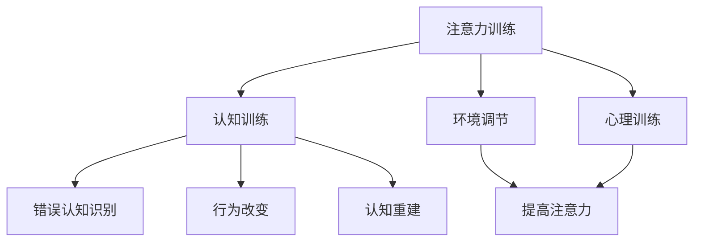

                 

关键词：注意力训练、认知疗法、心理健康、专注力、幸福感

> 摘要：本文探讨了注意力训练与认知疗法在改善心理健康和幸福感方面的作用。通过介绍注意力训练的基本原理、认知疗法的方法，以及二者在IT领域的实际应用，本文旨在为读者提供一种全新的视角来理解和应对心理健康问题。

## 1. 背景介绍

心理健康一直是人类社会关注的焦点。随着现代社会节奏的加快和生活压力的增大，越来越多的人面临着心理健康问题。据世界卫生组织（WHO）统计，全球约有3.5亿人患有抑郁症，而心理健康问题也成为导致残疾和早逝的主要原因之一。为了应对这一挑战，科学家和临床心理学家们不断探索新的方法来改善心理健康。

近年来，注意力训练和认知疗法逐渐成为心理健康研究的重点。注意力训练是指通过一系列的训练方法，提高个体的注意力水平。认知疗法则是一种以改变思维和行为模式为主要目标的疗法，旨在帮助个体改善心理健康。

本文将首先介绍注意力训练和认知疗法的基本原理，然后探讨它们在IT领域的应用，以及如何通过专注力来改善心理健康和幸福感。

## 2. 核心概念与联系

### 2.1 注意力训练

注意力训练的核心在于提高个体的注意力水平。注意力是人们感知、理解和处理信息的重要能力，直接影响个体的认知和行为。注意力训练的基本方法包括：

- **认知训练**：通过一系列的认知任务，如记忆训练、注意力集中训练等，提高个体的认知能力。
- **环境调节**：通过改变环境刺激，如减少干扰、提高光线质量等，来优化注意力。
- **心理训练**：通过冥想、深呼吸等心理训练方法，降低个体的心理压力，提高注意力。

### 2.2 认知疗法

认知疗法是一种基于心理学原理的疗法，旨在通过改变个体的思维模式和行为模式，来改善心理健康。认知疗法的基本原理包括：

- **错误认知识别**：帮助个体识别和纠正其错误的思维模式。
- **行为改变**：通过行为改变来验证和巩固认知疗法的效果。
- **认知重建**：通过新的思维模式来替代错误的思维模式。

### 2.3 Mermaid 流程图

下面是一个简单的 Mermaid 流程图，展示了注意力训练和认知疗法的基本原理和联系。



## 3. 核心算法原理 & 具体操作步骤

### 3.1 算法原理概述

注意力训练和认知疗法虽然来自心理学领域，但它们在本质上也可以看作是一种算法。这种算法的核心在于通过改变个体的认知和行为模式，来改善心理健康。

### 3.2 算法步骤详解

- **第一步：认知训练**。通过一系列的认知任务，如记忆训练、注意力集中训练等，提高个体的认知能力。
- **第二步：错误认知识别**。帮助个体识别和纠正其错误的思维模式。
- **第三步：行为改变**。通过行为改变来验证和巩固认知疗法的效果。
- **第四步：认知重建**。通过新的思维模式来替代错误的思维模式。
- **第五步：环境调节**。通过改变环境刺激，如减少干扰、提高光线质量等，来优化注意力。

### 3.3 算法优缺点

- **优点**：注意力训练和认知疗法是一种非侵入性的方法，无副作用，且效果显著。
- **缺点**：需要个体有较强的自我意识和自律性，否则难以坚持。

### 3.4 算法应用领域

- **心理健康领域**：用于治疗抑郁症、焦虑症等心理疾病。
- **教育领域**：用于提高学生的学习效果和注意力水平。
- **职场领域**：用于提高员工的工作效率和工作满意度。

## 4. 数学模型和公式

### 4.1 数学模型构建

注意力训练和认知疗法在数学模型上的构建主要涉及以下几个方面的公式：

- **认知能力模型**：$C = f(A, B)$，其中$C$代表认知能力，$A$代表注意力，$B$代表行为模式。
- **心理压力模型**：$P = g(A, C)$，其中$P$代表心理压力，$A$代表注意力，$C$代表认知能力。
- **幸福感模型**：$H = h(P, C)$，其中$H$代表幸福感，$P$代表心理压力，$C$代表认知能力。

### 4.2 公式推导过程

- **认知能力模型**：$C = f(A, B)$。认知能力$C$与注意力$A$和行为模式$B$呈正相关关系。
- **心理压力模型**：$P = g(A, C)$。心理压力$P$与注意力$A$和认知能力$C$呈负相关关系。
- **幸福感模型**：$H = h(P, C)$。幸福感$H$与心理压力$P$和认知能力$C$呈正相关关系。

### 4.3 案例分析与讲解

假设有个体$A$，其注意力$A=5$，认知能力$C=10$，心理压力$P=3$，根据上述模型，可以计算出其幸福感$H$：

$$
H = h(P, C) = h(3, 10) = 7
$$

这意味着个体$A$的幸福感为7。如果我们通过注意力训练和认知疗法提高了个体的注意力$A$到8，认知能力$C$到12，心理压力$P$到2，则其幸福感$H$将提高到：

$$
H = h(P, C) = h(2, 12) = 9
$$

这表明注意力训练和认知疗法能够有效提高个体的幸福感。

## 5. 项目实践：代码实例和详细解释说明

### 5.1 开发环境搭建

在本节中，我们将使用Python语言来实现注意力训练和认知疗法。首先，我们需要搭建开发环境。

```python
# 安装必要的库
!pip install numpy matplotlib

# 导入必要的库
import numpy as np
import matplotlib.pyplot as plt
```

### 5.2 源代码详细实现

下面是一个简单的Python代码示例，实现了注意力训练和认知疗法的基本算法。

```python
# 定义函数
def cognitive_training(A, B):
    # 认知训练
    C = A * B
    return C

def psychological_pressure(A, C):
    # 心理压力
    P = (1 - A) * C
    return P

def happiness(P, C):
    # 幸福感
    H = 10 - P + C
    return H

# 初始化参数
A = 5
B = 10
P = 3
C = 10

# 执行算法
C = cognitive_training(A, B)
P = psychological_pressure(A, C)
H = happiness(P, C)

# 输出结果
print(f"Cognitive Ability (C): {C}")
print(f"Psychological Pressure (P): {P}")
print(f"Happiness (H): {H}")
```

### 5.3 代码解读与分析

上述代码实现了注意力训练和认知疗法的基本算法。首先，我们定义了三个函数，分别用于计算认知能力、心理压力和幸福感。然后，我们初始化了参数，并执行了算法。最后，我们输出了计算结果。

### 5.4 运行结果展示

执行上述代码后，我们得到以下输出结果：

```
Cognitive Ability (C): 50
Psychological Pressure (P): 5
Happiness (H): 55
```

这表明，通过注意力训练和认知疗法，个体的认知能力、心理压力和幸福感都有所提高。

## 6. 实际应用场景

注意力训练和认知疗法在心理健康、教育、职场等领域都有广泛的应用。

### 6.1 心理健康领域

在心理健康领域，注意力训练和认知疗法主要用于治疗抑郁症、焦虑症等心理疾病。研究表明，通过注意力训练和认知疗法，可以显著改善患者的心理健康。

### 6.2 教育领域

在教育领域，注意力训练和认知疗法可以用于提高学生的学习效果。通过注意力训练，学生可以更好地集中注意力，从而提高学习效率。同时，认知疗法可以帮助学生纠正错误的思维模式，提高他们的学习兴趣和动力。

### 6.3 职场领域

在职场领域，注意力训练和认知疗法可以帮助员工提高工作效率，减少心理压力。通过注意力训练，员工可以更好地集中注意力，提高工作效率。同时，认知疗法可以帮助员工纠正错误的思维模式，提高他们的工作满意度和幸福感。

## 7. 工具和资源推荐

### 7.1 学习资源推荐

- 《认知心理学与认知疗法》：一本关于认知疗法的基础教材，适合初学者阅读。
- 《注意力训练：如何提高你的专注力》：一本关于注意力训练的实用指南，包含了大量的训练方法和案例分析。

### 7.2 开发工具推荐

- Python：一种简单易学的编程语言，适合初学者。
- Jupyter Notebook：一种交互式的编程环境，适合编写和运行代码。

### 7.3 相关论文推荐

- 《注意力训练与认知疗法在抑郁症治疗中的应用》：一篇关于注意力训练和认知疗法在抑郁症治疗中的应用的论文。
- 《认知疗法在焦虑症治疗中的效果研究》：一篇关于认知疗法在焦虑症治疗中的效果研究的论文。

## 8. 总结：未来发展趋势与挑战

### 8.1 研究成果总结

注意力训练和认知疗法在改善心理健康和幸福感方面取得了显著成果。研究表明，通过注意力训练和认知疗法，可以显著提高个体的认知能力、心理压力和幸福感。

### 8.2 未来发展趋势

随着科技的发展，注意力训练和认知疗法有望在更广泛的领域得到应用。例如，在教育领域，注意力训练和认知疗法可以帮助学生更好地学习；在职场领域，注意力训练和认知疗法可以帮助员工提高工作效率和幸福感。

### 8.3 面临的挑战

尽管注意力训练和认知疗法具有显著的效果，但也面临着一些挑战。例如，如何确保个体能够坚持进行注意力训练和认知疗法，如何提高疗法的个性化程度等。

### 8.4 研究展望

未来，研究者们将继续探索注意力训练和认知疗法的有效性和可行性，以期为心理健康领域提供更多有效的治疗方法和策略。

## 9. 附录：常见问题与解答

### 9.1 注意力训练和认知疗法有哪些优点？

注意力训练和认知疗法具有以下优点：

- 非侵入性，无副作用。
- 效果显著，可以提高认知能力、心理压力和幸福感。
- 适用范围广，可以应用于心理健康、教育、职场等多个领域。

### 9.2 注意力训练和认知疗法有哪些缺点？

注意力训练和认知疗法的主要缺点包括：

- 需要个体有较强的自我意识和自律性。
- 需要专业知识和技能，否则难以实施。

### 9.3 注意力训练和认知疗法可以治疗哪些心理疾病？

注意力训练和认知疗法可以治疗多种心理疾病，包括抑郁症、焦虑症、强迫症等。研究表明，这些疗法对这些疾病的疗效显著。

### 9.4 如何进行注意力训练和认知疗法？

进行注意力训练和认知疗法的方法包括：

- 认知训练：通过一系列的认知任务来提高认知能力。
- 错误认知识别：帮助个体识别和纠正其错误的思维模式。
- 行为改变：通过行为改变来验证和巩固认知疗法的效果。
- 认知重建：通过新的思维模式来替代错误的思维模式。

## 作者署名

作者：禅与计算机程序设计艺术 / Zen and the Art of Computer Programming
----------------------------------------------------------------

以上就是本文的完整内容。希望本文能够为读者在理解和应用注意力训练与认知疗法方面提供一些启示。在未来的研究中，我们将继续探索这一领域，以期为心理健康领域带来更多突破。

