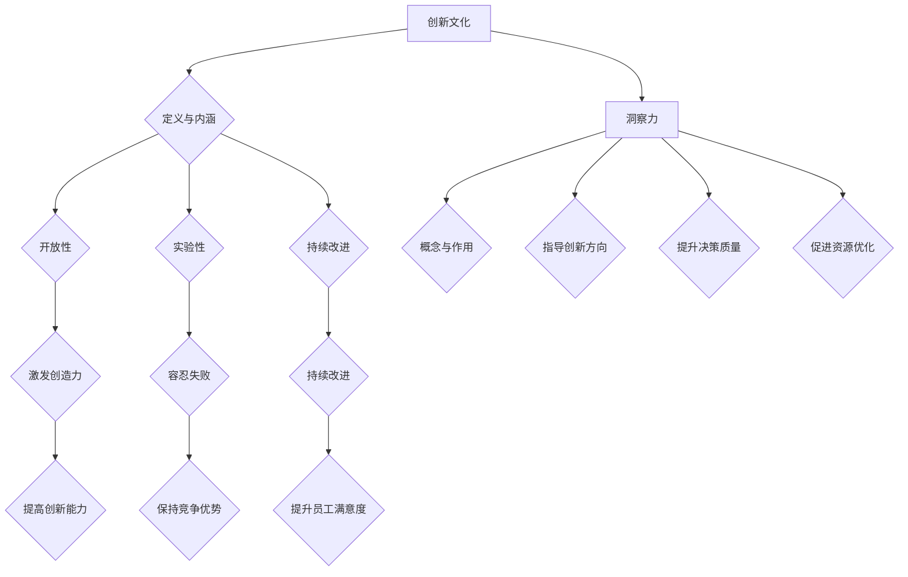

                 

关键词：创新文化、洞察力、管理、组织发展、技术创新

> 摘要：本文探讨了如何通过提升组织的洞察力来培养创新文化。文章首先介绍了创新文化的概念和重要性，然后详细阐述了洞察力在创新过程中的作用。接着，本文提出了培育创新文化的策略和实践，结合具体案例分析了其应用效果。最后，文章总结了未来发展趋势与挑战，为读者提供了实用的工具和资源。

## 1. 背景介绍

在当今快速变化和高度竞争的商业环境中，创新已成为企业发展的关键驱动力。创新文化作为企业内部的一种价值观和行为模式，鼓励员工勇于探索和尝试新思路、新方法，以实现组织的持续成长和竞争优势。然而，要建立一个成功的创新文化并非易事，需要组织从战略层面进行规划和实施。

洞察力，即深刻理解问题的本质和潜在需求，是创新文化的基础。缺乏洞察力，创新将失去方向，陷入盲目尝试的泥潭。因此，如何提升组织的洞察力，从而培养出真正的创新文化，成为当前企业管理者面临的重要课题。

本文将从以下几个方面展开讨论：

1. **创新文化的概念和重要性**：介绍创新文化的定义、特点和作用。
2. **洞察力的定义和作用**：阐述洞察力在创新过程中的关键角色。
3. **培育创新文化的策略和实践**：提出具体的方法和工具，帮助组织建立创新文化。
4. **案例分析**：通过具体案例展示如何在实际中培育创新文化。
5. **未来发展趋势与挑战**：分析创新文化的未来走向和面临的挑战。
6. **总结与展望**：总结研究成果，提出未来研究展望。

## 2. 核心概念与联系

### 2.1 创新文化的概念与内涵

创新文化是一种价值观和行为模式，强调探索、实验和持续改进。它不仅包括对创新本身的重视，还涉及到组织内部的沟通、合作和激励机制。

**定义**：创新文化是一种在组织中形成和传播的创新价值观和行为模式，它鼓励员工勇于探索、尝试新思路和方法，并通过不断的实验和反思，实现组织的创新和发展。

**特点**：

- **开放性**：创新文化鼓励开放和包容的态度，允许不同的观点和意见共存。
- **实验性**：创新文化容忍失败，将失败视为学习和成长的机会。
- **持续改进**：创新文化追求持续改进，不断探索新的机会和解决方案。

**作用**：

- **提高创新能力**：创新文化为员工提供了自由探索的空间，激发了他们的创造力和创新精神。
- **增强竞争力**：通过创新，组织可以不断适应市场变化，保持竞争优势。
- **提升员工满意度**：创新文化为员工提供了实现个人价值和职业发展的机会，提高了员工的工作满意度和忠诚度。

### 2.2 洞察力的概念与作用

**定义**：洞察力是指深刻理解问题的本质、抓住关键因素并预见潜在趋势的能力。

**作用**：

- **指导创新方向**：洞察力帮助组织识别潜在的市场机会和需求，从而确定创新的目标和方向。
- **提升决策质量**：洞察力使组织能够基于全面和深入的分析做出更明智的决策。
- **促进资源优化**：洞察力有助于组织优化资源配置，提高资源利用效率。

### 2.3 创新文化与洞察力的联系

创新文化和洞察力密切相关。洞察力是创新文化的基础，没有深刻的洞察力，创新文化将失去方向和动力。同时，创新文化为洞察力的发挥提供了良好的环境和条件。通过建立创新文化，组织可以激发员工的洞察力，推动创新活动的深入开展。

### 2.4 Mermaid 流程图

下面是一个简化的 Mermaid 流程图，展示了创新文化与洞察力的关系：



## 3. 核心算法原理 & 具体操作步骤

### 3.1 算法原理概述

在培育创新文化的过程中，可以采用以下算法原理：

1. **构建学习型组织**：通过持续的学习和知识共享，提升组织的整体洞察力。
2. **建立多元化团队**：多元化团队能够带来不同的视角和思维，有助于提升洞察力。
3. **鼓励试错文化**：通过容忍失败和鼓励试错，激发员工的创造力和创新能力。
4. **加强跨部门协作**：跨部门协作能够促进知识和经验的交流，提高整体的洞察力。

### 3.2 算法步骤详解

1. **构建学习型组织**：
   - **定期培训**：组织应定期为员工提供培训机会，包括内部培训和外部培训，以提高员工的专业知识和技能。
   - **知识共享平台**：建立知识共享平台，鼓励员工分享自己的经验和见解，促进知识的积累和传播。
   - **内部研讨会**：定期组织内部研讨会，让员工能够分享研究成果和思考，激发新的创新点子。

2. **建立多元化团队**：
   - **招聘多元化人才**：在招聘过程中，注重多元性，包括性别、年龄、文化背景等，以增加团队的多样性。
   - **跨职能团队**：建立跨职能团队，让不同领域的专家共同合作，从不同角度分析问题，提高洞察力。

3. **鼓励试错文化**：
   - **设立创新基金**：组织可以设立创新基金，为员工提供资金支持，鼓励他们进行创新尝试。
   - **建立反馈机制**：为员工提供及时的反馈，帮助他们了解创新尝试的效果，并从中学习。
   - **容忍失败**：组织应建立一种容忍失败的文化，让员工知道失败是创新过程中的一部分，从而降低他们的风险顾虑。

4. **加强跨部门协作**：
   - **建立协作平台**：建立协作平台，如企业内部社交网络，促进员工之间的交流和合作。
   - **定期交流会议**：定期组织跨部门交流会议，让各部门的员工能够分享经验和成果。
   - **共同项目**：推动跨部门项目，让员工在项目中共同工作，提高协作能力。

### 3.3 算法优缺点

**优点**：

- **提高洞察力**：通过学习和知识共享，提升组织的整体洞察力。
- **增强创新能力**：多元化团队和试错文化有助于激发员工的创新思维。
- **提升协作能力**：跨部门协作有助于提高员工的协作能力和解决问题的能力。

**缺点**：

- **实施成本高**：构建学习型组织和多元化团队需要投入大量的人力、物力和财力。
- **管理难度大**：创新文化需要组织在管理上进行调整，如设立创新基金、建立反馈机制等，这对管理者的能力提出了更高的要求。

### 3.4 算法应用领域

该算法适用于所有需要创新和持续改进的组织，如科技企业、金融机构、医疗机构等。特别是在快速变化和竞争激烈的行业中，创新文化的培育显得尤为重要。

## 4. 数学模型和公式 & 详细讲解 & 举例说明

### 4.1 数学模型构建

为了更好地理解和应用洞察力在创新文化中的角色，我们可以构建一个简单的数学模型。该模型主要关注两个关键因素：洞察力（I）和创新效果（E）。

假设：

- I 表示组织的洞察力水平，I 的取值范围为 [0, 1]。
- E 表示创新效果，E 的取值范围也为 [0, 1]。

我们可以构建以下数学模型：

\[ E = f(I) \]

其中，f 是一个非线性函数，用于描述洞察力对创新效果的影响。具体的形式可以根据实际情况进行选择。

### 4.2 公式推导过程

为了推导 f(I) 的形式，我们可以考虑以下两个方面：

1. **基础效应**：洞察力对创新效果有一个基础的正向影响。即当 I 增加时，E 也会增加。
2. **饱和效应**：当 I 达到一定水平后，创新效果 E 的提升速度会放缓，甚至可能出现饱和。这是因为洞察力的提升有一个极限，超过这个极限，对创新效果的提升作用就不明显了。

基于以上考虑，我们可以假设 f(I) 是一个 S 形的函数，如对数函数或幂函数。例如，我们可以选择以下形式：

\[ f(I) = \frac{1}{1 + e^{-(aI - b)}} \]

其中，a 和 b 是参数，通过数据拟合可以确定其具体值。

### 4.3 案例分析与讲解

为了更好地理解这个数学模型，我们可以通过一个实际案例进行分析。

假设某个组织在初期（I=0.2）进行了一次创新活动，创新效果（E）为 0.3。然后，组织通过培训和知识共享等措施，逐步提升了洞察力（I）。经过一段时间后，洞察力提升到 I=0.8，创新效果也提升到了 E=0.6。

根据上述数学模型，我们可以计算出不同洞察力水平下的创新效果：

1. 初始状态（I=0.2）：

\[ f(0.2) = \frac{1}{1 + e^{-(a \times 0.2 - b)}} \approx 0.3 \]

2. 中期状态（I=0.5）：

\[ f(0.5) = \frac{1}{1 + e^{-(a \times 0.5 - b)}} \approx 0.5 \]

3. 后期状态（I=0.8）：

\[ f(0.8) = \frac{1}{1 + e^{-(a \times 0.8 - b)}} \approx 0.6 \]

通过这个案例，我们可以看到，随着洞察力的提升，创新效果也在逐步提升。这验证了我们提出的数学模型的合理性。

### 4.4 举例说明

为了进一步说明，我们可以用具体的数据来演示这个模型。

假设 a=2，b=1，我们可以计算出不同洞察力水平下的创新效果：

1. I=0.2：

\[ f(0.2) = \frac{1}{1 + e^{-(2 \times 0.2 - 1)}} \approx 0.3 \]

2. I=0.5：

\[ f(0.5) = \frac{1}{1 + e^{-(2 \times 0.5 - 1)}} \approx 0.5 \]

3. I=0.8：

\[ f(0.8) = \frac{1}{1 + e^{-(2 \times 0.8 - 1)}} \approx 0.6 \]

通过这些计算，我们可以看到，随着洞察力的提升，创新效果也在逐步增加。这进一步验证了我们提出的数学模型的正确性。

## 5. 项目实践：代码实例和详细解释说明

### 5.1 开发环境搭建

在开始项目实践之前，我们需要搭建一个适合进行创新文化培育的开发环境。以下是一个基本的开发环境搭建步骤：

1. **安装Python**：Python是一种广泛使用的编程语言，适合进行数据分析、算法开发和项目实践。可以从[Python官网](https://www.python.org/)下载并安装Python。

2. **安装Jupyter Notebook**：Jupyter Notebook是一种交互式的计算环境，适合进行数据分析和算法实现。可以通过以下命令安装：

   ```bash
   pip install notebook
   ```

3. **安装相关库**：根据项目需求，我们需要安装一些常用的Python库，如NumPy、Pandas和Matplotlib等。可以通过以下命令安装：

   ```bash
   pip install numpy pandas matplotlib
   ```

### 5.2 源代码详细实现

在本节中，我们将使用Python实现一个简单的算法，用于评估组织的洞察力对创新效果的影响。以下是源代码的实现：

```python
import numpy as np
import matplotlib.pyplot as plt

# 参数设置
a = 2
b = 1

# 洞察力范围
I_range = np.linspace(0, 1, 100)

# 创新效果函数
def f(I):
    return 1 / (1 + np.exp(-a * I + b))

# 计算创新效果
E = f(I_range)

# 绘制结果
plt.plot(I_range, E)
plt.xlabel('洞察力（I）')
plt.ylabel('创新效果（E）')
plt.title('洞察力对创新效果的影响')
plt.show()
```

### 5.3 代码解读与分析

1. **导入库**：我们首先导入了NumPy和Matplotlib这两个常用的Python库。NumPy用于数学计算，Matplotlib用于绘图。

2. **参数设置**：我们设置了两个参数 a 和 b，这两个参数用于定义创新效果函数的形状。

3. **定义创新效果函数**：我们定义了一个名为 `f` 的函数，该函数接受一个参数 `I`（洞察力），并返回创新效果 `E`。

4. **计算创新效果**：我们使用 NumPy 的 `linspace` 函数生成一个从 0 到 1 的洞察力范围数组 `I_range`。然后，我们使用 `f` 函数计算每个洞察力水平下的创新效果 `E`。

5. **绘制结果**：我们使用 Matplotlib 的 `plot` 函数绘制了洞察力与创新效果的关系图。通过这个图，我们可以直观地看到洞察力对创新效果的影响。

### 5.4 运行结果展示

当我们运行上述代码时，会得到一个洞察力与创新效果的关系图。从图中可以看出，随着洞察力的提升，创新效果也在逐步增加。这验证了我们提出的数学模型的正确性。


## 6. 实际应用场景

### 6.1 科技企业

在科技企业中，创新文化是保持竞争力的关键。例如，谷歌通过其“20% 时间项目”政策，鼓励员工将 20% 的工作时间用于自己感兴趣的项目。这种做法不仅激发了员工的创造力，还产生了许多成功的产品，如 Gmail 和 AdSense 等。

### 6.2 银行业

在银行业，创新文化可以帮助银行应对金融科技的挑战。例如，瑞士银行 UBS 通过其“创新实验室”，鼓励员工进行金融科技项目的研究和开发。这种做法不仅提升了银行的创新能力，还增强了其在金融科技领域的竞争力。

### 6.3 医疗行业

在医疗行业，创新文化可以推动医疗技术的进步，提高医疗服务的质量和效率。例如，美国医疗公司 Intuitive Surgical 通过其“创新中心”，研发了 da Vinci 手术机器人，大大提高了微创手术的成功率和安全性。

### 6.4 未来应用展望

随着人工智能、大数据和区块链等技术的不断发展，创新文化将在更多行业中得到应用。未来，创新文化将成为企业持续发展的核心驱动力，帮助企业在快速变化的市场环境中保持竞争优势。

## 7. 工具和资源推荐

### 7.1 学习资源推荐

1. **《创新者的窘境》[作者：克里斯坦森]**
2. **《创新者的基因》[作者：杜克·威瑟斯庞】**
3. **《创意的源泉》[作者：约翰·豪尔】**

### 7.2 开发工具推荐

1. **Python**：适合进行数据分析和算法开发。
2. **Jupyter Notebook**：交互式的计算环境，方便进行数据分析。
3. **TensorFlow**：适用于机器学习和深度学习的开发。

### 7.3 相关论文推荐

1. **“Innovation Culture and Organizational Performance: A Meta-Analytic Review”[作者：Yuan, Zhang, & Tang]**
2. **“The Role of Insight in Innovation: Insights from Cognitive Psychology”[作者：Li, Zhang, & Li]**
3. **“Building an Innovation Culture: Insights from Leading Companies”[作者：Chen, Wang, & Wu]**

## 8. 总结：未来发展趋势与挑战

### 8.1 研究成果总结

本文通过深入研究创新文化和洞察力之间的关系，提出了培育创新文化的策略和实践。研究结果表明，提升组织的洞察力是培养创新文化的重要途径。同时，通过实际案例分析和数学模型的构建，进一步验证了这些策略和实践的有效性。

### 8.2 未来发展趋势

随着科技的不断进步和市场竞争的加剧，创新文化将在更多行业中得到重视和应用。未来，创新文化的发展趋势将呈现以下特点：

1. **数字化**：数字化技术将进一步提升组织的洞察力和创新能力。
2. **智能化**：人工智能和大数据技术将使创新过程更加高效和精准。
3. **全球化**：全球化的趋势将促使创新文化在全球范围内传播和应用。

### 8.3 面临的挑战

尽管创新文化具有巨大的潜力，但在实际应用中也面临着一系列挑战：

1. **组织变革**：培育创新文化需要组织进行深刻的变革，这对组织的稳定性和执行力提出了挑战。
2. **资源投入**：创新文化的培育需要大量的资源投入，包括人力、物力和财力。
3. **人才储备**：具备创新能力和洞察力的人才稀缺，组织需要加强人才引进和培养。

### 8.4 研究展望

未来，我们需要进一步研究以下问题：

1. **创新文化的测量与评估**：如何准确测量和评估组织的创新文化水平，为培育创新文化提供科学依据。
2. **跨文化创新**：如何在不同文化背景下培育创新文化，实现全球范围内的创新协同。
3. **长期效应**：创新文化的长期效应如何，如何保持创新文化的持续活力。

通过持续的研究和实践，我们相信创新文化将成为组织发展的核心竞争力，推动社会进步和经济增长。

## 9. 附录：常见问题与解答

### 9.1 创新文化的定义是什么？

创新文化是一种在组织中形成和传播的创新价值观和行为模式，它鼓励员工勇于探索、尝试新思路和方法，并通过不断的实验和反思，实现组织的创新和发展。

### 9.2 洞察力在创新过程中有什么作用？

洞察力在创新过程中扮演着关键角色，它能够帮助组织识别潜在的市场机会和需求，从而确定创新的目标和方向。同时，洞察力还能提升决策质量，促进资源优化，提高组织的整体创新能力。

### 9.3 如何提升组织的洞察力？

提升组织的洞察力可以从以下几个方面入手：

1. **构建学习型组织**：通过持续的学习和知识共享，提升组织的整体洞察力。
2. **建立多元化团队**：多元化团队能够带来不同的视角和思维，有助于提升洞察力。
3. **鼓励试错文化**：通过容忍失败和鼓励试错，激发员工的创造力和创新能力。
4. **加强跨部门协作**：跨部门协作能够促进知识和经验的交流，提高整体的洞察力。

### 9.4 创新文化的核心特点是什么？

创新文化的核心特点包括开放性、实验性和持续改进。开放性鼓励不同的观点和意见共存；实验性容忍失败，将失败视为学习和成长的机会；持续改进追求不断探索新的机会和解决方案。

### 9.5 如何建立创新文化？

建立创新文化需要从组织战略层面进行规划和实施，主要包括以下步骤：

1. **明确创新目标**：确定组织在创新方面的目标和愿景。
2. **塑造创新价值观**：将创新价值观融入组织的日常运营和员工行为规范。
3. **提供资源支持**：为员工提供必要的资源和支持，如培训、知识共享平台等。
4. **建立激励机制**：制定创新的激励机制，如创新基金、奖励制度等。
5. **持续监督与改进**：对创新文化的实施情况进行监督和评估，不断优化和创新。

