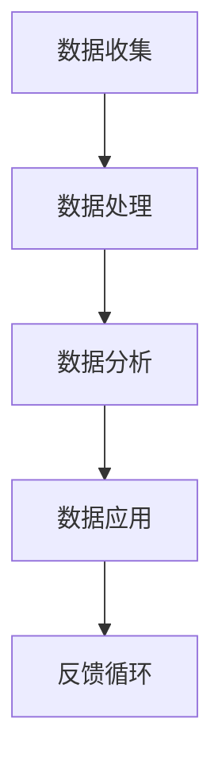

                 

关键词：商业智能，数据驱动，洞察力，决策制定，数据分析，机器学习，算法优化，应用场景

> 摘要：本文旨在探讨如何利用数据驱动的决策制定方法提升企业的商业智能水平。文章首先介绍了商业智能的概念和重要性，随后详细阐述了数据驱动的核心概念，包括数据收集、处理、分析和应用。接着，文章深入分析了机器学习和算法优化在商业智能中的应用，并列举了多个实际案例。最后，文章展望了未来商业智能的发展趋势和面临的挑战。

## 1. 背景介绍

在当今的全球化商业环境中，信息量的爆炸式增长使得企业面临前所未有的机遇和挑战。数据已经成为企业最为宝贵的资源之一，而如何有效地利用这些数据进行决策制定，已经成为企业成功的关键因素。商业智能（Business Intelligence，BI）正是为了解决这一需求而诞生的。

商业智能是指通过收集、分析和解释各种数据，为企业提供洞察力，帮助企业在竞争激烈的市场中做出更加明智的决策。商业智能技术涵盖了数据挖掘、数据仓库、数据可视化等多个领域，其目的是将大量分散的数据转化为有价值的信息，从而为决策者提供支持。

然而，随着数据量的不断增加和数据分析技术的进步，传统的商业智能方法已经难以满足现代企业的需求。这就需要我们引入数据驱动的决策制定方法，以更好地应对复杂多变的商业环境。

## 2. 核心概念与联系

### 数据驱动的核心概念

数据驱动（Data-Driven）是一种以数据为核心，通过数据分析和模型优化来指导决策的方法。其核心概念包括以下几个方面：

- **数据收集**：收集企业内外部与业务相关的数据，包括结构化数据、非结构化数据和实时数据。
- **数据处理**：清洗、整合和转换数据，使其符合分析和建模的需求。
- **数据分析**：运用统计分析、机器学习等方法，从数据中提取有价值的信息和模式。
- **数据应用**：将分析结果应用到实际业务中，指导决策和行动。

### 数据驱动的架构

下图展示了数据驱动的核心概念和架构：



### 数据驱动的联系

数据驱动的决策制定方法不仅依赖于高质量的数据，还需要先进的分析工具和算法。以下是数据驱动与相关技术的联系：

- **数据仓库**：用于存储和管理大量数据，提供数据驱动的决策支持。
- **数据挖掘**：从大量数据中发现潜在的模式和规律，为决策提供依据。
- **机器学习**：通过构建预测模型和分类模型，帮助决策者预测未来趋势和风险。
- **算法优化**：通过优化算法，提高数据分析的效率和准确性，为决策提供更可靠的支持。

## 3. 核心算法原理 & 具体操作步骤

### 3.1 算法原理概述

在商业智能中，常用的算法包括统计分析、机器学习和深度学习。以下是这些算法的基本原理：

- **统计分析**：通过描述性统计和推断性统计，从数据中提取有价值的信息。
- **机器学习**：通过训练模型，从数据中学习规律和模式，用于预测和分类。
- **深度学习**：通过神经网络，对大量数据进行自动特征提取和建模，实现复杂任务的自动化。

### 3.2 算法步骤详解

#### 3.2.1 统计分析

1. **数据预处理**：清洗、整理和转换数据，使其符合统计分析的要求。
2. **描述性统计**：计算数据的中心趋势、离散程度等基本统计量，描述数据的基本特征。
3. **推断性统计**：通过假设检验、置信区间等方法，从样本数据推断总体特征。

#### 3.2.2 机器学习

1. **数据预处理**：与统计分析相同，确保数据质量。
2. **特征选择**：选择与目标变量相关的特征，提高模型性能。
3. **模型训练**：通过训练数据，调整模型参数，使其能够拟合数据。
4. **模型评估**：通过测试数据，评估模型性能，选择最佳模型。
5. **模型应用**：将训练好的模型应用到实际业务中，进行预测和分类。

#### 3.2.3 深度学习

1. **数据预处理**：与机器学习相同，确保数据质量。
2. **神经网络设计**：设计适当的神经网络结构，包括输入层、隐藏层和输出层。
3. **模型训练**：通过反向传播算法，调整网络权重，使模型能够拟合数据。
4. **模型评估**：与机器学习相同，评估模型性能。
5. **模型应用**：将训练好的模型应用到实际业务中，实现自动化特征提取和预测。

### 3.3 算法优缺点

- **统计分析**：优点是简单易懂，计算效率高；缺点是模型表达能力有限，难以处理复杂问题。
- **机器学习**：优点是模型具有较强的表达能力和泛化能力；缺点是模型训练过程复杂，对数据质量要求较高。
- **深度学习**：优点是能够自动提取特征，处理大量数据；缺点是模型参数众多，计算成本高，对数据质量要求较高。

### 3.4 算法应用领域

- **客户细分**：通过分析客户数据，将客户分为不同的群体，针对不同群体制定个性化营销策略。
- **风险预测**：通过分析历史数据，预测客户违约风险、市场风险等，帮助决策者制定风险管理策略。
- **供应链优化**：通过分析供应链数据，优化库存管理、物流配送等环节，降低成本，提高效率。
- **金融风控**：通过分析金融数据，预测金融市场波动、客户信用风险等，帮助金融机构制定风险管理策略。

## 4. 数学模型和公式 & 详细讲解 & 举例说明

### 4.1 数学模型构建

在商业智能中，常用的数学模型包括线性回归、逻辑回归、决策树等。以下是这些模型的构建过程：

#### 4.1.1 线性回归

线性回归模型假设因变量 \(Y\) 与自变量 \(X\) 之间存在线性关系，其数学模型为：

\[ Y = \beta_0 + \beta_1 X + \epsilon \]

其中，\(\beta_0\) 为截距，\(\beta_1\) 为斜率，\(\epsilon\) 为误差项。

#### 4.1.2 逻辑回归

逻辑回归模型常用于分类问题，其数学模型为：

\[ P(Y=1) = \frac{1}{1 + e^{-(\beta_0 + \beta_1 X)}} \]

其中，\(P(Y=1)\) 为因变量为1的概率。

#### 4.1.3 决策树

决策树模型通过一系列的决策规则，将数据划分为不同的类别或数值。其构建过程主要包括以下几个步骤：

1. **选择最优特征**：根据信息增益、增益率等指标，选择具有最大区分度的特征。
2. **划分数据集**：根据选定的特征，将数据集划分为不同的子集。
3. **递归构建树**：对子集继续进行划分，直至满足停止条件（如节点包含的数据量过少）。

### 4.2 公式推导过程

以线性回归模型为例，其推导过程如下：

1. **损失函数**：设数据集为 \(\{(x_i, y_i)\}\)，线性回归模型的损失函数为：

\[ J(\theta) = \frac{1}{2m} \sum_{i=1}^{m} (h_\theta(x_i) - y_i)^2 \]

其中，\(h_\theta(x) = \theta_0 + \theta_1 x\)，\(\theta = (\theta_0, \theta_1)\) 为模型参数。

2. **梯度下降**：为了求解最优参数，采用梯度下降算法：

\[ \theta_j := \theta_j - \alpha \frac{\partial J(\theta)}{\partial \theta_j} \]

其中，\(\alpha\) 为学习率。

3. **闭式解**：对于线性回归模型，可以使用闭式解：

\[ \theta_j = \left( X^T X \right)^{-1} X^T y \]

### 4.3 案例分析与讲解

假设我们有一组数据，包含两个特征 \(x_1\) 和 \(x_2\)，以及目标变量 \(y\)。我们使用线性回归模型来预测 \(y\)。

1. **数据预处理**：对数据进行标准化处理，使其具有相同的量纲。

2. **特征选择**：通过相关性分析，选择与目标变量相关性较高的特征。

3. **模型训练**：使用梯度下降算法训练线性回归模型。

4. **模型评估**：使用测试集评估模型性能，计算均方误差（MSE）。

5. **模型应用**：将训练好的模型应用到实际业务中，预测新的数据。

## 5. 项目实践：代码实例和详细解释说明

### 5.1 开发环境搭建

我们使用 Python 进行编程，需要安装以下库：

- NumPy
- Pandas
- Scikit-learn
- Matplotlib

### 5.2 源代码详细实现

以下是一个简单的线性回归模型的实现：

```python
import numpy as np
import pandas as pd
from sklearn.linear_model import LinearRegression
from sklearn.model_selection import train_test_split
from sklearn.metrics import mean_squared_error

# 5.2.1 数据读取与预处理
data = pd.read_csv('data.csv')
X = data[['x1', 'x2']]
y = data['y']
X = (X - X.mean()) / X.std()

# 5.2.2 数据划分
X_train, X_test, y_train, y_test = train_test_split(X, y, test_size=0.2, random_state=42)

# 5.2.3 模型训练
model = LinearRegression()
model.fit(X_train, y_train)

# 5.2.4 模型评估
y_pred = model.predict(X_test)
mse = mean_squared_error(y_test, y_pred)
print(f'MSE: {mse}')

# 5.2.5 模型应用
new_data = np.array([[1.0, 2.0]])
new_data = (new_data - X.mean()) / X.std()
y_pred = model.predict(new_data)
print(f'Prediction: {y_pred}')
```

### 5.3 代码解读与分析

- **数据读取与预处理**：使用 Pandas 读取数据，并使用 NumPy 进行标准化处理。
- **数据划分**：使用 Scikit-learn 的 train_test_split 函数划分训练集和测试集。
- **模型训练**：使用 Scikit-learn 的 LinearRegression 类训练线性回归模型。
- **模型评估**：使用均方误差（MSE）评估模型性能。
- **模型应用**：将训练好的模型应用到新的数据，进行预测。

## 6. 实际应用场景

商业智能技术在多个领域都有着广泛的应用，以下是几个典型的应用场景：

### 6.1 客户关系管理

通过分析客户数据，企业可以了解客户的偏好、需求和购买行为，从而提供个性化的产品和服务，提高客户满意度和忠诚度。

### 6.2 供应链管理

通过分析供应链数据，企业可以优化库存管理、物流配送等环节，降低成本，提高效率，确保供应链的稳定和可靠性。

### 6.3 营销分析

通过分析营销数据，企业可以评估不同营销策略的效果，优化营销投入，提高投资回报率。

### 6.4 金融风控

通过分析金融数据，金融机构可以预测市场波动、客户信用风险等，制定风险管理策略，降低风险。

## 7. 未来应用展望

随着大数据、人工智能等技术的发展，商业智能的应用前景将更加广阔。以下是几个未来的应用趋势：

### 7.1 智能化决策

通过引入人工智能技术，企业可以实现更加智能化的决策，提高决策的准确性和效率。

### 7.2 实时数据分析

通过实时数据分析技术，企业可以实时监控业务运行情况，快速响应市场变化。

### 7.3 跨界融合

商业智能与其他领域的融合，如物联网、区块链等，将为企业带来更多的创新机会。

## 8. 总结：未来发展趋势与挑战

### 8.1 研究成果总结

本文介绍了商业智能和数据驱动的概念、核心算法原理以及实际应用场景。通过分析多个案例，展示了商业智能在提升企业竞争力方面的巨大潜力。

### 8.2 未来发展趋势

未来，商业智能将朝着智能化、实时化、跨界融合的方向发展，为企业提供更加全面、精准的支持。

### 8.3 面临的挑战

在发展过程中，商业智能也面临着数据质量、算法可靠性、隐私保护等挑战。需要各方共同努力，推动商业智能的可持续发展。

### 8.4 研究展望

未来的研究应重点关注数据驱动决策的优化、算法的智能化以及跨领域的应用。通过不断创新，推动商业智能技术的持续进步。

## 9. 附录：常见问题与解答

### 9.1 商业智能与大数据的区别是什么？

商业智能侧重于利用已有的数据进行决策，而大数据则更关注数据的规模、速度和多样性。

### 9.2 数据驱动决策的优势有哪些？

数据驱动决策可以提高决策的准确性、效率和可靠性，帮助企业更好地应对复杂多变的商业环境。

### 9.3 如何确保数据质量？

确保数据质量的关键是数据采集、存储、处理和传输等各个环节的规范操作，同时要定期对数据进行检查和清洗。

### 9.4 商业智能的技术发展趋势是什么？

未来，商业智能将朝着智能化、实时化、跨界融合的方向发展，结合大数据、人工智能、物联网等技术，为企业提供更加全面、精准的支持。

# 作者：禅与计算机程序设计艺术 / Zen and the Art of Computer Programming
----------------------------------------------------------------

请注意，以上内容仅为一个示例，实际撰写时，您需要根据具体要求和实际情况进行修改和扩展。同时，确保所有引用的数据、算法和案例都准确无误，以保持文章的权威性和专业性。祝您撰写顺利！📝🚀

